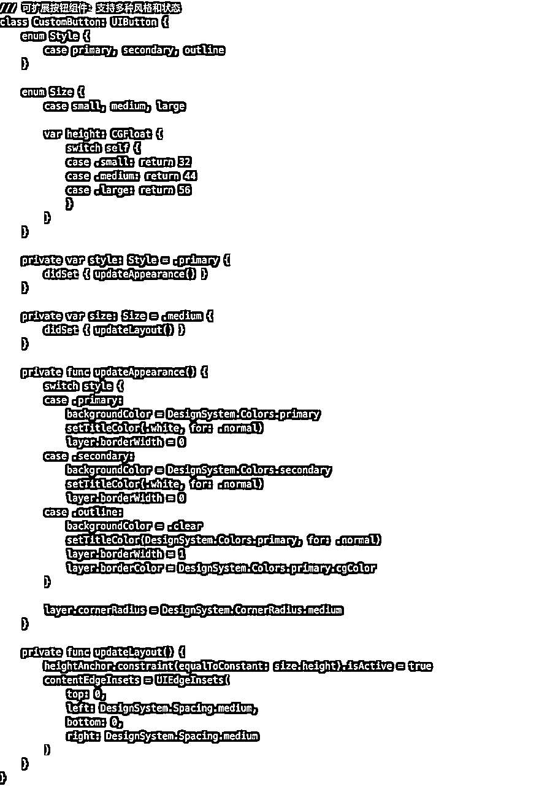
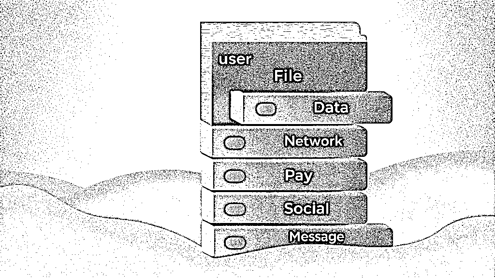
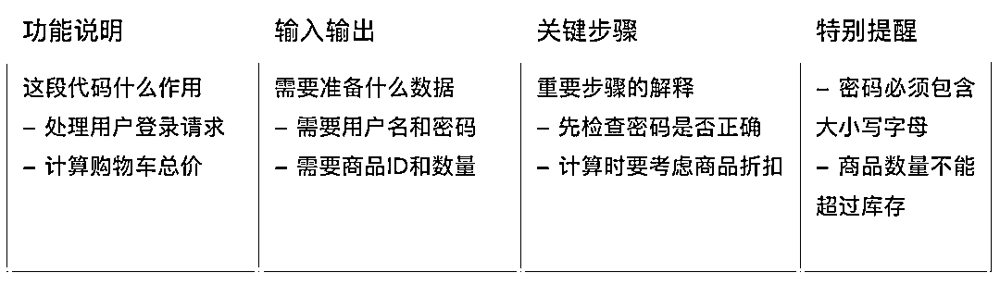

# 深度解读：AI编程的工程化与技术突破

> 来源：[https://chaojifeng.feishu.cn/docx/ROKgdTmcmoxholx2lpkcL8SJndd](https://chaojifeng.feishu.cn/docx/ROKgdTmcmoxholx2lpkcL8SJndd)

大家好，我是超级峰，现居北京，是一个不知名的产品经理。

在过去 3 个月与 Cursor 的结伴编程中，我这个 iOS 开发小白成功从 0 到 1 开发并上架了 4 款 App （如下图）。这段经历不仅让我深刻体会到了 AI 编程的魅力和 Apple 开发生态的强大，更让我看到了一条通往 AI 编程未来的发展路径。

在这一次次从 0 到 1 的开发过程中，我发现很多功能模块其实是重复的，但每开发一款新的 App，我都需要让 Cursor 重新实现一遍这些功能。

虽然可以让 Cursor 参考之前项目的代码，但这种方式不仅繁琐，而且由于 AI 在处理复杂逻辑时容易产生"幻觉"，可能会引入潜在的问题。

得益于我之前在互联网公司担任产品经理的经验，我对代码的框架、封装、组件等概念有着较为深入的理解。

我深知这些概念的本质，就是将重复出现的内容进行统一封装，以便在不同场景中复用，从而确保逻辑的一致性，提高维护效率，并加快开发速度。

基于这样的认知，在开发第 4 款「鸭霸单词」App 时，我开始尝试大量的组件化封装工作。我主要从以下两个方面进行实践：

1、界面组件化

虽然市面上已经有许多成熟的界面框架，但这些框架往往会增加项目的复杂性，即使是 AI 也很难完全理解和正确使用。一旦出现问题，由于框架的全局性影响，排查和解决起来会更加困难。

再加上我本身是 iOS 开发新手，因此我选择了一个更务实的方案：借助 AI 来帮助我实现一系列独立的界面组件。

以新用户引导页为例，我深知一个优秀的引导页界面往往决定了用户的第一印象。因此，我将新用户引导页面封装为独立的「界面组件」（如下图）。

这种轻量级的封装方式不仅让我能在不同页面中快速复用，更重要的是可以轻松地将其迁移到其他项目中，通过简单替换关键信息就能快速实现完整的「引导页」功能。

组件封装

组件使用

考虑到产品识别度，我还专门设计了「主题配色」组件文件，用于统一管理每个产品的整体配色方案。

这样的设计让 Cursor 在进行产品配色设计时能够保持全局视角，同时也方便在不同产品间快速迁移，只需调整少量关键配色即可（如下图）。

这两个实例很好地展示了轻量级「组件化」在 AI 辅助开发过程中的优势：既保持了代码的简单清晰，又实现了功能的复用。

试想一下，如果在开发多个产品后需要增加一个通用功能，而每个产品都要重新开发一遍，这无疑会是一场开发效率的噩梦。

2、业务组件化

如果说「界面组件化」关注的是用户可见的交互层面，那么「业务组件化」则专注于底层的业务逻辑实现。

这种模式在我们日常使用的应用中随处可见。以「微信支付」为例，它能够在应用的任何需要支付的场景下无缝运作，这背后正是依靠了业务组件化的技术。

通过封装统一的「支付组件」，确保了所有支付场景都使用相同的业务逻辑实现（如下图）。

红包支付

转账支付

小程序支付

这种组件化的优势在于，当需要新增「云闪付」等支付方式时，只需在核心组件中添加新的支付逻辑，所有已集成支付功能的场景就能自动获得这个新特性。

对于一款商业化应用而言，除了核心功能外，「支付」无疑是最重要的功能模块之一。它不仅是验证产品需求的重要手段，更是帮助开发者持续获得正向反馈的有效途径。

所以，我选择将「支付」作为业务组件化的首个试点，并在「鸭霸单词」App 中完成了实践（如下图）。

组件封装

组件使用

通过这种组件化方案，能够在新产品中快速集成「支付」功能，避免了重复开发这些通用业务逻辑的工作。这正是我所认为的「业务组件化」的核心价值。

在过去一个月的探索中，这两种组件化思路（界面组件化和业务组件化）其实都遵循着同一个核心理念：抽象 👉 封装 👉 复用（如下图）。

而经过我近一个月的实践、思考以及同行交流，我似乎窥见到了 AI 编程领域未来发展的路线，再回顾当下自己在尝试探索的具体事物，一幅产业发展的路径像画卷一样徐徐展开。

作为 AI 编程领域的参与者，我希望接下来分享的一些思考和展望，能为大家带来全新的视角与启发。

# 驾驭 AI 编程：从无序走向规范

如果你已经开始使用 AI 编程，那在第一次开发产品时，一定遇到过这样的困惑：不知道该从哪里开始，是先创建一个文件夹，还是从其他地方入手？

这个问题的答案在不同开发场景下会有很大差异。如果你是开发网页产品，可能创建完文件夹后，通过一次 AI 对话就能看到明显的进展。

但如果你选择开发 iOS App，仅仅创建文件夹并告诉 AI "帮我写一个倒计时功能"，很可能会遇到项目无法运行调试的情况。

相比之下，如果你先通过 Xcode 创建完整的项目框架和文件结构，再进行 AI 编程，后续的开发过程会顺畅得多。

说明：Xcode 为 Apple 提供的官方 App 开发工具

这种差异的根本原因在于，每个成熟的高级编程平台（如 iOS、Android）都有其特定的项目规范体系。以当前 AI 的认知水平，仅凭一个空文件夹，它很难准确理解和提供符合这些规范的完整项目结构。

虽然对专业的 Apple 开发工程师来说，这可能不是什么大问题。但随着 AI 编程的普及，必然会有越来越多非技术背景的创作者加入这个领域。如何更好地服务这些"小白用户"，将成为 AI 编程工具的核心竞争领域。

我认为，对这些新手用户来说，目前最迫切的需求是「标准与服务化」：

*   一套无需深入思考就能遵循的开发标准

*   可以快速接入的各类组件化服务

何为“标准”

"标准"是指为每个主流编程语言制定的统一工程项目规范。

在这样的标准框架下，用户只需要在预设的项目结构中进行模块化开发，清晰地知道功能代码、配置参数等应该放置的位置，无需再为项目结构困扰。

何为“服务化”

"服务化"是指基于 AI 能力提供的一套即插即用的组件框架体系。这种服务化体系主要体现在两个层面：

1.  界面样式服务化

*   提供可视化的模板预览和选择

*   一键应用整体设计风格

*   确保产品视觉体验的一致性

*   类似于主题皮肤的概念，但更加系统化

1.  功能模块服务化

*   整合各生态系统的成熟服务

*   支持一键接入常用业务功能

*   包括支付、登录、消息通知等核心服务

*   AI 自动处理服务接入的技术细节

虽然在传统编程领域已经存在各种标准和组件，但如何在 AI 编程时代让这些宝贵的积累更好地服务于新一代开发者，这是我们面临的重要课题。

我认为，将主流的项目标准和组件框架融入 AI 编程是必然趋势。未来，AI 将接管这些标准和框架的具体实现，而用户则可以更专注于业务创新。这构成了 AI 编程发展的一个重要方向 —— 「工程化路线：构建AI友好的开发标准」。

与此同时，以 Cursor 为代表的另一个发展方向同样重要，即通过持续的技术创新来强化 AI 的代码生成能力 —— 「技术路线：提升AI的代码创造力」。

接下来，我将为大家详细展望这两条发展路线未来3年的发展前景，希望能为大家提供有价值的洞察与思考。

# 工程化路线：构建AI友好的开发标准

对于非技术人员而言，一套完善的开发标准至关重要。然而，当前的 AI 编程领域却普遍缺乏统一的项目规范，这无疑为新用户带来了不小的挑战。

以 App 开发为例，新手往往需要先掌握各平台特有的开发工具（如 iOS 的 Xcode 或 Android 的 Android Studio），学习如何创建项目结构，理解基础开发流程。这些专业知识对于技术人员来说或许习以为常，但对非技术背景的用户而言却是一道难以逾越的鸿沟。

这种较高的技术门槛，不仅影响了新用户的学习积极性，更阻碍了那些对 AI 编程充满热情却缺乏技术基础的"小白"用户参与其中。这无疑限制了 AI 编程在更广泛群体中的普及和发展。

### 2.1 建立开发标准的必要性

#### 2.1.1 降低 AI 编程门槛

从上图可以清晰地看到，AI 编程的学习门槛呈现出明显的分层现象：对于具备技术背景的工程师群体来说，入门成本最低；其次是产品经理、设计师等互联网从业者；而对于其他群体，则面临着较高的学习成本。

有趣的是，这种学习门槛并非来自于"如何让 AI 生成代码"本身，而是源于更基础的开发环境搭建。例如，当一位新手想要开发一款 App 时，即便打开了 AI 编程工具，也往往会在"如何创建第一个可运行的项目"这个阶段就遇到困难。

因此，如果 AI 编程工具能够内置一套标准化的项目框架，让用户通过简单配置就能自动生成规范的代码结构，将极大地改变这种状况。

在这种模式下，用户可以专注于产品的设计，而将具体的技术实现交给 AI 来完成。这不仅能显著降低普通用户的参与门槛，更有望吸引大量非技术背景的创新者加入，从而推动 AI 编程生态的繁荣发展。

这种设想并非空中楼阁。事实上，我们已经看到一些产品正在这个方向上进行积极探索。比如 bolt 已经开始提供基于不同技术栈的项目模板，而 lovable 则更进一步，直接提供了完整的产品模板。

这些实践证明，通过合理的标准化和模板化，确实可以大幅降低 AI 编程的使用门槛，让创新不再受限于技术背景。

#### 2.1.2 强化 AI 编程的能力

通过为每个主流开发语言定制开发标准，能够从工程方面提高 AI 的编程能力， AI 能够清晰地知道不同情况的功能需要写到哪些目录下，这种信息对于 AI 来说本质上也是一种背景知识。

如果你也遇到过在 AI 编程过程中，通过自然语言描述一个改动时，AI 却改动到了无关的代码，导致出现莫名其妙的问题，这种现象的根本原因在于 AI 的工作方式：它并不像人类那样能够准确理解每个指令的边界，而是通过"猜测"来选择最可能正确的方案。就像一个初学者在完成任务时，有时会过度发挥，把不需要改的东西也一并改动了。

可能你会有疑问，那 AI 编程在不断“猜测”，这种编程效率如何保证，并且未来能否有所改善？

我认为未来 1～2 年内 AI 编程的精准性将得到大幅度改善。幸运的是，目前像 Cursor 此类的主流 AI 编程工具，在实际使用过程中每次改动的代码可用率能够保持在 80% 左右，只有少数情况才需要进行反复调整。

剩余的 20% 出现代码改动不符合预期的情况，排除掉人为表述需求不明确之外，我认为大部分情况是因为「AI 编程的约束条件的不足」 。

正如前面说到的，AI 大模型的能力本质通过"猜测"来选择最可能正确的方案，我们用一个简单的比喻来更好的理解这个事情：

想象你在玩骰子游戏，想要猜中特定的数字。用传统的六面骰子时，猜中的机会只有六分之一（约 16.67%）。这就像是让 AI 在没有任何规范的情况下编程，需要在众多方案中"碰运气"。

如果换成只有两面的硬币，并且你要猜的数字就在这两面之中，那么猜中的机会就提高到了二分之一（50%）。这就像是为 AI 提供了基本的开发规范，让它的选择范围变小了。

如果最后我们把游戏简化到极致：只保留唯一的一个选项，就像是一个只有一面的圆片，上面写着你要猜的数字，那猜中的概率自然就是 100%！这就像是我们为 AI 提供了完整的开发标准，它就能非常确定地知道每个功能应该如何实现。

基于这个思路，我们完全可以在现有 AI 大模型技术的基础上，通过工程化手段来提升 AI 编程的准确性。

具体来说，就是通过增加合理的约束条件，提供清晰的开发规范标准，让 AI 在编程时有更多的参考依据。这种方式有望在短期内将 AI 编程的准确率提升到 95% 左右。

如果再考虑到 DeepSeek 等新一代 AI 大模型带来的技术突破，未来达到 99% 的准确率也并非遥不可及。

至于剩下的 1%？这恰恰体现了人机协作的价值 —— 就像即使是最优秀的程序员偶尔也会犯错一样，AI 和人类的最佳状态应该是互相配合、相互补充，共同创造出更完美的代码。

#### 2.1.3 提高同行交流的效率

当前 AI 编程领域面临着一个有趣的现象：大家都在使用 AI 工具编程，但由于缺乏统一的开发标准，交流往往停留在工具使用的层面。即便是实现相同的功能（比如支付系统），每个开发者可能都采用了不同的项目结构和实现方式。这种"百花齐放"的状态虽然体现了灵活性，却也在无形中制造了交流障碍。

而建立统一的开发标准，就像是为整个 AI 编程社区创建了一种共同语言。当大家都在相同的框架下工作时，就能跳过"你的项目结构是怎样的"这类基础问题，直接深入到业务逻辑的探讨中。这不仅能显著提升交流效率，更重要的是能促进知识的有效传递和经验的快速积累。

从长远来看，这种标准化带来的不仅是个人能力的提升，更是整个 AI 编程生态的进化。就像工业标准化推动了现代制造业的飞跃，统一的开发标准同样将成为推动 AI 编程行业走向成熟的关键力量。

### 2.2 构建 AI 友好的开发标准：从实践中的思考

在过去 3 个月的 AI 编程实践中，每次启动新项目时，都要重新向 AI 解释项目结构和开发规范，就像反复培训新员工一样，让我深感困扰。这种重复性的工作不仅耗时，更容易导致项目标准的不一致。

更值得注意的是，即便是同一个 AI 助手，在不同时间处理相似需求时，也可能会采用迥异的实现方式。这种"见招拆招"式的编程方式，虽然体现了 AI 的灵活性，却也为代码维护和团队协作带来了不小的挑战。

这让我不禁想到传统软件开发中的一个重要经验：工程化标准对于提升开发效率和代码质量起着决定性的作用。在大型项目中，统一的开发规范不仅能够降低沟通成本，更能确保项目的可维护性和可扩展性。

那么，在 AI 编程的新时代，我们是否也需要建立一套适应 AI 特点的工程化标准？这个标准应该如何平衡 AI 的创造力和规范性？带着这些问题，我开始探索一套能够既充分发挥 AI 优势，又便于人类理解和维护的开发标准体系。

#### 2.2.1 项目结构标准：让代码像整理好的抽屉一样清晰

在与众多 AI 编程开发者交流中，我发现一个普遍现象：当使用 AI 开发新项目时，很多人会困惑于如何组织项目结构。即使是同一个 AI，在不同时间也可能会用不同的方式组织相似的功能代码。这种不一致性不仅影响了后期维护，更让 AI 在持续开发时容易产生混乱。

就像一个杂乱的抽屉，东西虽然都在里面，但找起来却很困难。而一个整理得当的抽屉,不仅看起来清爽,拿取物品也更加便捷。

项目结构的标准化,本质上是为 AI 提供了一个清晰的"地图"。这种标准化带来三个关键价值:

*   降低认知负担：清晰的结构让 AI 和开发者都能快速定位代码位置

*   提高代码质量：标准化的结构有助于保持代码的一致性和可维护性

*   加速开发效率：AI 能基于统一结构更准确地生成和修改代码

以一个典型的 iOS 应用为例，我们可以尝试建立这样的标准目录结构:每个目录都需要配备详细的 README.md,明确说明该模块的职责范围、使用方式、注意事项、代码规范（如下图）。

其实，目前已经有一些产品正在向着这些方向努力，致力于降低用户使用的门槛，只是目前在行业内发展得不均匀，让我们来一起了解看看。

值得欣慰的是，行业内已经有一些产品开始在降低 AI 编程门槛方向上进行积极探索。虽然目前行业发展还不平衡，但已经出现了一些很有启发性的尝试。

以技术导向的产品为例，bolt 就提供了一个很好的思路。这款产品致力于打造一站式的网站开发体验，已经推出了基于主流技术栈（如 Vue、React 等）的项目模板。

开发者只需选择对应的技术模板，就能立即开始 AI 编程，省去了与 AI 反复沟通项目初始化细节的时间（如下图）。

虽然目前 bolt 的项目模板还主要停留在技术框架层面，但这种标准化的尝试已经显示出了巨大的潜力。可以预见，随着产品的不断优化，这些模板会逐步融入更多的业务属性，比如按照不同产品功能组织的目录结构等。

bolt

1.选择编程语言（以网站开发为主）

2.自动完成项目初始化

而在业务导向方面，lovable 则走出了一条更为大胆的路径。从其网站标语"Idea to app in seconds"就能看出，这款产品将"快速实现"作为核心价值主张。

不同于 bolt 的技术模板，lovable 直接提供了完整的产品模板（如下图），这种方式特别适合非技术背景的创作者和新手用户。当然，这种预设的产品模板也可能会在一定程度上限制那些有明确定制需求的开发者。

lovable

1.选择产品模板（以网站为主）

2.自动生成初版产品

可以想象，未来的 AI 编程在不同层次的用户群体中，基于项目工程目录方向，会有如下的发展空间，而这些发展方向的共同目标都是为了强化AI 编程的能力以及提高人类管理代码的能力。

通过对 bolt 和 lovable 这些产品的观察，我们可以清晰地看到 AI 编程正在向着更加友好和标准化的方向发展。但是，不同经验水平的开发者在使用 AI 编程时，面临的挑战和需求是不同的。

新手可能需要现成的模板来快速入门，普通开发者可能更关注如何高效管理项目结构，而专业开发者则可能需要更灵活的定制能力。这启发我思考：如何针对不同群体设计差异化的工程化标准？让我们来展望一下这些极具潜力的发展方向：

通过为不同层次的开发者提供相应的工程化标准，我们实际上是在构建一个更加成熟的 AI 编程生态。这种标准化不是简单的规范制定，而是一次深层的变革，将在多个维度产生深远影响。

基于我在 AI 编程领域的实践经验，我认为这种工程化标准的建立将为整个开发生态带来四个层面的根本性改变：

这种标准化不仅是对项目结构的简单规范，更是一种对 AI 编程行为的有效约束。通过将 AI 的创造空间限定在已知的标准范围内，我们巧妙地利用了 AI "概率游戏"的特性 - 当可能的选择越少，AI 做出正确决策的概率就越高。

工程化手段与 AI 本身的技术特点完美结合，让 AI 编程更可控、更高效、更可靠。正如前文所述，这种约束不是限制，而是助力。它让 AI 能够更专注于业务逻辑的实现，而不是在项目结构的组织上反复思考。

标准化实践将成为连接 AI 能力与工程实践的重要桥梁，为 AI 编程的大规模应用奠定坚实基础。

#### 2.2.2 界面设计标准：统一的视觉语言让产品更专业

当让 AI 设计界面时，它往往会根据当时的上下文生成不同风格的代码。比如同样是按钮组件，在不同页面可能会有不同的样式实现。这种不一致不仅影响了产品的专业度，更让用户体验变得零碎。

更重要的是，当项目逐渐扩大，这种界面风格的不一致性会带来更大的问题：维护成本急剧上升，用户体验参差不齐，品牌识别度降低。这就像一个产品团队里每个设计师都在用自己的审美标准工作，最终产出的产品缺乏统一的视觉语言。

建立统一的界面设计标准，本质上是为 AI 提供一个"设计系统"。这种标准化不仅能确保产品的一致性，更能显著提升 AI 生成界面代码的准确性。就像给 AI 一个设计规范手册，让它在生成界面代码时有明确的参考标准。

建立统一的界面设计标准，本质上是为 AI 提供一个完整的"设计系统"。这个设计系统或许可以从解决当下的视觉统一问题开始，逐步建立起可持续发展的设计规范。

就像搭建乐高积木，我们可以先设计一些基础组件，再根据实际使用情况不断完善。我们从基础设计规范、多场景适配和可扩展设计三个层面着手，探索如何在产品发展中保持统一的设计语言：

（1）基础设计规范

基础设计规范 - 代码示例

（2）多场景适配

多场景适配方案 - 代码示例

（3）可扩展设计

可扩展设计 - 代码示例

在探索界面设计标准的过程中，一个令人兴奋的想法逐渐清晰。如果我们能建立一个"界面主题市场"，让 AI 编程变得像换手机主题一样简单，会是怎样的场景？

想象一下，当一个普通创作者想要开发一款 App 时，不需要从零开始设计界面，也不需要深入理解复杂的设计系统。他们只需要像逛商店一样，浏览各种精心设计的界面主题包，找到符合心意的风格，一键应用后，AI 就能基于这套设计系统生成专业的界面代码（如下图）。

主题市场概念图

这种模式将彻底改变 AI 编程的使用门槛。专业的设计师可以将自己精心打造的设计系统上传到市场，普通创作者则能轻松获取这些高质量的设计资源。AI 在这个过程中，就像一个得到了明确指令的设计助手，能够准确地按照选定的设计系统来实现界面。

更令人期待的是，这种模式将催生一个充满活力的生态系统。专业设计师通过分享设计系统建立个人品牌和影响力，普通创作者能够快速打造出专业级的产品，而 AI 则在这个过程中不断学习和适应不同的设计风格，提供越来越准确的实现。这是一个多方共赢的良性循环。

这就像是在 AI 编程工具中内置了一个"设计师团队"。创作者只需要专注于产品功能和业务逻辑，选择心仪的界面风格，描述功能需求，AI 就能基于选定的设计系统，生成既专业又统一的界面。这不仅大大降低了入门门槛，也确保了产品的专业品质。

这种"界面主题市场"的设想，本质上是在为 AI 编程构建一个更友好的创作环境。它让专业的设计资源能够被更多人使用，也让 AI 能够更好地服务不同层次的创作者。这不仅是对界面设计标准的延伸，更是对 AI 编程民主化的一种探索。在这个愿景中，人人都能轻松创造出专业级界面的产品，而 AI 则成为连接创意与实现的最佳助手。

这种界面设计的标准化不仅是对界面视觉的规范，更是对 AI 设计决策的有效引导。通过预定义的设计系统，我们既确保了产品的专业性，又提升了 AI 生成界面代码的准确性。

这种工程化手段与 AI 的能力相辅相成，让 AI 编程在界面开发领域发挥出更大的价值。

#### 2.2.3 常用功能标准：像搭积木一样复用成熟方案

"我想加个登录功能"，"需要实现一个支付系统"，"要做个图片上传"...每天都有无数开发者在向 AI 描述这些常见需求。

有趣的是，即便是同样的登录功能，AI 可能会生成风格迥异的代码，有时甚至会遗漏一些安全验证的细节。这就像是每次都要重新发明轮子，既耗时又容易出错。

建立常用功能的标准化实现，本质上是在为 AI 提供一套"功能积木"。这些经过充分验证的标准实现，不仅包含了最佳实践，还考虑了各种边界情况和安全措施。

功能积木化概念图

想象一下乐高积木的玩法：每个积木都经过精心设计，可以完美契合。当我们需要搭建一个作品时，不需要从原材料开始制作，只需要选择合适的积木，按照说明书组合即可。同样的道理，如果我们能够将常用功能模块化，开发者就能像搭积木一样，轻松组合出完整的应用。

我将一些常用的可以涉及到功能封装的逻辑进行了总结，可以提供大家一个参考，让你们能直观的了解到哪种功能比较合适进行功能模块化：

（1）基础功能模块

（2）业务功能模块

如果说界面主题市场是在解决"看"的问题，那么智能功能市场就是在解决"用"的问题。想象一个功能模块的在线市场，创作者可以像在应用商店浏览 App 一样，查看每个功能模块的详细说明、使用场景和最佳实践。

当开发者选定需要的功能模块后，AI 不仅能够自动集成这些模块，还能根据项目的具体需求进行智能适配。比如，在集成支付功能时，AI 会自动询问是需要支持哪些支付方式，然后生成相应的实现代码。

更重要的是，这个市场将是动态进化的。随着越来越多的开发者使用和反馈，每个功能模块都会不断优化和完善。AI 能够学习这些最佳实践，在未来的开发中提供更好的建议和实现。

#### 2.2.4 文档注释标准：让代码会"说话"

当让 AI 生成代码时，它往往专注于实现功能，却忽略了产品的可维护性。有时是复杂逻辑没有详细解释说明，有时是整个功能模块缺少使用文档。

这就像收到一个没有说明书的精密仪器，即使它能工作，使用者也很难理解它的工作原理，更不用说后续的维护和扩展了。

建立文档注释标准，本质上是让代码具备"自我表达"的能力。这种标准不仅是为了当下的开发者能够理解代码，更是为了让 AI 在未来的开发中能够准确理解代码的意图和使用方式。

我认为一个比较完整的文档注释标准至少包含如下三个层面，让我们一起看看它们分别承担怎样的作用：

（1）代码级注释

代码级注释 - 代码示例

（2）流程级说明

流程级说明 - 代码示例

（3）文档级说明

文档级说明 - 代码示例

这种多层次的文档注释体系，就像为代码构建了一个清晰的"知识地图"。每一个功能模块都配备了完整的说明书，不仅让开发者能够快速理解和使用，更重要的是为 AI 提供了准确的上下文信息。

比如在一个电商系统中，当我们实现支付功能时，文档体系会包含：

*   代码注释解释每个支付方法的具体实现

*   mermaid 流程图展示从下单到支付完成的完整流程

*   模块交互图说明支付系统与订单、库存、账户等模块的关联

*   最佳实践指导如何处理各种支付场景

不仅对于个人开发者，在企业开发环境中，完善的文档注释体系不仅是代码的说明书，更是一个强大的知识共享平台。

每个企业都面临着类似的挑战：新人如何快速上手？核心开发者离职后知识如何传承？多个团队并行开发时如何高效协作？这些问题的背后，本质上都是知识传递和共享的问题。

正如前文所述，AI 编程的质量很大程度上取决于它对上下文的理解深度。完善的文档注释体系不仅是知识的记录，更是 AI 理解代码的重要参考系统。它就像一位经验丰富的导师，不断指导 AI 在复杂的业务场景中做出正确的决策。

在可预见的未来，随着文档注释体系的不断完善和 AI 技术的持续进步，我们有理由期待 AI 能够成为一个越来越智能的开发伙伴。

它不仅能理解代码的字面含义，更能把握代码背后的业务意图和设计思想；不仅能生成代码，更能维护整个知识体系的完整性和时效性。

这种进步将推动软件开发进入一个新的智能协作时代，在这个时代中，知识不再是静态的记录，而是能够自我更新、自我完善的智能资产。

#### 2.2.5 版本管理标准：让产品迭代有迹可循

"如何撤回本次更改"，"这次改动影响了哪些功能"，"之前的实现方案是什么样的"，诸如此类的情况，这些是 AI 编程过程中最常见的困扰。

虽然市面上已经有 Git 这样强大的版本控制工具，但对于普通开发者来说，专业的版本管理工具就像是一座"技术高墙"，需要投入不少的精力与时间去学习和掌握。

这种学习成本往往会让创作者望而却步，最终只能依赖简单的"撤销"功能来管理代码变更。

建立友好的版本管理标准，本质上是要让"记录历史"这件事变得简单自然。

就像智能手机的相册会自动为照片分类并生成故事集锦，AI 编程工具也应该能够自动记录和管理产品的演进历程。

一个好的版本管理系统应该像一位细心的记录者，不仅记录下每一次改动，更要理解这些改动背后的原因和影响。

当开发者专注于产品开发时，AI 应该能够在背后默默地完成这些工作：自动识别重要的改动节点，理解功能模块间的关联，预判改动可能带来的影响，甚至主动生成改动说明文档。

这种智能化的版本管理方式将极大地降低使用门槛，开发者不再需要关心复杂的版本控制概念，而是能够通过更自然的方式来管理产品的每个版本。

想象这样的场景：当你在开发产品时，AI 会自动为每个重要的功能节点创建"快照"，每个“快照”都将记录变动原因总结、改动的内容总结以及代码差异，并且能够通过 AI 对话的方式就能很自然的进行不同版本的操作与查阅：

*   "我想回到上周的版本"

*   "让我看看这个功能之前是怎么实现的"

*   "为什么之前实现没有问题，现在怎么不行了"

*   "上个版本改动了哪些地方"

更重要的是，这种简单的版本管理方式将复杂的技术细节交给了AI，开发者不再需要学习 Git 的原理和命令，让开发者能够专注于产品创造以及更大胆地进行尝试复杂的功能开发。

因为知道随时可以轻松回退，开发者就不必担心改动会"搞砸"什么。这种心理上的安全感，会极大地激发创作的积极性和创新精神。

总而言之，通过工程化手段构建AI友好的开发标准，不是为了增加开发的复杂度，而是通过科学的流程来提升AI开发质量。就像优秀的制造流程不会影响效率，反而能够提升产品品质一样。更重要的是，标准化的开发流程为 AI 编程提供了清晰的约束和指引。

如果说 DeepSeek R1 模型的成功是将人类的主导权还给 AI ，换取了AI 更多的自主思考的空间得到的结果；那么我认为 AI 编程的未来，将在于如何将足够强大的 AI 在垂直领域内通过工程化的约束标准，在约束后的发挥空间内，不断提升开发精准性，来保证高水平的工业化输出水准。

正如前文所述，AI 大模型的能力本质是一场"概率游戏"。通过标准化的开发流程，我们实际上是在缩小 AI 的决策空间，提供更明确的上下文信息。当 AI 知道在开发周期的每个阶段应该关注什么、如何确保质量、需要输出什么内容时，它的表现会更加可靠和专业。

# 技术路线：提升AI的代码创造力

随着近期 OpenAI o 系列的推出，以及 DeepSeek 的爆火出圈。 AI 大模型从指令型快速发展到推理型，即从原先依赖于过程激励、强依赖于预训练数据的模式，逐渐过渡到结果激励、纯强化学习，AI 拥有了更深度的思考能力以及超越人类智能的可能性。

过程激励和结果激励的区别在于训练方式：

这种从过程激励到结果激励的转变，就像是从"按图施工"到"给出目标"的升级。不再局限于人类的思维定式，而是让 AI 真正发挥其计算优势，探索出可能更优的解决方案。

这也是为什么 DeepSeek 等新一代 AI 能展现出惊人的推理能力，它们不再是简单地模仿人类的解题过程，而是找到了属于自己的思考方式。

从最初的代码补全工具（如 GitHub Copilot），到现在能够进行复杂对话和自主执行操作的 IDE（如 Cursor、Windsurf），再到最新出现的可以完整承担初级开发工作的 AI 助手（如 Devin），以及 DeepSeek 展现出的卓越代码理解与生成能力，AI 编程工具在短短两年内实现了堪比十年的跨越式发展。

DeepSeek 的成功给我们带来了重要启示：AI 不仅要能写出代码，更要能够理解代码背后的逻辑，具备推理和思考能力。这种能力的提升，将极大地改变开发者与 AI 之间的协作方式，使 AI 从一个被动的工具转变为主动的智能助手。

经过近几个月对 AI 编程行业的发展观察，我想向大家分享下我对未来三年 AI 编程发展的思考。我认为会有五个关键方向值得关注，每个方向都蕴含着新的机遇：

### 3.1 需求解析：从被动执行到主动思考

目前的 AI 编程助手往往倾向于直接按照用户的指令执行，缺乏对需求的深度思考和分析。例如，当用户说"写一个微信"这样笼统的需求时，AI 可能会直接开始编写代码，而不是引导用户进行需求分析和任务拆解。

推理型大模型（如 DeepSeek）的出现，标志着 AI 已经开始具备初步的深度思考能力。这种能力对于 AI 编程来说至关重要，因为它能够帮助开发者更好地理解和拆解复杂需求。

通过观察当前 AI 编程工具的发展轨迹，我发现一个有趣的现象：虽然 AI 已经能够生成相当复杂的代码，但在需求理解和任务拆解方面仍显得较为机械。

这让我想到了软件工程中经典的“康威定律”(Conway's law)，即系统设计往往反映了组织的沟通结构。同样的道理，AI 编程助手的输出质量很大程度上取决于它对需求的理解深度。

基于这个观察，我认为未来 AI 编程助手的语义理解能力将在以下几个层面实现突破：

这种进化不仅将改变 AI 编程助手的角色定位，更会重塑整个软件开发流程。AI 编程助手将从单纯的代码生成工具，转变为具有咨询能力的开发伙伴。它能够：

*   在接收到模糊需求时，主动提出澄清性问题

*   基于历史项目经验，预警潜在的技术风险

*   提供多个可行的技术方案，并分析各自的优劣

*   自动生成需求文档和技术规划

这种转变的关键在于 AI 要建立起对软件工程完整生命周期的认知，而不是仅仅关注代码层面。正如 DeepSeek 展现的那样，当 AI 具备了推理能力，它就能在更高的抽象层面上思考问题，从而提供更有价值的帮助。

### 3.2 全局代码认知：突破规模限制的智能理解

当前 AI 在处理大型代码文件时（超过 1000 行），往往会出现理解能力下降、响应速度变慢等问题。这严重限制了 AI 在大型项目中的应用效果。

上下文感知能力是 AI 编程能力的核心竞争力之一。它不仅关系到代码的连贯性，还影响到整体项目的协调性和可维护性。

如果能够让 AI 像人类工程师那样建立分层次的代码认知体系，是否就能突破当前的限制？带着这个思考，我尝试勾勒出一些可能的发展方向。

这将从根本上改变开发者处理大型项目的方式。AI 将从简单的代码编辑工具，进化为具有全局视野的开发助手。它能够快速理解项目架构和目录结构，识别核心业务模块；适应团队的编码规范和风格，发现代码质量问题；理清系统间的调用关系，预警潜在的集成风险。

这种进化的关键在于赋予 AI "全局认知"的能力，就像经验丰富的技术主管一样，能够同时把控项目整体、代码细节和系统集成。这将大大提升开发效率，降低项目维护成本。

### 3.3 企业级协作：驾驭复杂项目的 AI 助手

在企业级开发中，最大的挑战往往不是写代码本身，而是如何应对"复杂性"。一个看似简单的需求背后，可能涉及十年前的遗留代码、错综复杂的系统调用、严格的企业规范以及多个团队的协作（如下图）。这些"复杂性"不仅考验着开发团队，也成为了 AI 编程工具的一大挑战。

想象一个典型的企业级项目：一个支付系统的小改动，可能要同时修改支付网关、订单系统、用户钱包、对账系统等多个服务；代码库里既有十年前用 PHP 写的老接口，又有去年用 Go 重构的新服务。

每个团队都有自己的代码规范，新来的同事光熟悉项目就要一个月。在这样的环境中，AI 如何才能真正地帮助开发团队？

这种转变的关键，不在于 AI 能写出多少代码，而在于它能否真正理解企业开发中的"潜规则"，并通过智能化的方式串联起整个研发流程。比如在代码评审时，它不仅能看出代码本身的问题，还能理解这个改动对其他系统的影响；在解决线上问题时，它能快速定位根源，并给出考虑了各种约束的解决方案。

随着 AI 技术的不断进步，特别是在多智能体协作和系统认知方面的突破，这种转变将为企业级开发带来革命性的改变。它不仅能提高开发效率，更重要的是能够帮助团队更好地驾驭复杂项目，让企业级开发不再是一场噩梦。

### 3.4 跨平台原生开发：AI 赋能的多端转换范式

相信很多开发者都遇到过这样的场景：当一个 iOS 应用取得了不错的市场反响后，希望快速推出 Android 版本。这时我们通常面临两个选择：要么通过 Android 方式从头开发，要么采用 Flutter 这样的跨平台方案重构整个应用。

这两个选择都不够完美。比如一个用 Swift 开发的 iOS 应用，如果要在 Android 上重新开发，需要从零开始写一遍。不仅工作量翻倍，还要考虑如何保持两个平台的体验一致性。而选择 Flutter 虽然能一次开发多端运行，但可能无法充分利用像 iOS 的 Face ID 或 Android 的指纹识别这样的平台特色功能。

随着 AI 技术的发展，特别是 DeepSeek 这样的模型展现出的代码理解能力，为跨平台原生开发带来了新的可能，我认为未来 AI 编程将让跨平台原生开发成为可能，并且将下如下三方面持续发展：

这种转变的关键，在于让 AI 真正理解各个平台的技术特点和最佳实践。它不是简单地把 iOS 代码翻译成 Android 代码，而是要理解代码背后的业务逻辑，然后用最适合每个平台的方式来实现。

随着 AI 技术的不断进步，特别是在代码理解和生成方面的突破，这种智能化的跨平台开发方式将为原生开发带来新的可能。它既保留了原生开发的灵活性和性能优势，又通过 AI 的能力大大降低了多端开发的成本，这与传统跨平台框架的思路完全不同。

### 3.5 质量保障：AI 驱动的全方位测试体系

软件质量保障一直是开发过程中的重要挑战。当前的 AI 编程工具虽然能够发现简单的语法错误，但对于更复杂的业务逻辑问题却往往无能为力。这就像是一个初级程序员，只会检查代码是否能编译通过，却无法判断代码是否真正满足业务需求。

新一代 AI 模型在代码理解方面的突破，为质量保障带来了全新的解决方案。AI 不再局限于简单的语法检查，而是能够理解更深层的业务逻辑，帮助开发者构建更可靠的软件系统。

这种转变的关键，在于让 AI 真正理解代码背后的业务逻辑。它不是简单地检查代码规范，而是要理解：

*   这段代码是否完整实现了业务需求

*   在高并发场景下是否会出现问题

*   系统的性能瓶颈在哪里

*   如何设计最有效的测试策略

随着 AI 技术的不断进步，特别是在代码理解和测试生成方面的突破，这种全方位的质量保障体系将极大提升软件开发的可靠性。它既能在开发阶段及早发现问题，又能通过自动化测试确保系统的稳定性，这与传统的测试方法相比有着质的飞跃。

# 总结

如果说以「提升AI的代码创造力」为代表的技术路线提高了 AI 编程能力的天花板，那么「构建AI友好的开发标准」为代表的工程化路线则极大降低了 AI 编程的使用门槛。这两条路线并非孰优孰劣，而是反映了不同的发展理念和市场需求。

技术路线更关注如何突破 AI 编程的能力边界，让 AI 能够理解更复杂的业务逻辑，生成更可靠的代码。这条路线需要持续的技术创新和大量的研发投入，这也是为什么以 Cursor 为代表的海外企业会选择这个方向 —— 他们拥有更强的技术积累和创新基因。

工程化路线则更注重如何降低 AI 编程的使用门槛，让更多人能够参与到产品开发中来。这种标准化、模块化的思路，与中国互联网企业一贯追求的快速迭代、降本增效的理念不谋而合。通过建立友好的开发标准，让 AI 编程能够更好地服务于实际的业务需求。

有趣的是，这两条路线虽然侧重点不同，但最终都指向同一个目标：让 AI 编程真正服务于创新。技术路线通过提升 AI 能力来扩展可能性，工程化路线则通过降低门槛来释放创造力。它们就像是一枚硬币的两面，共同推动着 AI 编程的发展。

对于关注 AI 编程领域的小伙伴们来说，现在正是一个难得的机遇期。无论是对技术创新充满热情，还是对工程实践更感兴趣，都能在 AI 编程的发展浪潮中找到自己的位置。

重要的是要提前了解这些发展方向，找准自己的兴趣点和优势领域，未来的收获可能会远超预期。

当然，以上的分析和展望都源于个人的实践经验和业内交流，难免有所局限。技术发展永远充满变数，我们需要保持开放和学习的心态。

如果您对 AI 编程的未来有不同的见解或更多的想法，也欢迎一起交流探讨。毕竟，正是在不断的交流和碰撞中，我们才能看得更远，走得更稳。