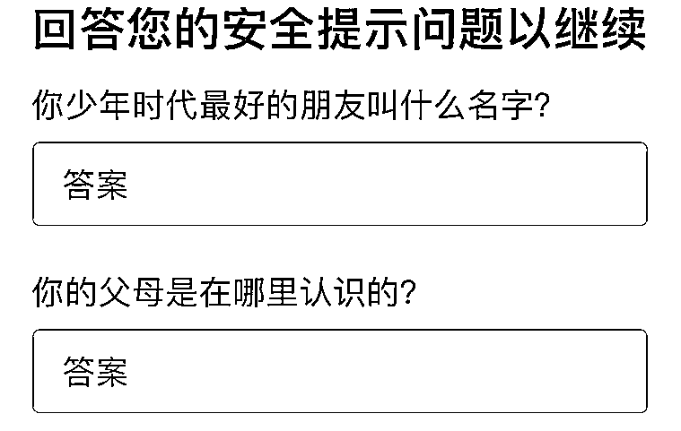
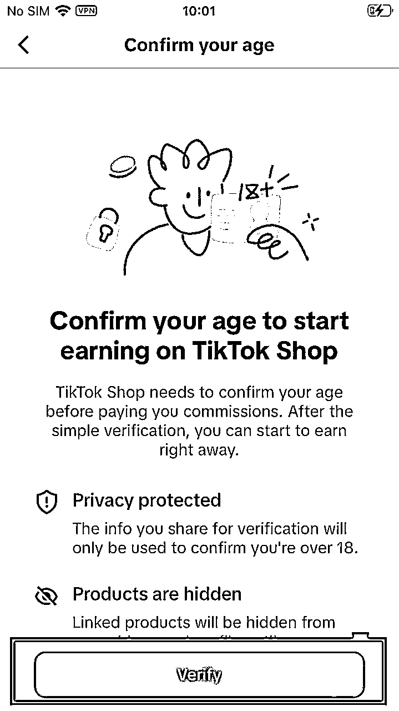
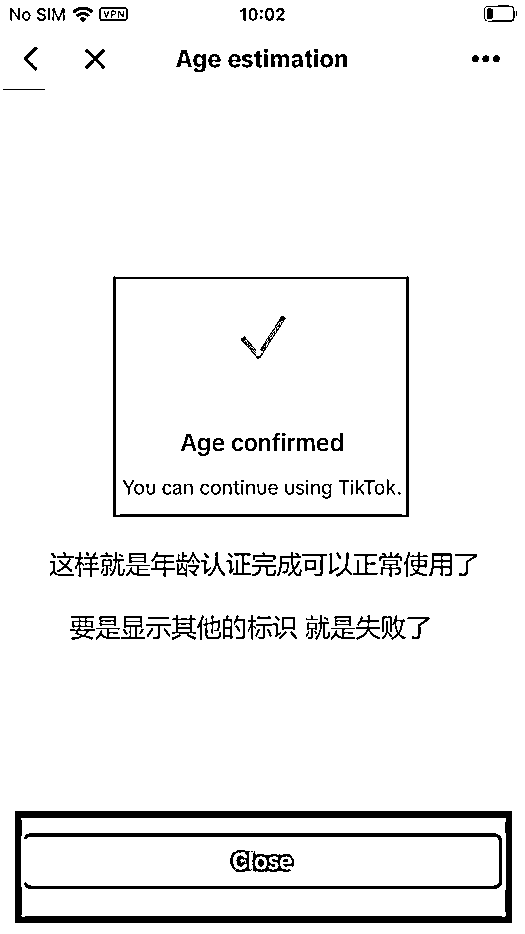

# 【项目实操全流程sop】TikTok短视频带货项目经验分享

> 来源：[https://nwtzrwy6dsb.feishu.cn/docx/RazTd3tehoIXUVxjEoGctKYrnCf](https://nwtzrwy6dsb.feishu.cn/docx/RazTd3tehoIXUVxjEoGctKYrnCf)

我是阿瑞，大学期间创业两次

讲讲我的个人经历吧，大二期间，我在学校卖电影票，组建了一个15人的小团队。每天下课后，我们都会印好传单，去宿舍楼里发，或者到食堂门口宣传我们的公众号。赶出来是常有的事，被同学冷眼、拒绝也是常事，被主任训也是常事。但好在我们坚持下来了，不再需要向父母要生活费（生活费2000多）。虽然过程艰难，但还是很欣慰。记得冬天下雪时，我采购了大量滑雪票，因为口罩原因，学生无法出宿舍，票全被挤压，导致亏了3万多。

大三开始，我做了大学期间的第二个项目——App拉新。这个项目很简单，就是让同学下载软件并认证大学生。例如，京东一单可以给我们18元，我给代理15元，自己赚3块钱。因为大二做票务期间积累了大量学生资源，我做了很多App推广，比如中国银行、滴滴等等。当时这个项目还挺挣钱的，具体没细算，但我一个月生活费能花5000多，每周经常和朋友一起吃饭，基本上都是我请客，就这样我边上学边挣钱，大学期间过得还是很滋润的。

毕业后我就开始做电商了，一做就是3年，在2023年写过一篇精华帖：《小红书起号开店出单全流程+半个月无人直播如何做到15万的sop》如果认真看完那篇帖子的，并且执行下去的，或多或少，是赚了的。23年和24年是小红书变现元年，当时也赚了一波快钱。

# 为什么开始做tiktok？

我经历了完整的小红书变现周期：从一开始搬运抖音视频就能出单，到需要混剪视频，再到实拍视频、无人直播，最后到半无人直播，直至真人直播。我走过了整个红利期，这段经历确实让我收获不少。

当时，小红书的流量很可观，随便在抖音搬运视频，然后一个号一天发 30 条视频，就能轻松出单，一天最高能卖 4 - 5 万块钱，而且视频都不需要剪辑，直接搬运就行。后来，搬运被判违规，就开始混剪视频。因为小红书用户中 70% 是女性，30% 是男性，消费购买力呈现 “女人> 小孩 > 老人 > 狗 > 男人” 的规律，所以只要抓住女性需求的商品就能有市场。

当时我还带了一个二十多人的团队一起做，但项目太暴利，员工学会方法后就离职单干了，根本留不住人。

后来尝试真人实拍，可我没成功，流量只有几百播放量，根本没人看，也没有出单。坚持了两个月，在快发不起工资的时候，无人直播兴起。最长一次直播持续了 300 个小时，当时电脑一直没关，烫得都不敢摸。最高一场直播下来能卖几十万。不过直播卖女装退货率很高，基本上在 50% 以上，再加上我自己囤货，家里积压了几百件衣服，但即便如此还是挣了一些钱。

后来发展到半无人直播，最后只剩下真人直播，到这个阶段我就放弃小红书了。

我是一个喜欢踩风口的人。雷军曾说过：“站在风口上，猪都能飞起来。”这句话一点不假，真的非常真实。所以，我一直在寻找新的风口。现在，我找到了——跨境电商。

国内电商的竞争实在太激烈了：卖1万退8000、仅退款、同行恶意竞争、低价竞争，甚至亏本打品。这些让我感到很无奈。我注重的是利润，GMV（交易总额）对我来说并没有太大意义。

比如在抖音，千川会严格限制你的投放效果，几乎让你被卡死——想让你赚多少钱就只能赚多少钱，数据也被锁得非常死，让你总是在赚钱、保本和亏钱的边缘徘徊。

淘宝、天猫这样的货架电商，如果没有供应链和资金积累，根本不要碰；拼多多更是一个“仅退款”的重灾区。国内电商确实卷到让人喘不过气，所以我开始把目光转向海外电商。

tiktok目前不需要营业执照，个人账号就可以做，不需要囤货发货售后，会剪视频就行。

# 一、项目战绩

这是做的泰国tiktok，泰国单账号单月卖13万单，总gmv98万，佣金7.9万，换算成人民币16000元。我做了大约10个号，跑通的有7个号。平均佣金3000-5000。

整个过程并不是很顺利，跑通这个项目大约用了1个月，我感觉我能踩到的坑都踩完了。

第一项是网络问题。网络容易卡顿，要么就是用着用着就没法上网了。为了研究这个问题，我尝试了市面上的很多网络，发现必须科学上网，普通网络根本不能用。光在网络这一项上，就亏了差不多3000块钱。

第二项是账号问题。一开始注册完账号后，不能挂车。我又研究了很久，发现账号发视频时容易出现零播放，或者个位数播放的情况。剪辑一个视频花了1个小时，结果却没有播放，这种感觉真的太难受了。

第三项是视频抄袭问题。有一次，我很用心剪辑完一个视频，结果被提示“涉嫌抄袭”，原创度不够，直接被扣了24分，账号还被封了。

就在我快要放弃的时候，无意间发的一个视频竟然出单了！当时真的很开心，于是我熬夜开始剪辑视频，并把视频发到不同账号上，观察播放量。经过不懈努力，最终单账号日均达百单，而且很稳定。10个账号的成功率大约在70%左右，每个账号每天发三条视频。剪辑一条视频大约需要30分钟。

# 二、小白先从哪个国家开始做起

做 TikTok，第一个难题就是市场的选择。目前能做 TikTok 的国家并不是那么多，我会把它们分成三大类：第一类是东南亚；第二类是欧洲，其中主要是英国、西班牙；第三个是美国。如果是你，你会选择哪个国家？

我做过很多国家，比如泰国、越南、菲律宾、马来西亚、英国和美国。

马来西亚，一开始我以为是发展中国家，结果发现它是发达国家，而且汇率是中国的 1.2 倍。马来西亚的商品种类较少，但利润很高，不过，选品并不容易。我好不容易在国内选好的商品，上架到精选联盟后，发现根本没有这个商品可选。马来西亚的女生都有带头巾的习惯，这跟她们的习俗有关。所以选品可以先看当地的人文环境，基本上每个国家我都出单了。

美国的账号购买成本非常高，美国账号粉丝最低需要 5000 粉，也不能是机刷号，必须是纯自然流视频，所以一个账号需要 1200 - 1500 元，这个成本让我有点吃不消。但是它有好处，美国人有钱，国内做的人少，因为门槛相对较高。美区一单的利润能到 30 元人民币。所以，如果你有资金，可以试试做美区。

英国虽然利润高（汇率是中国的十倍），但容易封号。我在英国市场被封了几个账号，好在还能提现，但需要等待 3 个月后才能到账。英国封号和当地国家政策有关，他们要求需要原创视频，混剪不行，所以要求实拍；对网络要求也严格，一旦察觉位置错误、网络错误，直接就封号了，所以在英国做需要谨慎一些。

菲律宾和越南市场也不理想，这些国家出单难。因为这些国家人口比较少，没有网络购物的习惯，越南、菲律宾主要城市交通还可以，但是其他城市，无法邮寄快递，交通不发达，所以出单比较难。

根据比较，泰国更适合新手，和中国的人文环境很相似，我很多朋友出国旅游都喜欢去泰国。泰国的交通也相对其他东南亚国家发达一些，泰国人多，流量也大。我最高的一条视频，就发了几条视频，就有 160w 播放。

# 三、tiktok需要准备什么？

## 1、准备1-3台苹果手机

然后用电脑下载爱思助手。无论你使用任何网络，TikTok官方都能清楚地识别你的设备和网络在中国，风控你就像呼吸一样简单。不过，拥有一个干净的手机环境依然非常重要！

## 2、安卓手机

除了华为和荣耀虽然也能用，但操作起来不够方便。专业的跨境商家通常会选择苹果设备。推荐使用iPhone 8及以上的型号，建议优先选择iPhone 11。苹果8以上的设备已经足够满足需求。

# 四、tiktok如何正确刷机？

# 五、tiktok如何配置网络环境

这里有很多坑，我感觉自己简直是踩坑大神。刚开始弄好网络后，因为没有选择当地国家和地区，语言还是中文，这肯定会被平台一眼看出是假的。我的账号好几个都是零播放，后来才发现问题出在没有修改地区和语言设置上。

上方图片以美国为例，这是模拟当地国家环境的配置方法。按照图片的配置操作即可。如果是其他国家，你需要将设置改为对应的国家和地区。

配置完成后，就相当于模拟成了当地国家的环境。至于科学上网的问题，可以自行搜索相关解决方案。因为国家规定，这个部分没办法详细讲解，还请理解。

# 六、tiktok如何配置海外苹果id

## 1、这里非常重要

一定要严格按照步骤操作，否则ID很容易被盗取。一定要选择独立ID，不要使用共享ID。

因为我自己就吃过这个亏，因为一开始买的共享id，导致账号零播放。共享id，是共享一个位置的，你自己网络没问题，是当地国家的，但是和你同一个id的人，不一定是当地国家的。就很容易出现违规。

## 2、需要修改海外ID，以防止被他人盗用。具体操作如下：

1）使用浏览器打开苹果官网：https://appleid.apple.com

（此处以手机浏览器为例，PC端的步骤大致相同。）

2）登录您的苹果ID。

3）输入密保信息，完成身份验证。

出现安全提示时，请选择“其他选项”。

然后选择“不升级”。

可以修改的地方：

*   提示：如果在修改密码时无法点击“继续”，说明密码格式有问题（请确保密码长度为9位以上！）。

*   Apple ID：这是用于修改ID邮箱的，建议您尽快修改！

# 七、tiktok如何注册海外账号

## 1、输入网址：

https://outlook.live.com/mail/0/?nlp=1&cobrandid=ab0455a0-8d03-46b9-b18b-df2f57b9e44c

注册outlook海外邮箱，这个不需要科学上网就可以注册。

然后输入密码，输入你想做的国家，，选好年龄，即可注册成功。

outlook也是有坑的，最好用谷歌浏览器打开，注册完出现账号异常，我就是用的其他浏览器，注册完账号，发现用不了，直接说我账号地址有问题。后来研究完发现，用谷歌浏览器很稳定不会出现这个问题。

# 八、tiktok如何登录账号

## 1、选择第一个选项，登录账号

将您刚刚注册好的账号填入其中，然后完成登录。

## 2、登录时需要进行验证，选择两个相同的选项即可完成。

## 3、登录后，您需要稍作调整：

## 4、如果登录账号时需要接收验证码

可以使用以下网站接收验证码：http://rainloop.ardi.wang

# 九、tiktok如何账号养号

## 1、优化个人资料

1）用户名与头像：选择一个易记且具有辨识度的用户名，同时设置一个清晰、有吸引力的头像。

2）个人简介：在个人简介中明确表达你的内容定位，使用简洁、吸引人的文字介绍自己。

3）头像、简介、昵称：都需要认真设置，让别人快速了解你是谁、你拥有什么资源，以及你想销售的产品。例如，可以突出“源头工厂厂家”“自有货源”等优势，同时也可以融入个人兴趣爱好，如“喜欢喝奶茶”“喜欢逛街”“分享自用好物”。

## 2、选择合适的内容定位

1）明确主题：选择一个自己感兴趣且能够长期创作的领域，例如美食、旅行、健身或教育等。确保你的内容能够持续吸引目标受众，形成稳定的粉丝群体。

2）创作风格统一：保持视频的风格、剪辑和配乐等元素的一致性，增强账号的辨识度，让观众一眼就能认出你的作品。

此外，当天可以刷15-30分钟的视频，从中找到自己想要推广的商品。然后使用百度翻译或有道翻译将内容翻译成当地语言，千万不要直接使用中文。请记住，你现在要以一个“外国人”的身份去模拟外国的环境和语言。

不同网址给到的语言是不同的，所以多几个网址去尝试，建议不要一开始就发视频，养两天账号后再发视频。

## 3、成年人脸验证

养号完成后需要验证成年认证（这个很重要，严格按照步骤操作，否则发视频没有流量）。

这里我也踩过坑，因为我网络不稳定，然后我验证成年人，结果失败了。真的服了，这样账号就废了。没法用了，没法挂车了。所以大家自己的网络要稳定，再去验证。还有就是找个年纪大点的，找个爷爷叔叔的，这个成功率会高一些。

# 十、tiktok如何选品

## 1、方法一：在第三方软件进行选品，平台叫fastmoss，一个月会员费800块钱

随便点开一个商品给大家讲解一下：

首先，看销量趋势。如果销量呈直线上升趋势，这种商品就值得跟品。其次，需要进一步分析商品的流量来源：

商品卡流量还是短视频流量？根据流量类型选择推广方式。

查看商品是否由自营账号发布，还是由达人带货。

## 2、方法二：站内选品

去刷视频，把自己的手机刷成带货号的视频，看看他们在卖什么，然后你就可以跟着卖同款。点击链接查看销量，销量低于3000的就不要选。同时，记得查看近期的评价。

可以点开他的账号查看他近期卖了哪些商品，然后根据这些商品来选择自己跟品。尽量找粉丝较少的账号，选择那些低粉丝但有爆款的商品。

## 3、方法三：精选联盟选品

去刷精选联盟，这个方法很好用。找到你想做的品类后，先查看售价。建议新手选择150泰铢以内的商品，这样容易出单。

以上方为例，首先看售价，再看销量。销量要在2000以上，已经被验证过的商品就是可以做的爆款。其次，检查一下商品是否有库存，这一点非常重要。如果商品不错但没有库存，一旦流量爆发，你就可能后悔了。

# 十一、tiktok如何找素材：

把视频都下下来，然后混剪就可以了

# 十二、tiktok如何混剪视频

混剪视频就相对很简单了，直接用国内的剪辑手法剪辑即可，加一些滤镜，加一些贴纸，加一些特效，加一些文字就能过审。

# 十三、tiktok如何发布视频

和抖音一样，点击中间加号，然后发布视频即可。

# 十四、tiktok如何提现

你需要绑定当地国家的第三方，平台这个就相当于国外的支付宝，很安全的，平台只抽取百分之1。

然后到账后提现到自己的银行卡，一般一个工作日就能到账，提现金额根据当地汇率计算。最后，预祝大家都能在跨境电商和TikTok上获得满意的结果。

# 十五、结语

最后，感谢Erik对我文章的指导。

最后想说一句，TikTok特别适合个人想做副业的人，这个平台能很快获得结果。相比于国内电商，虽然需要投流，20天才有可能出单，但如果有经验，一周就能出单，不需要营业执照，而且都是纯利润。无需发货、囤货，也不需要投流，完全依赖自然流量。