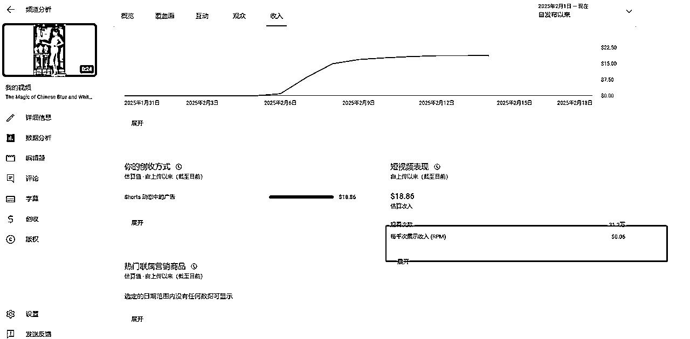

# 三个月从0~1开通YouTube高级YPP复盘帖

> 来源：[https://sq0dwuhqqog.feishu.cn/docx/WANkdIYcYox3t7x2vODcLO9Tn0c](https://sq0dwuhqqog.feishu.cn/docx/WANkdIYcYox3t7x2vODcLO9Tn0c)

# 引言

大家好，我是茜茜，一名体制内老师，去年3月在@方波妮的推荐下加入生财，4月底在生财通过AI写作赚到第一桶金，5、6月份短暂的实现副业月入过万；而后参加YouTube航海和私教陪跑，历时三个月（从11月6号，到 2月6号），开通YouTube 高级YPP ；经历了自我探索期- YouTube航海期- YouTube私教陪跑期三个成长阶段。

10月底亦仁出了超级标，@方波妮十一月初带着我和几个小伙伴开始尝试做YouTube shorts ，是生财最早一批做YouTube的圈友。

11月6号晚上我开始发布第一个视频 ，长达一个月的自我探索期，

12月初跟着YouTube shorts航海，航海结束后，停更半个月，

1月初报名生财私教陪跑，在@方波妮@Gary曹淦教练团队的陪伴下开始复更。

1月22号，单个达人秀变身视频总播放350万，涨粉7000+，单个视频就达到开初级YPP的条件。

春节期间，摸索到爆款的逻辑后，后续通过多条小爆款成功开通了YPP

这次分享主要出于以下三个目的：

一是给自己做个复盘，顺带给大家提供一点避坑细节。

二是给大家打打气，鼓鼓劲，坚持就是胜利。

三是对过程当中帮助过我的教练团队，生财平台表示感谢。

YouTube航海手册和私教陪跑手册已经非常全面的将YouTube全流程介绍的非常完整，生财也已经有了很多非常详细的教程帖，关于如何制作视频这方面，就不再赘述了。

生财手册：

大航海 https://scys.com/view/docx/CkoidgbmBoL4LkxehYsckPwlnUd

文章主要分享我这三个月在不同赛道、不同阶段辗转摸索的思考和复盘，给圈友们打打气，补充一些心力，如果能提供一些灵感就更好了，感兴趣的话可以继续往下

# 项目经历：

接下来我会分三个阶段介绍我的开通YPP的过程：

1、自我探索期- 2、YouTube航海期- 3、YouTube私教陪跑期

### 1、自行探索期

在第一阶段，两个比较重要的感受是：

*   起步时低播放是客观规律

*   正确的赛道和对标是一切的基础

11.6号开始做猫咪跳舞视频，11.8号写了生财龙珠悬赏帖子分享制作经验：

视频举例：

找到猫咪跳舞制作软件，制作很简单，上手难度很低，但流量一般。起号时不要太焦虑，几千播很正常，起步时低播放是客观规律。

11.11号放弃了猫咪跳舞，开始做宝宝走秀

视频举例：

可参考航海手册https://scys.com/view/docx/CkoidgbmBoL4LkxehYsckPwlnUd

或者直接定位原帖：@竹子

放弃猫咪跳舞是因为把当时对标的几个账号放到Youtube货币化检测网站去检测后，发现有一半账号没有开通创收，且这些账号本身不是新账号。

经验：在找对标账号时，记得先去网站检测是否已经开通创收。（但检测结果不一定准确，一两个月内刚开通YPP的账号可能检测不到） 正确的赛道和对标是一切的基础

*   查看博主是否开通创收：https://ytlarge.com/youtube/monetization-checker/cn

*   收益估算与数据查询工具：https://www.viewstats.com/

11.27 号@方波妮提醒我，宝宝走秀的视频被批量设置为面向儿童，于是停止做儿童类视频

反思： 选赛道时要注意，小孩的视频容易被设置为面向儿童，虽然有收益，但偏低，因为儿童类视频可接受的商业广告较窄，不太适合普通人做。

### 2、YouTube航海期间：

在第二阶段，两个比较重要的感受是：

*   不要同时对标多个赛道！

*   孤军奋战难以为继，环境很重要

11.29号～1.4号做变身秀

选择原因：生财有完整的教程，不需要从头摸索，省时省力；赛道生命周期较长，达人秀在美国本身是老牌节目； 受众面广，不少这类账号流量很大且都成功开通了YPP，说明是可行的。

难点：赛道卷，竞争大，需要挖掘细分爆款赛道；优质变身上手有一定的难度，要不断研究精进。

视频举例：

可参考航海手册https://scys.com/view/docx/ZzpKdxWrcowIB6xBzUVcHY3Knff#PyHadp5UEoytcrxwhw7cONNQ

在变身秀期间做了几个动物故事，发在同一个账号，类似下面这种：

难点： 做动物故事时，ChatGPT处理角色一致性不是很成熟，需要反复抽卡，难度不大但是费时。

解决办法：现在有圈友用SD来做，能实现全自动化且效果很好，有兴趣的小伙伴可以研究。

视频举例：

可参考航海手册https://scys.com/view/docx/CkoidgbmBoL4LkxehYsckPwlnUd

或者直接定位原帖：@土豆君

反思：

第二阶段风格差异大，很可能导致账号的受众中途变了。对标账号只能有一个

Youtube 会在账号持续稳定更新十五天左右给第一波推流，中间是观察期，所以稳定的更新频率也很重要。

航海结束后，进入了倦怠期，有半个月的时间没有更新视频。

一是每天万播有点泄气，看到陆续有一些人出了爆款，很焦虑。心态没能hold住，有点崩了。

需要有一个小team或者是私教陪跑这样的团队大家互相鼓劲。补充心力很重要！

二是当时对标的达人秀账号流量出现了下滑，急需寻找更细分的赛道，但自己挖掘赛道的能力和精力不够，没有目标，团队很重要。

在这种迷茫的情况下，我得知了生财要开陪跑小组，毫不犹豫的就报名了，希望借这次机会打破僵局。

### 3、YouTube实战陪跑

在第三阶段，三个比较重要的感受是：

*   爆款的产生需要积累和铺垫

*   低头分析，数据对应着结果

*   新的赛道和玩法，可能蕴藏着惊喜

Youtube生财实战陪跑小组从1.16号开始，结合第一次教练直播对各个赛道的细致解读，以及陪跑群圈友的反馈，短暂的观望两天后，我开始尝试动物示警（上手快，当时流量大）。

视频举例：

这里必须表扬@方波妮 @Gary 曹 两位教练和生财平台，两位教练特别负责，反馈很快。整个实战陪跑期间教练团一直在探索新的玩法，并且教练会及时在航海手册更新，陪跑小组的成员都能实时查看，我觉得这一点非常棒！ 另外，私教陪跑这种小圈子也有更好的体验感，大家互相交流和分享经验，很充实，也有更强的针对性。

考虑到动物示警制作简单，生命周期较短，自己也有制作变身秀的经验，1月22号开始转做达人秀（多人变身）。

与之前的变身相比，这次的变化节奏更快，变化次数更多。多人变身天然就有更大的流量，新方向更加有技术难度，提升了门槛。

这一次比较幸运，转换赛道之后的第一个视频更新的第三天就开始爆发。

视频：

回头看，可能并不是爆款的质量有多高，而是爆款的产生需要积累和铺垫。

往往断更之后的老账号重新更新之后会有一波推流。希望断更了的小伙伴继续坚持，说不定下一个爆发的就是你！

账号没流量的时候，低头分析，数据对应着结果。 完播率和选择观看率一定程度上决定视频能爆到什么程度。我这个三百多万的视频，也是数据不行，一边播一边降，最后是73 %的选择观看率，不到100%的完播率。千万播的视频基本要做到80%以上的选择观看率，150%左右的完播率。

这两没问题，超过20天或一个月还没推流，看对标账号或对标的整个赛道的流量，如果都不行了该换赛道就得换，多尝试。

#### 开通YPP

2.6号开通高级YPP，整体频道万播0.5美金；短视频万播0.5~0.7 刀；长视频万播11.4刀。

# 收益情况

不同类型的视频因为观看群体不同，收益也不相同，根据我自己频道的情况，稍微进行了整理。大家在选择方向的时候也可进行参考。

变身秀（青花瓷），万播0.6~0.7 刀

变身秀（三人多次变身），万播0.5 刀。

变身秀（灵异类）目前也是万播0.5 刀，但我的账号以美女变身的观众群体为主，这个可能不准确。

长视频：用剪映把8~10个短视频拼接成长视频，长视频做到3分钟左右，万播11.4刀 。推流比较慢，但可以用这个方法来涨时长，也可以作为额外收益。

# 后续方向

1 后续会进行更多不同赛道的尝试，争取往长视频方向转，获得更高的收益率。目前在尝试私教陪跑手册模块五：名人解说方向的长视频；以及长短视频结合打法，单人获得更高收益的玩法。

2 后续争取和教练团队一起进行更多的探索，获取更多变现途径。

# 总结

*   YouTube是一个长期赛道，反馈较慢，要做好长期坚持的心理准备。慢就是快

shorts 流量大，但收益低，适合新手起号

长视频起号慢但收益高，老手可以来尝试，或者和shorts相结合。

*   不断尝试新的玩法和赛道，有能力的可以搭建团队

*   这篇帖子的目的是给大家补充心力，长线赛道鸡血很需要，心理按摩也很重要！

# 感谢

感谢生财提供的平台，YouTube航海打开了赚美金的大门，让我们颇有收获，私教陪跑开启更是让我们重获新生般，短短两周多开通高级YPP，真的很开心。

感谢教练团@方波妮 @Gary 曹淦 两位教练，很多新赛道新玩法是他们一手测出来并无偿分享。我个人觉得这次的小团队陪跑效果很好，满意度很高，希望生财能继续进行。

感谢上文中参考的每一个精华帖分享的小伙伴

祝愿每个小伙伴早日开通YPP