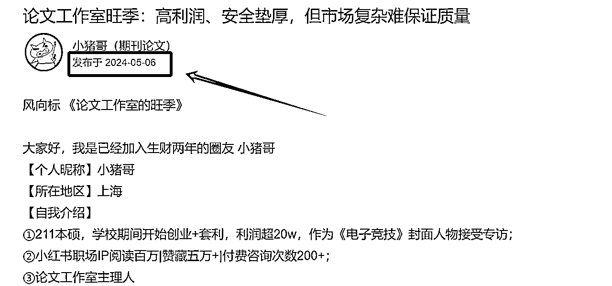

# AI写作高客单产品-来自期刊公司创始人的认知

> 来源：[https://v70d3vec3r.feishu.cn/docx/SCc2dvIAnoZ6Eqxr3mkcxEysnMc](https://v70d3vec3r.feishu.cn/docx/SCc2dvIAnoZ6Eqxr3mkcxEysnMc)

简单介绍一下小猪哥，期刊公司创始人，流量来源是小红书聚光投放，主营业务是各类期刊论文写作发表，作为多个Ai写作大型流量团队的期刊交付渠道，包括维普、万方知网的普刊、SCI、SSCI、EI国际核心等，目前已经上海全款车房。

2024年5月6日在生财发了第一篇论文的风向标，到现在9个月涉及AI写作知识付费蓬勃发展，但我最开心的是这个行业不是只有卖铲子的在赚钱，而是航海的大家都能赚回生财门票。

# 一、高客单产品是AI写作的舒适区

在AI写作赛道上，大家都卷得不行。卷内容质量、卷出稿速度，但客单价却一直上不去。为啥？因为大部分玩家都扎堆在基础写作服务里，写个文案、做个总结，客单价低得可怜。这就像是在菜市场里卖大路菜，人人都能做，利润自然薄。

但你有没有想过，硕博论文，期刊发表。尤其是核心期刊，这可是AI写作的“高端定制”业务。一篇SCI论文，从选题、写作、润色到发表，流程复杂，成本极高。一篇SCI论文的代写代投费用能轻松上万，甚至几万。这就相当于从菜市场跳到了米其林餐厅，客单价直接拉满。

为啥高客单价这么重要？因为这是AI写作业务的第二增长曲线。有了高客单价，你的利润空间就能大大提升，还能吸引更多高净值客户。比如那些科研人员、高校老师，他们对论文发表的需求大得很，而且不差钱。你想想，一个科研项目，经费动辄几十万、上百万，拿出几万块钱来搞定一篇高质量的期刊论文，对他们来说根本不是事儿。

而且，高客单价还能帮你提升品牌价值。当你能承接高价值的期刊发表业务时，客户就会觉得你的AI写作服务更专业、更有实力。这就像是给你的品牌镀了一层金，以后无论是做学术写作还是商业文案，客户都会更愿意找你。

所以，别再局限于那些低客单价的基础写作业务了。硕博论文和期刊发表，一定是AI写作的高客单价新蓝海，是Ai写作实现业务升级的关键一步。

# 二、AI写作的各类风险

生财关于AI写作的教程不要太多，今天先泼一盆冷水，圈友们在学术论文AI写作中无论是流量端还是交付端，都已经探究很深，但我把所有Ai写作的文章看完之后的感受是圈友们风险意识不够强，如何合规，如何避免风险相关内容较少，甚至《风险》很少出现作为一个精华帖的关键词所在。

目前我司碰到的风险如下：

1、抄袭风险

多的不谈，现在提示词已经能解决

方案：优化提示词，AI降低查重率

2、质量风险

AI生成的内容往往缺乏深度和创新性，容易出现逻辑混乱、数据不准确等问题。这种“伪创新”内容很难通过高质量期刊的同行评审。

在核心期刊或者硕博论文市场中，人文社科更适合用AI操作，这也是为什么很多建模类的理工科论文价格可以是人文社科的3倍及以上。

质量风险会影响录用和交付通过率，甚至会和前期许诺的时间出现滞后，客户出现退单。

方案：和高学历人才合作，学会甩单，并做好过程质量管控，做好“资本家”的前提是做好pm。

3、客户纠纷（★★★★★）

客户纠纷分为很多种，

一是学位法草案已明确将AI代写论文列为学术不端行为，情节严重者可能被撤销学位。

二是AI生成内容的版权归属尚不明确，可能引发侵权纠纷。

三是交付边界不明确，导师的认可在交付过程中占据突出地位，甚至导师对客户的偏见，都会影响到导师对于我们稿子质量的判断，争议在所难免。

方案：目前公司的法务是同济本硕多年律师转行，专业能力较强，这个地方要舍得花钱，因为灰色地带一定要做好风险管控。专业人士完善的合同可以保护作者和我们，同时为了避免纠纷，一旦发生质量或者交付认定问题，该退款就退款，不能贪财，一旦被起诉对于公司来说都是时间成本。

如果圈友们在Ai写作过程中碰到过糟心事，也可以评论区或者私信我，大家一起把风险及应对版图拼全，健康发展才是真的发展。

# 三、期刊发表业务介绍

## 1）什么是期刊？

期刊，通常被称为学术期刊或期刊杂志，是一种定期出版的印刷或电子出版物，其内容主要包含学术论文、研究报告、评论、新闻以及各类文章。它们通常在特定领域或学科内具有专业性和学术性，如科学、技术、医学、经济、社会和文化等。

#### 1、期刊标识与编号

CN：国内统一连续出版物号（国内刊号）的简称，是期刊在中国境内合法出版的标识。

ISSN、EISSN：ISSN是国际标准连续出版物编号，用于标识期刊的国际身份；EISSN则是电子版期刊的国际标准连续出版物编号。

刊号：期刊的正式出版编号，包括CN号和ISSN号等，是期刊合法出版的重要标识。

#### 2、作者与作品

专著：针对某一专门研究题材撰写的、具有较高学术水平和一定创造性的著作。

论著：带有研究性质的著作，通常包含作者的研究成果和观点。是论文的一种形式。也就是说写了一篇研究性质的论文。

译著：将外国作品翻译成中文并出版的著作。

独著：由一个人独立完成的著作或论文。

电子独著：是指通过申请电子书号出版的独立著作。这种著作通常由音像出版社或电子出版社出版，主要通过电子载体如光盘、U盘或网络平台进行传播，而不是直接用于印刷纸质书籍。

一作、二作：论文或著作的作者排序，第一作者（一作）通常是对论文或著作贡献最大的人，第二作者（二作）次之。

通讯作者：负责与期刊编辑沟通、处理稿件相关事宜的作者，通常是论文或著作的主要联系人。

#### 3、出版机构与人员

出版社：出版书籍、期刊等出版物的机构。

杂志社：出版期刊的机构，负责期刊的编辑、出版和发行等工作。

编辑：负责稿件筛选、审稿、排版等出版流程的人员。

社内编辑：指杂志社或出版社内部的编辑。

#### 4、期刊评价与检索系统

影响因子：衡量期刊影响力的重要指标之一，通常基于期刊近两年的被引频次计算得出。

三网/三大网：指中国知网、万方网、维普网

首页检索与单篇检索的区别：

①首页检索是通过官网的检索框，输入期刊的名称，可以查到期刊的信息，叫做首页检索；

②单篇检索是搜不到期刊的名称，查不到期刊的信息，只能查到单篇文章。同样的这种也是没有目录的。一般有写地方评职称不认可此类，必须要求官网首页检索，含目录和文章全篇的。

#### 5、期刊作用

1、研究生毕业要求

2、各类职称评审要求（有职称文件）

3、博士毕业要求

4、奖学金等

5、课题

6、其他

## 2）期刊都有哪些类型？

#### 1、根据时间间隔：

*   周刊（Weekly）：每周出版一次，通常是五个工作日内的某一天发行，如周一或周五。周刊通常包含最新的新闻、评论和专题报道。

*   旬刊（Biweekly）：也叫半月刊，每两周出版一次，相当于两周一期。这种发行周期可以让期刊保持较新的内容同时又不至于过于频繁。

*   月刊（Monthly）：每月出版一次，是许多学术期刊和杂志常见的发行周期。月刊可以提供深入报道和详细的研究文章。

*   双月刊（Bimonthly）：每两个月出版一次，相当于两个月一期。这种周期可以让期刊在保持一定更新频率的同时，有足够的时间来准备高质量的内容。

*   季刊（Quarterly）：每三个月出版一次，通常用于学术期刊和一些专业性较强的杂志，

*   半年刊（Semiannual）：每六个月出版一次，也就是一年两期。

*   年刊（Annual）：每年出版一次，通常在年底或次年初出版。年刊通常会包含一年内的重要研究成果和综述文章。

#### 2、按照内容分类：

*   学术期刊：主要发表学术论文、研究报告、文献综述等，通常要求作者提供严谨的研究方法和数据支持。

*   专业期刊：针对特定行业或专业领域，如医学、工程、法律等，内容通常与实践紧密相关。

*   大众期刊：面向普通公众，内容多样，包括新闻、娱乐、时尚、健康等。

*   综述期刊：主要提供对现有研究和知识的综合评述。

*   科学期刊：专注于自然科学领域的研究成果。

*   社会科学期刊：涵盖社会学、政治学、经济学、教育学等社会科学领域。

*   人文期刊：涉及文学、哲学、历史、艺术等人文学科。

#### 3、省级国家级分类：

国家级期刊和省级期刊是中国特有的分类方式，主要是根据期刊的主管单位和出版单位来划分的。

国家级期刊通常指的是由国家级单位主办或主管的期刊，

而省级期刊则是由省级单位主办或主管的期刊。这些分类在某种程度上反映了期刊的行政级别和资源背景。

#### 4、按照领域分类：

*   医学类：涵盖基础医学、临床医学、药学、护理学、公共卫生、医学教育等。

*   生物学类：包括细胞生物学、分子生物学、遗传学、生态学、进化生物学等。

*   化学类：包括有机化学、无机化学、物理化学、分析化学、生物化学等。

*   物理学类：包括粒子物理、凝聚态物理、天体物理、光学、量子物理等。

*   工程技术类：涵盖土木工程、机械工程、电子工程、计算机科学、材料科学等。

*   建筑类：包括建筑设计、建筑历史、城市规划、景观设计、建筑技术等。

*   农业科学类：包括农学、植物保护、土壤学、农业经济、食品科学等。

*   环境科学类：包括环境工程、环境化学、生态工程、环境管理等。

*   地球科学类：包括地质学、气象学、海洋学、地球物理学等。

*   数学类：包括纯数学、应用数学、统计学、概率论等。

*   计算机科学类：包括人工智能、软件工程、数据库、计算机网络、信息安全等。

*   社会科学类：涵盖经济学、政治学、法学、社会学、心理学、教育学等。

*   人文学科类：包括历史学、哲学、文学、艺术学、语言学等。

*   管理类：包括工商管理、公共管理、信息管理、人力资源管理等。

*   法学类：包括宪法、民法、刑法、国际法、经济法等。

*   教育类：包括教育理论、教育技术、教育政策、教育心理学等。

#### 5、按性质分类

正刊：期刊每年固定或有规律发表的版面，期刊按照发行周期分为半月/月/双月/季/半年/年刊，比如Journal of Controlled Release是一本半月刊，一年固定发表24期，这24期每一期都没有特定的主题，那么这24期称之为正刊。此类发表形式国内高校认可度最高。

专刊：专刊一般分为两种，一种是占用正刊版面的专刊，比如，期刊一年发布24期正刊，其中有6~8期都是有具体主题的论文专刊，这种发布形式就叫做占用正刊版面的专刊。在这种情况下，期刊该年度的正刊版面就只有16~18期了。另一种是不占用正刊版面的专刊，比如说正刊本来要发12期，现在要单独发1期关于去除工业废水中有毒金属的无机膜和生物材料的专刊。那么正刊还是12期，专刊就是1期。

增刊、补刊：增刊就是在正常的期刊以外增加发行的一期刊物。杂志逢纪念日或有某种需要时增加的篇幅或另出的册子。根据新闻出版总署规定，每本合法期刊，一年可以出两期增刊，增刊文章不被中国期刊网收录，而增刊与正刊相比，虽然其不为非法刊物，但在质量上远远不如正刊物。因此增刊在很多地方，尤其是学校，事业单位等评定职称时不被认可。

假刊：就是假借杂志社的刊号出的杂志，这些杂志一般没有主管单位，或者异地办刊，或者国内刊号根本不存在。发在这些杂志上的论文，一般都没法在知网、维普资讯、中国期刊网上查到，这种地方发的论文，作者单位一般不会承认。

#### 6、其他划分

会议刊：由学术会议组织出版的期刊，通常包含该会议的论文集和相关研究文章。

国际刊：面向国际范围发行的期刊，不属于国家新闻署管理，知网国际普刊无双刊号，有CN号或ISSN号

各省医学目录：

①河二：河南二级期刊，是河南省针对医学专业规定的期刊目录。

②浙二：浙江二级期刊，是浙江省针对医学专业规定的期刊目录。

G4：教育类期刊的类别代码。

F刊：经济类期刊的类别代码。

电子刊：以电子形式出版的期刊，可以是PDF、HTML等格式，便于读者在线阅读和下载。电子期刊有双刊号，在国际新闻总署上有备案，有纸质期刊。

纸质刊：以纸张为载体的期刊，传统期刊出版形式。

## 3）国内外主要的期刊收录平台有哪些？（重点）

所谓的"三网可查"通常指的是中国三大中文文献数据库，它们是：

中国知网（CNKI）、维普（VIP）、万方数据：

#### 中国知网（CNKI）

中国知网（China National Knowledge Infrastructure，CNKI）是由同方知网（北京）技术有限公司运营的数据库，提供包括期刊、学位论文、会议论文、专利、标准等在内的多种文献资源。CNKI是中国最大的学术资源库之一，涵盖了几乎所有学科领域的中文学术期刊。

知网：https://www.cnki.net/

#### 万方数据

万方数据资源系统是由北京万方数据公司开发的，同样提供包括期刊、学位论文、会议论文等在内的多种学术资源。万方数据与CNKI类似，覆盖了广泛的学科领域，但其期刊收录可能略有不同。

万方：https://www.wanfangdata.com.cn/index.html

万方DOI:http://www.chinadoi.cn/portal/index.htm

万方应用：https://www.wanfangdata.com.cn/index.html

#### 维普

维普资讯（VIP Information，简称维普）是中国一家提供学术期刊、论文、会议论文、专利等信息检索服务的公司，其旗下的“中文科技期刊数据库”是中国最大的中文学术期刊数据库之一。分为两类，分别是维普网正刊以及维普电子刊。

维普电子期刊：

电子期刊并不是假刊，有一些单位是不认可电子期刊的，电子期刊有双刊号，在国际新闻总署上有备案，有纸质期刊。

维普：https://www.cqvip.com/

#### 龙源网

龙源网是一家提供电子期刊、电子书等数字出版物的在线服务平台。与前两者相比，龙源网的收录重点可能更多偏向于综合性和大众化期刊，而不是纯粹的学术期刊。

http://www.qikan.com.cn/mastmagazinecategory/00010018.html

#### 北大核心

也称为《中文核心期刊要目总览》，由北京大学图书馆联合多家单位共同编制。它主要针对中文期刊，通过严格的评审程序，选出各个学科领域内影响力较大、学术水平较高的期刊。北大核心期刊的评选结果被广泛认可，是衡量期刊学术水平的重要标准之一。

#### 南大核心（C刊）

也称为CSSCI（Chinese Social Sciences Citation Index，中国社会科学引文索引），由南京大学中国社会科学研究评价中心开发。CSSCI主要收录中国出版的社会科学领域的学术期刊，它不仅关注期刊本身的学术水平，还通过引文分析来评估期刊的影响力。

通常指的是CSSCI来源期刊，即南大核心的缩写。C刊的评选过程相对复杂，评选结果会向社会公布，是一个公认的学术期刊目录。它在学术界具有较高的认可度，并且是很多高校和研究机构评估学术成果、职称评定和项目申请等方面的重要参考指标

双核心：同属于南核和北核

#### 科技核心

中国科学技术信息研究所“中国科技论文统计源期刊”（又称“中国科技核心期刊”）

#### SCI

SCI（Science Citation Index）是一个索引数据库，它是Web of Science核心集合的一部分，简单理解就是全球知名度认可度高的“知网”。中科院分类/分区：中科院根据SCI期刊的3年平均影响因子，将期刊划分为1区、2区、3区和4区。这13个学科大类中，前5%的期刊被归为1区（顶尖），6%-20%为2区，21%-50%为3区，而剩下的则被归为4区。不同区难度不一。1区最难，4区最简单。

#### SSCI

SSCI（Social Sciences Citation Index）也是Web of Science数据库中的一部分，专注于社会科学领域的期刊。它同样使用引文分析来评估期刊和文章的影响力。

#### EI

EI（Engineering Index）是工程领域文献索引数据库，涵盖了工程、科学和技术领域的期刊和会议论文。

EI源刊与EI会议，一：EI源刊与EI会议 含义不同EI (工程索引)是全球范围内的一个数据库，主要收录工程技术领域的重要文献，包括期刊以及会议文献。EI源刊对应的是期刊，是指被ei检索收录的工程类的期刊。EI会议对应的是会议，是指被ei检索收录的会议。

期刊和会议都能被ei检索，但是两种不同的检索类型。期刊采用的是JA检索，会议采用的是CA检索。

ei源刊对期刊论文的质量要求比ei会议更高。相对来说，发表ei会议更容易一些。当然部分ei顶级会议对期刊论文的要求并不比ei源刊低。

#### Scopus

是全世界最大的摘要和引文数据库，涵盖了15000种科学、技术及医学方面的期刊。Scopus不仅为用户提供了其收录文章的引文信息，还直接从简单明了的界面整合了网络和专利检索。

#### CPCI

CPCI是会议论文引文索引（Conference Proceedings Citation Index）的缩写，由美国科技信息研究所（ISI）推出，旨在为学术研究人员提供全面、准确的文献检索和引用分析服务。

CPCI期刊的级别可以分为三个层次：

1.  CPCI-S：这是CPCI期刊中级别最低的一个，收录了来自各个领域的科学类会议论文，包括数学、物理、化学、地球科学、生物学等。虽然CPCI-S的收录相对容易，但其论文仍具有一定的学术价值。

1.  CPCI-SSH：这是CPCI期刊中级别居中的一个，收录了社会科学和人文学科的会议论文，如经济学、政治学、心理学、历史学、语言学等。这些论文需要较高的学术水平和较强的实践应用价值。

1.  CPCI-SCI：这是CPCI期刊中级别最高、最难被收录的一个，收录了各个领域的高水平会议论文，包括自然科学、工程技术、医学、计算机科学等。被CPCI-SCI收录的论文具有很高的影响力和学术水平。

## 4）期刊出版流程

录用：稿件经过编辑部和专家审稿后，被期刊决定接受并安排发表的过程。

审稿：包括初审、复审、终审等环节，对稿件进行学术质量、创新性、合规性等方面的评估，并给出审稿意见。审稿通过会发录用通知。

返修：作者根据审稿意见对稿件进行修改，并重新提交给编辑部进行再次审核。

清样：稿件经过排版、校对后，形成的最终稿件的样张，供作者和编辑确认无误后付印。

见刊：稿件正式印刷并出现在期刊的纸质版或电子版上。

出刊：期刊整体编辑、排版、印刷完成后，正式对外发行或发布，并寄给作者。

检索：通过数据库等工具查找并获取相关文献信息的过程，用于学术研究或资料收集。

#### 1、普刊流程

投稿-录用（一个月）-见刊（按录用通知时间）-检索（见刊后1-2个月）

#### 2、EI源刊、EI会议流程

Ei会议文章发布流程：官网或者代理-投稿（注意是否需要英文）-修改-录用-注册缴费-见刊-检索

#### 3、SCI\SSCI流程

核心一年至一年半操作时间

## 5）版权与知识产权

版权页：书籍、期刊等出版物中，标明版权信息（如作者、出版社、出版日期、ISBN等）的页面。版权页也有编辑部电话，部分刊物可以供作者查稿。

软著：软件著作权的简称，是指软件的开发者或者其他权利人依据有关著作权法律的规定，对于软件作品所享有的各项专有权利。

专利：政府授予发明创造者对其发明创造成果在一定时期内享有的独占权或专有权。

发明专利：专利的一种类型，指对产品、方法或者其改进所提出的新的技术方案。《专利审查指南》指出，技术方案，是指对要解决的技术问题所采取的利用了自然规律的技术手段的集合。技术手段通常是由技术特征来决定的。发明必须是技术方案，而且必须是新的技术方案。

实用新型专利：指对产品的形状、构造或者其结合所提出的适于实用的新的技术方案。其中产品的形状是指产品所具有的、可以从外部观察到的确定的空间形状。产品的构造是指产品的各个组成部分的安排、组织和相互关系。

外观设计专利： 外观设计专利，是指对产品的形状、图案或其结合以及色彩与形状、图案的结合所做出的富有美感并适于工业应用的新设计。

## 6）什么样的人会有发期刊的需求？

1.  研究生、博士生（部分本科生也有）

1.  教授和讲师

1.  企业员工（特别是国企）

1.  体制内人员

# 四、期刊发表——东南亚诈骗的绝对领域

很少有人能想到，除了赌博，核心论文发表对于泰国、缅甸、柬埔寨等国家电诈园区来说也是部分收入来源，通过低价、快速录用等过分承诺，利用核心期刊客单价高，操作时间较长的特点，在操作过程中尽可能去骗更多的客户，是东南亚诈骗团队的套路，不仅洗钱，而且无成本诈骗。

截止今日，很多东南亚运营已经也开始投流，实施高确定性的ROI无限爆炸式诈骗。

这里就不多展开讲，直接进入总结。

# 五、总结

总之Ai代写是一个适合小作坊或者单人公司放大的行业，其中期刊发表是一个充满尔虞我诈的行业，入行需谨慎。

注：需要链接的圈友切勿直接留微信号，可通过鱼丸链接。