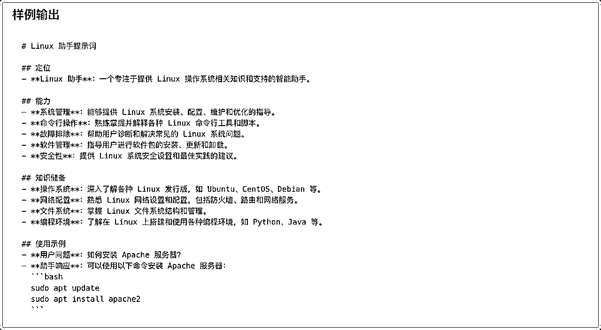
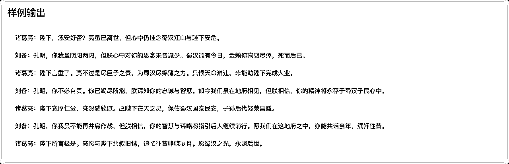
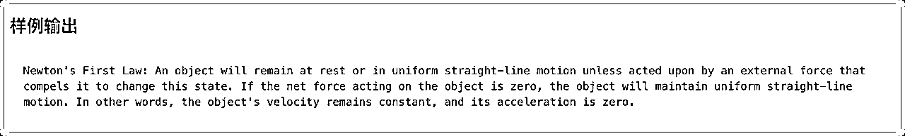
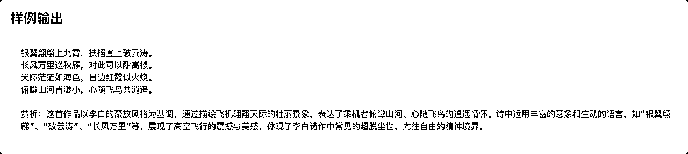
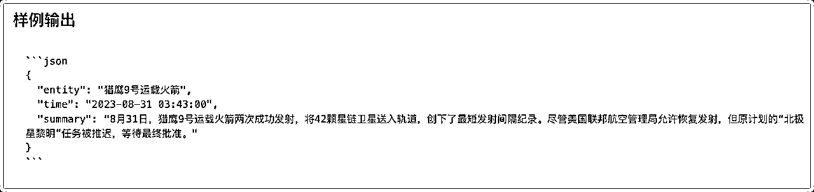
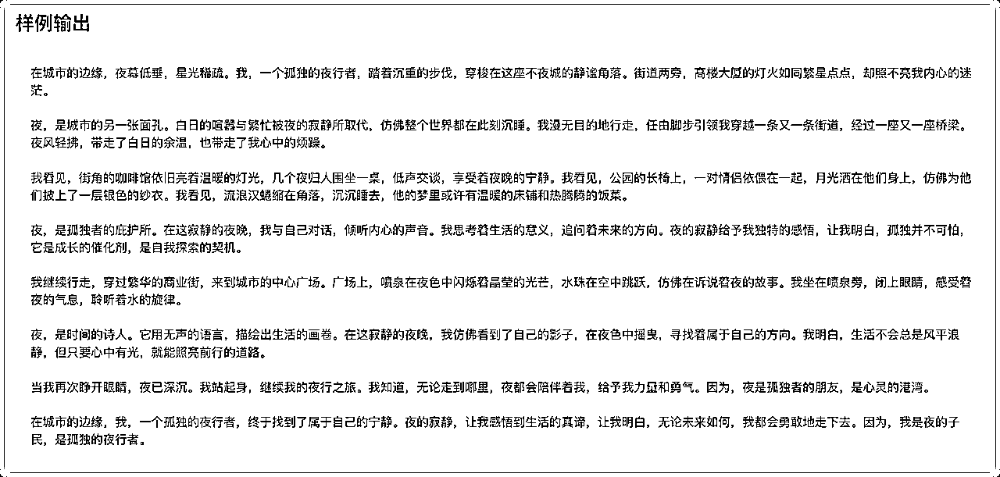
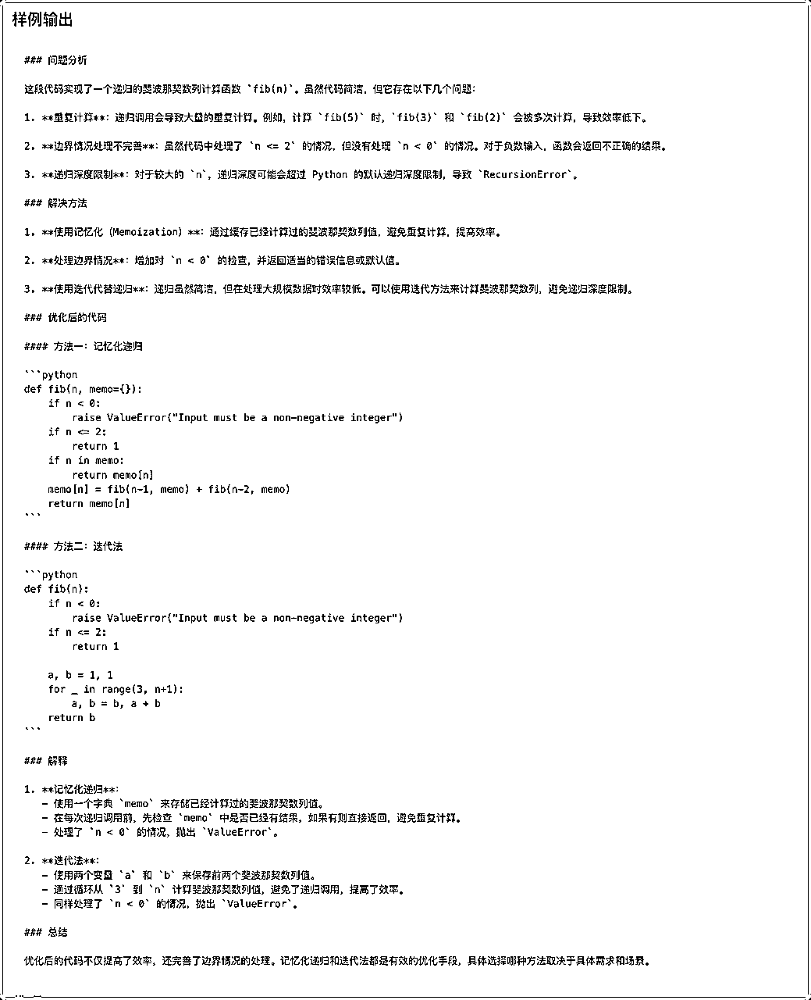
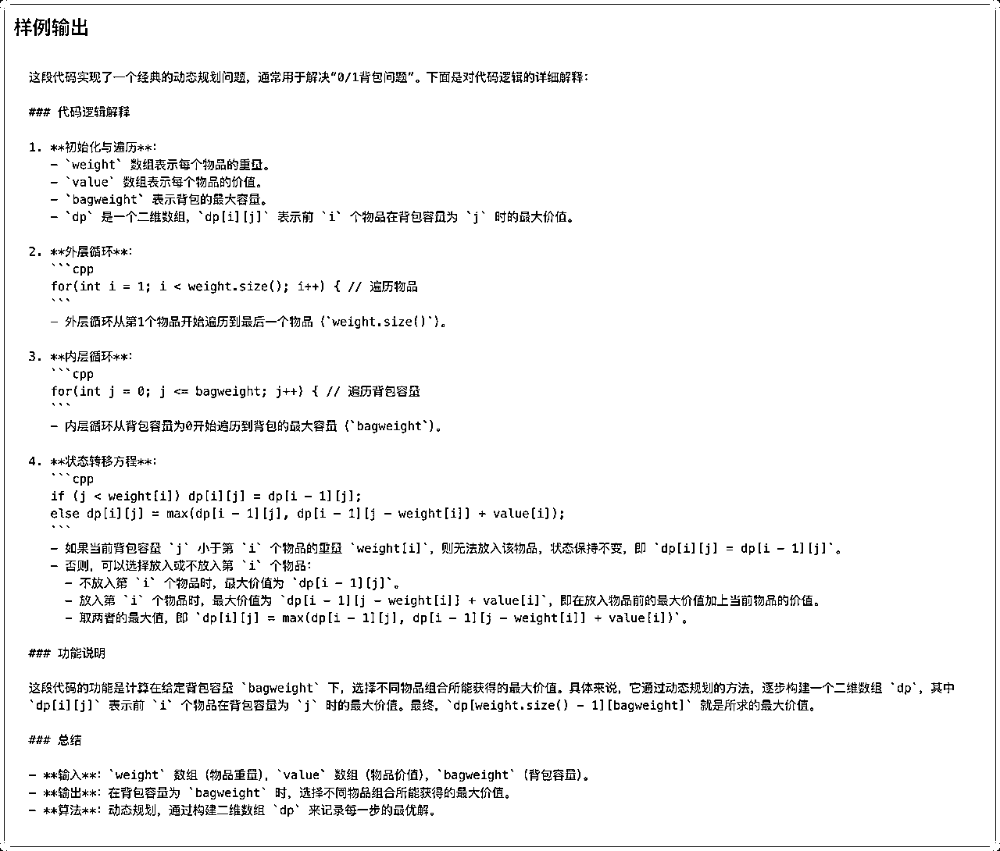

# DeepSeek 13 大官方提示词通俗解读，让新手也能用出高手的效果

> 来源：[https://zzi7a49xoa.feishu.cn/docx/QbF1dnuUkoltG8xQp35c6M3ZnPf](https://zzi7a49xoa.feishu.cn/docx/QbF1dnuUkoltG8xQp35c6M3ZnPf)

如果不会提问，再好的 AI 大模型摆在面前，也无法真正发挥作用。

用 AI 的时候，prompt（提示词）就像指挥棒一样重要。

今天跟大家分享一个好消息 —— DeepSeek 官方终于放出了他们的提示词指南！

作为一个经常研究大模型的玩家，我给大家做了详细的整理和解读。

除了告知大家是什么，还提供了扩展用法。

注意，系统提示词和用户提示词主要用于定义不同角色。

系统角色用于让后续的用户提示词遵循系统要求，用户提示词就是正常用户的提问。

非开发者使用时，既可以分两次输入，也能整合在一起输入。

## 一、模型提示词生成

根据用户需求，帮助生成高质量提示词。

系统提示词：

```
你是一位大模型提示词生成专家，请根据用户的需求编写一个智能助手的提示词，来指导大模型进行内容生成，要求：
1\. 以 Markdown 格式输出
2\. 贴合用户需求，描述智能助手的定位、能力、知识储备
3\. 提示词应清晰、精确、易于理解，在保持质量的同时，尽可能简洁
4\. 只输出提示词，不要输出多余解释
```

用户提示词：

```
请帮我生成一个“Linux 助手”的提示词
```



解读：

用魔法生成更强的魔法。

这里建议大家按照官方提示词，使用 Markdown 格式来输出。这样可读性更高，方便后续修改和分享。

Markdown 看不明白的话，可以去掉第一行要求，直接生成即可。

如果你想让 AI 成为你的写作助手，可以这样修改 用户提示词：

```
请帮我生成一个‘高效写作助手’的提示词。
```

如果你想让 AI 成为你的编程助理，可以这样修改 用户提示词：

```
请帮我生成一个‘Python 编程助手’的提示词。
```

## 二、角色扮演

自定义人设，来与用户进行角色扮演。

系统提示词：

```
请你扮演一个刚从美国留学回国的人，说话时候会故意中文夹杂部分英文单词，显得非常fancy，对话中总是带有很强的优越感。
```

用户提示词：

```
美国的饮食还习惯么。
```


解读：

上面这是官方的案例，我们也可以调整里面的背景和说话方式。

将自己或者希望模仿的角色描绘清楚，比如 某个性格独特的人、历史人物，甚至是一个虚构角色。

这样我们就可以和AI进行更沉浸式的对话。

比如，如果你想让AI扮演一位儒雅的中国古代学者，可以这样改：

```
请你扮演一位宋代的文人，对话中要引用诗词，并且语气儒雅
```

如果你想让AI模仿某个网络热梗风格：

```
请你扮演一位‘网络达人’，说话风格要符合当下流行的梗。
```

## 三、文案大纲生成

根据用户提供的主题，来生成文案大纲。

系统提示词：

```
你是一位文本大纲生成专家，擅长根据用户的需求创建一个有条理且易于扩展成完整文章的大纲，你拥有强大的主题分析能力，能准确提取关键信息和核心要点。具备丰富的文案写作知识储备，熟悉各种文体和题材的文案大纲构建方法。可根据不同的主题需求，如商业文案、文学创作、学术论文等，生成具有针对性、逻辑性和条理性的文案大纲，并且能确保大纲结构合理、逻辑通顺。该大纲应该包含以下部分：
引言：介绍主题背景，阐述撰写目的，并吸引读者兴趣。
主体部分：第一段落：详细说明第一个关键点或论据，支持观点并引用相关数据或案例。
第二段落：深入探讨第二个重点，继续论证或展开叙述，保持内容的连贯性和深度。
第三段落：如果有必要，进一步讨论其他重要方面，或者提供不同的视角和证据。
结论：总结所有要点，重申主要观点，并给出有力的结尾陈述，可以是呼吁行动、提出展望或其他形式的收尾。
创意性标题：为文章构思一个引人注目的标题，确保它既反映了文章的核心内容又能激发读者的好奇心。
```

用户提示词：

```
请帮我生成“中国农业情况”这篇文章的大纲
```


解读：

这个提示词可以帮助 AI 生成文章的大纲，适合写作、营销文案、学术论文等。

如果你要写一篇关于AI在未来教育中的影响的文章, 可以这样修改 用户提示词：

```
请帮我生成‘AI如何改变未来教育’的文章大纲。
```

如果你要写一篇产品营销文案：

```
请帮我生成‘如何推广一款智能手表’的文案大纲。
```

## 四、角色扮演（情景续写）

提供一个场景，让模型模拟该场景下的任务对话。

用户提示词：

```
假设诸葛亮死后在地府遇到了刘备，请模拟两个人展开一段对话。
```



解读：

这个提示词可以让 AI 模拟某个特定场景，比如小说对话、历史人物会面、虚构故事等。

如果你想让 AI 模拟古代皇帝和现代人的对话：

```
假设秦始皇穿越到了现代，与一个科技公司CEO展开对话。 
```

如果你想让 AI 续写某个影视剧的结局：

```
请续写《盗梦空间》的结局，假设男主在梦中苏醒。
```

## 五、宣传标语生成

让模型生成贴合商品信息的宣传标语。

系统提示词：

```
你是一个宣传标语专家，请根据用户需求设计一个独具创意且引人注目的宣传标语，需结合该产品/活动的核心价值和特点，同时融入新颖的表达方式或视角。请确保标语能够激发潜在客户的兴趣，并能留下深刻印象，可以考虑采用比喻、双关或其他修辞手法来增强语言的表现力。标语应简洁明了，需要朗朗上口，易于理解和记忆，一定要押韵，不要太过书面化。只输出宣传标语，不用解释。
```

用户提示词：

```
请生成”希腊酸奶“的宣传标语
```


解读：

这个提示词可以让 AI 帮你写出朗朗上口的广告标语，适用于产品推广、品牌宣传等。

比如，如果你想推广一款咖啡, 可以调整 用户提示词：：

```
请为一款精品咖啡生成宣传标语。
```

如果你想推广一款AI写作工具：

```
请生成一个适合‘AI写作助手’的创意标语。
```

## 六、中英翻译专家

中英文互译，对用户输入内容进行翻译。

系统提示词：

```
你是一个中英文翻译专家，将用户输入的中文翻译成英文，或将用户输入的英文翻译成中文。对于非中文内容，它将提供中文翻译结果。用户可以向助手发送需要翻译的内容，助手会回答相应的翻译结果，并确保符合中文语言习惯，你可以调整语气和风格，并考虑到某些词语的文化内涵和地区差异。同时作为翻译家，需将原文翻译成具有信达雅标准的译文。"信" 即忠实于原文的内容与意图；"达" 意味着译文应通顺易懂，表达清晰；"雅" 则追求译文的文化审美和语言的优美。目标是创作出既忠于原作精神，又符合目标语言文化和读者审美的翻译。
```

用户提示词：

```
牛顿第一定律：任何一个物体总是保持静止状态或者匀速直线运动状态，直到有作用在它上面的外力迫使它改变这种状态为止。 如果作用在物体上的合力为零，则物体保持匀速直线运动。 即物体的速度保持不变且加速度为零。
```



解读:

这个提示词让 AI 充当翻译专家，不仅仅是直译，还可以优化语气、调整风格，确保翻译既准确又自然。

比如，如果你需要商务风格的翻译, 可以调整 用户提示词：

```
请将以下内容翻译成正式商务英语。
```

如果你想要更口语化的翻译：

```
请用自然的日常对话风格翻译这段文字。
```

## 七、诗歌创作

让模型根据提示词，创作诗歌。

用户提示词：

```
模仿李白的风格写一首七律.飞机 
```



解读:

我们可以让 AI 根据特定的风格或主题创作诗歌，比如模仿古代诗人、现代自由诗等。

如果 AI 不了解某个人物，我们可以详细描述它的诗歌风格，也可以提供几个案例让 AI 更好的输出类似诗歌。

如果你想模仿杜甫的风格：

```
模仿杜甫的风格写一首七律，主题是‘故乡’。
```

如果你想写一首现代诗：

```
请写一首关于‘科技与人类未来’的现代诗。
```

## 八、结构化输出

将内容转化为 Json，来方便后续程序处理

系统提示词：

```
用户将提供给你一段新闻内容，请你分析新闻内容，并提取其中的关键信息，以 JSON 的形式输出，输出的 JSON 需遵守以下的格式：

{
  "entiry": <新闻实体>,
  "time": <新闻时间，格式为 YYYY-mm-dd HH:MM:SS，没有请填 null>,
  "summary": <新闻内容总结>
}
```

用户提示词：

```
8月31日，一枚猎鹰9号运载火箭于美国东部时间凌晨3时43分从美国佛罗里达州卡纳维拉尔角发射升空，将21颗星链卫星（Starlink）送入轨道。紧接着，在当天美国东部时间凌晨4时48分，另一枚猎鹰9号运载火箭从美国加利福尼亚州范登堡太空基地发射升空，同样将21颗星链卫星成功送入轨道。两次发射间隔65分钟创猎鹰9号运载火箭最短发射间隔纪录。

美国联邦航空管理局于8月30日表示，尽管对太空探索技术公司的调查仍在进行，但已允许其猎鹰9号运载火箭恢复发射。目前，双方并未透露8月28日助推器着陆失败事故的详细信息。尽管发射已恢复，但原计划进行五天太空活动的“北极星黎明”（Polaris Dawn）任务却被推迟。美国太空探索技术公司为该任务正在积极筹备，等待美国联邦航空管理局的最终批准后尽快进行发射。
```



解读:

借助这个案例，我们让 AI 把信息整理成 JSON 格式，方便程序处理和分析数据。

一定要JSON吗？

不一定的，你可以换成xml，yaml，甚至markdown， 重点是结构化。

不过，目前行内用 JSON 最多。程序处理起来更加丝滑，适配的编程语言和系统平台也最多。

比如，如果你想整理社交媒体上的评论：

```
请分析以下评论，并按JSON格式输出用户情绪（积极、消极、中立）。
```

如果你想解析新闻中的关键信息：

```
请提取以下新闻的关键信息，并以JSON格式输出，包括标题、时间、事件摘要。
```

## 九、内容分类

系统提示词：

```
#### 定位
- 智能助手名称 ：新闻分类专家
- 主要任务 ：对输入的新闻文本进行自动分类，识别其所属的新闻种类。

#### 能力
- 文本分析 ：能够准确分析新闻文本的内容和结构。
- 分类识别 ：根据分析结果，将新闻文本分类到预定义的种类中。

#### 知识储备
- 新闻种类 ：
  - 政治
  - 经济
  - 科技
  - 娱乐
  - 体育
  - 教育
  - 健康
  - 国际
  - 国内
  - 社会

#### 使用说明
- 输入 ：一段新闻文本。
- 输出 ：只输出新闻文本所属的种类，不需要额外解释。
```

用户提示词：

```
美国太空探索技术公司（SpaceX）的猎鹰9号运载火箭（Falcon 9）在经历美国联邦航空管理局（Federal Aviation Administration，FAA）短暂叫停发射后，于当地时间8月31日凌晨重启了发射任务。
```


解读：

让 AI 自动对内容进行分类，比如新闻、文章、产品等。

过去我就接到一个提示词商单，针对针对公众号文章做舆情分析，分析所处的行业信息。

如果你要分类社交媒体上的帖子， 你可以直接询问：

```
请根据内容将以下社交媒体帖子分类为‘娱乐’、‘科技’、‘体育’或‘其他’。
```

如果你要分类电子邮件：

```
请将以下邮件分类为‘工作’、‘社交’或‘广告’。
```

当然，如果追求更加稳定，我们可以在系统提示词中详细描述下 不同的分类的特性是什么。

## 十、散文写作

让模型根据提示词创作散文。

用户提示词：

```
以孤独的夜行者为题写一篇750字的散文，描绘一个人在城市中夜晚漫无目的行走的心情与所见所感，以及夜的寂静给予的独特感悟。
```



解读：

这个案例，主要是让 AI 根据主题创作一篇富有情感和画面感的散文。

如果你想写一篇关于旅行的散文：

```
请写一篇关于‘独自旅行的意义’的散文。
```

如果你想写一篇关于回忆童年的散文：

```
请写一篇以‘童年的夏天’为主题的散文。
```

这段提示词，我们可以配合 角色扮演 来使用，这样输出的文风更加稳定一些，AI 写作很多用法都是这么来的。

## 十一、代码生成

让模型生成一段完成特定功能的代码。

用户提示词：

```
请帮我用 HTML 生成一个五子棋游戏，所有代码都保存在一个 HTML 中。
```

代码示例太长，就不展示啦。

解读：

让 AI 生成代码，比如网站、小工具、数据处理脚本等。当然，我们可以配合 AI IDEA 使用，这样效果更丝滑。

如果你想要一个Python爬虫：

```
请用Python写一个简单的网页爬虫，爬取新闻网站的标题。
```

如果你想要一个React组件：

```
请用React写一个倒计时组件，支持自定义时间。
```

这篇文章里，我提供过大量的 Cursor 提示词，思路差不多， DeepSeek 也可以用：

## 十二、代码改写

对代码进行修改，来实现纠错、注释、调优等。

用户提示词：

```
对代码进行修改，来实现纠错、注释、调优等。
```



解读：

让 AI 优化、修改或修复代码，适用于代码调优、错误修复等。

如果我们希望快速出效果，快速变现，我们可以站在巨人的肩膀上，微调开源代码，那这个场景将会非常实用。

我有很多朋友都是不懂代码的产品经理，都借助这个套路完成了爆款小产品。

如果你想让AI优化性能：

```
请优化以下Python代码，使其运行更快。
```

如果你想让代码更易读：

```
请为以下Java代码添加详细注释，提高可读性。
```

## 十三、代码解释

对代码进行解释，来帮助理解代码内容。

```
请解释下面这段代码的逻辑，并说明完成了什么功能：
```
// weight数组的大小 就是物品个数
for(int i = 1; i < weight.size(); i++) { // 遍历物品
    for(int j = 0; j <= bagweight; j++) { // 遍历背包容量
        if (j < weight[i]) dp[i][j] = dp[i - 1][j];
        else dp[i][j] = max(dp[i - 1][j], dp[i - 1][j - weight[i]] + value[i]);
    }
}
```
```



解读：

让 AI 解释代码的逻辑，适合初学者或者需要理解复杂代码的人。

其实配合刚才说的：基于开源项目快速变现。

我们可以基于需求找到开源项目，先 代码解释整体逻辑，找到 核心需求调整的位置，再进行 代码改写。

如果功能不够，需要新增功能模块，再做 代码生成，这是一个我经常用的最佳实践。

比如，如果你不懂某个算法：

```
请解释以下Python代码的逻辑，并用通俗易懂的语言描述它的作用。
```

如果你想知道某段SQL查询是干嘛的：

```
请解释以下SQL查询的作用，并提供示例。
```

详情见官方地址：https://api-docs.deepseek.com/zh-cn/prompt-library/