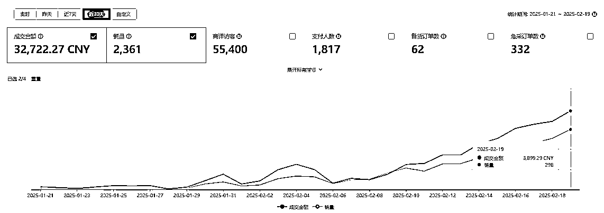
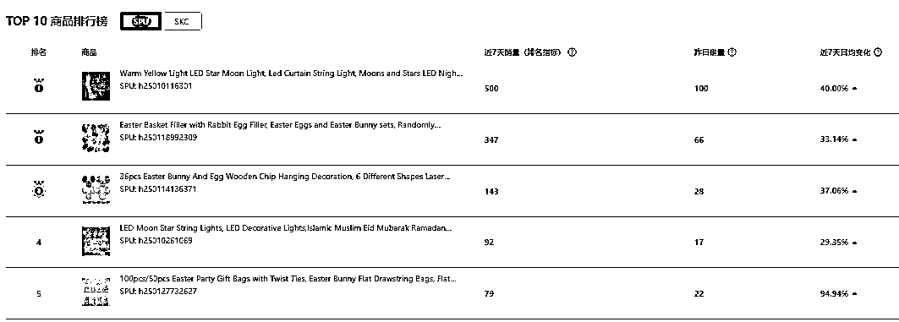

# 【航海好事】shein 航海实战，做起一个每天几百单的新店

> 来源：[https://p1wans6rb9.feishu.cn/docx/SKPHdmTw4ot1olxU9tGc4AOXn4b](https://p1wans6rb9.feishu.cn/docx/SKPHdmTw4ot1olxU9tGc4AOXn4b)

## 个人介绍：

大家好！我是张炯，一个在成都的西北人，工科男出身

到今天为止，已经在本次航海拿到3W+的销售额，所以马不停蹄的来跟大家做分享

我之前所有的经历，都是辗转在各个国内电商平台

17-19年找了份天猫女装运营的工作，从0做到年销售额3000W左右

19-22年跟别人合作抖音IP，80万粉丝，月销售额400W，赚钱了也没能免俗，散伙收场

22年至今，自营小红书女鞋电商

在接触这次航海之前

很多人问过我：你怎么不做跨境？

我都是说，太陌生了，经验不能复用

没想到，一语成谶，上了这条大船

## 先上数据：

我负责的店铺是12月25日开始运营，到今天快要两个月，近30天总销售额3W多，并且每天都在上涨

这个店铺成立以来

一直是我和另外两个组员一起运营

三个人中，两个都完全没做过跨境，有一个算是做了一半，做了ebay

但靠1:1学习航海教练提供的方法论

到今天

每个人都做出了自己的小爆产品

当然这也不是一蹴而就

接下来跟大家分享

我们这两个月实操的经验和教训

## 来点干货：

首先，7分靠选品

但盲目的跟风爆款，只能沦为炮灰

重点是筛选出那些：在其他平台需求量大，但shein上还没什么竞争的品

说起来很简单

但在前期航海实操的过程中

每天选中的产品，总会被教练无情的斩杀哈哈

不是站内竞争饱和，就是站外需求不足

但也正式这样一次一次的及时反馈

帮助我们初步建立了对产品的基础判断力

再加上共同航行的大神也很多：

教练提供了“榜单选品”、“跟卖选品”、“先发散再收敛”等等好用的选品思路

也有编程高手提供快速抓取识别潜力款式的技术

我们的个人经验

也随之和同学们共建共创的过程中不断提高

从最开始一天选不出一个品

到可以批量筛选符合标准的品

现在的店铺里

每个热卖的商品，都是出自组内各位同学之手

第二，3分靠上架

shein上现在仍然有很多上架，是通过照搬拼凑在随意的上架产品（说明还不卷）

也就是说同样的商品，同时期上架

只要我们做的更用心，就有机会脱颖而出

同行只是照搬爆款标题

而我们可以找多个爆款链接，将它们的标题有机组合，覆盖更多的关键词

同行随意上传产品图片

而我们可以分门别类

第一张主图博取点击率

紧接着场景图促进转化

最后是细节支撑购买决策

甚至同一个产品

用不同的场景图多品类上架

无死角的获取竞争优势

第三，核价定生死

shein平台不像国内电商可以自由定价

平台会给每个商品核定一个采购价格

价格给的高

不但有利润，更有操作空间去报活动，获得流量优势

这一是航海过程中很多同学面对的卡点

刚开始我们上的产品

平台给的价格比1688还低

逼着我们又是P图又是AI

反正核心目的是让平台搜图识别不到同款，或者错误识别到更贵的款式

终于上的款式基本都实现了毛利率20%-50%

## 经验心得：

1.消费趋势很重要

比如航海初期，先是圣诞节产品吃掉了大部分需求，紧接着国外放假更是冻结购买力，再然后就是中国春节工厂放假，在这个趋势下，不但很难选出新品，选出来上架的品，也是要么卖不动，要么没货发

而后来在小善团队的带领下，我们及时调整策略，在年前就开始布局3月份的斋月节，顺势而为，从而几个店铺都一路大涨，起店成功。

2.笃定坚信等风来

与国内电商不同的是，shein平台需要一个稍长的启动周期

比如选中几个款，再上架，用了1天

平台审核这些款，又会用1天

接着平台给每个款式定价，要花1-3天

然后终审一轮，又要1-4天

最后才能排期上架

也就是说顺利的话，一个款式从选中到上架，也需要5-8天

而爆款总是有概率的

需要不断的重复以上过程，才能获得正反馈

要做好1个月撞南墙的准备

航行过程中，不断有同学放弃

可能也是这个原因

但难走的路，才是不卷的路

笃定坚信，才能穿越黑暗

## 写在最后：

2022年底，家人生病，我在医院陪护

无聊中测试了下小红书刚刚退出的电商业务

上了几个产品，还没发笔记

没想到就嘎嘎出单了

当时就判断这是一个供需不平衡的蓝海平台

于是过完年加大投入

小赚一波

这次接触到shein，也带给我同样的感觉

即使在我们刚开始航海的12月

消费需求走低、选品质量垃圾、上架水准又松又稀

三重debuff下

依然有很多商品出单甚至小爆

看见它们我就在想

这老外真是被饿坏了

必须来给他们整点细粮

这就是我们的机会！

纵有疾风起，日行三公里

感谢生财，感谢航海，让我遇到这个团队，也希望大家都能找到适合自己的项目~

如果大家还有其他问题，或者想了解更多 Shine 内容的可以私信鱼丸加我或者小善团队联系。