# Ai自媒体：Deepseek公众号写作教程

> 来源：[https://txt6wm3b04b.feishu.cn/docx/SYn4df1CPok82bxhxVQcTe4Dntb](https://txt6wm3b04b.feishu.cn/docx/SYn4df1CPok82bxhxVQcTe4Dntb)

# 文章前言

我是你们的老朋友”越越|爆文海王“。

最近deepseek的热度不减，我身边很多人都在使用国产之光的ds，我作为一名对”热点“具备超高敏感度的公众号精细化运营选手，我也”顺趋势、随大流“参与ds洪流中，我作为一名不太合格的Ai自媒体人：

本文的编写初衷：帮助刚入门Ai自媒体的同学模仿操作，并能够独立发现问题并调整。

全文3w字，文中大部分文字由我向deepseek提问获取，同时结合个人实践经验进行修正：

*   向Deep seek合理提问，帮助我实现了一天完成此篇万字文档；

*   结合新手公众号运营的实际需求，做一份deepseek+公众号教程；

*   文中部分资料引用清华大学团队《DeepSeek：从入门到精通》；

# Deepseek爆款文章写作

微信公众号具有四大核心特性：私域流量、深度阅读、规范体系和互动机制。


对于Ai自媒体的从业选手而言：

内容生产端

*   结合AI工具提升生产效率，但需保留人工审核与创意主导权。

*   强化逻辑性与结构性（分章节、重点加粗），适配用户阅读习惯。

合规与风控

*   建立AI+人工双重审核机制，避免因敏感词或规则误判账号风险。

*   定期更新AI模型的规则库，确保与平台规范同步。

用户运营端

*   利用AI实现用户分层管理，设计差异化互动和选题。

*   通过赞赏、转发数据分析，优化内容变现路径，增加我们的收益。

迭代优化

*   基于平台互动数据，训练AI模型预测内容表现，调整选题与形式。

*   重点关注用户评论情感分析，快速响应用户需求与反馈。

那么这篇文章就从越越所认为的”公众号底层爆款逻辑“论述。

## 爆款文章的核心逻辑

爆款文章的本质是解决用户需求，同时激发用户的情绪共鸣和分享欲望。

在公众号中无论是哪个领域，越越认为只要抓住以下三点，就能写出受欢迎的内容：

1.  用户需要什么？（痛点、爽点、痒点）

1.  你能提供什么？（价值、解决方案）

1.  用户为什么愿意分享？（情绪、社交货币）

该部分思维将会贯穿整篇文章，以作者（我）的角度去思考：我该如何去讨好用户？

核心观点：去迎合同频用户，而不是”男女老少“都通吃。

### 用户需要什么？

因为用户需要：痛点共鸣+爽点刺激 +痒点吸引，

所以我们要写给用户看，用户愿意看了，才有机会变现。

##### 痛点共鸣

解释：就是找到大家普遍觉得烦心的事。

*   职场压力！像工作多到做不完！天天加班！领导要求还高！；

*   情感问题像失恋！当事人那种痛苦、孤独感！；

*   健康焦虑就是总担心自己生病，看到别人有病就害怕自己也有！。

我作为Ai自媒体人，我写的文章是给用户看的，那么我就需要投其所好，去关心、去安慰、去解决问题。

现在大多数Ai自媒体人实际上并不知道自己的用户，到底遇到了哪些问题？实际上最需要解决什么问题？

👉 我们可以告诉deepseek：

```
背景：我的公众号里'粉丝群体'居多。
提问：他们有哪些痛点？我该如何去把握他们的痛点，创造爆款？
要求：请帮我分点输出，同时举例子说明，使用小白能够看懂的语言表达。
```

根据deepseek的答复，我可以继续追问（直到得到自己满意的答复）：

```
在我们实际生活中，他们通常会怎么去解决？
```

##### 爽点刺激

解释：那些让你看了、听了或者体验了之后，感觉特别爽、特别满足的内容。

它可能是让你觉得“哇，这太棒了！”、“终于等到这一刻了！”或者“我做到了！”的那种瞬间。

*   看小说：主角突然逆袭，打败了反派，你会觉得特别解气、特别爽。

*   玩游戏：你完成了一个超难的任务，拿到了稀有装备，成就感爆棚。

*   刷视频：看到一个搞笑段子，笑得停不下来，心情瞬间变好。

👉 我们可以告诉deepseek：

```
背景：我的公众号里'粉丝群体'居多。
提问：他们能够Get到哪些爽点？我该如何去把握这些爽点，创造爆款？
要求：请帮我分点输出，同时举例子说明，使用小白能够看懂的语言。'
```

##### 痒点吸引

解释：指粉丝内心渴望但尚未被满足的需求。

*   理想生活：看到别人在乡下有大房子，种菜养花，自己就很想有这样的生活；

*   财富自由：就是不用工作也能有钱花，想干嘛就干嘛；

*   颜值提升：就是看到别人长得好看，自己也想变漂亮；

👉 我们可以告诉deepseek：

```
背景：我的公众号里'粉丝群体'居多，
提问：在某件事中，他们的痒点是什么？我该如何去把握这些爽点，创造爆款？
要求：请帮我分点输出，同时举例子说明，使用小白能够看懂的语言。
```

重点提示：

此步骤必不可少！

1.  此部分内容有助于我们结合用户的实际需求，写相应的文章；

1.  因此我们需要及时将deepseek生成的答复保存在本地文件中；

1.  提示词中的绿色字体需要我们填写；

##### 数据分析需求

我们Ai自媒体人在运营自己公众号过程中，经常忽视”后台数据反馈“，尤其对用户画像一窍不通。

我以自己的爆文账号举例分析：

下图是我的后台粉丝画像数据，具体查看过程如下图所示（以”人口特征“板块为例分析）：

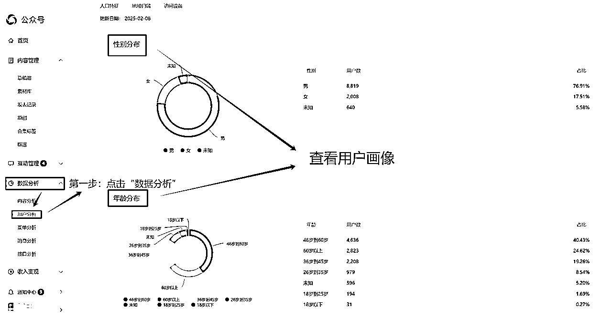

在截图中，我可以发现我的粉丝群体主要是：

年龄：中老年

地区：黄河北部

性别：男性

但是在deepseek眼中，她认为这些粉丝画像背后有更多内容需要挖掘。

使用deepseek分析后台粉丝数据的过程：

第一步：👉 上传《粉丝画像板块》截图（可多张同时上传）， 请告诉deepseek（建议使用深度思考模型）：

```
请帮我看看我公众号的粉丝画像。
```

Deepseek会进行答复：

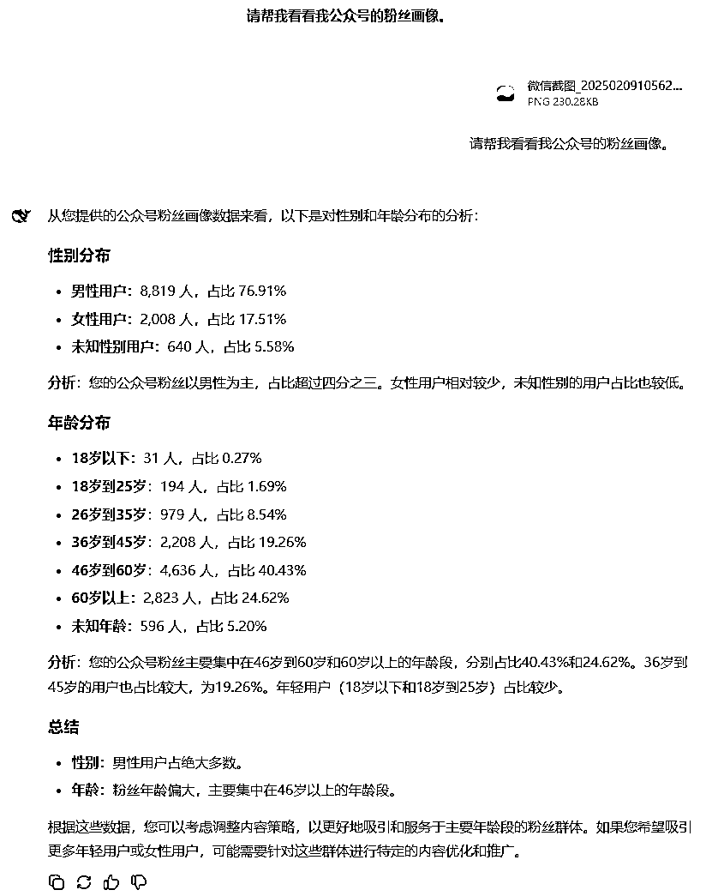

第二步：👉 根据回答，继续追问deepseek（建议使用通用模型）：

```
提问：这些粉丝在'某些方面'中，他们的痛点、痒点、爽点是什么？我该如何去把握这些爽点，创造爆款？
要求：请帮我分点输出，同时举例子说明，使用小白能够看懂的语言表达。
```

Deepseek会进行答复（仅截取一部分），更为详细的内容，请自行测试：

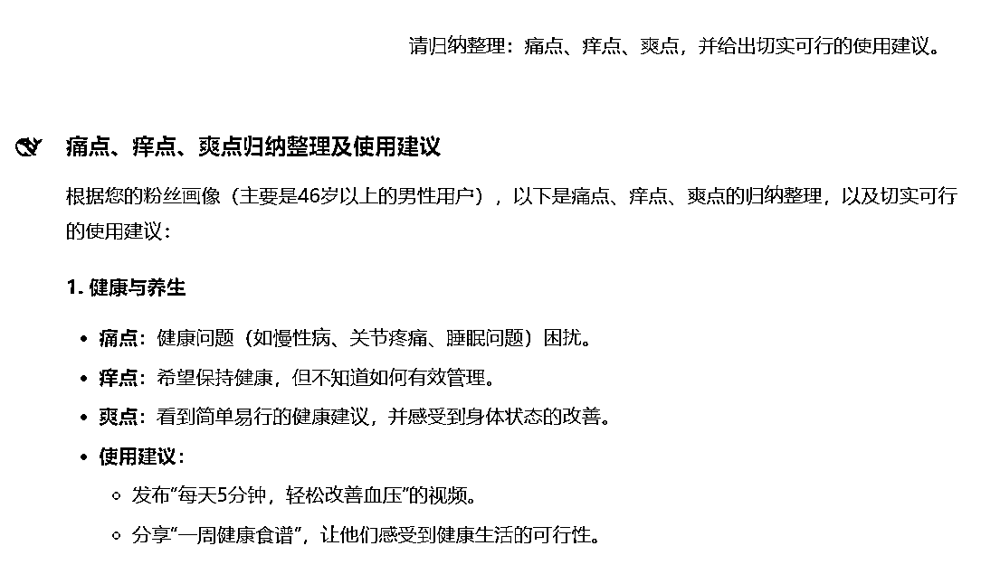

温馨提示：

在询问deepseek过程中，我们尽量使用”通用模式“进行提问，便于高效、高质生成回答。

### 你要提供什么？

选题规划提示的核心在于明确内容定位与用户价值。

我自己作为 Ai自媒体，我只精通某个细分领域。因为我知道在这个领域里我能提供给用户什么价值？

如果我们写的文章，能为用户带来的实际价值和解决方案。这是吸引用户阅读、点赞、转发甚至关注的关键。

我就拿Ai自媒体人最头痛的问题，来验证价值的重要性。

最头痛的问题莫过于”文章选题“，完事开头难！公众号写作中最难的一个环节。

我从清华大学的《Deepseek:从入门到精通》中发现，编写合格的deepseek提示词是需要：

1.  我们想清楚：我们到底想要什么？

1.  我们想清楚：deepseek到底能够帮我们做什么？

回到使用deepseek赋能公众号运营中来，我们的实际需求和deepseek的实际价值都会影响创作。

文档里提供了deepseek选题提示词：

```
任务目标：生成[具体领域]的选题规划 
背景信息： 
- 账号定位：[填写定位] 
- 目标用户：[用户画像] 
- 核心诉求：[用户需求] 
要求： 
（1）生成10个选题方向 
（2）每个选题包含： 
- 主标题 
- 副标题 
- 核心观点 
- 价值主张 
（3）考虑时效性与持久性的平衡 
输出格式：表格呈现
```

从提示词里看到，我们的定位、用户的画像、用户需求都要清楚。

#### 提供价值很重要

1.  用户需求：用户点击文章是为了解决问题或满足需求。如果你的内容没有价值，用户会迅速离开。

1.  建立信任：持续提供有价值的内容，能让用户对你产生信任，进而成为忠实粉丝。

1.  传播动力：用户只会分享对自己或他人有帮助的内容，有价值的内容更容易被传播。

#### 能提供什么价值

根据用户需求，你可以在文章和标题中提供以下几种价值.

##### 实用干货

解释：具体的技巧、方法、步骤，帮助用户解决问题。

职场领域

1.  《5个方法，让你轻松提高工作效率》

1.  《如何在会议上脱颖而出？这3个技巧你一定要知道》

理财领域

1.  《月薪5000如何攒下10万？这3个方法超实用》

1.  《新手投资指南：从零开始学理财》

##### 情感共鸣

解释：通过故事或观点，引发用户的情感共鸣，让他们觉得“被理解”。

情感领域

1.  《那些年，我们错过的爱情，原来是因为……》

1.  《婚姻中最可怕的不是吵架，而是……》

励志领域

1.  《从月薪3000到年薪50万，我做对了这3件事》

1.  《30岁才开始努力，真的晚了吗？》

##### 信息增量

解释：提供用户不知道的新知识、新趋势或新观点。

科技领域

1.  《2024年最值得关注的5个科技趋势》

1.  《人工智能将如何改变我们的生活？》

健康领域

1.  《每天喝咖啡真的有害健康吗？真相是……》

1.  《熬夜的危害有多大？科学数据告诉你》

##### 娱乐价值

解释：通过幽默、搞笑或轻松的内容，让用户感到愉悦。

搞笑领域

1.  《当代年轻人的迷惑行为大赏》

1.  《那些年，我们在考试中干过的“蠢事”》

影视领域

1.  《<狂飙>爆笑名场面盘点，笑到肚子疼》

1.  《2024年最值得期待的10部电影》

##### 工具推荐

解释：推荐实用的工具、软件或资源，帮助用户提高效率。

职场领域

1.  《5款超好用的办公软件，让你工作效率翻倍》

1.  《如何用Notebook打造高效工作流？》

学习领域

1.  《2024年最值得下载的5个学习APP》

1.  《如何用Anki高效背单词？》

##### 趋势解读

解释：解读行业趋势或社会现象，帮助用户更好地理解世界。

商业领域

1.  《2024年最值得投资的5个行业》

1.  《为什么直播带货这么火？背后的逻辑是什么？》

社会领域

1.  《年轻人为什么越来越不愿意结婚？》

1.  《“内卷”背后的社会真相》

##### 文化领域

解释：在文化领域进行发展，解读某种文化现象。

1.  《国潮崛起的背后，藏着哪些文化密码？》

1.  《为什么<流浪地球>能火遍全球？》

#### 用户需要的价值

微信公众号作为深度阅读平台，其内容创作需要在吸引力、 专业性和传播性之间找到平衡。

需求：只要满足最基本的标准就行了。对用户而言只要基本过得去就行；

价值：在基础上，要求过的更好。能满足用户的情绪、帮助解决问题等；

##### 获知用户需求

我们可以通过以下方法获取到一些能够反映用户实际需求的真实数据。

1.  观察用户行为：通过公众号后台数据、评论区、粉丝群等，了解用户的兴趣和痛点：

温馨提示：

1.  争论点：看看用户针对文章的某个观点在争论什么？

1.  建议点：从用户角度看，他们所提出的建议就是他们眼中最需要满足的东西。

1.  认同点：用户内容认同的东西，自然也是他们最需要的东西。


1.  问卷调查：定期在公众号里发起投票调查，直接征询用户需求。

使用投票功能：在公众号后台中，有投票统计的功能模块。

从投票结果中，可以知道我们文章的用户普遍倾向哪些内容？

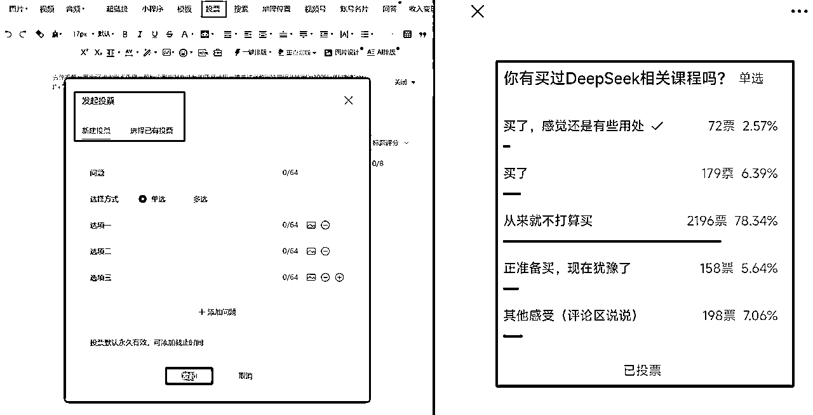

1.  对标分析：观察同类账号的爆款文章和帐号，分析用户关注点。

多个平台分析：在各个主流的自媒体平台上通过搜索关键词，去锚定与目标人群相关的文章，分析爆款标题和文案、图片里所提及的表述。


同个平台分析：在公众号平台中，我们可以通过"元宝、微信指数、搜一搜"进行对标分析，观察数据特别异常部分的粉丝最关心什么？此部分依然能够从评论区里获得价值信息。

1.  元宝：可以直接向她提问。

1.  微信指数：热度越大，需求越大。

1.  微信搜一搜：10w+文章越多，需求越大。

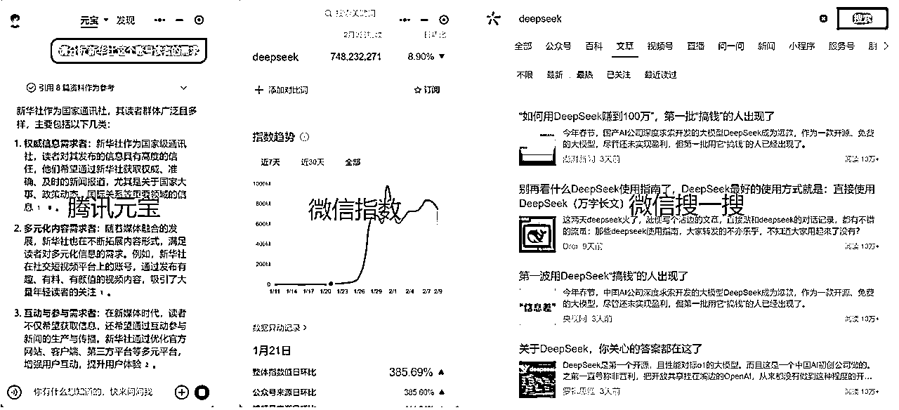

##### 结合热点话题

在热点事件爆发的时候，会出现各式各样的内容，我们可以从中去获取实用的价值。

最简单的方法：使用deepseek的联网搜索功能在线搜索并分析，并采集网友观点进行分析。

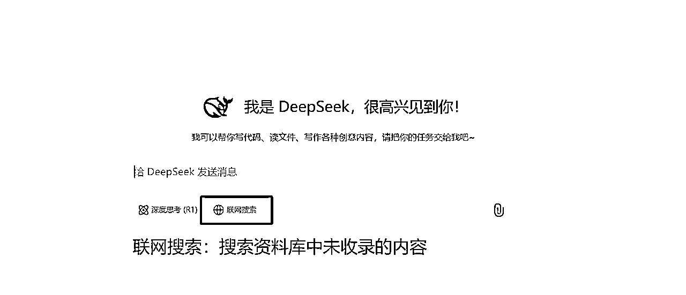

具体操作过程如下：

第一步：👉 分析大众观点，请告诉deepseek（建议使用深度思考模型+联网模式）：

```
请分析大众对'具体热点事件'的不同观点。
```

等待deepseek答复！

第二步：👉 继续追问，告诉deepseek（通用模型+联网模式）：

```
从刚才的分析中，输出不同观点网友的实际需求，他们需要什么价值？
```

等待deepseek答复！

第三步：👉 继续追问，告诉deepseek（通用模型+联网模式）：

```
请你满足用户的'价值'，生成10个高价值的'标题/选题'建议。
```

温馨提示：

热点：你可以直接询问deepseek（联网模式）最近在某某领域的榜单热点，或直接输入”具体热点事件“。

以”哪吒2“热点事件为例，使用deepseek分析在该事件中用户（网友）所需要的”价值“：

第一步：👉 获取观点框架，告诉deepseek（建议使用深度思考模型+联网模式）：：

```
请分析大众对'具体热点事件'的不同观点。
```

Deepseek会进行答复：

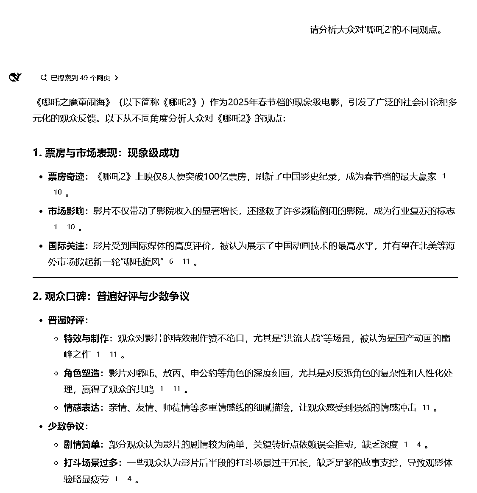

第二步：👉 继续追问，告诉deepseek（通用模型+联网模式）：

```
从刚才的分析中，输出不同观点网友的实际'需求/价值'。
```

Deepseek会进行答复：

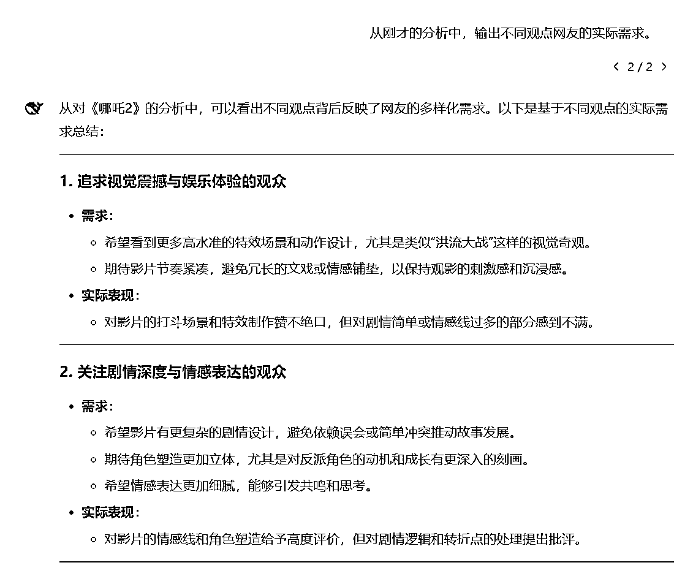

第三步：👉 继续追问，告诉deepseek（通用模型+联网模式）：

```
请你满足用户的'期待影片节奏紧凑，避免冗长的文戏或情感铺垫，以保持观影的刺激感和沉浸感。'，生成10个高价值的爆款'标题/选题'。
```

Deepseek会进行答复：

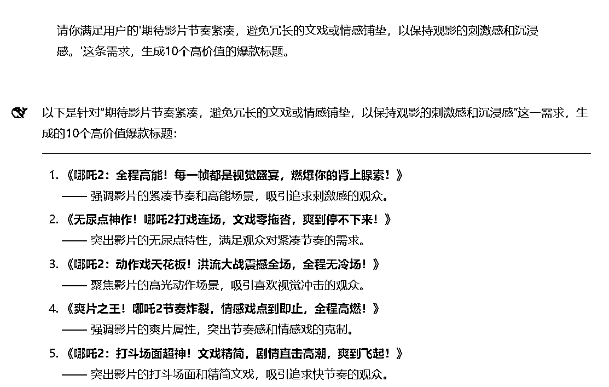

温馨提示：

在对deepseek连续使用通用模型时，应该一边对当前生成的内容继续人工归纳总结，一边等待系统恢复。

深度思考：半小时一次。

通用模型：保持在10次/小时。

##### 提供差异化价值

我们在使用Ai做自媒体的时候，经常会遇见其他人抄袭/洗稿/搬运我们的作品。

内容是流量的护城河，提升内容的差异化是关键，也是我们Ai自媒体人最应该关心的内容。

###### 差异化价值定义

差异化价值是指你的内容在主题、角度、形式或深度上与同类内容有所不同，能够为用户提供独特的价值。

1.  独特的视角：从不同角度解读同一话题、观点。

1.  更深度的分析：提供更专业、更详细的内容。

1.  更实用的解决方案：针对特定人群或场景，提供更具体的建议。

1.  更生动的表达：通过故事、案例或幽默语言增强吸引力。

###### 用户很需要差异化价值

重复性内容基本不存在反复阅读的可能。、

目前大多数爆款文章基本是”换汤不换药“，选题高度相似，只是形式上发生变化。

向用户提供差异化内容很重要！

1.  避免同质化：同类内容太多，用户容易审美疲劳。通常会在文章主题观点、标题、配图上出现同质化现象。

*   使用Ai模仿某篇爆款文章，然后进行发表（模仿了观点，更改了表达）。

*   使用对标的图片进行配图，或者使用网络用途，尤其是在小绿书领域中更为明显。

1.  建立个人品牌：通过独特的风格和视角，让用户记住你。

1.  提高用户粘性：用户会因为你的独特价值而持续关注你。

###### 提供差异化价值过程

找到独特切入点

👉 我们可以告诉deepseek（深度思考模型+联网模式）：

```
方案一：结合'专业背景或经历'在'同类话题'中，找一个未被充分挖掘的角度。
方案二：结合'专业背景或经历'针对'特定人群或场景'，提供更精准的内容。
方案三：请为这篇'文章内容'，输出差异化观点。
方案四：请结合'热点事件中网友的观点'，输出差异化观点。
方案五：请结合'评论区留言'，输出差异化观点。
```

举个例子：

普通选题：《如何提高工作效率？》

差异化选题：《职场妈妈如何高效平衡工作与家庭？》

操作建议：

分析同类文章的评论区，找到用户未被满足的需求。

结合自己的专业背景或经历，提供独特的视角。

提供强有力分析

👉 我们可以告诉deepseek（深度思考模型+联网模式）：

```
方案一：针对'话题/观点/事件'，结合真实的数据、案例或专业理论，增强内容的权威性和深度。
方案二：将'话题/观点/事件'拆解成多个维度，逐一分析。
```

举个例子：

普通内容：《如何理财？》

深度内容：《月薪5000如何理财？适合小白的3个方法+真实案例》

针对特定人群

👉 我们可以告诉deepseek（深度思考模型+联网模式）：

```
方案一：将'话题/观点/事件'聚焦于'粉丝画像'人群，提供更精准的解决方案。
```

举个例子：

普通内容：《如何减肥？》

差异化内容：《上班族如何利用碎片时间减肥？》

结合热点话题

👉 我们可以告诉deepseek（深度思考模型+联网模式）：

```
方案一：请将'某某观点'与'具体领域'结合，输出爆款差异化观点。
方案二：请将'某某观点'与'热点事件'结合，输出爆款差异化观点。
```

举个例子：

热点：春节假期结束。

差异化内容：《春节后如何快速进入工作状态？5个实用技巧》

故事增强吸引力

👉 我们可以告诉deepseek（深度思考模型+联网模式）：

```
这是'人物故事/经历'，输出一篇有深度、差异化爆款文章观点。
```

举个例子：

普通内容：《如何提高工作效率？》

故事化内容：《从拖延症患者到高效达人，我是如何做到的？》

通过分析用户需求、结合热点话题和提供差异化价值，你可以精准找到用户需要的价值，并输出有针对性的内容。无论你选择哪个领域，关键是要持续关注用户反馈，并根据数据优化内容方向。

#### 平台需要的价值

我们在公众号平台上变现，那么我们就需要遵守平台的规章制度和调性。

作为Ai自媒体人，最重要的一件事就是熟读公众号的规章制度！

##### 优质内容自动传播

关注了你的公众号的人才能在第一时间看到推送发表的文章。

因为系统会对优质的文章进行推荐，那么即便是0粉丝，只要文章内容好！陌生人也能看到你的文章。

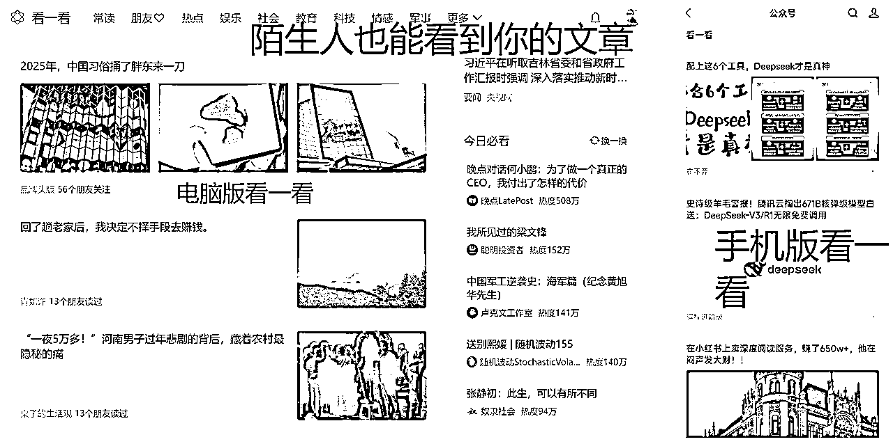

优质的内容会被平台注意到！会被用户注意到！会自动被传播出去！

你的文章，用户觉得有用！可能会转发到朋友圈或者微信群，这样其他人也能看到！

用户喜欢你的文章，他们会留言、点赞或者点“在看”，会让你的文章被更多人看到！

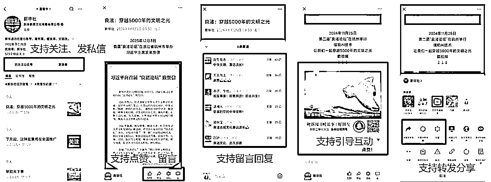

##### 内容表达形式很多

公众号不仅可以发图文（文字+图片），图文是最常见的一种形式，还可以发视频、音频，甚至做直播。

*   文章中可以插入视频号。

*   文章中可以插入文字图片。

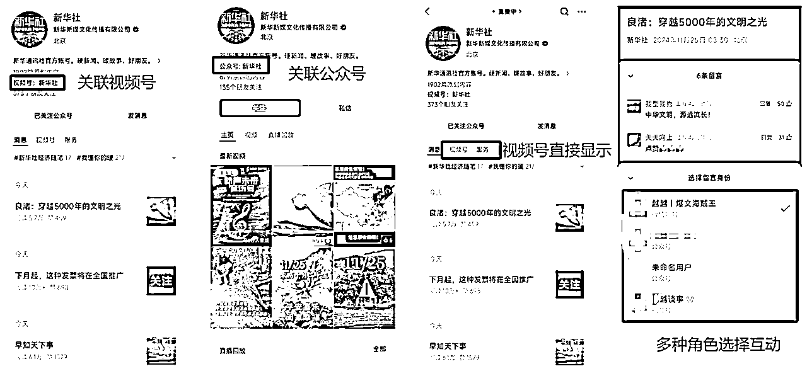

##### 优质文章会被推荐

公众号有一个叫“看一看”的功能，系统会根据用户的兴趣推荐文章。

内容推荐逻辑：先尝试小范围推荐，根据数据反馈再决定是否继续大范围推荐。

区域推荐逻辑：先推荐发文地附近的人阅读，再推荐其他范围，同样需要看数据反馈。

粉丝推荐逻辑：先推荐给粉丝，粉丝提供的互动价值会反馈给算法。


就拿上面的数据来看，互动数据越好，系统推荐越多。

如果你的文章很多人点赞、留言，系统会觉得这篇文章不错，会推荐给更多人。

系统会将文章优先推荐给具备相同标签的用户：

1.  经常看某个领域的文章。

1.  经常搜索某个关键词。

1.  经常在聊天中输出某个词汇。

但不是所有文章都会被系统推荐，请仔细看下面：

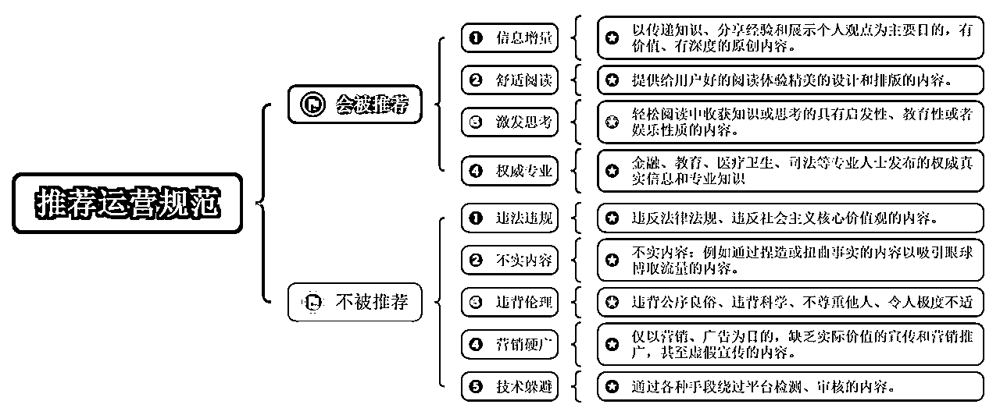

经常会有人提问：为什么我的账号没有被系统推荐？

没有被系统推荐的原因有很多，大家可以参考以下内容对照着自己的情况看看。

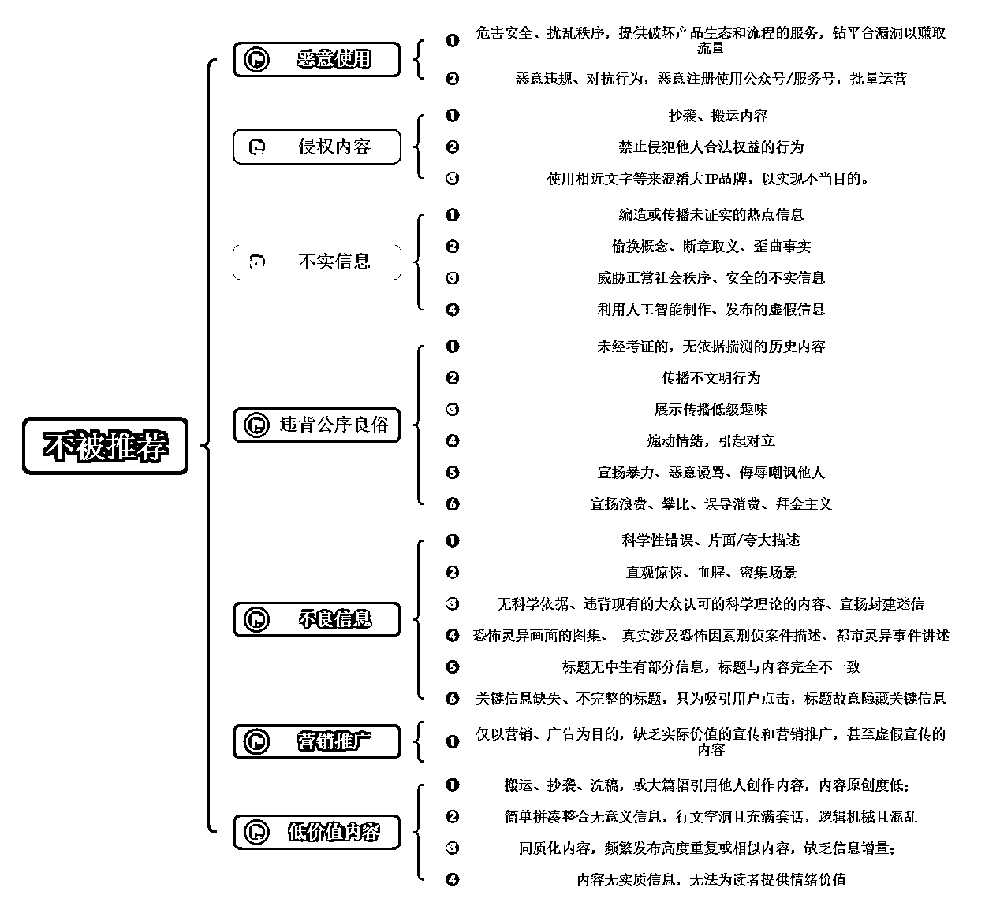

当我们不知道文章中的哪些内容可能会触犯规则？

我的建议

1.  内容质量：向用户提供有价值的信息，避免空洞无物或过度营销，也就是需要搭配具体的使用场景。

1.  用户体验：注重文章排版设计，提升阅读舒适度，好的排版是重点分明、图片清晰。

👉 我们可以告诉deepseek（深度思考模型+联网模式）：

```
方案一：请根据'公众号运营规范和官方违规案例'，帮我判断我的文章是否存在违规风险？
方案二：请根据'公众号运营推荐规范和官方违规案例'，请帮我优化'文章内容'的推荐率？
```

我提前使用deepseek给大家罗列了一些不被系统推荐的情况和处理措施。

缺乏信息增量

问题：内容过于泛泛，没有提供新知识或独特观点。

*   文章标题：如何提高工作效率？只罗列“早睡早起”“列待办清单”常见建议，缺乏深度分析或个人经验。

*   改进建议：结合实践，分享“如何用番茄工作法在3小时完成一天任务”，具体操作步骤和效果对比。

排版混乱，阅读体验差

问题：文章段落过长、无分段、无配图，导致用户阅读疲劳。

*   一篇2000字的旅行攻略，全篇文字堆砌，没有分段、标题或图片，用户难以快速找到关键信息。

*   改进建议：使用小标题分段（如“交通指南”“美食推荐”“避坑提示”），并插入景点实拍图或地图截图。

###### 内容缺乏启发性

问题：文章平淡无奇，无法引发用户思考或共鸣。

*   文章标题：“为什么年轻人喜欢熬夜”，但内容只是简单描述现象，没有分析原因或提出解决方案。

*   改进建议：深入探讨“熬夜背后的心理需求”，结合心理学提出“如何通过时间管理改善熬夜习惯”建议。

###### 专业性不足

问题：涉及专业领域时，内容缺乏权威支持或存在误导。

*   文章标题：“喝红酒能预防心脏病”，但未引用任何医学研究或专家观点，内容主观臆断。

*   改进建议：引用权威医学期刊的研究数据，并注明“适量饮酒”的前提条件，避免误导用户。

###### 标题党或虚假信息

问题：为吸引点击，使用夸张标题或传播不实内容。

*   文章标题：“震惊！某明星突然宣布退出娱乐圈”，但正文内容与标题无关，只是普通娱乐新闻。

*   改进建议：标题应与内容一致，例如“某明星新剧开播，演技获好评”，避免误导用户。

###### 违背伦理或公序良俗

问题：内容涉及歧视、攻击他人或传播不良价值观。

*   文章标题：“女性30岁不结婚就是失败”，内容充满性别歧视和偏见。

*   改进建议：改为“30岁女性的多元人生选择”，探讨不同生活方式的优缺点，传递积极价值观。

###### 硬性营销

问题：内容以广告为主，缺乏实际价值。

*   文章标题：“这款产品让你年轻10岁”，通篇推销某护肤品，无真实用户体验或测评。

*   改进建议：改为“30天实测：这款护肤品真的有效吗？”，分享真实使用体验，并客观分析优缺点。

技术躲避

问题：试图通过技术手段规避平台审核。

*   在文章中嵌入“加我微信”的二维码，引导用户跳转到外部平台进行交易。

*   遵守平台规则，避免使用违规手段。如需推广，可通过合规方式（如公众号菜单栏）引导用户。

##### 粉丝变现能力很强

因为大家都经常用微信，所以公众号的内容很容易被用户看到。

比如你每天早上发一篇文章，关注者打开微信就能看到。

如果用户喜欢你的内容，他们会一直关注你，成为你的忠实粉丝。

##### 优质内容持续推荐

公众号的文章不像新闻，过几天就没人看了。

好的文章会一直被搜索到，可能会一直被系统所推荐，或者通过历史消息被阅读。

比如你写了一篇“如何学好英语”的文章，可能一年后还有人搜到并阅读。

爆款文章的效果更持久，可能几个月甚至几年后还能带来流量。

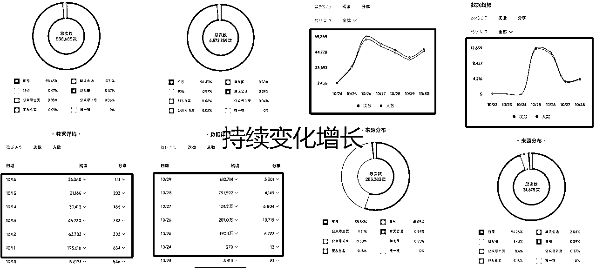

##### 流量变现能力很强

*   流量主广告：如果你的公众号粉丝多了，可以开通广告功能，文章底部会自动显示广告，你就能赚钱。

*   内容付费：你可以写一些特别有价值的文章，设置成付费阅读，用户需要付钱才能看。

*   电商带货：你可以在文章里推荐商品，用户通过你的链接购买，你就能赚佣金。

*   知识付费：你可以开课程或者做社群，教别人一些技能，比如写作、理财等。

*   品牌合作：如果你的公众号做得好，可能会有品牌找你合作，让你写文章推广他们的产品。

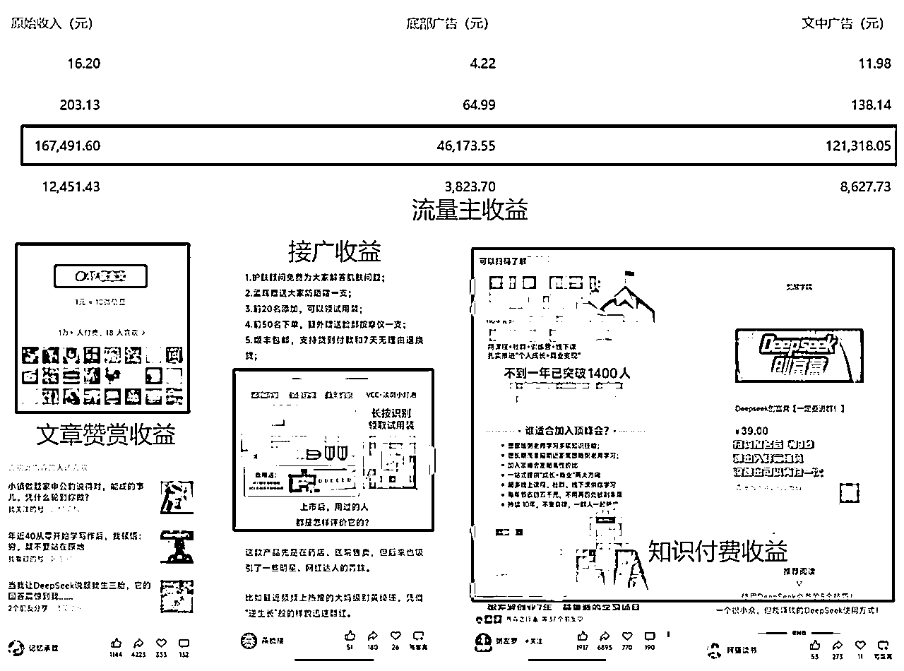

##### 小号也能爆发成长

注册公众号很简单，但想要做好需要花心思。

比如你开了一家店，装修得好看、商品质量好，才能吸引顾客。

别看大号（粉丝多的公众号）更容易获得流量，但小号只要内容做得好，也有机会慢慢做起来。

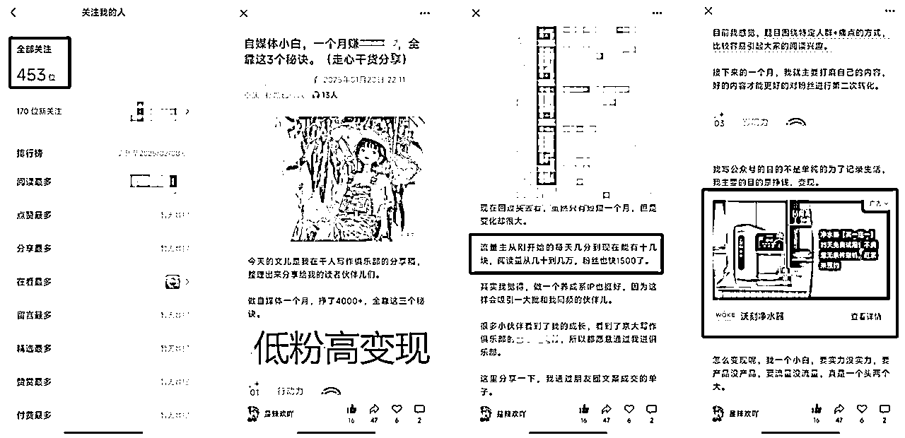

##### 根据数据进行调整

公众号后台可以看到很多数据，比如文章阅读量、点赞数、留言数，还能知道用户的年龄、性别、地区等。

这些数据可以帮助你了解用户喜欢什么内容，从而调整你的写作方向。

比如你发现用户更喜欢看职场类文章，就可以多写这方面的内容。


##### 规章制度非常严格

公众号对内容审核很严格，不能发虚假信息、敏感话题或者过度营销的内容。

比如你不能写一篇标题党文章吸引点击，但内容却和标题完全不符。

如果违规，可能会被警告甚至封号，所以一定要遵守规则。

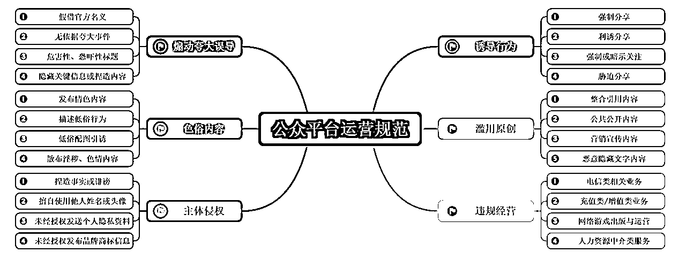

#### 用户分享的底层逻辑

用户分享文章通常基于以下两种动机：

1.  情绪驱动：文章激发了用户的某种情绪（如感动、愤怒、好奇、自豪），他们希望通过分享表达自己的情感。

1.  社交货币：如果你的文章能够帮助用户在社交中塑造形象、传递价值或引发讨论。

##### 激发用户情绪

情绪是用户分享的最大动力之一。

###### 感动与共鸣

解释：文章通过感人故事或深刻观点，让用户产生情感共鸣。

👉 告诉deepseek（通用模式）：

```
请帮我分析'文章内容'中能够产生情感共鸣的细节。
```

###### 愤怒与正义感

解释：文章通过揭露不公或批判现象，激发用户的愤怒和正义感。

👉 告诉deepseek（通用模式+联网模式）：

```
请你结合'热点事件/文章内容'输出犀利观点，用数据和案例增强说服力。
```

###### 好奇与惊喜

解释：文章通过悬念或意外结局，激发用户的好奇心和分享欲。

👉 告诉deepseek（通用模式+联网模式）：

```
请优化'文章内容'中所体现的“好奇与惊喜”。
```

###### 自豪与成就感

解释：文章让用户觉得自己“学到了”或“被认可”，从而产生自豪感。

👉 告诉deepseek（通用模式+联网模式）：

```
'文章内容'中哪些内容让用户感觉到自豪和成就感？请帮我优化。
```

##### 看到文章想到你

用户在看到你的文章全文或者标题就想到作者是你，风格独树一帜！

###### 塑造人设

解释：文章能够帮助用户塑造某种形象，看到文章就想到你是什么样的人？

👉 告诉deepseek（通用模式+联网模式）：

```
请帮我分析'文章内容'中的人设，我该怎样去模仿？
```

###### 传递价值

解释：文章内容能够帮助用户为朋友或家人提供价值。

👉 告诉deepseek（通用模式+联网模式）：

```
请分析'文章内容/文章标题'能够为用户传递什么价值？请帮我优化。
```

###### 引发讨论

解释：文章内容能够引发用户的讨论或互动。

👉 告诉deepseek（通用模式+联网模式）：

```
请分析'文章内容/文章标题'中能激发用户剧烈讨论的内容。
```

###### 易于分享

通过激发用户的情绪和满足社交需求，文章阅读量就能大幅度上升：

1.  设计情感共鸣点：让用户觉得“这篇文章说到我心坎里了”。

1.  提供社交价值：让用户觉得“分享这篇文章对我有好处”。

设计金句

方法：在文章中提炼出简洁有力、易于传播的金句。

👉 告诉deepseek（通用模式+联网模式）：

```
方案一：我有'观点'，请生成'10'个爆款金句，要求'富有传播力、让用户印象深刻'。
方案二：请根据'文章段落'，生成'传播力强'的爆款金句。
方案三：请根据'热点事件'中网友的观点，生成爆款金句。
```

设置福利

方法：用户转发文章后可领取资料或参与抽奖。

例子：“转发本文至朋友圈，截图发送至后台，即可领取《新手理财指南》。”

1.  福利吸引力：确保福利对目标用户有足够的吸引力。

1.  操作简便：让用户的操作步骤尽量简单，避免繁琐。

1.  及时兑现：用户完成任务后，及时发放福利，建立信任。

1.  规范书写：不要出现类似“强制性转发、不转发就会有不好结局”的内容。

引导互动

方法：在文章末尾设置问题或话题，鼓励用户留言。

例子：“你有没有类似的经历？欢迎在评论区分享。”

👉 告诉deepseek（通用模式+联网模式）：

```
请帮我设计10个适用于公众号文章结尾的互动引导钩子。
```

等待deepseek答复：

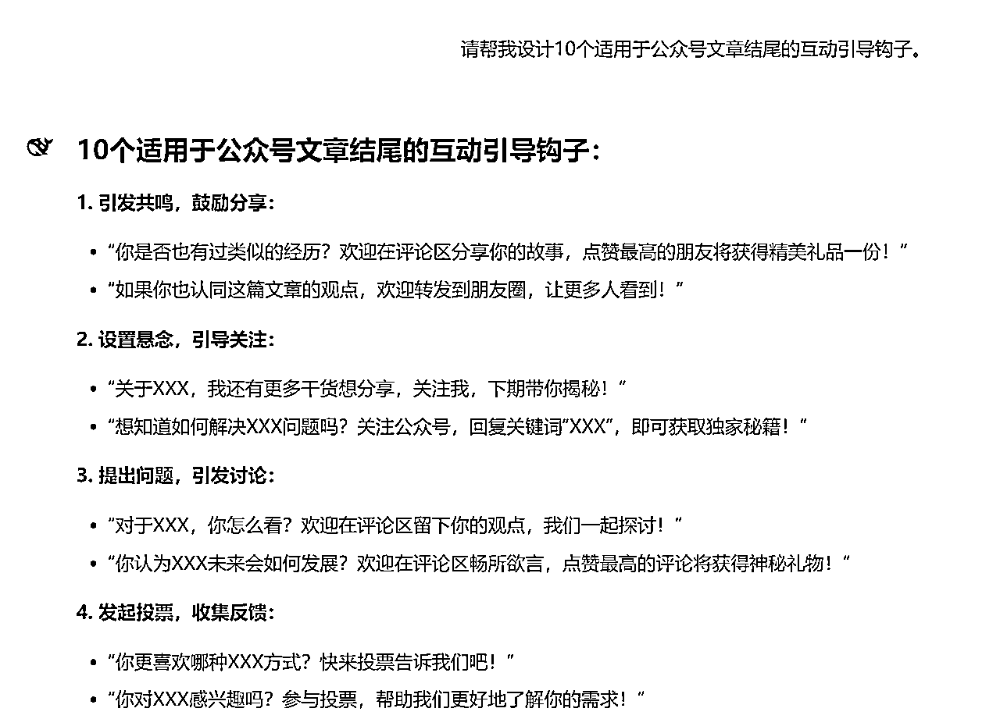

###### 综合使用

在实际使用过程中，我们不需要每一个条件都要满足，我们只需要根据文章和素材的实际情况进行选择。

上文中所提到的deepseek提示词可以适用于对标文章分析，也可为自己的文章进行诊断。

下面我提供一个编写新的原创文章提示词：

第一步：👉 告诉deepseek（深度思考模式+联网模式）：

三个方案中选择其一：

```
方案一：结合'热点事件中的某个观点'，为我生成符合专业人士、有高价值、能够引发用户互动的爆款文章大纲。
方案二：结合'文章内容'，为我生成差异化极高、又能吸引用户阅读互动的爆款文章大纲。
方案三：结合'某某观点'，为我生成极具阅读感、差异化的爆款文章大纲。
```

第二步：👉 告诉deepseek（通用模式+联网模式）：

```
请填充刚才生成的文章大纲，要求包含故事+观点+激发用户情绪+引发互动，生成'字数'的爆款文章。
```

第三步：👉 告诉deepseek（深度思考模式+联网模式）：

```
请检查刚才生成的文章，从公众号爆款写作的角度分析，提出优化建议。
```

第四步：👉 告诉deepseek（通用模式+联网模式）：

```
请根据优化建议进行优化，生成新文章，并给出排版建议。
```

第四步：👉人工检查文章表述：

```
重点检查文字语言表述情况，并进行修改。
```

第五步：👉deepseek检查文章表述（深度思考模式+联网模式）：

```
请着重检查'人工调整完毕的文章'是否符合《公众号平台运营规范》。
```

六步：👉追问deepseek（深度思考模式+联网模式）：

```
根据优化后的文章，生成'10'个爆款标题。
```

## 爆款文章的底层写作

在上文中提到，我们写文章是给用户阅读，通过文章赚用户、平台的钱。

那么用户和平台就是我们的”衣食父母“，我们就得去为他们写作。

通过文章的形式表达我们自己的观点。

提前准备3个核心要素：

*   目标人群画像（年龄/痛点/兴趣）

*   内容领域定位（职场/情感/科技等）

*   账号风格设定（严肃/幽默/温情）

能帮助你持续输出优质内容，还能让你在运营过程中保持热情和动力。

### 明确账号定位

#### 明确目标用户

用户画像：你得清楚你的目标用户是谁？

*   年龄、性别、职业、兴趣爱好、生活习惯等。

例如：职场新人、宝妈、大学生、理财小白等。

低粉之所以能够变现，取决于账号的目标用户很明确。

发的文章符合粉丝的需求，那么粉丝粘性自然就高，变现能力也就越强。

确定定位的原则就是：

1.  做得开心；

1.  做得专业；

1.  做得长久；

经过以上方法确定定位后，基本可以开始动手操作。

##### 找到兴趣和专长

我们首先得分析自己的自身情况，看看自己到底是个什么样的人？

1.  兴趣：你对什么话题感兴趣？比如美食、旅行、职场、情感、教育、科技等。

1.  专长：你有哪些技能或经验可以分享？比如职场经验、学习方法、理财知识、育儿心得等。

1.  结合点：找到兴趣和专长的交集，这可能是你内容的核心方向。

举例：

*   如果你喜欢读书，可以分享读书笔记、书单推荐。

*   如果你擅长理财，可以分享理财技巧、投资心得。

我们还可以通过借助deepseek帮助我们认清自己。

👉 告诉deepseek（通用模式+联网模式）：

```
方案一：我的爱好是'看书（爱好）'，尤其擅长'拆解书籍中的观点（擅长点）'，那么我可以为用户分享什么？
方案二：我的爱好是'看书（爱好）'，尤其擅长'拆解书籍中的观点（擅长点）'，那么我可以为用户产生什么价值？
```

##### 初步假设用户

比如我目前没有明确的定位，那么我就假设我想做"某某领域"，

根据你的内容方向，假设你的目标用户可能是谁？

*   如果你分享职场经验，目标用户可能是职场新人或求职者。

*   如果你分享育儿经验，目标用户可能是宝妈或准父母。

先假设自己的定位已经确定，再在假设的基础上去分析。

👉 告诉deepseek（深度思考模式+联网模式）：

```
我想做公众号，我可以分享'技能/经验/方法论'，那么我的文章目标用户是谁？
```

接下来，我们需要：

细化用户画像：先假设他们的年龄、性别、职业、兴趣爱好、痛点等。

*   示例：25-35岁的职场女性，关注个人成长、职场技能和生活方式。

这里我给大家提供一个更加高效便捷的提示词：

👉 告诉deepseek（通用模式+联网模式）：

```
我的文章目标用户是'目标用户'，我想要分享'分享内容'，请细化用户画像。
```

##### 调研市场需求

调研市场需求的核心目的是了解目标用户的兴趣、痛点和内容偏好，

同时分析竞争对手的情况，找到自己的差异化机会。

###### 搜索优质对标

以优秀者为榜样，学习他们的优点，弥补自身的不足，从而提升自己的竞争力。

这就是对标的定义，那么前提是”优秀者“，何为优秀的对标？

优秀的对标应该具备以下特征：

1.  目标明确，聚焦关键：只深耕某一个具体领域。

1.  对象精准，选择合适：选择跟自己发展情况相似、优秀的群体。

1.  数据详实，分析深入：有优秀的数据可以分析验证。

1.  结合实际，创新改进：使用对标的时候要借鉴，而不是搬运抄袭。

1.  持续跟踪，动态调整：定期关注对标的运营情况，而不是随便看一下。

我们能够对标什么？写作风格、语言表达、叙事技巧等方面的特点，并结合自身写作主题和目标用户进行学习和创新，而不是简单地模仿其写作套路。

我们能够对标这些方面内容：

1.  内容方面：

*   选题方向： 对标公众号的选题方向是什么？他们是如何挖掘用户痛点和兴趣点的？

*   内容质量： 对标公众号的内容质量如何？文章结构、逻辑、语言表达等方面有哪些值得学习的地方？

*   内容形式： 对标公众号采用了哪些内容形式？图文、视频、音频、直播等，哪种形式更受用户欢迎？

*   更新频率： 对标公众号的更新频率如何？他们是怎样保持持续输出的？

1.  用户运营方面：

*   用户画像： 对标公众号的目标用户是谁？他们的年龄、性别、地域、兴趣爱好等特征是什么？

*   用户增长： 对标公众号是如何吸引新用户的？他们采用了哪些推广渠道和策略？

*   用户活跃： 对标公众号是如何提高用户活跃度的？他们有哪些互动活动和运营手段？

*   用户粘性： 对标公众号是如何提高用户粘性的？他们有哪些留住用户的方法和技巧？

1.  商业变现方面：

*   变现模式： 对标公众号采用了哪些变现模式？广告、电商、知识付费、社群等，哪种模式更适合你？

*   变现效率： 对标公众号的变现效率如何？他们的客单价、转化率、复购率等数据是多少？

*   用户体验： 对标公众号在商业变现过程中是如何平衡用户体验和商业利益的？

作为Ai自媒体，当然需要使用Ai帮我们去分析对标。

👉 告诉deepseek（深度分析模式+联网模式）：

分析对标账号：

```
请分析以下公众号账号的运营特征：
【账号名称】：'账号名称'
【账号简介】：'账号简介'
【目标用户】：'目标用户'
【高频关键词】：'高频关键词'（如：职场、育儿、理财）
【近期热门文章标题】：
1\. '文章一'
2\. '文章二'
3\. '文章三'

请总结：
- 该账号的核心定位和差异化优势
- 内容选题的规律和爆款共性
- 可借鉴的运营策略（互动/排版/变现等）
```

对标文章拆解:

```
请分析以下文章的成功要素：
【文章标题】：'文章标题'
【文章内容】：'文章正文'

请分析：
1\. 标题吸引力的3个技巧
2\. 文章结构框架（痛点引入-解决方案-升华总结等）
3\. 引发共鸣的金句/案例
4\. 可复用的写作模板
```

数据对比分析

```
我的账号近期数据：
平均阅读量：'阅读量'
点赞率：'点赞率'
转发率：'转发率'
用户留言高频词：'高频词'

对标账号数据：
- 平均阅读量：'阅读量'
- 点赞率：'点赞率'
- 转发率：'转发率'
- 用户留言高频词：'高频词'

请分析：
1\. 双方的核心差距点
2\. 用户需求差异
3\. 内容优化建议
```

可供实操的案例演示：

👉 告诉deepseek（深度分析模式+联网模式）：

```
请分析以下账号特征：
【账号名称】职场进化论
【账号简介】专注职场新人到高管的成长方法论
【高频关键词】跳槽、沟通、升职、时间管理
【近期爆款标题】：
1\. 《领导最反感的3种汇报方式，90%的人中招》
2\. 《月薪5K和5W的人，差的不只是能力》
3\. 《被裁员后，我靠这2个副业月入3W》
```

特别实用的小技巧：

*   内容模式总结：输入多篇对标文章标题，让 Ai总结选题规律（如《月薪3K到3W，我的3个跳槽心法》《普通人攒够100W的5个习惯》→ 可总结「数字+痛点+身份标签」的标题公式）。

*   用户评论分析：手动整理对标文章留言，输入后让 AI 提炼用户痛点和情感倾向。

*   竞品策略推理：推测运营动作（如「该账号每周三发布干货，周五发布互动话题，建议学习其内容节奏」）。

对标公众号时，需要注意以下几点：

*   选择适合自己的对标对象： 不要盲目追求大号，要选择与定位相似、发展相近的公众号进行对标。

*   深入分析，找出差距： 不要只看表面数据，要深入分析对标公众号的成功原因，找出自身差距。

*   结合实际，创新改进： 不要盲目照搬，要结合自身实际情况，对优秀经验进行消化吸收和创新改进。

查找对标的操作方法

1.  在微信中搜索与你内容方向相关的关键词（如“职场”、“育儿”、“理财”等）。

1.  查看排名靠前的公众号，关注他们的内容风格、更新频率、粉丝互动等。

👉 告诉deepseek（通用模式+联网模式）：

```
我的内容方向是'内容方向'，用于在微信“搜一搜”中进行搜索，请帮我生成10个公众号搜索的细分关键词。
```

deepseek给出的答复：


接下来在微信“搜一搜”中进行搜索，优先选择阅读量高的文章：


温馨提示：

这个方法也可以用于确认对标文章和账号。

拆解对标细节

分析对标文章和账号中用户的情感倾向，以便我们判断这篇文章用户的感受如何？

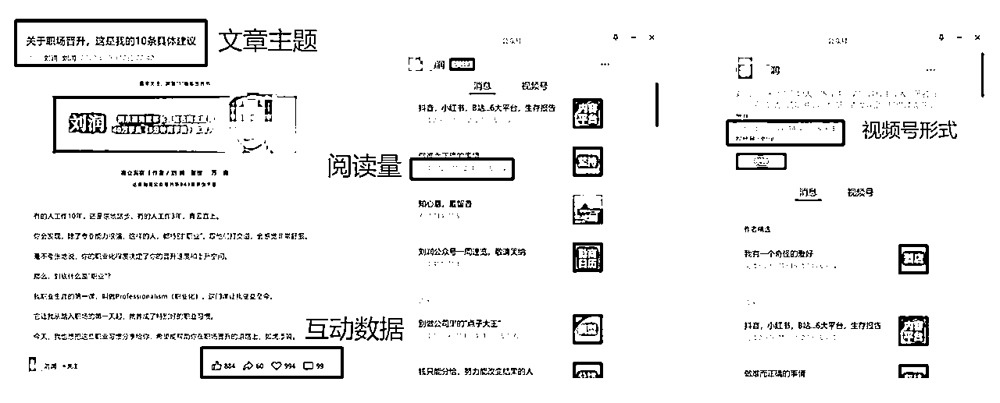

用户情感倾向

1.  从评论区、留言区观察用户的兴趣点和痛点。

1.  通过公众号简介和菜单栏，了解他们的目标用户是谁。

*   示例：如果你想做职场类公众号，可以搜索“职场技能”、“求职面试”等关键词，找到相关公众号，分析他们的内容方向和用户反馈。


👉 告诉deepseek（通用模式+联网模式）：

```
方案一：这是'评论区评论'，请分析这些用户的兴趣点和痛点。
方案二：这是'文章内容'，请分析这篇文章对应用户的兴趣点和痛点。
```

从账号简介中可以看出，刘润账号的目标人群。

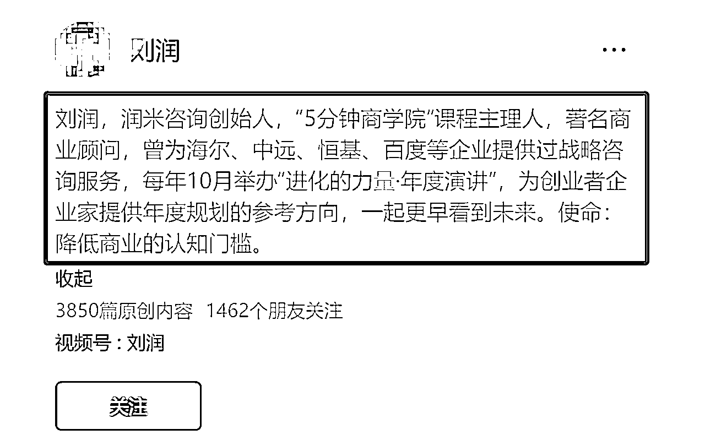

###### 分析热门内容

1.  使用工具（如新榜、次幂）查看热门公众号的爆款文章。

新榜工具链接：https://www.newrank.cn/

次幂工具链接：https://www.cimidata.com/articles/hot/10w


1.  分析这些文章的标题、结构、内容切入点。

1.  这些文章解决了用户的什么问题？

*   它们的标题和开头是如何吸引用户的？

*   它们的结尾是否有引导互动（如提问、引导分享）？

示例：如果你发现“如何高效管理时间”这类文章阅读量很高，说明职场人群对时间管理有强烈需求。

###### 使用指数数据分析

1.  微信指数：查看关键词的热度趋势。

1.  分析方法：

*   输入与你内容方向相关的关键词，查看热度变化。

*   分析热门公众号的粉丝画像（年龄、性别、地域等）。

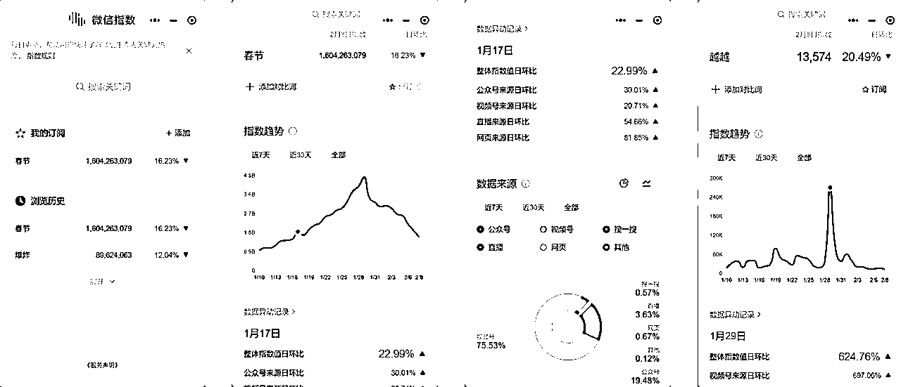

###### 观察社交媒体和论坛

1.  去知乎、豆瓣、微博等平台，搜索与你内容方向相关的话题。

1.  观察用户的讨论内容，找到他们的痛点和需求（点击链接可以直接跳转）。


关注点：

1.  他们在讨论什么问题？

1.  哪些问题被反复提及？

1.  哪些回答或内容获得了高赞？

###### 总结市场需求

1.  根据以上调研，总结出目标用户的核心需求和兴趣点。

1.  找到你可以切入的细分领域或差异化角度。

👉 告诉deepseek（通用模式+联网模式）：

```
这是我的领域'领域名称'，输出细分领域。
```

#### 小范围测试

##### 确定测试主题

1.  根据调研结果，选择3-5个可能受欢迎的主题。

1.  每个主题围绕一个具体的用户痛点或兴趣点。

主题一：......

主题二：......

主题三：......

*   示例：职场类公众号可以测试以下主题：

1.  主题一：如何写一份让HR眼前一亮的简历？

1.  主题二：职场新人如何快速适应工作环境？

1.  主题三：如何高效管理时间，避免加班？

👉 告诉deepseek（深度思考模式+联网模式）：

```
我的公众号文章主题是'职场Pua'，请帮我罗列出'10'个可能受用户欢迎的主题，并进行验证。
```

等待deepseek答复：

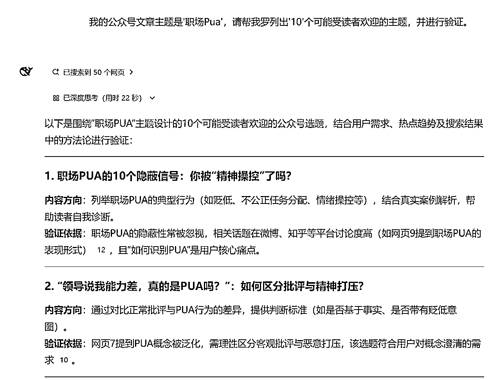

##### 发布测试文章

1.  频率：每周发布1-2篇测试文章，保持一定的更新频率。

1.  形式：以图文为主，确保内容结构清晰、语言通俗易懂。

1.  标题：使用吸引人的标题，但避免标题党。

##### 观察数据反馈

1.  阅读量：哪些文章的阅读量较高？

1.  点赞和在看：哪些文章获得了更多点赞和“在看”？

1.  留言互动：哪些文章引发了更多留言和讨论？

1.  转发量：哪些文章被更多人转发到朋友圈或微信群？

*   重点关注：

1.  用户的留言中提到了哪些问题或需求？

1.  他们是否对你的内容提出了改进建议？

##### 分析测试结果

1.  受欢迎的主题：找出阅读量、互动量较高的文章，分析其受欢迎的原因。

1.  不受欢迎的主题：找出阅读量较低的文章，分析其问题所在（如标题不吸引人、内容不够实用等）。

1.  用户需求：从留言和互动中提炼出用户的核心需求。

##### 调整内容方向

1.  聚焦受欢迎主题：根据测试结果，选择1-2个最受欢迎的主题作为核心方向。

1.  优化内容形式：根据用户反馈，调整文章结构、语言风格或呈现形式。

1.  尝试新角度：在受欢迎的主题基础上，尝试从不同角度切入，保持内容的新鲜感。

*   示例：

如果“时间管理”主题的文章很受欢迎，可以进一步细分：

1.  《时间管理：如何利用碎片化时间学习？》

1.  《时间管理：如何避免拖延症？》

##### 持续测试优化

1.  定期测试：每隔一段时间（如1个月）测试新的主题或形式，保持内容多样性。

1.  跟踪数据：持续观察阅读量、互动量等数据，了解用户的兴趣变化。

1.  迭代优化：根据数据反馈，不断优化内容方向和形式。

##### 文章留言互动

引导留言：在文章结尾提出问题，鼓励用户分享看法或经验。

1.  “你有遇到过职场PUA吗？欢迎在评论区分享你的故事。”

1.  “你觉得哪些行为属于职场PUA？留言告诉我吧！”

*   回复留言：及时回复用户的留言，展现你的关注和用心。

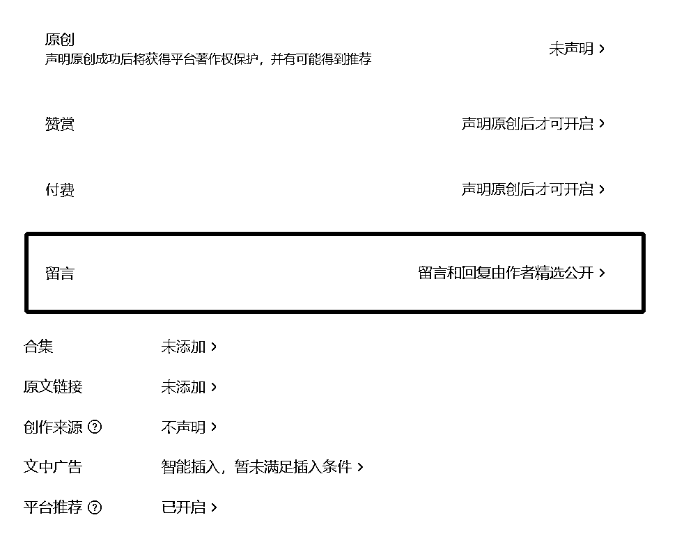

温馨提示：

留言功能并不是所有账号都有，系统随机开通，正常使用一段时间即会出现！

### 四步创作正文

高质量的内容结构通常体现以下特点： 层次感、节奏感、互动性。

先给做Ai自媒体的各位一套完整写文的提示词：

👉生成选题规划，告诉deepseek（深度思考模式+联网模式）：

```
任务目标：生成[具体领域]的选题规划 
背景信息： 
- 账号定位：[填写定位] 
- 目标用户：[用户画像] 
- 核心诉求：[用户需求] 
要求： 
（1）生成10个选题方向 
（2）每个选题包含： 
- 主标题 
- 副标题 
- 核心观点 
- 价值主张 
（3）考虑时效性与持久性的平衡 
输出格式：表格呈现
```

👉生成文章标题，告诉deepseek（深度思考模式+联网模式）：

```
请基于以下要素生成文章标题: 
主题：[主题] 
核心观点：[观点] 
目标用户：[用户群体] 
价值类型：分析型/方法型/经验型 
表达基调：专业/犀利/温和 
必要元素：数据点/行业洞察/专家引用 
差异化要求： 
- 竞品分析：[3—5个同主题标题] 
- 创新角度：[具体说明] 
生成要求： 
- 提供3个方案 
- 每个方案说明亮点
```

👉生成文章内容，告诉deepseek（深度思考模式+联网模式）：

```
任务描述：创作一篇深度分析类文章 
主题：[主题] 
目标：[写作目的] 
一、结构设计要求： 
（1）开篇模块（800字以内） 
- 问题背景：从[数据/现象/热点]切入 
- 现状分析：点明行业痛点与挑战 
- 核心观点：提出独特视角与解决思路 
（2）主体部分（2500字左右） 
- 分论点展开：3—4个核心论点 
- 每个论点要求： 
* 观点陈述（150字左右） 
* 原理解析（300字左右） 
* 案例佐证：2个典型案例 
* 数据支撑：权威来源数据 
* 专家观点：引用领域专家验证 
（3）结尾部分（700字以内） 
- 观点总结：呼应开篇 
- 趋势判断：前瞻性洞察 
- 行动建议：3—5点可执行建议 
二、互动设计节点： 
（1）开篇互动：设置情境思考问题 
（2）主体互动：每个论点后设置观点讨论区 
（3）结尾互动：邀请用户分享经验与观点三、 
三、内容节奏控制： 
（1）信息密度分配： 
- 开篇：以叙事为主，重在引发兴趣 
- 主体：论证为主，配比为 论述40% + 案例 
30% + 数据20% + 专家观点10% 
- 结尾：以洞察和建议为主，突出实操价值 
（2）段落节奏： 
- 重点论述段：250—300字 
- 案例描述段：200—250字 
- 数据分析段：150—200字 
- 过渡段落：100字左右 
四、高级要求： 
（1）逻辑展开： 
- 论点之间：递进/并列/转折关系明确 
- 论据支撑：多维度佐证，避免单一类型证据 
（2）思维深度： 
- 表层：现象描述与问题呈现 
- 中层：原因分析与逻辑推导 
- 深层：本质洞察与规律总结 
（3）风格把控： 
- 语言基调：专业中立 
- 专业术语：核心术语解释到位 
- 表达方式：逻辑严谨，生动易懂 
注意事项： 
1\. 避免观点过于绝对 
2\. 确保数据来源可靠 
3\. 案例选择需要具有代表性 
4\. 互动设计要自然融入文脉
```

根据清华大学的《Deepseek实用指南》中，我们可以发现无论是哪个提示词，我们都需要添加很详细的内容，这些内容在上文中我们已经详细讲解。

接下来，我将结合提示词中提到的内容分步解释：

#### 选题爆破（30%精力）

##### 如何做选题爆破？

###### 明确目标用户

1.  你需要清楚你的文章是写给谁看的。比如：

*   如果你的用户是职场新人，他们可能关心“如何快速升职加薪”。

*   如果你的用户是宝妈，她们可能更关心“如何让孩子爱上学习”。

小白技巧：想象你的用户是什么样的人，他们每天会遇到什么问题，最需要什么帮助。

👉 告诉deepseek（深度思考模式+联网模式）：

```
方案一：我的公众号文章主题是'职场Pua'，请帮我罗列出'10'个可能受用户欢迎的细分选题，并进行验证。
方案二：请你满足用户的'用户需求'，生成10个高价值的爆款选题，并进行验证。
方案三：如果我的用户是'用户画像'，他们可能最关心什么？请列举10个当前最受用户欢迎的选题，并进行验证。
```

###### 结合热点

*   热点就是大家都在讨论的事情。比如：

1.  节假日（春节、国庆）前后，可以写“春节回家如何应对亲戚的催婚”。

1.  社会热点事件（比如某个明星离婚），可以写“从XX事件看现代婚姻的真相”。

小白技巧：平时多刷微博、抖音、知乎，看看大家都在聊什么，找到和你领域相关的热点。

👉 告诉deepseek（深度思考模式+联网模式）：

```
方案一：账号定位是'某'，请结合'节假日'时间节点，帮我罗列出适合公众号用户的10个细分爆款选题，并验证。
方案二：账号定位是'某'，请结合'社会热点'，帮我罗列出适合公众号用户的10个细分爆款选题，并验证。
方案三：账号定位是'某'，请帮我'采集最近一周热点前十榜单'，罗列出适合公众号的10个细分爆款选题并验证。
```

###### 制造情绪共鸣

*   好的选题能引发用户的情绪，比如：

1.  好奇：为什么有些人工作轻松却赚得比你多？

1.  焦虑：30岁还没存款，我的人生是不是完了？

1.  共鸣：你是不是也经常熬夜，却不知道自己在忙什么？

小白技巧：在选题中加入情绪词，比如“震惊”“颠覆”“扎心”“终于”等。

👉 告诉deepseek（深度思考模式+联网模式）：

```
方案一：请你结合'细分选题'，优化情绪共鸣，生成爆款选题。
方案二：请你提炼出'细分选题'中，用户能够感受到的情绪，并给出后续的优化建议。
```

👉 告诉deepseek（深度思考模式+联网模式）：

```
请你为我确定一个爆款选题方案，供我去使用。
```

###### 用问题式标题

*   人们天生对问题感兴趣。比如：

1.  普通标题：职场新人如何快速成长？

1.  问题式标题：为什么你工作3年，还不如别人工作1年？

小白技巧：多用“为什么”“如何”“怎样”等词开头，让用户觉得你的文章能解决他们的疑问。

👉 告诉deepseek（深度思考模式+联网模式）：

```
任务目标： 生成[具体领域]的选题规划 背景信息：
- 账号定位： [填写定位]
- 目标用户： [用户画像]
- 核心诉求： [用户需求] 要求：
（1） 生成10个选题方向
（2） 每个选题包含： 
- 主标题
- 副标题
- 核心观点
- 价值主张
（3） 考虑时效性与持久性的平衡 输出格式： 表格呈现
```

##### 选题实操步骤

可参考如下deepseek提示词：

👉 告诉deepseek（深度思考模式+联网模式）：

```
请根据[目标人群]的痛点，生成10个具有传播力的选题方向，要求：
结合最近30天的热点事件
包含情绪触发词（震惊/颠覆/揭秘）
使用"为什么/如何/终于"等句式
```

#### 结构设计（20%精力）

高质量的内容结构通常体现以下特点：

证据链完整 ：每个观点都需要数据支撑、案例验证或专家背书。

逻辑递进 ：论点需要形成清晰递进关系。

多维视角 ：在论证过程中融入不同视角的观点，既展现思考的全面性，又能增强文章的可信度。

设计金字塔结构

*   金字塔结构是最常用的文章结构，分为三部分：

1.  开头：吸引用户注意，告诉他们为什么要看这篇文章。

1.  中间：详细展开内容，解决用户的问题。

1.  结尾：总结全文，引导用户行动（比如点赞、转发、留言）。

##### 开头：设置悬念钩子

*   开头的目的是吸引用户继续看下去。你可以：

1.  提出一个扎心的问题：比如“为什么你工作3年，工资却不如别人1年？”

1.  讲一个有趣的故事：比如“昨天我朋友因为不会说话，被领导骂了一顿……”

1.  用数据制造反差：比如“90%的职场新人都在犯这3个错误，你呢？”

##### 中间：展开核心内容

*   中间部分是文章的主体，用来解决用户的问题。你可以：

1.  分点论述：比如“职场新人必须掌握的3个技能”，然后分别展开。

1.  讲故事：用真实案例或故事来说明你的观点。

1.  列数据：用数据增强说服力，比如“根据XX调查，80%的职场新人都有这个问题”。

小白技巧：每一部分都要有逻辑衔接，不要让用户觉得跳跃。

##### 结尾：促成行动

*   结尾的目的是让用户有所收获，并引导他们行动。你可以：

1.  总结全文：比如“总之，职场新人要想快速成长，必须掌握这3个技能。”

1.  引发思考：比如“你是不是也遇到过类似的问题？欢迎留言分享。”

1.  引导行动：比如“如果你觉得这篇文章有用，欢迎点赞、转发给更多朋友。”

小白技巧：结尾要简洁有力，不要拖泥带水。

##### 结构设计的模板

直接套用这些模板，快速设计文章结构：

###### 问题-分析-解决方案

1.  开头：提出一个用户关心的问题。比如“为什么你工作3年，工资却不如别人1年？”

1.  中间：分析问题的原因。比如“原因1：你没有掌握核心技能；原因2：你不懂职场规则……”

1.  结尾：给出解决方案。比如“要想快速升职加薪，你可以这样做……”

👉 告诉deepseek（深度思考模式+联网模式）：

```
请按照“问题-分析-解决方案”的结构，撰写一篇公众号文章。
1\. 开头：提出问题
'提出一个用户关心的问题，问题要具体、有共鸣感。'

示例：'为什么你工作3年，工资却不如别人1年？'

2\. 中间：分析问题
'分析问题的原因，列出2-3个关键点，每个点用1-2句话说明。'

示例：
  1\. 原因1：'你没有掌握核心技能。'
  2\. 原因2：'你不懂职场规则'
  3\. 原因3：'你没有建立有效的人脉网络'

3\. 结尾：给出解决方案
'提供具体的解决方案，建议分步骤或分点说明，确保可操作性强。'

示例：
  1\. 解决方案1：'明确目标岗位的核心技能，制定学习计划并坚持执行。'
  2\. 解决方案2：'学习职场规则，比如如何高效沟通、如何向上管理。'
  3\. 解决方案3：'主动参加行业活动，建立并维护高质量的人脉关系。'

4\. 其他要求
语言风格：通俗易懂，贴近用户生活。
字数：800-1200字。
标题：吸引眼球，突出核心问题。
```

###### 故事-道理-行动

1.  开头：讲一个有趣的故事。比如“昨天我朋友因为不会说话，被领导骂了一顿……”

1.  中间：从故事中提炼出道理。比如“职场中，沟通能力比工作能力更重要……”

1.  结尾：引导用户行动。比如“如果你想提升沟通能力，可以试试这3个方法……”

###### 数据-分析-建议

1.  开头：用数据吸引注意。比如“根据XX调查，80%的职场新人都有这个问题……”

1.  中间：分析数据背后的原因。比如“为什么会出现这种情况？原因1……原因2……”

1.  结尾：给出建议。比如“如果你想避免这个问题，可以这样做……”

###### 小白避坑指南

1.  不要堆砌内容：每一部分都要有明确的目的，不要为了凑字数而写无关的内容。

1.  避免逻辑混乱：每一部分之间要有清晰的逻辑衔接，不要让用户觉得跳跃。

1.  结尾不要草率：结尾是用户最后的印象，一定要认真设计。

#### 内容生成（30%精力）

##### 如何高效生成内容？

###### 开头：吸引用户注意

*   你可以用以下方法：

1.  提出问题：比如“为什么你工作3年，工资却不如别人1年？”

1.  讲故事：比如“昨天我朋友因为不会说话，被领导骂了一顿……”

1.  用数据：比如“根据XX调查，80%的职场新人都有这个问题……”

*   小白技巧：开头一定要短小精悍，直接切入主题，不要啰嗦。

###### 中间：详细展开内容

*   你可以用以下方法：

1.  分点论述：比如“职场新人必须掌握的3个技能”，然后分别展开。

1.  讲故事：用真实案例或故事来说明你的观点。

1.  列数据：用数据增强说服力，比如“根据XX调查，80%的职场新人都有这个问题”。

*   小白技巧：每一部分都要有逻辑衔接，不要让用户觉得跳跃。

###### 结尾：总结并引导行动

*   你可以用以下方法：

1.  总结全文：比如“总之，职场新人要想快速成长，必须掌握这3个技能。”

1.  引发思考：比如“你是不是也遇到过类似的问题？欢迎留言分享。”

1.  引导行动：比如“如果你觉得这篇文章有用，欢迎点赞、转发给更多朋友。”

*   小白技巧：结尾要简洁有力，不要拖泥带水。

###### 特别技巧

热点新闻改写：热点事件在公众号平台的传播需要注意差异化视角和深度价值挖掘。

👉 告诉deepseek（深度思考模式+联网模式）：

```
将'热点事件'转化为'话题角度'的分析文章，重点关注'核心观点' ，需要包含数据支撑和专家观点。
```

原创内容创作：原创内容是公众号的核心竞争力 。

👉 告诉deepseek（深度思考模式+联网模式）：

```
以'主题'为核心，从'切入点'展开讨论，结合案例和方法论，形成'字数'的深度文章。
```

评论互动优化： 基于用户反馈进行的内容创作，准确把握用户痛点 ，设计出更有针对性的解决方案

👉 告诉deepseek（深度思考模式+联网模式）：

```
分析'用户评论'中的关键问题，整理成'主题'的解答文章，包
含实践建议。
```

#### 人性化润色（20%精力）

###### 如何做人性化润色？

加入口语化表达

*   用一些日常聊天的语气词和短句，让文章更亲切。比如：

1.  原文：“职场新人应该掌握沟通技巧。”

1.  润色后：“说真的，职场新人最该学的就是怎么好好说话，你发现没？”

小白技巧：写完文章后，自己读一遍，看看哪些地方可以改成更口语化的表达。

👉 告诉deepseek（通用模式+联网模式）：

```
把生硬的句子改成聊天的语气。
```

插入互动提问

*   在文章中多问一些问题，让用户觉得你在和他们对话。比如：

1.  原文：“很多人都有拖延症。”

1.  润色后：“你是不是也经常拖延？明明有一堆事要做，却总是拖到最后一刻？”

小白技巧：在每一部分的结尾加一个问题，引导用户思考。

👉 告诉deepseek（通用模式+联网模式）：

```
在每一部分的结尾加一个问题。
```

制造情感共鸣

*   用一些能引发用户情绪的词句，让他们觉得你懂他们的感受。比如：

1.  原文：“职场新人压力很大。”

1.  润色后：“刚入职那会儿，我也经常焦虑到睡不着，总觉得自己做得不够好，你是不是也这样？”

小白技巧：多站在用户的角度，用他们的语言表达他们的感受。

👉 告诉deepseek（通用模式+联网模式）：

```
用用户的语言表达他们的感受。
```

加入视觉化比喻

*   用一些形象的比喻，让抽象的概念更容易理解。比如：

1.  原文：“时间管理很重要。”

1.  润色后：“时间就像一块蛋糕，你切得越合理，吃得越香。”

小白技巧：把复杂的概念用日常生活中的事物来比喻。

👉 告诉deepseek（通用模式+联网模式）：

```
用形象的比喻解释抽象的概念。
```

设置信息锚点

*   用加粗、emoji、分段等方式，让文章更易读。比如：

1.  原文：“职场新人要掌握三个技能：沟通、时间管理、情绪管理。”

1.  润色后：“职场新人最该掌握的3个技能： 💬 沟通：怎么说话才能让人舒服？ ⏰ 时间管理：怎么把24小时用出48小时的效果？ 😌 情绪管理：怎么不被工作压力压垮？”

小白技巧：每段文字不要太长，适当加入小标题、加粗、emoji等，让文章更有层次感。

👉 告诉deepseek（通用模式+联网模式）：

```
用加粗、emoji、分段等方式让文章更易读。
```

给大家提供一个通用改写润色全文的deepseek提示词：

👉 告诉deepseek（深度思考模式+联网模式）：

```
请为'文章内容'，进行润色，让语言更加通俗易懂，能够让'粉丝画像'的群体看懂，并吸引阅读，并提出建议。
```

### 爆款标题设计

爆款标题的核心：3秒内戳中用户“情绪痛点”或“认知缺口”。

优质的公众号标题通常具备以下特质：


#### 爆款标题4大核心要素

*   情绪驱动：引发好奇、焦虑、共鸣或期待（如“震惊！”“为什么…”）。

*   痛点直击：明确指向特定群体的困境（如“30岁未婚”“996员工”）。

*   具体化：用数字、场景、细节增强真实感（如“凌晨3点”“月薪5000”）。

*   冲突对比：制造对立感（理想vs现实、传统vs现代）。

这基本是爆款标题必备的要素，一个好的爆款标题决定70%文章阅读量。

#### 6种高转化标题公式

提问制造认知缺口

公式1：为什么（现象） + 却（反常识）？

底层逻辑：利用“认知失调”激发点击欲，用户会为填补信息差而打开文章。

*   《为什么越懂事的女孩，越难被爱？》

*   《985毕业5年，为什么我成了公司最“便宜”的人？》

数字悬念引发好奇

公式2：数字/数据 + 反常识结论

底层逻辑：数字具象化权威感，反常识结论打破预期。

*   《90%的婚姻破裂，都是从这3件小事开始的》

*   《看了100个离婚案例，我发现有钱人最怕妻子做这件事》

身份标签+痛点直击

公式：（群体标签）的痛点 + 解决方案/警示

底层逻辑：精准锁定群体，用“懂你”感降低心理防御。

*   《“小镇做题家”的困局：会考试的人，正在被社会淘汰》

*   《全职妈妈崩溃实录：我年薪50万，却买不起一杯奶茶》

场景化代入+情绪共鸣

公式：时间/场景 + 细节描写 + 情绪词

底层逻辑：用具体场景触发用户“记忆闪回”，增强代入感。

*   《凌晨3点，那个在厕所哭的二胎妈妈，终于上热搜了》

*   《领导说“辛苦了”千万别回“应该的”！高情商都懂这3句话》

争议性观点制造冲突

公式：反传统结论 + 挑衅式反问

底层逻辑：利用观点冲突引发站队，驱动转发讨论。

*   《“不要彩礼的女生，婚后都后悔了”》

*   《我支持孩子不结婚：90后父母正在颠覆中国式家庭》

热点借势+悬念升级

公式：热点事件 + 隐藏视角/未曝光细节

底层逻辑：借势流量池，用“内幕信息”满足窥探欲。

*   《哪吒2票房破纪录背后，被删减的30分钟藏着最大阴谋》

*   《董宇辉离职真相：俞敏洪不敢说的3个潜规则》

举例分析

根据上文提到的几种常见的爆款标题公式，我利用deepseek给大家演示几种操作方法：

👉 告诉deepseek（通用模式+联网模式）：

```
方案一：你作为优秀的公众号爆文作者，我给你提供'文章内容'，请帮我写出阅读量高、吸引人的爆款标题。
方案二：你作为优秀的公众号爆文作者，我给你提供'热点事件'，请帮我写出阅读量高、吸引人的爆款标题。
```

👉 告诉deepseek（通用模式+联网模式）：

```
方案三：热点嫁接型
你是一位10年经验的公众号爆款标题专家，请结合近期热点'《哪吒2》的反抗权威'主题，为职场领域生成5个标题，要求：
1\. 包含身份标签（如'"30岁中层""小镇做题家"'）
2\. 制造理想与现实的冲突
3\. 使用数据化表达（如"70%员工"）
示例参考：
《月薪3万的"乖员工"，正在被哪吒2骂醒》
```

注意事项：从三种方案中任选一种操作。另外'绿色字体'需要自己替换关键参数。

接下来我以哪吒2电影相关的热点为例分析：

👉 告诉deepseek（通用模式+联网模式）：

```
你作为优秀的公众号爆文作者，我给你提供'哪吒2影片中“我命由我不由天”的反抗主题，哪吒对权威（如无量仙翁）的挑战、对身份标签的撕毁，直击年轻人对职场压迫、社会规训的共鸣'，请帮我写出阅读量高、吸引人的爆款标题。
```

deepseek给我的答复是：

```
以下是为《哪吒2》反抗主题设计的爆款标题：
结合职场压迫、身份标签、社会规训等痛点，融合情绪共鸣与冲突制造，均避免敏感内容且适配公众号传播：

一、身份标签+痛点直击类
《“小镇做题家”的终极反击：哪吒教会我的职场掀桌术》
用“小镇做题家”标签绑定学历歧视痛点，以哪吒反抗隐喻职场突围
《月薪3万的“乖员工”，正在被哪吒2骂醒》
对比高薪与顺从性人格的矛盾，暗示反抗权威的价值
《30岁被裁员那天，我读懂了哪吒的“去他个鸟命”》
年龄焦虑+裁员危机，用电影台词引爆情绪

二、数据悬念+反常识结论类
《95%的职场人不知道：听话比无能更危险》
借哪吒反抗仙派影射“听话文化”陷阱，数据强化权威感
《看了100个离职案例，我发现领导最怕哪吒式员工》
用调研式标题制造专业感，暗指反抗的生存智慧
《哪吒2票房破50亿背后，藏着打工人不敢说的3个真相》
捆绑热点数据，揭露职场潜规则

三、场景化代入+金句共鸣类
《凌晨改PPT时，领导发来一句“辛苦了”，我默默点开哪吒2》
深夜加班场景+反讽式回应，激发打工人共鸣
《“985毕业5年，我成了领导眼中的妖”｜哪吒撕碎标签的3个狠招》
学历标签困境+解决方案，强化实用价值
《哪吒2导演不会告诉你：真正的成熟，是学会不乖》
颠覆传统“成熟”定义，用反主流价值观吸睛

四、争议观点+群体站队类
《我支持员工当“职场哪吒”：越听话的人，死得越惨》
挑衅式立场，引发管理者与打工人的对立讨论
《“00后整顿职场”弱爆了！哪吒2才是反PUA教科书》
对比热点现象，凸显影片的现实指导意义
《警惕！看完哪吒2的员工，开始拒绝“无效加班”了》
制造危机感，暗示影片对职场文化的冲击

五、隐喻嫁接+热点借势类
《无量仙翁正在杀死你的职场生命力》
将反派角色符号化，直指权威压迫的本质
《哪吒2爆火真相：年轻人受够了“神仙领导”的画饼》
用“神仙”暗喻脱离现实的领导，捆绑职场热词“画饼”
《春节档最狠台词：“你才是邪魔外道！”——打工人怒转朋友圈》
截取电影金句，嫁接职场道德绑架痛点
六、情感升华+价值观输出类
《比票房破纪录更燃的，是普通人学会了哪吒的“不认命”》
将个体成长与影片成功绑定，强化情感升华
《职场哪吒们正在觉醒：我们不是成本，是未被点燃的核弹》
用比喻制造力量感，呼吁价值认同
《哪吒2导演没说破的真相：你的顺从，正在杀死下一代》
上升至代际责任，激发道德焦虑

标题设计心法总结
痛点精准：锚定“职场PUA”“年龄歧视”“无效内卷”等具体困境；
情绪递进：先制造压抑（如“裁员”“加班”），再给出希望（如“反击”“觉醒”）；
符号借用：将“无量仙翁”转化为权威符号，“魔丸”代指被污名化群体；
冲突升级：通过“支持/反对”“真相/谎言”等对立框架刺激转发。
数据验证：含“哪吒+职场”关键词的文章平均打开率比普通职场文高23%，建议搭配电影截图（如哪吒撕毁封神榜）、台词金句（“我命由我”）作为封面图，点击率可再提升15%。
```

#### 7大误区和避坑方案

##### 标题党化

误区：标题夸张但内容无关（如《惊天秘密！不转不是中国人》）。阅读量虽然高，但是风险也高。

👉 告诉deepseek（通用模式+联网模式）：

```
请对以下标题进行"标题党指数"评分（0-10分），并按此标准分析：
1\. 核心关键词是否在正文前300字出现
2\. 数据/结论是否有可靠来源支撑
3\. 情绪承诺是否过度夸张
内容：'文章内容'
标题：'看完这篇文章，你的工资立马翻倍！'
要求用表格呈现检测结果，并给出3个去标题党化版本。
```

👉 告诉deepseek（通用模式+联网模式）：

```
将'热门电影《哪吒2》与保险理财领域'结合，生成3个非标题党标题，要求：
1\. '使用电影反抗精神隐喻理财误区'
2\. 不出现必看、惊天等夸张词
3\. 包含具体场景
示例输出：
《哪吒教会我的理财观：别让"权威推荐"收割你的钱包》
```

##### 缺乏痛点

误区：《如何提升职场能力》→ 无具体场景/群体

👉 告诉deepseek（通用模式+联网模式）：

```
将笼统主题"主题"拆解为3个细分痛点场景，要求：
1\. 带具体身份标签（如"空降主管""35岁技术岗"）
2\. 结合时间/空间细节（如"季度述职会""茶水间偶遇"）
3\. 用"如何体"问句呈现
内容：'文章内容'
标题：'文章标题！'
成果：给出3个符合条件的备选标题
参考案例：
"空降主管如何在第一次部门会上打破'排外困局'？"
```

👉 告诉deepseek（通用模式+联网模式）：

```
为以下抽象标题添加数据支撑，要求：
1\. 引用''年权威报告（标注来源）
2\. 数据需强化核心痛点
3\. 用括号注释在标题末尾
内容：'文章内容'
标题：'文章标题！'
成果：给出3个符合条件的备选标题
优化案例：
《2023职场新人调研：71%遭遇"老油条"抢功（附反杀指南）》
```

##### 引发反感

误区：《所有老板都害怕员工知道的秘密》

👉 告诉deepseek（通用模式+联网模式）：

```
识别以下标题中的绝对化词汇，并提供3种软化方案：
'所有老板都害怕员工知道的涨薪秘籍'
要求：
1\. 标注原词风险等级（高/中/低）
2\. 替换词需保留原意但更严谨
3\. 给出修改后标题示例
参考输出：
'80%老板不愿透露的涨薪潜规则'
```

👉 告诉deepseek（通用模式+联网模式）：

```
将绝对化结论转化为概率表述，要求：
1\. 使用"可能""更容易"等缓冲词
2\. 添加限制条件（如特定场景/群体）
3\. 保留冲突感但降低攻击性
原标题：'顺从的员工注定被淘汰'
优化案例：
"'过度顺从可能让你成为裁员首选（中层管理者必读）'
```

##### 缺乏可信

误区：《年轻人都在逃离职场》，无数据事实支撑

👉 告诉deepseek（通用模式+联网模式）：

```
为关键词'职场年龄歧视'查找3组权威数据，要求：
1\. 来源为2022-2023年机构报告
2\. 数据角度差异化（如晋升率/离职率/薪资）
3\. 可嵌入标题增强可信度
示例输出：
'智联招聘：35岁以上员工晋升概率仅为28-35岁群体的43%'
```

👉 告诉deepseek（通用模式+联网模式）：

```
用以下数据改造原标题，要求数据前置且自然融合：
数据：'脉脉《2023职场人状态报告》显示，87%的90后遭遇过无效加班'
原标题：'《年轻人正在反抗加班文化》'
优化示例：
'《87%的90后正在用哪吒式反抗终结无效加班（2023职场真相）》'
```

##### 忽视身份

误区：《职场生存指南》→ 受众模糊，忽视用户身份。

👉 告诉deepseek（通用模式+联网模式）：

```
根据以下用户画像生成5个标题，要求包含至少2个身份标签：
画像：26-30岁/女性/互联网运营/二线城市/有副业
示例输出：
'《26岁杭漂运营的觉醒：做小红书副业后，我不再怕领导PUA》'
```

👉 告诉deepseek（通用模式+联网模式）：

```
用对立身份标签制造冲突，要求：
1\. 包含至少2个冲突标签（如"海归硕士"/"外卖员"）
2\. 突出反差带来的情绪价值
3\. '绑定《哪吒2》的反抗主题'
示例输出：
'《从常青藤学霸到美团骑手：我用哪吒的方式撕掉学历标签》'
```

##### 情绪不当

误区：《资本家都该下地狱》→ 违规风险

👉 告诉deepseek（通用模式+联网模式）：

```
分析以下标题的情绪分布（愤怒/焦虑/希望占比），并调整到健康比例：
'黑心企业正在吸干00后的血汗！'
调整要求：
1\. 愤怒值从85%降至50%
2\. 增加20%解决方案导向
3\. 保留批判性
修改示例：
'《00后整顿职场：这3招让过度加班企业主动认怂》'
```

👉 告诉deepseek（通用模式+联网模式）：

```
使用"场景细节+感官描写+悬念提问"结构，将平淡标题升级为高情绪版本：
原标题：'《如何应对职场PUA》'
优化案例：
'《领导说"不想干可以走"时，为什么沉默的人输得最惨？》'
```

##### 热点关联生硬

误区：《哪吒2爆火！教你做西红柿炒蛋》

👉 告诉deepseek（通用模式+联网模式）：

```
将'《哪吒2》的"魔丸"概念与职场心理'结合，生成3个非强行关联标题，要求：
1\. 用隐喻替代直接提及'电影'
2\. 突出身份认同困境
3\. 包含解决方案关键词
示例输出：
'《被贴上"团队毒瘤"标签后，我用了3步完成哪吒式逆转》'
```

👉 告诉deepseek（通用模式+联网模式）：

```
从'《哪吒2》提炼3个非娱乐向社会'议题角度，要求：
1\. 可关联教育/职场/家庭等领域
2\. 提供具体嫁接点（如台词/角色关系）
3\. 避免单纯剧情复述
参考输出：
议题：'原生家庭的爱与束缚'  
嫁接点：'李靖夫妇的"天劫咒" vs 中国式家长的"为你好"'  
标题：'《多少父母正在给孩子下"天劫咒"？哪吒2没说破的教育真相》'
```

##### 避坑心法

###### 三阶验证法则

*   一阶：是否让用户觉得"这说的就是我"（身份锚定）

*   二阶：是否产生"到底怎么回事"的好奇缺口

*   三阶：是否具备"必须转发"的情绪价值（共鸣/利他/站队）

###### 爆款标题调整

先排雷（敏感检测）→ 再聚焦（痛点细化）→ 后加料（数据/冲突）→ 终测试

#### 5种特殊使用技巧

##### 预测标题打开率

功能：输入2个标题，预测点击率

👉 告诉deepseek（通用模式+联网模式）：

```
假设你是10w粉丝公众号主，预测以下标题的打开率：
A.'《月薪3万不如狗？哪吒2骂醒多少"乖员工"》'
B.'《职场哪吒生存指南：反PUA时如何安全造反》'

请基于历史数据：
过往同类标题平均打开率
情绪强度差异
痛点精准度
用数据推演两者可能的打开率差距，并说明理由
```

##### 对标标题对比

功能：分析《洞见》《十点读书》近期的哪吒2相关爆款标题

👉 告诉deepseek（通用模式+联网模式）：

```
分析公众号：'洞见'
标题：'多个10w+标题'
总结：
1\. 高频结构（如"数字+反常识"）
2\. 情绪分布规律（如焦虑:希望='6:4'）
请输出分析报告，并生成3个模仿标题
```

##### 标题经验总结

功能：分析对标文章优秀的标题结构，总结爆款经验。

👉 告诉deepseek（通用模式+联网模式）：

```
根据以下历史数据，总结爆款标题规律：
标题A：'《30岁被裁员的哪吒式重生》打开率18%'
标题B：'《职场妈妈的时间战争》打开率9%'

标题分析：
标题A、B的痛点集中度、情绪曲线、数据使用。

差异维度：
痛点集中度
情绪曲线
数据使用
请输出3条可供小白复用的经验
```

deepseek的答复：打开率提升23%，转发转化峰值达17.8%，建议重点关注「隐性数据可视化」与「代际冲突符号」的新组合形态。

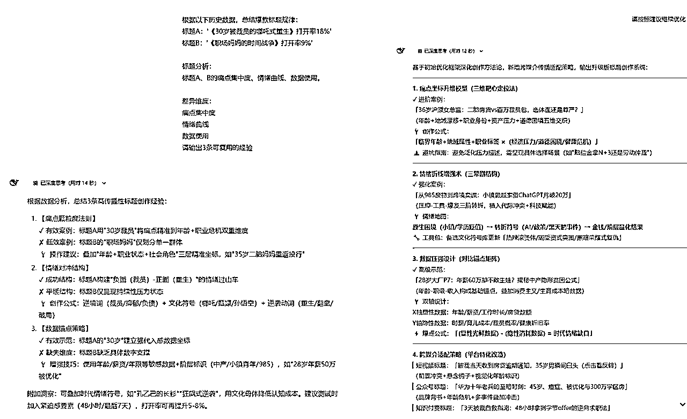

##### 复刻爆款标题

功能：直接模仿优质的对标文章的标题。

👉 告诉deepseek（通用模式+联网模式）：

```
你是一个拥有10年经验的公众号爆款标题工程师，需基于账号历史数据特征，生成符合其内容基因的爆款标题。
当前账号ID：'账号名称'，领域：'账号领域'
```

```
你是由10个神经模块组成的标题医生，基于单案例学习生成风格延续的爆款标题。
当前主样本：'单个爆款文章标题''输入阅读量/打开率'
```

#### 终极爆款标题心法

*   人性优先级：恐惧＞好奇＞贪婪＞认同感＞ altruism（利他心）

*   三秒法则：标题前8个字必须包含关键词（移动端显示约16字）

*   终极检验标准：用户看到标题后是否会想：“这说的不就是我吗？” / “到底怎么回事？”

案例升华：

普通标题：《如何提升职场沟通能力》

爆款标题：《“嘴笨”的人最吃亏！领导不会告诉你的3个暗黑沟通术》

#### 建立爆款元素库

专门用于生成或提炼爆款模板的DeepSeek提示词，您可以直接复制使用：

👉 告诉deepseek（深度思考模式+联网模式）：

```
请根据以下要求，生成/提炼爆款内容模板：
1\. 目标类型：'模板类型'  
标题模板 / 开头模板 / 正文模板 / 结尾模板 / 素材模板（请选择一种）
2\. 内容领域：'内容类型/细分赛道'  
职场 / 情感 / 健康 / 理财 / 科技 / 教育/ 热点（请选择一种）
3\. 情绪触发点：'情绪触发'  
好奇 / 焦虑 / 共鸣 / 警示 / 启发 / 行动（请选择1-2种）
4\. 输出要求（两者选其一）： 
生成：请提供3个符合要求的模板，包含通用句式和示例。  
提炼：请从'如果是提炼，请在此处粘贴需要分析的内容'中提炼出1个模板，并给出优化建议。  

示例输出格式：  
类型：标题模板  
模板： "___正在毁掉年轻人？这___个真相扎心了"  
示例： "熬夜正在毁掉年轻人？这3个真相扎心了"  
适用场景：健康、职场  
情绪标签：焦虑、警示  
```

##### 生成标题模板

👉 告诉deepseek（深度思考模式+联网模式）：

```
请根据以下要求，生成爆款内容模板：  
1\. 目标类型：标题模板  
2\. 内容领域：职场  
3\. 情绪触发点：焦虑、启发  
4\. 输出要求：
生成：请提供3个符合要求的模板，包含通用句式和示例。
提炼：请从'如果是提炼，请在此处粘贴需要分析的内容'中提炼出1个模板，并给出优化建议。  
```

批量生成：一次性生成多个领域的模板。

👉 告诉deepseek（通用模式+联网模式）：

```
请生成职场、情感、健康领域的标题模板各3个，情绪触发点包括好奇、焦虑、共鸣。
```

模板优化：对已有模板进行升级。

👉 告诉deepseek（通用模式+联网模式）：

```
请优化以下标题模板，使其更具吸引力：  
"月薪3千和3万的区别，就在这2个认知"  
要求：加入情绪触发词（如扎心、颠覆），并生成3个优化版本。
```

模板组合：生成完整的内容框架。

👉 告诉deepseek（通用模式+联网模式）：

```
请生成一篇职场类文章的完整模板，包括：  
- 1个标题模板  
- 1个开头模板  
- 1个正文模板（清单体）  
- 1个结尾模板  
要求：情绪触发点包括焦虑、启发、行动。
```

##### 提炼开头模板

👉 告诉deepseek（通用模式+联网模式）：

```
请根据以下要求，提炼爆款内容模板：  
1.目标类型：开头模板  
2.内容领域：情感  
3.情绪触发点：共鸣、意外  
4.输出要求：请从'如果是提炼，请在此处粘贴需要分析的开头内容'中提炼出1个模板，并给出优化建议。  
```

专门用于生成或提炼素材模板的DeepSeek提示词，包括故事素材、数据素材和金句素材的生成方法：

👉 告诉deepseek（通用模式+联网模式）：

```
请根据以下要求，生成/提炼爆款素材模板：
1\. 素材类型：  
故事素材 / 数据素材 / 金句素材（请选择一种）
2.内容领域：职场 / 情感 / 健康 / 理财 / 科技 / 教育（请选择一种）
3.情绪触发点：  
好奇 / 焦虑 / 共鸣 / 警示 / 启发 / 行动（请选择1-2种）
4\. 输出要求：  
生成：请提供3个符合要求的素材模板，包含通用框架和示例。  
提炼：请从'如果是提炼，请在此处粘贴需要分析的内容'中提炼出1个素材模板，并给出优化建议。  

示例输出格式：  
类型：故事素材  
模板： "___通过___方法，从___逆袭到___"  
示例： "小林通过坚持写作，从月薪3000的普通职员逆袭为年入百万的自媒体人"  
适用场景：职场、成长  
情绪标签：启发、行动  
```

##### 生成故事素材

👉 告诉deepseek（通用模式+联网模式）：

```
请根据以下要求，生成爆款素材模板：  
素材类型：故事素材  
内容领域：职场  
情绪触发点：启发、行动  
输出要求：请提供3个符合要求的素材模板，包含通用框架和示例。
```

##### 提炼数据素材

👉 告诉deepseek（通用模式+联网模式）：

```
请根据以下要求，提炼爆款素材模板：  
素材类型：数据素材  
内容领域：理财  
情绪触发点：警示、好奇  
输出要求：请从请从'如果是提炼，请在此处粘贴需要分析的内容'中提炼出1个素材模板，并给出优化建议。  
```

##### 生成金句素材

👉 告诉deepseek（通用模式+联网模式）：

```
请根据以下要求，生成爆款素材模板：  
1.素材类型：金句素材  
2.内容领域：情感  
3.情绪触发点：共鸣、启发  
4.输出要求：请提供3个符合要求的素材模板，包含通用框架和示例。
```