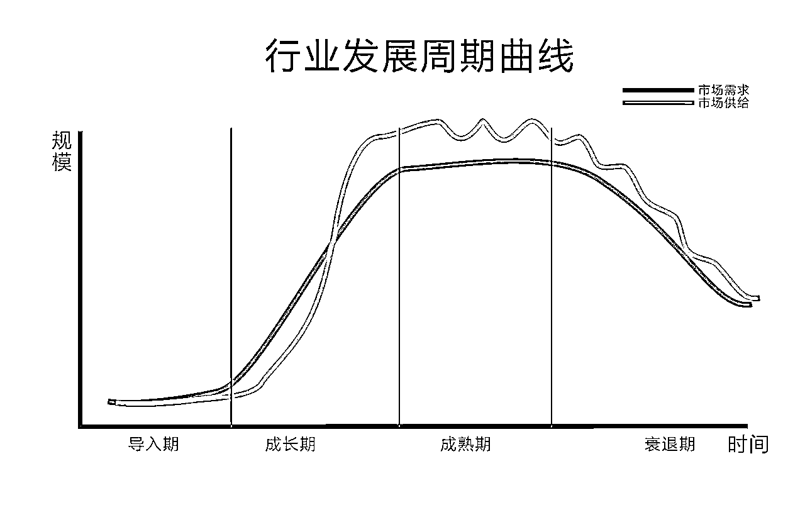

# 一人公司如何判断一个行业是否合适进入

> 来源：[https://d1wt7yv10ce.feishu.cn/docx/SrWVdMWC7oBMJ5x5LKMcsMvdnhn](https://d1wt7yv10ce.feishu.cn/docx/SrWVdMWC7oBMJ5x5LKMcsMvdnhn)

你是否也经常听到别人说，选择大于努力！那么为什么选择会比努力更重要呢？

如果你真的努力过，才知道什么叫绝望！我也做过一些项目，有的项目不费吹灰之力就起飞，有的项目累死累活最后微亏。这到底是因为什么？关于赚钱这件事，哪些因素更重要？

从我现在的理解来说，行业选择占60%，努力程度30%，黑天鹅事件10%。

# 一、为什么要讲行业分析

很多伙伴喜欢看项目相关的分析，行业内容比较大，比较泛，不能够具体的指导工作，也不能显而易见的看到钱。所以，很多人可能忽略了这些点。

其实，关于赚钱这件事，行业的选择影响非常大，并且很深远。

首先，一个人一生中很难频繁跳转行业，大多数人一生也就是干 3-5 个行业，不同的行业选择决定最终的结果。我们不可能频繁跳转行业，只能通过分析选择。

其次，不同的行业其内在结构不同，而产生的平均盈利水平不同。如果选择一个行业本身不能够盈利，无论怎么努力，收益都很少。

最后，我们每个人都有不同的资源禀赋，资源禀赋和行业完美匹配才能产生优势。我们需要了解不同的行业，用一套好用的方法，判断这些行业所需的资源禀赋，找到和自身匹配的点。匹配不对可不可能赚到钱。

# 二、行业分析有什么用

## 1、行业分析的对，就少走弯路。

少走弯路其实就是节省自身的资源，时间。减少损失也是一种收益。在现在大环境不好的今天，不损失就已经超过了 60%以上的人；

## 2、行业分析能够让我们坚定行动，不内耗！

很多人一山望着那山高，总觉得别的行业好，别的项目好。单 2024 年就有几十个人过来找我咨询换行业的事情。其实都是不会分析，判断，只是从公开渠道看到一些案例数据就动心。如果会分析，就会准确判断，面对不好的行业就不进去，面对好的行业就专注坚持。

## 3、行业分析能够让你有更大的机会。

从赚钱角度来说，小钱靠努力，大钱靠选择。选择的第一步就是看行业。行业选错，努力也只能温饱，行业选对，一两年可能就翻倍再翻倍了。所以，想赚大钱，更需要关注行业选择。

# 三、如何进行行业分析

这里就把过去 20 多篇商业认知类内容的精华重新整理出来，便于大家快速判断一个行业的情况，遇到具体模块的分析不明白的请直接留言~

## 1、行业生命周期分析

我研究一个新行业，首先看行业的发展周期，导入期、成长期、成熟期、衰退期四个。

很容易判断，看行业增长率是否高，是否达到阈值。每个行业多看几篇最新的调研数据就知道了。

（1）导入期行业一般没有很大的机会，主要是观望。

（2）成长期行业一定要重点研究，一定有机会。

比如 2025 年 AI 行业一定会起来。成长期不仅机会多，增长快，而且竞争小，大家都是小规模，刚开始进入可以小投入，随着增长也可以不断变强变大。行业红利都在这个时期。

（3）成熟期行业要谨慎进入。

这时候要看是否有细分机会出现。包括人群变化、新产品、新渠道、新技术等出现，让市场发生了变化。

比如饮料是个成熟市场，但是元气森林做气泡水，就是新产品；

比如零食是个成熟市场，抖音、视频号等新渠道出现，产生了流量红利；

比如 AI 技术的出现，让设计、文案、办公、软件开发等行业都有了变化，降低了门槛，产生了新的机会。

（4）衰退期行业不要进入。

行业进入衰退期，不是需求降低，就是需求被替代。

如果是需求降低，不要考虑进入。比如出生人口降低，导致早教、幼儿园行业需求减少，这是没办法的。

如果是需求被替代，要重点研究替代行业的情况，如果有机会可以进入。衰退期行业基本没机会。

比如，传统燃油车市场被新能源汽车取代，那就重点研究新能源汽车行业。

## 2、政策因素

该行业是否有政策因素。

（1）有政策扶持，更建议进入，并且考虑是否可以拿到扶持；

（2）无政策扶持，就是正常的充分竞争市场；

（3）有政策限制，按照政策是有能够拿到资质，或者就是不能准入。比如 K12 市场直接叫停。比如，行业涉及特种经营资质，优先考虑是否能够拿到；拿不到的话就不要考虑进入。比如有人做互联网医药，挂靠资质，等到平台核查，批量关店风险也较大。

## 3、竞争因素

使用波特五力模型判断该行业的情况，包括进入威胁、买家议价能力、卖家议价能力、行业内竞争情况，替代行业情况五个模块

（1）进入威胁：一人公司进入的行业一般都是门槛较低的，对一人公司来说资源，资金等有限，很难直接进入一个高门槛行业。

但是，低门槛行业也有门槛。比如设计师、编程人员、注册营养师、中医、律师、主持人等就有技能、资质上的门槛，甚至你是一个二胎宝妈、50 岁的养生爱好者等，你的生活经验、阅历都是门槛。别小看这个门槛，他能够挡住很多人了。虽然现在有了 AI，但是这些技能、经验也需要时间学习。

（2）买家议价能力：也就是消费者的议价能力。现在竞争激烈，大部分行业内卷，消费议价能力较强。

但是，也有一些行业消费者议价能力较弱，比如非标品，功效非即时滋补品、服务类产品，教育类产品等，消费者很难准确判断质量和价格的行业，相对来讲买家议价能力较弱。这也是推荐大家做的行业。

（3）卖家议价能力：也就是供应商的议价能力。

如果是实物产品，我一般先看该商品是否有多家供应商，把这些产品样品都买回来看质量水平，都差不多的话，证明我的可选择空间较大，卖家议价能力较差。

如果该实物商品只有很少的生产企业，或者该商品有专利、产权、品牌等，那就得看我是否能够拿到独家授权，或者营销扶持；如果都没有，就看产品是否好卖，流量成本多少，计算综合利润，如果挣钱还可以，那就忍着做；如果被供应商压榨厉害，就不做了。反正一人公司灵活，就跟我之前卖旗帜奶粉一样。

如果是服务类商品，如果市面上能做同类服务的人多，就按照合作形式多谈几个；如果很少，就强绑定成合伙人一起做；绑定不了就不做了

如果是服务类商品，且自身有能力做，那就直接前后端一体化。服务类产品后端主要是人，不涉及到实物商品的生产，物流，仓储等环节，所以对后端的判断更简单。

（4）替代品威胁：也就是别的行业产品替代掉现有产品，抢走用户

对于我来说，我在做行业分析的时候，会看消费者面对同一个需求的不同选择，然后从中挑选一个比较好的行业，其他行业就不考虑了。替代品威胁，我觉得对于自身的影响得随着时间慢慢看，短期无法判断。

（5）行业内竞争对手：就是现存的行业里面的竞争对手情况，包括数量和强弱。

我在分析竞争对手的时候，会把一个渠道里面的对手数据全部抓取出来，然后做分析，从而判断该行业竞争是否激烈。

大家基本都是做线上平台渠道。可以给大家一个案例参考：

在抖音平台，美妆赛道是最卷的一个。2024 年美妆赛道新起号的模式是：自营品牌 + 代工 + 老板娘 IP + 纯付费投放 + 私域导流复购。一个行业需要把 5 个环节都做了，才有可能站到赛场上 PK，挣不挣钱还不知道。

你在分析竞争对手的时候，看是否是自营品牌、是否必须是 IP、大部分是否是付费投放，对手大多是否做了私域，从而判断竞争激烈程度。

最好的情况是自然流获客 + 私域，或者自然流短视频/直播 + 公域成交，

其次是微付费 + 私域，或者微付费 + 公域短视频/直播成交。

总之就是一句话，以强胜弱是真相！打比自己弱的对手更容易成功。

## 4、行业集中度高低

选择行业的时候还要看一下行业集中度，尤其是成熟行业。

如果市场行业成熟度高，集中度高。我就要重点考虑自身优势。体现在卖家都在产业带，很多卖家都是工厂一体化的，甚至这个行业品牌占据较高市场份额。

比如，纯牛奶行业，基本就是蒙牛、伊利、认养一头牛等品牌占据市场，一人公司没法做，跑分销佣金都不高。

比如，汽车用品行业，不知道大家有没有看到最近比较火的那个做车载冰箱杯架 8000 赚到 100 多万的哥们，他进入的这个行业是成熟度很高的，刚开始可以通过信息差，产品设计赚一波钱，后期一定会被同行抄袭，同行的成本优势明显，这个市场没法长期做，对于一人公司来说，适合打一枪就跑。

如果市场集中度低，就要重点考虑这个市场为什么没有出现规模化，其中有哪些规模不经济的情况。这种集中度低的市场好处就是市场的玩家整体能力都不大，其次是这个市场有细分空间可以挖掘。

比如，寒暑假一对一补课市场、小班桌市场、咨询市场、职业培训市场、定制化服务、摄影等市场。受到服务者时间、精力、技能水平、以及地理位置等因素的影响，无法达到规模经济，这更适合一人公司来做。

## 5、行业进入壁垒、退出壁垒高低

（1）行业进入壁垒高，但是退出壁垒低的行业，整体盈利水平更高。

首先想进入的人被门槛挡住一部分，其次，在行业里面干不下去的人可以随时退出。

比如个人 IP 行业，一个 IP 的打造首先要求 IP 本身有专业能力，其次要求要坚持做，短期效果不明显；最后 IP 做不起来，他的放弃成本比较低；包括软件产品开发行业、专业咨询服务行业、金融理财等行业。

（2）行业进入壁垒低，但是退出壁垒高的行业，整体盈利水平较低。

首先想进入的人比较容易进去；其次，在行业里面干不下去的人，很难随时变卖资产退出。导致行业内众多企业混战，压低盈利水平。而且退出壁垒高的行业，资产投资较大，亏损风险更大。

比如线下囤货超市、批发商、季节品囤货模式等都属于这一类。

（3）行业进入壁垒低，但是退出壁垒也低的行业，整体盈利阶段性波动。

首先想进入的人容易进入，想退出的人随时退出，会导致这个行业阶段性波动，人少好干几年，人多难干几年，不断的受到新进入者冲击。

比如典型的养猪市场，种植市场，小型美甲店等都属于这一类。

（4）行业进入壁垒高，退出壁垒也高的行业，不适合一人公司进入。

比如建筑业、进出口贸易商、船运业等。

## 6、用户是否有层次

具体来讲就是，用户需求是否多样，产品是否非标，用户购买力可否分层。

需求多样、产品非标、用户购买力能够分层的行业更适合一人公司。

比如高端服装定制行业，针对不同的人群可以多样化设计，面料颜色需要定制，并且客户购买力不同，你可以服务高端用户媲美奢侈品，也可以服务中端客户，报价亲民，会让公司之间收益分层，从而减少竞争，获得更大利润。另外还有定制游、医疗美容、婚庆服务、搬家服务等。

相反如果是卫生纸、湿巾、纸巾、纸箱等行业，用户层次很少，大家围在一起拼。

## 7、行业是否有流量红利

流量红利主要包括新渠道的产生，以及互联网平台的变化。

比如抖音、视频号、小红书的崛起就有流量红利，比如最近小红书涌入大量外国人其中就有红利。

这个大家都很容易理解，流量红利就是流量成本低，获客容易。想想 20 年的抖音。

## 8、行业财务分析

以上内容分析行业情况，觉得该行业对自己有一定的吸引力，想考虑进入，这需要对行业进行财务分析。

### （1）行业规模是否适合你

行业规模很多人觉得越大空间越大，对于一人公司来说，如果你想更长久的盈利，那么你所在的就不要引入大竞争对手。所以，行业规模适度，天花板不要太高。

如果你的目标是 100 万，那么你就选择行业天花板是 100-500 万的，不要选择太高的。等你的能力能够挑战 1000 万的时候，在选择更大的。

过去 20 年由于满地都是机会所以可以选择一个行业不断成长然后做成百亿公司。现在做四周对手林立，我们要做的是先选 A 行业整到 50-100 万，再选 B 行业挣到 100-500 万，再选 C 行业挣到 500-1000 万，这样上台阶。

### （2）行业初始投入可接受

该行业想进入的初始投入是多少，是否在你的承受范围，产出是否符合你的预期。

一般我建议，一人公司模式下，单次投入是你能够拿出的整体投入的 5 分之一，因为普通人做项目大概率很难做一个成一个，一般都是试错几次才成功，你的一次投入损失了不至于影响未来的业务投入。如果你五次都不能盈利，肯定是有大问题，别着急开始，先解决问题。

### （3）行业的利润计算

### （4）增长率计算

如果你选择的行业符合双因素增长，那么就极度考虑，看自己是否能干；

如果你选择的行业是单因素增长，那么就重点考虑，行业也很好；

核心考虑，自身如何做才能提高增长率。

## 9、自身竞争优势判断

在这个行业中现有的竞争对手水平能力怎么样，在上面已经做了分析。这里主要做自己的优势分析。

选择这个行业你有哪方面的能力、经验、资源、背书、资质等因素能促使你在这个行业做，建立自身的相对优势，能够维持盈利，或者打败竞争对手，拿到更大的市场和利润；

列举出自身的优势点，然后和竞争对手的优势点对比，从而决定是否进入这个行业。

并且确定选择哪个竞争战略，包括总成本领先战略、差异化战略，以及集中战略。从而决定一人公司的发展方向，最好能够浓缩成一句话表达。

## 10、自己做出判断

根据以上的所有分析，对你想做的行业进行判断，是否要进入该行业，该行业是否适合你，进入该行业你的胜算有多大。需要自身做出判断。

如果自身胜算大，则进入具体项目分析、筹备、执行阶段。

如果自身胜算不大，则继续分析下一个行业。

以上就是关于行业的分析模块总结。通过 10 个小模块的分析，你能够快速了解一个行业，并且从生命周期、竞争、财务等角度综合分析行业特点，从而更加准确的判断该行业是否适合自己，适合一人公司模式。

选择大于努力！选择适合自己的，成功率高的行业进入，风险更小，赚钱的几率更大。

# 个人介绍

你好，我是千易，9年自媒体人，6年电商人，17年创业做今日头条至今。头条、抖音、视频号、小红书都做过，现在主要做抖音、视频号。连续四次用5W本金赚到100W，操盘过多个项目；现在同时运营个人商业社群：“一人公司”俱乐部！欢迎交流~