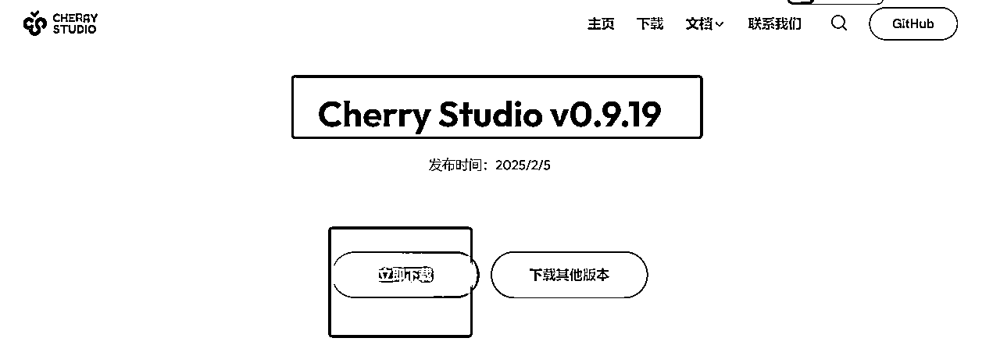
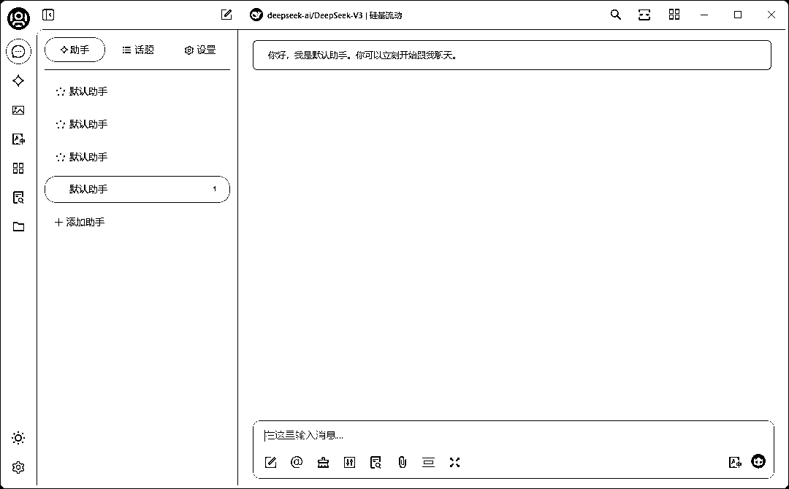
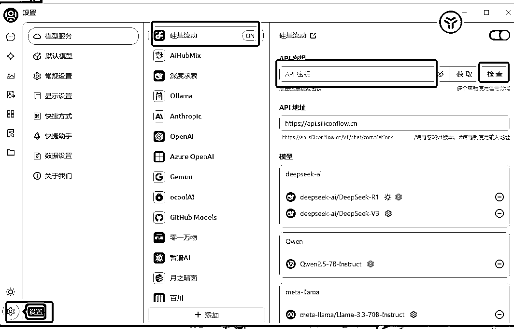
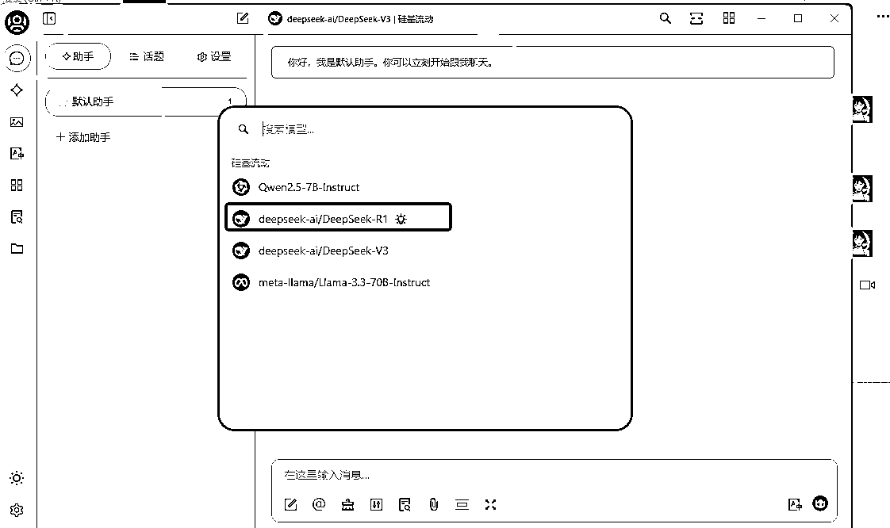
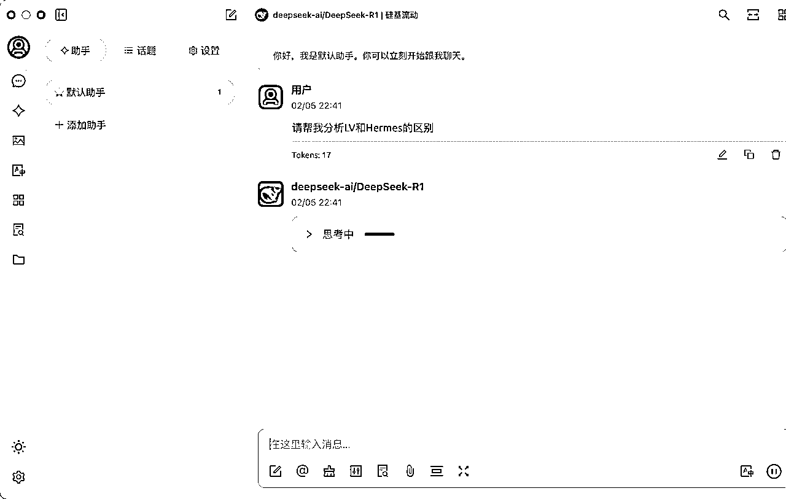
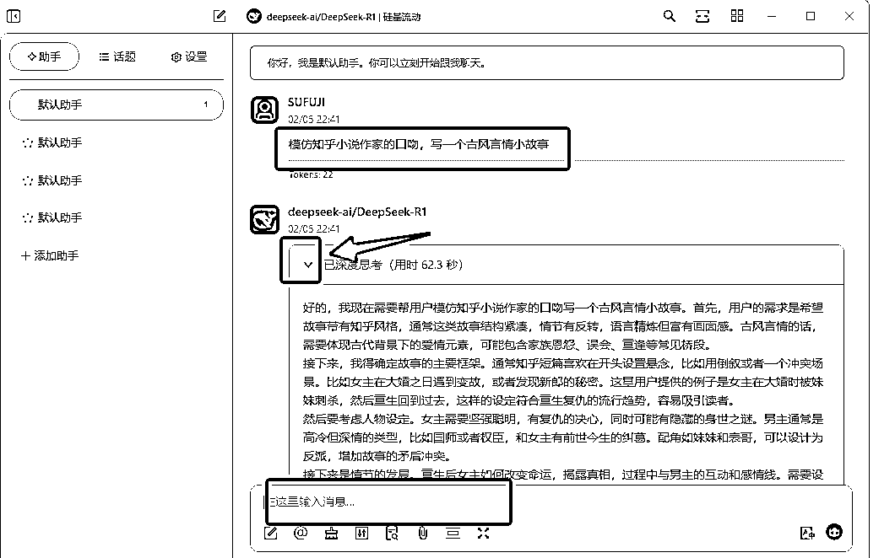

# DeepSeek-小白API使用教程篇，官方api/硅基智能如何配置？

> 来源：[https://tue99hylfd.feishu.cn/docx/TTaQdZxHHo9yybx3UN0chTtxnUe](https://tue99hylfd.feishu.cn/docx/TTaQdZxHHo9yybx3UN0chTtxnUe)

### 一、背景说明

本篇主要是为了解决小白用户使用deepseek网页版卡顿，使用app端又频繁出现服务器繁忙的备用解决方案。

正常对话和日常使用个人助理情况下是建议优先采用官方版本（官方的服务器以及模型版本与底层优化还是最新的），厂商接入的版本虽然是官方放出来的版本，但可能在时效性和优化上会有一些差异。

### 二、基础知识扫盲

本部分主要针对小白，看实操请直接下滑到第三部分

#### 1.api是什么？为什么需要使用api？

简单理解，api的呈现样子是类似这样的一串代码，比如长这样【sk-f7e9aaaaaaa174c78a9b206858ac341ee】

它是钥匙，拿着一串钥匙是无法使用各种AI工具的，毕竟你无法直接跟一串文本产生任何的交互。

使用api，就是使用这个钥匙去开门。

所以我们需要一个工具载体（比如电脑端的软件，比如app）。

在可以接入api的软件上，当你把这串文本填写进去之后，相当于在操作的软件和AI模型的服务器上搭建了桥梁，钥匙能够定位是哪个AI哪台服务器。

所以，前置准备工作，我们需要一个能使用对话模式的空壳软件（里面有api接口，但不内置AI），以及一串api钥匙来确定使用的是哪个AI工具。

#### 2.和官方版本对比哪个更好？

正常来说官方app和网页，以及原生API是最稳定的。

其次才是各种厂商提供的api接口，厂商使用的服务器/算力基础/与模型版本可能会存在差异。

开源的deepseek大模型好比是公开的菜谱，大家都可以使用。

作为用户目的是吃到好菜，官方可能用自己的厨房按照这个菜谱来给你做菜，但这个厨房人太多，比较拥挤，你如果要吃到好菜要排队等待（更何况用户里面还混了一些想要炸厨房的）

这个时候其他饭馆也拿到了开源的菜谱，同时店里有位置可以不用等，但是可能使用厨具/厨师有差异，会导致你吃到的菜有轻微的口感差异（比如开源的菜谱是历史版本，deepseek官方可能有优化和迭代和加料，但拿到原来开源菜谱的饭馆可能还停留在历史菜谱没有优化）

#### 3.什么是token？为什么使用api需要消耗token？

token意味着算力，可以类比为当你通过api连上了AI的本体服务器时，服务器要为你工作，需要耗费能量，这个能量就是算力，也就是token。

一般而言，token和石油一样，车要开，总得加油，所以当你使用api时一般是需要同步买算力的，买车不买油，车也开不动。

不同的厂商都能提供api接口，目前无论是deepseek官方，还是硅基智能，都可以实现注册就送算力（相当于买车送满油让你先开一下体验，当送的算力用完了，再用就要充值了）

### 三、实操教程篇

#### 指路工具包：

实现对话的软件：

*   cherrystudio地址：https://cherry-ai.com/download

注册生成api的地方：

*   deepseek官方：https://platform.deepseek.com/usage（目前仅老用户恢复访问，新用户无法注册）

*   硅基流动地址：https://cloud.siliconflow.cn/i/5sgdzBUa（推荐备用api平台）

*   其他备胎：阿里的百炼，百度千帆modelbuilder，腾讯云ti平台，华为云和潞晨科技联合的平台，字节的火山方舟，这些我一个都没用过，但确实各家通稿都出了，大家可以搜索自选，有关于这些平台的使用测评。

#### 第一步：搞到api-这里使用硅基流动

*   1.去网址https://cloud.siliconflow.cn/i/5sgdzBUa，用手机号注册，注册后会送14元对应的token算力。

*   2.侧边栏找到【API密钥】进入，点击右上角【新建api密钥】，密钥描述是什么都没有关系，可以任意描述。我的使用习惯是：为多个途径的工具建立不同的api，这样子看账单能够知道到底是哪个工具花的token量级比较多，是否需要切你模型降成本。

*   3.配置完成后，会得到一串代码，鼠标悬浮在上面就能直接复制了，可以本地保存，但不要发在公共平台上（因为别人也可以用你的api来连AI模型，消耗的是你这个账号的算力，大模型世界，算力等价于现金）

#### 第二步：下载和安装cherrystudio

安装完成后打开会得到这个界面

点击左下角的设置按钮，找到第一个硅基流动，打开，然后填入第一步的api密钥，注意点击检查可以先用qwen大模型检查而不是deepseekr1，因为ds可能因为拥堵导致连接失败，这不是硅基流动的平台问题，而是模型出问题，我们这一步要确保，连上了硅基流动这个平台（平台有很多大模型，不止ds）。

连接好后，点击左边第一个对话按钮，选择默认助手，点击上方的模型名字，切换成R1（默认是V3）,R1是带思考的，V3是不带思考的（但便宜，可以用它来做不要思考的活比如起标题和翻译之类）

配置完成就可以开始对话测试了，注意深度思考的过程，思考中旁边的按钮是可以点开看详情的

到这一步，你就已经基本完成了api配置和大模型使用了，关于cherrystudio其实能做的事情有很多，本身也内置了很多提示词模版，大家可以尽情探索下。

上述还提供了很多api的备选项，原理都是一样的，在不同的平台获取api，然后在cherrystudio上直接使用，不同平台的送赠算力不一定相同，在官方不太够用的时候，可以尝试在其他平台搭建自己的api来实现。