# 航海好事｜目标清晰+借助航海提升执行力：21天收获变现四位数，个人排行榜第二名

> 来源：[https://ewtk6agpo4c.feishu.cn/docx/Q2mid908HoP2z9xVWWbc7rZUnTd](https://ewtk6agpo4c.feishu.cn/docx/Q2mid908HoP2z9xVWWbc7rZUnTd)

大家好，我是林悦己Cheer，12月的航海复盘拖到2月才来发确实有些过分了，好在虽迟但到。

23年年末在b站自学的python，在GPT的加持下完成了一些办公室常见的小程序；

24年6月报名了ai编程航海，完全打开了我的变成世界；

24年9月 写了cursor贴以后，我发誓要学习；

24年12月，上了cursor的船，21天满卡下船，拿到个人排行榜top2，收入1000+。

21天的航海，前3天真的天天骂：

“还不如我用GPT”

“这什么界面啊！真不人性”

“怎么我之前写好的东西不见了"......

从第四天就开始出现“真香现象”！

航海的21天，做了2个可视化图表的网站，1个Google插件（下载小红书笔记图片无水印），结合本身副业变现1000+。


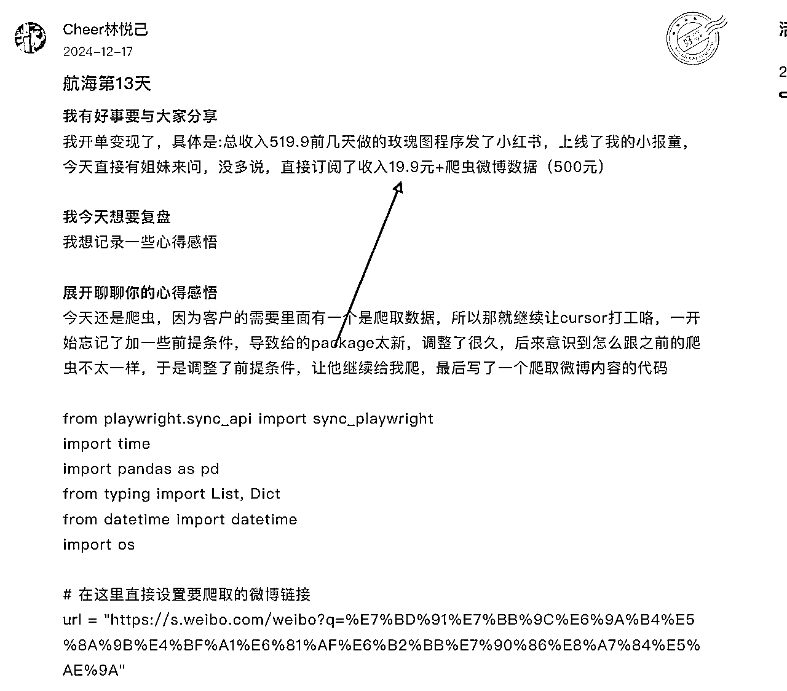


航海结束以后，彻底改变了我的编程习惯，任何我要使用代码的地方，我首先就打开了cursor。

恰逢年底亦仁发出了龙珠悬赏，在外力和兴趣的驱动下，按照亦仁的方向，找对标，拆解别人的项目，最后我用cursor写出了自己的项目，还拿了第二篇精华贴——AI编程变现：“情侣聊天可视化报告” ，也因为这个项目，应邀加入生财联合创业。生财联合办公空间招募进展同步 。


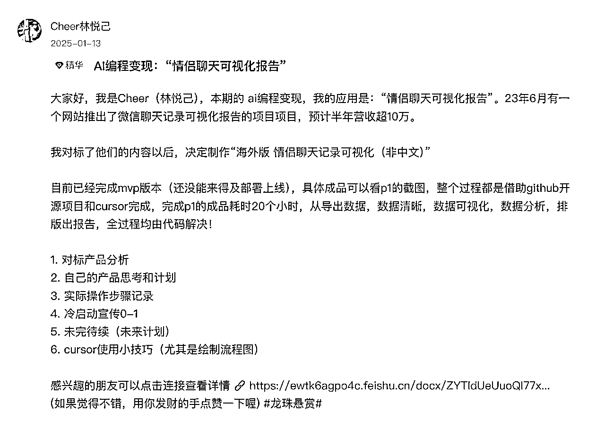


无论是航海过程中的变现，还是航海结束以后的新习惯建立、有勇气和能力去做以前不敢想的事儿，这一切都像是多米诺骨牌，6月航海搭起了骨牌，而12月航海的我推下去第一块骨牌！

本次复盘会从4个方面分享

1.  背景：从用ai学习编程，到ai直接编程

1.  不破不立：如何利用航海提升执行力，完成目标

1.  输出倒逼输入+定制属于自己的航海

1.  感悟碎碎念

# 一、背景：用ai学习编程--->ai直接编程

林悦己高中是理科生，大学念的经管类，甚至到现在计算机二级也没拿证。

22年发现自己对数据分析感兴趣，开始学习高级excel，接着又对可视化很好奇，学各种可视化图表，把自己学习的内容分享到b站，误打误撞成为b站知识博主。


23年开始学习 R Studio 画图（为什么是R不是python，因为python 我卡在了安装第一步，干脆放弃）

R画图确实好看， GPT出现以后，我就让GPT作为我的教练，带着我学习R 代码，给我解释各种代码的意思，有适合也会让他给我写代码，就是写的很不顺畅。年底发现，R画图可以，但是编程还是得学一个语言啊！在23年年底开始b站学习python的基础知识。

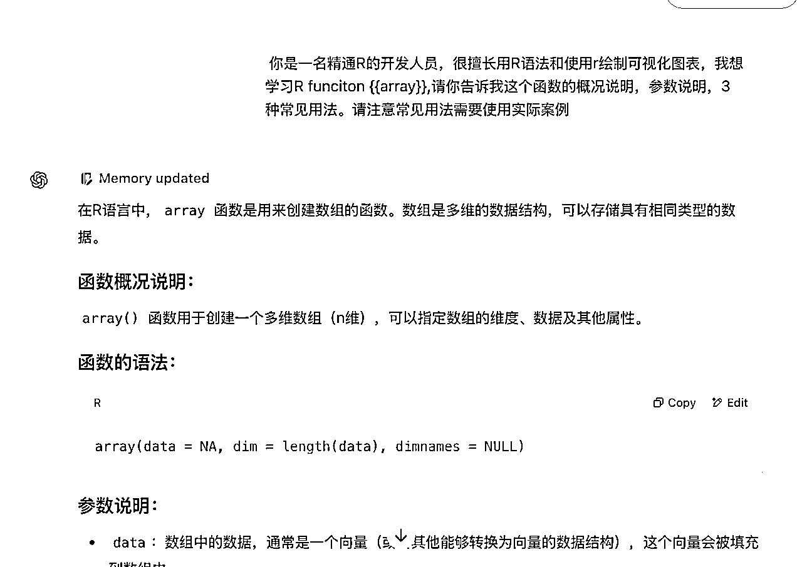

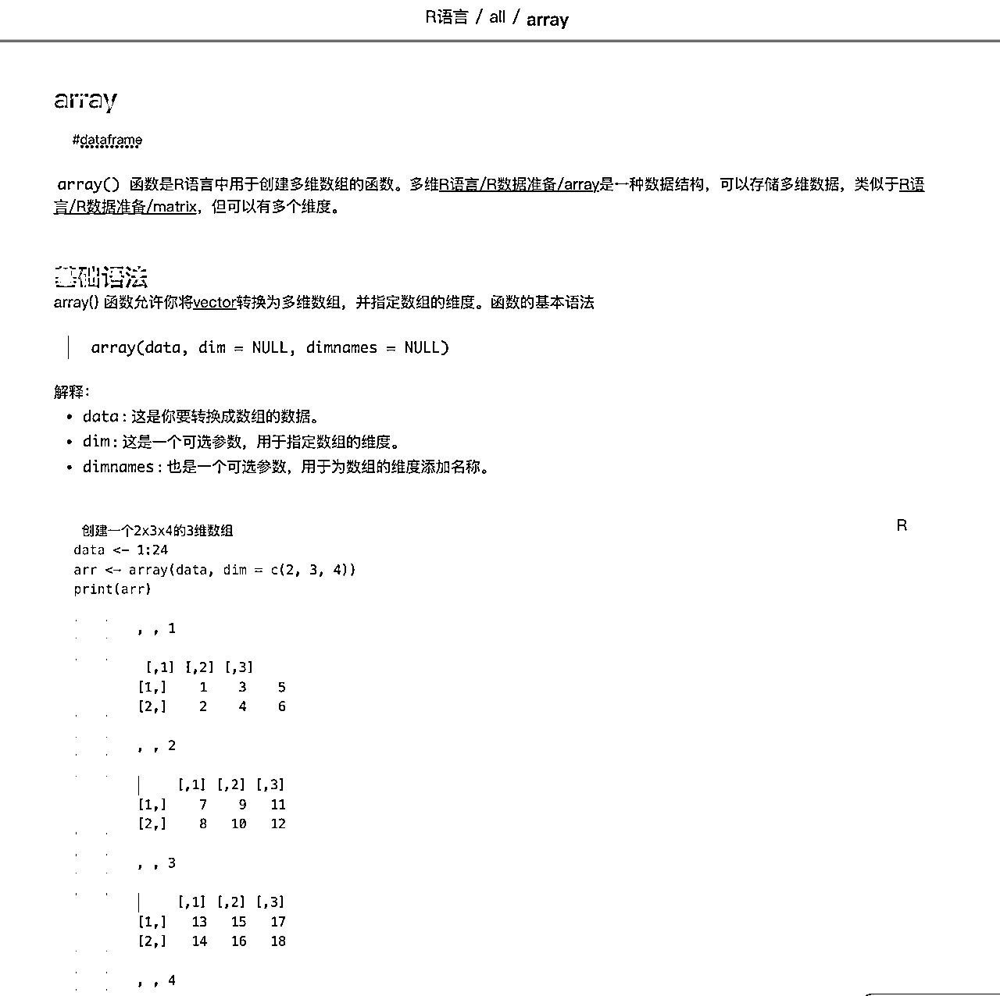

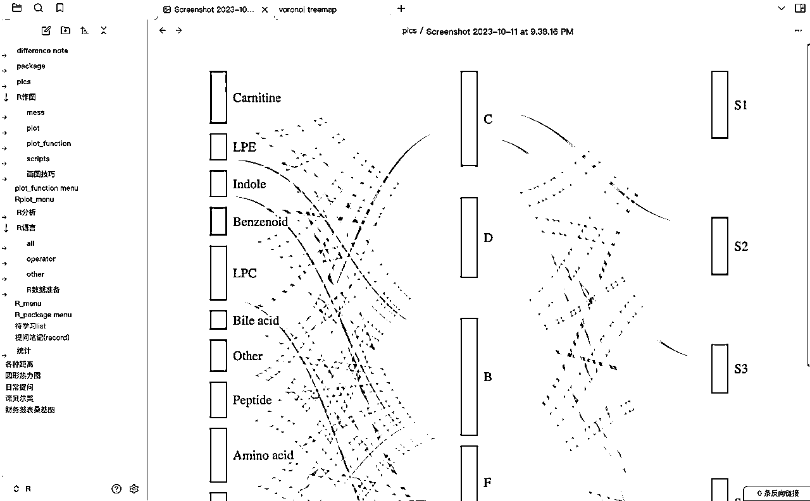

```
 你是一名精通R的开发人员，很擅长用R语法和使用r绘制可视化图表，我想学习R funciton {{array}},请你告诉我这个函数的概况说明，参数说明，3种常见用法。请注意常见用法需要使用实际案例
```

24年上半年，有了python基础，开始让GPT给我写python代码，我去pycharm里面运行，出了问题就复制给他，让他给我改，改完再去py charm。（到现在我都不太会终端运行代码）；也尝试过让GPT写爬虫，一开始就失败，对爬虫就很畏惧！

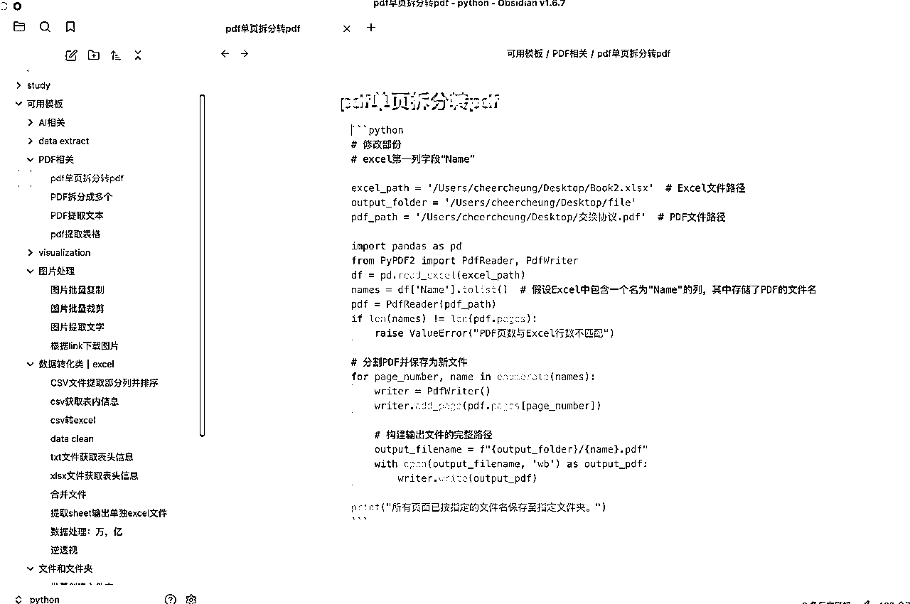

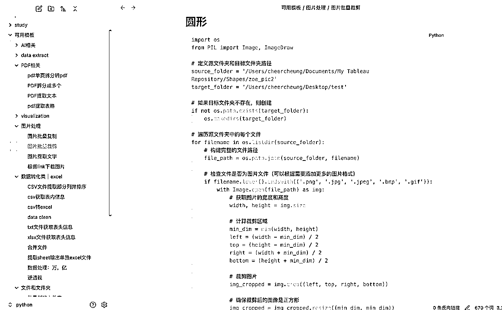

（因为日常使用，用GPT写了一些日常用的python代码积累在obsidian里面）

24年6月的ai编程上线，打破了我对爬虫的畏惧，用航海教练的prompt，跟着大家的步骤，成功了！自从打破了心里障碍，让开始让GPT给我写各种爬虫。

现在都还记得，有一个客户我需要给他找100个名人的头像，需要：搜索人名、下载图片、裁切成圆形透明底。

这个sop 我让GPT给我写出来了！感受过这种批量的快感以后，就真的回不去了！凡是重复3次以上的，我都想让GPT给我写代码处理！也写了很多办公室用的。

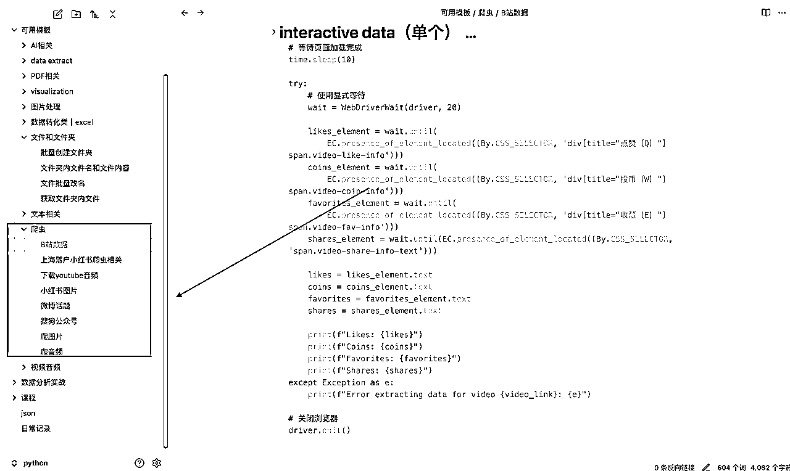


2024年9月 time写了cursor的精华贴，从此cursor在圈内和圈外都火的一塌糊涂。ai编程的工具，我知道自己一定得学，必须得学，但就是：一直没学！


# 二、不破不立：利用航海提升任务的紧急性

每天跟time老师聊天，非常清晰地知道Cursor编程的重要性，而且Cursor精华贴不断涌现，ai编程的热度直线上升，但我就是迟迟不行动（其他挣钱的事儿把时间精力给占用了，等轮到cursor的时候，就只想睡觉.....）


我问自己为什么一直没学，原因都剖析得很清楚：知道很重要，但是没有那么不可替代+优先级不高！

1.  目前需求都能满足

1.  需要花时间和精力

time老师说：“还有一个原因是那时候悦己有🤏懒惰”

优先级不高，也没那么紧急，一拖再拖再拖！

在航海之前：学习cursor是，重要但不紧急！

随着生财里面cursor风越来越浓郁，time天天按头安利，11月份终于我下定决心，逼自己一把，报名了cursor航海，“强迫”自己学习。因为每日必须打卡，所以优先级提升了！而参加航海，我就给自己找一个必须“破”的机会。

破：打破GPT写代码--->手动 run 代码--->复制error给GPT改--->手动再run的旧习惯

立：学习cursor，尝试让ai自己编程并且自己运行，实现全自动ai化

知道原因，也希望能完成目标，但内驱力就是不够，好在我挖掘了外力——航海。

# 三、目标导向+定制个人航海

## 输出倒逼输入

因为每日要打卡--->每日就要学习新东西

航海手册也好，自己额外学习做东西也好，这些都要求自己必须”输入“。航海前我就想清楚了，航海的目标，也分享给了我的志愿者：


第1个和第2个目标，都是需要持续有“硬核”内容的输出，才有可能实现！

“输出”倒逼“输入”，路径完成！

## 一切事情为我而发生：为自己量身定制航海

悦己以前特别不太喜欢看说明书，所以每次装柜子都会失败！痛骂自己无数次以后，我就改了：我先看说明书，然后再结合自己的想法来。

为什么提说明书，因为航海也有自己使用说明书——航海手册+航海路线图。

*   航海路线路就是地图嘛，整个航海的行进过程，那些milestone啥的。

*   航海手册就是一本巨详细的操作指南，手把手教学。

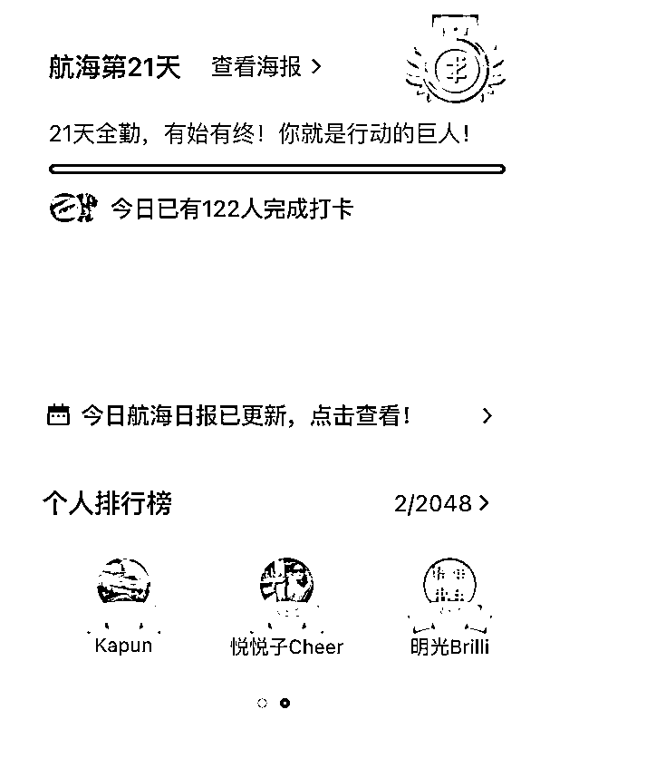

“航海”，我自己的理解是：你可以上别人的船，你也可以自己开船。

24年6月的航海我是前者，而12月航海我是后者。12月我拿着航海路线图，参考路线图，但是我有我自己要去的目的地和方向，我自己开船！

### 航海手册：通读全文，精准出击

一本书，目录是就是大纲，就是思维导图啊！

目录真的是个好东西，快速把握全文核心。通过看目录和拆解目录，能够快速大致了解知识的重心。航海之前完全不了解cursor，于是自己启动“小白模式”。先通读航海手册的全文，不管看不看得懂，是否对哪一个part有兴趣，通读！遇到不懂的地方做一下标记，继续往下读。

2小时内完成航海手册的略读，结合目录，总结出出航海手册的内容框架。心里有了框架以后，发现有些知识点或者小的实践并不适合自己的情况。

比如最开始的正反馈“贪吃蛇”，正反馈很强，适合“玩儿”。因为我是自定义航线，所以我可以决定我的船怎么走，哪个项目我要做，哪个不做。

分析“做贪吃蛇”这个动作的底层逻辑：为什么航海手册这里会让大家做贪吃蛇，编者的目的是什么呢？

快速让cursor做一个产品，拿到正反馈！

明白了底层逻辑，就顺着这个正反馈去思考：既然我一定要花时间做一个小东西，那么我希望我的时间能花的更有性价比，做一个跟我现在业务相关联的产品。

所以我的第一一个产品是 玫瑰图生成器。

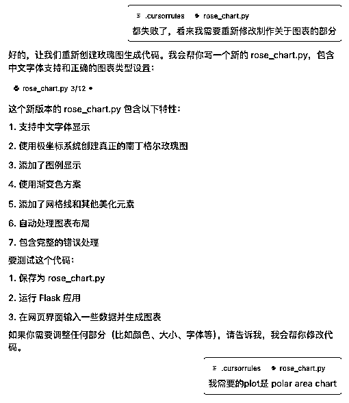

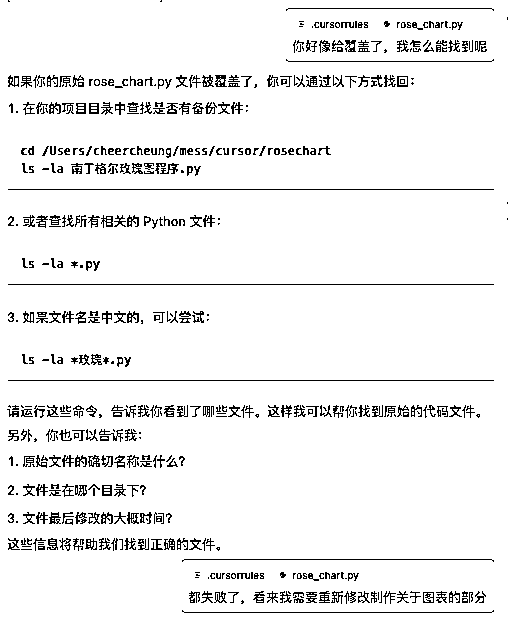


### mvp+迭代：接受不完美+小步快跑

无论是什么跟什么ai打交道，把需求说清楚都非常重要！

做我的玫瑰图生成器，第一步是确定mvp，找到核心功能：有一个页面，输入数据，生成对应的图。

mvp最小可行性产品，大家都知道这个概念，实操过程中，在第一步的时候就很容易忘记“先实现核心功能”这个事儿！

一开始不用管图表丑不丑，颜色如何，字体大小，边框样式这些都不是核心功能！

判断mvp小Tips：

如果自己找不到核心功能，或者不确定自己的核心功能是不是mvp，也可以尝试问cursor或者ai，说出需求，让ai给你找mvp是什么，让ai给你判断你的mvp是否OK！

day4:页面写出来，但是图表不对

day5:完成mvp，开始迭代

day6-day8:迭代了字体，样式，自定义等多种功能

day9:本地端满意，开始部署上线

在航海的第9天我的网站上线了，那时候我的正反馈可以说达到峰值！感觉自己“无所不能”。

感兴趣的朋友可以去试试，玫瑰图直通车

迭代Tips

1.  一次一个功能，不要试图“一步到位” ❌

1.  不要烦躁，不要骂自己！大不了就是重新做一遍，烦躁很的会很影响心情和效率，如果很烦躁，不如冷静一下，然后再继续开始，会比烦躁的进行，要好很多！

1.  如果有一个bug一直解决不了，停一下，再回头看这个bug，也许需要抽离出来，再更高的维度去改变解决问题的方向

### 计划赶不上变化：顺势而为，往前走的每一步都是赚的

第一天做的3周计划，80%没按照时间线进行；day1做day2 plan，被赚钱的事儿给岔过去了.....

本来计划3天上线网站，结果玫瑰图的python代码卡了2天

本来计划做XXXX，结果变现了，用cursor挣钱了

本来计划小红书下载器做成网站，解决不了登陆问题，正好学到google插件了

本来继续小红书下载网站，结果time老师告诉我有人早就做出来了（而后直接放弃）

每天都有非常多的意外，让自己根本没办法按照原计划航行，一开始还会烦恼，也有点内耗，后来“我想开了”！

改变航道不可避免，但每个调整都可能带来新的机遇

回忆一下地图导航app，每次你走错了路线，它会干什么？

它会句立刻会设立新的路线！（已为您找到新的路线....

没必要因为没赶上计划，而难受，焦急，内耗

不用因为同行人有大的成果，就觉得自己菜鸡

第一点稍微比较难实现，因为需要长期的自洽；第二点的实现方式比较简单，就是这3次航海，我从来都是：

*   我用心学习，写日记，评分组给我上好事儿，我拿到积分

*   我有问题，我提出，教练组帮我解答


2次航海，3条船，全部满卡！

我真的不爱看群，回到标题的那句话，一切为我而来！

*   几乎不看群，几乎不看直播，几乎不看别人的日志

*   出现问题群里提问，等待回答，然后调整解决问题

*   自己按照自己的路线去学习

目标明确+路径清晰+尽可能减少其他东西的干扰

这个是我的方式和秘诀，有些极端，但对我来说，效果甚佳！

# 四、碎碎念

我对航海的态度，从6月的“航海是个好东西，但是可能不适合我”到现在的“航海太香了”，到底是什么让我发生了转变，我思考了一下，是我“反客为主”了！

反客为主这个summary竟然也是在我写这篇内容的时候突然冒出来的！

外部激励点燃行动，内在动力决定深度

6月：全程跟着航海走，虽然也没有看直播和加餐，但是路线和任务都是跟着航海走的。志愿者，领队，千人群，答疑，这些很好，但是我没咋用到啊，感觉不是很适配，所以当时得出来的结论是：无论有没有航海，如果我要学，我自己就会去学习！

12月：自定义航海，利用航海提升任务优先级和紧迫性，完成自己的目标！“真香定律”，永远都在打自己脸的路上，挺好！

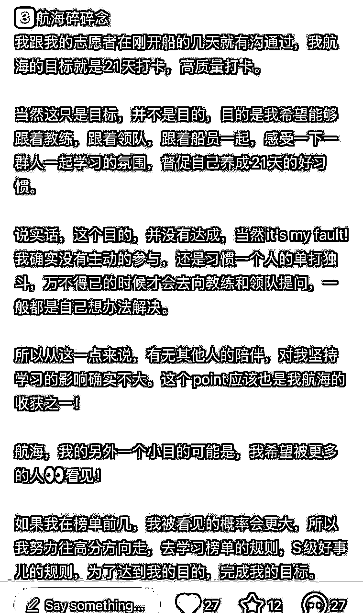

适合我的不一定适合你，适合大家的不一定适合我。毋庸置疑，航海绝对是个好东西，关键在于你准备怎么用它，让它真的成为一艘乘风破浪的船，带自己走的更远！

跟随规则，但要学会定义自己的方向！

分享先到这儿啦！要下场实操，也要去分享！分享的过程是强迫自己再次梳理的过程！有时候，分享不是给别人看，而是给自己一个更清晰的思考。

分享有可能被人看见，不分享是一定不会！（毕竟我冲航海个人排行榜，就是为了让人看见！）

最后借亦仁在传术师见面会上说的一句：

# 越分享，越幸运

如果你觉得这篇文章对你有帮助的话，就用你发财的小手帮我在原文点个赞呗～