# 月入10K+既能玩又能赚钱的奇特赛道分享

> 来源：[https://hez86518tv.feishu.cn/docx/TnWYdJIU9obuiOx1YpbcU0ZWnLe](https://hez86518tv.feishu.cn/docx/TnWYdJIU9obuiOx1YpbcU0ZWnLe)

| 版本 | 更新描述 | 作者 | 更新日期 |
| V1.0 | 新建文档 | 科学羊 | 2024-01-15 |
| V1.1 | 增加云端玩法，家里没有电脑也可以玩 | 科学羊 | 2025-02-14 |
| V1.2 | 增加云端扫码登陆异常的处理方法 | 科学羊 | 2025-02-24 |

大家好，我是科学羊，公众号专栏日更作者，知名报社签约编辑、海外内容创业实践者、游戏视频创作者。

马上就要春节放假了，今天在临放假之前给大家分享一个独一无二，且奇特的赛道和玩法，希望大家在假期有时间可以去研究一波。

首先感谢平台和各位星友的支持，这也是我第一次公开写关于写「赛道赚钱相关」的帖子，关于这个赛道，基本研究了大半年的时间，从产品技术制作再到海外运营最后上线一条龙打通。毫无夸张的说我是国内开放这个赛道并为做出最全教程的第一人了。目前已有十几余跟着我在做，如果大家喜欢，欢迎入局。

注意⚠️本次所分享的赛道可能和各位认知的稍微有点偏差与门槛，主要适合兴趣爱好者与打造原创创作的人群。

也就是说这个赛道有比较高门槛，难度大，几乎不太可能做纯搬运，靠的是实实在在的打磨与发自内心的喜欢。但是一旦真正做了回报也是高收益的。

好，废话不多，我们直接看内容。

* * *

# 一、前言：

赛道面向群体：海外

面向平台：油管 + TikTok

创作内容：游戏视频

游戏名称：BeamNG.driver，国内人称「车祸模拟器」

视频方式：长视频+short 、以及TK 中视频

面向群体：儿童、青少年、爱车的人士

变现方式：广告收益、奖励机制、国内视频制作接单

需要涉及领域：

1、热爱游戏的玩家，有基本的单机游戏操作经验

2、懂游戏模组

3、游戏脚本，懂编程（非不要）

4、3D建模&懂Blender建模，比如人物建模+汽车建模 + 以及动画制作

5、懂得运镜的经验，有导演思维

6、基本的视频剪辑技术

详细描述：这是一个基于原游戏场景与画面自建内容的游戏视频制作赛道。白话讲就是把你所玩的游戏进行录制，然后做成视频，并增加故事而呈现给观众。

以下是关于游戏的详细介绍：

赛道名称：BeamNG.driver 车祸模拟

游戏介绍：

BeamNG.drive 是一款以高度真实物理模拟为特色的车辆驾驶游戏。它以逼真的车辆物理和碰撞效果而闻名，提供了一个开放的沙盒环境，允许玩家自由驾驶、测试车辆以及进行各种实验。

# 二、赛道玩法

下面我给大家列举一下关于这个赛道的流量

## 2.1 中长视频：

### 车祸模拟

### 趣味模拟

这还是2025年刚起号发的

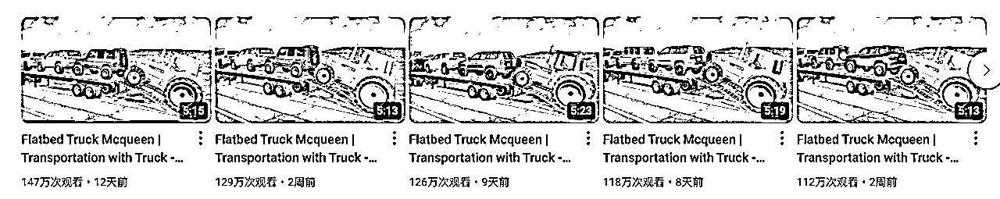

### 游戏电影

简介：以模仿电影场景来在游戏里复现，这种基本都能达到百万级播放，也是这个游戏的至高天花板。

## 2.2 短视频

### 趣味测试

简介：车祸碰撞测试，这类视频在TK流量更高

### 盲盒测试

适合做小朋友赛道的人群。

### 跳跃比拼

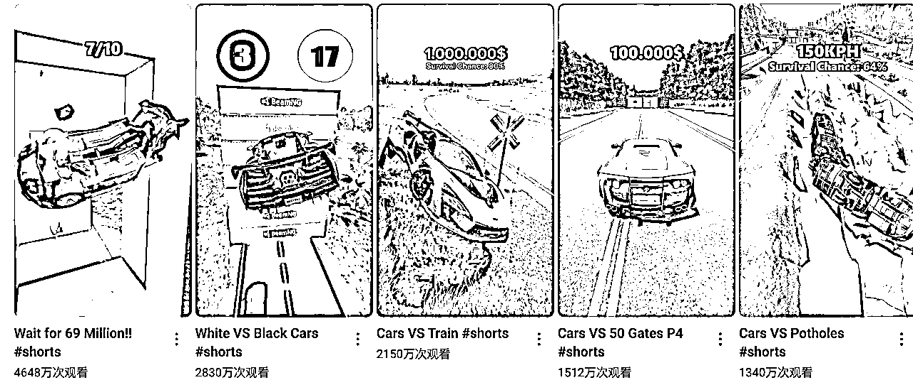

### 道具测试

简介：基本都是亿万级的播放，受众群体广，制作也简单

## 2.3 汽车广告

我之前接过一个汽车导演的单子，就是通过车祸模拟器给他制作一则广告，1min的视频大概500人民币，大家可以自行发挥。

下面这个是一个案例。

## 2.4 赛道收益

这个赛道以我的理解，月入几万都是没什么问题的，可能还不止这个数。大家可以自行去搜索，这里不谈太具体。上几个月我开始带人入局这个赛道一个月就可达高爆收益。视频单价大概平均是1.1以上。

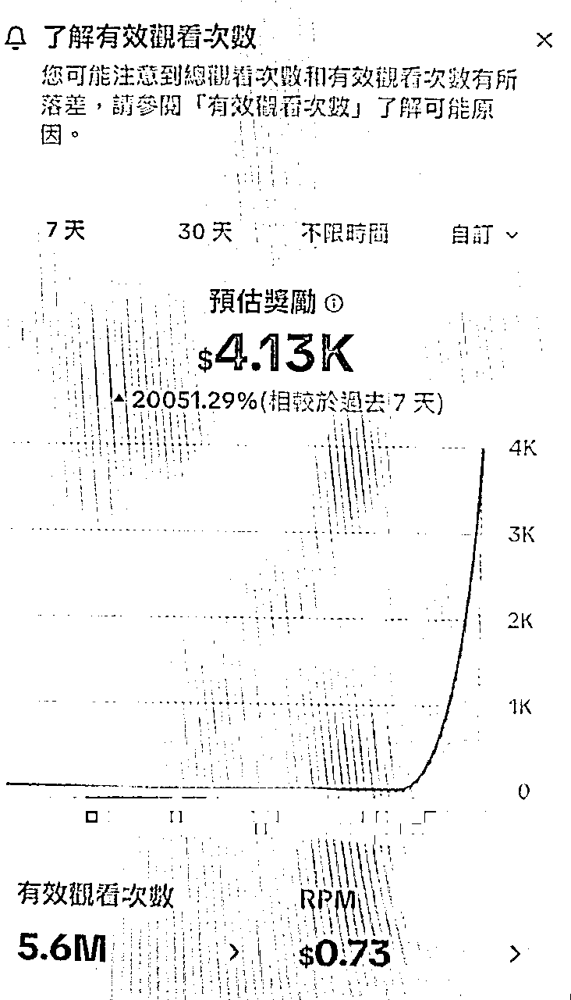

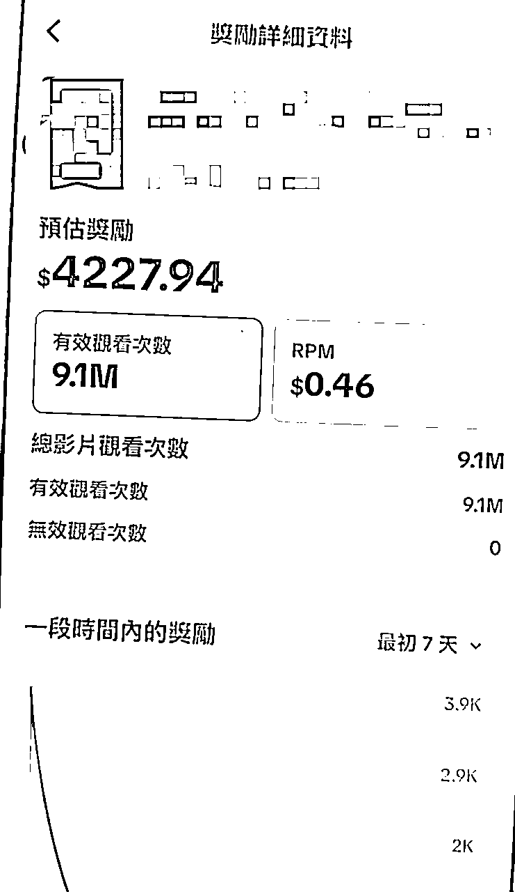

油管收益参考

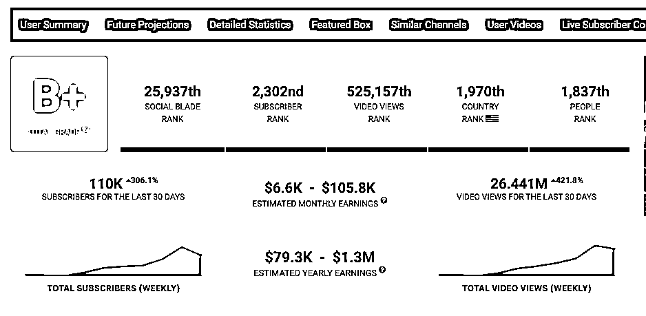

# 三、游戏安装与配置

关于这个游戏详细视频大家可以看B站看我的课程：

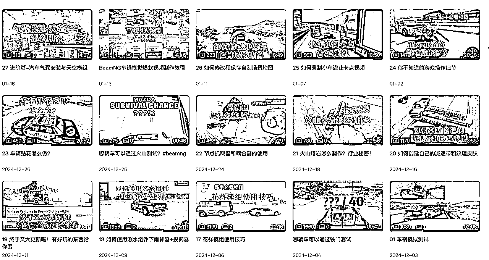

https://space.bilibili.com/301162993?spm_id_from=333.1007.0.0

## 2.1 游戏安装与配置

接下来我给大家放出基础部分的教程，大家抽空先去了解一下，做这个赛道必须要懂游戏，否则一切都是免谈。即使你搬运了，海外平台也不会给你推流。

所以我的建议就是老老实实去学习，既能玩游戏，又能赚钱，多好！

这个游戏如果有经验玩单机游戏的人差不多2～3天就能掌握。

车祸模拟器官网：https://www.beamng.com/game/cn/

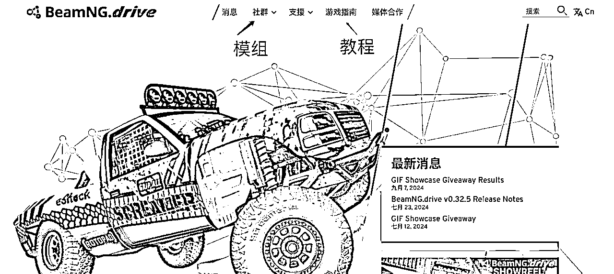

注意⚠️：本游戏最好推荐 32G内存

推荐配置

普通设置为1080p

操作系统: Windows 10 64 Bit

处理器: AMD Ryzen 7 1700 3.0Ghz / Intel Core i7-6700 3.4Ghz (或更好)

内存: 32 GB RAM

显卡: AMD R9 290 / Nvidia GeForce GTX 970

DirectX 版本: 11

存储空间：50GB 可用空间

附加说明： 安装游戏模组会增加所需存储空间。建议使用游戏手柄。

最低配置

最低设置为720p

操作系统: Windows 7 Service Pack 1 64-bit

处理器: AMD FX 6300 3.5Ghz / Intel Core i3-6300 3.8Ghz

内存: 16GB RAM

显卡: Radeon HD 7750 / Nvidia GeForce GTX 550 Ti

DirectX 版本: 11

存储空间: 45GB 可用空间

## 2.2 游戏在哪里下载？

建议在Steam平台下载

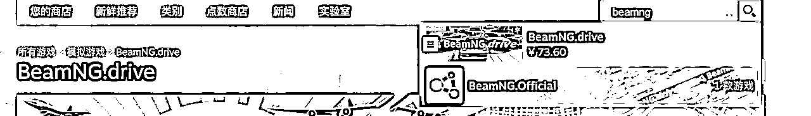

下载好之后点击运行即可！这个游戏是付费游戏 ¥73.60（建议买正版）

## 2.3 游戏界面基础指南

## 2.4 游戏模组下载

说明：为了增加游戏的可玩性，最好能自行下载模组进行设计！

### 2.4.1 精品车具模组

https://www.modfans.cc/

这个模组网站主要是下载常见的BeanNG 车具，有些是付费的，我自己买过一些，效果还不错。

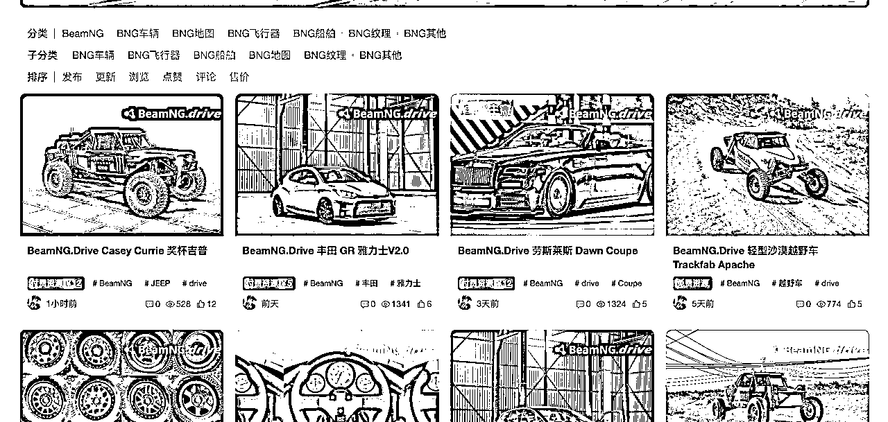

### 2.4.2 官方推荐模组下载地址

https://www.beamng.com/resources/

### 2.4.3 其他网站的模组（借鉴）

https://www.patreon.com/surski57/shop

https://www.modland.net/beamng.drive-mods

https://www.worldofmods.com/beamng/maps/

### 2.4.4 如何安装模组

安装模组的方法有两种，第一种是直接在游戏界面里直接下载安装，第二种是通过在第三方网站下载的模组手动安装。

### 3.4.1 在线安装

### 2.4.2 手动安装

Step1：下载自己想要的模组，一般是一个zip文件

Step2：打开游戏根目录，找到mods的文件夹，然后直接把zip拖进去即可，如果没有mods文件夹，自己新建一个即可。

警告⚠️：有些模组可能有损坏的情况，自行检查

参考资料：官方也给了一个详细的教程，请查阅：

How to install mods

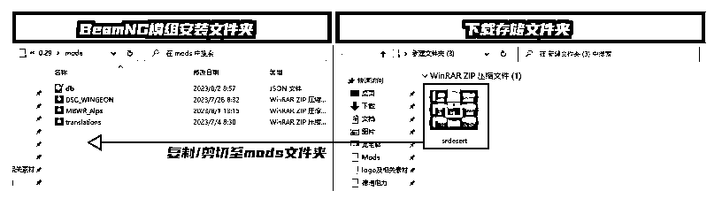

# 四、云端玩法

如果没有家里电脑或者配置不够怎么办？

大家可以参考这个视频：能玩《悟空》的赛博网吧？海马云电脑/网易云游戏/腾讯Start云游戏/顺网云电脑/ToDesk云电脑横评

云端电脑访问：https://pc.todesk.com/

第一步：下载个人版

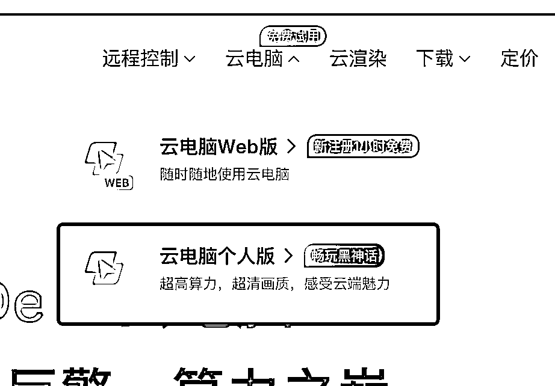

第二步：选择配置，这里如果大家录制的简单剧情，就可以选择3060，如果录制的比较复杂，比如十几辆车那种就选择4070，套餐建议用包时。

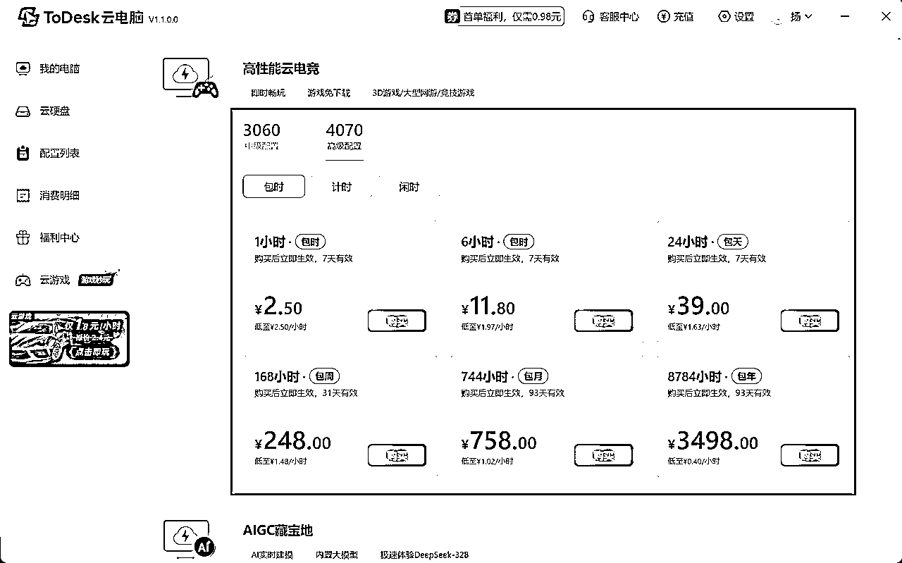

第三步：进入购买的云端电脑之后就下载必要的软件

一般，云端电脑已经有Steam了，你只需要下载BeamNG游戏即可。

录制屏幕建议用自己本地的即可！

测评；

我看了下学员在云端录制的视频和本地的几乎一毛一样，真是狠人！

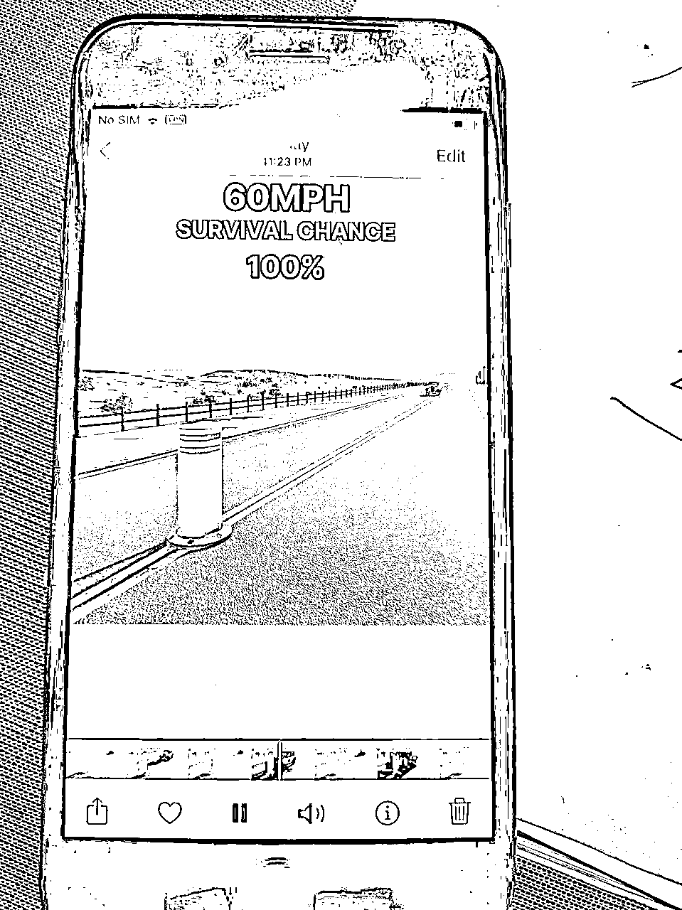

注意事项：如果遇到过云电脑登录不了steam的情况，

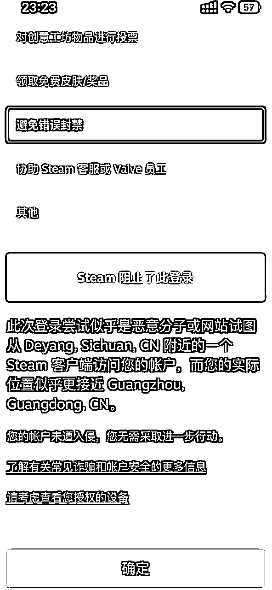

这里注意，扫码之后，手机上就能看到这台云电脑要登录的位置。看清楚，然后做选择题的时候选对。

如果还是解决不了，可以参考：https://www.bilibili.com/video/BV1AXSuYAEd7/?vd_source=42b4fec78bfbc6c161a4d8f2f68d2a57

# 五、总结与计划

最后，我再啰嗦下，这个赛道如果打算要做需要花费一些时间和精力，如果大家感兴趣，可以入局。会了不难，熟悉了也就变得简单的。

最后，祝大家新春快乐～