# 不到100块，就可以打造一台属于自己的私人AI大模型智能助手

> 来源：[https://hez86518tv.feishu.cn/docx/TwmPdO2rgohtmZx7A9FcWWpOnBb](https://hez86518tv.feishu.cn/docx/TwmPdO2rgohtmZx7A9FcWWpOnBb)

| 版本 | 更新描述 | 作者 | 更新日期 |
| V1.0 | 新建文档 | 科学羊 | 2025-02-20 |

大家好，我是科学羊，公众号专栏日更作者，知名报社签约编辑、海外内容创业实践者、海外游戏视频创作者，机器人系统开发工程师，本篇我给大家分享一个神奇的东西——基于AI大模型的硬件操作指南。

为什么分享这个玩意？

我想：“既然大家都在卷AI软件，我们何尝不卷卷硬件”。

先看看效果：

商业价值分析：

1、套坑玩偶售卖：我测试过这款AI模型，稍加训练给儿童讲睡前故事还是很不错的，可以自己在淘宝买个玩偶，将板子植入内部就可以实现陪伴玩偶与之对话，这些玩意据了解去年就卖的很火的，抓紧上车！

2、技术创客：售卖课程或技术研发顾问

# 一、前言：

本篇我们分享一个比较硬核的东西，也就是基于嵌入式ESP32-S3开发一款AI智能体。本次分享的方法来源于「小智 AI 聊天机器人」，虽然原作者分享的很详细。但我在此基础上做了细化，去掉一些繁琐的操作，也就是极致节约成本，做出一个MVP出来。

本次开发平台：基于windows系统开发

适合人群：想通过硬科技创业、对智能硬件感兴趣的朋友

# 二、硬件清单

| 序号 | 名称 | 数量 | 单价 | 购买链接 |
| 1 | ESP32-S3-DevKitC-1开发板 N16R8 C3 ai小智模块esp32s3 Wifi蓝牙 | 1 | ¥44.6 | 控制器 |
| 2 | INMP441全向麦克风模块 MEMS 高精度 低功耗 I2S接口 支持ESP32 | 1 | ¥8 | 麦克风 |
| 3 | MAX98357 I2S 音频放大器模块 /无滤波D类放大 支持ESP32 树莓pi | 1 | ¥15.8 | 小音响 |
| 5 | 杜邦线若干 | 15条+ | \ | 自找 |

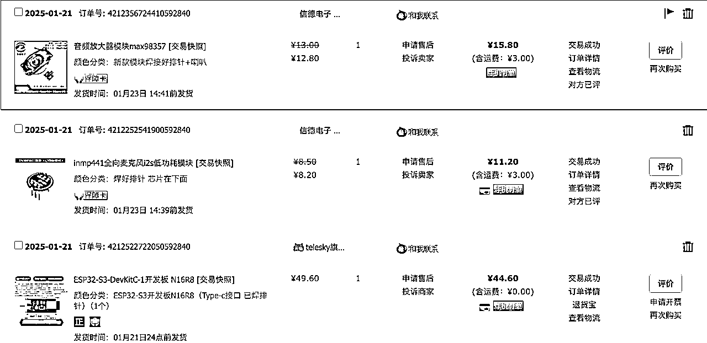

# 三、硬件接线

## 3.1 接线示意图

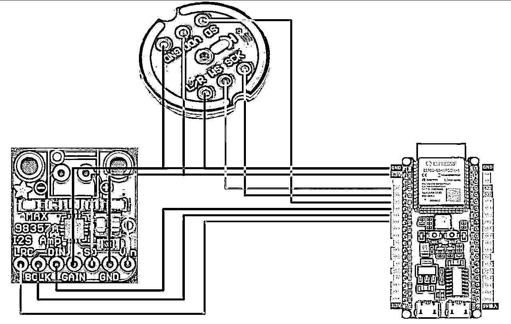

## 3.2 实拍图

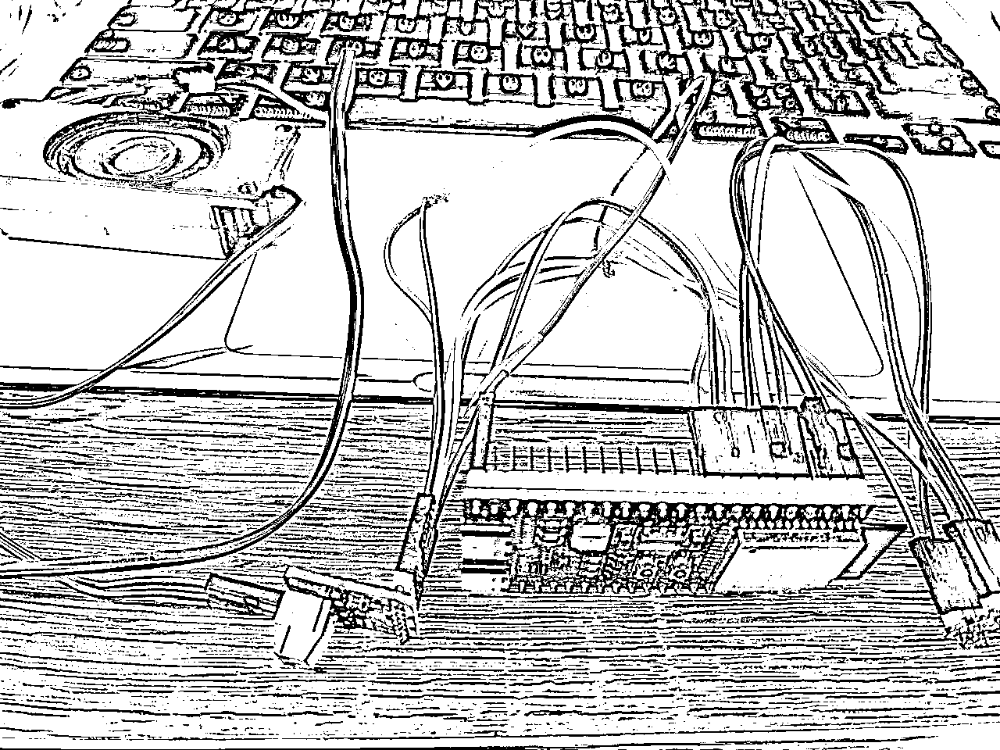

# 四、固件安装及软件安装

## 4.1 准备好固件和工具

软件及工具下载：https://www.espressif.com.cn/zh-hans/support/download/other-tools

固件下载地址：https://github.com/78/xiaozhi-esp32/releases

这里已经下载好了！

（Flash 下载工具）

（固件）

## 4.2 控制板通电

将带有com的口和usb口分别用typeC线接入电脑USB，完成之后会发现控制板的LED灯点亮，此为正常

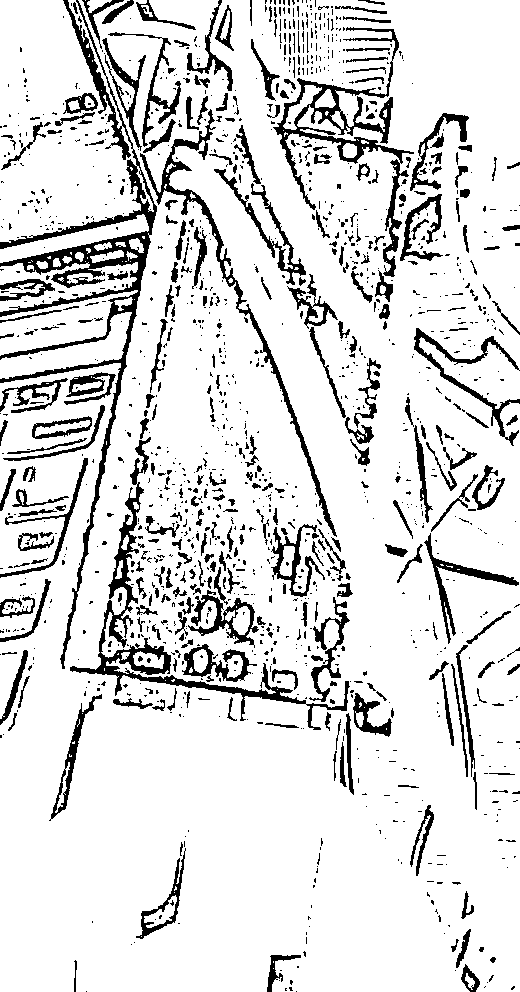

## 4.3 确认端口

打开设备管理器 >

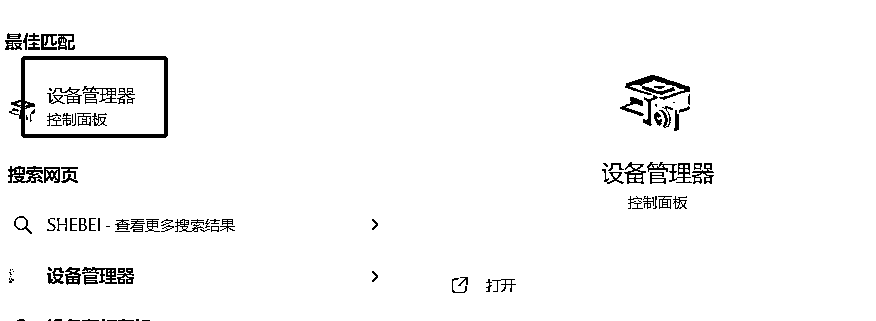

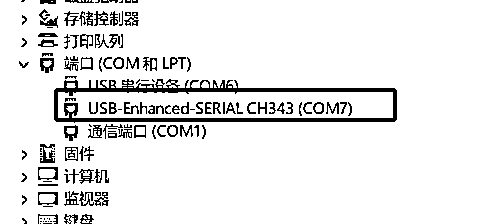

确认好自己的控制板的端口号，比如我的是COM7

## 4.4 打开固件下载软件

下载好上面提供的Flash下载工具

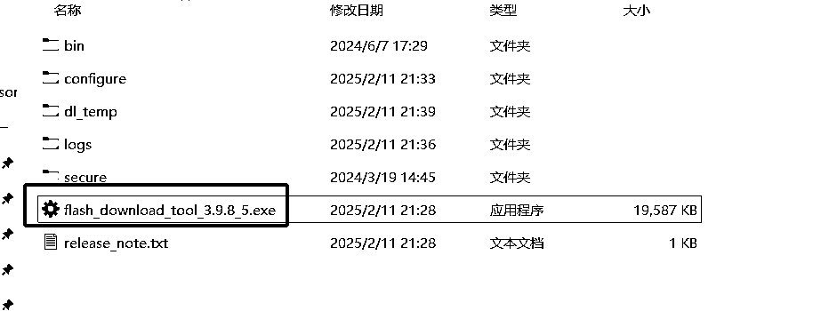

双击打开，按照下图所示选择

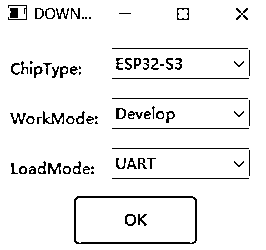

选择固件（下载好的固件）的路径（如果你不把bin文件放到flash download tool 程序的bin目录下，放到电脑硬盘其他地方时，请不要使用中文目录名，否则烧录程序加载bin文件会报错，将无法烧录。）

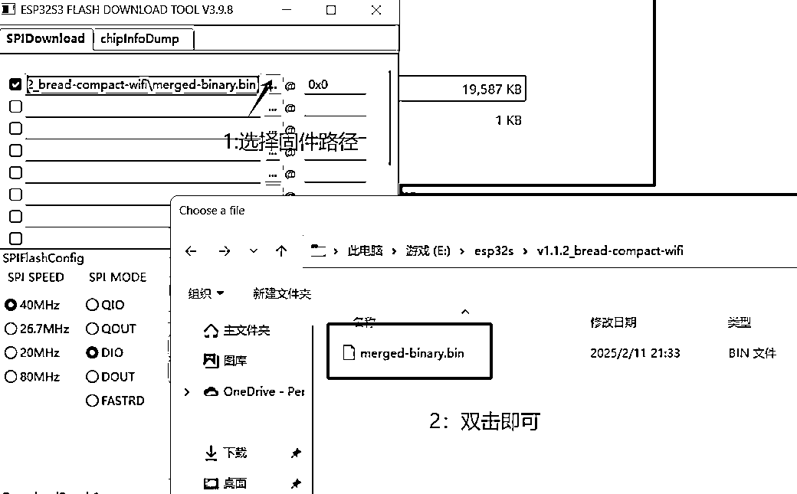

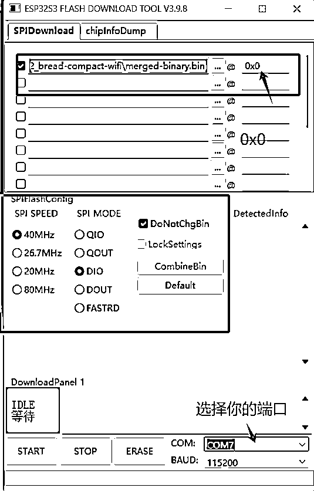

点击Start下载程序

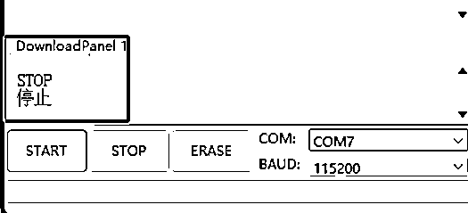

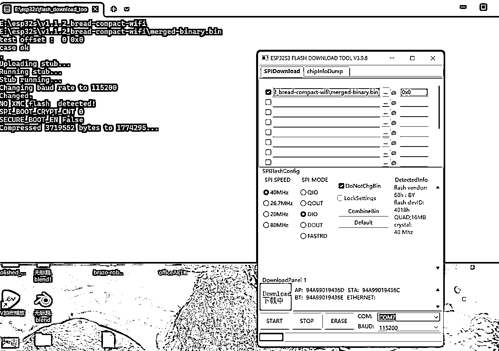

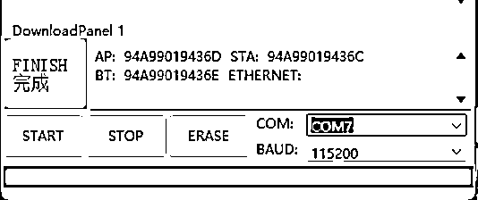

大约等待2min左右，后显示Finsh

然后，点击控制板的RST复位按键，此时会收到一个提示音：进入配网模式

# 五、AI配置与测试

## 5.1 配网

接下来，你需要打开手机wifi寻找控制板的Wi-Fi，并连接，

使用手机或电脑连接到设备的 WiFi 网络，通常以 Xiaozhi-XXXXXX 命名。选中并连接，等待几秒wifi热点连接成功，将自动进入选择界面，请勿提前手动关闭界面，如下图示

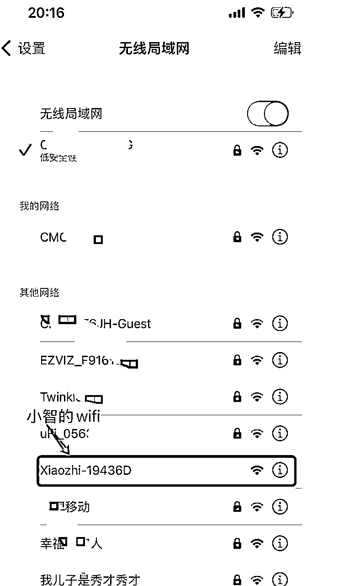

点击，小智的wifi，然后会出现下面的页面。

注意：打开wifi扫描页面会有点慢，请等待5秒左右，请勿取消或关闭页面

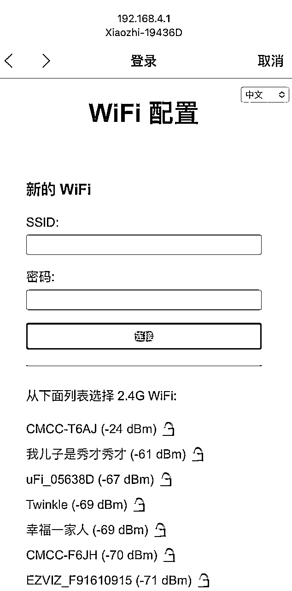

这时候，你可以连接你家里的非5G的网络，输入密码，此时控制板就会成功连接。

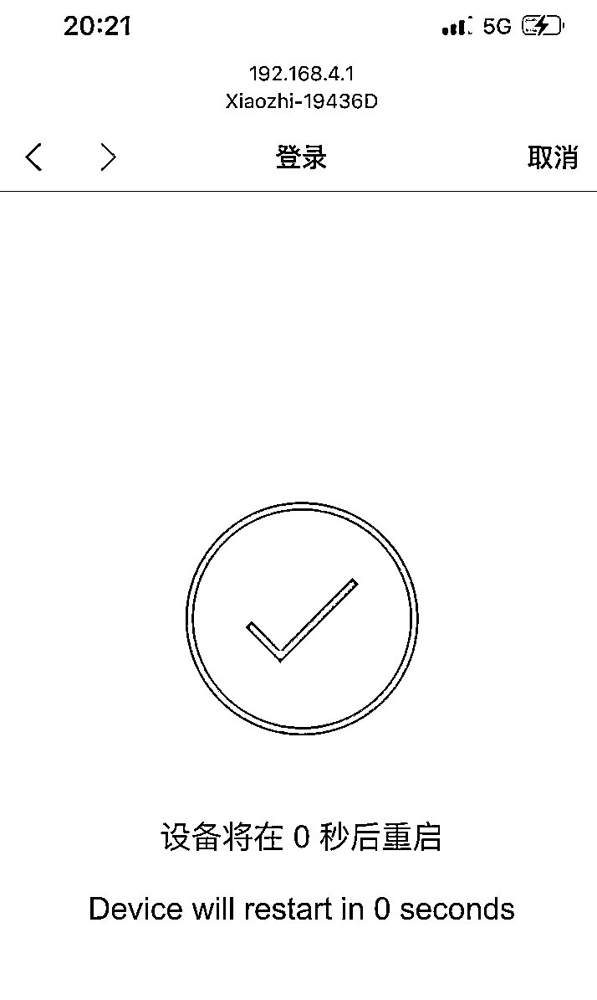

## 5.2 进入后台配置声音和角色

完成上一步之后，需要到 小智AI聊天机器人-控制面板 添加设备验证通过，才能正常使用设备进行AI语音聊天，请按照以下步骤操作：

确保设备已连接到互联网，能够通过“你好，小智”唤醒，并出现要求添加设备的提示语6位设备验证码（可以重复唤醒重听）。

注意：如果用户没有听到语音播报，喇叭没有发声，面包板方案用户请检查功放和喇叭接线是否正常，使用第三方开发板用户请检查固件是否匹配且正常运行。

电脑浏览器访问 小智AI聊天机器人-控制面板 后台：https://xiaozhi.me ，如未注册先注册账号。

在菜单选择“设备管理”，页面中找到“添加新设备”入口。

输入提示语中告知6位数字的设备 ID，然后点击“添加设备”按钮，如下图示。

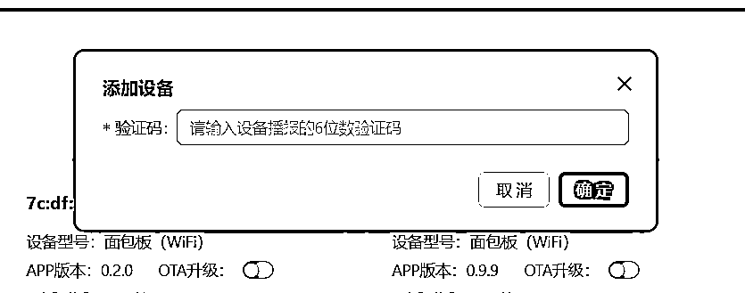

设备将自动激活，并显示在“设备管理”页面上，就可以正常使用了，暂时免费。

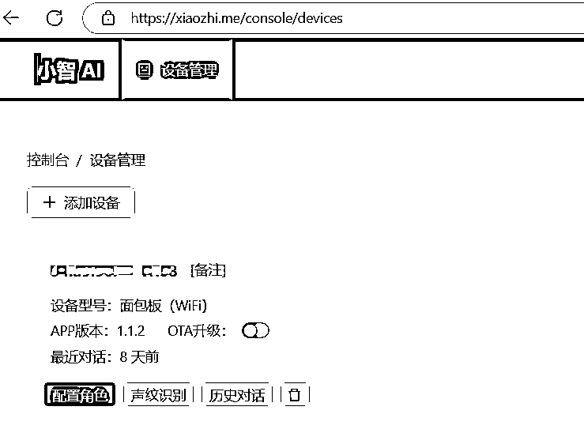

接下来，你就可以通过在「配置角色」里选择你喜欢的AI实体，也可以在里面选择你想要的AI模型。

以上，谢谢～

# 参考资源

最后给大家提供一个操作视频参考：

4分钟搭建AI小智（一谷半溺）

小智AI开源网站如下：

https://github.com/78/xiaozhi-esp32?tab=readme-ov-file

# 结语：

最后，提醒大家，嵌入式开发不仅有趣，而且未来也能派上很大用场，如果没有基础也不用怕，布莱恩·阿瑟的《技术的本质》里说，技术的本质无非就是流程化的操作步骤，也就是SOP。虽然你可能不知道黑箱里面做了啥，但是时间久了你自然就明了了！