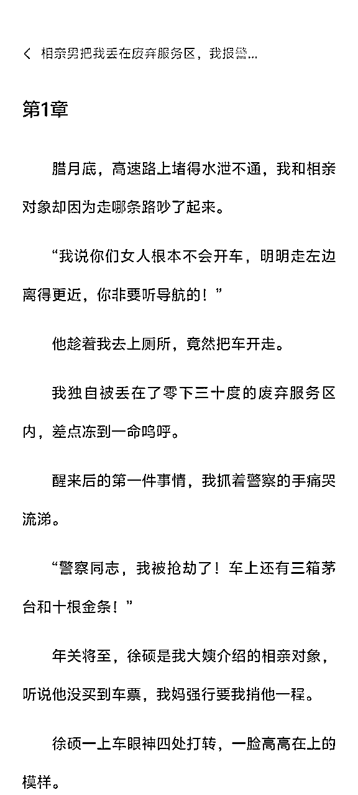
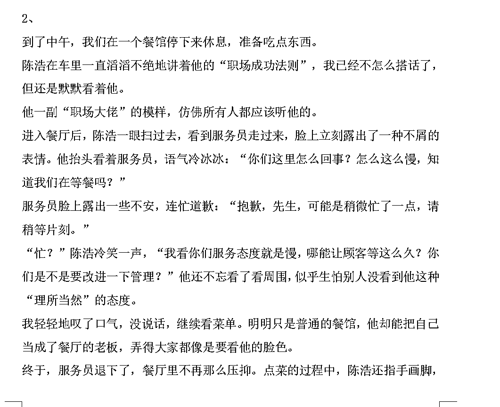
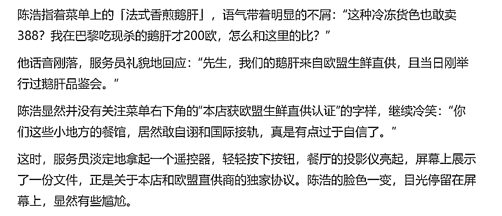
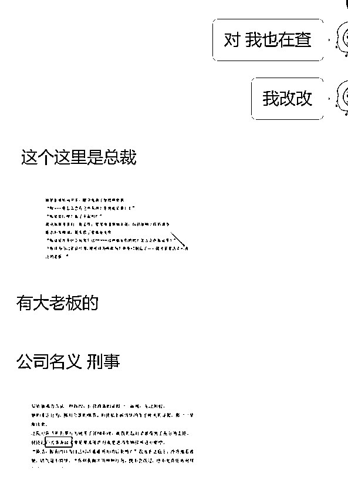

# 【ai写作】 我用ai写爽文小说 赚到第一笔小说稿费的故事 全文拆解我的思路和流程

> 来源：[https://lv9qj6hfr4z.feishu.cn/docx/VEZQdB4oRo0xIlxQgxscQibLng9](https://lv9qj6hfr4z.feishu.cn/docx/VEZQdB4oRo0xIlxQgxscQibLng9)

大家好 这里入局写作五年其实一直很少写小说的荷包蛋，过年期间接到了一个小说单，我闲来无事尝试了一下，终于赚到了这几年来第一笔其他品类的稿费，目前小说已上架番茄，稿费800元，客户也已经打给我了，所以借这次机会给大家分享一下-----我用ai写小说的全流程，和变现经历，希望对大家有帮助！

# 一、事情起因与需求分析

## （一）事情起因

我之前一直不爱写小说，也没有出过相应的教学：

一是因为稿费太低了，中介单基本上千字7-11块钱 一般发表晋江内种，还不如其他品类赚现金流来钱快所以优先写别的品类了。（写一个演讲稿苏随便五分钟就能赚七八十）

二是因为自从上了高中之后我感觉变成了成年人想象力退化了有时候憋不出来什么好的作品，感觉写出来的都是垃圾，所以没啥信心干脆就不写了。

所以这几年基本上没有怎么碰小说，遇到要写小说的客户，一看价格太低了 就拒绝了。

直到年前，许多工作都进入尾声了，实在是太无聊了，正好有个客户找上门来......

如上图所示，于是我接下来了这一篇 并且收到了定金 开始尝试小说的创作！

## （二）需求分析

你们爱看小说吗？ 我觉得多多少少都会刷到吧。不管是短视频的小说推文，还是从其他平台的推荐的，或者听书。。 多多少少都能接触到吧。

我喜欢刷快手，快手就经常给我推知乎爽文，经常念到最精彩的地方 戛然而止，让人忍不住付费观看后续 光过年这1个多月 我就花了100＋ 来买各种小说，五花八门的题材，各个都贼吸引人，还紧跟时事热点！ 我就忍不住一直付费。。。

下面我们进行简单的市场分析

### 1、市场概况

#### （1）市场规模与增长

知乎付费阅读业务已成为其核心收入来源，2024年三季度营收达4.59亿元，占总收入的54%。知乎盐言故事平台内容体量超10万部，覆盖180多个品类，累计为作者分成超10亿元，作者平均收入近万元。中国网络文学市场规模预计2025年突破千亿，短篇小说成为增长主力，20万字以下作品占比显著提升。

#### （2）用户规模与画像

知乎付费会员数达1650万（2024Q3），其中超80%用户为18-30岁高知女性，偏好短篇、高密度爽点内容412。短篇爽文用户付费意愿强，单篇阅读时长约15-30分钟，符合碎片化阅读习惯

### 2、用户需求核心驱动因素

#### （1）创作者经济

高收益吸引：知乎短篇千字收益可达传统平台（如晋江）的5倍，但IP版权费较低（约5万元起）。

低试错成本：单篇创作周期1-2周，无需日更压力，适合新人入局。

#### （2）IP开发与短剧联动

知乎已有近百部作品售出影视版权，短剧改编周期仅需2-3个月（如《执笔》分账破2000万）。短篇IP虽版权费低，但开发灵活性强，适配短视频平台流量分发逻辑。

### 3、数据总结表

# 二、爽文小说的基本思路拆解

经过上面的简单的需求分析 ，接下来我根据我目前掌握的信息来拆分一下写一篇短篇小说目前要注意什么，和一些基础的逻辑知识。

## （一）常见类型与核心逻辑

目前市面上最常见的一些类型我最近看到的比较多的，可以这样分类：重生文，系统文，恋爱脑觉醒文，软擦边文，好孕复仇文，紧跟热点文。。。

### 1、重生文

核心逻辑：通过死亡/失败后的重生设定，满足读者弥补遗憾、逆天改命的爽感需求

典型标题：

*   《穿成男主的恶毒前女友》22（知乎盐选热门作品，改编短剧）

*   《过期情深》22（女主重生后手撕渣男）

数据验证：知乎盐选榜单中“重生”题材占比超30%，改编短剧成功率最高

* * *

### 2、系统文

核心逻辑：引入规则明确的超自然系统，强化剧情推动力与目标感

典型标题：

*   《绑定校霸痛觉之后》（痛觉绑定+校园甜虐）

*   《替换系统》（书中人物觉醒对抗系统规则） 用户粘性：系统文完读率比普通题材高15%，因强目标驱动适合碎片化阅读

* * *

### 3、恋爱脑觉醒文

核心逻辑：从恋爱降智到清醒反击，迎合女性独立意识觉醒

典型标题：

*   《痒》（蛰伏反击渣男小三）

*   《我非舔狗》（校草后悔流眼泪） 市场反馈：觉醒类作品在18-30岁女性用户中付费转化率超60%

* * *

### 4、软擦边文

核心逻辑：游走审核边界，用隐喻/场景化描写刺激荷尔蒙

典型标题：

*   《因为不想死所以舔你》（病症设定合理化亲密接触）

*   《傅爷，你的替嫁新娘是大佬》（下架前播放量破千万） 风险提示：2024年短剧新规实施后，擦边内容下架率同比上升40%

* * *

### 5、好孕复仇文

核心逻辑：以生育为武器实现阶层跨越或复仇

典型标题：

*   《嫁给神医男二后》（医学+宅斗复合题材）

*   《当男主他有病又有钱》（借孕反杀PUA男主） 变现优势：此类作品有声书播放量是普通题材的2倍，适合中老年女性市场

* * *

### 6、紧跟热点文

核心逻辑：快速响应社会事件或影视热点，降低用户理解成本

典型标题：

*   《我在长征路上开超市》（结合主旋律短剧热潮）

*   《授她以柄》（蹭“短剧春节档”流量） 数据验证：热点类作品首周点击量是常规作品的3倍，但生命周期仅1-2个月20

* * *

## （二）平台适配与变现建议

注：以上数据综合自知乎盐选作者访谈及平台公开报告，创作时可结合AI工具（如腾讯妙思）实现标题优化和热点抓取。

## （三）爽文小说的爆款标题公式

### 1\. 公式：“[主角身份]的[事件冲突/反转]”

举例：“重生后的我成为了他背叛的女人！”

### 2\. 公式：“[主角性格]的[关键事件]”

举例：“绑定超级系统，我竟能逆天改命

### 3\. 公式：“[情感冲突]下，发现[身份揭示]”

举例：“恋爱脑觉醒，我用自己的智慧逆袭了渣男！”

### 4\. 公式：“[悬念事件]后，[意外转折/揭示]”

举例：“相亲对象居然是我的上司！”

### 5\. 公式：“[情感转折]，最终[冲突解决/结局预示]”

举例：“她怀上了孩子，竟然成为了他的最大威胁！”

### 6\. 公式：“[冲突/误会]，最终[结局或反转]”

举例：“从普通职员到超级CEO，我如何逆袭？”

## （四）爽文小说的行文风格解析

不同类型的小说适合不同的行文风格，以下是一些常见的行文风格解析，帮助你在创作过程中明确方向：

### 1\. 简洁高效，直击爽点

适合现代爽文、职场小说等快速推动情节的作品，目标是让读者快速进入状态，不拖沓、节奏紧凑。

特点：

句子简洁明了，避免过多的描写，专注于情节和冲突的推进。

情节发展快速，事件频繁发生，充满悬念和惊喜，保持读者的阅读兴趣。

聚焦“爽点”，即每个情节的高潮部分，让读者体验到成就感和满足感。

示例：

“她一脚踢开了办公室的门，笑容满面地宣布自己升职了！”

“没想到我这个曾经的‘职场菜鸟’，竟然可以反转局面，直接成了这家公司的CEO。”

* * *

### 2\. 细腻描写与内心独白

适合情感丰富的小说，尤其是恋爱小说、成长小说等类型。对人物的内心世界和细腻的描写，塑造复杂的情感和人物性格。

特点：

侧重人物内心活动、心理变化，刻画人物的情感波动与成长。

细致的环境描写和人物动作描写，能够让读者对故事中的人物产生更强的共鸣。

通过细腻的语言，展现人物的情感起伏、情境转变和冲突解决。

示例：

“我静静地看着镜子中的自己，眼神迷茫，仿佛在思考一切都已经不再重要了。”

“他突然抓住她的手，她的心跳加速，明知道这场感情注定会让她受伤，但她仍然无法抗拒。”

* * *

### 3\. 幽默讽刺，带有轻松感

适合轻松幽默的小说，尤其是在情节中融入了一些讽刺和自嘲的元素，既能够推动情节发展，又能给读者带来欢笑。

特点：

用幽默的语言和讽刺的方式揭示人物性格或情节的荒谬之处。

对话充满机智和自嘲，语言生动、俏皮，有时带有些许戏谑。

通过幽默的方式减轻小说中的冲突和矛盾，使得情节更轻松愉快，适合追求娱乐性和放松感的读者。

示例：

“我总是笑他太傻，结果没想到有一天，他竟然在关键时刻给了她一巴掌——不过是为了她的成功。”

“他自以为是个职场大佬，但每次开会都会被她一言不合打脸！”

* * *

### 4\. 情节紧凑，高潮迭起

适合悬疑小说、推理小说、职场反转等类型，强调故事的紧张气氛和不可预见的情节发展。

特点：

情节推动迅速，保持高强度的紧张感和冲突。

每一章都可能是高潮，吸引读者继续阅读，直到解决所有悬念。

语言简练、直白，不拖沓，每个情节和人物的行为都为故事的最终解答铺垫。

示例：

“我一走进会议室，就看到他冷静地坐在那里，手中的文件夹竟是自己一直追查的证据！”

“他刚想开口说话，突然手机屏幕一闪，他的世界彻底崩塌。”

* * *

### 5\. 情感浓烈，戏剧性强

适合古言小说、悲情爱情小说等类型，突出人物间复杂的情感纠葛，运用夸张和戏剧化的手法来制造强烈的情感冲突。

特点：

语言华丽、感情激烈，适合表现复杂的情感冲突和人物的极端情绪。

情节发展迅速且极具戏剧性，通过角色的选择和决定，带来不可避免的情感转折。

通过戏剧性的语言表现出人物的激烈情感反应，使得每个情节都充满张力。

示例：

“他一步步走向她，眼中满是深情，但她已经无法再接受那份伤害。”

“我为他甘愿牺牲自己的一切，最终却得知他的背叛。”

## （五）剧情遇到bug如何处理

先给大家讲个案例，过年期间我看了好几本讲

【和瞧不起自己的脑残亲戚打牌，然后赢回来很多钱的剧情的小说】

剧情都差不多 大差不差的 就是讲打牌 炸金花这种 剧情里面的角色越赌越大。。。最后赢了很多钱 典型的爽文逻辑 又结合春节热点 春节大家在家肯定也会一起打打牌 也会遇到一些瞧不起自己的亲戚所以很吸引我们去阅读后续剧情：

但是很明显 打牌打这么大赌这么多 明显不合法的！

所以作者强行修复bug 加了一个在国外的设定 或者在澳门的设定 强行合规了一点

很多小说 之所以去设定系统 设定女主或者男主有特异功能 经常就是为了修复剧情上不合理的地方

刚开始写爽了 没有想到剧情的合理性 然后后期提一嘴来修复bug

或者很多小说 我读下来 确实也毫无逻辑 但是很爽 也许很多人就是喜欢看无脑的 或者 故意写这种不符合常理的来吸引眼球 比如：

豪门父母疼爱侄女 饿死亲生孩子

穿越几百年解救男主 结果穿越失败

我和同事去野人部落 结果酋长是我大学同学。。。

这些都是我最近看到的剧情 真的都很不合理 但是估计没人会特别在意这种爽文的合理性 爽就好了

所以遇到bug 我们需要：

### 1\. 利用设定进行修复

就像你提到的，很多小说在遇到不合逻辑的情节时，会通过增加一些设定（如“系统设定”、“特定背景设定”）来强行修复。

### 2\. 引入反派或意外因素

有些剧情中的bug可以通过引入“反派”或“意外因素”来修复，使故事看起来更合情合理。例如，主角经历一系列极端事件，最终面临更大的挑战。

### 3\. 接受“爽文”的设定，不强调合理性

许多爽文小说的受众并不关心情节的合理性，只要爽点足够强烈，情节的荒谬性可以成为吸引力的一部分。例如，强行不合逻辑的设定往往带来更戏剧化的效果，能够让读者产生震撼或惊讶，增强阅读的愉悦感。

### 4\. 人物的自我调侃或角色意识的自我修正

如果情节真的很难合理化，可以让角色意识到这些不合理性，并通过自我调侃或自我修正来缓解读者的疑虑。比如，主角知道自己所处的世界并不完美，甚至偶尔会“吐槽”剧情的荒谬性。

## （六）其他注意事项

### 1、 节奏感与结构

无论是快节奏的动作戏，还是慢节奏的情感铺垫，都需要掌握好节奏，避免让读者产生“拖沓”的感觉。

开篇要有吸引力：小说的开头至关重要，需要在几段文字内迅速抓住读者的注意力。可以从一个悬念开始、设定一个强烈的情感冲突，或者引出一个令人好奇的事件。

中间不拖沓：情节推进要自然流畅，每个情节都应该为下一个情节提供铺垫，避免冗余的描写或无关的情节。

结尾要给力：结尾应该具备一定的冲击力，不管是通过反转、情感的升华，还是通过解决故事中的主要冲突，给读者带来满足感。

### 2、人物设定与成长

人物是小说的灵魂，特别是主角，必须具备足够的复杂性和立体感。人物的性格、动机、缺点和优点要合理且符合故事的背景和情节发展。

主角要有成长弧线：即使是爽文，主角的成长也应有一个清晰的过程。成长弧线可以是从弱小到强大，从懦弱到勇敢，或者从感情盲目到清晰自信。

配角要有特色：配角并不是简单的背景板，他们应该有自己的故事、性格和动机，能够推动主角的成长或者为故事增添色彩。

人物之间的冲突与合作：不同人物之间的冲突或合作可以推动剧情发展，丰富故事内容。例如，职场小说中的上司与下属、情感小说中的两位主角，都会因为不同的背景和性格碰撞出火花。

### 3、 世界观与设定的合理性

无论是现实主义小说还是奇幻小说，世界观设定的合理性都非常重要。即便是最离奇的设定，也需要在小说的世界内有一致性和可解释性。

构建一个自洽的世界观：例如，在科幻、奇幻类小说中，构建一个合理的未来世界或魔法体系，必须设定清楚规则和限制，确保世界观内的逻辑是连贯的。

避免强行套用：有时候作者为了制造效果，可能会套用某些流行的设定或情节（如“重生”、“系统”设定等），但如果这些设定过于生硬，缺乏自然铺垫，可能会让读者感到突兀。

### 4、 对话的自然性与表现力

避免无聊的对话：每个对话都应该有其目的，要么推进剧情，要么展示人物性格。避免出现没有实际内容、纯粹填充空间的对话。

注意人物口吻和背景：不同的人物应有不同的口吻。比如，高冷的男主可能说话简洁且有些冷淡，而幽默的女主可能有更多的俏皮话和插科打诨。

对话中的潜台词：对话不必总是直白的，很多时候通过潜台词或语气可以表现人物的内心活动和矛盾冲突。

### 5\. 可以合理二创，避免抄袭和剽窃

在创作过程中，原创性是至关重要的。即使受到某些作品的启发，也要避免直接复制或剽窃他人的内容，确保你的故事有独特性和创新性。

可以寻找一些对标剧情 但是不能原封不动，要进行一些剧情的创新，你的主要脉络起伏可以与对标有一些关联 但是不要照搬。你的人设 和 角色技能 一定要有所修改。

### 6、一定要合法合规不要搞擦边

小说中的内容不能涉及违法或禁止的行为。例如，涉及暴力、淫秽、赌博、毒品、恐怖主义等内容的描写需要特别小心，避免违法。同时，描写这些内容时也要考虑到平台的审查标准。 千万不要为了流量写一些擦边的内容！！

# 三、爽文小说的实操流程演示

由于我的gpt前阵子封号了一个 ，我写的第一本的提示词完全找不到了 我没办法给你们看到当时的实操经过，所以我决定拿最近正在写的第二本来实操，演示流程。

由于第一本写的是古风的，所以第二本打算写一个现代文。

## （一）寻找对标剧情--梳理创新

寻找灵感 你平时就需要自己多看小说多了解目前市场上流动的爽文小说剧情都是啥样的

等你看了十本以上 你会慢慢有点灵感 梳理一下对标小说剧情

我找的对标剧情是这个：相亲男把我丢在废弃服务区，我报警。。。

大致剧情是这样的：

女主经过亲戚介绍 认识了一个装逼的相亲对象，然后中间各种拆穿他的谎言 男主忍不了 偷了女主的车 女主差点冻死在郊外，后面女主其实是一个大老板 然后找到了男主挪用公款的证据 最后扳倒了讨厌的男主 的爽文

符合春节假期的热点 回村 相亲 这些关键词

但是目前春节假期已经结束 所以我需要进行合理的改编二创

我可以把 回村相亲-----改成----------回城拼车 复工

于是我结合AI的帮助 创作出来了新的人设和剧情：

题目设定：《相亲对象把我当下属教育，其实我才是他的大boss》

女主人设

林夏，26岁，集团新晋区域运营总监，因公司安排隐藏身份，暂任分公司普通数据分析师。**她低调务实，衣着朴素，看起来毫不起眼，却实际掌控着分公司的人事和资源调整。

男主人设

陈浩，29岁，分公司销售副组长，典型的普信男，靠吹嘘和小手段爬上职位。他坚信“会说比会做更重要”，整天对新人灌输“职场潜规则”，逢人就吹嘘自己人脉广、领导器重，甚至声称和总部的林董有私交，俨然一副“职场大佬”派头。

接着我需要回顾一下大致剧情，梳理出二创后的剧情主脉络：

需要注意！！！

与对标文章相比 我已经换掉了人设 和细节 还有很多剧情 不用担心抄袭问题 因为我也确实是自己去写的 关键的事件我也完全换了新的事件 有了自己的独特风格和情节！！ 所以这确实是我自己构思的新的剧情和情节，行文风格也与对标不太一样！ 我们要学会对剧情的二创！

但是也确实保留了一点点对标剧情的一小部分 比如男主的人设 都是很讨厌的装逼男 男主都会与女二结婚之类的

结合对标小说剧情 和我自己的构思 加上ai辅助 我梳理出来了我的大致新剧情：

如果你问我 怎么改编 怎么二创 其实我觉得最好的回答就是多看小说 增加一些剧情 没有更好的办法 这些完全就是基本功了！！

多看 多和身边的人讨论 看多了 自己灵感就来了！

## （二）用ai辅助写作--快速产出

### 1、工具选择---deep做最强外置大脑写关键剧情 gpt写大部分剧情

因为deepseek太慢了 你拿它写完整小说 要等到后年马月

所以你必须结合起来 gpt处理不好的地方 弄deep 然后根据deep给的内容在反推给gpt继续优化整理

我先用deepseek 整合了我的思路 得出出了我的大致剧情 也多次调配了一下 deep自作聪明 给了我我很多不合理的剧情 我一直在优化。

最后得到比较满意的版本：

合理化高爽剧情线

1.  拼车修罗场（铺垫装逼）

*   公司组织节后拼车，陈浩抢到和林夏同车

*   高速上炫耀："你这岗位啊，得学学我给董事长做汇报的经验"

*   林夏发现他所谓"千万级项目"是自己上周刚毙掉的提案

1.  会议室现形记（第一次打脸）

*   陈浩在周会抢功："这个客户是我喝酒喝到胃出血才拿下的"

*   林夏调出系统记录："显示签约日是陈组长请病假那天？"

*   众人哗然中发现合同签章页有PS痕迹

1.  咖啡厅社死现场（持续升级）

*   陈浩带新人吹嘘："我经常在这家VIP室见客户"

*   服务员突然鞠躬："林小姐，您的专属虹吸壶准备好了"

*   店长补刀："这位先生上次把会员卡抵押洗车费还没还"

1.  终极大反转（合理收网）

*   陈浩伪造总部调令欲升职，恰逢林夏身份揭晓

*   晨会上大屏播放： ✓ 他谎称的"高尔夫球局"实为球场保安驱赶录像 ✓ 挪用团队奖金的ATM取款记录 ✓ 把公司资源倒卖给竞争对手的聊天截图

*   结局：陈浩被警方带走时还在喊"我认识总部领导"

📌现实向细节强化

① 所有证据均来自OA系统/监控录像/银行流水等真实渠道

② 林夏通过报销单发现他虚开发票（300元餐费开成3000）

③ 陈浩吹嘘的"商学院课程"实为盗用他人结业证书

④ 最终惩罚不是坐牢而是全行业黑名单+退还非法所得

这样调整后既有打脸爽感又符合现实逻辑，需要补充哪段细节可以随时说~

人工 优化后：

给客户看了之后，客户还是挺满意的

需要特别注意：剧情和人设不是构思好久不能改了 我们写的过程中肯定为了剧情顺利进行下去或者有新的灵感了 要不断地优化 所以 脑海中有个大致的框架 逐渐在写的过程中调整

### 2、开头引子---说出吸引人的冲突剧情

像这种爽文小说 开篇要点题，写出矛盾冲突点 要引人入胜、

先去多看一些市面上的爽文小说开头：

开篇都是 说出全文的冲突关键点 或者反转 要引人注意

前面我们已经梳理出来了我们的主要剧情脉络 所以我们先写个开篇引子

如果你不会写 你也可以用AI辅助你完成。

很明显 AI写出来的还是差一点 需要我们去提取关键信息整理 写出开篇第一句

还是需要人工来修正 把控好 开篇很重要！

这个是我自己结合AI给出的思路 最后创作出来的！就是要制造出这种戏剧感 ！

结果如下：

### 3、投喂主要剧情 ，分段落顺着剧情写正文内容

先把大致剧情投喂 然后我们来写第一章

先投喂对标 然后让AI学习对标小说的行文风格 然后跟AI说清楚我们要写的人设和剧情 重新告诉AI 让AI结合起来去创作

gpt给我的结果：

我不是很满意 继续优化ing

第二版本开头明显比第一版本要很多 ，我们可以继续AI加人工优化。

由于AI给出的剧情还是和对标太类似 我又让AI帮我换了一下男女主车内对话

然后我们整理提取后可以用的内容复制到WPS：

### 4、人工润色调整--合理把控

接上文 我们已经得到了 AI给的粗糙版本接下来，需要我们整理优化

整理后 人工优化的技巧是 你要全文通读一下 删减AI给出的不合理的表达 不断地优化提示词 按你脑内思路去贴合。

下面是我优化后的第一章：其实感觉gpt还挺给力的 是我想要的感觉了 我只需要继续推进剧情。

需注意 ： （1）爽文小说喜欢短句子 对话和旁白尽量分段

（2）万事开头难 写好第一幕剧情开始 我们就只需要把控剧情走向 别偏离主剧情和人设 继续进行下去 不断地用AI输出 然后人工把控调整 重复这些工作就好

（3）一定要注意 风格不要有太大变动 不要有任何违法违禁的词汇出现

然后 我们继续写 提示词看截屏我的操作即可 当然那你们自己创作的过程中 也可以把自己的想法输出给ai

整理有用信息后版本：、

人工润色 优化后版本：

短短几分钟 我们已经写了一千五百多个字了 是不是很简单

需注意：删掉AI过度的连接词 避免剧情和对话过于无聊 可以参考市面上同类型小说对标

创新新剧情 找点大众喜闻乐见的冲突矛盾点 来写 为 后续反转 爽文 打下基础 遇到卡点了 就去翻翻对标小说 去合理优化 增加剧情 更改！！

因为是短篇知乎爽文 所以客户只找我 定了两万字 我差不多一两个小时就可以写完 很快的。

### 5、继续剧情推进 ----gpt快速产出

继续推进剧情 重复前文的操作

遇到关键剧情 我们可以让AI写的更好更详细

细节把控：

得到结果：

需注意： 就是这样一直推进剧情 然后 写的不详细的地方继续让AI不断地优化产出 最终写完全文就好了

### 6、关键部分用---deepseek思考，gpt继续产出

我们也可以用deepseek 再一些关键剧情设置上 有更好的思路 。

deepseek的思考逻辑

好的，我现在需要帮助用户设定一些矛盾点，以增强他们提供的场景中的冲突和戏剧性。用户之前已经多次修改过故事，现在希望增加更合理的矛盾点，突出装逼男陈浩的行为，同时让情节更真实。

首先，我需要分析用户提供的现有场景。这段描述发生在餐厅，陈浩对服务员态度恶劣，展示他的傲慢和挑剔。用户希望在这里加入矛盾点，可能是为了后续情节的发展，或者揭示角色的更多层面。

用户之前的历史对话显示，他们希望故事更贴近现实，避免过于夸张。所以矛盾点需要合理，符合日常职场或社交场合可能出现的冲突。同时，用户希望突出装逼男的特点，所以矛盾点应该围绕陈浩的虚伪、谎言或不当行为展开。

接下来，我需要考虑如何通过矛盾点来展示陈浩的性格缺陷，同时为后续林夏揭露他的真面目埋下伏笔。可能的矛盾点包括：陈浩对餐厅的不实评价、炫耀虚假经历、对服务员的苛刻要求，或者他在点菜时暴露的无知。

比如，陈浩声称是常客，但实际上对菜单不熟悉；点昂贵的菜品却不懂正确吃法；或者炫耀虚假的品酒知识。这些都可以作为矛盾点，既展示他的装逼，又为后续被揭穿留下线索。

另外，可以加入其他顾客的反应，比如真正的老顾客或业内人士在场，通过他们的反应来侧面烘托陈浩的可笑。或者服务员的表现其实有隐藏身份，比如餐厅经理或林夏安排的线人，暗中收集证据。

还要考虑如何让这些矛盾点自然融入场景，不过于突兀。例如，陈浩点菜时选择昂贵的红酒，但要求错误的方式，服务员纠正他，但他恼羞成怒，进一步暴露无知。或者他提到的所谓名人常客，被服务员指出并不存在。

同时，需要确保这些矛盾点与后续情节衔接，比如林夏在之后利用这些矛盾点来揭穿陈浩的谎言，或者在会议中展示证据，增强打脸的爽感。

最后，要检查这些矛盾点是否符合现实逻辑，避免过于戏剧化，保持真实感。例如，陈浩可能因为虚荣心作祟，在点餐时过度强调自己的品味，却因为缺乏实际经验而露出马脚，这样的设定既真实又能突出他的性格缺陷。

## 

deepseek给出的剧情内容设计：

矛盾点深化设计

1.  身份认知差

*   陈浩行为：指着菜单上的「法式香煎鹅肝」对服务员嗤笑：「这种冷冻货色也敢卖388？我在巴黎吃现杀的才200欧」

*   隐藏真相：菜单右下角印着「本店获欧盟生鲜直供认证」，且当日刚举行过鹅肝品鉴会

1.  装逼反噬链

*   陈浩表演：掏出手机展示「上周和米其林主厨的合影」，抱怨：「你们厨师摆盘还差点火候」

*   致命细节：照片背景里的餐厅Logo，正是本市上月关门的网红店

1.  阶级认知错位

*   陈浩要求：「把你们82年的拉菲醒三小时，温度控制在16.2度」

*   服务员反击：「先生，这款是去年获奖的新世界红酒，建议18度饮用」并亮出侍酒师执照

1.  人脉谎言现形

*   陈浩吹嘘：「你们王总上次还送我VIP金卡」

*   经理登场：「抱歉，我们老板姓李，需要帮您联系王总吗？」

1.  消费能力漏洞

*   陈浩点单：豪气点完人均2000的套餐后，钱包滑出便利店积分卡

*   镜头特写：积分卡余额仅够兑换两包纸巾

🎬冲突升级设计

第一阶段：虚假权威

陈浩用食指敲击红酒瓶：「这种酒瓶斜肩角度不对，一看就是假酒」

服务员微笑打开防伪溯源系统，投影仪显示该酒庄独家供应协议

第二阶段：认知碾压

当陈浩挑剔「松露切片厚度超标」时，后厨走出戴着高帽的主厨——正是他「合影」过的米其林厨师

第三阶段：社死闭环

陈浩准备刷卡时，POS机突然播报：「尊享版运通黑卡余额不足」全餐厅目光聚焦

📌伏笔埋设

① 服务员佩戴的工牌吊绳是集团定制款（与林夏同系列）

② 主厨离场时对林夏点头致意

③ 餐厅监控闪着红光同步到林夏手机

④ 陈浩撕碎的账单被清洁工收进密封袋

这些矛盾点既符合现实逻辑，又能自然衔接后续打脸剧情。需要增加特定行业细节或调整羞辱强度可随时告知。

* * *

我 继续选择有用部分 让gpt结合关键矛盾剧情去扩写成正文剧情

将deepseek的内容投喂给gpt

得到了精彩的内容结果：

还是选取一些符合常理的地方 来粘贴近正文

最终组合结果我还是挺满意的：只需要人工继续润色 就可以粘贴到正文了

陈浩的话像是锋利的刀刃，直接扎向服务员。他冷冷地睨了她一眼，似乎她的存在本身就令他不悦。服务员微微低下头，依然维持着礼貌的微笑，但眼中的紧张显而易见。她知道这个顾客并不好对付，但她依旧保持着专业：“先生，非常抱歉，您的意见我们会尽快反馈给厨房，保证为您提供最好的菜肴。”

陈浩不耐烦地挥了挥手：“别再说这些没用的了。我能吃的地方多的是，你们这儿不过是个小餐馆罢了。”他语气中的蔑视显而易见。

服务员深吸一口气，仍然没有反驳，而是轻声说道：“先生，虽然我们这家餐厅是地方性的小餐馆，但我们始终坚持使用优质食材和专业烹饪。每道菜都有其独特的价值。”

陈浩并没有打算就此收手，他冷笑一声，挑了挑眉，“你们这菜，根本不值这个价。我在巴黎吃过现杀的鹅肝，才200欧，做的比这好几倍。我看你们根本不懂怎么做高级料理。”

服务员点了点头，保持着微笑：“先生，我们的鹅肝来自欧盟直供，且当天刚举行过鹅肝品鉴会，确保食材的新鲜度和口感。”

陈浩听到这里，显然不准备接受这个解释，仿佛这些高大上的描述都不过是纸上谈兵。他继续嘲讽：“哦？直供？你们的食材再新鲜，做法也一样只会‘赔本’。”说完，他又不屑地低下头看着菜单，仿佛不想再和这个“服务员”有任何对话。

服务员此时微微笑了笑，不再说话，而是默默退后几步。这时，陈浩掏出手机，开始翻找什么东西，目光闪烁，突然，他亮出了屏幕，炫耀似地展示给我和服务员看：“你们看看，上周我和米其林主厨一起合影，我这不是在巴黎，就是在全球任何地方，吃得比你们想象中的好多了。”他指着屏幕上的照片，自信满满地继续说，“你们厨师做的这些，根本比不上我见过的任何一家星级餐厅。”

他兴奋地看着自己手机上的合影，像是一个小学生炫耀着自己得到的奖状。然而，我从他的眼神里看到了一丝不确定——照片里的背景竟然是本市最近关门的网红餐厅。虽然他试图掩饰这一点，但这张照片和他言辞之间的巨大差距，马上暴露了他自己在装腔作势。

服务员继续微笑，目光轻轻扫了一眼手机屏幕，面无表情，淡淡回应：“先生，我相信每位厨师都有自己独特的风格和理念，米其林主厨的确很有权威，但我们也有我们的专业。”她没有多说，而是继续站在一旁，观察他的反应。

陈浩不以为意，继续大谈特谈自己的“职场经历”和“高级品味”。然而，他的每一句话和行为，都让他显得愈发可笑。

接下来，陈浩开始挑起了酒的事：“你们这里的酒不怎么样吧？我要喝82年的拉菲，得醒三小时，温度控制在16.2度。这样才能体现它的真正价值。”他说着，脸上露出自信的微笑，仿佛他是唯一懂得酒文化的人。

服务员微微皱了皱眉，走近几步，轻声解释：“先生，这款酒其实是去年获得大奖的新世界红酒，建议在18度饮用，能够达到最佳口感。”她从容地亮出了侍酒师执照，“我也是经过认证的侍酒师，我们根据不同的酒款给出最佳建议。”

陈浩的脸色瞬间变了，语气明显冷了下来：“18度？你确定你们这里能控制这个温度？我可不想浪费一瓶好酒。”

服务员微微一笑：“我们这边的温控系统非常精准，确保每瓶酒都在最佳温度下提供。”她的语气依旧温和，丝毫不动摇。

陈浩顿时失去了之前的傲慢，只是低头看了看自己的酒杯，突然有些不自信了。

然后人工润色一下重复的 多余的阐述与废话 这个结合我们个人的语感和经验来

最终人工优化后结果：

### 7、重复上述操作，持续优化结果，最终得到成品

由于这篇小说还没有给客户发表 我也不便透露完整的剧情经过 ，后续想看的可以等几天去番茄上自行观看 这里就是把我的操作思路和流程教学给大家。

所以我只能在关键节点 披露一部分我的思路操作和结果告诉大家 我是怎么做的。

通过我刚刚演示的所有流程 重复推进 润色 修改 一篇两万字的小说很快就能写完啦！

## （三）全文校对整理--注重细节

关于细节修改我披露部分AI辅助的提示词。

可以逐段优化剧情，补充细节。

对对话剧情不满意的，也可以让gpt帮你优化对话

特别注意，要保障爽文小说，通俗易懂的对话和写作风格。

最后完成全文之后

全文通读一遍 删除润色优化不合理的剧情 ，也可以发给朋友帮忙看看。

1.通读全文，检查整体结构

明确情节框架：先通读一遍全文，确保整个故事的框架清晰，情节流畅。从开头到结尾每一部分是否合理，是否有过多的跳跃或冗余。

检查剧情节奏：留意是否有情节推进过慢或者节奏过快的地方。适当调整，不让某些部分显得拖沓或匆忙。

2.删除不必要的冗余内容

清理无关内容：删除那些与主要剧情无关的场景或对话，避免内容的冗长。例如，某些背景或人物介绍如果不直接推动剧情发展，可以适当精简。

避免过多铺垫：如果情节已经逐渐发展，某些冗长的铺垫可以减少，避免影响故事的紧凑感。

3\. 润色不合逻辑的部分

检查逻辑不合理的地方：例如，人物行为、情节设定、时间线等方面，是否有明显的不合逻辑之处。如果某些剧情看起来勉强或者不符合人物性格，可以通过修改对话、增加背景细节等方式进行合理化。

例如，如果人物突然做出与其性格不符的行为，可以添加一些合理的动机或内心独白来解释其决定。

加强人物动机：确保每个主要人物的行为都有足够的动机支撑，避免人物做出无法理解的决策。

4\. 优化人物对话和语言

对话自然流畅：检查人物的对话是否符合其性格，是否能推动剧情发展。避免冗长或不必要的对话，让每个对话都有目的。适当删减那些没有实质内容的闲聊。

避免过于刻意的台词：有些台词看起来为了推动情节而过于生硬，可以通过让人物更自然地表达来优化。

5\. 情节与情感冲突的处理

强化情感冲突：对于情感和人物关系的描写，确保冲突是自然的、能够引起共鸣的。没有冲突的情节会显得平淡无奇，读者也会失去兴趣。

情感发展合理化：特别是在爱情、亲情等情感部分，要避免过于仓促或跳跃的发展。人物情感的升温应有渐进过程，而不是一蹴而就。

6\. 增补细节，丰富情节

细节描写：增强小说的细节感。对于关键场景和情节，可以增加一些细节描写，使场景更加生动、真实。例如，增加人物的内心独白，描述他们的心理活动，或者通过环境描写加深气氛。

增强人物的多维性：丰富人物的背景和细节，让每个角色都显得立体、真实。确保人物在不同情节中的反应合理，符合他们的性格发展。

7\. 核对时间线和事件顺序

检查时间顺序：确保故事中的时间线没有漏洞，例如人物的成长和事件发生的时间要合理安排。如果某个事件发生的时间与之前的描述不符，需要进行调整。

事件的因果关系：确保每个事件的发生都有原因和后果，避免情节突兀或不符合逻辑的转折。

8\. 检查结尾是否完美收尾

解决主要冲突：确保故事中的主要冲突得到解决，不留下太多悬而未决的问题。

给读者满足感：无论是开放式结局还是圆满结局，都要确保结尾与整个故事的基调相符。结尾应该让读者觉得整个故事有意义，或给予思考的空间。

9\. 词句和语法检查

语法与拼写检查：逐段检查语法和拼写错误，避免出现错别字、语句不通顺等问题，确保文章的流畅性。

句子简化与优化：有些句子可能过于复杂或者拗口，可以简化，使其更加流畅，易于理解。

## （四）整理梗概人设--上传发表

上传番茄需要整理人设剧情梗概，我们可以用Kimi来整理。

最终得到：

主角名称：

林夏-陈浩

主角人设：不被尊重的职场女强人VS自恋渣男

卖点推荐：职场逆袭；女性成长；独立自主；爽文；大女主；惩恶扬善

作品梗概：

林夏，一位在职场上风生水起的女强人，却在一次相亲中遇到了自恋又自私的陈浩。相亲时，陈浩不仅对林夏极尽PUA之能事，还砸了她的车、偷走了她的钱包。更让林夏没想到的是，这位相亲对象竟阴差阳错地成了她公司的下属。林夏决定隐忍，暗中收集陈浩的种种劣迹，包括挪用公款、私生活混乱等。在陈浩与林夏的闺蜜尹茉订婚宴上，林夏当众揭露了他的真面目，让陈浩身败名裂。最终，陈浩因职务侵占等罪行被判处有期徒刑，而尹茉也因知情不报受到法律制裁。林夏则在经历了这场风波后，更加坚定了自己的独立与自主，也收获了真正值得托付的幸福。

# 四、小说的变现路子分享

## （一）自己发表，成为网文作者

可以选择 番茄 知乎 盐选 这些平台，

番茄要坚持日更，好像每天更新8000字，每个月有保底800元，我目前没有自己发平台，因为我不喜欢日更。

如果你是真的热爱小说，想坚持创作，可以尝试，等写出优秀作品，平台会给你推流量，还有机会改编成短剧，可以卖版权，纯纯被动收益啊。

不过我目前没有跑通，后面会尝试。

## （二）帮客户代写，成为写手

也可以像我们一样从一些群里找客户，积累私域，积累客户，自己谈单子，赚稿费

好处就是稿费比较高，坏处就是客户买断版权，后期如果作品爆了，就没有被动收益了

如果你私域客户少，收益是不稳定的。

也需要自己去找一些中介给你发单，QQ群里可以找到很多网文小编，有的还会给你剧情，但是很多也要保障质量和更新。

## （三）应聘公司，当个兼职

以上两个你都不愿意做，那你就去给别人打工嘛，当个兼职，基本上每个城市都会有这样的岗位

坏处就是，大部分公司需要试稿，真的很怕骗稿的，可以注意一下，筛选靠谱公司

# 五、写在最后

目前就先总结这些啦 如果你也喜欢看爽文小说，想尝试写爽文小说，可以先点点赞 也可以链接我 找不到我可以联系鱼丸链接我哈。这篇帖子真的是呕心沥血，创作不易，如果可以跪求一点点打赏。

布道传术 成人达己 ！！布道传术 成人达己 ！！布道传术 成人达己 ！！布道传术 成人达己 ！！