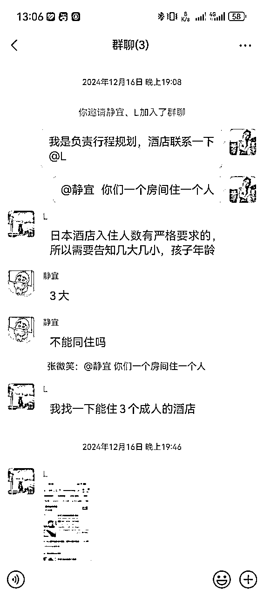

# 小红书旅游攻略 | 实战手册

> 来源：[https://shengcaiyoushu01.feishu.cn/docx/VYaIdm0JFoRGIexeeKqcng8fnwh](https://shengcaiyoushu01.feishu.cn/docx/VYaIdm0JFoRGIexeeKqcng8fnwh)

内容出品人：张微笑

手册出品方：生财有术团队

出品时间：2025 年 1 月 20 日

建议：如果需要快速定位到精确内容，可以使用快捷键 Ctrl + F/command + F 的形式，搜索「关键字/词」，查找你想要的内容

## 一、项目介绍

### 1.1 项目是什么

小红书旅游攻略项目，简单来说，就是通过在小红书截流，到微信成交旅游攻略，属于虚拟资料赛道的一种玩法，几乎零成本。

可能你会有点困惑，截流的方式是不是不太讲商业道德？

说实话早期的时候我也因为这个事情觉得自己的业务上不了台面。不过后来一个圈友说了一句话点醒了我：就是这个文章的作者他本身不是卖旅游攻略的，所以不构成竞争关系；其次如果一个作品下面的某一条评论一直有人在回复，平台也会认为这篇笔记是有价值的，从而对于作者也是有益的。

之前我还有过一个评论，底下有 200 多条回复求攻略的（现在找不到了）。

### 1.2 项目玩法

项目玩法非常简单：

注册个小红书账号，在小红书搜素“各个城市的旅游攻略”的笔记，通过在笔记下面评论引导私信，再引流到微信售卖定制旅游攻略。

旅游攻略分为通用版和定制版，通用版直接低价买入同行的资料，定制版借助 AI 生成就行。

这里面核心三点：

1.  如何找到“安全”的帖子进行评论。这一步决定了你的账号会做出了多大的流量。

1.  如何把客单价上去。后面我会分享一些销售技巧和产品组合。这一步决定了你通过这些流量最多可以变现多少钱。

1.  如果想做的更专业，后期还需要做朋友圈人设运营。

### 1.3 预期调整

这个项目客单价不高，赚点零花钱还是可以的，不适合适合想要赚大钱的圈友。

我入局的比较晚，是从 24 年 8 月份初跑通卖出去第一单，到 10 月国庆假期过后，累积变现了 2 万多。每天花费多少时间取决于你想挣多少钱。（会在后文解释这一句话）每天投入半个小时，一个小时，甚至更多都行。我自己前后 2 个月累计变现了 2 万元。

新手去做的话，一般建议前期每天投入一个小时，去评论 20-30 个作品就行了。之后你的流量会很多，你根据自己的时间去处理爆了的私信就行。

图片是加不完的微信和回不完的私信，所以你愿意投入多少时间去回消息，就有多少收益。

通过这种方式来的用户，不足以支持卖特别高的价格，后期慢慢上手以后可以适当涨价，但客单价最高一般不建议超过 70 元。

另外，还有 2 个信息，提供给圈友参考：

1.  做好可能废号的准备，建议大家拿新号去做。但其实按照下面的方法操作一般还好的。

1.  项目有淡旺季，可以先春节跑通，五一暑假国庆再集中精力搞波大的，日常也会有用户复购或者长尾流量进来。

希望大家认真阅读以上内容，对这个项目抱有正确的预期，想清楚再入局，否则很容易中途放弃，任何项目都是一样。

## 二、账号基础搭建

### 2.1 账号设置

新手前期建议 2 个新号就行（其中一个是引流号），太多账号容易触发小红书的风控，并且账号多了，其实你根本顾不过来。

账号注册好以后，可以每天刷 30-40 分钟的内容，养两天号，再去进行截流操作。

可以用家里长辈的手机号注册，因为他们自己也不用小红书，拿自己手机号注册，万一封了，你的电话号码也解不出来，账号也没办法注销掉。

账号包装：

包装成素人高能量小姐姐就行。整体的头像和背景都应该展现出来是一个阳光、爱生活、爱旅游的小姐姐。

### 2.2 发布图文笔记

是不是想问：我们不是做截流吗，为什么要发布图文笔记？

发布图文的目的只有一个，博主本人确实去这个城市游玩了，并且玩的很舒服。营造真实性。

所以，你们可以看到我自己账号发布的作品，数据并不是很高，大家不要在意这个，因为我们本质上并不是靠自己的作品去获取流量。

图文笔记的素材哪里来呢？

图片素材：

直接抖音或者其他平台搜对应的旅游城市的美景图，最好带人物的，背影即可，如果是正脸的话，会前后不一致，认为虚假。

这么做的目的是突出真实感。

然后去水印发布就行。我是用的微信免费去水印小程序“轻抖短视频实用工具”，点击里面的”去水印“模块就行。

文案素材：

这一块内容要求不高。

核心框架是；看的风景很好，住的很舒服，吃的也很有特色；

这个需要大家自己手动去写。

## 三、开始截流&引流（关键）

### 3.1 截流步骤

#### 先选择热门旅游城市

打开一个去哪儿旅行 app 或者携程等其他旅行网站，找到旅游专区，能够被单独放到首页展示的那么几个，就是当前最热门的（丽江，三亚，哈尔滨，海南等等）

建议大家去深度耕一个城市和其紧挨着的城市就行。

因为有些用户会选择一周把这个城市的周边也玩一下，例如青岛的话，他也可能会想去玩一玩周边的威海或者烟台。

并且你深耕一个城市的话，是可以和本地一些旅游项目（海钓，旅拍）谈合作，做他们的分销，那就不仅仅是只挣一份旅游攻略的钱。后面【六、拓展玩法】我会说一下如何去对接这些旅游项目商家。

#### 去小红书搜索关键词

搜索关键词：城市＋旅游攻略/＋三日游攻略/＋亲子游攻略/＋蜜月游攻略等等

#### 选择要截流的笔记

可以被选择的笔记标准：

第一、点赞高的，起码要一千赞以上

第二、作品发布时间越近越好

第三、评论区还热乎，就是评论区最好出现最近一天的评论

第四、注意避开那种作者回复评论多的，这种作者经常光顾评论区会举报我们（下图这个就是作者回复太频繁了）

#### 在笔记下评论

模板仅供参考：（不同城市可以做适当的调节）

案例 1

之前在威海上了四年大学，对威海的各个景点都了如指掌，需要威海旅游攻略的宝子们，可以滴滴，自己做了一份攻略。

案例 2

之前在青岛呆了七八年，对青岛的各个景点都了如指掌，前段时间刚做好一份攻略。

案例 3

上个月全家去了一趟青岛，临行前做的攻略，全都用上啦，需要的宝子可以滴我。

案例 4

前几天一家三口去了一趟青岛，我老公花了两天时间做的攻略，真的超详细，一点没让我踩坑。

案例 5

之前没有去过青岛，去之前联系了一个本地人，花点米让她给我做了一份攻略，真的超赞超详细，需要的宝子可以滴。

关于评论频率：

大家同一个话术模板要适当微调一下，再去评论第二个，模仿自然人刷小红书笔记去评论就行。

每隔 2-3 分钟评论一个，然后评论 10 个左右，休息一会。大概等 30 分钟左右重新搜素关键词寻找笔记去评论。

如果你的评论被官方吞掉，被作者删除是很正常的事情。评论就像是在平台遍地撒种子一样，可能你前期一天撒了 20 个种子（20 条评论），第二天接着撒。那么第三天你会收获第一天＋第二天的评论带给你的流量，它是有复利的。

### 3.2 引流方式

分享 3 个我自己用起来比较顺的引流方式（其中前 2 种我是直接用大号发的，第 3 种用到了小号）：

1.  把微信号打印下来，然后录制成视频发过去。

这里其实我踩了一个雷：就是这个微信号前面的小写 z，很容易被大家误认为是数字 2，这就导致很多人搜不到我。

这个方法大家做补充使用，建议还是以第3种方法为主。

1.  让对方发微信号，话术如下：

这个是比较安全的，但是有的时候对方发了可能会被吞，所以我们可以过一会儿问一下；宝子你发了吗。如果对方发不出来，那就我们这边发。

使用这个方法还需要注意一点：就是上述举例的话术模板，不要一次性用来连着回复10条左右的私信。可以休息1-2分钟，然后把上面的话术模板稍加修改（“宝子，这里没办法/不能够发PDF文件”）发送过去。

1.  专门在主页介绍里面去@自己的引流号，引流号去发布一篇藏有自己微信号的笔记。这样子即使被封了也是小号被封。

### 3.3 注意事项

补充一些实操中的细节：

1.  关于引流

我个人还是比较倾向于第三条（@自己的引流号），因为一个个复制微信号再去＋是个很繁琐的事情，不如等着客户去发起加好友申请。

1.  当对方在小红书上面问，是不是免费的，切记不要讨论价格，这样会被封号。因为你的私信数量很多，我的建议是大家直接放弃这个客户就行。

1.  微信号的设置方法

最好是 3～4 个字母 + 3～4 个数字，比如：adgm1234，mpt220

注意点：

*   字母跟数字不要 i、I、1、o、0、u、U，因为 1 跟 I 很难区分，0 跟 o 很难区分……难区分的，都不要

*   设置字母，尽量设置九宫格的首字母，比如 ABC 格子的 A，DEF 格子的 D，如下图

*   字母能小写就不要大写，很多人不知道大小写都不影响加微的

*   如果你做了矩阵，微信号也可以矩阵，比如 mpt220、mpt221、mpt222，比微信 mpt221 封了，用户着急，会自行加 1 或减 1，去加 mpt220 或 mpt222

这个方法很好用，来自生财航海教练@希平

1.  关于违规的提示

封号其实没那么严重，目前我遇到比较多的就是禁言 1 天或者 3-7 天，当然屡次被提示的话，就有可能被永久封禁，手机号也解绑不出来。毕竟是从平台免费获取流量。

那如何降低封号风险？

*   账号注册好以后，可以每天刷 30-40 分钟的内容，养两天号，再去进行截流操作。

*   我在方法2 举例的话术模板，不要一次性用来连着回复10条左右的私信，可以休息1-2分钟，然后把话术模板稍加修改再发送过去。

*   建议大家尽量还是选择上面的第 3 种引流方法来操作，安全系数高一点。

1.  错误示范

短时间内，一次性连着用同样的截流视频，回复了多条私信。

## 四、私域转化

### 4.1 微信聊天话术

微信转化的关键就是：对景点熟悉，体现专业性。

大家持续深耕一个城市就会对这个城市的大大小小景点，美食足够熟悉。从而展现出来一种专业性的魅力。

我直接给大家拆解一下我是如何谈的（成交率大概在 10% 左右）：

那种上来一看要收费，就删好友或者不搭理的也很多。大家不要在意，因为只要对方不删好友，我们就可以通过朋友圈营销，促使她有想去试一试了解的欲望。

其实没有什么很厉害的话术，刚入手的话建议大家给自己的定的目标是”今天先聊失败 30-40“个用户练练手，找找感觉。慢慢找到自己的销售习惯。如果我自己长时间没有出单，也会去思考是不是自己的话术该迭代了。

### 4.2 定价建议

我做的有 2 种产品，通用版和定制版的旅游攻略，交付和定价有些差异。

通用版：

这种就是拼多多上面搜”全国旅游攻略“，你可以花几块钱买到一个电子网盘，里面涵盖了大部分城市。

优点是交付速度很快，转发一下就行。

缺点就是这种就是电子垃圾，其实文档里面的资料很多网上或者小红书上面很容易搜到，容易被骂。

定制版：

这种我现在主要是用 AI（豆包）写的，参考拼多多/淘宝的定价，定制 20 元/天，就是客户要 3 日游攻略就是 60 元。因为我们是 AI 写的，所以基本上成本无限趋近于 0。

我们还可以把自己伪装成客户去和拼多多/淘宝商家聊，去把他们的案例模板拿过来，拿给我们的客户去做参考。

建议：

因为以上不管哪种交付方式，我们的成本都是 0 元，所以建议大家前期的定价 9.9 元，或者 19.9 元。先出单，拿到正反馈，跑通 0-1 树立信心，再去慢慢进行涨价。

### 4.3 朋友圈运营

朋友圈运营的作用也很重要，大家要去沉淀私域来做回购，那么你的朋友圈就是一个和用户触达的节点。

我之前踩过的一个坑：

就是总是喜欢群发做定制攻略的广告，这种可能你前几次群发会有效果，促使下单，但是长此以往，对方会将你拉黑删除，群发是一种很伤私域的行为，我们可以多多进行朋友圈营销。

朋友圈运营要从成交第一单，以及生活中遇到的趣事做起来，你在朋友圈展示出来的面应该是：

第一：你的销量还不错，很多人找你下单（必要的时候，可以自己的大号伪装成客户去和自己的业务号聊。制造销售的画面截图）

第二：你要发出来日常在销售和生活中的一些有趣的事情，让客户觉得你的朋友圈也不全是广告

我微信里有个销售。虽然我不买他的产品，他他广告意外的文案很有趣，所以我也没舍得删他。

给大家放几张我的朋友圈截图：

展示很多人找自己下单的

展示自己专业性的

展示自己有回购的

展示自己的生活很丰富，也是个有上进心的小姑娘

展示有孝心的（当时刚好要给妈妈买手机）

这里面有个点需要注意，就是大家在朋友圈展示销售业绩的时候，要记得把客户的头像和姓名进行打码，因为之前忙的时候忘记打码，被客户私信提醒了，搞得很尴尬。

## 五、怎么交付

### 5.2 如何采购通用版旅游攻略

这个直接淘宝上面搜素”全国旅游攻略网盘资料“就行，几块钱就能买到。

我也把我自己的网盘资料放这里，大家可以取用：

国内外旅游攻略合集

链接： https://pan.baidu.com/s/11IjLVXxHREJN61ttMfIPNA?pwd=1230 提取码： 1230

这里面可能会有部分城市没有，大家可以搜两篇相关城市小红书的帖子，提取一下文案和图片，拼接到一个 word 文档，转成 PDF 进行交付就行。

### 5.2 如何用 AI 写攻略

用 AI 写攻略的工具就是：去浏览器搜“豆包网页版”（纯免费）

提示词：

围绕【身份、背景、目标、限制】展开提问即可。

因为 AI 不能说一次性生成的结果就让我们满意，所以大家可以多提问几次，让 AI 去做调整。

我给大家看一下我自己的提示词：

附提示词参考（文字版）：

假设你是一个精通青岛的本地旅游顾问：

现在我们想去这个城市游玩。以公共交通为主帮我规划本月 11 号，12 号，13 号，14 号，15 号期间 5 天的行程。每天的游玩项目不低于 4 个，且不能重复。

我住在五四广场地铁站附近，

动物园和海洋馆我们不去。

我想体验一下小麦岛赶海，参观海军博物馆和啤酒博物馆。晚上去第三海水浴场看灯光秀，需要你帮我规划在内

帮我推荐沿途吃中午和晚饭的地方

再帮我沿途推荐 2-3 个可以吃特色海鲜的门店的。

需要你说明一下景点的开放时间，价格，以及是否需要预约。

各个景点之间的交通路线时间。

各个景点的游玩攻略以及如何拍照打卡。

按照以上我提出的需求。请按照以上描述规划一条游玩景点的旅游攻略。

基本上每个城市都会有博物馆，海洋馆，动物园等。各个城市大同小异，我们可以在和客户沟通初步方案的时候，顺嘴问一下，这些地方去不去。除非是像重庆这样的动物园有独有的大熊猫。

AI 不可能每次写的都很满意；那么我们只需要找出问题点，进行提问，让他进行补充即可。

定制攻略需要涉及到一块内容就是帮他们找找酒店；这个的话大家利用美团找个评分在 4.9 左右的就行。然后把酒店链接分享给用户就行。

至于酒店的地理位置，大家按照下面这个步骤去选就行，还有就是酒店找好以后，把位置告诉 AI，让 AI 根据这个位置去规划行程路线。

注意哦，这里不是代定酒店！

美团的操作步骤如下：

1.  选择入住城市和时间

1.  位置距离找热门的推荐的就行

1.  选择评分 4.7-5.0 之间，参与评分的用户比较多的就行

选择入住城市和时间

位置距离找热门的推荐的就行

一般选择评分 4.7-5.0 之间，参与评分的用户比较多的就行，然后复制酒店链接，分享给用户。

做了这么久我发现一个事情，用户自己在网上找酒店一个小时，找不到，

你随便花一分钟给她一个，她都会容易接受。

就是他们都有一个心理，就是好像其他人找的更靠谱，更何况你还是定制旅游专家。

## 六、拓展玩法

一个客户在旅游途中会产生多种需求，那么我们可以顺手去赚一些沿途的钱都很正常。

例如：代定机票（单价 800 以上），代定酒店（五星级），部分沿海城市的海钓，甚至还有地陪。

大家在与客户的交流中，可以适当问一句需不需要以上服务。

这些项目都是高客单，我们都是可以提供精准的用户，所以我们找到对应的商家让他们把一单客户的利润分我们五成左右都行，前期先依附这些商家，少挣也是挣。

然后怎么寻找商家呢？

我是通过小红书或者闲鱼上面去搜素”青岛海钓“”青岛地陪“就行，然后闲鱼上搜”代定酒店“”代定机票“。然后的话可以多加几个商家去做对比。

怎么和商家合作呢？

因为代订酒店和机票需要一直查询或者垫钱，我一般都是直接拉了个商家，客户和我的群，我在群里看他们的交涉，我自己是不垫钱的，事成分我们佣金就行。

以下是我做青岛海钓分销的交易截图：

↑ 如图所示，我这边给船长（商家）600 元，右边实收用户 800 元，轻松赚了 200 元。

下面代定酒店和机票的群聊天截图：

关于代定酒店的资源，大家可以在星球上搜一搜相关的资源对接或者精华文章。

以上就是全部内容啦，这个项目整体是很容易变现的，只要执行就行。你的私信就会爆，丝毫不考虑运气成分。一分耕耘一分收获。

