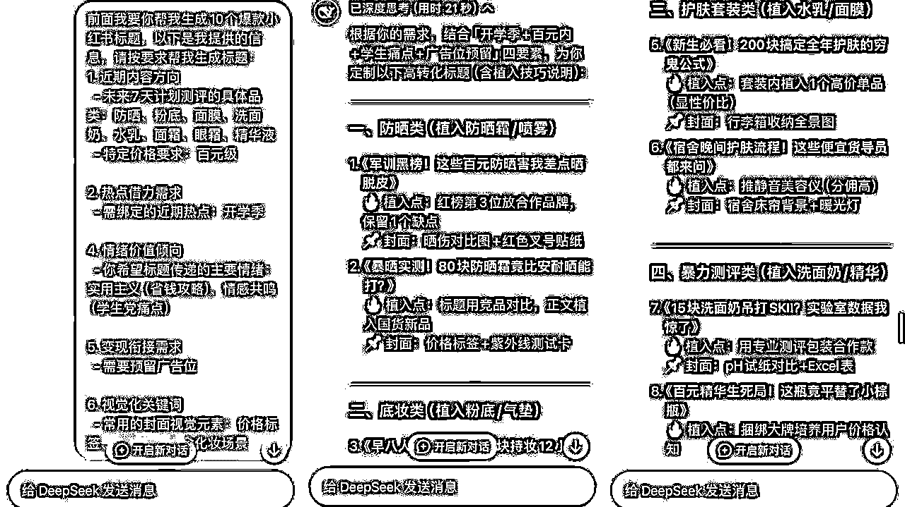

# 只需 1 个指令，教会你用DeepSeek做小红书！

> 来源：[https://p03a4vs9s2.feishu.cn/docx/VbtOd5xF0o0qZfxyu14cWQZhnsR](https://p03a4vs9s2.feishu.cn/docx/VbtOd5xF0o0qZfxyu14cWQZhnsR)

DeepSeek 已经火了一段时间了，刚火没多久的时候，我就用了一下，效果直接惊艳到我了

这几天每天都在用deepseek，实话说，我已经离不开deepseek了

哈喽，我是叁斤，公众号：叁斤

你用AI写文案，是不是怎么写都不对味？要喂信息给AI，也不知道怎么喂，怎么给具体指令？

我用deepseek这几天，就研究了一套话术，用好了就能让AI帮助你做好小红书，真的就只需要一套话术

这个话术写了不少的小红书文案，效果都很不错，大部分都可以拿来直接用了

指令超级简单：

让 AI 告诉你，要完成某个任务的话，需要提供什么信息给它

接下来我会用一个个具体案例，手把手教会你怎么用好这套话术：

# 利用AI规划账号

如果是刚开始做小红书，可以利用deepseek做账号规划，在开始之前让AI规划之前，需要先明确：

账号运营方向：让deepseek的方向明确一些

变现方式：常见变现方式有广告、卖货、直播带货、私域导流，确定自己的变现方式

比如我只知道自己想做测评博主，想通过接广告变现，就可以这么提问：

我想要做一个小红书账号，通过接广告变现，我看测评博主接广告很多，价格也很高，想往测评博主方向走，但我不清楚要怎么开始，我需要你帮我做详细的账号策划、运营方案，并给出具体执行sop和时间表。为此，你需要我提供什么信息？

核心是让deepseek告诉你，做账号规划需要哪些信息？

如果没有运营基础的，到这一步只需要按照 deepseek 给的提示去提供信息就行了，直接让 AI 指令变成傻瓜式的选择、填空题

实话说，我看了很多AI指令技巧，只有这个“反问AI”的话术是最省时省力省脑子的，没有任何指令基础也能上手。而且也试过很多AI工具，豆包、kimi、gpt（基础版），用这套话术都没有那么好效果

有自媒体基础的话，可以在deepseek提供信息的基础上，增加一些信息。比如：加入人格化信息、用户价值定位、视觉定位等等

按要求提供信息给deepseek之后，就会生成一个完整的账号运营方案：

为了写这个文章，以上信息全部都是按deepseek的提示填写，没有加入任何小红书运营技巧的提示

可以看到，deepseek从账号定位、人设包装、差异化策略、冷启动规划、变现路径、执行工具包、内容模板和30天执行表、对标分析框架等等，全部都给的非常详细

由于内容太长，就不放完整的方案了，感兴趣的小伙伴自己按提示词去操作一下！

# 选题搭建

账号规划确认好后，要开始搭建选题库，以及让deepseek提供选题规划

虽然账号规划里已经有了一些选题方向和基础选题库，但前面提供的信息还比较有限，不够详细

到这一步，如果没有运营基础的话，肯定不懂选题逻辑、竞品分析、用户痛点挖掘等方式，按常规的提示词可能生成不了很好、很贴近账号定位的选题库

所以还是继续问它：

如果我要你帮我搭建选题库、选题规划的话，需要我提供什么信息给你？

把自己不懂的东西，让AI告诉你。把需要动脑子的东西，变成选择题、填空题

接下来就跟前面一样，按照deepseek给的信息，做填空题、选择题就行了，写完之后提供给deepseek，就能按要求生成完整的选题库，包含了多个场景，比自己做的选题库还完整

到这一步我还发现一个意外收获：

deepseek给我提供了效率工具包：测评数据记录模板、爆款标题库excel、样品采购清单、30天起号执行表……

由于内容长度原因，不展示全部，感兴趣的可以根据提示词按顺序问

完成这一步，就已经有了很完整的sop了，按照选题库一步步去做内容就完事

# 爆款标题

发现没有，在选题库里已经有很多爆款标题了，每一个标题都很不错，拿来就能用

如果你觉得不够，或者你只需要deepseek给你写标题的话，一样可以问它：

我需要你帮我生成10个爆款小红书标题供我选择，为此，你需要我提供什么资料和信息？请详细说明

由于我是没有固定选题、固定内容让deepseek写标题，所以给的信息会多一些

如果是有固定内容的，会比这个内容更简单一些

按要求填写后，deepseek给我生成了10个爆款标题，而且还分好类了不同产品、不同类型都有对应的标题

当你确定好选题再问它，给出的标题就更精准

通常deepseek会给出很多的标题，所以发布时有足够的标题做 AB 测试，同一内容换不同标题分时段发布，分别测试「冲突型标题」和「解决方案型标题」的标题（举例），看看哪个点击率更高

将高互动标题元素拆解重组，或者以后让deepseek按同样的风格做选题，就能保持将来笔记的标题统一性

# 笔记生成

文案内容是最重要的内容，大部分人用 AI 也是为了解决文案问题

实话说，从gpt出来后我用了很多的AI工具，现在市面上热门的工具都用过，生成的内容都很一般，喂养过程太麻烦了，所以使用率很低

但deepseek出来后，现在写小红书文案几乎离不开了

与前面一样，我会站在新手的角度给提示词，只需要问它：

现在这个账号是从0起步，没有基础，所以前期我需要涨粉，达到小红书接商单的门槛。为此，我需要你帮我写一篇小红书文案，除了前面的账号规划、选题和标题等信息外，你还需要我提供什么信息？

比之前的多了一些内容，我会讲明白账号没有基础，目标是涨粉，让他根据这些需求来规划

不懂运营、不懂内容的新手，只需要按要求给出信息就可以

即使是专业测评，deepseek也能生成不错的内容框架

比如前面这个，给出的内容就很全面：

连封面排版、封面文字、标题（还规避了敏感词！），在出内容的时候，还会提示跟图片配合，比如测试维度里，会提示：配擦拭对比图、用水分笔试拍、对比图贴危险标签……

后面还给出了执行提示、数据优化重点、评论区运营指南、互动钩子等等，这个内容真的比运营总监给的建议还全面

前面这个内容还是复杂了一些，还要求配图啥的，不能直接复制使用，这是因为测评内容的特殊性，以及我是为了写文章，没有具体的内容提供给deepseek

如果有具体方向、具体选题的话，deepseek生成的文案是很优秀的：

比如我给光腿神器产品写的，前面提示词是一样的，问它需要提供什么信息，再按要求提供就行，剩下的就等deepseek生成就行

以上，就是完整的DeepSeek做小红书攻略，你会发现，全程只需要一个提示方法：让 AI 告诉你，要完成某个任务的话，需要提供什么信息给它，然后按要求提供就行

把需要动脑子的事情，变成简单的选择题、填空题，真正实现让AI自己规划小红书账号！