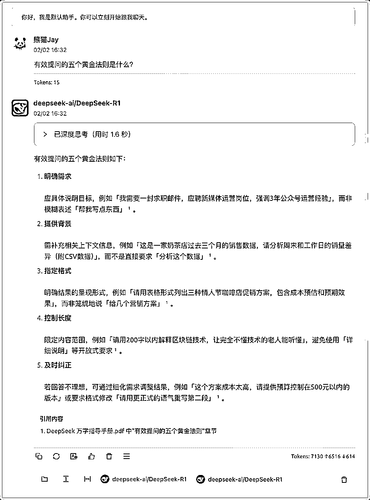
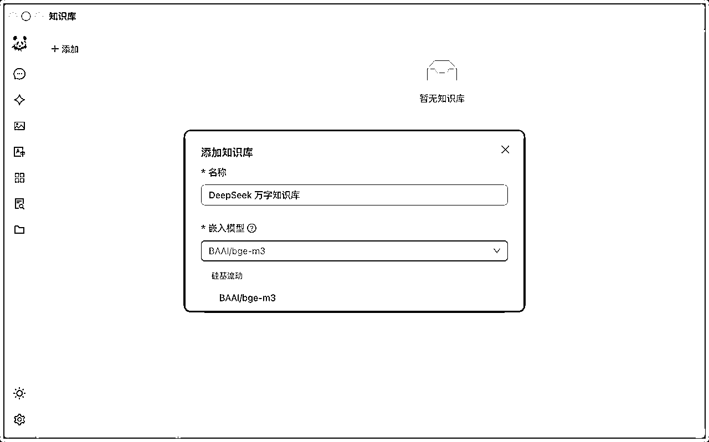
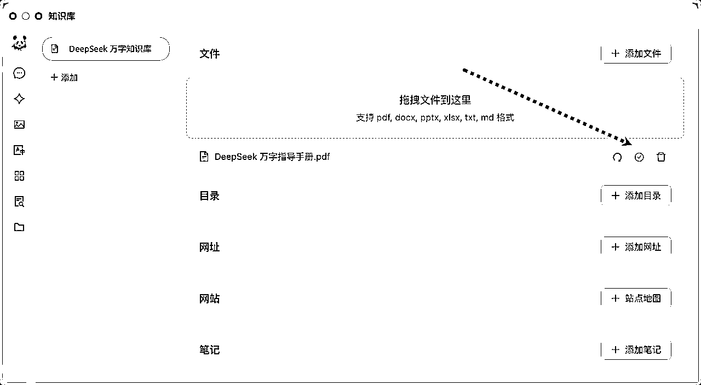
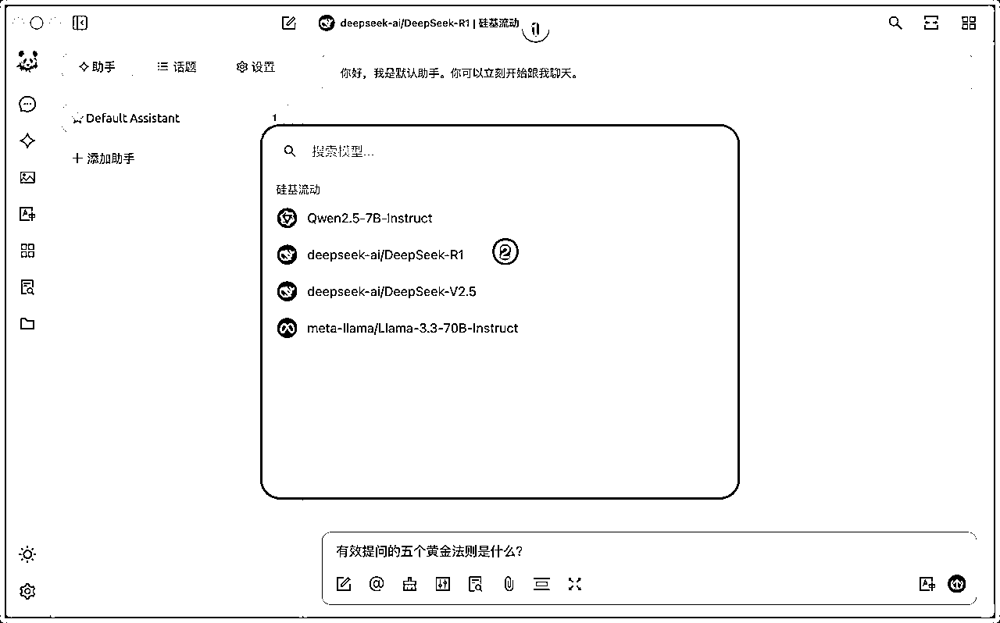
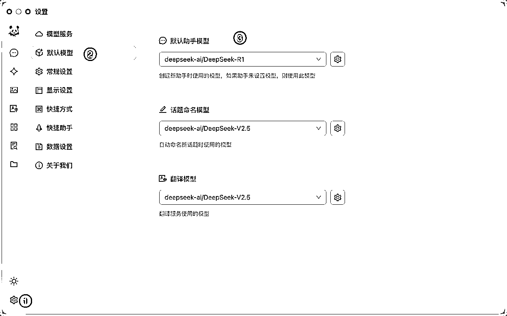
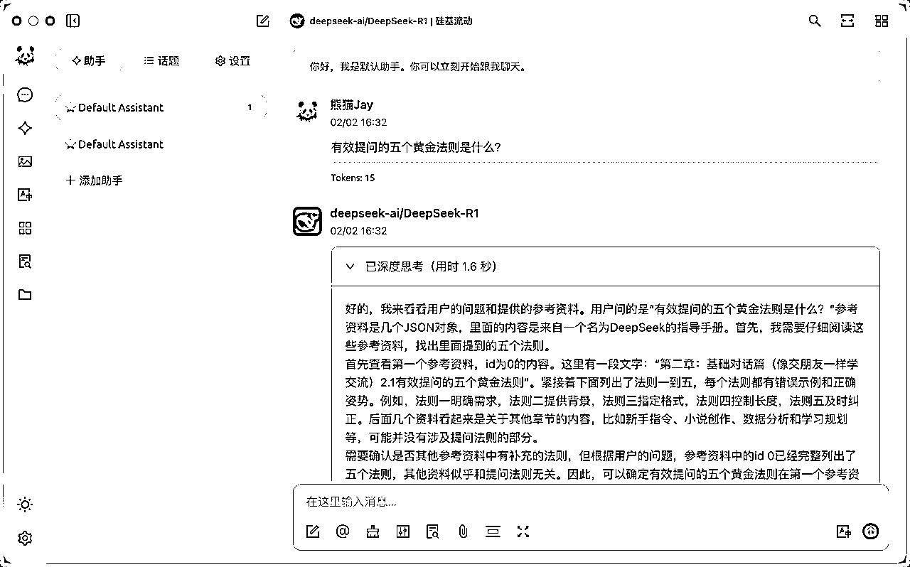
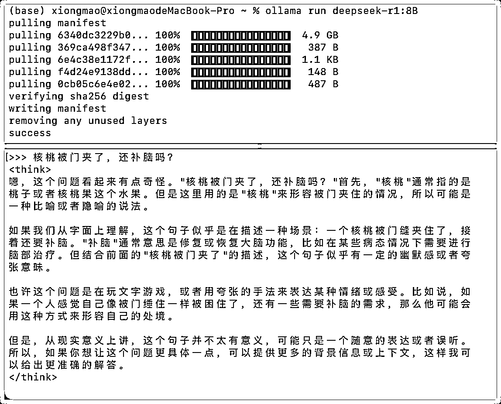
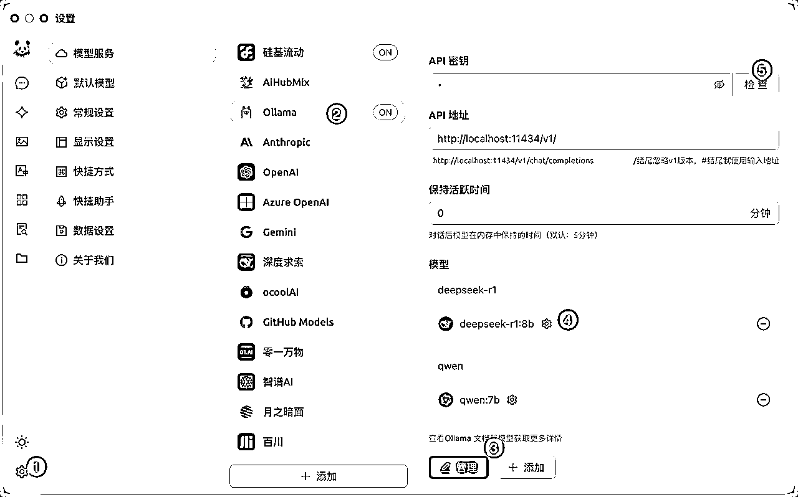

# 5分钟用满血 DeepSeek R1 搭建个人 AI 知识库（含本地部署）

> 来源：[https://zzi7a49xoa.feishu.cn/docx/DZ0ydDEkgohZqXx5GgocReSLnLf](https://zzi7a49xoa.feishu.cn/docx/DZ0ydDEkgohZqXx5GgocReSLnLf)

最近很多朋友都在问：怎么本地部署 DeepSeek 搭建个人知识库。

老实说，如果你不是为了研究技术，或者确实需要保护涉密数据，我真不建议去折腾本地部署。

为什么呢？

目前 Ollama 从 1.5B 到 70B 都只是把 R1 的推理能力提炼到 Qwen 和 Llama 的蒸馏版本（学生模型）上。

虽说性能是提升了不少，但跟原汁原味的 R1 模型比起来，还是差太多了。

官方的满血版本可是 671B 的参数量，说实话，对普通人来说想本地部署，这成本确实太高了。

不过我最近发现了一个平台，不仅能用上 R1 本 1，还提供了不少免费额度。

此外，为了让拥有算力的朋友可以本地部署，我也提供了相关教程。

看完全文，你会收获：

1.  满血 DeepSeek R1 模型 API 搭建个人知识库

1.  本地部署 DeepSeek R1 模型 搭建个人知识库

## 一、个人知识库使用效果（满血版）

来看几个使用案例：如何借助 个人知识库文件 作为外脑，用方法论指导我们正确做事？

DeepSeek 确实很好用，但关键还是会不会提问。

如果不会提问，AI 再强也帮不上忙。

除了花时间学习提示词，更快的方式是本地备一份提问指南，让 AI 指导你该怎么正确提问，这样才能真正发挥它的价值！

AI 借助知识库内的 DeepSeek 指导手册，预判了我可能想问的问题，以及建议的正确提示词格式。

从回答中可以发现，AI 不是依据自身语料库回复，而是基于知识库内容回复。

当然，我们也可以直接搜索知识库的原始信息，从而快速查询信息。

## 二、API 搭建知识库

如果本地数据不涉密，还想获得最佳使用效果，那肯定得选满血的 DeepSeek R1 模型。

我们来看看怎么利用 API 用上满血的 R1 模型（671 B）。

1、先下载一个叫 Cherry Studio 的软件。

地址： https://cherry-ai.com/download

2、登录/注册「硅基流动」，新用户会赠送 2000万 Token 额度。

地址：https://cloud.siliconflow.cn/i/TAAOvaXg

3、来到 API 密钥生成界面，创建或者复制已有的密钥。

4、来到 Cherry Studio，配置 API Key。

5、在模型广场首页，排在前两位的就是「硅基流动」和「华为云」合作发布的 DeepSeek R1 / V3 模型。

如果需要推理能力，记得打开并复制 R1 模型的名称。

6、在模型服务的硅基流动下方，添加 R1 模型。

7、记得点击检查，测试下 API 是否可以正常访问。

8、现在对话模型有了 R1，还缺少一个嵌入模型。

嵌入模型的主要作用是将本地文件的内容转换成有意义的数字，存储到向量数据库中。

在用户提问时，利用 RAG 技术在数据库中搜索到相似答案，最终回复用户。

过去我有通俗解释过 RAG 技术，大家如果不了解，可以回头看下：

我们再配置一个向量模型：BAAI/bge-m3，如果希望搜索的精准度更高，可以选择 Pro/BAAI/bge-m3。

按照同样的方式配置到 Cherry Studio 中，这里不需要点击检查。

9、在 Cherry Studio 创建知识库，选择刚才配置的嵌入模型，这样就会自动利用对应的模型来向量化数据。

10、上传本地文件进行向量化。

如果本地 PDF 文件是 扫描件、手写件，或者带有复杂的表格 和 数学公式，解析效果会很差，甚至无法解析。

遇到这种情况，建议配合过去我介绍的 PDF 转结构化文档 的方案来使用！！！

这样才可以正常回复知识库的内容：

如果追求执行比，推荐使用 Doc2x：https://doc2x.noedgeai.com?inviteCode=4A6KOD

如果希望更加稳定，那么可以考虑 Textin ：https://www.textin.com/market/detail/pdf_to_markdown

当我们上传文件后，箭头指向的图标如图所示，则代表向量化成功。

11、测试使用，这一步添加助手，并选择刚配置的 满血 R1 模型。

如果不想每次在添加助手时选择模型，可以将它设置为 默认模型。

我们来测试一下，发现 DeepSeek 已经开始深度思考了。

AI 回复的答案和原文一致。

原文内容：

## 三、本地部署搭建知识库

如果只是想 简单体验，或者本地算力充足、希望保护数据安全，那么可以考虑 本地部署 的方案。

1、访问 Ollama 官方地址：https://ollama.com/download，下载软件。

建议下载最新版本 Ollama，个人踩坑经历：旧版本安装 R1 后可能无法正常使用。

2、双击运行 Ollama 后，打开命令行，运行需要安装的模型（参数越大，显存要求越高）。

地址：https://ollama.com/library/deepseek-r1

如果没有 GPU，建议选择 1.5B，运行相对轻量。我这 4G 显存 勉强能跑 8B，但速度较慢。

有朋友用 RTX 4090 测试 32B，效果和速度都不错。大家可以参考这个梯度，根据自己的硬件选择合适的模型。。

下载并运行成功后，就可以和 DeepSeek R1 对话啦。

当然，我们可以用 Cherry Studio 作为本地 R1 模型的 UI 界面。

打开软件的配置，选择 Ollama，在管理按钮中选择自己部署的模型。

如果选不到，就手动添加模型，API 秘钥填不填无所谓）

最后点击检查，测试下网络连通性，出现连接成功即可。

接下来就可以在添加助手时，选择本地部署的 R1 模型啦。

再测试使用一下，答案与原文一致，搞定~

因为我用的是 Mac，所以没测试 Windows 设备。不过两者区别不大，大家可以自行尝试下。

## 四、总结

看到这里，相信你已经找到最适合自己的 DeepSeek 个人知识库方案了。

如果你和大多数人一样，选择使用官方 API ，那就不用再为性能和本地硬件资源发愁；

如果你恰好有充足的算力和技术储备，本地部署也是个不错的选择。

不过，在整个过程中，我想和你分享的不仅仅是这些技术细节。

而是一个中国团队能做出世界级大模型，一个需要 +86 才能注册的大模型。

很庆幸，我们能作为中国 AI 领域技术进步的见证人。

当然，暂时的领先不是终点。

但 DeepSeek 给我们带来的，是“中国也可以”这份信心。

这，才是我们真正要守护的希望。

我是 🐼 熊猫 Jay，希望本次分享能有所帮助。