# 0编程经验，我如何借助Cursor搭建AI出海工具站赚美金

> 来源：[https://tjvomspfav.feishu.cn/docx/WTAxda5tRoC2ZVxCmgtcJiNsnlc](https://tjvomspfav.feishu.cn/docx/WTAxda5tRoC2ZVxCmgtcJiNsnlc)

大家好，我叫阿西，一个互联网运营er，0编程经验学习Cursor搭建出海工具站，工具站上线半个月获得用户付费，实现网站盈利。我同时也在即刻、推特、小红书运营出海内容相关的账号（名称：阿西_出海），分享出海、AI相关内容，输出多篇爆款热帖，被即刻官方推荐，在推特平台多篇阅读量破万。

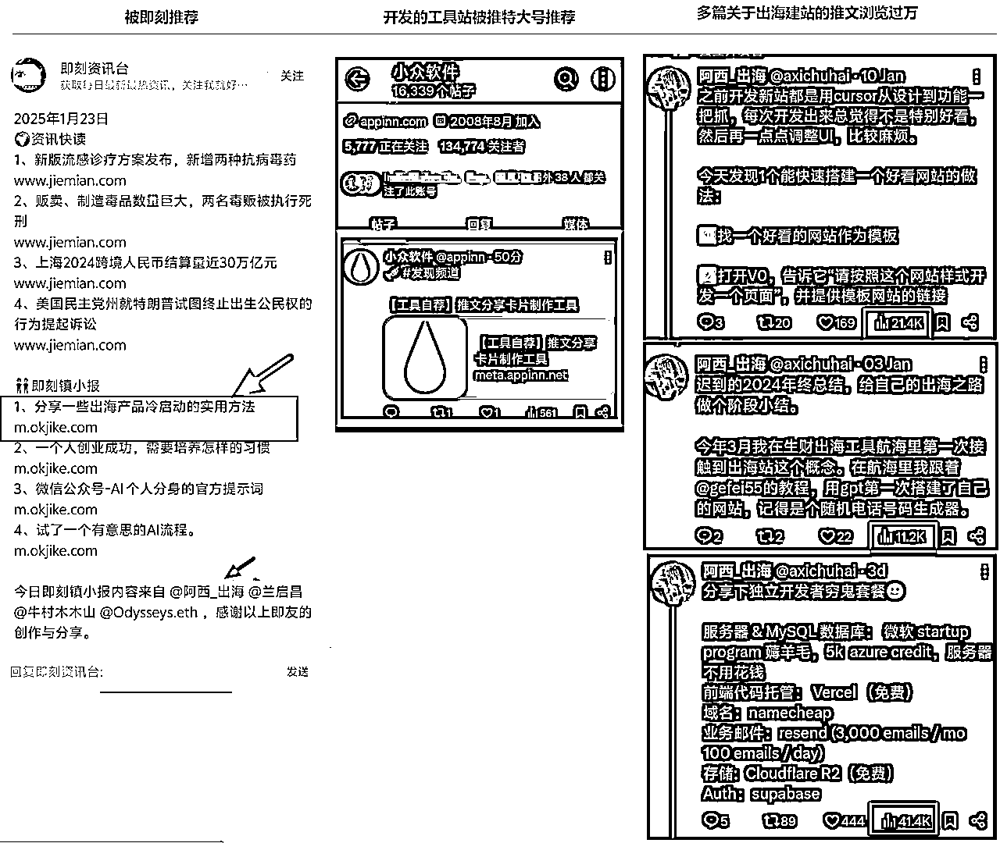

先分享下我做AI出海工具站的起因，去年3月我在生财的AI出海工具站航海里第一次接触AI编程的概念，在此之前我是一个0编程经验的小白。我从去年下半年开始通过Cursor开发出海网站，先说一下目前的小小成果，5个月的时间通过业余时间开发了6个网站，包括游戏站、工具站、导航站，其中工具站已经实现正向盈利，每月都有持续收入，实现了出海赚美金，另一个工具导航站上线一礼拜单日UV突破200，稳定每天带来流量。

我每月都坚持上线1-2个站，不断练习手感，目前我在1小时内就可以通过Cursor完成一个简单的AI工具站开发、部署。

这次给大家分享的是我在去年国庆期间开发上线的AI工具站AI Answer Generator，上线半个月网站有了用户付费，接到付费消息那天很激动，虽然金额不大，但是是第一次赚到美金，并且得到了用户的认同。

给大家展示下网站界面，功能非常简单，是一个AI问答生成器，目标用户是从事营销工作的人员，为他们解答关于营销方面的问题。

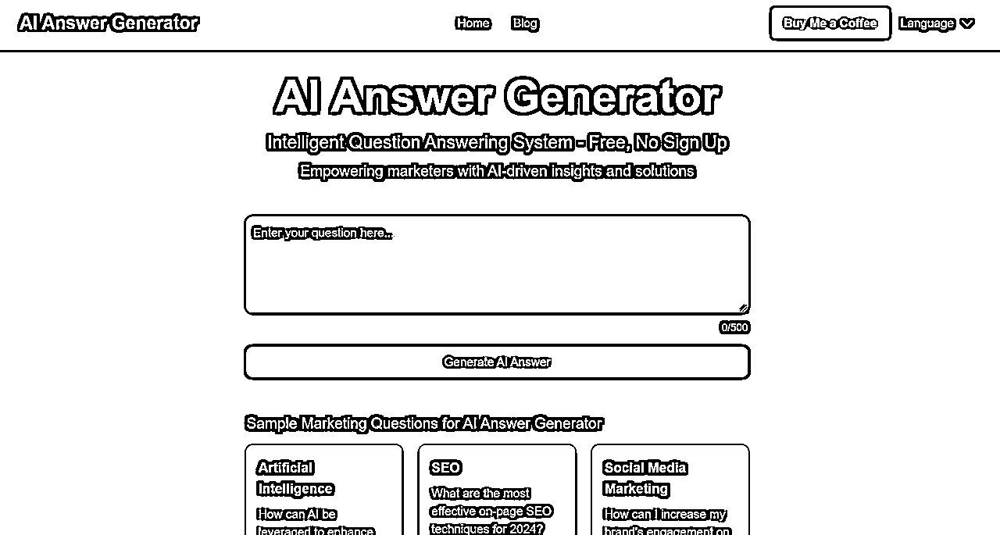

因为当时做过的网站不多，在页面设计上不是很熟练，所以网站的美观度欠佳，现在再做一遍的话会做的更好看一些，毕竟网站颜值高也能提升用户的喜爱度

接下来我会详细介绍一个0编程经验的新手如何从0-1通过找对标、挖需求、借助Cursor搭建网站的全流程，文章结构如下：

1.  为什么做这个网站

1.  找到对标并分析

1.  如何通过cursor开发、上线

1.  如何冷启动

### 1、为什么做这个网站？

在出海工具站的航海中，我了解到可以通过SEO的方式给网站获取流量，大致流程是先找低SEO优化难度、高搜索量的词，了解这个词背后的用户需求，然后围绕这个需求去开发网站，不断优化网站的词排名，从而获取谷歌的搜索流量。

#### 找词

那么，如何去找这样的词呢？

可以通过词根去找，比如XX generator，这里的generator就是一个词根，这个词根背后对应的就是用户的工具需求。比如国外用户想做二维码，就会去搜“qr code generator”，想取名字就会搜“name generator”。像generator这样的词根还有很多，比如Creator、Guide、Maker、Editor等，平时可以多积累这类词根。

有了一批词根以后，接下来我先去找有潜力的词，在谷歌趋势里查词根衍生出来的关键词里有没有飙升趋势的词。

#### 筛词

我在“generator”这个词根下发现了“ai answer generator”近期流量上涨，但是通过跟gpts对比流量后判断这个词日搜索量只有500左右，不是很大。

这里介绍下怎么判断流量：可以跟在谷歌趋势里把目标词跟gpts这个词对比判断流量，一般gpts日UV是2500，如果趋势里显示目标词的量级是gpts的2倍，那么目标词的日UV就是5000。下面截图里可以看到“ai answer generator”量级只有gpts的1/5。

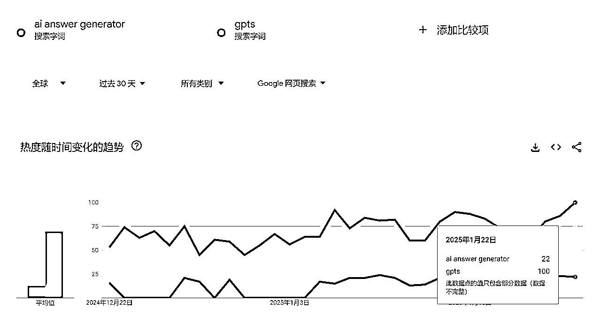

虽然这个词量级小，因为我当时作为新手只是想先找个词然后上站练手，想的是一般小词竞争小适合新手做。于是我继续查这个词的难度，用的是ahrefs查询。果然这个词的难度很小，只需要4个外链就能排到前10名。

附上提到的2个工具网站地址：

谷歌趋势：https://trends.google.com/

ahrefs：https://ahrefs.com/keyword-difficulty

看来这个词非常适合新手练手，不过这时我还不知道这个词背后的需求是什么，技术实现难度大不大。

于是我在Google搜索了下这个词，发现排名前4名的网站里只有一个网站是首页在做这个词的，别的网站都是首页在做，也就是说不是他们的主营业务。那么我拿整个网站来跟他们竞争这个词，就比较有优势。

接下来点开排名第一的网站，我发现这个词背后对应需求是解答用户的提问，可以通过AI实现。于是我向claude提问如何在网站里实现AI问答，回答是可以通过对接api接口，有免费的方案。

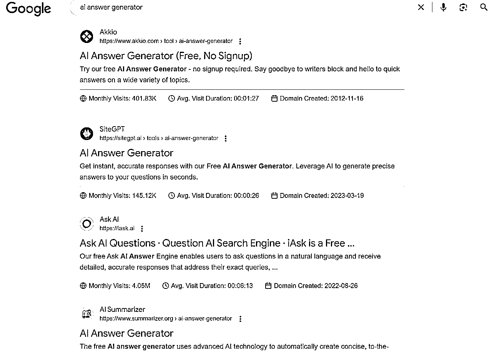

到这里为止，我发现这个词虽然流量不大，但是难度低，竞争小，并且实现难度也不大，而且实现成本为0，于是决定拿这个词来建站练手。

### 2、找到对标并分析

#### 功能分析

我找的对标是这个词在Google搜索下排名前2名的网站，就像亦仁说的，抄作业就要抄学霸的。分析竞品这块分享个方法，可以先交给cursor来进行初步分析，分享下我的prompt：

我现在要基于“XXXX”这个关键词搭建网站，你先不要写代码，先和我讨论网站的框架和功能：

1、请你基于这个关键词下的主要竞争对手分析用户需求、网站需要哪些内容

网站1链接

网站2链接

2、确定网站功能，哪些功能一期做，哪些二期做

3、页面区块确定：页面区块要如何布局

然后可以让cursor把它回复的内容保存成一个.md文件，放在代码文件夹下，方便后续功能迭代时cursor可以通过这个文件快速理解。

通过cursor的分析，我了解到网站核心功能就是用户输入问题，由AI生成答案。排名第一的网站akkio主要业务是给广告公司的营销业务提效，AI生成问答是他们网站下的子功能，面向的对象也是营销人员，解决营销工作上的问题。

这有个好处就是给功能设定了目标人群，切了一个细分群体，虽然小众，但是能做到这个细分的头部也有不少流量。不然就是个谁都能用的AI问答，那么它对应的竞品就是所有AI对话工具，包括gpt，那竞争可就太大了。所以我学习这个网站的做法，把我的网站也包装成了营销问答工具网站。

#### 流量分析

这里我用semrush对两个对标网站进行了流量分析，先来看akkio：

##### 分析流量来源

先看流量分布，直接流量和自然搜索流量基本各占一半，也就是说一半的用户是直接打开网站，可能是老用户，一半的用户是在搜索引擎搜索关键词找到这个网站的，还有10%左右是引荐流量，一般是做外链（后文会具体说外链怎么做）、社媒推广带来的。

主要来源这里可以看到搜索流量主要来自Google，也有一小部分来自Bing（微软推出的搜索引擎）：

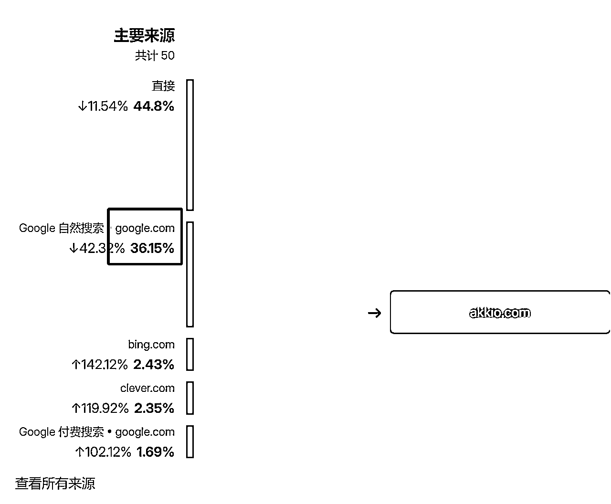

##### 分析搜索流量

接下来继续看它的搜索流量是哪些关键词带来的，虽然我们要做的关键词是“ai answer generator”，但也可以学习竞品通过哪些词在获取流量，加到我们的网站里作为长尾关键词。

可以看到akkio的主关键词是“question ai”，每月带来246k搜索量，折算到每天就是8200（真的流量很大），不过查了下关键词难度是Hard，于是放弃。接下来排第二、三的关键词分别是“ai answer”、“ai answer generator”，发现“ai answer”难度也比较低，可以加入我的网站里一起做。

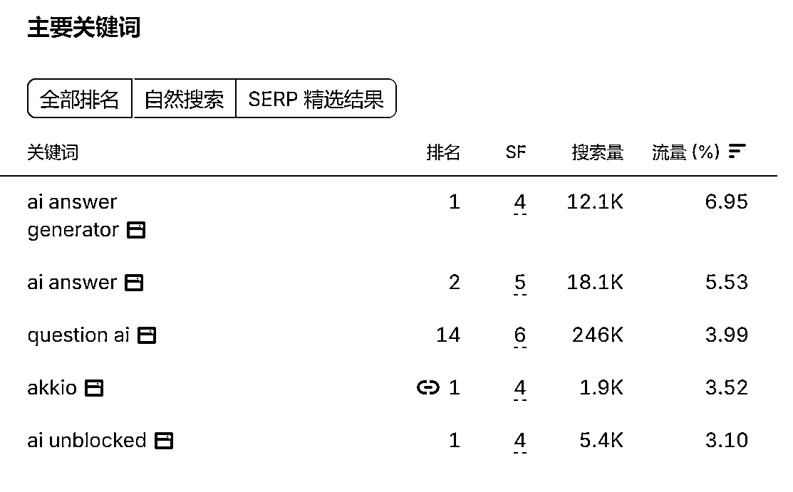

##### 分析外链来源

这一步是看akkio做了多少外链，来看能否有机会超越它。

这里可能有人问为什么要做外链？

解释一下，外链的作用一是能提升网站权重，相当于有别的网站给你背书，另外是能给网站带来流量

发现它的外链有2.9万个，非常夸张，看来超越它的可能性比较小。不过可以抄它的外链，也就是说它给哪些网站投递了外链，我也可以去投递。semrush这里也列出了它所有目前有效的外链地址，一键导出就可以作为我的外链库。

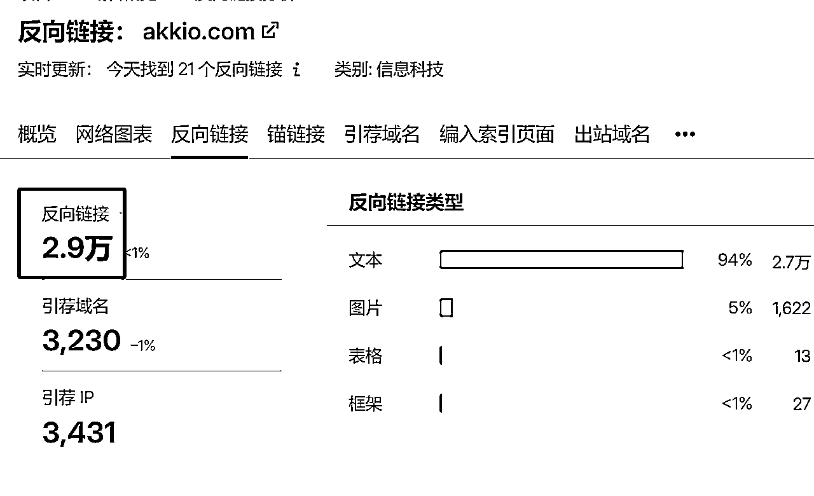

第二个对标网站我也是按照以上分析流量来源、搜索流量、外链来源这三个步骤去分析了一下。

到目前为止，我已经通过分析对标网站知道了我的网站要做哪些功能、布局哪些关键词、要去哪些地方投放外链，准备工作就绪，开始正式开发网站。

### 3、如何通过cursor开发、上线

##### 页面布局

我在前面提到我让cursor帮我进行了功能分析，列出了一期要做的功能和页面布局，接下来我的prompt是

根据上面你所说的竞品分析结果帮我搭建网站，使用Next.js框架实现。

你需要围绕着关键词“ai answer generator”去写页面内容。 我希望你能够写一个 SEO 友好的页面，要求配色简洁清晰漂亮，有落地页的常见 Section，页面整体单词数量大于1000个，核心关键词 的密度在3%左右。

这里解释下为什么要用Next.js框架，因为用这个框架有非常多好看的UI库。不过缺点是需要部署安装依赖，会有些麻烦。

cursor写完代码后我继续提问：

如何能在本地看到页面效果？

回复需要安装依赖。可以在cursor功能栏点击“终端”，“新建终端”，然后在终端里输入“npm install -g pnpm”开始安装依赖。安装过程中遇到什么问题，把报错信息发给cursor即可。

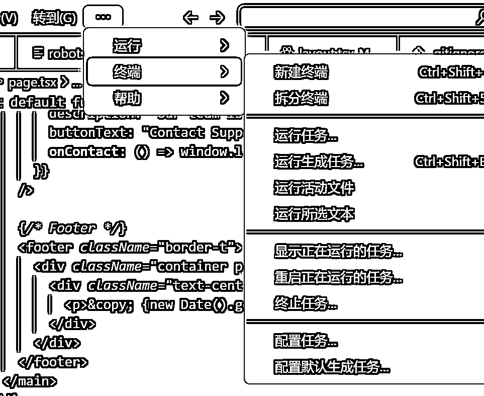

安装完成后在终端里输入“npm run dev”，然后在浏览器里输入地址“http://localhost:3000”，就能看到网站基本的样子出来了，首页分为导航栏、核心功能区（问题输入框、答案输出区）、网站优势、FAQ、footer。

##### 核心功能开发，对接AI接口

接下来开始开发网站最重要的功能——AI问答，这里需要调用AI模型接口实现。因为现在还不确定网站是否能赚钱，所以先用免费接口，我用的是https://openrouter.ai/的接口，里面可以选择免费、付费的api，像下图这种标着“free”的就是免费api。

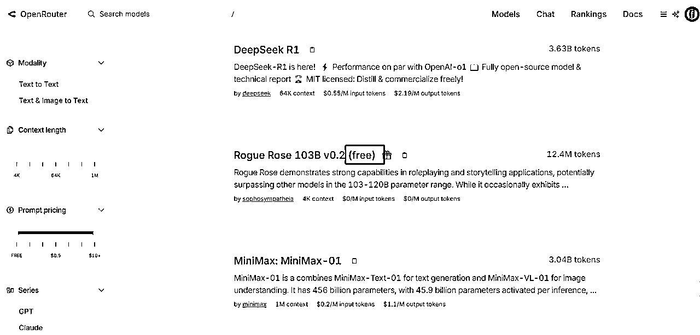

接下来的步骤：

第一步：找到openrouter的接口文档，再找到自己的api秘钥：

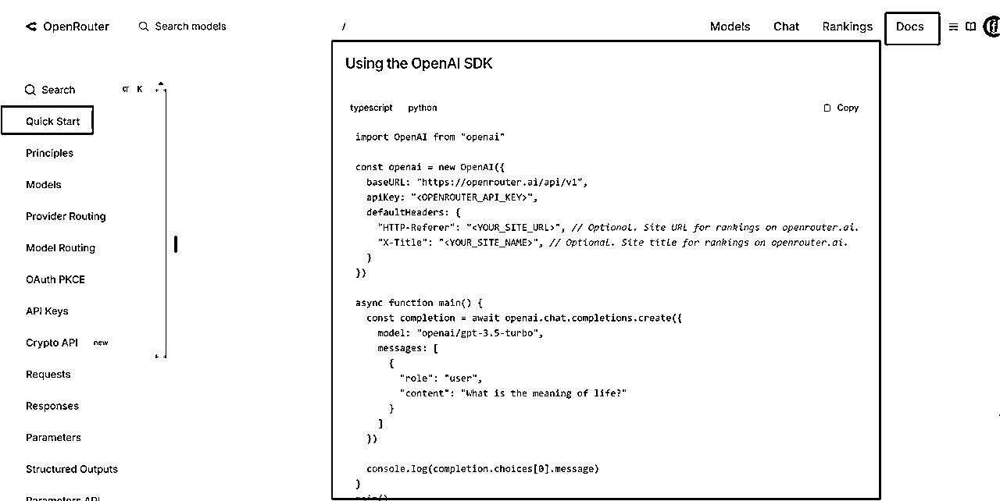

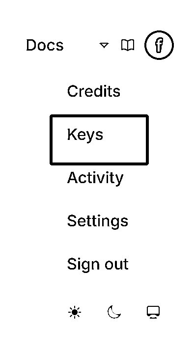

第二步：把文档和秘钥发给cursor，告诉它：

网站的问答功能要通过对接api的方式实现，以下是api对接文档和秘钥，请你完成对接

到这里为止，网站已经完成了核心功能，还有很多细节没有优化。但是秉持“ship fast,ship more"的原则，先上线再说，根据用户数据再调整下一步方向，快速迭代不要无意义的雕花。接下来就是正式部署网站上线。

##### 部署上线

*   先购买域名，一般域名找跟关键词一致的，后缀优先选.com/.org/.ai，不过这些域名一般比较贵，新手练手的话可以先随便买一个，所有我选了.pro的后缀，价格$2左右。

我一般购买域名是在https://porkbun.com/，可以先不太去管次年续费的价格，首年网站先盈利了再说，不然次年也不太会去续费。

*   接着解析域名，这里推荐用cloudflare，免费使用

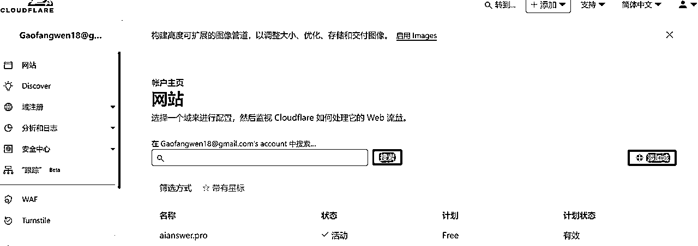

cloudflare地址：https://dash.cloudflare.com/，cloudflare在独立开发者圈子一直被视为赛博菩萨，因为它除了域名解析，还有很多免费功能，比如免费存储图片，想做ai图片站的小伙伴可以体验下这个功能。

*   最后是部署到服务器，先把代码上传到github，再在vercel上创建项目，关联github上的代码，最后在vercel创建的项目里加上我的域名aianswer.pro。

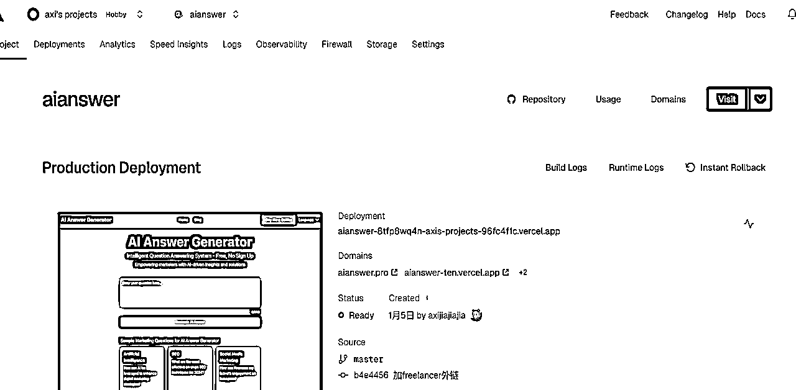

到这里为止，我已经可以正常通过域名访问我的网站了，完整的走完了一整套上站流程。

上面提到的工具地址；

github：https://github.com/

vercel：https://vercel.com/

限于篇幅所以没有展开介绍域名解析、部署服务器的具体步骤，主要是熟能生巧，操作过一次后后续每次基本20分钟以内就能完成网站的部署动作。

如果有小伙伴想具体了解部署网站的流程，可以在帖子的评论区留言，我可以后续具体写一篇介绍下。

### 4、如何冷启动

在冷启动这块的操作，我一般分成常规动作和个性化动作，常规动作包括网站收录、提交导航站、获取高权重网站外链，个性化动作包括根据对标竞品的外链地址跟进提交、根据数据优化网站。

##### 常规动作

1.  网站收录

这块主要是让主流搜索引擎先收录我的网站，这样就有可能让用户搜索关键词看到我的网站，主流的搜索引擎包括Google、Bing，另外还有个俄罗斯的yandex，流量最大的当然是Google。这里就以Google为例简单介绍下收录的操作：

1、打开GSC（谷歌搜索控制台）：点击左上角的下拉栏，点击“添加资源”

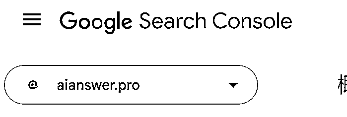

2、输入域名，然后一路填写信息点击确认

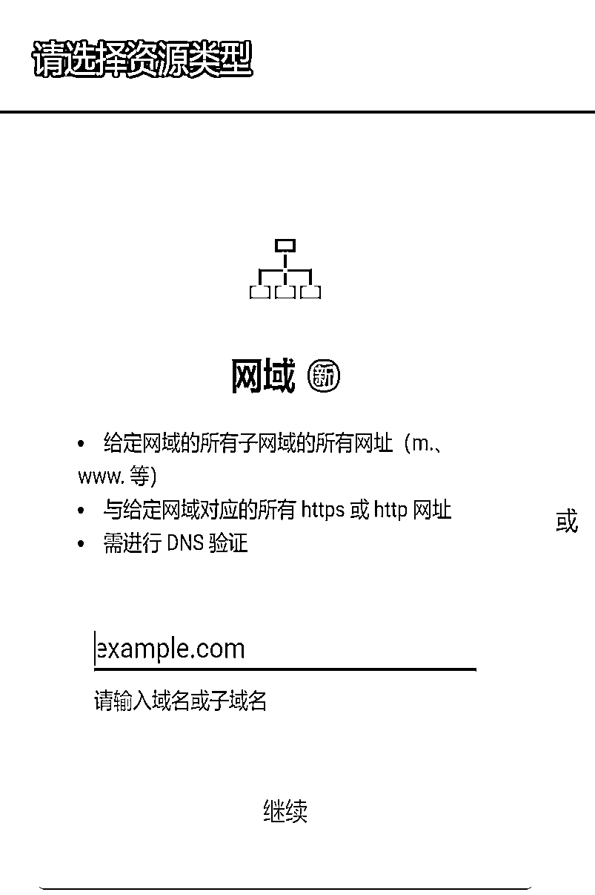

3、如果前面域名使用cloudflare解析的，那接下来通过cloudflare授权验证域名所有权，就完成GSC提交了

4、验证收录情况：一般GSC提交后要等待一段时间才会被收录，可以在谷歌输入“site:网址”查询有没有被收入。下图这种就是被收录了，也可以通过把网址提交高权重网站的方式，加快爬虫收录。

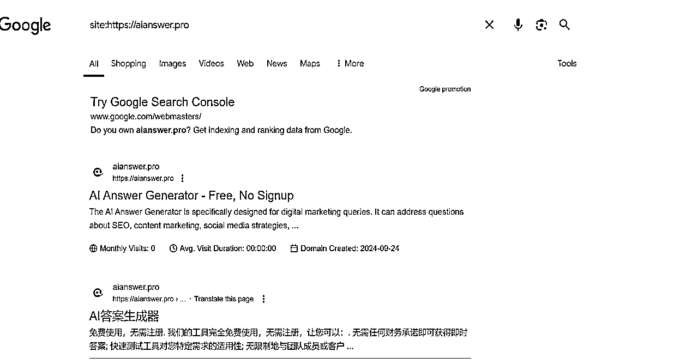

1.  提交导航站

目前网上有比较多的ai工具导航站支持ai功能提交，像亦仁提到的https://www.toolify.ai/就是一个ai工具导航站，toolify虽然流量大权重高，不过需要付费提交。这个网站作为我的练手项目，我前期先找了一些免费的导航站提交，后续有付费转化后再来氪金提交。

在提交导航站前我一般会先准备好网站的介绍信息，来提高提交效率，包括：网站链接、名称、邮箱、网站的分类、介绍文案、网站图片

这里可能有人要问，有哪些免费的导航站可以提交？

我平时看到流量大、权重高的免费导航站就会收集下来，不知不觉也收集了好多。我把这些导航站地址也都汇集到了我做的一个网站上，有需要的小伙伴可以自取：https://freelancer-tools.shop/backlinks/1

1.  获取高权重网站外链

这里有很多骚操作的方式可以实现，比如youtube可以创建个人频道，频道简介里支持放一个链接，这样就获取了一个youtube的外链，还有很多类似的操作。

##### 个性化动作

1.  据对标竞品的外链地址跟进提交

在上文【分析外链来源】部分里，我提到我从semrush里查到竞品投放的外链地址。我把这批地址导出成excel格式，方便后续每天提交，我给自己定了个目标，每天最少也要提交5个地址，以下是网站目前的外链数量：

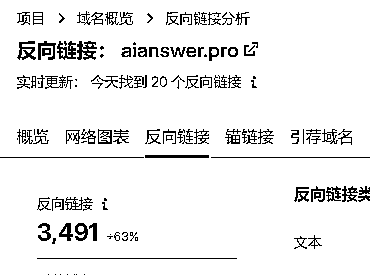

1.  根据数据优化网站

这部分主要是通过GSC和Google analysis去看，通过GSC可以看关键词排名，目标词排名多少，有没有有潜力的长尾词可以重点做一下、用户地域分布是怎么样的。

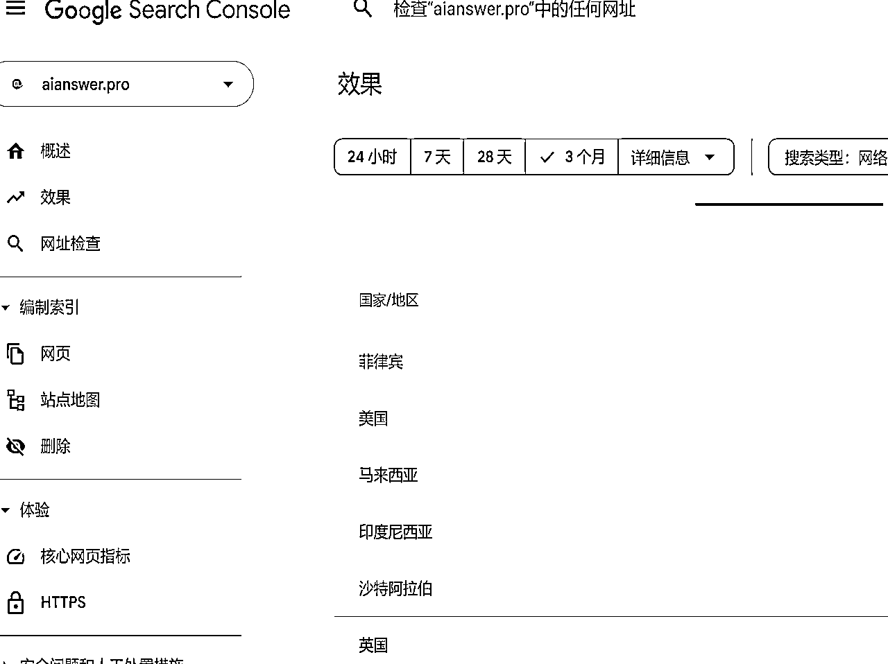

通过Google analysis可以看用户停留时长，停留时长短的话怎么做一些功能提升、流量主要来源于哪些外链、用户大部分在访问哪些网站、流量主要来自搜索还是推荐又或是直接点击。

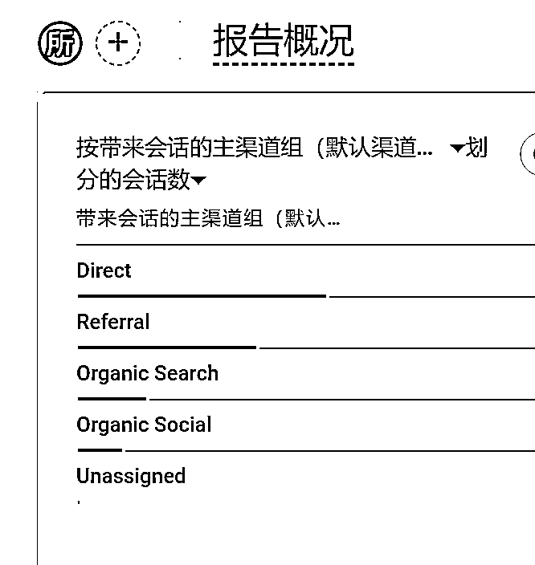

通过以上提到的几个分析角度，我发现了网站几个优化方向：

1.  增加多语言：

网站默认的语言是英语，但是从GSC发现菲律宾、中国、日本这些国家也有流量进来，于是我在顶部导航栏加了语言筛选器，因为翻译整个网站的工作量较大，所以我优先翻译了首页。多语言的翻译我也是通过cursor实现的，分享下prompt：

第一句：现在我需要对网站首页进行多语言翻译，请先列出主流的语种

第二句：请你在首页导航栏增加语言筛选器，筛选器里的语言选项就是你列出的主流语种，

第三句：请你来翻译首页的内容，翻译的目标语种是你上面列出的主流语种，你只需要翻译文字内容，不要改变首页的布局，网站的名称是“ai answer generator”，这个名称不需要翻译

1.  增加长尾关键词

上线几天后，在GSC发现网站又出了几个关键词在给网站带来流量，为了加强这几个长尾关键词的带量效果，我在网站里加了一个博客专区，围绕流量大一点的几个长尾关键词，每个关键词写了一篇博客，当然博客内容也是让Cursor写的，具体的prompt是：

请围绕关键词“XXX”写一篇字数不少于1500的博客文章，文章中关键词的词密度不低于3%

我在加了博客后发现流量开始明显上升，于是在网站上开始加付费入口。因为当时没有开通stripe这类收款账号，所以先放了一个Ko-fi赞赏入口，没想到收获了第一笔出海收入。

### 写在最后

以上就是一款AI出海工具站从发现需求、竞品分析再到流量获取的全过程，希望能为跟我一样0编程基础但想通过AI编程搭建出海工具站的小伙伴，在前进道路点上一盏微亮的灯。

另外，我上面在获取流量部分大篇幅讲的是如何通过SEO的方式获取流量，包括关键词优化、增加外链等，可能有人要问为什么要选用SEO的方式获取流量，有没有其他方式？

当然也有别的推广方式，比如社媒推广、广告投放，但对于出海建站的新手来说，SEO是最快上手的方式，像社媒推广需要你大量的时间泡在社交平台上去感受平台适合的内容调性，另外还需要花一段时间去积累粉丝（PS：目前我也在运营自己的社媒账号，有对推特运营感兴趣的小伙伴欢迎交流）；像广告投放，需要用真金白银去试投放素材和产品的转化率，试错成本比较高。

当然，SEO虽然上手比较快，花费的成本比较低，但它的缺点就是见效会慢一些，特别是对于老词来说，已经有一批做了一段时间的竞争对手在了，想要超越他们必然是需要循序渐进的。所以我认为比较好的方式是前期先做SEO引流，练手一段时间，通过SEO获得基础稳定的流量后，然后可以再用社媒推广、广告投放做增量。

最后，我想说的是2024年AI出现是一个新的机遇，如果你也对AI编程或是出海工具站感兴趣，不妨试试，在这个旅程中你会获得新的惊喜，祝你成功！