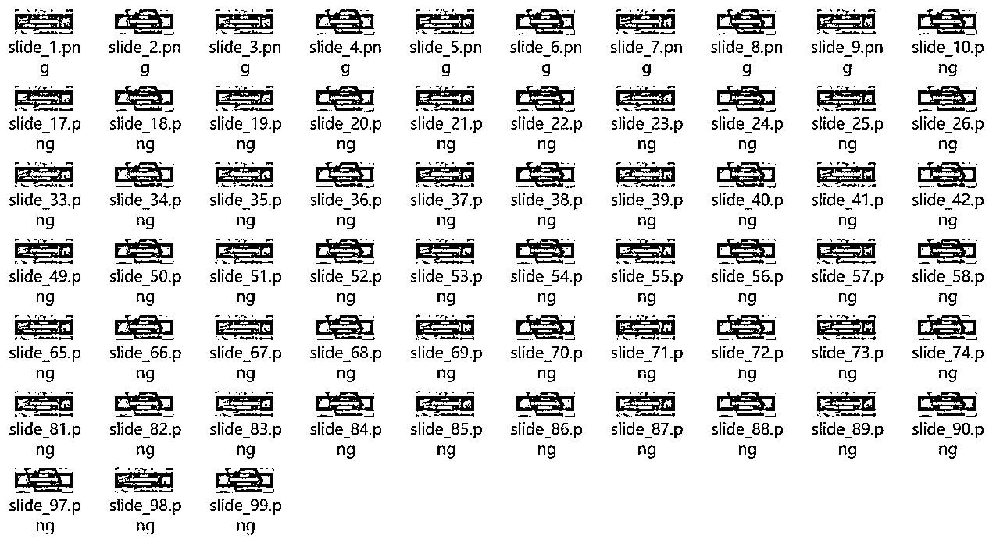

# 如何用Cursor制作小红书图文批量生成工具

> 来源：[https://si7o8nqh3o3.feishu.cn/docx/WfFYdKhNjoqXcFxA3ZBccSJPnNf](https://si7o8nqh3o3.feishu.cn/docx/WfFYdKhNjoqXcFxA3ZBccSJPnNf)

大家好，我是千久！不懂编程零基础开发各种小工具，今天分享一下这款小红书图文批量生成工具的Cursor制作流程，制作这个工具的难度其实并不大，但很容易在调试的过程中陷入死循环！原因是Cursor在制作这个工具的时候，会有两种方法！一种是通过内置的Python-pptx、容易导致文字样式不精确，而另外一种是通过PowerPoint使用当前电脑的PPT打开软件，在隐藏执行窗口调试中容易陷入死循环。


首先我们梳理一下这个工具的工作原理：

1\. 通过制作通用的PPT模板（图片、文字、背景）

2\. 用PPT的窗格属性来设置固定参数

3\. 用Excel表格来匹配窗格名称

4\. 通过Excel表格内容控制PPT模板进行批量生成图片


我们先在Cursor的“COMPOSER”选项中，输入以下内容：

我需要制作一个小红书矩阵工具，我们先制作一个软件界面，显示两分屏。

1\. 左边为导航栏：按钮名称为-图文制作、文案创作、批量发布、评论管理

2\. 右边为内容显示区、点击左边按钮，右边则显示内容。

3\. 整体软件界面要符合当下最热门软件风格、可采用css样式来布局。


输入以上指令后，Cursor会帮助我们创建一个main.py文件！这个文件主要用来控制整体软件界面的，采用的是tkinter库构建图形界面，接下来我们再创建一个文件夹，命名为tool、用来存储各功能文件的，同时创建一个py文件、命名为tuwen.py、这个文件用来存放图文制作功能代码，这样分割功能代码存储的好处在于后续要新增其他功能的时候，不会导致其他功能被Cursor乱改导致错乱。

我们继续输入以下内容给到Cursor：

# 批量图文功能的功能如下：

1\. 用户自主制作通用的PPT模板（图片、文字、背景）

2\. 用PPT的窗格属性功能来设置固定参数，并用Excel表格来控制PPT模板里的样式

4\. 用户点击生成后自动批量生成PNG或JPG格式的图片

5\. 将图文批量功能的代码存储在/tool/tuwen.py下


输入以上指令后，Cursor会将该功能代码写进tuwen.py文件里，此处应该会出现需要调试的阶段，因为在生成的过程中会出现背景图片不替换、或者文字不显示的问题！将问题反馈给Cursor即可，这里需要注意的是，如果你的背景图片可以正常替换，但文字不显示！优先考虑是图层顺序造成的问题，而不是程序功能问题。

在调试的过程中，点击生成按钮后、软件会自动通过当前电脑安装的软件（WPS/微软）打开PPT进行替换流程，当所有调试都完毕以后，需要让Cursor将执行窗口进行隐藏，这里就会出现错误！容易进入代码死循环，一直无法解决这个问题，我通过调试了很久才解决这个问题，最下面我贴上了解决的代码，直接把代码复制给到Cursor后，它就可以解决隐藏执行窗口在后台执行批量图文制作流程。



该小红书图文批量生成工具的生成效率非常高，亲测生成100张图文素材仅需1分钟即可解决。

一个用于批量处理 PowerPoint 文件的自动化工具，支持在后台无界面执行。

## 功能特点

- 批量处理 PPT 模板

- 支持文本和图片替换

- 后台无界面执行

- 保持图层顺序

- 支持 PNG/JPG 输出

## 快速开始

### 安装

```bash

pip install pywin32 pandas python-pptx

```

### 基本使用

1\. 准备 PPT 模板文件

2\. 准备 Excel 数据文件

3\. 准备需要替换的图片

4\. 运行程序，选择相应文件

5\. 点击"生成图片"开始处理

## PowerPoint 后台执行最佳实践

### 1\. 关键代码

```python

# COM 对象初始化

pythoncom.CoInitialize()

# PowerPoint 实例配置

powerpoint = win32com.client.Dispatch("PowerPoint.Application")

powerpoint.DisplayAlerts = False # 禁用警告

powerpoint.WindowState = 2 # 最小化窗口

# 打开文件的完整参数

presentation = powerpoint.Presentations.Open(

template_path,

ReadOnly=False, # 读写模式

Untitled=False, # 使用原文件名

WithWindow=False # 不显示窗口

)

```

### 2\. 完整实现示例

```python

def start_generate(self):

"""开始生成图片"""

self.is_generating = True

self.generate_btn.config(state='disabled')

self.cancel_btn.config(state='normal')

def run_in_background():

try:

# 初始化COM

pythoncom.CoInitialize()

powerpoint = None

presentation = None

try:

# 初始化 PowerPoint

powerpoint = win32com.client.Dispatch("PowerPoint.Application")

powerpoint.DisplayAlerts = False # 禁用警告

powerpoint.WindowState = 2 # 最小化

# 打开模板

presentation = powerpoint.Presentations.Open(

self.ppt_template,

ReadOnly=False,

Untitled=False,

WithWindow=False # 不显示窗口

)

# ... 处理幻灯片内容 ...

finally:

# 清理资源

try:

if presentation:

presentation.Close()

if powerpoint:

powerpoint.Quit()

except:

pass

pythoncom.CoUninitialize()

except Exception as e:

logging.error(f"生成过程出错: {str(e)}")

messagebox.showerror("错误", f"生成过程出错：{str(e)}")

finally:

self.is_generating = False

self.generate_btn.config(state='normal')

self.cancel_btn.config(state='disabled')

# 在新线程中运行

threading.Thread(target=run_in_background, daemon=True).start()

```

### 3\. 关键参数说明

- `DisplayAlerts = False`：禁用所有警告弹窗

- `WindowState = 2`：最小化窗口（ppWindowMinimized）

- `WithWindow = False`：阻止创建可见窗口

- `ReadOnly = False`：读写模式打开

- `Untitled = False`：使用原文件名

### 4\. 实现要点

1\. COM 对象的正确初始化和清理

- 使用 `pythoncom.CoInitialize()`

- 在 finally 中调用 `pythoncom.CoUninitialize()`

2\. PowerPoint 窗口控制

- 设置 `DisplayAlerts = False` 禁用警告

- 使用 `WindowState = 2` 最小化窗口

- 使用 `WithWindow = False` 不创建可见窗口

3\. 多线程处理

- 使用 `threading.Thread` 在后台运行

- 设置 `daemon=True` 确保主程序退出时线程也退出

4\. 资源清理

- 使用嵌套的 try-finally 确保资源正确释放

- 关闭顺序：先 presentation 后 powerpoint

### 5\. 常见问题及解决方案

1\. COM 对象错误

- 确保正确初始化和清理 COM 对象

- 使用 try-finally 确保资源释放

2\. 窗口显示问题

- 使用 `WithWindow=False` 参数

- 设置 `WindowState=2`

3\. 多线程问题

- 在单独线程中运行 PowerPoint 操作

- 使用 daemon 线程避免程序退出问题

### 6\. 如何使用此文档

当遇到 PowerPoint 自动化相关问题时，可以：

1\. 搜索关键词：

- "PowerPoint 后台执行"

- "win32com 无界面"

- "PowerPoint 自动化隐藏窗口"

2\. 提供代码上下文：

```python

# 当前代码

powerpoint = win32com.client.Dispatch("PowerPoint.Application")

powerpoint.Visible = True # 需要修改为后台执行

```

3\. 明确需求：

"需要将 PowerPoint 操作改为后台执行，不显示任何界面"

## 依赖项

- Python 3.6+

- pywin32

- pandas

- python-pptx

## 注意事项

1\. 确保系统已安装 Microsoft PowerPoint

2\. 运行时需要管理员权限

3\. 首次运行可能需要注册 COM 组件

## 许可证

MIT License