# TK如何从0到1建站操作指南（环境搭建篇），即省钱又详细

> 来源：[https://hez86518tv.feishu.cn/docx/WpmJdQ8JwotUpgx4ZylcTANonvd](https://hez86518tv.feishu.cn/docx/WpmJdQ8JwotUpgx4ZylcTANonvd)

| 版本 | 更新描述 | 作者 | 更新日期 |
| V1.0. | 新建文档 | 科学羊 | 2024-12-09 |
| V1.1 | 增加前言，修改部分内容 | 科学羊 | 2025-02-11 |
| V1.2 | 优化部分词汇 | 科学羊 | 2025-02-12 |
| V1.3 | 新增PC版 | 科学羊 | 2025-04-22 |

* * *

大家好，我是科学羊，（10W+）爆文公众号专栏日更作者，知名报社签约编辑、海外内容创业实践者、游戏视频创作者。近期应很多海外运营者邀请，为大家分享关于TK建站的的干货操作方法，希望对你有用。

新年好🥳，本期专栏干货主要分享TK环境搭建相关内容，其他变现及运营方式我们未来再更新！

注意：

1、该文档主要针对油管和TK运营者，专注对BNG游戏赛道用户定制，但不限于其他赛道

2、建议提前下载或收藏pdf阅读

相关文档：

另外，网站优化为什么一定要读我这篇？

理由：因为给你每个月节约不少冤枉钱，而且我会很详细的告诉你每一步操作步骤，避免踩坑。

好了，废话不多，我们直接干货～

适合人群：

1、想探索或从事海外TK变现及带货项目的人群

2、探索海外市场的人群

# 前言

自去年12月～到2025年1月以来，我发现BNG游戏赛道在TK的流量其实要高于YT，所以本次借助这个机会为大家分享一下关于TK的运营。

常言道：长视频做油管，靠播放时长来开通收益，而TK靠短视频播放次数来开通收益。

我自己亲自尝试过，BNG做短视频最快半个月就可以开通TK

那么，TK究竟要如何开始？

我个人总结了一下几个步骤，这几个步骤无论你是谁给你讲都必不可少。

第一步：购买iphone手机，建议SE2，或者Iphone7（355元左右）以上；

第二步：自行刷机（后文有讲，生财有很多帖子也谈过），一定要注意该关的的东西关掉；

第三步：购买可以下载TK以及免费网络优化工具的国外苹果账户ID（一定注意要和商家确认是否可以购买的账户能不能下载TK，比如现在美区是下载不了的（截止@20250214 已经恢复下载），小火箭有些id带免费，有些不带，价格不一样，一定要问清楚；

第四步：登陆账户ID下载 TK（注意TK一定不要打开）和小火箭；

第五步：下载好软件后，注意一定要退出当前账户；

第六步：此时，手机环境已经OK，接下来就是建立家庭住宅（后文有讲）；

第七步：用小火箭扫码，获取独立站的IP；

第八步：此时手机网络已OK，就可以打开TK准备注册，找一个获取海外手机号平台，通过海外电话注册账户。有2个地方注意，第一，注册的时候一定要满18岁，建议选择生日在1996之前，否则无法开通收益；第二，最好提前注册一个outlook邮箱，用来绑定你通过获取海外手机号获取的TK账号，以免未来丢失；

第九步：养号，完成以上8步之后基本就算ok了，接下来就是多刷视频，保持真实性，可以点赞收藏。（不过大家注意，刚开的号一般在保护期，你是无法关注别人的，要等几周才行，但是这个不重要）；

好了，以上就是详细步骤啦～

另外，再啰嗦一句，可能很多人都会忽略的细节。

当你用Iphone给这台手机传视频的时候，比如你用的是隔空传送，记得一定要先在后台关闭TK，别问为什么，照做！

另外，传完视频后一定要关闭蓝牙。

好，以下是详细分享～

# 一、TK环境搭建及配置

前言：

1、关于网络环境优化搭建大家自行查阅其他渠道。另外关于为什么我们要进行如此繁琐的操作，大家只需跟着做就行，无需多问。

2、本方法只需投入每个月55💰RMB 即可实现完整流程（按需而行）

## 1.1 专属独立IP服务器设置及购买

购买地址：https://666clouds.com/clientarea.php

注册的时候信息保持电话和邮箱正确即可！

注册完成之后按照如下图进行操作：

### Step1：购买

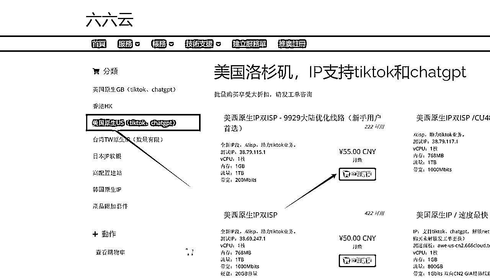

### Step2：点击重装

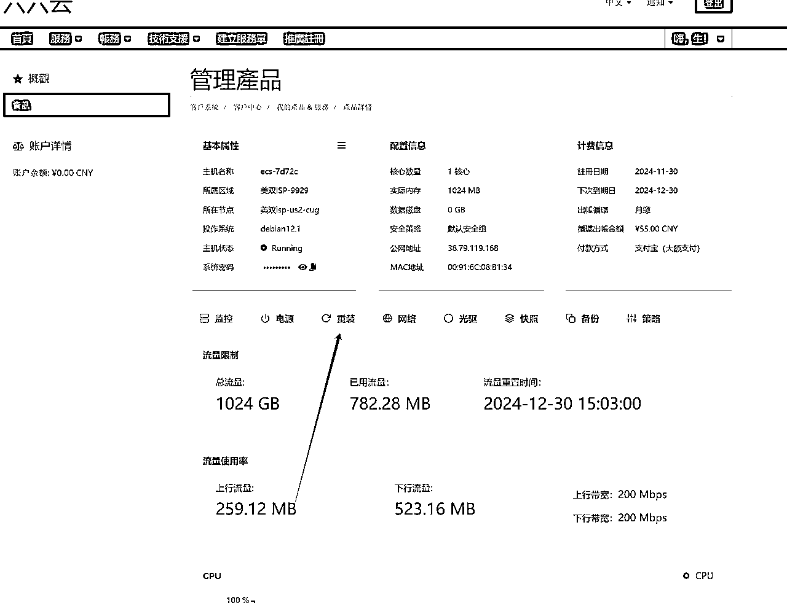

买好以后选择重装，装德班12.1

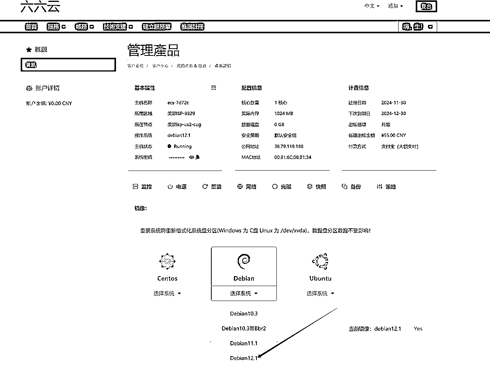

以上找到自己的账户就是购买的信息，暂时先不用动，我们后面会用到。

## 1.2 fianlshell本地建站

注意⚠️：fianlshell只是一个部署软件，

下载地址：https://www.hostbuf.com/t/988.html

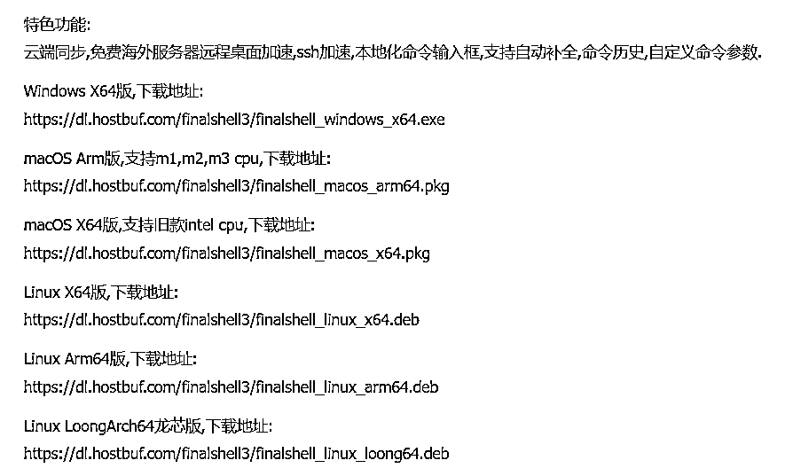

打开软件

新建

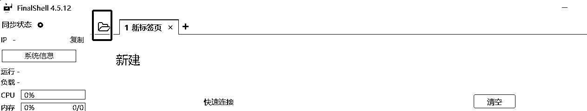

点击链接

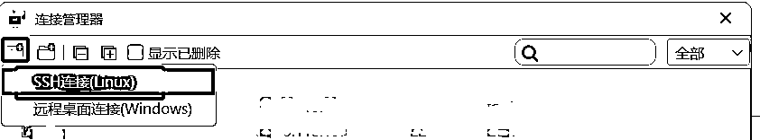

输入信息

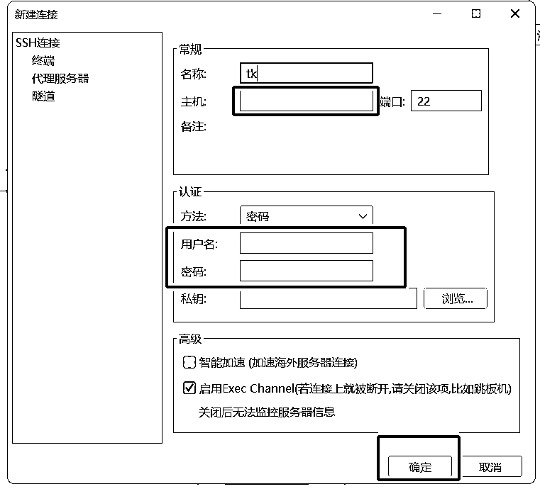

主机就是你买的共用地址（如下图）

密码就是隐藏的那段（如下图），复制即可

用户名默认写root

操作步骤：

#### Step1：点击新建SSH，输入购买的IP地址和密码

#### Step2：打开列表中的TK1（自命名），按照顺序输入以下命令

#### Step3：输入命令

1️⃣ 必要更新操作(Debian/Ubuntu)

apt update -y && apt install -y curl socat wget

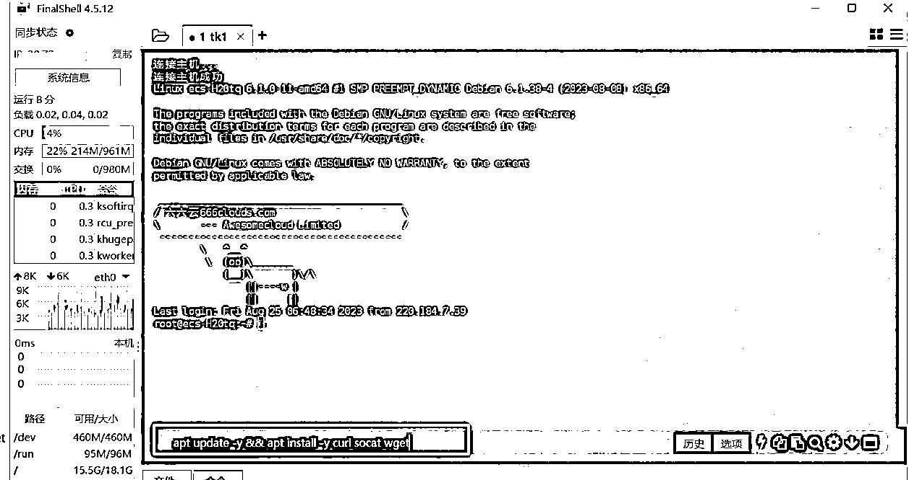

2️⃣ 一键安装依赖包

apt update -y&&apt install -y curl&&apt install -y socat

3️⃣ 一键搭建脚本

bash <(curl -Ls https://raw.githubusercontent.com/mhsanaei/3x-ui/master/install.sh)

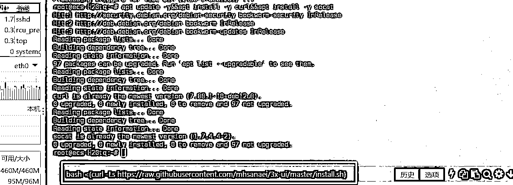

中途提醒按y即可

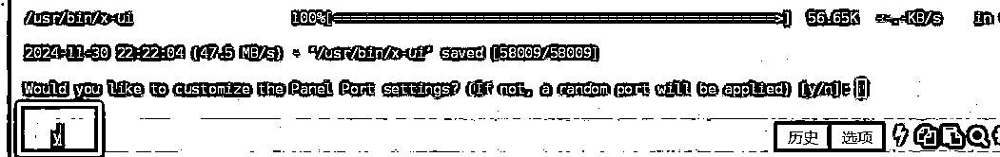

Port 随意（按我的即可）

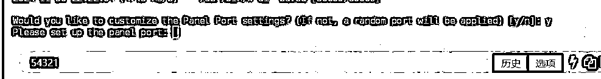

结束之后复制这段

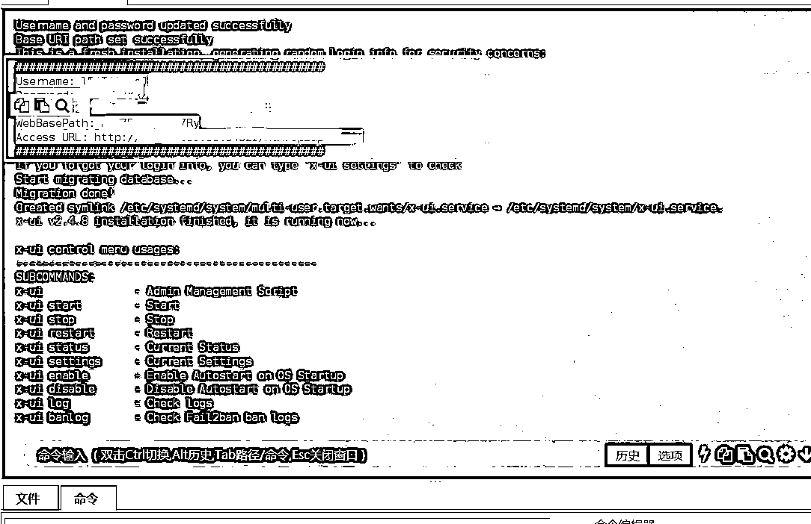

#### Step4：以上操作完成后会绑定一个url地址，你需要将地址拷贝到本地txt，方便后续用

#### Step5：打开google，输入上述Access URL，并登录系统生成的账户和密码

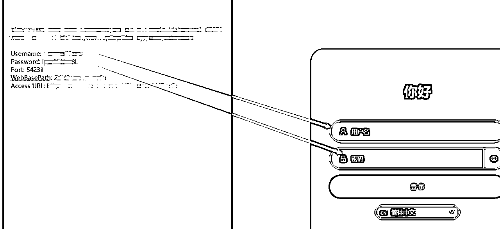

#### Step6：修改服务器配置

点击> 入站列表 > 添加入站

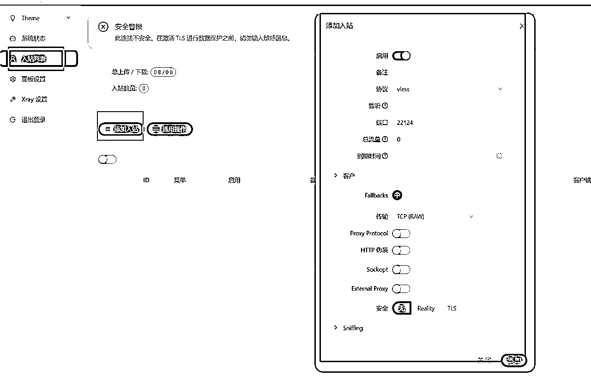

#### Step7：生成二维码（后续需要网络优化工具获取）

后续用网络环境优化去扫即可，这里不做过多讲解。

# 二 、手机设置及环境准备

TK 在不同的地区可能会有不同的内容和功能限制。通过合理设置手机环境，我们可以更好地体验 tk 的丰富内容，同时也能确保账号的安全和稳定。

苹果手机机型：建议苹果7以上（安卓需要用google手机📱，建议用苹果手机SE SE2 都可）

苹果手机设置：

1、恢复出厂设置

2、关闭定位

3、关闭广告功能：

系统14版本以下：打开“限制广告跟踪”

14版本以上：“关闭个性化广告”

4、修改语言、地区、时区 ：

语言修改为英语、繁体或者目的国语言

时区要和IP对应的城市一致

注意：手机一定要拔掉卡，不要插国内卡

## 2.1 具体操作步骤

手机图片截图取自星友Lisa

Step1：刷机

Step2：根据图片进行设置（注意国家直接可以选择US）

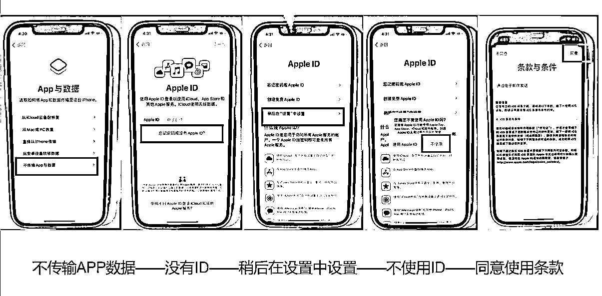

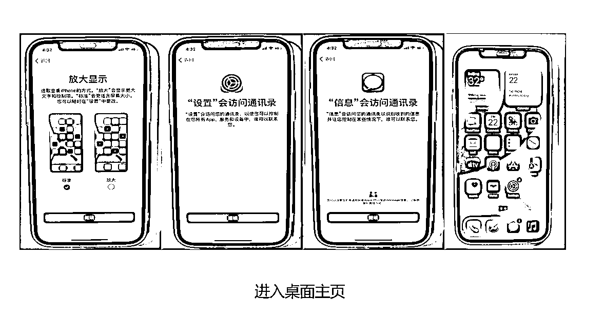

### 2.1.1 网络环境优化设置

打开网络环境优化，点击左上角扫码，扫本地网站优化之后保存的二维码，扫描之后会出现下图所示的节点。点击测试有无延迟，就说明网络已OK，这里不做太多解释，网上自行查阅。

注意⚠️：如下图设置

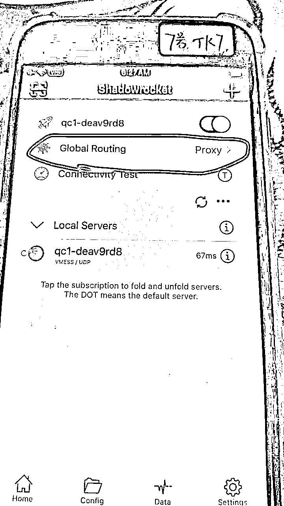

## 2.2 TK 下载及注册获取海外手机号

### 2.2.1 如何下载TK

手机环境设置好之后，就可以去下载tk了。首先需要准备一个海外苹果ID账号（可以注册也可以购买），登录的时候一定要点击“不更新”。

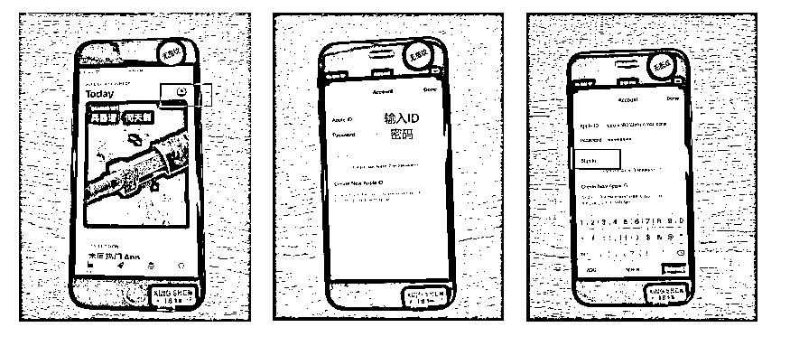

注意：在APP Store 里登录即可

登录上去以后就可以下载tk了！

### 2.2.2 如何注册TK账号及其获取海外手机号

刚开始你就注册免费的outlook邮箱就可以了，每个IP每天可以注册好几个。(根据流程注册就OK了)

或者使用获取海外手机号平台接ma即可！

获取海外手机号地址：https://222sim.com/

备用（https://sms-activate.guru/cn/info/freeprice）

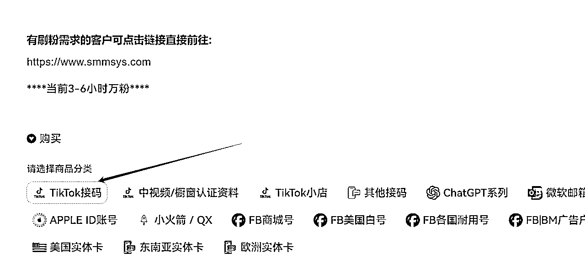

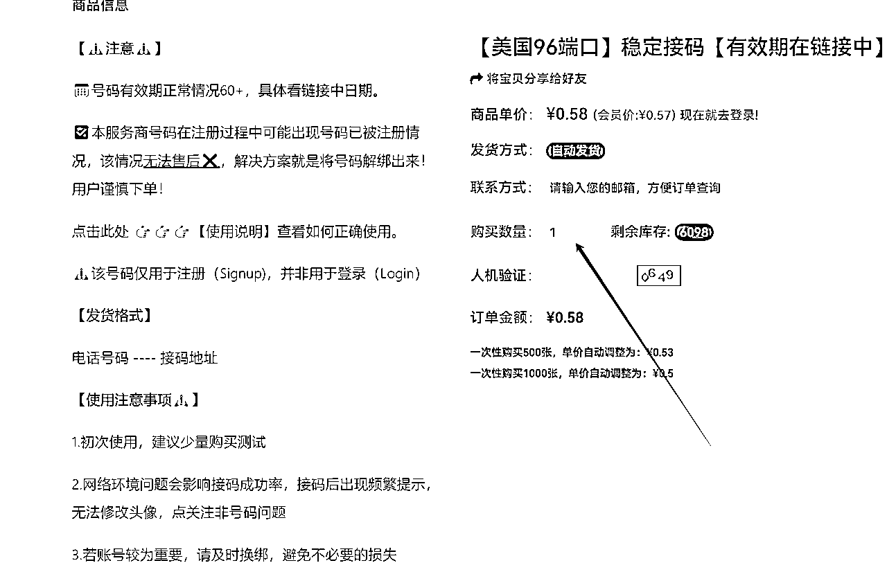

邮件会收到系统发来的电话，输入电话后，会自动收到验证码！

注意：新注册的TK账户会有三天封禁期，是不能点击关注和收藏等功能的，需要自然刷视频2～3天就可以解封！

好，以上就是今天的分享，谢谢～～

# 三、PC如何搭建

推荐视频

https://www.youtube.com/watch?v=JYjRidC4kd8&ab_channel=%E5%B0%8F%E5%85%AD%E6%95%99%E5%AD%A6

PC搭建软件v2rayN.exe

# 四、FAQ

## 3.1 如果到期了如何续费？

重新登陆66云https://666clouds.com/clientarea.php，点击你的账户会有一个提示续费，记得续费之后一定要「硬重启」服务。完成之后等待5min，然后去小火箭里测试是否有正常的延迟网络

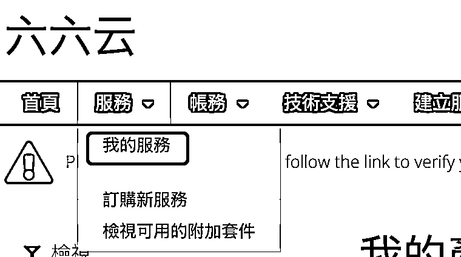

3.2 TK发布时间问题，这个只供参考

以上，谢谢～