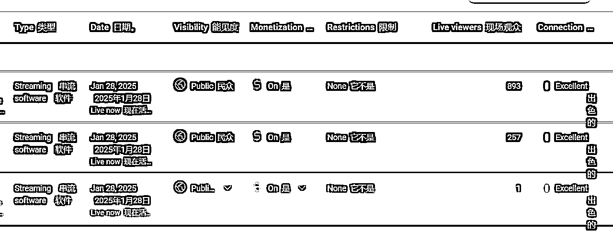
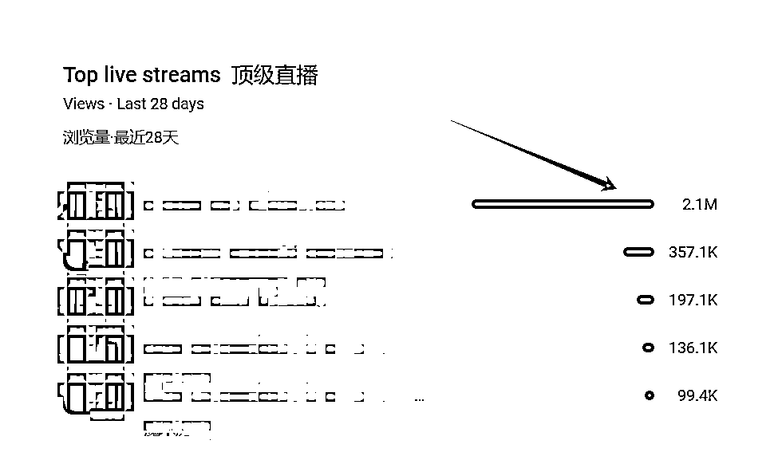
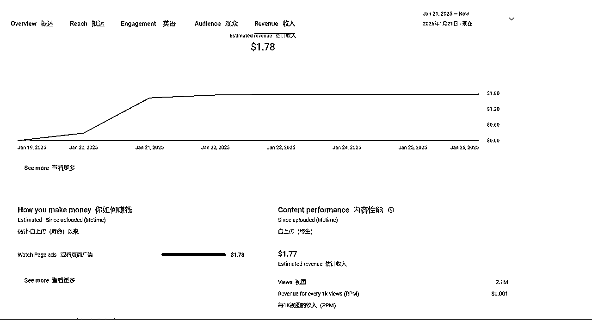
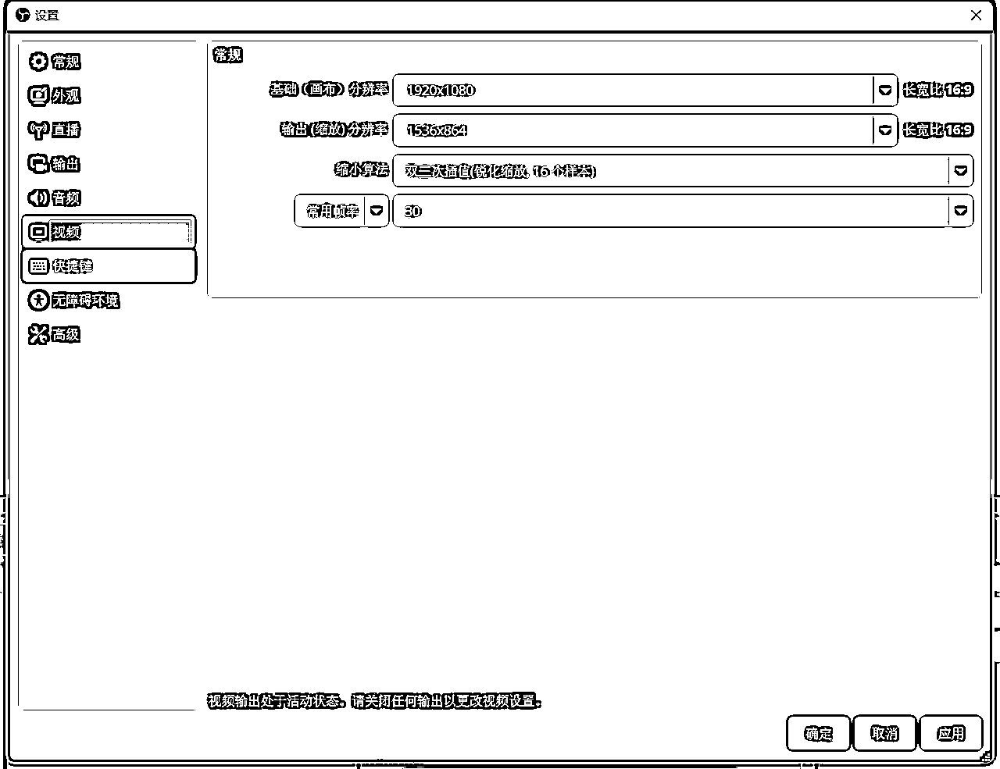
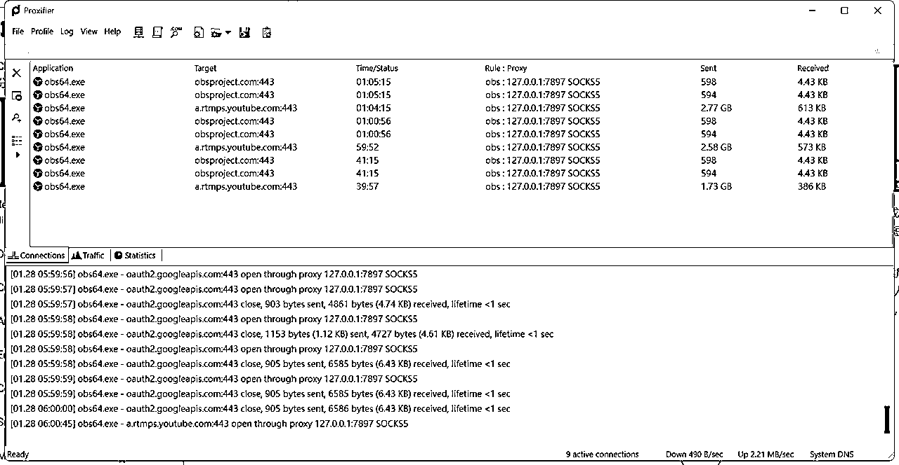
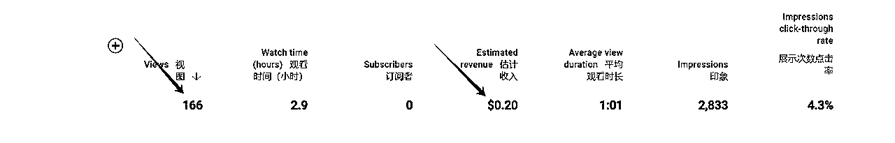

# YouTube直播快速涨粉（一天可涨五六千粉）

> 来源：[https://o3r5flroio.feishu.cn/docx/Wr7vdnIFvoNNFixFpPbcb6fwnJh](https://o3r5flroio.feishu.cn/docx/Wr7vdnIFvoNNFixFpPbcb6fwnJh)

# YouTube直播间流量展示

大家好，今天给大家分享一下YouTube上的直播涨粉玩法。这个截图是我今天写帖子的时候，我推流了3个直播间的实时在线人数。

这个是我前面几场直播的数据情况

这个场观210万人的直播是我在1月21号做的，这个直播涨粉涨了有六七千。但是直播的收益几乎是可以忽略不计的。所以我得出来的结论是：这种直播可以快速涨粉，但是收益是比较低的，如果圈友们有自己的产品或者服务是可以抓紧薅一把流量的。

接下来我把我如何做的直播心得分享给大家。

前面我说过用AI画面加AI音乐快速起号的方法，做音乐账号的，很多同行都会去做直播间，我就去研究了一下。

# 从0开始，如何搭建竖屏直播

我发现YouTube的直播目前分为横屏直播和竖屏直播，而竖屏直播也是平台推出时间不久的一种直播间形式，据我的观察，竖屏直播应该是有流量扶持，直播间会出现在短视频的动态里面，只要内容别那么拉胯，场观10几万很轻松。

如何搭建一个竖屏直播间呢？其实方法挺简单的，有2个方式，一个是用手机直接开播。另外一个就是我今天分享的，利用obs推流。obs推流，理论上可以实现7*24小时无人直播。

打开obs的视频界面，默认就是横屏，但是其实这个数字是可以去更改的，直接就在输入框里面更改就行了，只要将1920x1080改成1080x1920，你推流过去的视频就变成竖屏的了，也就是被YouTube检测为竖屏直播间了，会有竖屏直播推荐和短视频动态的流量进入。

因为直播间的流量非常大，所以涨粉真的很快。我这个210万的前后下来应该涨粉差不多1万。然后结合了obs的推流，油管的直播间无限循环播放是被允许的，所以你只要有合格的视频素材，就可以实现全程无人直播。（真正想要实现，要不就是电脑永不关机，要不就是搭建云服务器，搭建云服务器推流的玩法我还没实践，后续肯定会做，到时候有心得再来分享）

为了顺利让obs推流成功，你还需要经过下面这个软件去更改网络的连接，这个软件叫做Proxifier，下载后去做一个简单的设置，就可以用了。

# 竖屏直播素材制作

接下来就是制作直播素材了，直播素材可以是一个短视频或者几个短视频拼接成一个几分钟的视频，然后循环播放，但是要记住，背景音乐必须使用无版权的，这样子循环下来的直播间除了能涨粉还能有一丢丢收益，版权问题在油管还是比较重要的。结合AI特别容易做出有意思的视频，当然也可以自己拍摄。

# 目前我的现状

我是长短视频、横竖直播间一起做。后续计划搭建一个云服务器，这样就不用吃我的电脑资源了。

竖屏直播我会拿来做涨粉，比短视频快得多了，也很方便，做好一个素材启动电脑就好了。

横屏直播间做收益，测试了几个，千次观看和长视频的收益差不多，可以做到1.5美元左右。

下面都是横屏直播间的数据分享。

希望借此分享，抛砖引玉，链接更多同道圈友，探索更加多元化的YouTube变现方式。目前接触这个youtube也快两个月了，感受越来越深，有价值的信息都是在小圈子里流动。

# 关于软件下载

obs推流软件官网

https://obsproject.com/download

proxifier（网上有密钥，不用买，谷歌一下一大把）

https://www.proxifier.com/download/