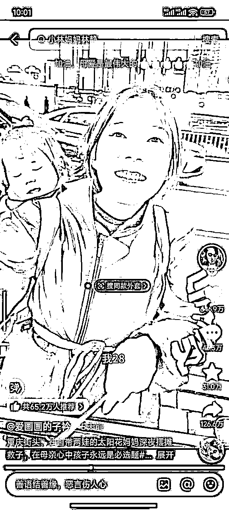
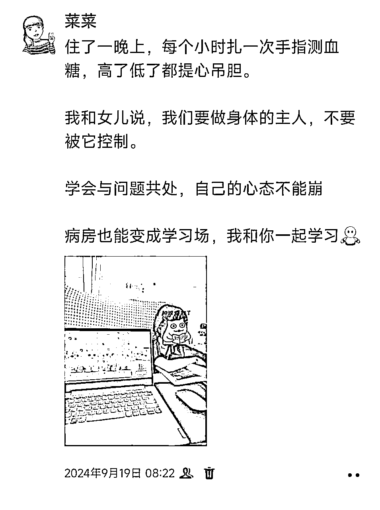
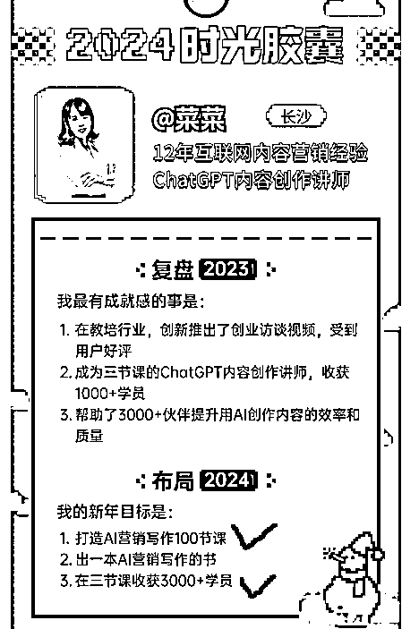
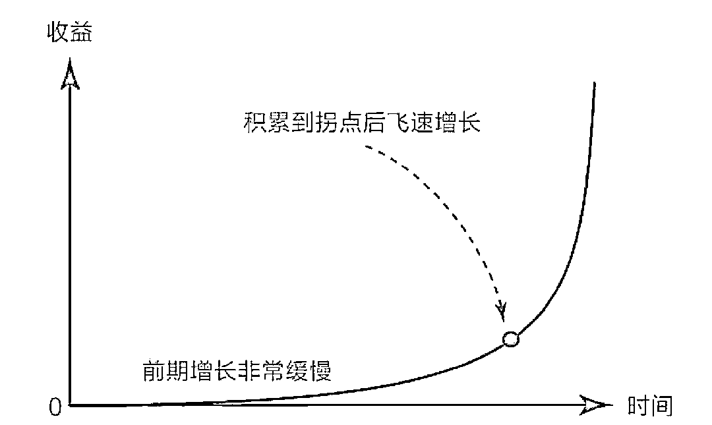
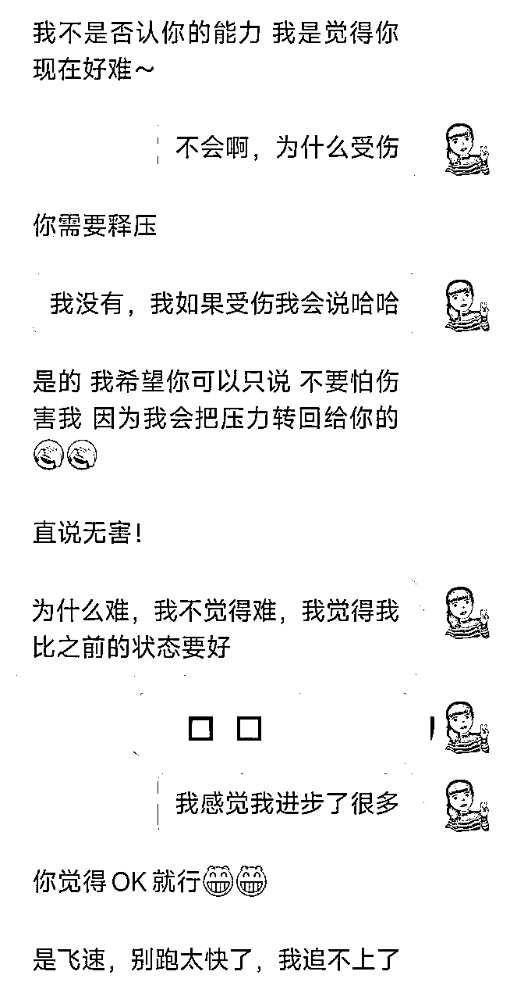

# 2024年自我复盘：17年打工人，40岁出来创业，遭遇女儿生病、婚姻破裂，我是如何提升心力，走出阴霾的？

> 来源：[https://balfcirt91j.feishu.cn/docx/XJQvdN435ocqNoxm8VvcncCRngc](https://balfcirt91j.feishu.cn/docx/XJQvdN435ocqNoxm8VvcncCRngc)

2025年伊始，我在抖音上刷到了一位让我动容的母亲——小林妈妈林静。她非常年轻，28岁，独自抚养2个孩子。其中一个孩子是男孩，患有先天性心脏畸形，另一个是女儿，刚刚学会走路。大冷的天，他们一家三口在重庆街头摆摊卖烤苕皮。大家有兴趣，可以去抖音搜索下，千万粉丝博主“爱画画的子衿”也拍过她的故事。在镜头中，那个女孩美丽动人，满脸笑意，丝毫看不出她是一个命运多舛之人。

子衿说：“我在你身上看不到一点点阴霾的影子。她笑着回答：“阴霾是留给自己的。”这句话让我哭了好久好久。为什么？因为2024年，我也走上了一条类似的路。

3月份，我结束了17年的打工生涯。

本想着要好好大干一场，眼看着事业也有了起色。

谁知道，命运和我开了个玩笑。

9月18日，这个日子我这辈子都忘不了——

我的大女儿被确诊为一型糖尿病，从此要终身依赖胰岛素维持生命。

那段日子，我就像被关进了一个漆黑的隧道。

更让我措手不及的是，在接下来的两个月里，维系了十几年的婚姻最终破裂。

我带着两个孩子离开了那个一砖一瓦都凝聚着夫妻共同回忆的家，开始了独自带娃的生活。

有时候我会想，这一切会不会是一场梦？

每天早上醒来，我都期待这不是真的。

但残酷的现实告诉我：这就是我接下来要面对的人生。

在这动荡的一年里,我的身份和心态都经历了翻天覆地的变化。

第一重转变，是从一个有固定收入的打工人，变成了自媒体创业者。

收入的不稳定，容易焦虑；面对低迷的经济环境，容易悲观。

第二重转变,是从双亲家庭变成了单亲妈妈。

我必须一个人扛起原本两个人共同承担的责任——

赚钱养娃、照顾孩子们的生活起居，打理家务，还要修炼成“半个医生”。

因为大女儿患上一型糖尿病，我不得不从零开始学习糖尿病的相关知识。

这个病非常麻烦，体内的血糖就像一匹失了缰的野马，时高时低。

与之对应的，是需要严格监测血糖数据，根据波动找规律；

日常饮食需要称，计算碳水系数匹配适量的胰岛素。

再加上每天四次皮下注射胰岛素，这对大人来说都是一场噩梦，更别提她还是一个11岁的小学生。

记得刚开始的时候，女儿每次打针都要做上老半天的心理准备。

实在到了不打不行的时候，她强忍着恐惧，战战兢兢地把针尖刺入肚皮，紧张得不敢呼吸，瘦弱的肩膀微微发抖，

看着她，我的心都要碎了。

但我必须装作很坚强的样子，因为一型糖尿病的孩子非常容易抑郁，我得随时准备好为她加油打气。

在这样艰难的处境下，我却意外地发现，自己的成长速度前所未有的快。

在生活上，我学习了好多知识：

如：如何不费力气地装好一个书桌？——

微信小程序搜索“万师傅”，找师傅上门安装。

又如：淋雨喷头用久了，一定要用小苏打兑水泡一下，不然连热水器都打不燃。

天然气欠费的情况下，缴费后，需要打开保护阀门，才能通气……

我从一个“生活小白”，变成了打理家庭的能手。

在业务上，我在2023年底许下的flag，2024年完成了2/3。

说句实在话,如果不是生活开了这两个巨大的玩笑，我相信三个flag都能实现。

所以今天，我想跟大家分享一下这一路我是如何熬过来的。

说这些，不是为了博取同情。

都说家丑不可外扬，谁都希望在外人面前保持光鲜亮丽的形象。

可是，这个世界总有它的B面。

总得要有人告诉你，当苦难来临的时候，我们应该以怎样的姿态去面对？

就像我现在经常在糖尿病互助群里分享经验，告诉刚确诊的家长们：

这场暴风雨其实没有想象中那么可怕，我们完全可以找到方法走过去。

2024年，让我走出阴霾的6条经验

1.转变动机

创业的日子真不好过，尤其是收入不稳定的时候。

眼看着银行卡里的数字一天天减少，可该做的交付还得做，该投入的成本一分都不能少。

那段时间，我调整了心态，把创业当成一场付费的学习。

比如说我在做“AI营销100节课”这个项目，需要把公司里营销岗位的所有工作全部梳理一遍，再融入AI，做成傻瓜式的解决方案。

即便当下没有收入，但我每天都在积累新的营销知识和案例，这些都是在为将来打基础。

用这样的心态，学习和工作反而变得轻松了。

学习糖尿病管理知识的时候也是如此。

一开始看那些专业术语。真的很头疼。

什么“支链淀粉”、“碳水系数”、“后升”……全是天书一样的词。

但我转变了想法 ——这不就是在学一门新技能吗？

万一哪天营销这行不景气了，我还能帮助别人管理糖尿病谋生计呢！

就这样，把学习当成了给自己增加“赚钱本事”，我就有动力坚持下去了。

结果好巧不巧，真的有不少家长加我，要拜我为师（不过我实在没有精力去做这些）。

2.延迟满足

创业不可能月月都有好收成，遇到收入低谷怎么办？

我始终相信一个原则—— 复利效应。

就像播种一样，前期的增长是缓慢的，但到了拐点就会爆发式增长。

现在市面上还没有人系统地做内容营销的全场景AI方案，只要我能坚持把这件事做成，价值就会凸显出来。

我们之所以无法延迟满足，不相信有复利效应，

是因为我们很容易把当前的现状，当成以后的常态，一直在焦虑和恐惧症打转出不来。

这让我想起女儿学习自己打胰岛素的经历。

刚开始的时候，她常常拖延好几个小时都不敢打针。

我记得有一次，中饭该打针的时候拖到了晚饭时间，我急得直锤床板。

我那会十分绝望：孩子以后每次打针都要这么折腾，她以后如何生活？

我若不在了，谁来帮助她？

但慢慢地，她从犹豫3小时，到1小时，到半小时，

再到现在完全不害怕了。

现在她还能根据自己想吃的零食，计算碳水，给自己打胰岛素，实现了“吃喝自由”。

你看，那些曾经让我们觉得苦不堪言的事情，现在都变得稀松平常了。

所以啊，给一点时间，让子弹飞一会儿。

3.把模糊变清晰

当我们焦虑、有情绪、迷茫的时候，最根本的原因是前路不清晰——

可能是选择太多，不知道该走哪一条路；

又或者是混沌的状态，看不清、道不明。

比如我有时会莫名地情绪低落，这种情况下，我会拿出本子，帮自己厘清情绪：

是什么事情引发了我的沮丧？我在担心什么?

这背后有什么需求没满足？如果要满足这种需求，我可以做什么？

如果最坏的情况发生，它会是怎样的？我能接受吗？

我真的会束手无策吗？我如何应对？

我看到的，是全部的真相吗？

慢慢的，心情就会平复下来。

不光是生活上，在我的项目上，也会遇到模糊的时刻。

比如在做“AI生产直播带货文案”的解决方案时，我定的主旨是要用情绪驱动销售。

可什么是情绪驱动？它是怎么起作用的？具体步骤是什么？

这些都需要我一点点能清楚：

翻阅大量的资料、在脑子里做流程分解、通过实践去验证。

感谢有AI这个工具,当我想不清楚的时候，可以让它帮我列举出具体的点，我再来做筛选，这样思考起来就轻松多了。

4.先爱自己，才能爱人

照顾自己的情绪、身体、满足自己的喜好。

比如离家后的日子，我意外地爱上了家居布置。

虽然房子是租来的，但生活是自己的，我添置了许多小物件。

睡觉前，我会用电动泡脚桶给自己做个脚部spa；

晚上等孩子们睡了，我在复古的台灯下，捧着书，如饥似渴地汲取智者们的成功经验，真是一种享受。

看着三个人的小家一天天变得温馨舒适，我感受到了别样的幸福。

我也学会了对自己温柔一些。

早上实在起不来？那就再睡会儿。

某天不想工作？给自己放个假，和朋友们聚会吧。

给孩子们买冰淇淋的时候，我也会给自己来一支，因为甜食能让人分泌多巴胺，让心情变好。

不喜欢做饭，又没时间？那就请个阿姨来做。

我慢慢明白，照顾好自己的需求，才能更好地照顾他人。

5.建立支持系统

在最苦闷的日子里，我没有把自己封闭起来，而是积极地参与各种聚会。

在聚会中，我和朋友们可以极度敞开，分享彼此的黑暗时刻，也互相加油打气。

比如我们的群体中，有一位单亲爸爸，他曾经从年入60W跌入谷底，现在欠了大量的外债，

但他没有放弃，依然积极地生活，做兼职养家庭、还债，这非常鼓舞我。

在这些场合，我能感受我被满满的爱包围着，也能获得源源不断的前进动力。

6.极简选择

做选择是一件极其耗费心力的事，比如给孩子买衣服，之前的做法是网上看很多家，领券、等折扣。

现在的做法是：直接去商场，看中了就买，绝不再看第二家。

因为再去看的话，会浪费大把时间和精力，而我把它们省下来，专心去搞钱，不是更好吗？

说完了经验，再跟大家分享一下我踩过的坑。

也是这些坑，曾让我陷入极度内耗中，长久不得安宁。

2024年，让我内耗痛苦的3个坑

1.  不够专注

我常常一心多用，做着A事,脑子里已经在想BCD了。

有时候正在做课程，突然想起孩子的胰岛素还没买；

正在学习营销知识，又分心去看孩子的血糖动态值，结果就是，样样都涉及，样样都没做好。

到了晚上，会陷入懊悔、自我怀疑中，可是第二天依然这样。

后来，我是这样处理的：

1）一天只给自己规定1-2件事，把这些做好就行了；

2）把不是自己的事分配出去。

比如给孩子看血糖，这件事我完全可以交给她自己。

现在我鼓励她许下愿望，比如想买墨水屏阅读器，那就自行管理血糖90天，达标80分以上，就可以买。

这样把她的积极性调起来了，我就有充分的专注力，集中在自己的业务上。

1.  总在苛责过去的自己

“为什么当时不那么做?”

“如果早点做出选择就好了...”

这样的念头常常折磨着我，会让我陷入羞愧、恨自己的情绪中。

但现在我明白了，过去的那个选择，是当时的条件下、心智下能做的最好决定。

如果没有那时的懵懂，也不会有现在的清醒。

接纳好的自己，更要接纳不那么完美的自己。

1.  没有及时树立边界

这是最深的一个坑。

当接收到一些让我不舒服的请求时，我总想维护一个“她人很好、很善良”的外在人设，

即使不情愿、很勉强，我也会咬着牙去满足对方。

甚至在别人已经严重越界时，我会找自己的原因：

是不是因为我做得不够好，才让他有此反应。

现在我才明白，这种做法对谁都不好。

当你感到不舒服时，就要勇敢地说出来，并且立好边界。

不要害怕因为立边界而失去一段关系，因为任何需要你委屈求全才能维系的关系，都不值得留恋。

边界感不是与人对立，而是让关系更健康。

后来，我开始练习在一些小事上树立边界。

有一次，一个学员让我把某个付费星球的帖子复制出来给他看，还说这是一个“小忙”。

印象中，这是他第二次这么请求了。

第一次，我碍于情面，答应了。

第二次，我拒绝了，毕竟把付费的内容分享给他人，这是对星球用户、对星球主的不尊重，

同时如果被人知道了，我和他也会被冠以“偷盗者”、“白嫖者”的骂名。

拒绝的那一刻，我轻松了许多。

后来，他再也没有提过此类请求。

当你树立起健康的边界，别人反而会更尊重你。

所以现在的我，会毫不犹豫地对那些让自己不舒服的事情说“不”。

这不是自私，而是对自己负责，也是对他人负责。

昨天我的一个好朋友和我聊天，她对我说：觉得你现在好难啊，但也进步得飞快，赶不上了。

命运朝我扔泥巴，我拿泥巴来种花，有这种能力，接下来不会太差~