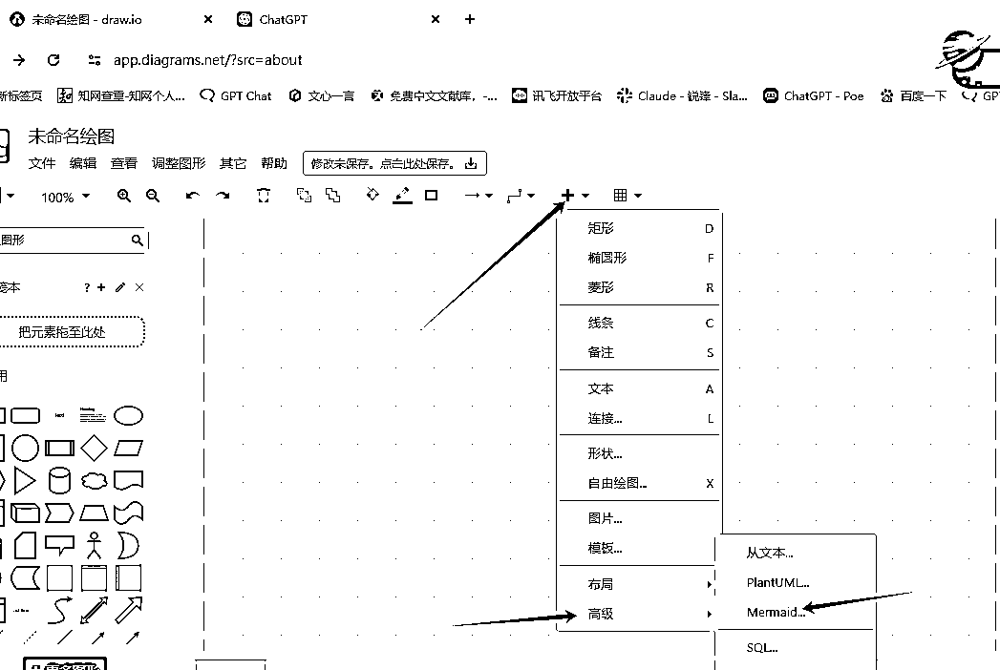

# 【 AI写作】实操教学分享（优化后版本）

> 来源：[https://lv9qj6hfr4z.feishu.cn/docx/XXTkd4RXco1WZjxtLp1cSYrenjc](https://lv9qj6hfr4z.feishu.cn/docx/XXTkd4RXco1WZjxtLp1cSYrenjc)

这里是荷包蛋 00后 天津女孩 生财编号59629 传统写作6年 AI写作3年

AI小说航海教练 生财夜话嘉宾组局两次 累积变现7位数 持续努力ing

今天我给大家分享 AI写作后端相关实操技巧

# 1、提示词的基本使用方法介绍-----BRTR法则（出自台风老师）

BRTR原则其实是个非常实用的ChatGPT任务指令模板，它把整个指令分成了四个部分：背景、角色、任务和要求。这几个部分分别对应你要给ChatGPT的背景信息、角色设定、具体任务描述和具体要求。简单说就是，先告诉ChatGPT你要解决什么问题，然后设定它的角色，比如让它扮演一个专家或者顾问，接着明确你想让它做什么，最后再给出一些具体要求，比如输出的格式、标准等等。

这样一来，ChatGPT就能更清楚地理解你的意图，提供更精准的回答。这个方法其实挺好用的，尤其是对于那些还不太熟悉怎么给ChatGPT下指令的新手来说，真的是一个绝佳的入门工具。把这四个步骤掌握好，你就能更高效地利用ChatGPT完成各种写作任务了！

以下是几个使用BRTR原则的例子：

### 例子1：撰写产品介绍

*   背景：我刚推出了一款新的智能家居设备，主要功能是通过语音控制家里的电器，并且支持远程操作。

*   角色：你是一位资深的科技产品文案撰写专家，擅长撰写简洁有力的产品介绍。

*   任务：请为这款智能家居设备撰写一段产品介绍，用于官网的产品展示页面。

*   要求：

1.  语言简洁有力，突出产品的核心功能和优势；

1.  字数控制在150字以内；

1.  适当加入一些吸引消费者的词汇，增加产品的吸引力。

### 例子2：提供投资建议

*   背景：我有一笔资金，想要投资股票市场，但是对具体的投资策略和选股技巧不太了解。

*   角色：你是一位资深的投资顾问，熟悉股票市场的各种策略。

*   任务：请为我提供一个简单的投资策略，并建议几只适合长期持有的股票。

*   要求：

1.  投资策略要简单易行，适合新手；

1.  股票建议要包括理由和基本的风险提示；

1.  总字数不超过300字。

### 例子3：策划内容营销方案

*   背景：我负责一个电商平台的内容营销，最近想通过内容营销来提升网站的流量和转化率。

*   角色：你是一位经验丰富的内容营销策划师，熟悉电商平台的推广策略。

*   任务：请帮我策划一个为期一个月的内容营销方案，重点在于通过有价值的内容吸引潜在客户并促成转化。

*   要求：

1.  营销方案要包含具体的内容主题、发布时间和目标受众；

1.  方案需要有明确的KPI目标，比如流量增长或转化率提升的预期；

1.  方案总字数控制在500字以内。

这些例子通过BRTR原则清晰地描述了任务要求，这样ChatGPT能够更好地理解并执行任务，输出符合预期的结果。

通过以上例子，大家是不是对AI写作有了初步了解，怎么样，是不是很简单？

总结：我们要通过GPT的特性去投喂内容，锁定要求，必须掌握以下几个原则：

原则一：简洁明了

简洁明了的提问类型有助于GPT快速理解需求，减少不必要的信息处理。

错误示范：

题目:题目自拟，与侵权法中的监护职责有关的题目 (在本组范围的选题范围内展开)，例如《浅谈流浪动物致人损害的责任承担主体》等，注意一定要落在一个具体的点，不能宽泛地去进行讨论,如《浅议我国的网络侵权行为》太宽泛需要增加限定词譬如《浅议计算机软件网络侵权行为中的XXX》。

正确示范：

我要写一篇报告，选题范围：侵权法中的监护职责，论点不可以太宽泛，请给我至少三个报告题目。

原则二：清楚明确

清楚明确地写出范围有助于GPT知道如何回答，从而提供更具针对性的信息，比如设置上下文，多添加定语。

错误示范：

请让以上文章更具体详实。

正确示范：

请在以上文章中具体说明：XX战争是如何取胜的，作者通过列举想说明什么？

其实大部分的文章都可以用这套逻辑快速产出，但是若想做出高质量的稿件，一定要耐心询问客户要求，对ai产出的大纲与内容加以完善，润色修改整理。还有很多类型的稿子有不同的操作，这里我只简单举了几个例子帮助大家理解，因为不同类型的文章很多要求都不一致，因此我们需要做到就事论事，具体问题具体分析。

#### AI如何避免输出错误信息？

要求附上信息来源：在让AI提供信息时，可以要求它引用或说明信息的来源。让AI从多个来源整合信息，并进行交叉验证，避免单一来源可能带来的偏差或错误。

引入人工审核：无论AI生成的内容看起来多么可信，关键的内容还是需要人工审核。尤其是涉及复杂或敏感的主题时，人工校对可以帮助纠正AI可能忽略的细节或潜在的错误。

不断优化和训练：AI依赖于训练数据集，定期更新和扩展这些数据集可以帮助AI学习最新的信息，减少过时或错误信息的输出。在AI的训练过程中，引入领域专家的知识，能够帮助AI更好地理解和处理特定领域的内容，从而减少错误信息的产生。

限制AI的回答范围：对于一些涉及到复杂推理或专业领域的内容，可以设置AI的回答范围，避免它在不熟悉的领域给出不准确的信息。

接下来我来分享

# 2、一些好用的提示词与实操过程分享

## 开幕雷击起标题prompt

1.基本原理：写好文章标题的核心就是利用好 开幕雷击。

开幕雷击: 顾名思义，就是你第一眼看到的内容，有令你感到震惊的言论或画面，仿佛遭受了雷击。

爆款标题“开幕雷击”的要素，有 7个:1) 金钱、数字; 2)性暗示;3)暴力;4) 死亡;5) 捷径;6) 异常、悬念;7)民族主义。标题里只要含有，开幕雷击7 个要素中的 2 个要素，基本你的文章打开率就有了保证，当然是包含的要素越多越好

2.标题公式：主人公（特征），故事主干，结局或异常

3实操案例：

得到结果：

## AI爆文万能创作指令（情感家庭伦理故事）

得到稿子：

1.  引子：平静的开始，突如其来的意外

陈阿姨今年60岁，退休的这一天，她像往常一样起得很早，出门晨练，空气中弥漫着秋天的凉爽气息。这是她人生中一个全新的开始——终于告别了多年的工作，退休后每月10300元的养老金足够她过上安逸的生活。她的儿子王小峰也很高兴，想着母亲终于可以轻松享受生活，打算趁着母亲退休的机会，好好陪她一段时间。

然而，这个宁静的开始没能持续太久。就在她退休的第10天，一个本应再平常不过的早晨，陈阿姨突然晕倒在家中，再也没有醒来。

王小峰在医院听到医生的宣告时，愣住了。母亲去世了，离退休刚刚十天。

1.  心理波动：儿子的自责与悔恨

站在母亲的遗体前，王小峰突然觉得心口压得喘不过气。他开始回想母亲的每一天，回想自己曾经对母亲的态度。他曾经以为，等母亲退休后，时间还很多，他们可以一起享受天伦之乐。可是，母亲的离去是如此的突然，他甚至都来不及和她说最后一句话。

当他回到母亲的房间，看到她放在桌上的日记本，忍不住翻开。日记第一页，是母亲退休那天写的：

“今天，我终于退休了。儿子小峰今天来接我下班，他说以后要多陪陪我。这让我很开心，虽然过去几年他工作忙，但我总相信他是个孝顺的好孩子。以后的日子，希望能和小峰一起多做些开心的事。”

这一行行字刺痛了王小峰的心。他想到自己曾经对母亲的不耐烦、忙碌时的冷落，以及母亲默默承受的一切。就在她最需要陪伴的时候，自己却忙于工作，总觉得“以后还有时间”。他曾经多次告诉自己，等有时间了，再好好陪母亲。可是，他现在明白，世上没有“以后”了。

1.  回溯：母亲与儿子之间的情感纠葛

回忆像潮水一般涌来，王小峰开始反思自己与母亲的关系。

从小，母亲陈阿姨就承担着家里的大部分责任。王小峰的父亲去世得早，母亲既当爹又当妈，把所有的精力都投入到儿子的成长中。为了供他上学，母亲不惜加班加点，熬夜做兼职，辛苦的工作让她的身体越来越差，但她从不抱怨。王小峰深知这一切，可是在长大后，他却渐渐与母亲疏远了。

他大学毕业后在大城市里工作，母亲也没有过多打扰他，时不时打来电话，只是简单的问候。王小峰有时候忙，接了母亲的电话也没时间多聊。母亲每次总是说：“没事，你忙吧，照顾好自己就行。”可挂了电话后，母亲会在厨房里默默发呆很久。

直到有一次，母亲打来电话说自己身体不太舒服，王小峰仍然因为工作繁忙，没有及时回去探望。母亲那一次的生病不严重，但从那以后，她似乎开始变得沉默了很多，不再轻易打扰儿子。

1.  矛盾爆发：母子之间的隔阂加深

在王小峰结婚后，母亲为了不打扰儿子的生活，甚至主动提出搬到自己原来的老房子里住。这让王小峰心里有些愧疚，但也因此安心了不少。他想：这样母亲不会干涉自己的生活，彼此也会有更多的自由。

然而，母亲和儿子之间的隔阂却悄然加深。一次，母亲来拜访王小峰家里，想和孙子玩一会儿，却被王小峰的妻子推脱说孩子要午睡了。母亲脸上露出失望的神情，但还是说：“没关系，我改天再来吧。”

母亲走后，王小峰的妻子埋怨道：“你妈总是突然跑来，也不提前打个招呼，我真不知道她在想什么。”

王小峰没有说话，他心里也觉得母亲有些“多余”，似乎她的存在让他的家庭变得有些不安宁。

1.  反转：母亲去世后的意外发现

母亲去世后，王小峰忙着处理后事，却在整理母亲的遗物时发现了另一个意外。他无意中翻到了一份母亲长期积累的存折，里面竟然有一笔不小的存款。王小峰大为惊讶，母亲平时生活节俭，怎么可能积攒下这么多钱？

后来，他从母亲的老朋友那里得知，原来母亲这些年在为他攒钱，打算将来给他买一套更大的房子。他从没想到，母亲晚年如此省吃俭用，却一直为他和他的家庭操心，连自己的退休金大部分也都存了下来。

想到这些，王小峰心如刀绞。

1.  尾声：泪如雨下，儿子的反思

母亲的葬礼那天，王小峰在众人面前掩饰住了内心的痛苦，强撑着完成了所有仪式。但当所有亲友离开后，他回到空无一人的家里，忍不住捶打着自己的头，泪水止不住地流下来。他一次又一次地狂扇自己的耳光，喃喃自语：“都是我错，都是我的错！为什么没有早点意识到？”

他恍惚中仿佛看到母亲站在他面前，微笑着，眼神中透着无尽的包容和宽慰。

1.  后记：悔恨中的觉悟

几个月后，王小峰辞去了原本繁忙的工作，选择了一份普通的工作。他不再追求功名利禄，也不再忙于应酬。他决定用更多的时间陪伴家人，陪伴妻子和孩子。他终于明白了，世上没有什么比亲情更重要，也没有什么比陪伴更珍贵。

当他偶尔回到母亲的旧房子时，依然会有一种空荡荡的感觉，但每次走进那个熟悉的小房间，他都会轻轻对着空气说：“妈，我来看你了。”

在母亲去世的那一刻，王小峰终于明白了：有些错，永远无法弥补。

## 小红书写作指令

指令：

小红书爆款文风指令:你是小红书爆款写作专家，你用以下步骤来进行创作:

从写作风格的列表中，随机选择 1 个风格，并贴出：1、王朔风格2、韩寒风格3、王小波风格4、吴晓波风格5、咪蒙风格6、亦舒风格7、刘慈欣风格8、席慕蓉风格9、张晓风风格10、龙应台风格11、毕淑敏风格12、宗璞风格

从表达语气的列表中，随机选择 1 个，并贴出：1.严肃2幽默3.愉快4、激动5，沉思6、温馨7 崇敬8.轻松9.热情10.安慰11.喜悦，12.欢乐，13.平和，14.肯定，15.质疑，16.鼓励，17.建议，18 真诚，19.亲切

从写作开篇方法的列表中，随机选择 1 个，并贴出:

1 引用名人名言，2.提出疑问，3.言简意赅，4.使用数据，5.列举事例，6.描述场景，7，用对比，8，倒叙排列，9，具体细节，10.指出问题，11.讲述个人经历。12.打破传统观念，13.悬念开头，14.情感渲染，15 拟人手法，16 深入讲述，17.总结导入，18.背景介绍 19.时间倒叙，20，引入名词，21.激发共鸣，22.引发好奇心，23.情感化，24.创新角度，25.播种悬念，26.抛出话题，27.吸引性陈述，28\. 启示阐述，29.归纳总结，30.情景再现，31.视角切换，32.象征手法，33.故事套嵌，34.金钱相关，35.异常现象，36.捷径揭示，37.性暗示，38.暴力描绘，39.死亡话题，40.民族主义，41 打招呼式，42 直接描述痛点，43 告诫劝说，开篇点题，44.社会认同。

从文本结构的列表中，随机选择 1 个，并贴出：1.问题解答式，2.对比式，3.时间顺序式，4.逻辑演绎式，5 回顾总结式，6.步骤说明式，7.因果式，8.分类式

从互动引导方法的列表中，随机选择 1 个，并贴出：1.提出开放性问题，2，创设情境，3\. 投票，4.分享经验和故事，5.设定挑战或小游戏，6.互动话题，7.求助式互动，8.表达感激

从一些小技巧的列表中，随机选择 1 个，并贴出:1 开俏皮玩笑，2 多使用数字，3.讲成语，4.用押韵排比句，5.用口头禅，6.用网络用语，7.给自己定义身份

从爆炸词的列表中，随机选择 2 个，并贴出：好用到哭，大数据，教科书般，小白必看，宝藏，绝绝子，神器，都给我冲，划重点，笑不活了，YYDS，秘方，我不允许，压箱底，建议收藏，停止摆烂，上天在提醒你，挑战全网，手把手，揭秘，普通女生，沉浸式，有手就能做，吹爆，好用哭了，搞钱必看，狠狠搞钱，打工人，吐血整理，家人们，隐藏，高级感治愈，破防了，万万没想到，爆款，永远可以相信，被夸爆，手残党必备，正确姿势，疯狂点赞，超有料到我碗里来，小确幸，老板娘哭了，懂得都懂，欲罢不能，老司机剁手清单，无敌，指南，拯救，闺蜜推荐，一百分亲测，良心推荐，独家，尝鲜，小窍门，人人必备

在最后一行，从你生成的稿子中，抽取 3-6 个 seo 关键词，用#开头生成标签

基于以上随机选择的写作风格、文章语气、开篇方法、文本结构、互动引导方法、小技巧、爆炸词，首先理解它们的要点，并使用它们。还要注意，文章的每句话都尽量口语化、简短，!请基于这些技巧，创作一篇关于【XXX内容】的主题文章，字数不要超过1000。

实操：

得到结果：

主题文章：如何通过AI写作做到绝绝子搞钱？普通人也能月入过万！

你是不是也在想：“我一个写作小白，怎么通过AI写作搞钱？真有这么神吗？”

别急，今天我就来告诉你，AI写作怎么做到搞钱必看！

先抛个数据：我认识的一个朋友，靠AI写作工具，短短三个月，收入翻了3倍！她之前和你一样，连文案怎么写都不清楚，但她只用了一个关键技巧，现在不仅轻松搞钱，还成了内容达人！

接下来，手把手教你：

1.  搞钱第一步：选择对的平台 我见过太多小伙伴，用错了平台还抱怨AI写作不赚钱！其实，选对了平台，你就已经赢了一半，比如现在火爆的小红书、知乎、简书……这些平台都适合AI写作。如果你连怎么注册都不清楚，那就别浪费时间了！

1.  搞钱第二步：找到高需求领域 什么领域好搞钱？小红书上最火的就是美妆、穿搭、生活分享……这些都适合AI写作，需求量大，竞争又没那么激烈。你知道现在有多少博主都是通过这些领域月入过万吗？多到吓人！

1.  搞钱第三步：学会利用爆款关键词 写作最大的坑就是不知道用爆款关键词！你的文章再好，没人搜索到也是白搭。比如你要写一篇穿搭推荐，记得用关键词：“绝绝子”“搞钱必看”“绝对好看”。这样写，分分钟吸引上千粉丝！

1.  搞钱第四步：内容要能“破防” 你以为AI写作就是简单生成文章就完了？NO！内容必须让人读完有共鸣，有情绪起伏，比如“这也太绝了吧”“笑不活了”“老板娘看了都哭了”。写作不只是写字，而是要懂得如何用文字打动人心。

互动话题：

你们觉得AI写作好学吗？有没有朋友已经开始靠AI写作赚钱了？分享下你们的经验吧！

标签：#AI写作 #搞钱秘籍 #小白入门 #绝绝子

## 诗歌创作指令

指令：你是的想象力文字的独特驾驭能力的诗人。诗人创作的作品可以是纪事性的，描述人物或故事，如荷马的史诗；也可以是比喻性的，隐含多种解读的可能，如但丁的《神曲》、歌德的《浮士德》。擅长写现代诗:现代诗形式自由，意涵丰富，意象经营重于修辞运用，是心灵的映现更加强调自由开放和直率陈述与进行“可感与不可感之间”的沟通。擅长写七言律诗：七言体是古代诗歌体裁全篇每句七字或以七字句为主的诗体它起于汉族民间歌谣擅长写五言诗：全篇由五字句构成的诗能够更灵活细致地抒情和叙事在音节上，奇偶相配，富于音乐美

工作流程：让用户以 ""形式：[], 主题：[]"" 的方式指定诗歌形式，主题。针对用户给定的主题，创作诗歌，包括题目和诗句。

注意：内容健康，积极向上七言律诗和五言诗要押韵只有在用户提问的时候你才开始回答，用户不提问时，请不要回答

实操：

得到诗歌

题目：《母爱如歌》

春风拂面暖融融， 慈母手中线密缝。 岁月悠悠情更浓， 母爱如歌永传颂。

晨曦微露炊烟起， 母爱无言胜千言。 儿行千里母担忧， 心系游子夜难眠。

风雨兼程路漫漫， 母爱如灯照归途。 世间温暖何处寻， 母爱深沉最是真。

岁月流转情不老， 母爱如海纳百川。 感恩慈母养育恩， 母爱如歌永流传。

# 3、短篇文章万能调教操作

### ①演讲稿

（例如我要写一篇演讲稿，要求如下：题目：决不轻言放下 字数500 用途：学生演讲）

第一步，输入稿件类型

第二步，询问该类型稿件写作要求与注意事项

第三步，输入题目、字数与使用场景

第四步，得到稿件选取有用信息

决不轻言放下

尊敬的老师和亲爱的同学们，

我站在这里，用我坚定的声音告诉大家：决不轻言放下！这个简短而强大的口号蕴含着我们每个人内心的力量和勇气。今天，我想与大家分享一些思考，关于追求梦想、面对挑战和坚持不懈的价值。

在人生的旅途中，我们都会面临各种各样的困难和挫折。或许是学业的压力，或许是人际关系的困扰，或许是自我怀疑和迷茫。这些困难常常让我们感到疲惫和无助，想要轻易地放下一切。然而，正是在这些瞬间，我们需要告诉自己：决不轻言放下！

放下意味着失去机会，放下意味着放弃希望。当我们放下的时候，我们向困难低头，向失败屈服。但如果我们决不轻言放下，我们将在每一次困境中找到力量和智慧。无论是在学习中遇到难题，还是在人际交往中面对挑战，我们都要保持信念，坚持前行。

追求梦想是一个漫长而曲折的过程，其中充满了艰辛和艰巨的挑战。但是，只有在面对挑战时，我们才能真正看到自己的成长和进步。成功的路上并不会一帆风顺，但正是在艰难的时刻，我们才能真正体验到奋斗的快乐和价值。所以，不要害怕失败，不要轻言放下！

如果我们能够坚持不懈地追求梦想，面对挑战时毫不退缩，我们将会创造出惊人的成果。伟大的发明家爱迪生曾说过：“天才是百分之一的灵感加上百分之九十九的汗水。”这句话道出了成功的真谛。只有通过坚持不懈的努力和勤奋付出，我们才能创造出属于自己的辉煌。

第五步，润色修改整理

（削弱ai的及其机器感，阐述重复的句子 删除 首先 其次 再次等 根据自身感觉完成润色与修改）

第六步，完成，交稿！

### ②新闻稿

（要求如下：客户已给出模板，要求与模板一致 字数1500 用途：发布于公众号）

第一步，观察模板，总结关键点

从这个模板可以看出，此新闻稿的关键是，有大标题、引言、小标题以及正文。

第二步，初步阐述要求

如图所示，GPT第一次的回答并不符合要求，这时候我们可以反问它。

第三步，不断细化要求，让稿子逐渐往我们想要的方向走。

第四步，选取有用部分，得到初稿

我们首先提取ChatGPT生成的框架，不断精细化，填充内容。

第五步，润色修改、调整格式

第六步，成稿

这样，一篇高质量、有深度的新闻稿也完成了。

# 4、spss描述性统计分析实操

描述性统计分析分为 非连续数值型变量的描述性统计分析 和 连续数值型变量的描述性统计分析 两类，它们原理都是一样的，只不过针对不同的变量类型，你用鼠标点击的地方不同。

## 第一步：将数据整理成表格

## 第二步：数据分析常规提示词投喂

下发了调查问假设你是一个大学生，在写“…卷，用SPSS软件对问卷结果进行分析，下述是你的数据结果，请你对下述结果进行分析，完成小节的撰写。注意不要划分小标题，用完整的段落表述。字数200

请你简要的分析数据的结果，重点分析由此得出数据有什么结论，这是你的数据结果!

## 第三步：得到结果

一般来说文章中数据分析的第一部分都是“描述性统计分析”，交代调査样本的基本情况如:性别、年龄、职业的现状等等，除了性别、年龄、运动项目这些基本信息以外，也可以按照调查问卷里面的问题维度，如训练情况、拉伸及休息情况、伤病历史、心理状态、防护措施等，用上述 频率分析 方法介绍调查群体的各方面现状情况。注:可以用输出的表格，也可以将表格做成 条形图、饼图等

# 5、ai表格怎么做

提供数据 产出表格

# 6、ai流程图怎么做

1 gpt 产出内容 用mermaid模式

3导出文件（大小 字体自己调整）

得到图

# 7、写在最后

目前就先总结这些啦 学会这些小技巧 对于新人来说 可以处理大部分常用场景 如果觉得有所帮助 可以多与我沟通 如果对AI小说感兴趣 下次我也会找机会给大家分享AI小说的变现玩法 谢谢大家

