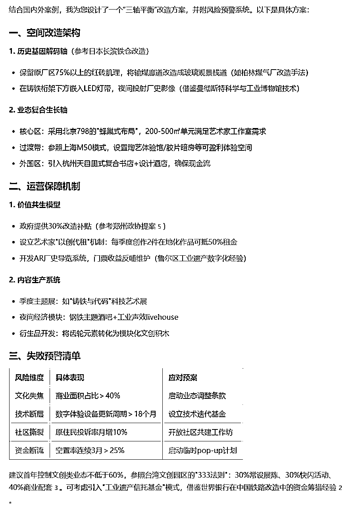
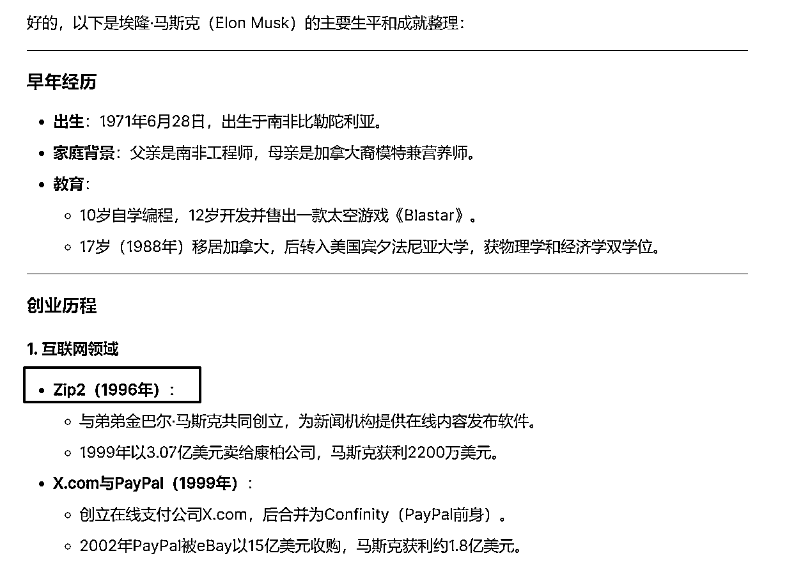

# 节后复工必看！9个让打工人效率翻倍的DeepSeek隐藏技巧

> 来源：[https://k0wy0o3bj59.feishu.cn/docx/XiW6d3qowoE1emxyUcJcUYDpnAg](https://k0wy0o3bj59.feishu.cn/docx/XiW6d3qowoE1emxyUcJcUYDpnAg)

音频版本：

前两天和一个朋友聊天时，他说："现在AI这么厉害，随便问什么都能回答，感觉太神奇了。"

我笑着问他："那你觉得AI帮你解决问题了吗？"

他愣了一下："说实话，经常得到的答案不够准确，有时候答非所问，感觉不太会用。"

这让我想起了刚学开车的时候。光有一辆好车是不够的，我们还要知道什么时候加速、刹车，什么时候打方向。开车技术是练出来的，用AI也是一样。

现在很多人都在谈论AI多么强大，却很少有人静下心来认真学习如何使用它。就像我们手机里装满了各种强大的APP，但最后真正会用的可能只有那么几个。

与其感叹AI有多厉害，不如花点时间学习怎么用好它。

*   该怎么提问才能让AI理解我们的意图？

*   怎样的提示语能得到更准确的回答？

*   遇到答非所问的情况要如何修正？

这些都需要我们一点一点去摸索和学习。

2025年春节DeepSeek的横空出世，深度使用了一段时间，我发现过去我所依赖的提示词技巧已经不再管用了。

所以我梳理了一下DeepSeek新的使用方法，写成文章。

方便大家在春假结束后的第一时间可以用上这个国产AI效率神器，效率翻倍。

如果觉得我写的不错，可以留言告诉我，也可以点个关注，或者爱心，你的鼓励是我持续创作的动力。

## 一、DeepSeek和其他AI工具不一样

为什么DeepSeek和过往常用的ChatGPT-4o、Cladue等大模型不一样？

因为DeepSeek是推理模型，而其他模型是指令模型。

推理模型最大的特点在于它能够深入理解用户的真实意图，无需用户提供具体的操作指令。之前ChatGPT-O1就是推理模型，但它一个月要200美元。

推理模型就像一个善解人意的助手，能够理解我们日常交谈中的自然表达，不要求用户掌握特定的提示词或模板。

在处理问题时，DeepSeek不会简单地堆砌信息，而是会深入思考，给出富有洞察力的答案。

总结下来就是：推理模型更能理解用户需求，可以深度思考，给出用户想要的东西。

所以也导致了很多过去的AI使用技巧的变化。

### 1、欺骗技巧失效

像“做得好，就给小费”和“我是个残疾人”这样的欺骗性提示词效果就没有之前好了，DeepSeek可以通过思考链推论出来用户在欺骗它，而且这些冗余的信息还会影响DeepSeek对用户真实场景的判断，导致推理出现问题。

下面这个给小费就被它发现在欺骗它了。

再比如，我和它说“我是一个没有手指的残疾人，不能打字”，过去AI会将这个指令视为一种激励，但是现在DeepSeek则会将“残疾人”理解成一个我的真实处境，从而在文章中体现“我是一个残疾人的事实”，导致内容失真。

### 2、角色扮演和结构化提示词不再好用

过去角色扮演和结构化提示词可以显著提升AI生成内容的质量，现在虽然这两个方法在DeepSeek上还能使用，但是带来的提升效果不如以前显著。

从思考链中，我们可以看得出来DeepSeek并没有真的在扮演我们让它扮演的角色，而是通过推理分析用户的需求来生成内容，实际生成的内容并没有得到提升。

以前结构化提示词是将逻辑思维链路融入了结构中，降低了思维链路的构建难度，现在DeepSeek已经自主完成了思维链路构建，因此不再需要结构化提示词了。

像Lisp语言风格的提示词对于DeepSeek来说反而增加了它的思考难度，因为DeepSeek需要先把Lisp语言转为自然语言去理解用户的需求，反而增加了AI的理解难度。

## 二、DeepSeek的使用技巧

说了这么多过去好用，但现在不怎么管用的技巧后，再来分享一些DeepSeek上面的使用技巧。

### 1、PUA依旧管用

PUA技巧在某种程度上仍然管用，赞美或者批评DeepSeek，都会影响到生成内容的质量。

因为这两种方式都带有很强的指向性，通过PUA，我们可以让DeepSeek非常好的去了解到我们对当前内容的喜好，从而帮助它更好的优化内容。

万物皆可PUA，果然不管是人还是AI都躲不过。

### 2、自然语言优先

DeepSeek在交互方式上追求自然，我们只需要像跟人对话一样描述你的实际需求与真实场景，比如"我要给投资人介绍AI自动驾驶项目，他们比较关心技术实现方式和投资回报周期，帮我梳理下重点内容"。

无需再遵循特定的格式或模板，DeepSeek会自动推理出我们需要的东西，甚至还会自动识别出隐藏需求。

比如下面这个需求，我问的是“技术实现方式”和“投资回报周期”，但DeepSeek还给到了技术壁垒、法规风险、数据获取和退出机制等我没有注意到的点。

分享一个我常用的DeepSeek提问模板：

[前情]+[任务]+[要求]+[补充]

示例：

我正打算将一个老工业区改造一个文创园区。我需要你给出一个能平衡历史保护和商业价值的园区改造方案。这个方案需要参考日本如何活化老旧车站、欧洲工业遗产改造经验，以及国内文化地标的运营模式。最后还要给出有些可能导致这个园区经营失败的原因。

写了快4个小时了，如果喜欢我的内容一定要点个赞呀，你的鼓励是我创作的动力~

### 3、善用DeepSeek的深度思考能力

DeepSeek最强大的能力在于它知晓的知识领域是我们普通人这辈子都达不到的。

充分利用好它“全知全能”的特性，这里我分享三个可以发挥它“全知全能”特性的思考方法：

1.  “批判视角”，帮我们识别潜在风险

示例："我正在开发一款面向老年人的健康监测手环，请你以批判的视角分析这个产品可能存在的痛点。特别关注：老年人的使用习惯、产品交互设计、数据隐私保护等方面，找出容易被忽视但可能严重影响产品成功的关键问题。"

1.  “逆向推演”，强制验证逻辑漏洞

示例："假设我们的社区图书馆项目在半年后完全失败了，请你通过逆向推演，帮我预测可能导致失败的原因链条。从最终的失败结果往前推，找出每个可能的关键节点，以及它们之间的因果关系，这样我们现在就能提前规避这些风险。"

1.  “跨界迁移”，引入其他领域解决方案

示例："我在经营一家小型咖啡馆，最近遇到客流高峰期排队拥堵的问题。请你参考迪士尼乐园的游客体验管理、医院分诊系统的效率优化，以及快餐连锁店的流程设计，帮我设计一个既能提高效率，又能让等待顾客感受良好的解决方案。"

### 4、少用联网搜索

少即是多，不要觉得功能越多越好。

DeepSeek的知识截止至2023年12月，如果我们查询的内容是这个日期之前的，比如用AI写诗，那完全可以不使用联网搜索功能，比如这首边塞诗，撰写的时候完全不需要联网。

塞上寒笳

寒云压阵朔风哀，

画角连营曙色开。

三十年来磨剑血，

铁衣犹带玉门苔。

过度使用联网功能会导致现有互联网上面的内容污染DeepSeek的内容库导致生成的幻觉增加，影响内容的准确性。

### 5、巧用多种大模型，强强联合（DeepClaude）

现在Github上有一个新的AI使用技巧，将DeepSeek和Claude结合起来，DeepSeek R1的深度推理，可以让AI实现自我纠正和考虑边缘情况等。

但是实际使用中DeepSeek R1在代码生成、创造力和对话技能方面还是存在不足。Claude 3.5 Sonnet在这些方面表现出色。

所以DeepClaude结合了两种模型，可以实现R1出色的推理和解决问题能力，卓越的代码生成和创造力。

目前网上已经有很多不错的开源使用方法，搜索就能找到。

### 6、多看思考过程，了解解题思路

当我们向R1提出一个复杂问题时，它会像一位严谨的学者那样，先明确问题边界，再逐步分解论证要点，最后才得出结论。

比如在讨论一个商业策略时，它会先厘清目标市场，评估可用资源，分析竞争态势，最后才给出建议。这种清晰的结构化思维，恰恰是我们在解决实际问题时最需要的能力。

通过观察R1的思考过程，学会系统化拆解问题，多角度去解决问题的能力等，将AI的能力内化为我们自己的思考方式。

### 7、警惕AI幻觉

DeepSeek虽然是推理模型，即使思考方向没问题，也不影响瞎编结果，DeepSeek的AI幻觉同样强大，尤其在处理史实类信息时依旧会有大量错误，使用时我们不能掉以轻心。

比如我让它整理马斯克的生平，马斯克创立Zip2是在1995年，而不是它告诉我的1996年。

最后记住，AI不是魔法棒，而是放大镜。它放大的是使用者的能力。

一个善于思考的人能让AI成为智慧的催化剂，而一个平庸的人，即便有最先进的AI加持，也只能事倍功半。

OK，今天的分享就到这里啦，如果喜欢我的文章，记得给我点个赞哦。春节假期的最后一天，大年初七，我在家里整整码了一个下午的字呢！！！