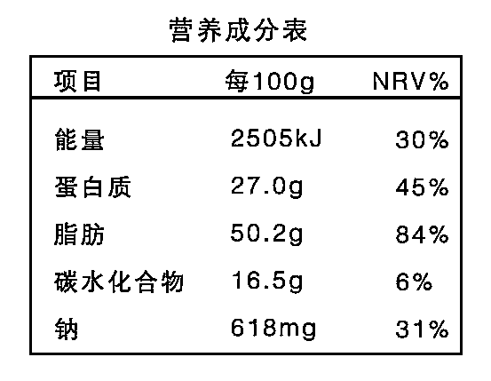
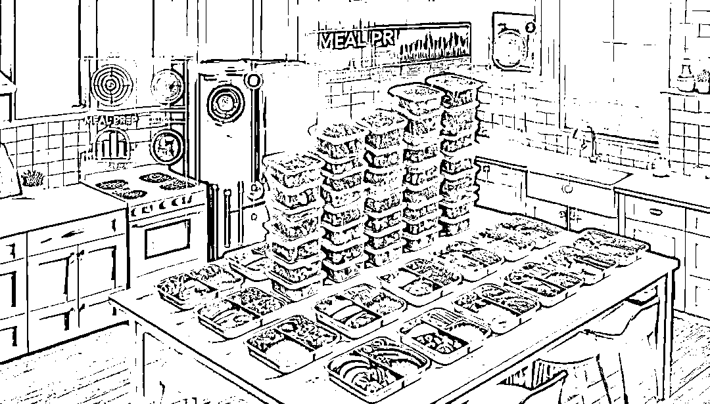

# MealPrep改良版高效备餐指南

> 来源：[https://x8v5nxpql1.feishu.cn/docx/EHDId7hUPomSrkxudLecEBqRnSe](https://x8v5nxpql1.feishu.cn/docx/EHDId7hUPomSrkxudLecEBqRnSe)


# 前言 什么是Mealprep?

MP的概念最初流行于欧美健身圈，指的是在空闲时间一次性制作多份同样或者不同组类的便当，并将制作好的成品组装到便当盒中，放入冰箱进行保存，在工作日吃的时候，简单加热即可。

美式MealPrep通常会由三个部分：碳水主食、蛋白质肉类、和一些可以存储较长时间的蔬菜（根茎类或者菌菇类）组成，吃的时候再搭配一些现做的绿叶蔬菜和一些生食蔬果，在方便的同时，可以保持营养均衡。

但这种备餐方式的缺点也比较明显，就是口味比较单一，容易失去饮食兴趣，不利于长期培养良好的饮食习惯。像是这类备餐计划，适合有着严格饮食计划的健身党朋友们，以及想要提高时间效率，初次开始尝试MP备餐的朋友们。

与之相对的就是另外一个流派，这个流派即讲究方便，也讲究营养均衡，口味搭配，它就是日式MP家庭常备菜。其实就有点像预制菜，通过食材的种类进行分类储存，将准备好的菜品分装到保鲜盒、保鲜袋中。

包括可以选用冷藏、冷冻、真空、保鲜袋+厨房纸&水的方式，来保证食材的新鲜。在平时吃的时候可以直接现吃现做，在满足自身的饮食需求和营养需求的同时，快速减少单次备餐的时间。

日式家庭备餐通常以主食、主菜、配菜的准备为主，缺点就是食用时需组合，制作完毕后，还需要清理锅具，对于一开始想要提高效率的目的而言，方便的属性可能会相对欠缺一些。但相较于单次制作而言，还是可以节省不少时间的。

这种备餐方式基本上适合所有的人群，比如：上班族、宝妈、学生党、家庭主妇等...我个人也是比较偏向于这个流派，但我自己的做法是对两种流派进行结合，并进一步升级。

那么，我们具体该怎么实操，并结合MP来制定自己的饮食计划呢？这就是我接下来要为大家分享的内容，希望能帮助到大家有所收获。

🟢以下为本篇文档的内容概览

* * *

# PART1 如何进行备餐|健身人群专属

那么，我们具体该怎么实操，并结合MP来制定自己的饮食计划呢？

其实只要学会一些简单的计算方法，学习一些简单的搭配方式，再掌握一些基本的储存方式就可以开始着手进行准备了。我在这个部分，先给大家分享传统美式的备餐方法，相较于日式MP会简单一些,思路都是一样的,也方便大家能够直接开始上手。

## 1.1 需要了解的基础概念

我们首先要了解的是我们的基础代谢，也就是一天下来会消耗多少kcal。但并不推荐使用传统公式去进行计算，因为每个人的基础代谢都有所不同，其中可能影响的因素包括代谢水平、活动消耗、体脂肌肉占比等...

举个例子，在相同体重下，代谢水平是：健身人群＞肥胖人群＞一般人群，健身人群代谢，如果采用传统公式，那么就会产生较大的误差。

像是健身食谱的总量安排，可以参考健身圈和科学界，总结出来的经验化配额，对三大营养素按照体重单位进行总量分配，一方面定下三大营养素就等于定下了总能量（碳水4.1kcal/g，蛋白质4.1kcal/g，脂肪9kcal/g），另一方面它也规定了三大营养素的比例（【每公斤体重*营养克重】/总能量=所占比例）

在减脂期，新手可以碳水3.5g 蛋白质1.5g 脂肪0.8g；有训练史可以碳水3.5g 蛋白质2g 脂肪0.8g，在体重下降后（推荐单月2-5斤，防止后续反弹），可以定期逐步调整碳水量，以适应新的代谢水平。

在增肌期，新手可以碳水3.5g 蛋白质1.5g 脂肪1g；有训练史，碳水4g 蛋白质2g 脂肪1g，在增肌阶段推荐单月增长1-3斤），同样通过保持蛋白质与脂肪的总量不变，调节碳水，以此来实现总量的控制。

计算事例

假如我75kg，有底子，我需要增肌，那么根据份额计算，碳蛋脂的就是300g（75*4）：150g（75*2）：75g（75*1），那么总能量就是1230（300*4.1）+615（150*4.1）+675（75*9）=2520kcal

当然，这些都只是经验化的分配方法，网上关于分配数额的方法也有很多，道理都是大同小异的。对于我们新手朋友来说，总的逻辑只要掌握，增肌蛋白质分配多一些，减脂碳水分配少一些，脂肪不变就可以了。

我们可以前期带入体重进行计算，通过一周饮食的体重观察，不断进行AB测试，来判断自己的实际水平。如果不变，说明刚好处在热量平衡点，以及一个正常的代谢水平，如果有变动，根据上面的方法进行调整，增加或减少备餐的能量即可，同时需要考虑到自己单周的运动消耗，和摄入食物相对准确的能量，尽可能降低误差，便于我们后续的计划调整。

这就是关于健身食谱总量的计算，那么在计算完我们单日的总量后，我们就可以得知我们一周备餐的总能量，也就是单日能量*备餐日数。

## 1.2 食材的配比及选择环节

那么总量确定了，接下来就到了选择食材的环节了。

在食品热量的计算上，首先先确定重量，也就是备餐的可食用部分，像新手开始的计算，可能会犯以下几个坑，举几个例子：

比如500g的苹果，去核，实际可食用部分只有380g左右；

一些蔬菜瓜果也需要计算去皮、去壳、去叶后可食用重量；

生与熟的计算也有不同，比如生米和熟米，生米是100g有70g碳，而熟米则是100g只有20多g碳左右......

不同食品的加工方式不同，能量也有所不同，在食物的加工制作上：蒸煮<炒制<油炸，包括一些包装食品、糖油混合物，新手一开始不会计算，是比较吃亏的...

我们首先需要确定食物的能量，第一步是要学会看《营养成分表》。



我们来看这张营养成分表，它告诉我们这个食品，每100g重量含有16.5g碳水、50.2g脂肪以及27g蛋白质，每100g的能量是2505kj，也就是598.7kcal（1kcal=4.184kj）。

后面的NRV%是该食物所包含的推荐我们单日一天的总摄入量比例，比如说我们经常关注的钠含量，这100g就包含了全天推荐量的31%，全天推荐量也就是2g。

在学会看《营养成分表》之后，我们在购买食材以及选购食品时，也可以通过工具来帮助我们计算具体能量，像是一些健康类减脂与饮食管理的程序，还有各类线上官网的产品信息，也可以借助AI来辅助进行对应食物数据信息的搜索。


那么接下来就到了我们的实操环节，在备餐中，我们首先要先确定蛋白质的总量，随后再确定碳水的总量，最后再从其他食物里分配脂肪。

在此之前我想给大家提一个问题，我们为什么要先确定蛋白质，再确定碳水呢？大家可以先思考一下，下面我来给大家进行实例讲解。

还是拿之前75kg增肌期举例子，我们单日需要碳水300g、蛋白质150g、脂肪75g，我们尝试用以下食物清单来尝试进行搭配组合。


1.  首先是蛋白质，我们选择鸡胸作为我们的主要蛋白质来源，150g鸡胸肉中包含24.6g蛋白质，我们需要609g的鸡胸来满足我们全天的蛋白质需要。同时需要注意609g鸡胸肉大概包含11.6g的脂肪，这个需要计算在总量内，不能忽视。像碳水0.6比较低，就不用考虑单独进行计算了。

1.  碳水，300g中包含77.2g的碳水，我们就需要389g生米来满足我们一天中的碳水需要，同时我们会发现其中还有3.5g脂肪，需要考虑。

1.  之后就是脂肪的75g了，在此之前我们已经分配了15g（11.6g+3.5g）的脂肪，那么我们还可以进行60g脂肪的分配，也就是68g肥肉。

1.  那么我们就确定了我们一周的采购清单，假设备餐五日，那么就需要一次性采购3kg的鸡胸，1.945kg的生米，以及340g的肥肉。并结合上文所述，搭配蔬菜及新鲜水果，那么在材料准备环节就完成了。

1.  补充说明：不是说脂肪推荐肥肉啊，是方便大家计算所举的例子，不用当真~

当然，以上仅为方法演示，尽管上述搭配确实没有什么问题，但美式MP的缺陷就出来了，品类单一，微量营养元素不均衡。假设我们每天就吃609g的鸡胸肉、389g生米以及68g肥肉，那么一段时间后就会出现营养不良的症状。

所以我个人经验化的备餐，会空出一些能量，来分配给水果、坚果、糖油混合物等种类的食品。并且根据当日饮食计划，调整运动水平，像是做20min的有氧运动。

这里要提一下，增肌阶段时，单周可以安排两次短有氧（不超20min），或者一次长有氧（40min）。有氧的主要作用是提高心肺，消耗过剩能量，增肌阶段应尽量避免长时间的有氧，在蛋白质给够的情况下，能够把肌肉损失降到最低。

在单日三大营养素的日内分配上，蛋白质、脂肪均匀分配，训后多一些碳水即可。这样就可以降低一开始的学习难度，从而帮助我们更好的进行备餐。

## 1.3 食物的加工与保存环节

那么在采购完成后，就到了我们的食物加工以及保存环节，有经验的备餐者，除了会对食材精确计算外，还会同时进行多线程备餐。

拿【主食】-【米饭】来举例子，它是所有烹饪环节里面时间最长的一个。那么就要在一开始的时候就要着手进行准备，待到其他餐品结束后，它也就跟着一起好了。

另外在米饭加工上还有几个额外需要注意的点：

01.白米饭可以混合糙米、藜麦米、燕麦米等粗粮进行组合，在能量相同的同时，有效降低精制米面的比例，提高谷物占比，摄入更多的维生素和膳食纤维。米饭在蒸煮时，加入与之1.2倍体积的水，这样蒸煮起来会获得更好的口感。

02.生米与熟米的转换是2.2-2.8倍，实测下来在2.3左右。也就是100g生米等同于230g熟米，但是反过来230g熟米却不一定是100g生米，所以我在米饭蒸煮好之后，会计算蒸熟后的总重量。通过“能量守恒定律”，均分成备餐天数，也就可以在蒸煮好之后，确定好最准确的能量，做出精确的分配。

在肉类上，我一般会跟米饭制作同步进行，或者提前腌制，在制作时按照自己的口味进行加工（调料热量不计算，但是烹饪的盐、油量需要注意），这里推荐鸡胸肉、牛肉，以及虾肉（海鲜类不易保存，需要优先前几日进行食用）。

像是肉类还会存在一定生熟比重的概念，像是鸡胸肉生熟比是80%，也就是100g在经过加工后损失水分，会降为80g。这时候计算热量，跟与米饭一样，继续保持原来（100g生鸡胸）的能量即可，避免摄入过多蛋白质，导致能量增加。

讲到这里，大家可能感觉每一步的数据都要很精确，但其实并不是的，在不考虑个体差异、运动水平波动、吸收率等情况下，食物之间的差异是绝对存在的。我们只能尽可能接近，但永远无法做到准确无误。

所以刻意的追求数据值，其实是不对的，这些所计算得出的数据，主要还是起到指导作用，帮助我们更好的进行感知，而并非全部。

在蔬菜的选择上，一起参与备餐的蔬菜，可以选择那些根茎类、菌菇类等，富含纤维且水分含量不高的蔬菜进行提前备餐。

例如：莴苣、山药、西兰花、胡萝卜、西芹、芦笋、笋、豆角、香菇、杏鲍菇、彩椒等，这类蔬菜一般都能在保存加热食用后，保持较好的口感，对我们备餐来说都是比较不错的食材。

在额外的生鲜蔬菜类选择，除了各种绿叶菜之外，一些可生食类的蔬菜也是不错的选择，除了减少加工环节所带来的营养损耗，只要保存得当，就可以避免大幅的营养流失。例如：黄瓜、番茄、生菜、紫甘蓝、芝麻菜、甜椒、洋葱、卷心菜、牛油果、紫苏叶等，每天随备餐安排350g左右（生重）即可。

那么大家可能会要问了，这么多蔬菜，能量不会超出配比吗？

哈哈，蔬菜的热量其实是非常低的，大部分100g才只有几g的碳水。所以我们不计入总量内，但要注意，像是土豆、玉米、黄豆、豌豆等，其碳水部分的能量是很高的，不能看作蔬菜，要按照主食来计算。

## 1.4 食物的保存环节

那么，我们制作环节就告一段落了，就到了最后一个环节-保存环节。

一般情况下，假设我们单次备餐5天时，我们会在分装时把所有加工完的食材进行统一装配，在这个环节我们需要购入一些餐盒用来保存备餐，以及一个小型电子秤，用来进行分装，把所有加工后的食品均匀分成5份后，再灵活的分配单日量。

在保存上，尽可能选择那些封闭性好一些的餐盒，这样会尽可能的保存好备餐，并维持口感。如果想要省事，还可以购入一次性饭盒，但是虽然便宜又省事，但不太环保，所以个人是不太推荐的。

前几天备餐放入冷藏，吃的时候微波炉加热两分半，后面几天放入冷冻，在吃的前一天晚上，放入冷藏解冻，第二天加热即食即可。

以上便是美式MealPrep备餐的介绍，接下来在美式的基础上，我会给大家介绍我的日式改良版备餐方案。

## 1.5 常见的问题回答

### Q1：一次性准备这么多天的食物需要多久的时间？

一般来说单次备餐在2-3h左右

### Q2：保存问题，肉隔夜没问题，那蔬菜隔夜后不是就不好了吗？

蔬菜随着烹饪后时间的变长，营养会不断损失，我们提前在备餐里准备的蔬菜，更多的作用是丰富口感，以及增强食物的搭配，最主要的蔬菜营养来源还是在生食果蔬的部分，所以不用太担心蔬菜营养部分的缺失。

像是网上流传隔夜的亚硝酸钠，实际冷藏保存的情况下，远低于实际危险摄入值，所以可以不用特别担心。

### Q3：备餐的大概成本？

成本没有太高，像我现在每周备餐5天，正常下来不超150，平均下来单顿的成本在10元左右，健康又绿色。

* * *

# PART2 如何进行备餐|日式&膳食指南改良版

在上一个Part的内容中，虽然美式MealPrep适合的是健身的朋友,但是相信大家通过内容,已经初步搭建了一套自己备餐的思路框架。

这也为我们接下来这一部分的内容打下坚实的基础，在学习改良版日式备餐的过程中，能够变得更加轻松，更容易理解，快速开启自己新的备餐计划。

## 2.1 需要了解的基础概念

为什么会是日式常备菜-改良版呢？是因为我发现，在备餐环节中，大部分朋友们遇到的最大问题。不是不会“吃”，而是不知道该怎么“吃”。

可能更多对于健康饮食的概念就是，多吃清淡些的食物，少吃油盐热量高的食物...但是一旦涉及到具体的饮食方案，就会不知所措，尤其在我们备餐的准备环节，直接就懵了...

所以我将《中国居民膳食指南》上，有关食物每日推荐值的部分，以及一些饮食建议，作为改良化的纲领内容，并结合日式备餐的方法进行组合，也就有了改良版的备餐方案。

这样组合的好处，一方面可以更好的对食材量进行配置，另一方面在满足了方便的同时，更符合我们的饮食习惯，进一步提高了备餐的快捷性与实践性。


## 2.2 食物能量的计算部分

在开始备餐计划之前，我们第一步要做的仍然是先计算我们的全天能量，来帮助我们更好地进行食谱。

这里给大家提供两种公式，可以进行综合计算参考，需要注意的是，代谢公式所计算得出的代谢水平，对我们来说，仍然只能作为参考，后续在食谱的实际搭建中，需要再根据自己的实际情况进行调整。

第一个公式，是使用最多的一个公式，它是根据你身高、体重、年龄来进行计算，公式如下：

```
a.女性基础代谢公式：
661+9.6体重(kg)+1.72身高（cm)-4.7*年龄

b.男性基础代谢公式：
67+13.73*体重(kg)+5身高(cm)-6.9年龄
```

举个例子，一名成年男性，年龄22，身高178cm，体重74kg，代入计算可得：

基础代谢=67+13.73×74＋5×178-6.9×22＝1821.22kcal

另一个是通过体脂来计算代谢水平，这也是目前相对来说，最为接近真实代谢的一种测量方法。因为我们都知道，在同等体重下，肌肉量多的一方，代谢会明显更高。

而提升代谢量的唯一途径，也就是进行力量训练。但在使用上述公式计算时，就会产生严重误差。所以肌肉量多一些的朋友们，可以采用测量体脂的方法来计算基础代谢水平（所有人群均可适用于体脂测量法）

但使用体脂测量法仍然会有很多问题，虽然这种方法最真实且接近咱们真实的体脂水平，但麻烦的就是你需要去医院用体脂分析仪进行测量（且后续也会出现波动）。

但我们仍然有另外的两种方法，对自身体脂率进行计算。

第一种方法是采用传统的计算公式，它是根据你的腰围、体重这两个参数进行计算，公式如下：

```
a.女性体脂率计算公式
参数a=腰围（cm）×0.74
参数b=体重（kg）×0.082+34.89
体脂肪重量（kg）=a－b
体脂率=（身体脂肪总重量÷体重）×100%
```

```
b.男性体脂率计算公式
参数a=腰围（cm）×0.74
参数b=体重（kg）×0.082+44.74
体脂肪重量（kg）=a－b
体脂率=（身体脂肪总重量÷体重）×100%
```

第二种方法，其实算是一种比较偷懒的方法，就是可以利用下面的这张体脂率图片，来预估自己的体脂率，虽然相对没有上述方法计算精准，但得出的结果实际测量还是相对准确的。


在我们得出体脂率后，就可以将公式代入计算，得出我们的基础代谢水平，基于体脂计算代谢水平的公式如下：

```
基础代谢（千卡/天）=21.6×瘦体重（千克）+370【瘦体重=体重×（100%-体脂含量）】
```

同样拿上文来举例子，假设我的体脂率大概在20％左右，那么就可得代谢水平为：21.6×（74x0.8)＋370＝1648.72kcal。由此可以看出，这两种代谢测量水平会有些许差距，但通过这两个公式的计算，我们由此得出了两份基础代谢值。

第一个是1821.22kcal，第二个是1648.72kcal，也就是说初步确定了我们的基础范围在1648-1821左右，在此情况下可以选取两者的平均值1730kcal，作为我们前期制定备餐的参考值，后期再通过不断调整，确定具体范围即可。

但相信各位朋友可能又要有其它疑问了，如果涉及到其他更多因素，咱们这个代谢值会不会产生较大的波动，是否能满足人群的普适性，这里就要对代谢问题的概念进行延伸拓展了。

我们所消耗的每日能量，实际上由三个部分组成，第一个是基础代谢，占我们身体总消耗能量的60-70%，第二个是身体活动，占比15-30%，第三个是食物热效应，占比5-10%。


也就是说我们通过公式计算所得出的能量消耗，实际上是我们总能量的70%左右，还会有大概30%左右的部分是没有考虑在内的。

在上一部分食物总量计算的过程中，蛋碳脂三者所给出的能量比例，实际上是把剩下两个部分综合考虑在内的。主要也是因为力量训练的计算消耗差距很大，光是训练内的影响因素就有动作、重量、频率、组间休息时间等，这还不考虑其他因素（同时补充一句，像是力量训练这类无氧运动的实际消耗能量，远远小于各类普通有氧运动，不能想着纯无氧减脂，只能是结合饮食协同控制）...

所以一般，我们传统的基础代谢公式后面，还会再结合运动水平系数，或者结合身体活动强度的计算，来进行弥补这一缺陷。大家可以参考如下系数，代入相乘即可。

```
少量运动：基础代谢*1.15
轻微活动：基础代谢*1.3
中等活动（周3-4次左右） 基础代谢*1.4
健身活动（周3-4次左右）基础代谢*1.6
```

而食物热效应，主要是指人在摄入食物的过程中所引起的额外能量消耗。指人体在摄入食物后所发生的一系列消化、吸收利用、营养素及其代谢产物之间相互转化过程中所消耗的能量。

同时，食物热效应所产生的能量大小主要与食物的营养成分、人体进食量以及进食速度有关，这点在运动系数中也有包括，我们就不用再过多考虑了。

而通过以上的计算方式，就可以得出与我们最为接近的全日能量，更好地进行整体的计算，防止因为数据计算错误，而导致后续整体能量的盈亏。

## 2.3 食物的分配环节*

接下来就到了最重要的分配环节，也就是“怎么吃？”、“吃什么？”

我们这部分整体的饮食结构，主要是基于《2024中国居民膳食指南》进行搭建。按照其推荐量的谷薯类、蔬菜水果类、禽畜鱼蛋奶类、大豆坚果类、以及油盐用量，来确定食材选择的用量及范围，同时进行均衡分配。

通过对于书中内容的拆解，由此可得如下与备餐有关的关键性内容：

```
1.平衡膳食模式中碳水化合物供能在膳食总能量的50-65%（谷薯类为主），蛋白质占10-15%（畜禽肉类、鱼类、大豆为主），脂肪占20-30%（植物油、动物油脂为主）
2.推荐的三餐能量，早25-30%，中30-40%，晚30-35%
3.每人每天摄入量建议：（建议每天摄入12种以上食物，每周25种以上）
①谷类：200g-300g；
【 -全谷物&杂豆50-150g；】
薯类:50-100g
②蔬菜：300-500g（深色蔬菜占一半）
③水果：200-350g；
④动物性食物每天平均120-200g-每周平均：鱼300-500g（每周至少两次水产品）蛋300-350g（每天一个蛋）畜禽肉300-500g
⑤奶及奶制品300-500g；
⑥大豆及坚果：25-35g（平均每周50-70g，每天10g左右）
⑦盐：少于5g油：25-30g
⑧水:1500-1700ml
```

通过以上内容我们就可以确定我们的备餐食品范围，那么基于此主要有两种不同的备餐思路。

第一种，也就是最笨的办法，纯食物填充，按照推荐值进行全天的分配，1：1还原指定食谱，方便操作。但缺点也非常明显，就是不太好把控能量总量。

第二种，也就是纯能量计算，通过计算确定每顿备餐的可分配能量，从周、日、单餐来进行分配。这是相对来说最好的一种备餐思路，但缺点同样很明显，就是太难计算了...

不同食材之间，同类型克重的不同能量，还需要把控单日总分配，并且还要正常组合、搭配，周计算的工程量太大了...如果不是经验老道的备餐选手，基本上是不可能以此制定备餐计划的。

那看到这里，我们是不是就没有办法了呢？---不，对应解法是存在的！

在我当初研究这一部分的备餐内容，一筹莫展时。我突然发现，只要我综合两种方式，就是备餐的最好方法，那么结合两种方式的最强备餐思路应该怎么做呢？

我们首先确定单日总量，按照膳食指南推荐值进行初步的填充。在这个环节可以优先选择自己喜欢吃的食物，进行餐品填充，同时满足单日12种，单周25种食物的要求，制定初始的备餐计划。

这里再延伸两个概念，就是为什么要品类丰富，及追求营养均衡的一些实践观点？

一方面品类丰富，可以增加不同食物的组合，让备餐形式变得更加多样化。

另外一方面就是可以最大化的做到营养均衡，不用考虑单食物的营养素分配。比如不同类型的维生素、微量元素含量等，不然再加上吸收率以及食物营养流失率等综合因素，备餐的难度就变得更大了...

关于营养均衡的实践观点：我们不必过多纠结于单日和单顿的营养分配，而是把精力放在周及半月时间段周期的均衡饮食上。

比如说今天某种营养多一些，明天某种营养少一些，都是无伤大雅的，不需要特别的在意。我们只要保持一段周期内的营养均衡即可，这也是均衡膳食的核心观念！

之后再计单日备餐的总能量的计算，比如我预计在2400kcal，但是计划里有2800kcal（多了），那我就减少碳水跟脂肪比例多一些的食物、或是减少部分食物的重量，这样在总量分配上，也可以保持结构。反之，预计2800kcal，但是计划只有2400kcal（少了），那就增加碳水与蛋白质食物的分量跟比例即可。

然后重点内容来了，通过上述步骤我们确定了自己备餐的单日基础结构，那么我们可以通过能量替换的方式，去替换同类型的食品。

这种替换方式就像盖房子一样，我们需要把不同类型的材料加工成同样类型的“砖”，再把一块块砖进行堆积。这样做的好处就是，在后面“修缮”跟“重建”时，会更加的简单、方便，为我们的健康备餐“遮风挡雨”，更轻易的制定备餐计划。


比如同种类的替换，米饭可以替换成面包、杂粮、馒头、红薯、马铃薯等；

青菜可以换成菜心、菠菜、韭菜、鸡毛菜、空心菜、苋菜、鸡毛菜等；

同类营养素，不同种类的替换，需要考虑到膳食指南里推荐的饮食结构比例。比如在蛋白质分配中，植物类蛋白和动物性蛋白的不同比例调整（大豆与肉类）

在这个环节的替换中，我们确定了同等替换份量后，就不需要再考虑具体的营养占比，因为之前的框架已经把结构确定下来了，

在食谱替换时，最基本的原则就是能量相同，并且在大多数同种类型的替换中，能量是基本一致且相差不大的，那我们把食物确定成方便计算的“份”，来方便我们进行操作。

比如50g大米为一份，可以提供能量大概有180kcal（之前的知识，碳4.184/kg蛋4.184/kg脂9.1/kg，结合成分进行计算即可）左右，那么就可以同等替换为50g的意大利面、80g的馒头、200g的红薯/土豆、350g的玉米。

蔬菜类大部分都可以做到等量替换,比如叶菜类都可以做到1:1替换,100g能量大概在20kcal左右,但是部分蔬菜需要额外注意,比如一些包含豆类的蔬菜（毛豆、四季豆、豌豆、笋等），只能同等兑换50g！


因为整体内容篇幅的问题，就不对所有食物种类进行一一的介绍了。水果类、肉类、海鲜类、奶豆类，大家可以参考一下图片进行替换组合（图片内容来自于《享受 21天健康饮食习惯瘦身法》，这本书是我比较推荐的，大家可以在微信阅读中进行浏览，里面的一些内容与理念也都使我受益匪浅）


当然，更多的内容还需要大家自己进行实践解锁，在前期尝试时，可能会麻烦一些，但当你打造完第一份属于你自己的第一份食谱后，你就会感觉非常有成就感。后续随着时间的变化，你也会慢慢变得熟练起来。

后期还可以建立属于自己的“健康食材库”，这样备餐效率就会提高很多，再结合实践备餐进行尝试，不断调整优化，在实战中成长，以战养战，你就会成为这方面的“专家”。并且可以将自己的经验，运用到生活中，分享有关健康饮食的理念，帮助身边的人，让更多人都变得“健康”起来。

## 2.4 食物的备餐采购环节

在制定好食材计划后，我们就拥有了一份本次备餐计划的采购清单，就到了食材的购买环节，我们可以从优先从周边的市场、商超里选购新鲜的食材。

假如有一些食材没货了，或者是感觉不够新鲜，可以再考虑替换，或者从线上买菜APP等渠道进行下单购买。在采购食材时，推荐以下一些选购的小技巧，可以帮助我们选择到更加心仪的健康食材：

```
①选择当地、当季食材，这样营养能够最大化地保留，避免大部分的营养损失，同时在选择上，尽量选择新鲜食材；
②食材加工步骤越简单越好，尽可能选择一些原生态一些的食物；
③食材多样化，尽可能选择多种类的食材，满足自身营养；
④健康营养、新鲜优质（低糖、低卡、低油、低盐、低能量）；
⑤结合个人喜好偏向进行选择，比如说喜欢的口味或者突然想吃的食品，这样有利于培养备餐习惯的建立。
```

## 2.5 食物的加工处理

当食材准备好了之后，我们就到了准备环节的部分，按照之前计划的食材，进行后续的准备

我们需要先确定食材的烹饪方法，在我们传统的中餐烹调中，有近40余种烹饪手法，在备餐烹饪环节，推荐选择蒸、煮、汆、焖，或者少量油煎的方式，并合理使用油盐等调味品。


在食谱方面，平时我们还可以多留意一些社媒的相关内容，收藏自己喜欢的菜品，融入到备餐环节。比如关注一些美食博主，或者浏览一些食谱分享网站，进行“菜单库”内容更新，以及食谱研发。

在食材的准备环节中，我们根据食材的需要，以及准备方式的不同，可以主要分为以下4种封装方式:

第一种是半成品分装，我们将处理好的每一种食材，进行单独存放，这样的好处就是同样的食材，拥有相同的水分，存放时会更加的稳定，同时还可以根据自己的需求，提前切丝、切块，加工成自己需要的类型。


第二种是半成品组装，把预处理的食材根据计划食谱组装搭配好，再放进保鲜盒或保鲜袋，方便直接烹饪制作。这种组装方式一般会出现在汤类、或者炒菜时，组装后的烹饪会比较方便，可以做到一锅出餐。

第三种是成品组装，这种指的是提前做好多道菜品后，按照最终食用需求，直接组装到饭盒里，就是MealPrep单次备多餐的组合形式。



但是缺点也很明显，除了餐品过于单一，存放时间较短，在日式备餐环节内，我们遵循健康跟新鲜的原则，所以这种方式，用的并不多

最后一种是成品分装，是指将每一种主食、主菜、副菜，都分别保存在不同的保鲜盒里。吃的时候再组合搭配，这种方式比较适合一些不可生食的蔬菜，进行提前汆烫，在吃的时候，直接就可以用一些酱醋汁进行调拌，也比较方便。

这四种方式都可以选择作为我们备餐的分装方式，具体安排可以结合个人对于时间和新鲜度的偏好，进行组合选择。

根据食材的属性、以及烹饪时间，我们可以制定好关于制作的“SOP”。比如肉类进行提前腌制，主食先行，然后就是煎、蒸、煮的部分，按照时间的先后顺序，进行合理安排。

另外，在餐品制作时，给大家提供一些小技巧tips：

在蔬菜类现吃现做的环节中，我们应该先洗后切，因为蔬菜中的维生素大部分都是水溶性维生素，随着蔬菜切口，蔬菜的营养会流失。

所以我们应该先对蔬菜进行清洗，再进行加工，这样就可以最大化的保留营养，在烹饪中的菜汤中，也约有50%的维生素营养部分。可以的话，我们把菜汤也一起解决掉。

同时，开水下菜，急火快炒，也可以有效减少烹饪时间，最大化的保留营养，我们要尽可能避免长时间的烹饪加工，以造成过多的营养流失。（蔬菜类推荐现吃现做，部分蔬菜会随着时间的推移，产生营养损失，尤其是维C，高达73-75%）

肉类可以采用快炒跟勾芡的方式，进行烹饪，其原理是表面蛋白质受热，快速凝固，内部营养成分不易流失，可以最大化保存一些脂溶性的维生素营养和微量元素。以上就是在准备环节和烹饪环节所需要注意的重点内容。

## 2.6 食物的存储进阶方法分享

下面就到了最后一步，存储环节，在上一个内容板块中我们学习了美式MP简单的成品组装内容，这部分我们又将会补充一些新的存储方式。来满足我们日式常备餐营养的最大化的保留，可以采用的方式主要有冷藏、冷冻、真空、常温储存，主要用到的工具主要有保鲜膜、保鲜袋、保鲜盒、锡纸、厨房纸等。


我们首先要了解，不同的食物之间，所采用的储存方式也大有不同。选择好了可以大大增加食物的延长时间。选得不好了，比如将一些黄瓜、马铃薯、香蕉（热带蔬果）等放入冰箱，就会有一些冻伤的症状，反倒事与愿违，减少储存的时间。

像是豆类或者干果类，我们可以放到一个相对密封容器里，放入防虫片，放至阴凉、空气流通的地方即可。

像是蔬菜类，就大有可为了，一些绿叶菜在储存时最怕会有很多水，可以购买甩干器甩去多余的水分。在清除大部分表面的水后，可以在底部裹上一些纸，放入保鲜袋，根朝下，模仿作物正常生长，同时进行正常的呼吸作用，增加保存时间，吃的时候，现取现用。

像是根茎类、菌菇类等水分较少的蔬菜，可以在分装完成后直接冷冻，或是真空后再冷冻，都可以大大延长保存时间。

肉类就可以按照计划，提前腌制好以后进行分装冷冻，小分量、单包装冷冻好当日所需的肉类，在吃的前一天提前放入冷藏解冻即可。

遇到不清楚或者其他种类的食品，可以从网上搜索相关信息，具有外包装的可以查看后面的推荐储存方式，以上就可以满足大部分的餐品的储存。

这里解决两个大家常见会出现的问题，一个是真空保存的实际效果？另一个问题是冷藏后营养的保存程度？以及随着时间推移会发生怎样的变化？

真空保存的主要原理，是抽气除氧，以此减少微生物活动，做到抑菌防霉，并且可以有效防止食物氧化，保持食物的色香味和营养价值。是确实可以延长保存时间的，在我们单次储备7天的情况下，是非常推荐选用的一种储存方式。

同时部分餐品真空+冷冻，正常情况下保存半年到一年都是没有问题的。当然我们并不推荐把食物储存太长时间，更多的还是偏向于现吃现做，这就引发了第二个问题，冷藏后的食品可以保存多少程度的营养？

这个问题的答案说出来，大家还有可能不信，我还特地研究了与之相关及更加延伸的储存技术。肉类先不提，大家都知道冷冻可以保存很长一段时间，但是有关营养方面，在冷冻后解冻，大约可以保存冷冻前90%以上的食物营养。

冷冻肉类跟冷冻蔬菜，采用的都是一个原理，都可以保持其原来的组织结构不被破坏，同时内部的生物化学过程又无法进行，从而最大化的保持原来的新鲜度。

而蔬果类采用冷冻的方式，还可以最大化的保留营养素（不耐光热型维生素营养物质）、抗氧化物，并且保留住蔬菜的鲜度与养分，降低对其本身风味、口味的影响。

成袋的商品类冷冻蔬菜我们见得不多，是因为我们国家供给比较充足，随时都可以买得到新鲜蔬菜，像是欧美的一些国家就会比较流行，用来做家庭储备餐。

往上应用，还可以涉及到宇航员级别的冻干技术，通过冷冻后直接汽化，保留食物原来95%营养，食用时只需复水即可食用，感兴趣的朋友们可以自行去搜索相关内容...

4.结束语

最后，希望本篇内容能够帮助大家带来一定的启发。

备餐之路需要一定的时间，但只要开始，后续就会持续为你带来复利。也希望大家都能够早日开启自己的备餐之路，打造属于自己的健康食谱，拥抱更加健康的生活。