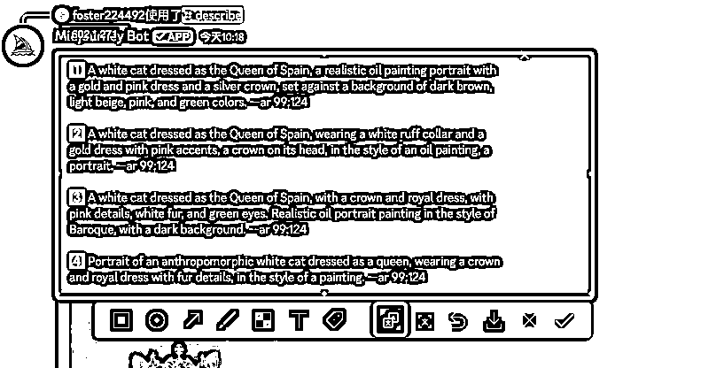
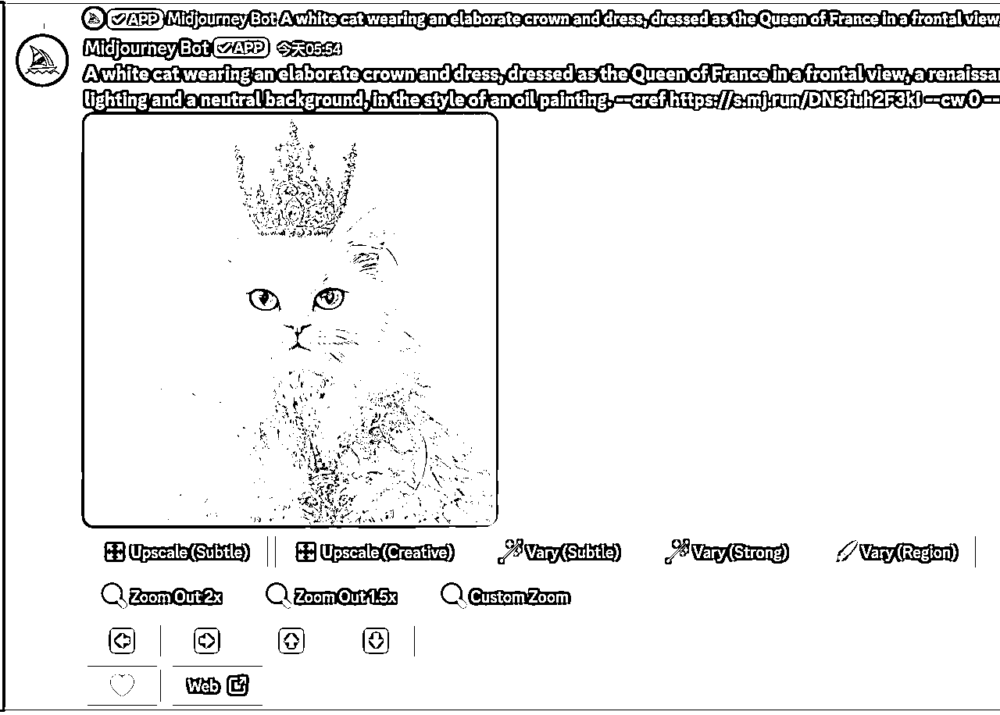
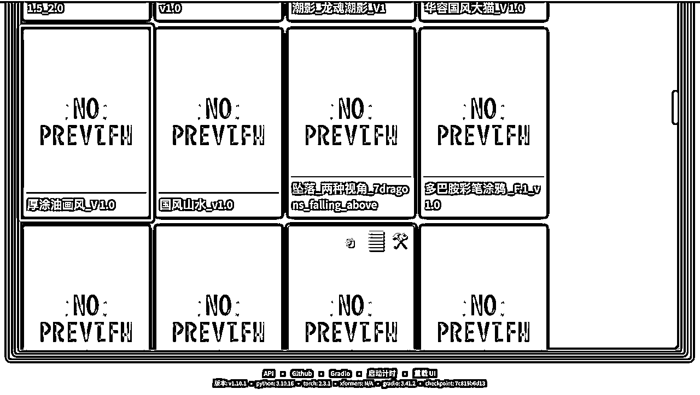
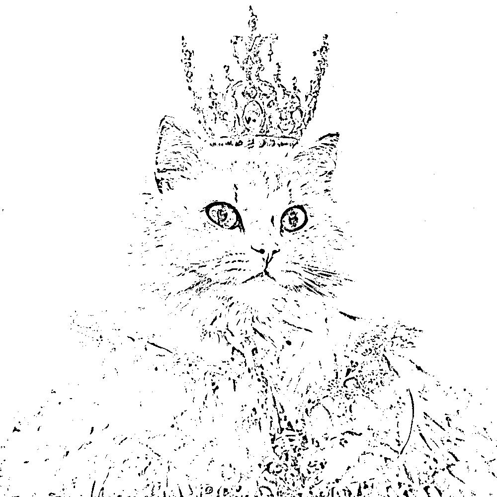
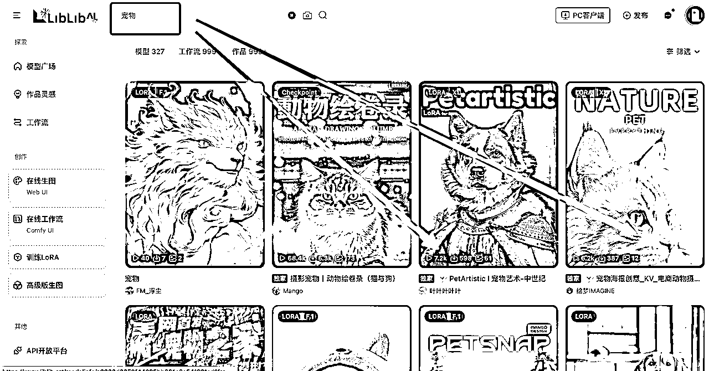
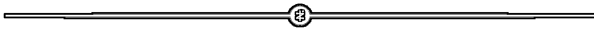

# AI 宠物写真 | 实战手册

> 来源：[https://shengcaiyoushu01.feishu.cn/docx/YYjvd3HRSocou7x1RXVcN5mCngb](https://shengcaiyoushu01.feishu.cn/docx/YYjvd3HRSocou7x1RXVcN5mCngb)

内容出品人：瓜斯

手册出品方：生财有术团队

出品时间：2025 年 1 月

手册使用说明：本文旨在向你展示一个项目的更多可能性，帮助你更好地理解或实操。

建议：如果需要快速定位到精确内容，可以使用快捷键 Ctrl + F/Command + F 的形式，搜索「关键字/词」，查找你想要的内容。

## 一、前言

小红书平台最近兴起了一股 AI 宠物肖像热潮。

有很多账号专门发布 AI 宠物艺术照，成功吸引顾客到私域（售卖 60 左右一张的宠物定制写真），同时通过这样新奇特的内容，破了流量涨了粉丝。

实现了流量与变现的良性循环。

这股潮流不只在国内火爆，国外的电商平台 Etsy 上，也有很多做 AI 宠物艺术照的店铺，生意十分兴隆。

这类题材爆火主要有两个核心原因：

第一个就是情感需求

现在有很多孤独的年轻人，每天 996，回到家就只有宠物陪伴。你去看那些铲屁官的朋友圈，哪个不是把宠物当孩子养？

当这些人刷到把他们家毛孩子 P 成憨态可掬的样子，那种击中内心柔软的感觉，根本顶不住啊！

第二个是猎奇心理

把宠物 P 成穿衣服的样子、P 成在阿勒泰旅游的样子，这些在现实中根本不可能的画面，现在通过 AI 全都可以实现了。这就是典型的用 AI 制造新奇特内容，带来的流量密码。

AI 宠物艺术照是一门同时吃到「情感」+「猎奇」的生意。

接下来我们就来聊聊，AI 宠物艺术照要怎么做？

项目说明：

*   这个项目会有一些门槛，需要同时使用 Midjourney、PS、 Stable Diffusion 三个工具。安装过程会很复杂，本文无详细流程，建议先找🍑（电商平台）上的远程安装服务，快速又省心。这步解决啦，我们再开始看下面内容。

*   项目主要通过小红书引流，会有一定的不可预测性。有不满 100 粉丝就实现变现的，但也有发了好几十条作品没跑出成绩的，以及引流后被封账号的。请大家合理评估后，再尝试。

## 二、如何用 AI 生成宠物写真？

我们先了解一下基础宠物写真（用 Midjourney 生成），基础写真的问题就是，生成出来的图，会有些不像。 因为 Midjourney 是抽卡玩法（随机生成）。

接着我们再来一起了解下 进阶宠物写真（用 PS 加上 Stable Diffusion），图片是更像了，不过难度也上去了。大家准备好的话，我们就开始吧～

关于怎么注册 Midjourney，这里就不赘述了，大家可以看之前的 AI 绘画航海手册👉https://scys.com/view/docx/PkbRdjt2AoD9t0xWeBfcLipanAe#doxcnRmbLA1FxoBGOghqB7uNEuh

### 2.1 基础篇

#### 2.1.1 第一步：找参考图

第一步，我们需要找到一些“欧洲贵族风”的参考图，这样方便我们后续创作。一般有两个平台比较不错，一个是小红书，一个是 Etsy（需要一些网络）。

小红书网址：https://www.xiaohongshu.com/explore

Etsy 网址：https://www.etsy.com/?ref=lgo

下面我们来演示一下：

在小红书搜索“欧洲贵族风 + 宠物”，我们能看到这些笔记👇

在 Etsy 搜索“欧洲贵族风 + 宠物”，我们能看到这些商品👇

注意，用 Etsy 的话，需要切换成英文

我们选择一个，我们喜欢的风格，然后截图保存下来

#### 2.1.2 第二步：生成草稿

下一步，我们需要生成一个草稿，这里主要用到 PS。

我们把刚刚找到的参考图，加上我们自己要制作的宠物照片，同时放到 PS 里：

接着我们需要把宠物照片，扣出来，放到参考图上。

可以用 PS 里的“磁性套索工具”来选择

选完之后，我们按一下“Ctrl+J”（mac 电脑的话，按一下“command + J”），复制一个图层

接着把宠物照片的“头像图层”，复制到我们参考图上面

然后我们导出这张图片，草稿就生成了。

#### 2.1.3 第三步：生成提示词文案

有了参考图之后，我们需要根据参考图，来生成提示词文案

我们打开 Midjourney（Discord 版本）。

我们把图片上传 Midjourney，这里选择“describe”，这个功能可以帮我们分析图片，生成提示词。

上传完图片后，大家能看到，Midjourney 已经帮我们生成了 4 个版本的提示词。我们可以用微信截图自带的翻译，来挑选一个合适的提示词使用。

微信截图后，有个翻译的选项（怎么打开微信截图，由于电脑、微信版本不一样，快捷键可能不同，大家可以在网页上搜索一下。我的快捷键是 control + command + a ）

翻译出来之后，我们需要生成最终的提示词。

一般选择第一句生成的版本就可以。

但是这里有两个关键，第一，是需要确定主体是否正确✅。我们能看到，目前的提示词主体，是白猫。而我们的宠物，是一只银渐层，而且是一只鼻子是粉色，类似波斯猫和银渐层混种的猫。

所以我们需要修改一下主体，把白猫，换成“A silver gradient cat with a pink nose， similar to a Persian cat and a silver gradient cat”

然后就是第二点，提示词需要描述的尽可能细致。我们可以把所有细致的句子，都放到一起，比如下面的“巴洛克风格的写实油画，背景为深色”，我觉得就挺好，可以拿过来，和第一句提示词合并起来用。

所以我们最终的提示词是：

A white A silver gradient cat with a pink nose, similar to a Persian cat and a silver gradient cat dressed as the Queen of Spain, a realistic oil painting portrait with a gold and pink dress and a silver crown, set against a background of dark brown, light beige, pink, and green colors Realistic oil portrait painting in the style of Baroque, with a dark background.. --ar 99:124

当然，现在 AI 工具那么强大，你也可以直接把图片上传到 AI，让它来帮忙分析提示词，就不用上面这些繁琐的步骤了，直接一步到位。下面是我用 Claude 上传图片，生成的提示词。你用其他工具，比如 Kimi，也能实现。

#### 2.1.4 第四步：生成宠物写真

提示词有了，我们接下来就可以生成宠物写真了。

这里会用到 Midjourney 的「人物一致性」功能，让生成的写真，能够和我们自己的宠物照片，保持一致。下面我们来操作看看：

首先，我们需要把自己宠物的照片，上传到 Midjourney

点击左下角的 “+”号，就可以上传

注意啊，这里上传的是宠物的原图，不是我们写真风格的图片，也不是草稿图哈。

接下来我们结合之前生成的提示词文案，以及上传的这张写真图，用 Midjourney 的「人物一致性」功能，来生成最终写真。

我们在输入框输入“/”，选择“imagine”生图功能

然后上传我们的提示词、宠物写真、人物一致性指令。最终输入 Midjourney 的信息是下面这个：

这串信息，元素过于丰富，下面我拆解一下，让大家能够明白每个部分代表什么。

提示词👇

宠物写真（刚刚上传之后，可以提取一个网址，把网址复制进来）👇

点击图片后，右下角有个“复制图片网址”，然后把图片粘贴到提示词后面。

注意了，这里需要用“--cref”和“--cw”来把网址包住。包住以后，就相当于我们告诉 Midjourney ，我们想要生成的图像，保存和网址图片一致。

细心的朋友可能会发现，“--cw”后面还跟着一个“50”，这个数值是代表一致性的范围，如果是 0，就是一致性只包含脸，如果是 100，就是一致性要包括周围的环境。我们这里选择 50，代表一致性范围大概在脸和上半身部分。

至于最后的“ --v 6.1 ”代表着使用的模型。

对了，这些指令，都需要注意空格！一定要注意了哈～具体是这样的：

A white cat wearing an elaborate crown and dress, dressed as the Queen of France in a frontal view, a renaissance-style portrait with soft lighting and a neutral background, in the style of an oil painting.--cref （空格）https://cdn.discordapp.com/attachments/1326833770871001116/1328192893390688309/WechatIMG1494.jpg?ex=6785cf86&is=67847e06&hm=2943b625de43199789a42285434cb554f42e500dc677fdcbb7c4167b8c1f31b9& （空格）--cw （空格）50 （空格）--v（空格） 6.1

好的，接下来，我们就点击回车，生成图片。

到这一步，就得体现耐心了。需要反复的抽卡（也就是不断的刷新生成按钮，不满意就再次生成图片）。差不多得抽个 4-5 次卡吧，可能才会出来一张感觉还 OK 的。

最后保存图像就可以啦～

由于 Midjourney 生成的图片，存在很大的随机性，没法 1:1 还原。所以有些非常有特点的宠物，是不太能完美复刻的。这个时候，就需要用到 Stable Diffusion 了。

下面就进入我们的进阶篇。

### 2.2 进阶篇

这一步会用到很多的 Lora 模型，这些模型是需要先下载到电脑上的。

大家可以点击这里进行下载：

Lora 链接： https://pan.baidu.com/s/1hjKhXylY9419pUvuXJ67ig?pwd=qcgq 提取码： qcgq

第一步：生成草稿图

我们还是老样子，把小猫的头像，放到我们的参考图上

接下来，我们需要对头像做一下处理，把边缘的地方，清理干净。我们选中小猫这个图层，然后用橡皮擦工具（柔边画笔），反复的擦拭边缘，把无关的东西都擦干净。

然后我们再选择底图（下面的那张风格化图片），用 PS 里的液化工具，来调整底图边缘。也是需要去除掉无关的东西。

液化就行理发💇🏻‍♀️，一下一下的，把小猫头像无法覆盖的地方都推走。

好的，最后把图修的干干净净的，我们就大功告成了

第二步：用 Stable Diffusion 生成写真图片

我们把图片保存下来，然后上传到 Stable Diffusion 。我们选择“图生图”，然后在左下方的模块里，上传图片。

把 Stable Diffusion 的页面拖拉到最下面，点开“ControlNet v1.1.455”

可以先不用管这个是啥，点开即可

“ControlNet v1.1.455”里面相当于一个人才市场，里面有各种各样的人帮我们干活。我们这里只需要招两位工人，👷🏻‍♂️一位负责 Tile（分块），也就是把图片分成更多的小块，在每一个小块上做优化。

👷🏻‍♂️ 另外一位，负责 Lineart（线稿），可以简单的理解为，帮我们绘画出一个素描草稿，避免后面生成的图片走样。

我们先来设置 Tile（分块）🔽

很简单，在单元 0 这里，把下面框选的地方都点开，然后上传一张我们使用的图片。

然后点击下方💥按钮，开始启动

接着我们来设置 Lineart（线稿）🔽

同样的，我们点击下方红框内容

然后点击💥，开始启动

然后我们选择一个向上的小箭头，同步一下尺寸

这两步 OK 之后，我们回到最上面，开始选择“Lora”（可以简单理解为滤镜）

我们找到对应的“Lora”，双击点一下就可以（这里 Lora 选中后，会没有明显反馈），我们可以到界面最上面检查一下，如果文本框里有 Lora 的内容，就证明选成功了。接下来就可以点击 生成 按钮了。

生成的时间会有点长，这个时候可以去冲一杯咖啡☕️～

好的，咖啡喝完了，我们图也生成了

这个版本和原图相比，就很像了。不过我们还是可以优化一下，目前的油画颗粒度太粗了，看着过于厚重。我们可以继续用“Lora”来优化。

我们点开“Lora”列表，选择“光泽调节器”，双击。

然后调节一下程度，这里我们用 0.6 就可以，点击“生成”

最后生成的图片是这样的：

接着，我们给写真图加上油画纸底板，以及套上一个画框。（下方图片，可以直接复制保存使用）

这一步也需要在 PS 里操作。我们把 AI 写真图，和油画底板同时拖入 PS

然后调整大小，让底板能完全覆盖写真图。接着在选中底板的时候，选择“正片叠加”

接着我们再用 PS 打开画框的 png 图片，把 AI 写真放出去

最终点击保存，就大功告成啦～我们来看看最终的图片

进阶型的宠物写真流程就介绍完啦～其他各类风格的写真，都能用同样的这个流程来操作。仅仅需要换个 Lora 就可以。

那 Lora 可以去哪里下载呢？推荐两个网址：

C 站： https://civitai.com/

LibLIb: https://www.liblib.art/

大家可以去上面逛逛，看到自己喜欢的风格，可以下载到本地。

把 Lora 下载好之后呢，需要将文件保存到本地文件夹里才能使用，具体步骤是这样的：

无论在 Windows 还是 macOS 上，只要能找到你本地安装的 Stable Diffusion Web UI 主目录，进入到 models/Lora 文件夹内，将下载的 LoRA 模型文件放进去，即可完成“安装”。

### 2.3 扩展篇

宠物写真还有其他扩展玩法，比如下面这些：

我们并不孤单，在 LibLIb（https://www.liblib.art/）上，你可以找到很多这样成熟的工作流。可以结合你的宠物照片，直接生成对应风格的写真。

相关的使用流程，这里就不赘述啦。大家打开 LibLIb 之后，搜索关键词“宠物”，即可发现很多内容。大家赶紧去探索一下。

不过需要提醒大家注意的是，并非每一个 LibLIb 上面的工作流，都是可以商用的。如果你用不可商用的工作流去接单，那是会存在侵权风险的，一定要仔细看工作流的相关说明。

## 三、如何引流变现？

解决了实操问题之后，我们可以尝试做一些账号来吸引流量，最后产生交易。

本章我们会围绕小红书平台来说，给大家一些“人设定位”、“内容方式”、和“变现定位”的案例展示，希望能对大家有用。

### 3.1 人设定位

宠物接单类小红书，一共有三种内容方向；

#### 3.1.1 定位一：「专家型」选手

比如下面这种类型：

如果你有艺术专业的背景，或者从事过设计行业，那么就可以结合你的经历，来做 AI 宠物写真。相比于其他入门选手，你会更有美感，你做出的笔记也会更有质感，账号的引流转化效率也会更高。

笔记内容布局（参考）：个人经历占 40%，AI 宠物写真行业干货占 40%，付费产品（小红书店铺商品推广）占 10%，粉丝互动相关占 10%

#### 3.1.2 定位二：「成长型」账号

如果你没有设计相关的基础，你可以尝试做一个自己的“学习记录账号”，比如下面这类

内容可以发布（参考）：新手每天的 AI 宠物写真练习手稿、新学会的 Lora 调色风格

这样的笔记，一开始可能转化不好，但是如果坚持发下去，转化率会比“专家型”AI 宠物写真账号还要好。因为大家能通过你的往前笔记，看到你是如何一步步变成熟的，自然就降低了信任成本。在验证了你的能力后，出于性价比的考虑，会更倾向于找你接单。

#### 3.1.3 定位三：「干货型」账号

如果你不想做人设账号，也可以做纯行业干货无人设的账号。这类账号相对容易一些、比如各类 AI 绘图软件、各类

提示词技巧等干货分享。

这些账号吸引来的用户可能会泛一些，不过正因为泛，反而带来一个好处，就是如果你 AI 绘画不想继续做了，你可以很自然的“换赛道”，转做“AI 写作”，或者“AI 自媒体”。

这类账号还有一个缺点，就是粉丝不太容易直接注意到你的产品（AI 宠物写真服务），但是这个缺点也可以通过运营方式解决，比如在自我介绍里，曝光自己的产品。

### 3.2 内容定位

#### 3.2.1 内容一：给自己的宠物做 AI 写真

这类笔记和适合「成长型」账号来发，把平时的训练素材积累下来，一鱼多吃。笔记内容也很简单，就是纯图片 + 训练使用的提示词，或者方法步骤。

#### 3.2.2 内容二：晒一些客户的投稿

这类笔记，就是典型的“秀肌肉”笔记。直接把粉丝的订单，拿来当做笔记发，即降低了创作成本，也从侧面证明了自己的能力。

不过有个注意的要点，这类笔记发布前，需要先征得客户的同意。客户的个人隐私，我们也是需要帮忙保护的。

#### 3.2.3 内容三：“你发照片我来画”

这种笔记在小红书渠道，天然就有优势。因为它能很好的调动用户评论，而小红书的评论是比点赞和收藏，权重更高的，能帮你的笔记获得更多的曝光。

### 3.3 变现定位

AI 宠物变现，一共有【个人号引流私域】和【开店铺】两种途径：

#### 3.3.1 变现渠道一：个人号引流私域

⭕️ 优点：

1.  小红书号不用实名，有手机号就能注册，做矩阵容易，废了直接注销重开

1.  用户全部在私域，后续可多次变现

1.  顾客无法申请仅退款，不容易被白嫖

1.  同行不知道你的销量，闷声赚钱

⭕️ 缺点：

1.  转化路径长，且需要用安全的方式引流

1.  需要跟顾客聊天，做销转

#### 3.3.2 变现渠道二：开店铺

⭕️ 优点：

1.  笔记直接转化，设置好自动回复话术和自动发货，很少要自己聊天转化

1.  流量扶持，笔记爆会带动商品爆，商品爆又会带动笔记一起爆。商品评分高的话，通过购物页、商卡页也能出单。

⭕️ 缺点：

1.  必须要实名，号废了麻烦，对于普通人来说运营要格外小心。

1.  会有一些店铺运营上的问题，比如被投诉、被仅退款。

1.  销量所有人可见，爆单了会很快被同行抄袭模仿。

对开店铺感兴趣的圈友，可以看之前的航海手册，有相关教程：https://scys.com/docx/SgB0dqVCAonFOgxiFj1cfIJEnPX

目前观察下来，大概 90%的宠物 AI 写真博主，都是采用「个人号引流私域」的方式来变现。

*两种变现方式的分析，引用的是圈友 的群内聊天内容，来做扩展延伸。

#### 3.3.3 变现产品总结：

确定好引流变现渠道后，有什么样的产品可以围绕 AI 宠物写真来变现呢？

一共有下面几种：

1.卖服务（定价参考）

这个是市面上的接单报价，大家可以了解一下。

2.卖课程

课程大概售价在 400-500 元，通过网盘链接一次性交付往，包括下面这些服务：

1.  视频课

*   演示具体操作流程

*   实际案例讲解

1.  课件文档（80 页） 内容涵盖：

*   宠物写真的创作思路与流程

*   适用的风格模型选择和参数设置

*   详细的提示词编写指南

*   持续更新的风格参考

额外服务支持：

*   预装好的模型和插件包（可直接下载使用）

*   问题咨询支持

*   提供远程操作指导服务

好啦～我们整个项目就介绍到这里，很感谢你能看到这行字！希望此文档对你有所帮助！一起下场，把手弄脏！

