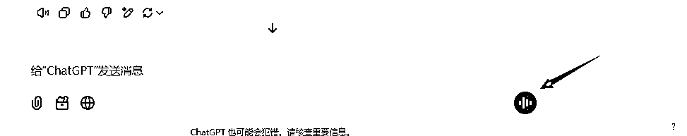
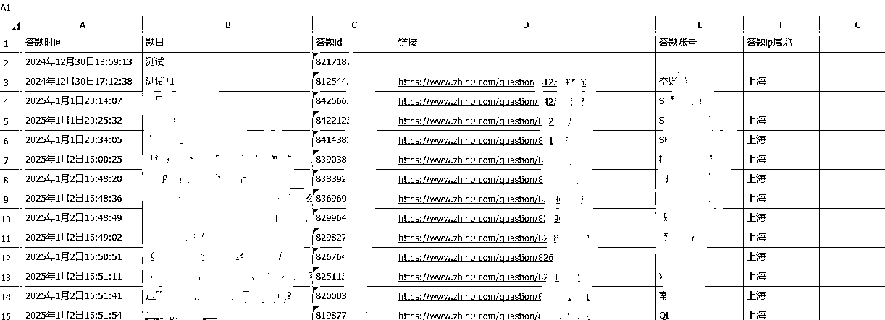
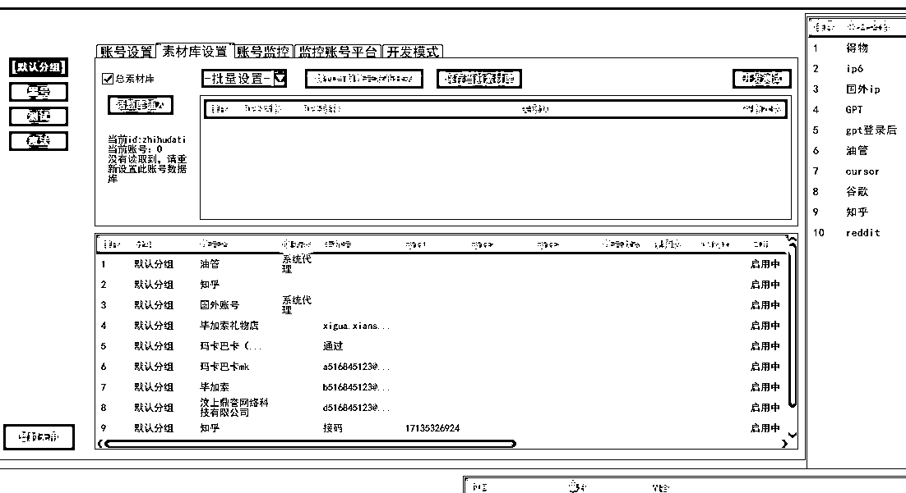

# 知乎：利用AI挖掘用户短期内刚需问题。通过AI进行高效答题引流。

> 来源：[https://udxxg5rx5m.feishu.cn/docx/YfsldO9UNoERoKx2Ln6cyPTjnCg](https://udxxg5rx5m.feishu.cn/docx/YfsldO9UNoERoKx2Ln6cyPTjnCg)

我是施仁。

2019年，我开发了第一个项目所需的软件，知乎自动答题，用来做引流。

缺点：

当时由于没有GPT这样的智能工具，

只能通过问题关键字来进行筛选答题，

根本无法判断这个问题是否真的符合我的答题要求。

并且答题内容我也只能预设一些固定的答题模板，

然后随机抽取几段内容和图片进行合成回答。

优点：

知乎的话题是可以按时间排序的，

所以只要设定了一个时间间隔，定时检索并回答最近的问题。

这样的方式能确保回答的问题具有高度针对性，

因为最新的问题通常代表了用户短期内的迫切需求。

现在AI这么火，最近我也是在高强度拥抱AI，

于是我开始考虑利用AI来进行筛选、答题。

这样原本的缺点也完全可以通过AI来解决。

于是我着手编写了软件的工作流程。

软件工作流程：

1.获取问题：软件通过知乎API获取指定话题下最新的50个问题。这样的做法能够迅速响应短期内需求较大的提问，从而提升引流的成功率。

2.筛选与回答：然后，将问题传送给GPT进行筛选，符合答题标准的题目会生成详细回答；不符合标准的则直接回复“不符合”。

3.二次合成：在获得GPT的回答后，软件会进行二次处理，插入相关图片，并调整格式以确保符合知乎API的答题要求，同时优化排版，确保内容美观。

4.提交与同步：最后，通过知乎API将答案发布，同时将答题记录同步到飞书文档，方便后期管理与追踪。

我把软件流程发GPT，

让他进行分析。

得到了以下优化建议：

如果需要回答大量问题，

应考虑每次答题时的IP地址，

避免被知乎检测到。

同时，还需要记录不符合标准和已经回答过的问题，

这样在初次筛选时就能进行剔除，从而减少不必要的工作量。

根据这些建议，我重新整理了软件流程，并新增了飞书同步功能。

# 一、调教→接入GPT进行判断→获取GPT答题内容

为了验证这个想法的可行性，

我首先使用软件获取了GPT对话页面的内容，

并对其进行了元素分析。

通过分析页面结构，我找到了适合的方式来判断GPT的三种状态。

在向GPT发送问题之前，我先获取了以下元素的数量：

body > div > div > main > div > div > div > div > div > div > article。

考虑到GPT页面的元素在多次对话后可能不会全部加载，

我进一步根据当前的元素数量获取了最后一个元素的 data-testid 属性，

并将其临时存储。该属性值会根据对话的总数不断增长。

然后我将知乎题目发送给GPT，

并开始循环检测 data-testid 属性的增长情况。

如果该值发生增长，说明问题已成功发送。

接下来我判断GPT的状态是“已回答”还是“正在回答”。

这一状态可以通过检测以下元素来确定：

#composer-background > div > div > div > span > div > button > div > div。

如果该元素的数量为1，说明GPT已经停止回答；

如果不等于1，则表示GPT仍在回答过程中，我会继续等待。

在检测到回答完成后，

软件提取页面最后一个回答的内容【【【】】】。

同时检查GPT的回答是否过短或是包含“【【【不符合】】】”的内容。

如果出现这类情况，说明问题可以放弃回答。

经过测试，发现GPT的部分完全可以实现这一流程。

接下来就是对GPT进行调教。

我告诉GPT，你是一个专门负责经营XX产品的销售。你通过在知乎答题来进行引流。因为知乎对广告营销风控很严。所以在回答问题时一定不要刻意推荐你的产品。但你要明白你回答的每个问题目的都是为了营销。如果一个回答并不能推广你的产品。那你完全可以选择不用回答。用【【【不符合】】】回复我即可。

每次回答问题的内容都用【【【】】】括起来，并且【【【】】】内的内容是用来回答知乎上的问题的，而和我的对话不需要加【【【】】】。同时，【【【】】】内的内容也要加上

标签包裹起来。

这是一个知乎回答模板。当我跟你对话时，在最前面加了 题目： 时，你都必须要用知乎模板为基础回答。如果没有题目则不需要。

最终，我将提取到的回答反馈给内容合成模块，并根据预先调教的内容，在合成过程中插入图片到指定的位置。

# 二、分析知乎话题，获取API参数

接下来，我开始对知乎API部分进行测试。

通过抓包，我发现可以通过以下API获取知乎指定话题下按时间排序的内容：

https://www.zhihu.com/api/v5.1/topics/话题id/feeds/new_question?offset=0&limit=0

其中话题id是知乎话题网址中的ID，

offset表示从指定话题的第几个问题开始获取，

limit则控制一次获取多少个问题。

在获取指定话题时，只需要替换这些关键字即可。

经过测试，发现一次性最多可以获取50个问题，这个数量已经足够使用。

前50个问题基本能够覆盖过去48-72小时内用户的提问需求。

获取的内容是JSON格式，

通过JSON工具解析后，可以提取每个问题的题目和题目ID。

题目将被发送给GPT判断是否符合答题标准并进行回答，

而题目ID则用于在答题时合成知乎API格式的回答。

# 三、合成知乎api答题格式

在处理知乎答题API时，我遇到了一些不明确的参数生成规则，

尤其是一些动态值的来源。

通过与GPT的分析，我得到了部分解决方案，

但仍有几个参数的生成规则不清楚。

以下是我分析的内容：

*   X-Zse-96、X-Zst-81、X-Zse-93：

这些参数是动态值，

虽然我没有找到具体的生成规则，但通过测试发现，

稍微修改这些参数的值依然能够成功提交请求并获得响应，且并未触发异常。

因此，我决定将这些值随机生成，并在请求头中替换为合成后的随机值。

*   x-xsrftoken：

则是通过ck的_xsrf提取出来的。

接下来，我处理了请求体的部分。

通过GPT的分析，我了解到：

*   traceId 是通过格林时间加上UUIDv4生成的，遵循特定的格式。

对于知乎答题API中的回答内容部分，

特别是图片格式的处理，我发现回答中常包含标识符，

如“图片1”、“图片2”和“图片3”。我将这些标识符替换成标签，

并加上素材库中图片的网址，使其符合API的内容格式。

尽管初步测试提交成功，但排版效果并不理想，

显得非常杂乱。

我又对回答内容的排版进行了进一步优化。

经过优化，回答的显示效果变得更加整洁、美观，

符合我的预期。

测试通过。

# 四、答题环境伪装→代理IP发送

短时间内同一 IP 发送多个回答肯定会被限制。

考虑到这一点，我决定使用代理服务器来进行答题。

但我发现软件原本的访问方式并不支持代理功能。

于是我向 GPT 请教，得知需要使用 curl 相关模块来实现。

此前我并不了解这个模块，但通过简单学习后，

我尝试发送了回答。

但是发送的内容变成了乱码。

于是我再次查看了模块的相关介绍，

发现需要将编码格式修改为 UTF-8 字节集。

经过调整后，问题终于得以完美解决。

# 五、数据同步飞书文档

因为软件已经对接了飞书接口。

所以只需要添加一个飞书记录答题结果的功能即可。

同步飞书前获取答题时间、题目、id、网址、答题账号

软件功能全部完善：

1.  初始化答题环境 首先，系统会读取配置文件（如图片素材地址、延迟设置等），并根据这些配置进行环境初始化。同时，程序还会检测答题账号的掉线状态，并确保代理IP的连接正常。

1.  接入GPT进行判断 获取知乎话题的列表，并基于预设的配置选择是否对问题进行关键字筛选。接着，将问题发送给GPT进行内容判断。如果问题不符合GPT调教的答题标准，GPT会回复【【【不符合】】】。

1.  接收GPT回答 如果问题符合要求，GPT会以【【【回答内容】】】的形式生成答案，并根据预设调优，在回答中适当插入引导性内容。

1.  回答合成与图片处理 程序负责将图片与文本合并，形成最终的回答内容。系统会从预设的图片库中随机选择合适的图片，并根据知乎平台的格式要求将其插入回答中，确保排版整洁。

1.  发送回答 经过合成后的内容将通过API发送至对应的问题页面。与此同时，相关问题的信息会被记录并同步到飞书文档，以便后续查阅和管理。

1.  数据同步至飞书文档

根据软件提供的飞书接口合成请求。发送至飞书。

