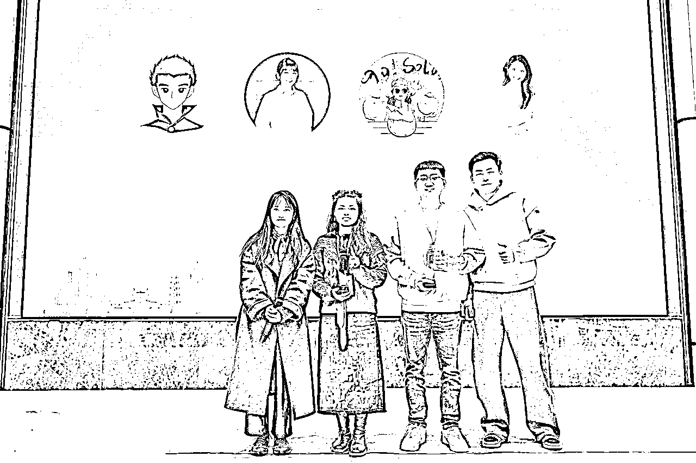
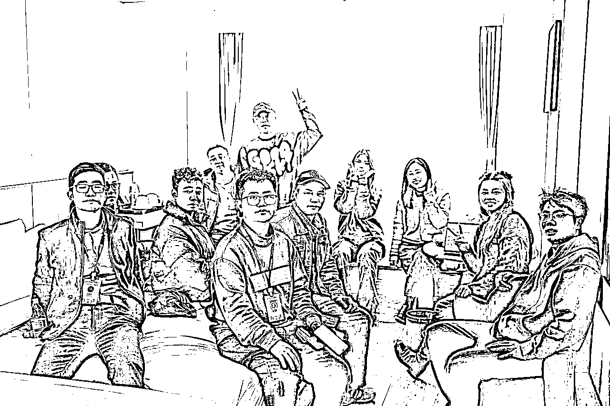
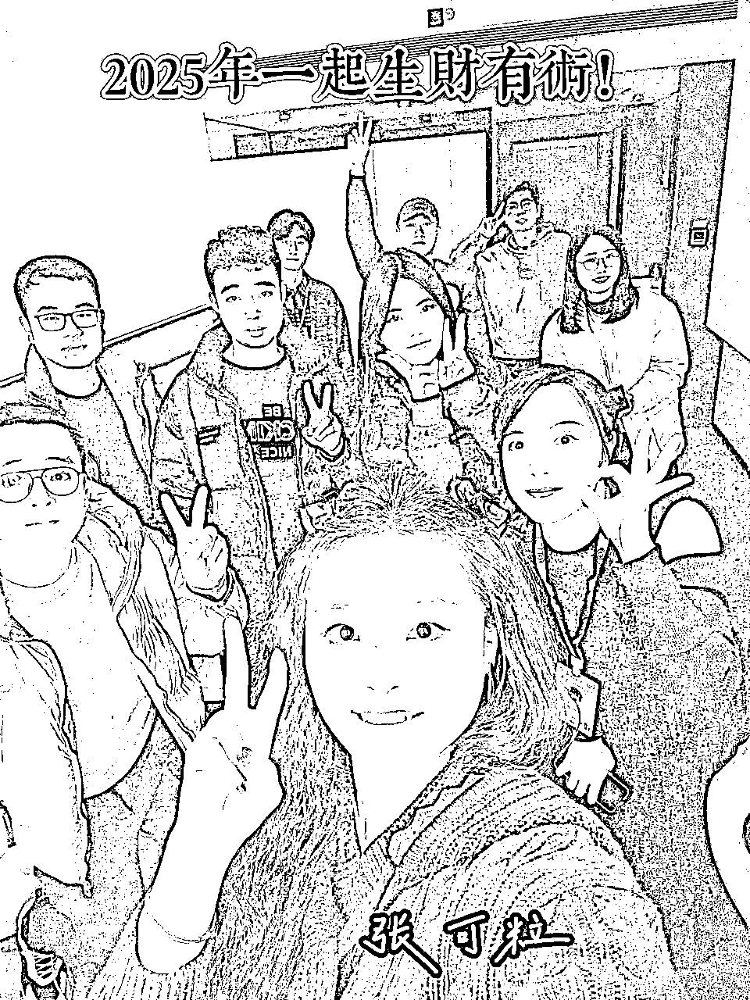

# 2025福建见面会：很多人赚不到钱，不是能力不行，而是见识太少

> 来源：[https://b0attp331p.feishu.cn/docx/Yn8CdiTUAoFQ8WxLwhacytSJnae](https://b0attp331p.feishu.cn/docx/Yn8CdiTUAoFQ8WxLwhacytSJnae)

生财圈友们，见字如面，我是自媒体IP教练张可粒，1月19号参加福建生财见面会，获得了生财影响力达人的奖杯。

同时感谢秀儿的邀请，也组了一个茶话会，主题是《2025年如何用一年时间，变成理想中的自己》https://articles.zsxq.com/id_58wt7w5awbbz.html 戳链接可看详细帖子

场子特别热闹，后面也有大家写的详细复盘，近6000多字。通过本次茶话会主题也认识了很多新朋友，有了比较深入的交流，接下来就是给大家还原现场交流的精华。

我发现或许是因为，不同的人成长环境不一样，不同的性格和业务也造就不同的状态。

我们这期茶话会主题的参与者们有：

公众号流量主项目

有人专注于公众号流量主项目，通过内容创作和流量变现，实现了稳定的收入。

装修行业的创新者

一位从事装修行业的人，正在寻找新的商业模式和客户服务方式，提升行业竞争力。

75后大叔的知识付费之路

一位75后的大叔，10年间在知识付费领域投入了50万，最终获得了丰厚的回报，实现了个人和事业的双重突破。

小红书上的母婴用品创业者

一位细心的丈夫，在为妻子购买待产包时，发现了小红书上的母婴用品需求，成功开启了母婴用品电商之路。

大学生投资达人

一位大学生在课余时间研究投资，通过股票、基金等方式实现了小小自由，展现了年轻人的财商潜力。

05后自媒体博主

一位05后的年轻人，凭借对自媒体的敏锐嗅觉，迅速积累了大量粉丝，成为新一代的内容创作者。

自由职业者的航海变现

一位自由职业者通过一次航海经历，做小红书电商成功变现30万，展现了自由职业者的无限可能。

SEM广告业务专家

有专注于SEM广告业务的人，通过优化广告投放策略，帮助企业实现了更高的转化率和ROI。

等等……

发现没有，其实大多数人赚不到钱，真的不是能力不行，而是见识太少，看过的有钱人和商业模式太少了。

这次聚会，不仅仅是帮助大家规划2025年，也让大家看到了更多的搞钱思路，开拓了眼界。

就好比如果你关注了1000个不同领域的头部账号，你每天都带着学习和思考的意识，刷账号看内容拆解商业模式，看小红书、公众号、知乎、得到、喜马拉雅……

你就会发现原来这个世界上可以做的赛道有那么多，有那么多种变现方式，而且这些人不是千篇一律的，各有各的特色，各有各的内容输出方式，各有各的商业变现模式。

见识多了，认知能力提升上去了，赚钱的动力和欲望也随之上涨。

在网友眼里，他们可能是平替版的李子柒、小杨哥、李诞、李佳琦，但那又如何呢？

他们凭自己本事赚到了钱，有底气选择自己想要的生活，这就足够了。

不要听别人说什么2025年，自媒体不是风口了，你可别信失败者的话，或者为了博得流量的信息。

摒弃这些噪音，你如果想做的话，什么时候都不晚，最怕的是一直在犹豫而错过。

咱们还有几位同学，做了无敌详细的复盘，一起来看看：

本次活动复盘框架：

1、自我介绍

2、生财给你带来什么收获

3、你个人拿到的项目成绩，几百字描述（为何接触、中间有坎坷如何克服、最终获取的结果）

4、本次茶话会主题收获，哪些点触动了你

5、2025年想做什么，有什么期待和规划

## 来自 @张可粒的复盘

1、自我介绍

我是张可粒，本次茶话会的组局官和分享嘉宾，同时也是生财2024年影响力达人。可粒是自媒体IP教练，专注自媒体IP孵化和新个体创业，利用自媒体变现200多万，如今正在探索家居赛道。

2、生财给你带来什么收获

生财是我的搞钱大学，早几年就知道生财了，但觉得自己是小白，不好意思加入。

直到2023年才加入生财，让我看到了很多变现百万、千万的人，我更坚信自己能赚到第一个千万。

同时我也把自己的老公带进生财，让他了解了wb3，也因此斩获人生中的第一桶金。

也很感谢生财，让我在此认识了很多好朋友，能一起搞钱，也能线下一起玩耍吃饭。

3、你个人拿到的项目成绩，几百字描述（为何接触、中间有坎坷如何克服、最终获取的结果）

*   2020年3月裸辞，没有方向

*   2020年5月知识付费，第一次打造课程，就赚回了学费

*   2020年7月-12月投稿，同时边研究小红书、知乎

*   2021年，做知乎好物，月入过万

*   2022年，做知乎好物+公众号，月入几万

*   2023年，知乎好物+公众号+知识付费课程，赚到第一个百万，赚到第一个百万后，同年3月加入生财

*   2024年，从知乎教练到自媒体IP教练，做IP陪跑、分销产品，赚到人生中200万

其实我做自媒体这几年，也领悟了——

对于没有门槛的商业模式执念不要太深，对于商业模式的生命周期追求也不要看得太重。

创业一要不断地升级打怪，别指望一种商业模式能一直赚到底，更为关键是增强自己的核心竞争力。

我从做知乎好物博主、公众号博主、小红书博主到做知识付费业务、卖课程卖陪跑，到做超级个体、自媒体IP孵化教练，都遵循了一个原则，如果这个事情有价值，对我搞钱有帮助，对我认知提升有帮助，那我一定要去干。

人生的大成功，都是由每一个小结果叠加起来的，我相信，可粒不断拿结果，就能变得更优秀，也能吸引来更多资源，拥有更多选择的权利和空间。

干就完事，一千万我来啦！

4、本次茶话会主题收获，哪些点触动了你

我其实是第一次组局，没想到所有人都很认真听到了最后。

而且大家都分享了自己的搞钱经历，有更多元的信息差分享出来，丰富了大家的搞钱视角。

5、2025年想做什么，有什么期待和规划

做100万粉丝的家居博主，干，就完事！

## 来自@yzf的复盘

1、自我介绍

yzf，来自福建福州，现自由职业。之前操作过小红书母婴引流淘客项目，引流私域4000+，变现30W+。已多年未操作互联网项目，现在着手做小红书虚拟资料项目。

2、生财给你带来什么收获

生财的航海手册的指导非常的详细，让我可以更容易地上手操作。圈友分享的相关经验，也让我收益颇丰。也通过生财链接了不少相关领域的大咖，得到了不少的指导。

3、你个人拿到的项目成绩，几百字描述（为何接触、中间有坎坷如何克服、最终获取的结果）

2020年下半年操作小红书母婴引流淘客项目，引流沉淀了4000+宝妈，变现30W+。刚开始是由于准备待产包，在搜索相关热点产品的时候，被人引到私域并下载使用了相关淘客产品。

之后觉得从前段引流到后端产品都比较简单、操作性强，而且引流私域群里有专门的人帮忙牵头带群，降低了自己要去沟通交互的精力，所以就上手开始做。

刚开始一个月其实都没太大进展，就是跟着别人的样式发小红书文章，之后第二个月开始陆续有了流量，相关的爆文再发还会有一定的流量，就持续找各种热点产品的引流文，模仿并隔一段时间重复发。刚开始爆文的时候由于没有做好私域引流，流失了不少流量，并且由于在私聊对话引流被禁言，之后借鉴其他同行的经验进行评论区引流和小红书主页置顶文或收藏区引流或小号引流。

之后自己根据热点母婴产品做自己的图文内容，也产生了爆文。后期进一步改善直接进行母婴产品群图文创作引流，目标明确，可以做到低浏览量也能达到好的引流效果，并不断改进文章内容，进行关键词布局，关键词排名能达到前五或前三，也带来了不少的搜索流量。

当中遇到了的比较大的一个问题，就是由于私域引流明显或同行举报，导致账号被封小几十次，但早期小红书是可以注销后重新使用，另外借用了不少亲朋好友的手机号进行注册，不断地操作，最终达到了早期4000+的私域引流，并通过话术持续改进，达到了800+的淘客团队数，同时获得了团队收益和产品收益达30W+。

4、本次茶话会主题收获，哪些点触动了你

茶话会最触动我的点是关于人生设计和复盘的思维。平常时不时也有规划计划的想法或日常偶尔的当日复盘，但是并没有做到坚持，所以很多时候过得就有点随波逐流，很多事情都是依靠量变引起质变，所以规划和复盘的好处是显而易见的，只有通过坚持才能让自己更快进步。

5、2025年想做什么，有什么期待和规划

2025年打算开始实操新的互联网项目，努力取得一定的成果，并在生财多分享和链接，扩大个人影响力。

## 来自@耐摔王的复盘

1、自我介绍

大二女生，耐摔王，主营业务ai写作

2、生财给你带来什么收获

作为一个得到搞钱渠道有限的大学生来说，生财利用了网络赚钱的风口，开展了对很多项目的介绍和讨论，这是非常实用和宝贵的。

市面上的信息差体现在市场趋势的判断、目标用户的精准分析、竞争对手的动态把握等方面，而生财则是将这些差异转化为优势的核心路径。通过优化信息收集渠道，再构建适合自身项目的策略框架，一定可以慢慢减少搞钱的信息差，赚到钱。

身边人搞钱的较少，生财提供了一个很好的交流氛围。

3、你个人拿到的项目成绩，几百字描述（为何接触、中间有坎坷如何克服、最终获取的结果）

大一上做过小红书博主，艺考生高考相关内容型ip，一开始是因为上大学无聊开始做自媒体，意外地发现有许多人需要自己的内容，一周涨粉一千，之后粉丝多了开始研究变现，和朋友一起卖高考历史笔记，后来因为引流太多，大一下的时候账号被永久限流。。。。颓废了很久，之后做过小红书代运营和家教赚了一点小钱，大二上的时候因为需要交房租开启了ai代写事业！！

先是做二手单，刚刚开始就猛猛接单，慢慢突破各种卡点，从一周稿费一千到开始接一手单自己做流量一天一千，中间有许多困难，都被逐个击破，现在面临的问题是不能好好坚持做流量，写作质量不够高，谈单转化不够成熟，面对高客单还有很多需要学习的方向。接下来打算代写同时多账号运营并且学会小红书引流，开始运营自己的个人ip。

4、本次茶话会主题收获，哪些点触动了你

要坚持搞钱，加油搞到第一个十万

不要和他人比较，要和自己比较

多多向内求

5、2025年想做什么，有什么期待和规划

争取靠代写月入两万

学习更多代写相关的技能

继续阅读和探索感兴趣的领域，积累知识，同时选择更适合自己状态的书籍

争取自媒体粉丝破万

保持对生活和情绪的反思

## 来自@范特西的复盘

1、自我介绍

大家好，我是刚大学毕业半年的范特希，生活在福建福清，主业是工程造价，副业炒股炒币ai写作。

1.  生财有术带来的收获

加入“生财有术”最大的收获是让我更有“赚钱的欲望”。最早是通过曹大知道这个社区，后来在粥左罗的一篇帖子中再次看到这个平台产生了好奇，决定加入进来。

去年刚加入后我发现了很多新的机会，尤其是AI写作这个方向。刚好在前两个月的航海课程中，补齐了这块短板。

以及星球内容让我意识到资源整合和动态应对市场变化的重要性。

1.  个人项目经历与成绩

在过去的两个月我尝试了AI代写作为副业，刚开始时遭遇了一些挫折，缺乏经验导致订单转化率不高、话术和沟通技巧的薄弱，但我没有放弃，先接黑奴单开始。

慢慢通过不断优化话术和借鉴同行经验，我开始逐步接到小额订单，累计也有了几百上千元的收入。

虽然目前收入不高，但这是一次全新的尝试，也是一次突破自我的过程。

正如那句话“你努力不一定成功，但不努力一定失败。”这种心态让我坚持下来，并在未来有了更多的信心。

1.  本次茶话会的收获

这次茶话会让我感触最深的一句话是可粒老师说的：“你害怕花的凋零，你宁愿不种花，你害怕没结果，所以拒绝一切的开始。”

这让我反思了自己的性格和行动力，过去因为害怕失败，很多事情甚至都不敢开始。

茶话会上每个人的经历都很真实、鲜活。一位圈友分享了如何通过挖掘需求，实现小红书30W利润；还有一位红衣服大哥分享了他尝试多次公众号小红书等平台哪怕失败后，仍然坚持探索的故事。

对比之下我意识到自己太过追求“确定性”，总希望事情稳妥后再开始。但正如晓文老师分享的“确定性的东西，往往已经没有红利。”

另一个让我触动的点是“勇气”，像一位05后的圈友，她接了一单官员文案的任务，虽然内容复杂，但她敢于挑战。这让我深刻认识到，赚钱不仅仅是技术和努力，更多是突破自己的心理障碍，敢于尝试和冒险。

1.  2025年的目标与规划

工程造价是我的主业，先保证稳定收入来源，确保生活无忧。

继续深耕AI代写，不仅要在接单量上有所提升，还希望能探索更高价值的服务，同时学习其他社交平台的运营技巧，比如闲鱼或小红书，扩展副业渠道。

继续在股票和虚拟货币市场上积累经验。我曾在早期因为投机心态亏损数万，但深度反思后，换个适合自己性格跟心态的玩法，坚持下来后目前实现了十几万的盈利。

这让我更加坚定了“复利”的力量，同时也意识到需要不断学习和适应市场变化。

除了赚钱我也希望在社交能力、心理建设、情感维系等方面有所突破，努力成为一个更全面、更有层次的人。

## 来自@JOKER的复盘

1.  自我介绍

大家好！我是JOKER，一名传统IT厂商的项目经理，拥有七年的信息化项目管理经验，擅长项目全过程管理，包括成本、风险、质量、进度，以及与用户的沟通和协调。这两年，受经济形势影响，同行公司裁员降薪的新闻屡见不鲜，我也开始思考：难道职业生涯的“安全感”只能交给别人决定吗？于是，我决定利用业余时间探索副业，为自己的人生多打开一扇窗。

1.  生财给我的收获

加入生财有术以来，我最大的感触就是：这里不仅是一个学习的宝库，更是一个行动的舞台。以下是我的几点收获：

学习资源丰富：生财提供了各种实操手册，从副业技能到个人成长，内容详实且接地气，让我少走了很多弯路。

航海实操价值高： 相较于纸上谈兵的理论手册，生财的航海项目更注重实战，这对我来说尤为重要。航海项目提供了真正适合新手操作的实战项目，帮助我们快速跑通最小可行产品（MVP），掌握例如自媒体运营等实用技能。这比单纯阅读手册要高效得多。

氛围积极向上：生财最吸引我的地方在于其积极向上的社群氛围。官方人员、大佬、教练、领队和志愿者都非常乐于助人，耐心指导新手跑通项目，帮助我们在过程中不断成长和进步。这种氛围极大地激发了我的学习热情和行动力。

1.  我的项目成果分享

去年5月，在一位朋友（生财圈友）的推荐下，我尝试公众号爆文项目。遗憾的是，由于缺乏系统性资料，我在探索的过程中屡屡受挫，折腾了三四个月，开了七八个号都没能取得成果。这段经历让我备受挫折，甚至一度怀疑自己。

躺平了两个月后，在朋友的建议下，我于双十一前一天加入了生财有术。11月16日，我按照航海手册的指导，重新出发实操小红书商单项目。

截至目前，我的账号粉丝已达到6009，总赞藏11.7万，并接到了两单商单合作。

回顾这段经历，我明白了：即使一个项目没有直接带来变现，它积累的经验也可能在另一个项目中开花结果。公众号的尝试让我掌握了选题、对标和使用AI工具等核心技能，这些都在小红书项目中发挥了作用。只要坚持，任何付出都不会白费。

1.  本次茶话会主题收获，哪些点触动了你

感谢张可粒老师以及圈友们的分享，以下几个点让我受益匪浅：

“什么时候最快乐、最有能量？”

我发现，自己在工作中真正感到兴奋的时候，往往是解决了一个高难度的挑战。而相比为公司做项目，自己主导副业的成就感和动力显然更强。生财的项目带给我的不仅是技能，更是对未来掌控感的增强。

“方法论对标大佬，结果跟过去的自己比”

过去，我常常陷入和他人的比较中，焦虑自己不够优秀。但可粒老师的一句话点醒了我：与其比较结果，不如学习别人的方法。每个人都有自己的节奏，重要的是在前行中不断超越过去的自己。

1.  2025年的期待与规划

在茶话会上，我认真思考了2025年的方向，设定了以下三个目标：

修心：每天坚持读书，丰富内心，增强抗压能力。

修身：锻炼身体，保持健康，为未来的拼搏提供充足的能量。

练功：持续参与生财航海，多下场实践，不断提高自己的项目运营能力。

——————————

感谢大家观看，这就是我们茶话会的复盘啦，期待下次见！

说一千，道一万，还是很感谢生财这个大舞台。它不仅是一个帮助更多年轻人搞钱的平台，更是一个充满机遇和挑战的舞台。在这里，我学到了很多，也成长了很多。

学会了私域发售拉新，学会了组局活动，自己也从生财小透明成长为生财影响力达人，也愿意带领更多新人成长为生财的中流砥柱。

一颗星星再闪亮终究也只是一颗星，如果当群星闪耀在夜空的时候就是银河。

希望我们都能在这个生财社群绽放出自己的光芒，亦或是站上更大的舞台。

感谢生财，感谢每一个支持我的人，我会继续前行，不负期待。