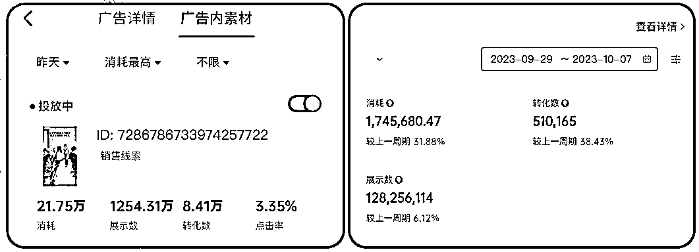

# 《抖音年引流1000w用户 我如何搭建一支能打的内容团队》 邓怡然

> 来源：[https://wfj1j8pfk7.feishu.cn/docx/YwADd0KlYocZEYxC9Kic8eZwn4I](https://wfj1j8pfk7.feishu.cn/docx/YwADd0KlYocZEYxC9Kic8eZwn4I)

# 搞钱经历

首先用三个数字讲一下我搞钱的经历

1 小学--把压岁钱"贷"给爸妈买房赚到第1块钱

第一个数字是1，我挣的第一块钱是我小学的时候，把压岁钱以银行利率贷给爸妈。那是 06 年，当时两年的银行定期存款率是3.06，我手里2万压岁钱，每天能有一块六的利息，那是我赚到的第一块钱。

3000 初中--中考状元，学校奖励了3000块钱

第二个数字是3000，鄙人不才，财商不错智商也挺好的，中考的时候是中考状元学校发了我 3000

10000 大一--公众号引流，赚到人生的第10000块钱

第三个数字是10000，大学的时候觉得经济独立不找家里要钱这事好酷，然后这里搞一下，那里搞一下，当时通过公众号引流一周的时间赚到了人生的第一万块钱

上面是属于搞钱的一个小打小闹，真正开始创业是从大三开始

大三的时候成立了南大的3D打印协会，也叫3D打印社团，基于这个后来成立一个工作室

大四变现了第一个创业项目，也有了我人生正式的第一桶金

紧接着开始了下一次创业，少儿编程教育，最终项目以失败告终，创业几载归来啥也不是，我和合伙人选择离生财更近一点，到杭州寻找新机会

2022年开始用抖音投放引流私域，到23年7月单日引流至私域15w+

懂流量的人都知道这张图的含金量有多深——

巨量引擎后台素材资产账号最高一条素材转化人数47万，一年转化数978万

单视频最高引流至私域人数40w+，年引流至私域人数1000w+。

# 素材决定命运，消耗改变人生

行业有一句话叫做素材决定命运，消耗改变人生

素材本身像一个方向盘，决定我们要去哪里。

牛🍺的素材不需要投也很好，因为素材就是定向，定向了你的目标人群是什么样子的，如何做出这样的的好素材，就是一个内容团队去追寻的东西。

搭建团队其实就跟武林建门派是一样的。武林建派之初，不管是华山还是少林，华山有华山剑法，少林有罗汉拳，内容团队也需要有一套自己形成的体系——什么是好内容，怎么做出好内容，怎么持续做出好内容。

## 什么是一个好广告内容的核心要素？

### 顺应人性的主题

首先一个内容它必须得有一个顺应人性的主题。刷短视频这个事就超级顺应人性啊，刷着刷着一不小心 4 个小时就过去了。那短视频内容你也得是顺应人性的。人性有什么？七宗罪里的全是人性，我们看一下案例结合

①贪婪：《外卖员教你点外卖》：便宜骚操作满足信息差

②好奇：《采访00后打工人》：采访同事，满足好奇心，满足人的八卦和窥视欲

③好色+好奇：《偷拍富二代同事》：桌面美女跳舞视频+给两个女朋友点奶茶

### 持续的情绪刺激

短视频不是视频时长短，而是信息的间隔时间非常短。

我们在贴字幕时，一般会把字幕提前 0.2 秒放到下一段音频出现之前，就是在上一个信息刚要溜走观众脑子还没反应过来，手还没反应过来要滑走的时候，下一句话下一个信息就以非常卑鄙的姿势进入了观众的脑子里。

短视频需要信息浓度，需要痛点密集，以3秒为一个时间单元，进行持续的情绪化刺激。短视频不在乎是 3 秒、 30 秒还是 3 分钟，它只是以 3 秒为一个时间单位，对人进行一个持续化的情绪刺激，在每个 3 秒之内又有新的信息去承接。

### 直接的利益点

如果我卖一个东西，我讲到最后你居然看到不知道我在卖什么、不知道我多少钱卖、在哪可以买？那就是没有意义的。所以如果真的只能留一个点，那只留他，只留最核心的要素利益点

案例视频：快递粉

形式：大字报+抖音特效；优点：短小精悍/简单直接/人群精准；缺点：标签模型窄，能推流的人群有限。

爆款视频拆解

①顺应人性的主题：偷拍同事上班日常，满足人性的好奇

②持续的情绪刺激：结合快节奏的事件切换，画面上持续的情绪化刺激

③直接的利益点：配合点外卖便宜的直接广告利益点

单日引流人数5w+；单视频引流人数35w+

# 如何带团队打造爆款引流内容？

孙子兵法里讲到：凡战者，以正合，以奇胜。

打仗得有常规部队正面出击，还得有奇兵 ，攻其不备取得胜利

对于做内容、做素材而言的常规作战方法是什么？

用有效数量去抵抗概率，用科学方法去优化素材。

对于内容流量而言，做出爆款内容是概率事件，我们需要用有效的数量去抵抗这样的概率事件，然后用科学的优化素材。

我大学是学物理专业的，高中大学都有参加物理竞赛啊。鄙人不才大学的时候拿过全国大学生物理竞赛的特等奖，所以我做很多东西都喜欢用实验对照的方法去做，做内容其实也是一样的。

怎么做出有效的数量——先模仿再创新。

### 先模仿再创新

#### 30分失败模仿案例--偷拍富二代上班

画面放大时间、画面角色、手机比例都与原视频不一样。

复刻的细节：视频第几秒开始放大？放大之后手机占整个屏幕的比例？电脑桌面显示内容？

#### 80分模仿案例--美妆开箱

复刻的细节：产品拿出来的顺序？展示的动作和幅度？离镜头的远近？变速是3.0还是3.2？

知道了怎么样把一条跑量视频复刻出来后，这时候还是不着急进行创新，要先进行优化。为什么？相当于我们做一份卷子，我现在得了 60 分，然后我想办法，我给他做到 80 分，但是重新做一份卷子不一定有更高的分数，大概率还是60 分。

### 用科学的方法优化内容

那怎么优化？优化一定要讲究科学的方法，比如试卷你知道这个选择题错了，重新去算去选，重新去学一下基本的东西，但如果都不知道哪里错了直接开始改，很有可能把对的给改错了，把 60 分的给改回 50 分。所以一定要基于一些对答案的数据，然后来去进行内容的优化。

### 给团队创造大脑高速运转的环境

在有任务目标的情况下去思考，带团队玩脑洞填空接龙游戏。每次5-6个人参与，每轮10分钟，限时激发脑洞。

### 总结：先模仿，再优化，再创新

做内容而言，其实是先模仿再优化再创新，并不是说模仿大于优化大于创新，而是指的我们先模仿知道什么是好的内容，知道什么是正确答案，然后我们再去进行优化，知道什么是正向优化，形成“网感”，然后可以开始有效创新。

# 如何带团队持续打造爆款引流内容？

带团队是一个持续性的事情，团队能够做出一条爆款视频，如何持续性去打造出这样的爆款引流内容？

### 做内容流量的不败之法

不是简单做全网大爆几条视频，而是形成模版，形成内容体系，持续性产出优质视频。

视频爆量不是胜利，引流/成交才是最终目的。

#### 跑量模版

什么是跑量模板？就是每个小伙伴会把自己曾经跑量，把脚本类型+视频案例+人设标题+拍摄经验+审核经验全部记录下来。

在我们公司内部叫跑量模板，但还有一个词叫做分手笔记。因为团队的人有来有走是一件非常正常的事情，我们要讲的不是一个人进来之后如何培养他，如何在留住他，而是把这个过程里面所有的内容沉淀下来。

#### 分手笔记

进入团队首先会收到之前的人的跑量模板，然后开始把做出来的跑量视频放到自己的跑量模板里，他走的时候最后一件事情就是打开这个分手笔记补充完整。培养团队不仅仅是培养出人，更重要是把内容模板呈现下来，把内容密码沉淀下来。

### 老板思维

### 思维法则一：拒绝学霸思维，不做聪明人

学霸思维会让我们和团队不同频，别人还在写过程，你一步就写出了答案，老板自己往前冲，团队不理解你怎么到那去了，我回头也不理解团队伙伴怎么卡在那了。

做内容要和观众同频，带团队也要和伙伴思维同频。

### 思维法则二：拒绝侥幸心理，尊重常识

在团队之初我们还没有形成内容体系的时候，有一系列的视频就是网上有什么热点，就结合去做相关内容，抱着侥幸心理拍几条期待会爆，往往都是没有激起水花。初期蹭各种热点，内容体系混乱，拍一条抱着侥幸心理看数据，这是非常危险的做法。

做内容一定是形成自己的体系，持续系统地优化，好的内容是完全不需要去蹭热点的，打好基石，尊重常识，尊重数据。

满分的内容是没有标准答案的，视频大爆有各种各样的原因，但是我们可以总结出很多跑量的模板，因为优秀的内容它是一定有模板的。

20年11月第一次参加生财有术线下大会，当时直呼牛🍺，惊叹搞钱居然可以有这么多玩法，印象最深的一句话，人永远赚不到认知以外的钱。

转眼四年，自己从V2.4更新到V2.8，从实体到视频号到抖音，也在生财有术航海家见面会进行分享。可能在多年前某一天，我正在读星球里一篇生财有术文章的时候，命运的齿轮已经开始转动，就如此刻。

以上内容希望能给大家提供一点价值

祝大家都实现财富自由，时间自由，精神自由！

一起生财有术！！

