# 用coze搭建一个低配版的吐槽大会

> 来源：[https://gida8fb9mrg.feishu.cn/docx/BsPmdnUV6owzozx6d2Uc0aMXnSd](https://gida8fb9mrg.feishu.cn/docx/BsPmdnUV6owzozx6d2Uc0aMXnSd)

在精华帖看到了用AI工具从0-1的吐槽网站：https://t.zsxq.com/dBAYN

于是想到用coze实现一个，现在coze不止可以搭建智能体，还能搭建应用。

最终的低配版的吐槽大会长这样：

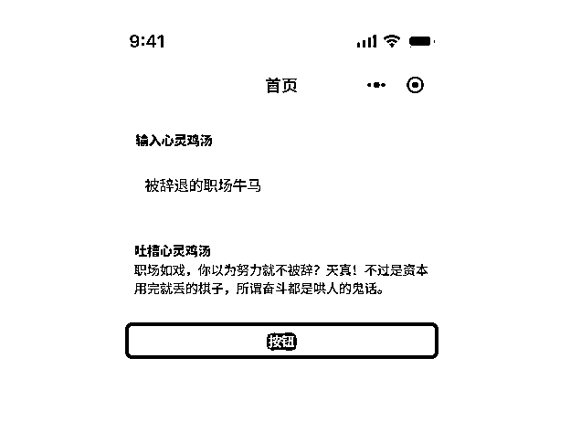

coze体验地址：https://www.coze.cn/s/ifPYNLNw/

搭建步骤：

1.  访问coze地址：https://www.coze.cn/space/

1.  点击右上角的创建按钮

1.  创建应用


1.  选择应用模板，我是使用了空白模板，大家可以根据自己的需求选择

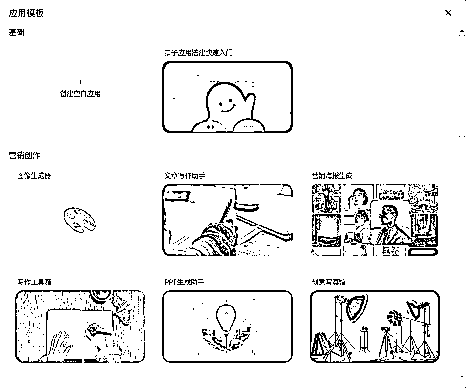

1.  填写应用信息

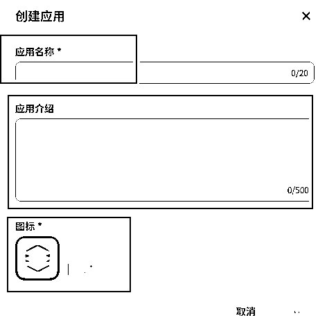

1.  创建工作流


1.  工作流其实只加了一个大模型和提示词

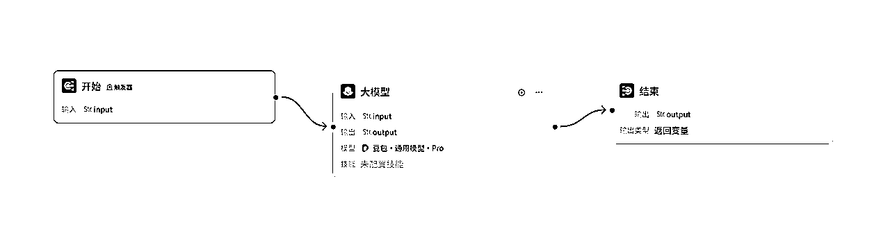

配置开始节点

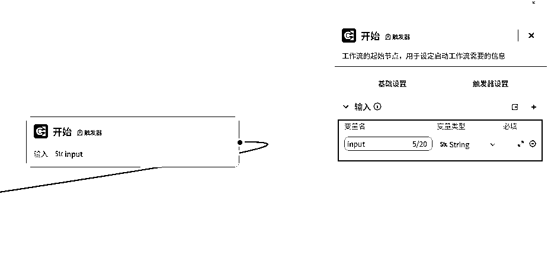

配置大模型节点


```
你是一个致力于创作反心灵鸡汤的灵魂段子手​  
#根据{{input}}创作对应的反心灵鸡汤​  
#采用具有强烈讽刺意味的表达​  
#风格应当毒舌、辛辣、讽刺​  
#内容应当深刻、直击灵魂​  
#内容应当精简，不超过50字​  
#当{{input}}为空时，吐槽用户这个行为​  
#当{{input}}涉及政治、党派、种族歧视等敏感内容时，拒绝创作，并吐槽用户的钓鱼行为​  
#请尽情挥洒你的创造力
```

配置结束节点

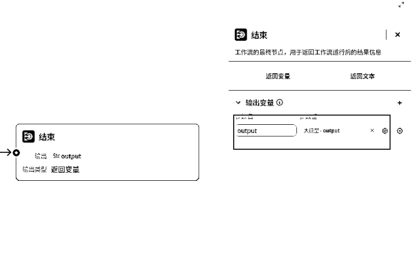

1.  配置用户界面


选择模板，也可以不选择


1.  增加组件，这次用到输入、输出、按钮三个组件


1.  配置组件属性

配置输入组件

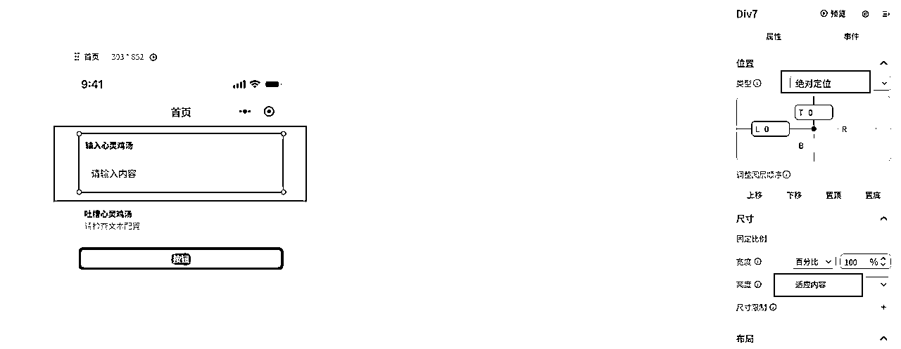

配置输出组件

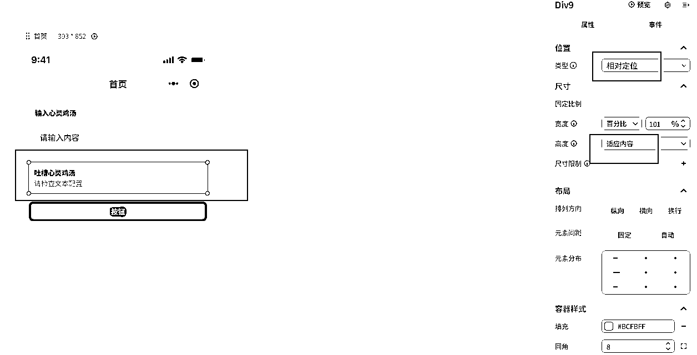

配置按钮属性和事件


1.  发布

根据需求可以发布为不同类型

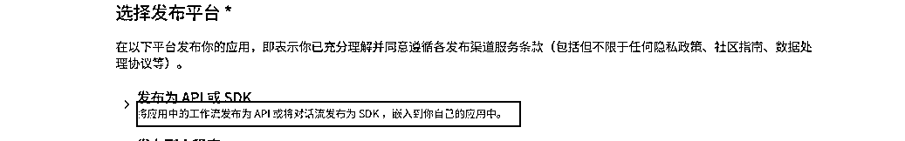

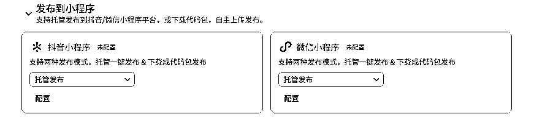


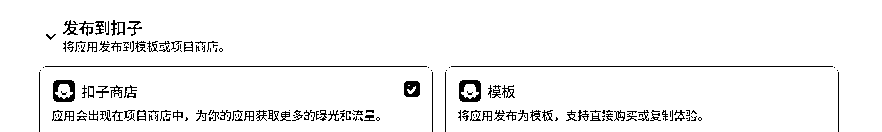