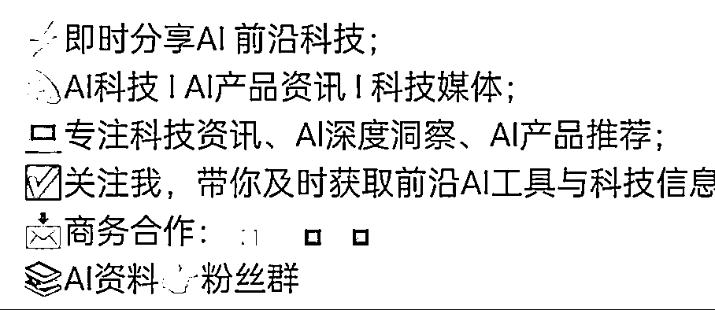
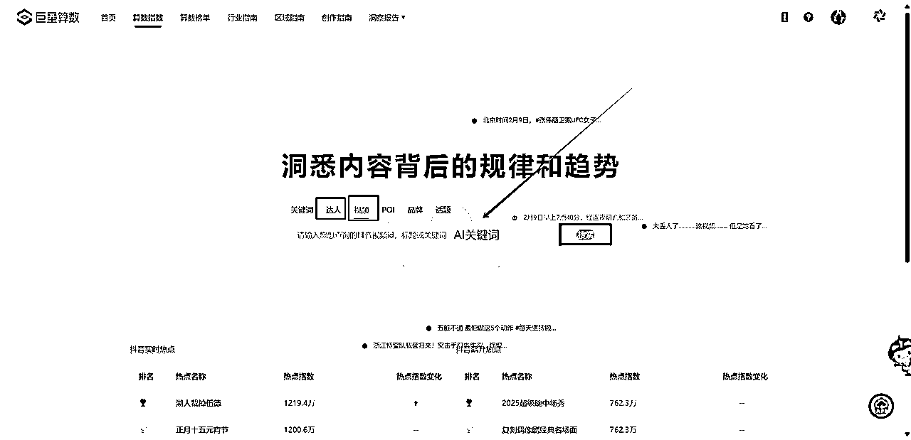

# 春节期间制作DeepSeek系列视频:从0到1的AI自媒体成长经验分享

> 来源：[https://dvsjtc6ey3f.feishu.cn/docx/Zg8QdSEphoKpzax97RBcHtm0nzh](https://dvsjtc6ey3f.feishu.cn/docx/Zg8QdSEphoKpzax97RBcHtm0nzh)

## 一、前言

前言：大家好，我是汤姆CC，04年的计算机大学生，最近在AI自媒体上取得了一些成绩：全网粉丝18w+【抖音涨粉14w+，小红书涨粉2w+，视频号涨粉2w+，私域400+】目前已经谈妥2个商单。本篇文章将介绍我做ai自媒体的经历、工作流程、创作经验和建议，希望能帮助更多想要进入这个领域的人少走弯路，欢迎大家评论交流

## 二、我的AI自媒体经历：

起步阶段（2024年7月）

去年一直感觉ai是风口，但是不知道自己怎么切入进去，然后我想到我可以试试做视频，虽然我可能不会成功，但是我可以掌握更多AI技能——费曼学习法，倒逼自己输出。我在使用过程中也积累了不少经验,也踩了很多坑。想着与其藏着掖着,不如把这些经验分享出来,帮助更多人少走弯路。

我最开始做我的AI账号是2024年7月28号，我发布了我的第一个作品，当时没进生财，都是自己瞎琢磨，也就是模仿人家，但是不知道什么定位，选题，封面这些，现在回过头来看着自己的作品就想笑。当时就是感觉可以做，一腔热血，反正发出来再说。然后做了一周，没啥起色，开学后，时间管理困难，收益不明显，就慢慢放着了。

转折期（2024年10月）

10月15日，老大的首个超级标发出来，让我再一次坚信这个机会前景巨大。那时进入生财一个多月，了解到了一些做账号的经验，于是我就搜集生财和网上其他各种自媒体经验帖子疯狂开始学习，学习怎么找选题，怎么做爆款的封面等等，粉丝慢慢破千，期间也是各种尝试，仿照赛文乔伊博主那种用手机拍，各种失败。

接着到了快期末考试，我就又放置了一段时间，但是我并没有放弃学习怎么做AI自媒体，我开始研究我喜欢博主的剪辑风格，开始像素级的拆解，慢慢分析做笔记，到了寒假，我开始把我学会的个性化背景设计，学习的剪辑技巧都用进去，依旧数据平平。

突破期（2025年春节）

在邻近过年的时候我更新了一期DeepSeek的视频，当时没啥反应，但是在过年那一天，我的小红书爆了，然后我觉得DeepSeek有机会，于是我除夕那天加班剪辑了一期关于DeepSeek本地部署的，在初二那天发布火了。

由于新年要去别人家拜年，我于是就背着电脑到亲戚家说我写作业，慢慢更新DeepSeek的相关视频，流量都还不错，我不敢断更，于是坚持一天发一个，也就涨了2000粉，后面因为全网都在讲如何流畅的使用DeepSeek，我其实过年那段时间更新了不少关于DeepSeek怎么流畅使用的做法，但是由于大量的同行也开始介入，感觉这个教程已经成红海了，反观像具体如何使用DeepSeek教程的人很少，于是我改做DeepSeek的具体使用技巧，做具体有价值的教程，于是就做了一个千万播放，三个百万播放。

没进生财前的作品

10月15日老大超级标上我的评论

进生财之后的各种尝试

从我的经历看出，我之前是一个毫无经验的普通大学生，靠着半年在生财和网上各种资料教程的学习，做出了一点点成绩，所以我觉得大家都可以做，因为这并没有什么高门槛。如果大家在做AI自媒体处于瓶颈期，请不要放弃，不下牌桌，改良作品，我相信你会在某一个时刻爆发出来的。

## 三、AI自媒体工作流程

### 1.定位：

做账号最重要的就是定位，怎么结合自身的优势做出合理的定位？

我的灵感来源是七天姐给我定位的方法，借助AI，借助AI辅助你思考，我们可以给AI说：你是生财有术的亦仁，你需要帮我做AI自媒体的定位。

然后你整理10个身份标签，这些标签会呈现对象是未来购买你的产品或者服务的人，本质是也就是我为什么人提供什么服务需要多少钱。

AI会根据你的身份给你建议，当然你需要客观判断这个说法到底对不对。

### 2.装饰账号和设钩子

装饰账号：账号称呼，头像，简介

账号名称：建议带上AI这个词

账号头像：

在即梦APP里面的灵感能找到不错的头像，根据灵感里面的提示词自行修改，然后跟自己结合就好，最好是头像和账号名称能够对应的上

简介：参考同行，结合自身，另外需要有“钩子”的影子，比如资料领取@小号

钩子：比如DeepSeek资料或者自己整理的工具箱

为不影响账号，建议粉丝群公告发布消息里面含有资料工具在主页获取信息，在主页@你的小号，通过小号把它转移到公众号上，为啥先导到公众号，一个是可以后面开通流量主，二是你如果人多加微信是加不上的，会流失，但是公众号可以挽回一些粉丝。

### 3.选题

选题决定了你的这个视频到底会不会有好的流量。那么怎么找好选题，怎么有源源不断的内容？那就是需要你参考对标建立属于自己的对标库

怎么建立自己的选题库？

信息来源：

(1)靠网感——刷视频、刷帖子

抖音，小红书，公众号都有搜索，搜素AI关键词【AI工具，AI绘画等等】相关内容，然后选择最近一周，爆过的内容肯定会再爆，所以可以参考它再结合你自己的特色，讲一些创新点或者你的感受，如果只是洗稿，我是不建议这么做的

（2）靠数据——数据分析平台

免费工具：算数指数-巨量算数，输入AI关键词，找低粉爆款视频

付费平台：蝉妈妈，灰豚等等，付费平台会让你更好的找到对标，大家可以去某鱼搜索日卡或者周卡

选题还有几个非常重要的地方：X，我们知道DeepSeek火首先是在外网火的，然后我们不止发现一次，在X上火的内容很大概率国内也火

即刻：在AI探索站，里面都是AI相关的内容，里面很多都是X的大v，所以内容也很不错

生财有术：在生财你已经领先全国90%的人，里面的风向标里都是圈友们筛选好的，重要的AI信息，尤其是中标的风向标，价值非常大

找到对标账号之后我们需要建立自己的对标库

对标库参考

| 维度 | 账号A | 账号B | 我的账号 | 差距分析 |
| 1.基础数据 |  |  |  |  |
| 粉丝数 |  |  |  |  |
| 视频总数 |  |  |  |  |
| 人设定位 |  |  |  |  |
| 更新频率 |  |  |  |  |
| 2.内容结构 |  |  |  |  |
| 主要领域 |  |  |  |  |
| 内容类型占比 |  |  |  |  |
| 选题方向 |  |  |  |  |
| 标题特点 |  |  |  |  |
| 封面风格 |  |  |  |  |
| 3.爆款分析 |  |  |  |  |
| 平均点赞数 |  |  |  |  |
| 爆款主题 |  |  |  |  |
| 爆款标题特征 |  |  |  |  |
| 爆款内容结构 |  |  |  |  |
| 4.变现方式 |  |  |  |  |
| 课程售卖 |  |  |  |  |
| 广告合作 |  |  |  |  |
| 咨询服务 |  |  |  |  |
| 其他收入 |  |  |  |  |
| 5.运营策略 |  |  |  |  |
| 互动方式 |  |  |  |  |
| 社群运营 |  |  |  |  |
| 话题营销 |  |  |  |  |
| 涨粉技巧 |  |  |  |  |
| 引流方式 |  |  |  |  |
| 6.特色亮点 |  |  |  |  |
| 讲解方式 |  |  |  |  |
| 独特优势 |  |  |  |  |

小技巧：

1.随时记录好的内容和灵感，你刷视频，刷帖子，有好的灵感是不是，我们微信打开面对面群聊，然后建立一个AI素材库的群，记录你觉得不错的素材，记录你的灵感

2.每周至少打开一次对标库，建议周末开始从里面找找不错的内容，确定你这一周的选题，然后每天开始对着选题做内容就好了，如果有合适的热点内容，我们就选择把之前准备好的素材往后延期

### 4.文案

有选题之后我们用AI进行头脑风暴和灵感获取，我首先是把我的思路给到AI，让它帮我分析，有没有好的思路让它优化，然后让它帮我润色文案。

文案开头的前3s需要有很大吸引力，这样才能需要客户往下看，文案内容要是有价值的内容，这样别人才会给你点赞转发这些。

标题文案库

| 类型 | 爆款文案示例 | 核心卖点 | 情感触发点 | 适用场景 |
| 技能提升型 | "一晚上搞定Midjourney，小白必学的3个赚钱技巧" | 速成、赚钱 | 焦虑、机会 | AI绘画教程 |
| 效率工具型 | "cursor帮我写代码，效率提升10倍的秘密" | 效率、省时 | 好奇、惊喜 | AI编程应用 |
| 创业机会型 | "月入10万的AI副业，我只用了这3个工具" | 收入、机会 | 渴望、希望 | AI创业分享 |
| 问题解决型 | "一键解决AI训练难题，小白都能看懂" | 简单、解决 | 困扰、释放 | 技术教程 |
| 趋势洞察型 | "未来5年最赚钱的AI岗位，第一名意想不到" | 前瞻、洞察 | 危机感、期待 | 行业分析 |

正文开场文案

| 场景 | 爆款开场示例 | 互动率 | 注意力抓取点 | 情感调动 | 应用技巧 |
| 故事型 | "上周我用AI做了一个决定，彻底改变了我的生活..." | 高 | 好奇心 | 共鸣 | 制造悬念 |
| 问题型 | "你有没有为AI学习烦恼过？今天我要分享..." | 中高 | 痛点 | 理解 | 直击痛点 |
| 数据型 | "最新数据：72%的AI学习者都在走弯路..." | 高 | 权威性 | 焦虑 | 数据支撑 |
| 反转型 | "别再盲目学AI了，我要说一个真相..." | 极高 | 反常识 | 震撼 | 制造反转 |

互动引导文案，注意有些平台不让引导粉丝互动，这个B站可以用

| 环节 | 文案模板 | 引导策略 | 情感触发 | 适用场景 |
| 评论区 | "你最想学习哪种AI技能？评论区告诉我" | 简单问答 | 参与感 | 话题互动 |
| 点赞 | "点赞收藏，避免错过最新AI实战教程" | 价值提示 | 不想错过 | 内容预告 |
| 分享 | "转发给需要的朋友，一起学习AI技能" | 社交传播 | 助人情怀 | 知识分享 |
| 私信 | "想要详细学习资料，私信'AI'领取" | 福利诱导 | 占便宜 | 资料派发 |

结尾文案

| 类型 | 文案示例 | 完播率 | 转化目标 | 情感召唤 | 行动指引 |
| 悬念型 | "下期将分享更劲爆的AI赚钱方法..." | 高 | 关注 | 期待感 | 预告下集 |
| 总结型 | "掌握这3点，AI学习不再迷茫..." | 中高 | 实践 | 成就感 | 行动指南 |
| 互动型 | "你还想学习什么AI技能？评论告诉我" | 中 | 互动 | 被重视感 | 收集需求 |

爆款要素分析

| 要素 | 重要性 | 情感诉求 | 转化效果 | 优化建议 |
| 标题吸引力 | ⭐⭐⭐⭐⭐ | 紧迫感 | 高 | 强化数字效果 |
| 开场共鸣 | ⭐⭐⭐⭐ | 认同感 | 中高 | 增加场景感 |
| 内容价值 | ⭐⭐⭐⭐⭐ | 获得感 | 高 | 具体可执行 |
| 情感触发 | ⭐⭐⭐⭐ | 共鸣感 | 中高 | 强化代入感 |
| Call to Action | ⭐⭐⭐⭐ | 行动感 | 高 | 明确指引 |

### 5.录制素材

电脑录制工具：Open Broadcaster Software | OBS

OBS高清录制调节：OBS不让截屏，所以大家用OBS录制不高清可以去搜“OBS高清录制教程”

声音克隆工具：海螺语音：让文字栩栩如“声”

这个海螺AI“海外版”的，目前免费，比较好用，可以克隆自己的声音，也可以克隆别人的声音，像之前风向标中标的一个账号，就是克隆别人声音，也很自然。【注意：需要魔法】

我们首先进入海螺AI的官网：海螺语音：让文字栩栩如“声”，然后选择Google登录，然后在主页选择Audio。

进入到Voices后，点击Create your voice Clone，上传几秒钟的音频，尽量要清晰一些，克隆的效果才好

然后回到“Text to Speech”，输入你配音的内容，选择自己的配音模型，然后点Generate Speech，稍等几分钟就好了

### 6.剪辑

普通人一开始剪辑不会很好，所以我们需要学会不断优化，不断借鉴对标的剪辑方法，然后搜索拆解，比如我看到一个画面是这个线条慢慢滑动出现，我就会去B站搜索：文章划线效果，学习这些剪辑的技巧

讲讲怎么找背景音乐，想参考某博主的音乐，网易云的听歌识曲识别不出来，因为杂音太重，我们首先下载它的视频，下载视频的工具：万能视频图片解析下载 - SnapAny，导入到剪映，然后分离音频，打开：团子AI - 人工智能在线工具箱，然后我们上传音频，然后我们等待它把声音分离出来，然后再打开网易云音乐的听歌识别曲很大概率能识别出来

### 7.封面设计

封面设计工具可画：闲鱼几块钱买个永久会员很划算，它的付费模板很不错，但是你需要根据你的账号，把你的元素融入进去，比如自己头像和名称

我们在制作封面时候可能会用到某软件的图标，我们使用Icon Fetcher | 图标获取器，这个工具不仅可以提取网页版的图标，也可以搜索APP名称，然后下载导入到可画中.

### 8.发布：

不同的平台用户是不一样的，所以尽量不要一键同步发送，根据平台的调性，选择合适的时间发，或者错开大v发的时间。我之前就是做完就发，然后有时候就是半夜发的，基本没啥人看，而且我发现有些大V就是半夜发的，由于大V粉丝基数大啊，我啥粉丝也没有，而且质量肯定比不上大V，更多的人会去看大v的视频，后面我会选择在白天时间，错开大V的发布时间，流量比之前好很多。

发布时候标题很重要，参考上文的表格，然后就是打标签，标签不是越多越好，打5个左右的精准标签，有热点跟热点关联起来。

### 9.变现方式

1.商单：首先是需要有广告位，你的视频里面必须有介绍产品的地方，比如AI工具里面介绍工具就是产品的广告位，实操教程里面演示的软件也是广告位。商单报价一般为粉丝的5%—12%，另外还有返点，全平台报价更高。

2.自己的付费产品：在七天姐的指导下，我开始做AI+IP的低客单价社群，打算后续从里面挖掘需求，做进阶产品

3.CPS别人的产品，比如生财，但是生财比较难转化，所以先把客户转成自己的低价客户，让客户慢慢发现生财的价值，然后再拉进来

4.为企业服务，给企业培训等等

5.工具代理：AI软件分销收益

## 四、数据复盘

（1）两秒跳出率：视频两秒跳出率越高，表示开头未能有效抓住用户注意力。

优化建议：

开场画面：确保第一帧画面具有视觉冲击力，可以使用鲜艳色彩、动态效果或悬疑设计

开场话术：使用疑问句、悬念或情感共鸣的开场白，在前3秒就传达核心价值

节奏把控：开场节奏要快而有力,避免过于缓慢的铺垫

（2）完播率：反映观众观看视频的完整程度，是衡量内容质量的重要指标

优化建议：

视频时长是否符合平台属性和用户习惯

内容结构是否紧凑,避免拖沓

是否在关键节点设置悬念维持观看兴趣

画面和声音质量是否专业

（3）互动数据：包括点赞、评论、转发等用户参与行为，高互动量表明内容具有共鸣点和话题性

优化建议

设置互动话题或悬念引导评论

在视频中设置互动环节

回复高质量评论促进互动

制作容易引发情感共鸣的内容

（4）转化效果：衡量视频带来的实际商业价值,如引流

优化建议:

确保视频主题与转化目标高度相关

在适当时机植入转化链接或引导

建立清晰的受众画像,提供精准内容

通过数据分析持续优化转化路径

## 五、AI自媒体创作经验与新人下场建议

### 1.创作初期常见问题及解决方案

#### （1）专注内容质量，不执着数据增长

不要因为初期账号增长缓慢而急躁。要保持耐心，就像我在做视频期间，坚持更新最终让我抓住了DeepSeek的风口。

接受成长期的低流量是必要的，把重心放在提升内容质量上，而不是过度关注数据。

不要因为担心自己不够专业而裹足不前。世界就是一个巨大的草台班子，与其纠结，不如先动手尝试。

#### （2）内容定位

避免"包罗万象"的错误。不要试图覆盖所有AI相关话题，这样会导致内容深度不够，特色不鲜明。

要找准目标受众，选择一个主平台深耕，再逐步扩展。

在追踪热点时保持平衡，要紧跟AI领域最新动态，但不要为了蹭热度而失去自己的特色。

#### （3）内容制作技巧

重视封面制作，特别是在小红书平台，好的封面能带来显著流量提升。

注意避免使用AI logo等易触发违规的元素，除非是平台重点支持的热点话题，例如最近DeepSeek

保持真诚，分享真实经历和感受，不要为了吸引眼球而哗众取宠。

专注于打造优质内容。一条好内容的效果抵得上10条以上普通内容，通常账号的80%-90%粉丝来自几条爆款作品。

### 2.多维度思考与布局

广告主视角

1.设计合适的广告位：作品需要广告位，更好的为产品做内容吸引用户

2.选择垂直赛道：之前我们发现，AI商单很多好像不是在科技博主，而是某些领域的垂直创作者，因为广告商需要的是客户，那么你的粉丝需要跟他们重合度高，所以建议选择某一个专业领域+AI

3.提供价值转化：给产品带来流量

平台视角：

平台希望的是有价值的内容，你的内容价值越大，那么平台越喜欢，会给你流量，流量好，商单跑不了，如果你是做引流，那就选择精准用户，不用在意爆款视频，所以建议大家提供更有价值的内容创作

用户视角

1.解决实际问题：能帮用户解决问题

2.简化学习门槛：不能太专业，要通俗易懂，不要太复杂化

3.提供实操价值：演示实操展示可信度

## 六、结尾

随着DeepSeek等国产大模型的持续突破，AI技术正在重塑各大应用平台的功能。这为AI领域的内容创作者带来了前所未有的机遇 —— 不仅有大量品牌需要专业的内容传播，更重要的是，随着个人影响力的提升，你的账号将成为一张独特的名片，为你带来更多优质的商业合作机会。当下正是入局的好时机。DeepSeek的热度依旧不减，市场对AI内容的需求与日俱增。在这个充满机遇的时刻，各位感兴趣的圈友可以参加3月份的AI+自媒体航海计划，相信通过持续的积累和努力，每个人都能在AI自媒体领域找到属于自己的一片天地。期待在航海计划中与你相遇，一起开启AI内容创作的精彩征程！