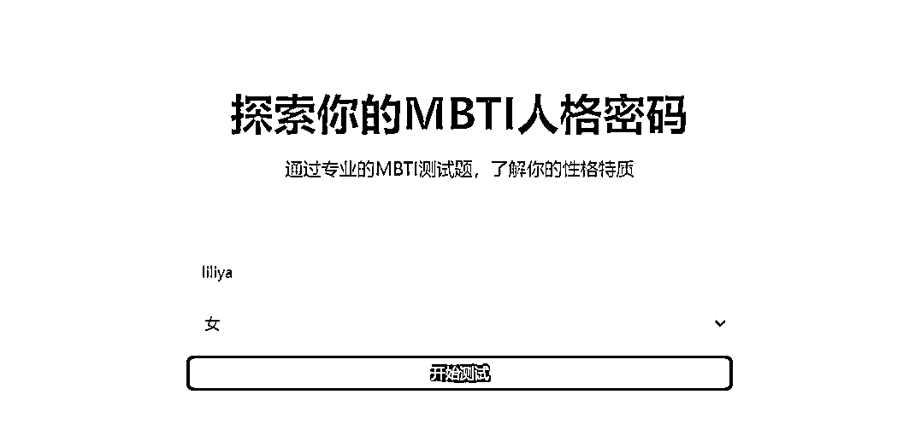
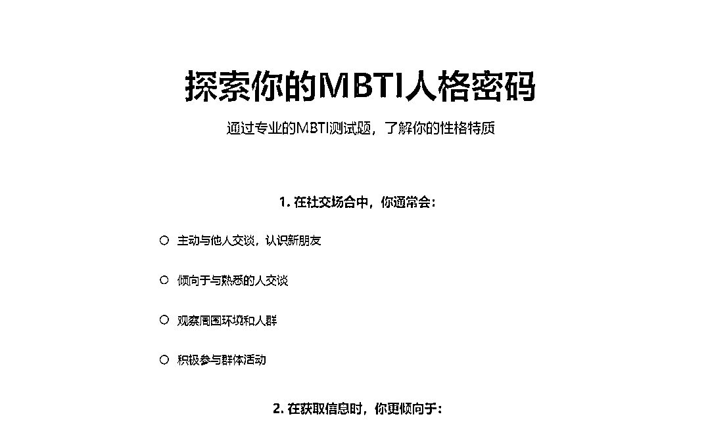

# 生财超级标

> 来源：[https://ekcwwaypjw.feishu.cn/docx/ZlEDd7FOZoTgJpxnolScNw6qneh](https://ekcwwaypjw.feishu.cn/docx/ZlEDd7FOZoTgJpxnolScNw6qneh)

大家好，我是liliya,生财4年圈友。自从亦仁发了超级标，我就开始了各种编程尝试，不得不说，没有编程基础的人，用AI成功做出程序来，特别是很多地方自己摸索解决了问题，信心爆棚了。好几次都手搓到两三点钟，为了解决某个参数问题，当网站发布成功、智能体运转良好，获得了一大票好评之后，这个获得感无以伦比。

目前已经做成的有3个，一个是扣子的“戴上圣诞帽”智能体（图生图）戴上圣诞帽 - 扣子 AI 智能体 https://www.coze.cn/store/agent/7451895885619167251?bot_id=true&bid=6eqjm55gk5000，一个根据小排老师的文章用BOLT做的网页版的MBTI性格测试https://cute-rabanadas-b8fad5.netlify.app；现在正在做的是野菩萨老师做的输入一个词语，输出一张明信片的文生图智能体如梦-明信片生成器 - 扣子 AI 智能体 https://www.coze.cn/store/agent/7460556694247129115?bot_id=true&bid=6f2teda2s4g0b，已经发布，部署到微信小程序上。#小程序://小微智能体/68tJgiaTyEUSkXn

关于开发学习的过程，请移步飞书观看‌：

# 戴上圣诞帽的智能体

去年12月20几号看到了公众号文章、小红书上有好几个大神都发表了给头像戴上圣诞帽的文章或视频，觉得很有意思，就试着做了一下。开始是直接用即梦给大家画，后来发现太麻烦了，完成一个人的头像修改，就要至少收图、画图、发图三个步骤。

刚好又看到卡兹克及其他博主的帖子，花了几个小时的时间，做了一个扣子的智能体，这个过程很曲折，遇到了很多问题，也花了好几个小时才搞定，毕竟写帖子不可能细到每一个步骤和选项，所以报错、出不来、选不对参数，各种各样的问题都出来过。也逐步理解了什么叫“智能体”，什么叫“应用”。

作为最早一批使用AI的玩家，连这个都不知道，确实有点惭愧，不过我是文科生，能够把midjourney搞清楚玩明白，还画得不错，就已经自豪了，现在敢于尝试学习AI编程，无论做成什么样子，都已经是一个巨大的进步了。

圣诞节前玩儿了一下，朋友们都换上了头像。开在群里发，朋友圈发，给家人朋友发，一大堆人都换上了圣诞帽的头像。戴上圣诞帽 - 扣子 AI 智能体 https://www.coze.cn/store/agent/7451895885619167251?bot_id=true&bid=6eqjm55gk5000

把这个做出来以后，信心大涨，又刷了一些B站的视频，对扣子的工作流基本逻辑理解了。以前老听AI绘画的老师说工作流、工作流，其实我一直没有搞懂到底什么是工作流，只有真的上手做了，才理解了这个词的字面和背后的含义。

# 2.MBTI性格测试

这个部分使用了小排老师帖子里的全部内容，甚至连他的开发建议也直接copy了，只为降低难度，毕竟我是一个编程小白哈哈，小排老师威武。

当然中间也对话了很多次，用自然语言提出修改意见，bolt就劈里啪啦地出代码修改，真的很震撼。

https://cute-rabanadas-b8fad5.netlify.app

这个MBTI的测试功能豆包上已经有了。具体的变现模式我还不太懂，持续摸索中。

# 3.明信片生成器

野兽派印象派的文生图，有36个绘画风格，明亮的色块，对比强烈的风格，我把这个智能体叫做明信片。#小程序://小微智能体/68tJgiaTyEUSkXn

输入“一只威武的狮子”，

输入“一只猫”

根据野菩萨提供的工作流，先复刻，再修改。他在6月份就发布了制作的视频，我一直都没看懂，直到最近做了一些程序之后，就开始能看懂并上手模仿了。前面两个小成果在做的时候没有做及时的记录，所以写文章的时候只能挑我记得的写，这个明信片在做的时候就打算分享在星球里的，所以一边做就一边截图记录，所以内容比较详细琐碎，也帮我更好复盘。

1.打开扣子

2.建立图片工作流，现在图像工作流合并的工作流里了，图像流名称：postcard,图像流描述“当用户输入想要的物品时，随机调用生成不同风格的图片”。

3.增加节点：增加图片生成的节点，调用通用图片生成模型

4.设置开始参数

在开始节点中定义两个变量用户的“风格”user_style,和“内容”object

5.设置图像节点参数：

图片比例选：16:9，横屏尺寸图片

参数名：style,object

提示词：用两个双层大括号，扩上style,和object,代表在提示词栏目中通过{{}}调用图片的风格和物品

负向提示词：用的是我们通用的几个词，calligraphy,nsfw,blur,sign,border

6.设置结果节点的输出变量参数，把生成图片作为输出

7.试运行，object输入“cat”,style输入“henri mattise”(亨利.马蒂斯，法国野兽派画家，认为绘画要表达主观的感受，不作明暗表现，常大胆地应用平涂式的强烈原色和弯曲起伏的轮廓线，并将描绘的景物予以简化，画面颇富于装饰性)

8.测试后发布。

9.创建智能体：

10.添加刚才制作的图像流撰写提示词。

11.持续优化提示词，这个智能体的核心提示词是36组艺术家风格词汇，由大预言模型随机选择一个，实现多样性。

12.设置开场白预设问题：

中间还出了好几次错误，工作流引用的名称写错了，导致我一直在对话，但是就是没有图像出来。

工作流的名称修改好了以后，运行就正常了，调用的都是比较小众的艺术家风格，比市场上那些油腻的AI画好不知道多少倍。

发布，先在扣子商店发布，其他平台要研究一下。

13.扣子商店成功发布：如梦-明信片生成器 - 扣子 AI 智能体 https://www.coze.cn/store/agent/7460556694247129115?bot_id=true&bid=6f2teda2s4g0b

14.微信小程序-小微智能体

pat_C1TRME1VzCRhNdIxpg8UcWRTG4B41d7Zn6I2irRObs73LMtxm5nTZ1gsJozwxq7e

13.打开微信小程序“小微智能体”，输入VID即可使这个明信片生成器：6222411811

这个小程序是公众号“杰克船长的AIGC”开发的，使用方法也是从他文章里copy过来的，至少解决了直接使用的问题，不用经过微信小程序上架的复杂程序，可以来试用提建议哦！现在的问题就是出图以后需要重新打开链接才可以看，有点繁琐。

在扣子上还在不断的调试修改，如果大神哪位大神能提出修改意见的话，就万分感谢呀。

14.变现的考虑：一是把这个小程序部署在我的公众号上；二是在朋友圈和AI社群分享；三是跟其他的社群合作分销；四是做笔记发到小红书和视频号推广。

以上就是本次AI超级标的全部内容啦！感谢亦仁，感谢小排老师！