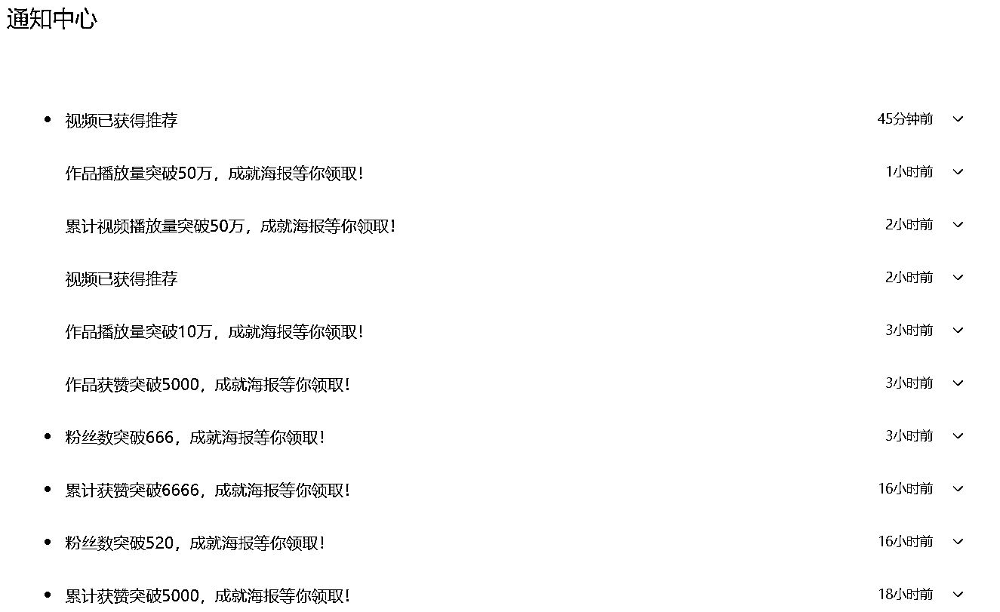

# （喂饭教程-可能没那么喂饭版）热门视频二剪+ai 生成动漫画+视频号广告分成项目

> 原文：[`www.yuque.com/for_lazy/zhoubao/opmvuxtuy47l526x`](https://www.yuque.com/for_lazy/zhoubao/opmvuxtuy47l526x)

## (精华帖)(188 赞)（喂饭教程-可能没那么喂饭版）热门视频二剪+ai 生成动漫画+视频号广告分成项目

作者： Rand0mWalk

日期：2025-03-17

看到亦仁老大发的这个风向标：[#风向标
热门视频二剪+a...-知识星球](https://wx.zsxq.com/group/1824528822/topic/8858115581141512)

从前天开始测试，到今天已经可以看到收益了，在风向标群里简单聊了之后还是来写个帖子详细说一下自己做的流程，给没有头绪的伙伴更清晰的思路。

目前做的第三天，昨天开通了分成计划，涨粉 500+，今天有一个视频已经开始有收益了：

从亦仁老大风向标的标题就能拆出来这个项目的关键步骤：

热门视频二剪（素材收集、去重）

漫画转绘（视频素材里抽帧图片转绘成手绘或者动漫风格）

开通视频号广告分成（满 100 粉、发布 10 条及以上视频、内容符合视频号规范）

1、热门素材收集/下载

收集

在抖音或者视频号搜索如下内容：

#画一个世界 视频号里搜

#感人瞬间

#感动瞬间

#泪目

有这几个就够了，多刷一刷点点赞，后续推送的就都是类似内容了。

高效率的收集素材我目前是没事儿就刷一刷，看到万赞以上的就顺手转发到自己的单人群里放着，等集中时间做后续处理。

有一些截图，后续移步飞书吧：[`fiazd3hbob.feishu.cn/docx/M8J1dvi9aoB8wvx9xHqcED1Dnhi`](https://fiazd3hbob.feishu.cn/docx/M8J1dvi9aoB8wvx9xHqcED1Dnhi)

* * *

评论区：

半空中 : 这种的弹出镜人认证怎么解决？有办法吗？

亦仁 : 来开一期 mini 航海？

Rand0mWalk : [哇]受宠若惊啊，竟然被老大邀请开 mini 航海了，当然可以了，不过咋开啊？

亦仁 : 我安排人来联系你。

Rand0mWalk : 弹了再说呗

Rand0mWalk : 好嘞

Yhx : 这种弹了就没了

许帅 : 视频号弹出镜人认证，我记得是有三条通路的，1、是出镜人本人认证，一般用的网络素材人物图片之类的，这条路走不通的，2、数字人的授权证明，3、官方的认证（个人或企业）。我之前试过可以通过拍多个真人出镜视频，走官方的个人认证去解掉（认证 XX 博主、XX 自媒体之类的），认证一过就秒解，但不是可以多次使用的方法，治标不治本，只能说还得研究如何不违规。