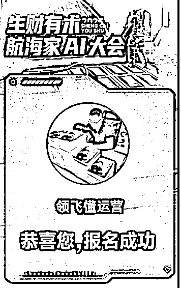

# 不做“啃”项目的牛马（中介思维发财术）

> 原文：[`www.yuque.com/for_lazy/zhoubao/evb1726f7r1mwawv`](https://www.yuque.com/for_lazy/zhoubao/evb1726f7r1mwawv)

## (20 赞)不做“啃”项目的牛马（中介思维发财术）

作者： 领飞懂运营

日期：2025-03-21

**大家好，我是领飞！**

一个生财，潜水的航海家和传术师！

这篇文章，让你感受不一样利用生财赚钱的道法。

（只代表个人观念，生财第九年，给大家续费的理由，如何用好生财的高手，超价值）

先理解下面这三句话，来引发后面的话题！

*有时候，学会一个项目操作，真的太没意思了；*

_  _

*真不如，学会玩“人性”*

_  _

*你理解人性了，也就不缺流量了。*

_  _

_  _

***如【Ai 写作赚钱】***

** _  _**

*这个项目真的很小，小的不能在小，好像烂大街。*

_  _

*但就是有人年入百万，我认识的就好几个。*

_  _

*可是，在领飞眼里，他们越年入 100 万，我越高兴。*

_  _

*他年入 100 万，不是没有道理，不是胡乱割韭菜，肯定交付系统都很成熟；他们越成熟，我越卖他们更舒服。*

_  _

*不学技术，不学项目，只需明白事理，用脑子赚钱。*

_  _

*这也是赚钱之道。*

_  _

_  _

*踏踏实实学门 Ai 技术，最好*

_  _

*先把技术转化生产力，哪怕有一点点的小成绩都行。*

_  _

*赚钱，找谁也能学，哪也能学到，一大把。*

_  _

*但是转化生产力的*** *“道法”，*** *一般人真还教不了；*

_  _

*不当*** *牛马*** *天天“啃”项目，中介财商赚钱术，一般人真还落地不了。*

_  _

总结一下，我对这三句话的看法，深思到你要不要做项目？我从三个维度讲：

**第一个维度：复制**

**  **

我们在互联网赚钱，都是在复制，复制一个成功的案例，而已；但复制都是现象性，也就存在了周期。

一个项目火了，去复制

一个热点火了，去复制

一个人火了，去复制

一个产品火了，去复制

一条视频火了，去复制

。。。。。

复制是一条快速路，便捷的路，通往“成功”不二法宝。

你想要快速拿到结果，复制也是不二之选。

**我们要思考？**

**  **

你真正会复制吗？有复制的能力吗？

所以，真正会复制，真的是一门技术，不是表面复制，而是复制灵魂。

通过复制别人的灵魂，才能真正实现自我的突破。

不是，纯粹的完全抄袭，这就太低级了，这种低级像个傻子，绝对是突破不了的。

我喜欢复制，但我从来不照搬照抄，而是在他的基础之上增加自己的灵魂，这就让别人看不出来了。

*我阅读了 100 篇关于【Ai 赚钱】的项目文章*

_  _

*我学习了 100 个实操【Ai 赚钱】项目的课程*

_  _

*我连接了 100 个专注【Ai 赚钱】项目的老师*

_  _

你不看，你不学，你不连接，那从何谈起复制呢？

他们都是高手，他们都是开拓者，我自己不如他们，我自己也迷茫，也焦虑。

那就复制他们一个就好了，一个复制成功，再复制下一个，你也就成为了开拓的高手。（这句话，你细品）

复制别人的成功，什么时候都不晚，自己啥也不是的阶段，摸石头过河就傻的可爱了。

不是可爱，是愚蠢。

所以呢，不用思考再三，先复制一个，开干，最为重要。

**怎么选？**

**  **

很简单，找一个你觉得可靠的平台，或者大佬，他经常推荐的就好。

**第二个维度：实操**

**  **

如果说复制，就是把某一个具体的项目进行实操，天天实操，劳心劳累的实操。

这个会成功吗？

五五开吧，看你的觉悟有多少，看你的决心有多高。

决心，真的很重要！这需要自我打压，自我心态调节。

多数人，放弃也就是因为决心不够；

所以你想一想，你放弃了，你要放弃了，你放弃后，看到一个群的他人成功了，你是不是因为决心不够。

**那么“实操过程”的痛苦，** 一个项目从 0 到 1 的枯燥、压力、焦虑、徘徊、懈怠，影响了你的决心。

实操一个项目，他是一个系统，有：引流方法，内容创作，账号发布，引导交流，成交话术，私域运营，朋友圈发文。。。。。

上面每一个点，都存在问题，都会遇到困难，比如：为什么引流不好，账号封号，转化不高，内容创作匮乏。。。。

**所以呢！**

**  **

实操真的很痛苦，对于初学的个人创业者，更痛苦。

但，你从来没有一个实操成功过的经验，那也永远赚不到钱。

很多人，学项目，报名项目，都是自嗨。

学习是快乐的，很嗨，实操就嗨不起来，说的是不是你呢？

**实操一个成熟的项目，怎么能成功？**

**  **

就是减少：引流方法，内容创作，账号发布，引导交流，成交话术，私域运营，朋友圈发文。。。。。等这些系统环节。

你减少的越多，是不是就越容易？

**举个例子：**

**  **

1、网红名人 IP 切片项目：2 个环节，剪辑发内容，多运营账号

2、短剧推广：2 个环节，剪辑发内容，多运营账号

3、AI 写作爆文：3 个环节，会 AI 写做，找爆款能力，多账号运营

4、小红书卖资料：多个环节，选题创作内容，运营账号，引流私域，话术成交，复购策略。。。

。。。。。

这里，大家就明白了吧，环节越少的项目，越注重多发，才能赚大钱；环节越多的项目，越注重个人能力，才能赚大钱。

只要卖产品，与人交流，环节越多，项目系统越繁琐。

只要靠平台，不与人交流，环节越少，项目系统越简单。

**核心区分：产品，人**

一个赚钱的高手，都是在不停的打磨产品，迭代产品，与人多多的交际。

**好比：**

你想赚更多的钱，【短剧推广项目】你就必须去卖，教别人卖，或组团协作分钱；这就多了很多环节。

**思考：你实操什么？**

**  **

**第三个维度：借势**

**  **

我一直追求“高利润”的项目，或者产品，这对个人素质要求很高；

凡是越小的项目，价格越低，越追求数量，个人创业精力是有限的，也就是时间的有限。

**比如：**

**  **

操作【AI 写作爆文项目】，我一天能写多少篇文章，做多少个号，才能日入过 1000。

所以，很多人，就提出来了，学项目，不如卖项目赚钱，卖一个【AI 写作爆文项目】1980 元，日入就过千了，如果卖 2 个呢。

但你要卖，是不是综合素质就要求很多环节呢？

（配合上面思考，重点在下面）

也不妄自菲薄，之前也这么做的卖项目，但是我觉得还是低级了，这也就是我今天写文章的核心：再高级一点的【中介思维发财术】

卖项目，自己是不是要实操一遍，再拿去卖呢？

自己实操，自己交付方为人道，提升交付有一个好口碑。

绝大多数人，也都这么追求的。

所以，你想想，你追求项目，去实操一个项目，结果是不是为了卖呢。

**如果你为了卖，没毛病！**

**  **

重点在于，你实操一个项目能力有了，你多个环节运营能力有了。

你是不是就一通百通了呢！我写的书《套公式创业》一万个项目就是一个，讲的也就是这个道理。

所以，实操一个项目，卖一个项目，都是对自己不缺乏“赚钱能力”的掌握。

**OK! 好像没提到“借势”**

**  **

这里我卖个官司，细品我下面讲的内容。

你为什么要蹭流量？

你为什么要去高端局？

你为什么要加盟品牌？

你为什么要跟名人合影？

这就叫借势，让自己更值钱，你值钱了，你就卖的东西更值钱。

**（记住上面这句话）**

有一个高手，卖 1980 元【AI 写作爆文项目】的培训，他一年赚 100 万，还有赚 200 万的更高手；

他们越高，你越高兴，因为：他们培训成熟，交付成熟，影响力成熟

他们再卖项目，你就别卖了，你卖他们好了。

OK！通篇理解内容，卖项目好像也是小道了，快速致富路上，又多一个选择，环节少，路径短，见效快。

**总结：卖人也是项目**

**  **

**  **

**  **

**  **

**五年没出门了，我这人小地方的深山小道士，能见到生财仰慕的高手，想想都开心。**

**  **

**感谢生财，众人拾柴火焰高。**

**  **

**  ****领飞，往期生财加精文章：**

[0、【倒爷（中介）发财术】合作别人才有意思，大家一起分钱](https://articles.zsxq.com/id_wus55cjxodtw.html)

[1、如何通过【创业知识博主】原始积累 800 万](https://articles.zsxq.com/id_sckk8imjgqgi.html)

[2、【长期暴利项目】中介思维极致，年入百万项目方法](https://articles.zsxq.com/id_cd7wutqqqa61.html)

[3、【卖服务+卖产品】个人轻资产运营，价值“百万”商业模式](https://articles.zsxq.com/id_msepc8pc7r5m.html)

[4、五年用闲钱买房赚了 50 万，小城市房产投资经验，纯干货！！！](https://articles.zsxq.com/id_s0n9vvaawd1j.html)

[5、【先拼数量，再保质量】一个素人做 IP 写小作文，108 营销方法论](https://articles.zsxq.com/id_2q75vclbo9rx.html)

[6、如何用你的“热爱”，选择创业项目方向](https://articles.zsxq.com/id_vcqr0bwozsqa.html)

[7、【中介思维赚钱术】卖人，卖项目，链接高手一起卖](https://articles.zsxq.com/id_n2uw328j6swl.html)

[8、【大龄职场破局副业】6 个入局赛道解析，长期的搞钱策略（2 万字）](https://articles.zsxq.com/id_n3ddt25tm66o.html)

* * *

评论区：

易芝 AI|RPA 版 : 哥，你这内容是对"富在术数，不在劳身"更加深刻的理解呢

领飞懂运营 : 还是你有文化[强]