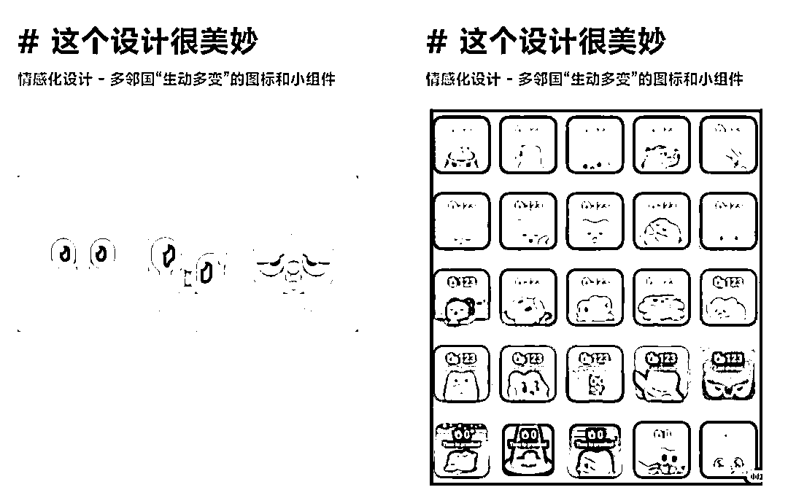
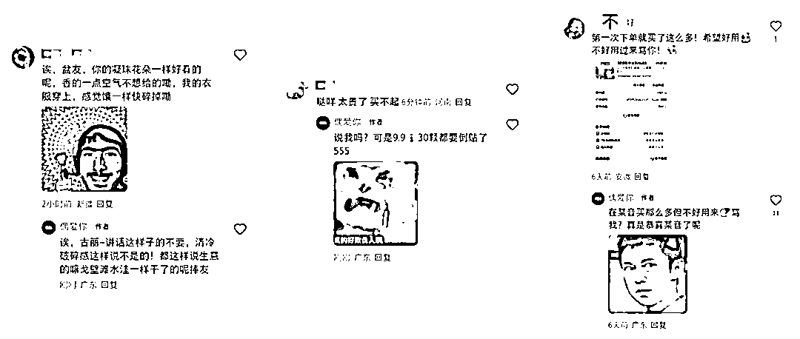

# 2025 年小红书运营必修课：活人感

> 原文：[`www.yuque.com/for_lazy/zhoubao/ax713zgvc4gwcs6r`](https://www.yuque.com/for_lazy/zhoubao/ax713zgvc4gwcs6r)

## (47 赞)2025 年小红书运营必修课：活人感

作者： 林卿 LinQ

日期：2025-03-17

之前就在朋友圈里反复提及现在做小红书，不管是做品牌，还是做账号，都需要有“活人感”，所以今天用这篇文章来详细阐述一下，我所理解的“活人感”是什么、为什么需要有“活人感”，以及怎么让品牌/账号有“活人感”。

**01.“活人感”是什么**

我所理解的“活人感”是

1.  像个“活人”

2.  不把用户看成“流量”，而是朋友（活人）

3.  不过分职业化、不过分模版化、不端着、不装

4.  是鲜活的、有情绪的、是真实且真诚的

5.  是有瑕疵、有粗糙感的

6.  ……

嗯 😐 这样阐述可能略微有一点点抽象，不过没关系，如果没办法通过我的表述来理解“活人感”是什么的话，不妨换个方式，想想你自己在看到什么内容、看到谁的时候，会觉得 TA 是有“活人感”的？！

而那个触动你的点，让你觉得 TA 是有“活人感”的点，就是“活人感”的具像化表现。

当然，你也可以继续往下阅读，阅读完“怎么让品牌/账号有活人感”的时候，说不定就有答案啦。

**02.为什么需要有“活人感”**

因为小红书内容同质化、模版化严重；

因为 AI 时代，“活人”变得稀缺，而我们渴望温度、渴望被看见、渴望真情实感的链接与共鸣；

因为人们更愿意追随一个活生生的人，而非一家公司……

**03.怎么让品牌/账号有“活人感”**

在小红书上，品牌和账号本质上是由内容构成的，而让品牌/账号有“活人感”其实就是把账号、把品牌看成“活人”来经营，就是通过的内容和运营细节把“活人感”具像化！

3.1.讲人话，尽可能口语化、大白话，用我们日常生活对话交流的语言。

3.2.多表达自己的真实感受、自己的真实情绪，多走心。

最最最简单的方式，就是

1.  用感官来描述，看到什么、听到什么、摸到什么、闻到什么……

2.  多用语气词，多用略微有点浮夸、有情绪张力的措辞。

当然，也不一定需要用内容来表达，也可以是别的形式，比如之前多邻国的图标变化……

3.3.用人格化的语言风格来阐述内容，比如调皮可爱、严肃正经……

当然，也不只是内容，还有评论区，多回复用户的评论；

用人格化的语言风格跟用户在评论区互动，跟 TA 们打成一篇，成为 TA 们的精神嘴替。

3.4.在内容里给所有用户加个称呼，比如老婆们、电子闺闺、臭宝……再配合第一人称视角来阐述内容，这样就有一些许对话感啦，就像跟用户对话交流一样。

3.5.适当暴露自己的不完美

大家不喜欢一个完美的人/品牌，也压根就没有完美的人/品牌，适当暴露自己的不完美，适当有瑕疵、有粗糙感会让大家感到真实、真诚，而真实且真诚不就是“活人感”嘛，不就是必杀技嘛？！

3.6.持续给予外界反馈、持续给外界汇报

其实就是养成系，而养成系之所以有“活人感”，就是因为有参与感、因为事事有回应，因为用户在看到这些内容的时候，有种在云养成、云养娃的感觉，甚至在看到品牌/账号养成之后，还会有一种家有孩子初长成的感觉。

而养成系最最最简单的方式就是持续记录，

1.  记录品牌/产品/品牌主理人的点点滴滴

2.  记录新品研发概念，用活人感的逻辑絮絮叨叨地阐述

3.  记录新品打样的测试效果、翻车案例和迭代调整

4.  记录新品拍摄花絮

5.  ……

持续记录的过程其实也是讲故事、建立品牌叙事体系的过程，所以可以在记录的过程贯彻品牌理念、贯彻价值主张，通过这种方式潜移默化地和用户一起建立共识。

3.7.做个真正意义上“活人”

会偷懒，偶尔光明正大地水水内容；

有“怪癖”，偶尔晒一下自己的“怪癖”，全是帅哥、美女的收藏专辑；

有突发奇想的临时起意，偶尔写点发癫文学、晒点小伙伴真人表情包……

最后，“活人感”不是讨好用户，而是做自己、是塑造品牌/账号的生命力，用真实的人类温度和用户建立情感链接。

* * *

评论区：

暂无评论