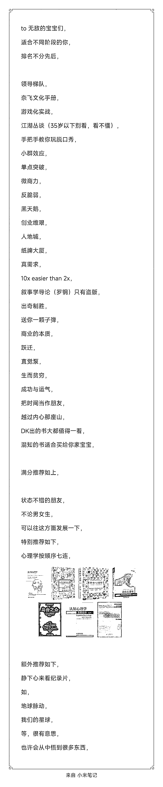

# （播客文字稿）对话涛哥：300 家实体店店主分享，如何在小红书有效获客

> 原文：[`www.yuque.com/for_lazy/zhoubao/rzb1q0ge5mw2z6lm`](https://www.yuque.com/for_lazy/zhoubao/rzb1q0ge5mw2z6lm)

## (17 赞)（播客文字稿）对话涛哥：300 家实体店店主分享，如何在小红书有效获客

作者： 谢无敌🐱闪亮猫传媒

日期：2025-03-21

hello，大家好，我是谢无敌，闪亮猫传媒创始人。23 年跟着生财的播客航海做了一档个人节目——【谢无敌茶访谈】，佛系运营下涨了一万多的粉丝。

做这档节目的初衷，是想对话更多小红书的操盘手，同时给听友们分享不同项目的流量玩法。

前段时间，我邀请了生财大师兄涛哥来聊一聊关于关于 2025 年小红书平台的流量与趋势。内容非常干货，在对话的过程中我个人觉得收获很大，所以也想分享给更多的圈友。

我们采用了互相提问的形式，希望分享的内容能对大家有帮助。

以下为播客整理稿，如果对阅读体验有要求的话，可以移步飞书链接 [`h4zarzxodm.feishu.cn/docx/GvPfdwl5hob3wax1rUTcKUpynae?from=from_copylink`](https://h4zarzxodm.feishu.cn/docx/GvPfdwl5hob3wax1rUTcKUpynae?from=from_copylink)

## **PART1：底层逻辑篇**

#### **无敌问涛哥：在小红书上，粉丝数量对创作者重要吗？与其他平台有何不同？值得投入时间吗？**

#### **

**

#### **涛哥观点：**

**粉丝数量与流量逻辑**

“粉丝数真不是核心，小红书的流量分发压根不看这个，人家玩的是内容匹配度。哪怕你是个千粉小号，只要内容扎到 25-50 岁高知女性的痛点，转化照样能碾压大 V。你看那些真实素人账号，发条健身教程都能爆单，为啥？平台就爱这种精准种草，权重给得比技术流账号还高。”

**平台差异：抖音 vs 小红书**

“抖音是泛流量逻辑，甭管男女老少先圈进来再带货，但小红书是精准狙击。比如家居行业，咱后台数据一看，小红书用户七成是 25-50 岁女性，抖音上全是 30-60 岁大老爷们。人群不对路子，你发再多视频也白搭——在小红书做深度种草，就跟钓鱼得找准鱼窝一个道理。”

**红利期与入局时机**

“现在冲小红书绝对血赚！成本低、流量准，红利期至少还能吃半年到 9 个月。你看无敌妹妹团队，普通人发点对比图都能日入四位数，这要搁抖音，没个百万粉根本玩不转。趁现在平台还在扶持新人，抓紧占坑，等算法卷成抖音那样，黄花菜都凉了。”

#### **涛哥问无敌：小红书与抖音的最大区别？**

#### **

**

#### **无敌观点：**

**人群差异**

"我跟你说，抖音的用户画像基本是 30-60 岁的老爷们儿，而小红书呢？清一色高消费力的精准小姐姐！比如家居行业，抖音上全是 30-60 岁大老爷们刷装修，小红书可是 25-50 岁女性用户扎堆，这帮人既能种草还能掏钱！"

**内容形式**

"你们知道吗？抖音就靠短视频硬刚，但小红书花样多了去了！图文、Live 图、短视频随便玩，尤其新手搞不定视频的，直接上图文！我们带过几千个博主，图文起号的概率最高，因为小姐姐们就爱看这种干货图！
而且一个人就能搞定，不用像抖音还得养主播、编导、剪辑三个角色！"

**营销逻辑**

"抖音玩的是大海捞鱼，先搞泛流量再筛客户，累死个人！小红书直接精准打击——你要卖美妆就对着爱美的姑娘写内容，人家刷到就是想要的人！比如我们有个减肥博主，专门教新手小白健身，标题直接写《晨跑 VS 夜跑哪个掉秤快》，精准拿捏刚入坑的减肥党！"

**建议**

"选平台先看你的客群在哪！小红书特别适合离钱近的赛道，比如美妆护肤、珠宝首饰、家居这些，因为平台上一堆有钱有闲的小姐姐！你看那些做家居设计的，在小红书接个全屋定制单子，客户直接私信问价，比抖音从几万泛流量里筛客户快多了！"

#### **无敌问涛哥：小红书适合谁赚钱？**

#### **涛哥观点：**

**关于适用人群** ：

“小红书这地儿适合的人可太广了，大学生、职场人、创业者、本地商家、品牌方全都能玩，特别是那些‘离钱近’的领域。比如本地推拿馆、中医馆、自习室这种线下服务，还有高客单价的珠宝、房产这些需要线索获客的赛道。你看广州有个读书会，单链接在小红书卖了六个亿。就连二线城市的本地生活玩家，像成都、武汉这些地方，竞争少得跟空城似的，全是机会。”

**关于核心逻辑** ：

“咱得在有鱼的地方钓鱼！啥意思？就是找准目标用户扎堆儿的地儿。小红书现在就是个大鱼塘，70%的流量来自搜索，你深耕一个下拉词，比如‘广州海琴湾自习室’，难度低但精准度高，客户自己送上门。抖音那算法把利润榨得只剩六个点，但小红书还处于红利期，普通人站对位置就能白捡流量，比如搜‘飞机盒’这种冷门词，算法都没覆盖到，你占住就是赚。”

#### **涛哥问无敌：小红书有哪些赚钱方式？如何选择？**

#### **

**

#### **无敌观点：**

**博主/买手** ：

"如果你擅长写笔记或者拍图，先做博主接广告，但变现比较单一。但要是你能出镜、会唠嗑，直接升级成买手！买手带货方式更多元，笔记带货、直播带货、探店合作都能玩，平台还给流量扶持。比如去年买手大会官方砸了 500 亿流量，现在入局红利还在。不过得会选货盘，比如家居、美妆、母婴这些主流赛道，像我们有个学员在义乌自带供应链，转型买手后月入轻松过万"
。

**电商玩家** ：

"电商分两种人：一种是品牌型，慢慢养账号，比如某品牌专注小红书一年变现几千万；另一种是卖货型，快速测爆款，靠自然流量和投放爆单。但记住，供应链是命根子！80%做不起来的人都是供应链拉垮。比如深圳做珍珠的跑源头产地，义乌小商品老板合作一件代发，价格压到最低还能合规发货"
。

**线索获客** ：

"三类人最适合搞线索：第一卖高客单价的，比如高定珠宝商在小红书引流，私域成交客单价直接破万；第二本地服务的，像中医馆发推拿笔记，自习室发学习场景，同城流量精准得很；第三敏感赛道玩家，医美金融这些平台明面不让做？偷偷搞！有个案例，医美机构用素人号种草，引流到微信直播转化，月新增客户 300+"
。

#### **涛哥问无敌：新手老板的最小团队模型？**

#### **

**

#### **无敌观点：**

我跟你们说啊，小红书这块儿要想玩得转，必须搞明白这个"1+1 模型"。一个运营不管是全职还是兼职，都能轻松带 2-3 个账号，每周更 4 篇笔记，每篇也就花俩小时。老板自己每天抽半小时搞内容，带俩号完全没问题，再叠个兼职就能做到 4-8 号矩阵，像我们带新人都是先让他们做选题库和账号调研，1-2 天就摸清赛道了。

成本这块儿更划算，全职在北上广深也就 6-8k 底薪，兼职的话 2000-5000 都能搞定，性价比超高。我之前带团队就发现，把内容流程整理成 SOP 太关键了！新人上来先自己找选题，我每周统一审核思路，根本不用天天盯着看稿子。

#### **无敌问涛哥：小红书流量如何最大化？为何重要？**

#### **

**

#### **涛哥观点：**

**关于流量核心作用：**

“流量的核心就俩字儿——精准获客！低成本、高转化才是王道。你看啊，比如我卖减肥产品，一个女人五年前在减肥，五年后大概率还在减。这时候只要你把她加到私域，迈过了信任门槛，就能反复收割：普拉提、瑜伽、美妆、医美...
这些需求她全有！这就叫客户终身价值（LTV）。”

“再说私域沉淀多重要？我跟吴迪同时直播成交 1000 单，客单价都是 298。但我卖的是减肥产品，他卖的是零食日化。结果呢？我的用户能反复‘洗’，他的用户买完就完了。为啥？因为减肥客户终身都在找解决方案啊！”

**关于转化关键：**

“转化第一定律：内容必须匹配用户需求！比如减肥笔记，新手最关心‘七天瘦五斤’这种傻瓜教程，你写专业健身动作给谁看？”

“第二招是持续发布吃长尾复利。小红书笔记跟抖音不一样，抖音流量 24 小时就没了，但小红书的笔记像商铺，发完过几个月还有人搜到。比如钢琴培训，一条线索值五六百，你一篇笔记加 10 个人，等于赚了五六千。发得越多，关键词占得越狠，流量入口全被你吃干净！”

## **PART2：爆款与创作篇**

#### **无敌问涛哥：小红书爆文是概率吗？如何看爆款原因？**

#### **涛哥观点：**

**爆款确实看概率，但咱有招儿！**

“爆款是概率，你可以理解为一个词叫‘爆率’。比如我这种入门级玩家，爆率大概 80 分之 1，发 80 篇笔记才爆一篇。无敌老师可能 50 篇爆一篇，但再高也够呛。想提升爆率？关键是把选题搞精准，比如潘展乐火了，立马蹭热点写《潘展乐 190》这种内容，90%靠大数据分析，10%靠个人体感敏感度。再比如做健身内容，别整那些专业动作，得瞄准‘健身新手痛点’，像晨跑 VS 夜跑哪个好？封面放俩美女对比，中间加个 VS，内容直接给 30 天食谱，这种选题鲜嫩韭菜一割一个准。”

**平台就爱‘稳定输出’的老铁！**

“平台优先推荐的是优质稳定输出的创作者。啥叫优质稳定？你得像发工资一样日更 3 到 5 篇，从每天 2 篇怼到 5 篇，最后成高阶选手天天五更。别总纠结赛道对不对，先怼量！普通人没量就别谈技巧，量上去了平台自然给你流量，就跟健身房练肌肉一样，量堆够了才有质变。再说底层逻辑，小红书的算法就俩字——匹配！标题关键词、内容、受众得严丝合缝，比如做‘练肩六个黄金动作’，不如改成‘林黛玉也能练出直角肩’，这才匹配刚想减肥的小白。”

#### **涛哥问无敌：跑通流量闭环的关键因素？**

#### **无敌观点：**

**选对项目** ：

“选赛道必须离钱近！像美妆、家居这些，小红书上一堆有钱小姐姐，搞这些变现最快。你看去年流行美拉德风格的家居，今年巴恩风又火了，我刷到国外趋势立马加到我的选题库，结果流量蹭蹭涨。还有我那个朋友，做成长博主教人搞钱小技巧，涨粉贼猛，后来直接开社群变现，这就是切细分赛道的威力！”

**能力匹配** ：

“做博主得有内容力，电商玩家必须死磕供应链，搞线索获客的必须养销售团队！供应链不行？80%做电商的都死在这！比如义乌的人天生有供应链优势，直接和源头老板合作，拿低价还一件代发，挂到店管家平台自动发货，价格、品控全搞定。线索获客更得玩命抓销售，我见过付费投流的团队，一天上百个资料粉，但没销售跟进转化，最后还得靠私域直播补救，累成狗还没效果！”

**效率工具** ：

善用 AI 工具，尤其是今年的 Ai 趋势下，团队的各个板块完全可以精简成 1 个核心员工➕1 套流程闭环的 Ai 效率工具，减少了管理和沟通的成本，赚钱的效率也会提升很多。

#### **涛哥问无敌：实体店老板的高效打法周期？**

#### **

**

#### **无敌观点：**

1.  **三阶段模型** ：

2.  **首月：**

3.  “第一个月咱们就得先跑通自然流的单号模型，说白了就是靠自然流量赚钱，同时摸索付费流的潜力。小红书笔记本身就是个商铺，你持续发笔记能吃到长尾复利，有些笔记发完几个月甚至几年还有人看，这和抖音那种流量先爆再跌的逻辑不一样。”

5.  **次月：**

6.  “第二个月重点是把自然流和付费流结合起来，比如上信息流广告。这时候你得算清楚每个客户大概花多少钱能搞到手，投出去的钱能不能赚回来。记住啊，平台刚开放投放的时候成本最低，越往后成本越高，所以抓紧窗口期。”

8.  **三月：**

9.  “到第三个月，老板得开始搞团队矩阵了。多账号铺开，把行业关键词锁死。这时候要招人、筛团队，线上业务得规模化。别抠搜账号，账号就是个成本，矩阵化才能稳稳吃透行业流量。”

#### **无敌问涛哥：如何提升创作效率？**

#### **

**

#### **涛哥观点：**

**关于复利思维** ：

“你得学会把一篇内容拆成不同形态分发，比如一个文案能变成长文、图文、PPT、短视频、问答、音频、知识点卡片……共用一套内容打天下，这叫单内容多形态分发。你看小红书上的笔记，就跟商铺似的，每篇都是独立入口。有些笔记发完几个月甚至几年后还能持续来流量，这就是长尾复利，和抖音那种发完流量就往下掉的逻辑不一样。”

**关于工具提效** ：

“抠脚本抠到天荒地老那不叫认真，叫效率低！我现在用 AI 工具搞选题、生成脚本，时间成本直接砍了 70%。工具用得好才是本事，像豆包、kimi 这些 AI 辅助，加上大数据分析优化内容，别人一周能怼几十篇，你吭哧吭哧才憋出几篇，流量咋抢得过人家？”

## **PART3：引流获客**

#### **涛哥问无敌：团队推崇的引流打法？**

#### **

**

#### **无敌观点：**

**付费投放派** ：

"商家单纯的靠自然流去变现，实现稳定的赚钱是不现实的。现在小红书主推付费商业投放，你单靠自然流赚钱流量不稳定，可能十篇里爆一篇，但结合付费流每天赚的钱都能预算到。每个平台最开始投放成本最低，越往后成本越高，所以得抓紧算清楚 ROI 多投放！"

**人设 IP 派** ：

"我自己做‘设计师彭老师’这种高价值 IP，吸精准用户主动咨询。你得有经历、能稳定更新，每周 3-5 次，数据好了品牌才愿意合作。记住，内容是获取流量的唯一方式，流量在内容之间流动。小红书要的是稳定输出的优质创作者，高阶选手每天五更，平台绝对给你流量！"

**低成本引流派** ：

"这玩法只适合初期测试，搞个人号营销，前期流量高，但平台一识别账号就废了，生命周期短。过去两年还有人用 A 中必收派搞素人种草，引流到淘宝赚差价，但现在连自媒体老炮都不提这招了！"

## **PART4：品牌篇**

#### **无敌问涛哥：品牌投放偏好大博主还是小博主？**

#### **

**

#### **涛哥观点：**

**关于趋势** ：

“现在很多大品牌都在分散投小博主，追求‘品效合一’，但有些大品牌因为流程太长，没办法只能继续砸钱投头部博主。不过说实话，匹配营销目标的头部博主其实不多，所以有时候钱花得也不一定值。比如你看像 B 站和小红书，品牌更愿意接受只种草不追求即时转化，先和用户一起成长。”

**关于核心逻辑** ：

“品牌得和用户一起长大，别急着直接卖货。你看高端品牌怎么玩的？用小样、赠品把人吸引到私域里囤着，慢慢养。用户信任你了，后面复购、转介绍都是水到渠成的事。种草这事儿比直接转化重要多了，比如减肥药和护肤品，用户今天买你的，过段时间还能再买普拉提课、健身器材，甚至全家都找你——这就是长期价值。”

## **PART5：2025 年展望**

#### **无敌问涛哥：看好的小红书赚钱项目**

#### **

**

#### **涛哥观点：**

**本地生活**

"二线城市像成都、武汉、长沙这些地方，本地生活玩家在小红书上竞争少得很，完全就是空无一人的战场！你看广州的'酒鬼地图'，随便搜个下拉词流量就爆了，线上导流到线下简直是跨界乱杀。一个人搞两个号都行，但真想锁住本地流量，得上十个号起步，团队必须跟上，就跟在万达开铺子一样，笔记就是你的海报，发得越多长尾复利越猛。"

**高客单价服务**

"十几万的高定珠宝、几十万的房产，在小红书没法直接成交，但搞线索获客一抓一个准！还有高端教育、留学这些，客户意向强得要命，一条线索成本五六百，带来十个人咨询就血赚。本地中医馆、自习室也是同理，线下服务必须的生意，线上获客效率拉满。"

**垂直电商**

"电商成败全看供应链！深圳的珍珠、义乌的小商品，直接跑产地两三天，一堆老板抢着给你一件代发，价格低还合规。挂个店管家系统，出单自动发货，小红书直播配上源头货，爆款自然来。没供应链就别碰电商，光会做内容顶个屁用！"

**IP 私域化**

"美妆和健康客户最值钱！第一次卖她减肥药，下次推普拉提、瑜伽，私域里反复'洗'，LTV 高到离谱。流量不是三点水的'流'，是'留住'的留！加到微信的粉才是真资产，其他数据都是虚的。你看那些卖护肤品的，私域复购率吊打平台成交，这才是穿越周期的本事！"

## **涛哥推荐书单**

**"读书是普通人穿透圈层的唯一路径。我甚至认为人与人的差距，其实本质上就是信息量的差距"** 。——涛哥

* * *

评论区：

暂无评论