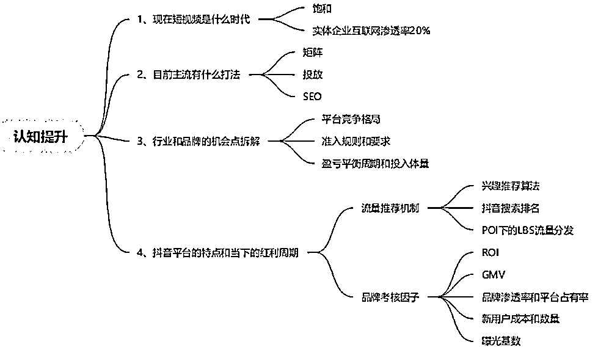
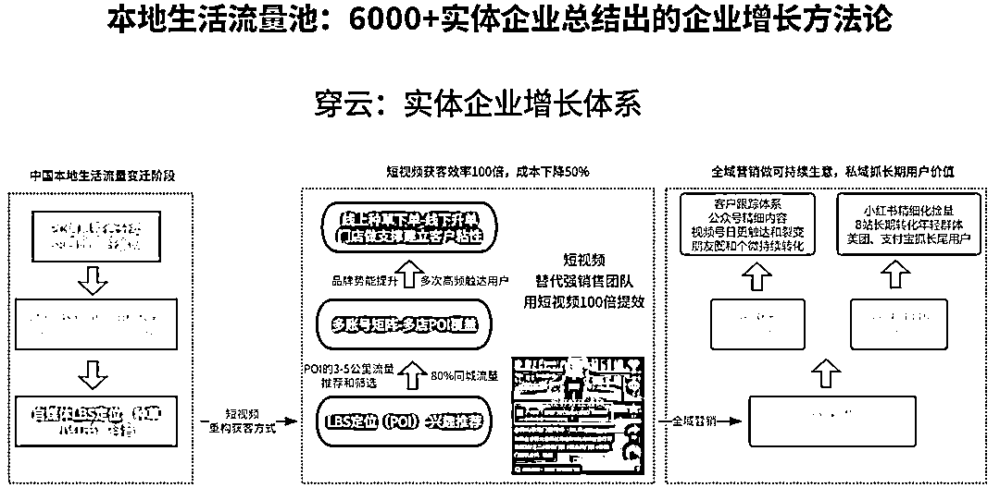

# 实体老板必看的一张图｜搞不定抖音的根源：思维方式的转变

> 原文：[`www.yuque.com/for_lazy/zhoubao/rpn29858g6e1057d`](https://www.yuque.com/for_lazy/zhoubao/rpn29858g6e1057d)

## (12 赞)实体老板必看的一张图｜搞不定抖音的根源：思维方式的转变

作者： 楚川

日期：2025-03-22

2024 年写了一张内部培训图：如何与实体行业客户沟通，需要达成什么样的认知才能合作，才有潜力获得可持续增长。

以上图总结出**传统老板进入短视频领域需要达成的核心共识是** ：短视频已进入存量竞争时代，必须基于平台算法规则制定精细化运营策略，而非依赖传统行业的流量思维。

**1、存量竞争共识（短视频现状）**

**  **

**市场饱和性：** 随着抖音、小红书的崛起，实体企业互联网渗透率从 10%，已经超过 20%。互联网的渗透率在实体行业的极限可能是介于 30-50%之间，**意味着短视频从增量市场转向存量博弈。**

**  **

**流量新增长通道** ：电商类的流量已经触顶，平台竞争格局固化。哪怕是看上去稳定无比的电商模型，在当下也会在 3-6 个月内发生成本增长，**因此一定需要找到有 3 年以上红利的通道** 。抖音作为第一个做短视频本地生活的平台，将流量区域化，只要是生意有侧重城市，均可用 POI+LBS 流量分发机制中寻找差异化入口，拿到增长：**效率的提升是 100 倍以上** 。

**用户成本激增：** 新用户获取成本持续上涨，要求从"拉新"转向"留量运营"。绝大部分老板参与短视频获客的第一反应都是“试一试”，在流量侧的产品、服务均未匹配到最好，那在转化后的第一层留存就出现大问题。**而这些数据又会决定一家公司要不要再做短视频，要不要持续投入，这一点基本上是企业转型很致命的犯错点** 。

**2、算法驱动共识（平台特性）**

**  **

平台的流量有两种：推荐和搜索，那就需要从这两个角度中做突破。首先要理解推荐机制的变化，其次是一定会崛起的抖音搜索流量，2 个维度是综合型提升 ROI，而不能再用简单的 ROI 看单条视频、单账号的产出。

**推荐机制革命** ：必须深刻理解"兴趣推荐算法＞粉丝订阅"的底层逻辑。单条内容质量＞账号历史权重；短视频发布数量、累积播放量、短视频分发账号数量构成核心考核因子，而不是传统的爆款论。

**搜索流量重构：** 抖音搜索排名机制正在重塑用户行为。短视频 SEO 成为新战场；关键词布局需结合热点词与行业长尾词，这里有长文做拆解。[抖音本地生活搜索流量（SEO）深度运营完整策略：重构商家增长的第二曲线—从算法逻辑到商业闭环](https://articles.zsxq.com/id_r17xnnwmen0o.html)。

**3、长期主义共识（机会点拆解）**

**  **

**投入周期认知：需接受 6-12 个月的盈亏平衡周期** 。**品牌渗透率与平台占有率需时间累积** ，一定不再是一场直播、一条短视频带火一个品牌，而是要做长期经营；**GMV 增长应配合 ROI 动态优化** ，没有一套标准的方法，一个固定投入的钱获客，而是基于一个区间，以及配合品牌战略做动态调整，这应该是一个月、一周来做分析。

**矩阵化运营必要性** ：通过**多账号布局对冲算法波动** ，这是当下的趋势。用不同账号覆盖差异化人群标签，把核心关键词做占领；内容形式需适配平台红利周期，如当下直播权重提升、年中活动的宣发、不同阶段品牌力与内容的匹配，这些是要做深度思考，而非一招鲜。

**4、数据化经营共识（考核维度）**

**  **

**从"曝光量"到"有效转化"的指标升级** ：楚川一直有一个理论，**“单一爆品顶天立地，短视频矩阵铺天盖地”** ，老板需要关注 UV 价值而非单纯播放量。对楚川来说“10 个播放量也能成交”，这才是正理。

**全盘思考短视频的线下实体收益** ：在考核短视频的效益上从内容质量、数量、投放这是最浅一层思考；**整体需要看短视频带来的品牌提升、门店自然客流量、持续复购客户的心智变化** 。举个例子，我们的客户在抖音的直接线索成交只有 200 多万的增量，但因为看到视频直接联系、找上门的客户成交量是前者的 7 倍；楚川投资的餐饮店，流量再怎么打，抖音成交占比只能做到 30%，但美团和自然流量就是持续增长，无法界定单一维度的产值。

传统老板必须达成"**短视频是算法驱动的系统工程** "共识，**抛弃"短期爆量"幻想** ，建立包含内容生产、数据运营、矩阵布局的完整作战体系。这需要同步升级组织架构（设立内容中台）、重建 KPI 体系（弱化 GMV，强化互动指标）、培养平台化运营思维，方能在存量竞争中获取持续增长。

我是楚川，一线实战派，只讲真话的生意人，做实体行业的增长保姆。

* * *

评论区：

暂无评论