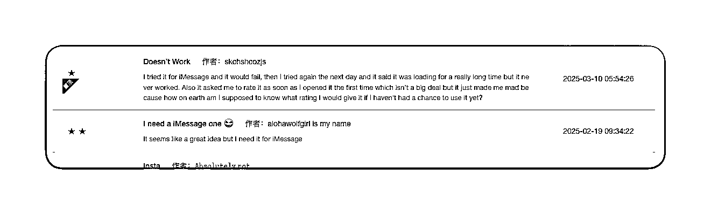
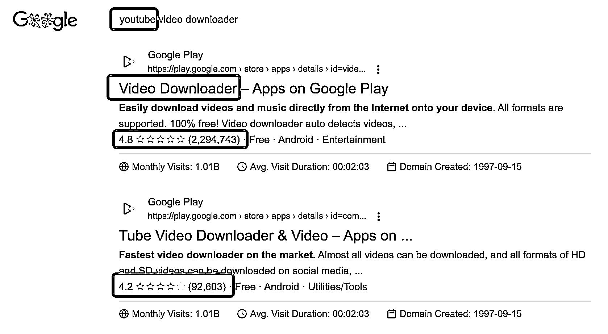
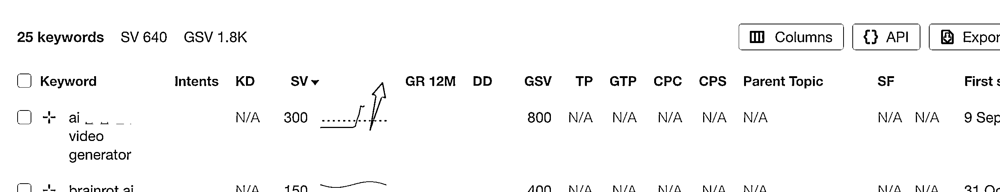

# 独立开发如何赚得比工资多：从选品到营销，干就完了！

> 原文：[`www.yuque.com/for_lazy/zhoubao/um290z6ncod6unw1`](https://www.yuque.com/for_lazy/zhoubao/um290z6ncod6unw1)

## (精华帖)(243 赞)独立开发如何赚得比工资多：从选品到营销，干就完了！

作者： 子木（二哥）

日期：2025-03-17

原创不易，首发生财有术。转载请注明出处，感谢支持！争取多图解胜千言

这篇文章整理来自一次跟良渚独立开发者的深聊一个小时。主题就是给想靠出海 & 技术赚钱的独立开发者（或者小团队）准备的，目标 - 搞个能稳定月入 1
万美刀的几个小产品。不吹不黑，纯干货，直接上重点！

## 1. 心态篇 - 先想清楚：你到底是想“做个产品”还是“赚到钱”？

很多开发者上来就拍脑袋：“我有个好想法！” 但真相是，好想法 ≠ 能赚钱。所以，别自己闭门造车，先搞清楚：

✅ 谁愿意为你的产品掏钱？（目标用户是谁？）

✅ 别人现在用什么解决方案？（有没有竞品？用户为啥要换你的？）

✅ 有没有足够大的市场？刚不刚需，高不高频（别做太冷门的东西，赚不到钱）

## 2. 需求篇 - 如何选品？如何洞察需求？

如何找到好需求？好项目？“抄”不丢人，找个软柿子捏！选品的本质是找 “有需求但竞品不够好” 的机会。为啥呢？竞品 =
优秀的同行，你不是最聪明的，好的需求肯定早有被解决方案。找到他，洞察对应的需求

具体方法：

### 🔍 方法 1：看差评，找用户骂啥！

去 App Store、Google Play、Product Hunt、Reddit 、Toolify
收入榜单这些地方，看别人对竞品的差评，看看他们骂得最多的点，就是你优化的方向  

又比如：Toolify AI 产品，收入排行榜 [`www.toolify.ai/Best-AI-Tools-revenue`](https://www.toolify.ai/Best-AI-Tools-revenue)

关注 **Toolify 收入排行榜**  **200～500 名** 的 AI 工具，这些工具增长潜力大、竞争相对较小，适合作为独立开发者的选品参考

### 🔍 方法 2：围绕大平台做“周边”

只要你找到 Top 200 个大平台 x 每个平台不会做、但用户很想要的东西，你就赢一半了！那起码有 1 万个需求！但记住顺着平台做周边，长期主义！

比如：

• 微信不做多开？— 立刻有人做了“多开工具”

• Notion 功能不够强？— 各种 Notion 插件出来了

• ChatGPT 不能自动整理摘要？— 立刻就有人做 AI 摘要工具

### 🔍 方法 3：看新趋势，抢“SEO 新词”

谷歌 70% 的搜索需求还没有好答案！用 Google Trends、关键词规划师（Google Ads）、Ahrefs 这些工具，找到新趋势，先占坑！

• 看词，是不是描述 非通用场景需求

• 看趋势，如 Ahrefs 下图是新需求就重点关注

比如：

• “AI 换脸” 火了，马上有人做 AI 视频换脸工具

• “GPT 语音克隆” 需求大，马上有人做 AI 语音克隆 SaaS

## 3. 成本篇 - 做小而美的产品，成本控制住！

选定需求方向后，别想着搞个大而全的产品，一上来就 MVP（最小可行产品），能让人付钱就行。

✅ 成本评估：服务器、API 费用、时间成本

✅ 开发周期：最好 1 周到 1 个月搞出 MVP

✅ 功能聚焦：别做一堆没人用的功能，专注核心需求

## 4. 营销篇 - 如何低成本让产品卖出去？（卖比做更重要！）

产品出来了，接下来就是怎么让用户看到你。方法有很多，但核心原则是 “找用户在哪，就去哪”，别傻等！

### 💰 方法 1：低成本测试市场（免费，冷启动）

• 加入 Facebook 群组、Reddit 相关话题区，直接发帖、私信潜在用户

• 在 Indie Hackers、Hacker News、Product Hunt 这些社区发帖推广

• 进 Telegram、Discord 群，找到目标用户，看看他们的真实需求

💡 核心思路：早期不要想着“卖”，先“交流”，把自己当成用户，用内容干货经验 & 教程分享，获取真实用户反馈！

### 📢 方法 2：SEO + 内容营销（免费，长期流量）

新的搜索关键词选对了，等于捡钱！单长期还是专注内容

• 找用户会搜的问题，写文章回答（比如 “怎么自动剪辑短视频？”）

• 写 How-To 教程，里面植入自己的产品（比如 “教你用 AI 快速换脸”）

• 在 Quora、Reddit、知乎等平台回答问题，带流量回自己网站

💡 重点：SEO 见效慢，但一旦做起来就是“被动流量”，越早开始越好！

### 🎯 方法 3：红人营销（小成本，短期爆发流量）

找跟你产品相关的 KOL 让他们推荐你的产品！

• 小红人（粉丝 1 万 - 5 万）性价比最高，一般愿意合作

• 可以用 免费赠送、分成、付费推广 的方式合作

• 平台可以找 YouTube、TikTok、Twitter、Instagram

💡 重点：找真正的垂直红人！别找流量大但不精准的 KOL！效果好继续追加筹码！

### 💸 方法 4：付费广告（中后期）

如果你有预算，可以用 Google Ads、Facebook Ads 测试市场反应，看看流量进来后有没有人愿意付费。

✅ 投放小预算测试（<card type="inline" name="math" value="data:%7B%22code%22%3A%2210~%22%2C%22id%22%3A%22toLbC%22%7D">50），看转化率</card>

✅ 发现有效的广告后，逐步加大预算

## 5. 策略篇 - 如何判断什么时候可以加大投入？

产品推广出去后，你需要看数据，决定是不是值得加大投入。关键指标：

✅ 注册转化率：访问你网站的人，有多少注册了？（>5% 就不错）

✅ 付费转化率：注册用户里，有多少人愿意付钱？（>2% 就不错）

✅ 用户反馈：用户有没有自发分享？有没有骂你的产品哪里不行？

💡 如果指标 OK，就可以考虑加大推广预算；如果不行，先优化产品再推！

## 结语

💡 总结一下核心思路：

✅ 别闷头写代码，先搞清楚市场有没有需求

✅  **找软柿子捏，别跟大厂硬刚，围绕大平台做周边**

✅ 快速上线 MVP，能卖出去才是好产品

✅  **低成本启动，利用 SEO、红人、社群、广告做推广**

✅ 看数据，产品卖得动才加大投入，不行就优化！

世界上最赚钱的 软件， 不是技术最牛的，而是最懂“用户 + 营销” 的。所以，独立开发者们，别只盯着代码，多研究点营销，真的能赚到钱！

月入 1 万美刀，其实是个可实现的小目标！很多人觉得 “独立开发赚钱很难”，但其实这是个 方法 + 认知 的问题。

看看我为啥大篇幅写了第一个实战篇章「选品」，因为天时地利人和，你运气差多做几个，你运气好选品好，那就起飞 🚀

> 原创不易，首发生财有术。转载请注明出处，感谢支持！，争取多图解胜千言

* * *

评论区：

时而 : 很干很落地

子木（二哥） : 谢谢 ～

Cheer 林悦己 : 学会了一句：“抄”不丢人，找软柿子捏[OK]

子木（二哥） : 其他不学，专学经典

云山 : 非常有启发，感谢！

子木（二哥） : 多交流

思齐 : 很受启发，谢谢分享

子木（二哥） : 多交流