# 跨境电商出海迈对第一步很关键

> 原文：[`www.yuque.com/for_lazy/zhoubao/kb06hsir5y12yipe`](https://www.yuque.com/for_lazy/zhoubao/kb06hsir5y12yipe)

## (精华帖)(53 赞)跨境电商出海迈对第一步很关键

作者： 跨境杨少

日期：2025-03-18

**最近收到央视《开拓者》栏目邀请，分享中小企业出海相关经验，这是我准备的相关分享的文字版。**

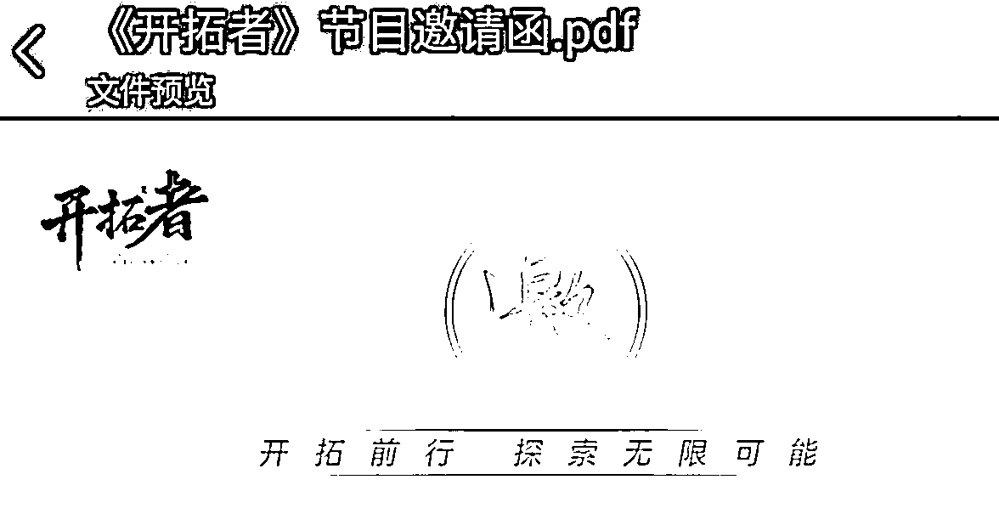

目前跨境电商出海选择很多，一是市场选择多，有东南亚，欧美，中东，日韩，拉美，俄罗斯等等；二是平台选择多，有 TIKTOK，亚马逊，虾皮，temu，mercado，国际站/速卖通，etsy，coupon，乐天，沃尔玛等等十分众多，当然还有独立站，聊单等等，那么对中小企业及个体来说，在选择市场及平台、渠道时，是否有相对更适合自己的，更应优先考虑的，更容易成功的，**这是跨境知识分享中的一个盲点，因为正确答案一定是因企业而异，因产品而异的。**

**  **

现状是往往哪个跨境博主/服务商熟悉哪一块就建议你做哪一块，比如做 TIKTOK 的服务商会建议你：这是“风口”，“最大的流量池”，“不做你就要被淘汰了”，事实上并不是所有企业/卖家都适合从 TIKTOK 切入，有的企业会出现事倍功半甚至无用功的结果，这是因为并没有完全站在出海企业及其产品特性的角度考虑问题，所以效果参差不齐。

作为一个技术出身（全球 TOP3 机器人公司前研发工程师）的 15 年跨境老卖家，以及亚马逊官方领航计划“王牌导师”，我几乎接触过大部分市场及平台，今年我提出“有效出海”概念，希望能帮助各个企业及个体在面对纷繁的市场和平台选择时，能够**迈出适合自己的正确有效的第一步。**

**  **

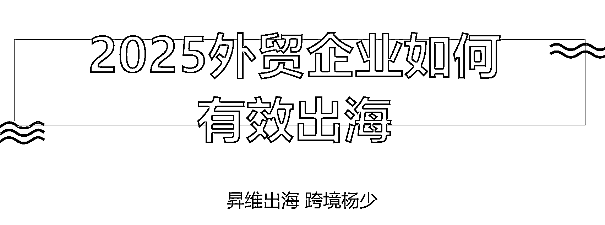

我这两年接触了很多服务商，大多是在做无效出海，包括某巴巴国际站，几万块花下去大部分人没有效果，某巴巴也在做独立站出海服务，他们也来咨询过我一些东西，丢过来一个 PDF 方案，我说这个就是无效出海，建一个站，上传多少个产品，网站安装这个模块，那个模块，完全是一个标准化服务，我认为所有的标准化服务对于外贸企业出海来讲大概率是无效出海。

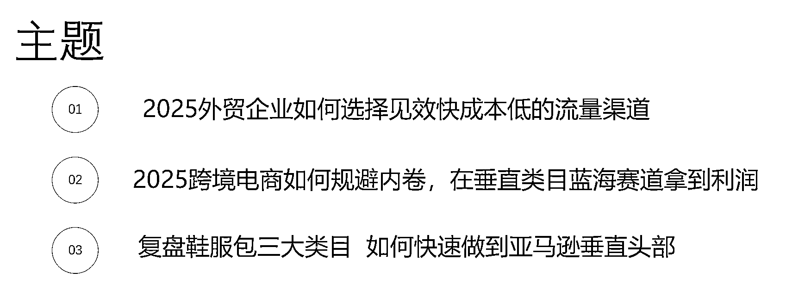

不可能有一个标准化的出海方案适合所有人，在出海第一步之前有个第 0 步被企业/服务商忽略了，就是要**分析你的产品/选品，分析你的人群，分析你的竞品/及其网站网店，看看不能找到差异化切入点，提升产品的客单价，如何规避竞争，如何提升出单的确定性** ，做完这个基本功内功，再结合我今天的分享，你就会知道适合你的第一步，做哪个市场，做什么产品切入，做什么定位，做什么客单级别，你的第一步一定会有一个适合这个产品最优先做的流量，而不是所有人一上来全部都去搞 TikTok 或是亚马逊独立站之类的。

假如流量已经选择了最容易突破的流量，那现在要怎么样把自己的产品变成一个最容易突破的产品？这是我分享的第二个大点，第三个大点就是我举 3 个成功案例，都是我们帮助企业做的。

我们先来讲第一个点，第一个大点就是流量，咱们外贸大中小微个体户怎么样去选择。有人劝你做亚马逊，有人劝你做 TikTok，那么到底该听谁的？答案是听你自己的，自己弄懂，自己做主。看完我这个分享你一定可以做到。

**流量最大/最底层的逻辑就是什么呢？流量很明显的是分为两类的，就是搜索类和展示类，那么搜索类就是电商平台/搜索引擎投放，对应的是什么呢？叫人找品，就是客户在找你这个品，带着明确目的搜索到你了。**

**  **

**还有一种流量也非常大量，就是展示型、推送型广告，比如 TIKTOK、FACEBOOK，这个我们简单的称之为品找人。**

**  **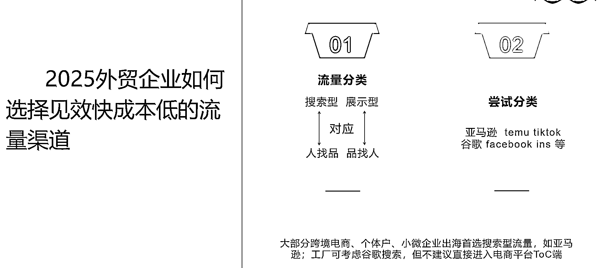

请问人找品和品找人，哪种转化率最高？什么叫转化率？就是最有可能立马下单购买的概率。转化率最高的流量应该是搜索型还是展示型？很明显是搜索型，是人找品，而且更便宜的流量也是这个流量。所以**大部分的跨境电商出海第一步应该先选一下目标市场的电商平台** ，为什么呢？因为电商平台里面的流量他就是来买东西，比如某宝、某猫也一样的，你既然进了电商平台，默认你拿到的流量，它都是有购买欲的，自带转化潜力，他来就是买东西的，好比人都在超市了，他不可能去看电影，不可能去做娱乐活动，来就是购物的，所以转化确定性高。我们做生意的非常核心的逻辑就是确定性。可以看我分享的所有文章，讲来讲去，实际上都是讲确定性。

搜索型的流量，我们补充一个缺点，就是这个量该多少就是多少，你想让它多基本上提不上去。比如说像我们做高客单细分垂直的，一般来说这种搜索流量就会少。流量池子小，天花板比较低，想突破基本上没有，限制住了，这是它的缺点，这个缺点对应的就是它不会变成一个爆款。不会变成一个爆单，但是它的利润是很高的。像我们分享的很多产品，比如说一百块钱进价利润在 300 左右。那么如果说做那种小商品，现在很多人都是赚几块钱，尤其做东南亚的，他们可能出一个单赚一块几块，或者是十几二十。我出一单赚 300，是不是顶他今天出 100 单，人还轻松。

那么像 TikTok 这种就是典型的什么呢？叫做展示型的流量，全是流量，就是不精准，跟你回家上楼坐电梯时候看到的电梯广告，本质上是一种性质，推到你面前，你想不想买？想不想看？由不得你，先推给你再说。所以这个叫品找人，这个优点是什么呢？流量没有天花板，只要你钱够，你推给全世界看都可以。

缺点就是不精准，如果把东西推给全世界看，你得花多少钱，或者说你不想花钱，你想靠自然流让全世界看到，那么这个内容策划得有多么的惊艳？你得创造一个世界顶级营销事件，是不是才能让你自然流推给全世界看。实话比中彩票还要难，那么你就得通过付费。我经常说做 TikTok，实际上真正做的好的都是付费玩家，因为展示性流量是不精准的。怎么样做到精准？就是两个字，“付费”一开，后台给你好多标签，比如说我今天想卖鞋子，后台甚至有一个标签，把最近 7 天点击过鞋子相关视频的人，都可以推送给他们看一下，这一下子精准的非常多，所以真正懂 TikTok 的人都是付费玩家。

我们尝试分类一下，亚马逊是什么型？搜索型。TEMU 是什么型？搜索型。它们都是电商平台，一定是搜索型流量。TikTok 是展示型，谷歌要分情况了，谷歌搜索是搜索型，谷歌的 display，是展示型。那么 Facebook、ins 这些都是展示型，社交媒体都是展示型，现在都特别火，大家现在被这个氛围带到了，TikTok 不得不干，抖音不得不做？那么你已经放弃思考了，出海第一步先去搞 TikTok？实际上未必。

**我相信这几分钟的时间已经让大家明白了一个道理：出海第一步是我来挑流量，不是流量来挑我。**

**  **

不管你是做 ToB 还是 ToC。第一步一定拿的是搜索型流量。我相信讲到现在应该没有人不赞成这个结论。出海第 1 步就是你得选择用什么流量切入？答案就是搜索型流量。

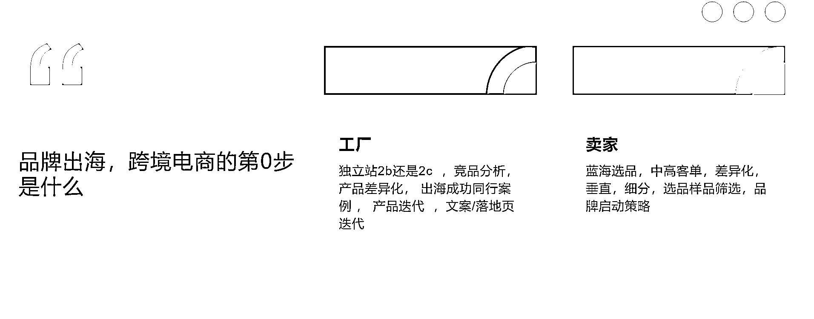

第 0 步是什么呢？当你决定搜索流量先行的时候，你还要先把自己的内功先看一看。第 0 步是做内功，不要着急去卖货，研究选品，竞品，人群，研究差异化，花 2-3 个月都不过分，慢就是快，那些第一天就着急追热点追爆款铺货上架的人，90%在 3 个月后已经亏光失败。

ToB 的工厂我们认为出海第一步最优解就是独立站配合谷歌搜索并逐步考虑 SEO 后期，ToB 工厂不要进电商平台。因为电商平台是 ToC 的，做 ToB 的人跑去 ToC 卖货，这个就是逻辑混乱，我见过有的小商品工厂几分钱几块钱的东西跑去做亚马逊，一天出十单，怎么样呢？无用功，出一百单也是无用功，做工业品行业品的跑去亚马逊上架，出 0 单。

**第一步迈错，无效出海。**

**  **

当然有一些工厂的高客单产品是可以直接去做 ToC 的，就可以去做亚马逊/TEMU 之类的。如果做独立站，就要决定是做 ToB 的还是做 ToC 的，这两种模式网站结构是不一样的，不能套用建站服务商的标准化服务。

我的建议是这类工厂第一步独立站就定位 ToB 的，暂时不要考虑 ToC 了，因为 ToC 的独立站现在非常难做，高客单做 ToC 完全可以先进亚马逊。工厂的第 0 步永远是先做一下产品/竞品的分析，如果你的产品有差异化的空间。可以打一些特色，一定要开始思考这个事情，你的同行一定会有一些已经出海成功的案例一定要先拿过来看一看。如果是负责任的独立站服务商，那找这个服务商一起看，一起分析，产品要开始进行差异化迭代，营销策略的迭代，不管你是做搜索也好，做 SEO 也好，你如果有了差异化的点，你的文案、关键字集合，落地页、详情、图片等等都更好做，更容易被搜索到，发生询盘。这是内功，所以**出海的第 0 步一定是内功。准备好一个大家足够有信心的产品，文章最后我会有 3 个成功案例分享。**

**  **

那么对于个人卖家/纯 ToC 的卖家，我认为你第一步如果就去了东南亚。去了 TikTok，第一步就开始去卷杂货、爆款、新奇特。几美元的、十几美元的、20 美元的带货，那第一步就走偏了，不是说他不出单，而是你这个第一步走进了一个短期被淘汰概率非常大的模式。

假如你这第一步运气好，踩中了一个爆款。也许利润很薄，因为爆款一般都是小商品，虽然利润很薄，但也算赚到了第一桶金。如果你有思路，迅速的开始布局差异化的长期的打法，或者说你有这个时间精力，你继续去卷下一个爆款，假如你可以不停的产生爆款，那么你会是这个淘汰池里面的成功的人。也是可以的，不是我讲的一定正确。不是说非要来做蓝海，非要来做高客单垂直，你就天天去卷爆款，可以发财，但是这条路很累，而且红利期很短，确定性不是很高，说结束可能就会结束，企业可能好的时候，两三百人，说垮可能要解散到只剩几个人。**这就是我经常说的彩票式创业。产品和业务逻辑缺乏长期确定性。**

**  **

那么一些长线的、蓝海的、垂直的、高客单的、差异化的打法会出现一个什么情况？公司四五个人，但是一年的营收很可能是几千万，而且长期稳定就这个盘子，所以这对应的是两种创业的策略。孰优孰劣，个人自己选择。我倒是建议可以这样，年轻人或者说迫切想要创业成功，先证明自己，想挖到第一桶金的想赚快钱的人可以先去做爆款，先去做低价，先去卷，但是失败的概率非常高。这我丑话讲前面，因为你做爆款，如果做的不好的话，考虑到压货等成本风险，很可能会一不小心亏掉个几十万一百万。如果想要确定性高，成本相对可控，又能长期去做，人也不是那么卷、那么累，不会那么焦虑，一定是我刚才讲的这个差异化高客单蓝海打法。今天会详细介绍这个打法。

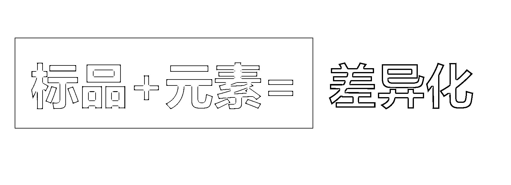

中小微个体户直接做 ToC 的跨境的卖家，因为你不是工厂。你选品理论上是随便选，我建议你一定要选一个差异化的产品去做，而且这个客单一定要在 100 美元左右起跳，可以更贵。但是不建议再低于七八十美金了。你一定要做差异化产品。差异化产品不难，根据我上面这个公式来就不难。

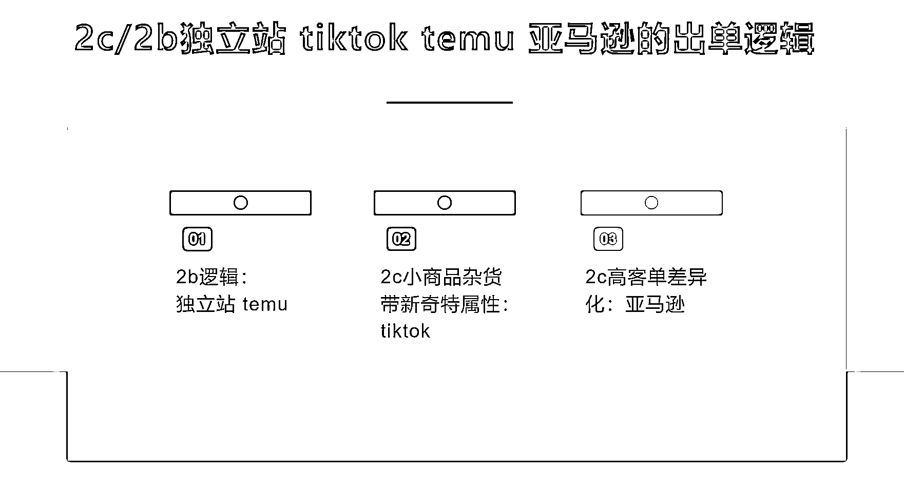

每个出海的渠道，它的出单逻辑是不一样的。独立站由于过去三年多来，被不发货不对版的卖家玩坏了，导致做独立站 ToC 的门槛极度升高，建站运营的细节要求非常多，这个以后我会有专门的分享。那么独立站我现在可以给大家一个结论：你就把它当做 to
B 接受询单，to B 出海的逻辑，独立站的 ToC 逻辑已经很难很复杂，很容易亏钱，我们就先不谈了。

那么 TEMU 实际上我认为它也是个 ToB 逻辑，**TEMU 其实完全是 B2B 的变种** ，因为不管全托管半托管，定价权都在他手上，广告费你也不用付，流量是多是少也是他说了算，怎么运营跟你也无关对不对？本质上就是他不花钱来采购了你的产品。卖得掉就给你点钱，卖不掉亏的也是你，卖掉了之后他想给你多少也是他说了算，你是一点办法都没有。所以 TEMU 这个东西，这个我公众号已经有文章给他专门分析过了，大家可以去看我公众号“昇维出海”。

那么如果像**新奇特小商品这种杂货，自带内容属性的** ，TikTok 是可以的。我觉得这种小商品杂货不要去做亚马逊了，已经很卷了，没利润空间了，TEMU 也没有，这个直接就 TikTok，**TikTok 上是不比价的，看上了就买了，利润空间有保证** 。

亚马逊我认为现在它的出单逻辑是什么呢？就是高客单差异化产品在亚马逊是特别好出单，这些产品你跑到 TikTok 还真不一定好出单。因为泛娱乐人群决策低客单购买没门槛，但是高客单他是要有决策过程的，这个在 TK 做有一定的难度。而**高客单产品在亚马逊被搜索时，往往已经完成决策** 。

TikTok 就是适合这些新奇的小玩意，一二十美金的这些东西在亚马逊是卷得特别厉害。反而到了 TikTok 竞争不那么激烈，如果产品一下播放火爆了，推给了很多人，或者说你付费推给了很多人。他是没有比价的，他看到了想买，当场就买，他不会去搜索还有同类产品的谁更便宜。但是如果是在平台内，它一定会有一个比价的过程，已经是低客单产品，你还要再进平台去参与比价，参与价格战，我认为不明智。

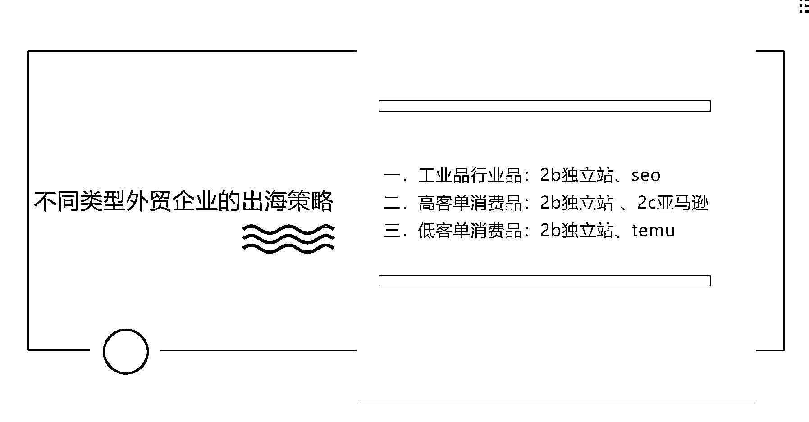

所以不同类型的外贸企业的出海策略，我们可以直接得到一个结论，**工业品、行业品、大企业不用说了，就是 ToB 独立站** ，其他都不用考虑了，国际站 pass。国际站现在要 4 万块才能干，4 万块建独立站，其中有 37000 都能用来烧流量，建个站几千块钱就可以了，三万多的钱烧给谷歌搜索，不会一个询单都没有，但是 4 万块给到国际站是真的还没开始有询单，想要询单还要在国际站充值广告费，国际站自己的流量目前比较萎缩，在有些市场比如中东，市占率很低（据说只有百分之几），据说国际站内的询盘质量也有一部分很低，甚至有人怀疑是平台安排的机器人，这个自己体会。

第二类就是**高客单的消费品工厂** 。首先要把第 0 步做好，第 0 步我们就不重复讲了，刚才已经讲过了，第 0 步做好的前提之下。我认为**首选应该是 ToC 的发达国家市场亚马逊先去卖** ，**在人力资源够的情况之下，同时也可以做 ToB 的独立站去卖。甚至 ToC 的独立站也可以** 。因为你客单足够高的话，ToC 的独立站难度会下降非常多。因为高客单产品比较吃得消高成本的营销，你的毛利空间消耗得起。所以第二类工厂实际上它的选择权是比较多的。

**第三类低客单小商品的工厂，我认为就是你就老老实实做 ToB** ，不要做 ToC 了，非要做 ToC，你做个 TikTok 没事玩玩。就当玩做一做可以。你首选搞个 ToB 独立站向全世界做批发，然后你也可以跟 Temu 联系入驻。因为**TEMU 全托管本质是 BtoB，不需要你懂运营，不需要你跨境电商很专业，工厂恰恰在这方面很薄弱** ，但是控制好这个回款的风险，不要最后白忙，因为我现在接触下来很多做 Temu 的，卖了非常多的量，结款的时候总是要少结导致亏本，只要有退货等各种问题，Temu 会罚款。至于要罚多少，罚款的规则是什么，都是他来定。Temu 不失为小客单，低客单消费品出海第一站，**但是要把看账单的会计和看合同的律师准备好。**

**  **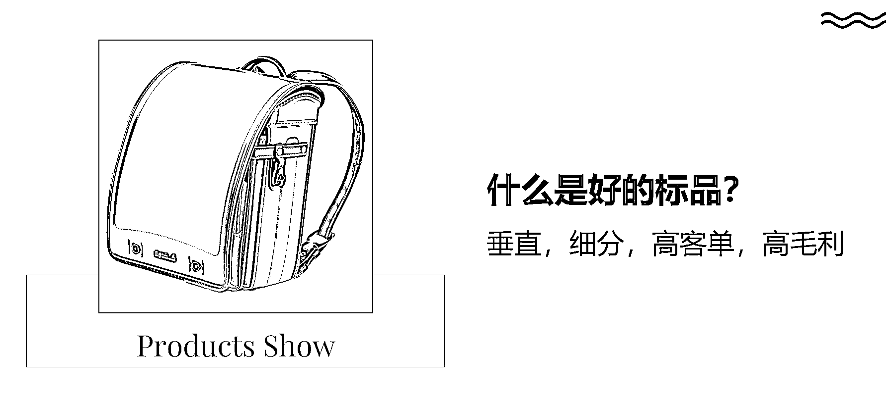

下面我们来讲具体的案例了。还记得那个差异化公式吗？

**标品+元素=差异化**

**  **

**什么是好标品？其实很简单，就是要贵** 。上面这个书包现在在日本卖 1,000 多人民币。有学员他听了我的课，学了好长时间了，来让我帮他分析选品，拿出来还是一个很便宜的东西，因为热卖。每次我都很无奈，这个真的是你要扭转自己的惯性，你又不是工厂没得选只能卖一种产品，你干嘛非要守在这个便宜货上面？就舍不得解放自己吗？

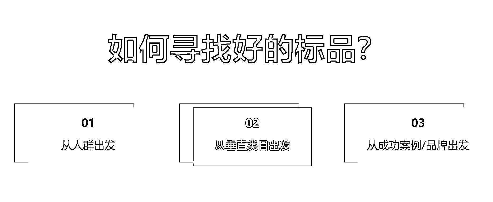

如何找到贵的标品？分三个方向。

找到贵的标品是你的出海成功的第一步，你不要着急去亚马逊上架，不要着急追热点跟卖铺货，这些都是被玩烂掉的方法，目前 90%的都是教你这个玩法，教你一点大数据分析的方法，本质还是追热点跟卖铺货，这种产品红利期都很短，可能 1-3 个月就被大家价格战给他干没了，红利期干没了，你会发现，你作为一个创业者，很可能过来也就是凑了个热闹，三个月之后就身心俱疲被淘汰。

那么我们负责任的讲法就是高客单差异化选品去做亚马逊，不要着急，你至少花一个月的时间好好的去构思自己的产品，这个产品上架之后，你一旦靠这个产品赚钱了，它的门槛很高，其他人没法儿跟你竞争，或者说他们根本看不到这个点，**他不来跟你竞争，他不是不想，他根本就不来** ，他就喜欢去卷那个低端的东西。

我选品的时候，经常看到某个细分类目，很看好，但这个类目里面总有几个老鼠屎。就是卖那个二三十美金的，人家都卖 100 美金，总有几个老鼠屎卖二三十美金的。不用想，一定是中国卖家。这种客单的产品往往是中高端的产品，在发达国家客户根本不会去选择二三十美金的这个，选择的也会差评率很高，因为垃圾货的质量达不到这个中高端细分类目的平均预期。

如何去找到这样的细分类目？**第一个就从人群出发** ，你是人，你一定了解人，一定会出现细分人群，你先从你作为一个人类了解的范畴出发，看看你能看到哪些细分人群，看看他们买的哪些东西是比较贵的东西。便宜的你就 pass 掉。

第二个我们打开**电商平台，里面一定有非常多的垂直类目分类** ，电商平台都给你分好了。你一个个看就是了，挑里面贵的、便宜的一概 pass。

第三个就是不断会有一些**成功的品牌、成功的独立站、成功的垂类、成功的单品** 。单品是可以去看到一个好标品类目的。我们经常说热卖排行里面的，你第一反应不是去跟卖，你第一反应是要**拆分它是基于一个什么样的贵标品，叠加了一个什么热门元素** ，导致他自己爆单了，差异化的公式大家还记得吗？标品加元素等于差异化，你要看到它的标品载体，这个也是找标品的好方法。

从三个方向出发去找贵的标品。真的很多，再给它加一个元素。这个元素要有好处，元素最好是自带流量，元素挺火，或者说现在是某一个热卖排行里面的产品，真正火的原因是这个元素火。你完全可以把这个元素给它割下来，嫁接到你的新找到的高客单的标品上面，形成一个强联合。形成一个确定性的叠加。因为**标品是有确定性的，而热卖的元素也是有确定性的。确定性加确定性，就算是一个新产品** ，就算没人卖，你去测品的成功率也大于 50%，而且利润基本上翻 3 倍起，没有竞争，红利期超长，这种产品是非常好做的，这才是有睡后收入的产品。

你如果以这种做产品的思路做跨境电商。你慢慢就会**成为一个成功的跨境电商企业家，而不是一个跨境电商玩票的炮灰** 。如果说你第一步走的是追热点跟卖铺货，什么东南亚 TikTok、带货、小杂货。什么新奇特。三个月内你成为炮灰的概率 90%，你实际上是一个玩彩票的性质，你不是个企业家的性质，你如果真的要创业成功，你是要变成个企业家的，你如果第一步走了彩票模式，你连个体户都不是，你是个凑热闹的，明白吗？

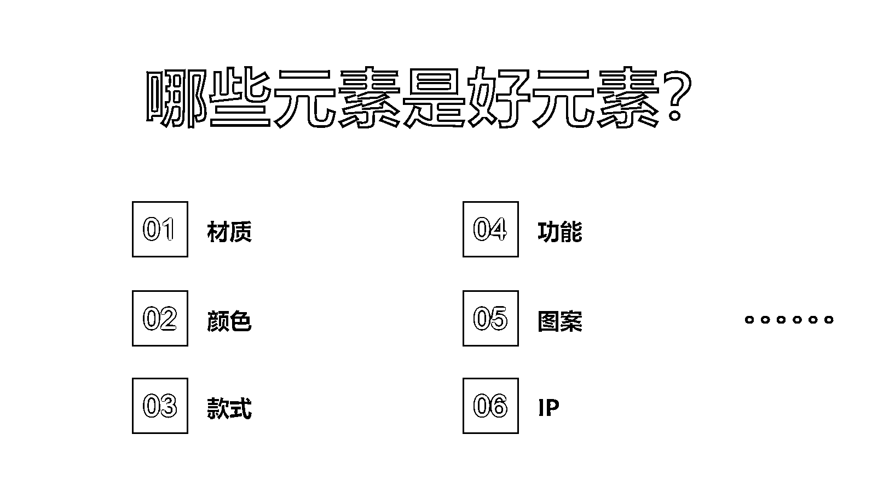

常见的元素，就是我这个 PPT 上面讲的这些元素。材质是一种元素，我们讲因为很多标品**材质一换就贵了** ，对吧？我们经常说你做日本市场第一个材质差异化，真皮、真丝、皮毛一体防水、高科技户外材料。这是不是一个差异化？

第二个我们讲颜色。做 3C 的，都已经很卷，我一般不建议人家做 3C 的类目的，但有的老板经常一个产品卖爆了一段时间，**换个颜色又爆一段时间** ，为啥？说明颜色也是个差异化的点。所以基于成功的标品，你给他不停的换元素，他就可以不停的爆。玩的最好的是卖手机的，苹果永远长这个样子，每年配一个新的颜色，然后就有人买单了。

第三个就是像一些**款式的微创新和嫁接** ，这个我们后面有案例。

第四个功能这个元素它不适合新手，它往往是需要去做市场调研，有设计、研发、开模等等能力的。这个叫**痛点迭代** ，适合一些中大型卖家，有实力的、有供应链优势的一些卖家。

第五个图案这个就是所有人都合适，我们经常说很多爆款，它爆的其实是实际上是它上面带的那个图案。你把它那个**图案抠下来嫁接到别的产品** 上面，别的产品大概率可能也要爆，有的跨境电商团队就专门就是这个玩法，一个团队甚至几十个人上百号人，每天研究有什么图案比较火。然后开始嫁接到没有嫁接过的产品上面，就这样玩，一年玩下来。销售额和利润也非常可观。

所以你看这些东西其实有任何一个点，你给它做到极致都有可能成功。这个叫有确定性逻辑，而不是彩票逻辑。追热点跟卖铺货都是彩票逻辑。你成功了我一点都不羡慕，因为我知道这是个彩票逻辑，你不可能永远都中彩票。

第六，比如说 IP，你要有这个**IP 权利，就是个好元素** ，比如说这个做的最好的就是迪士尼，迪士尼把自己的 IP 放到了各种各样不值钱的标品上面。让它变得值钱。

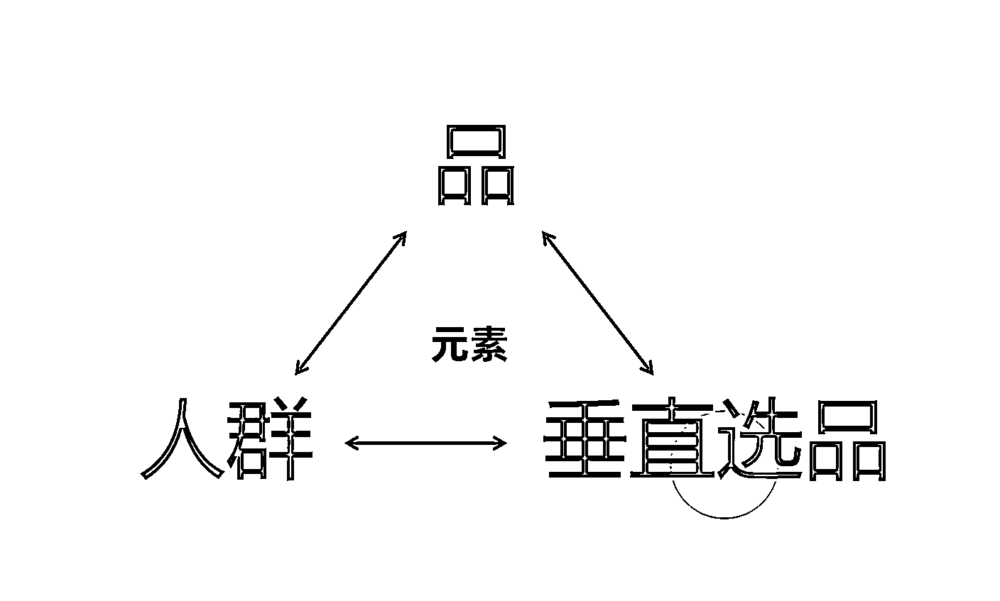

我们看现在有个三角形模型，这个稍微有点复杂了，这个讲起来就会对理解会有点要求。我们从单个的产品是一定可以看到一个人群的。那么我们到了这个人群里面，他一定不仅仅只要这一个单个的产品，他肯定是要一系列产品。比如说我通过一个鞋子接触到了钓鱼佬，钓鱼佬要的可不仅仅是鞋子，对不对？钓鱼佬要的贵的东西可多了，那我就可以接触到一个细分人群，一个垂直类目。

在这个细分人群、垂直类目里面我有可能发现新的产品，比如说发现了衣服，那么我发现这个衣服它不仅仅可以钓鱼。它登山也可以，是吧？我就从这个衣服出发，我又发现又可以做一个登山的人群，那么到了登山的人群发现他就不是要钓鱼竿了。他可能要登山杖。他又出现一个新的垂直的，这个就是**选品的三角形迭代** 。

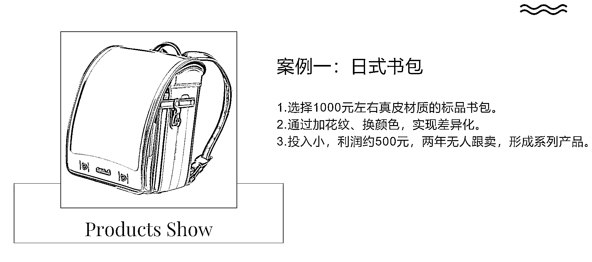

那么我们看这个产品，它是我帮工厂做的，前年的一个产品，应该是信息差也过去比较久了，我给它稍微的公开一下。

首先它这个标品是 1,000 块钱的，选的很好，真皮的材质，那么他现在唯一的问题是挑中了一个非常好的标品，他如何快速的成为这个垂直类目的头部玩家？那不可能跟大家都卖一样的去价格战，对不对？

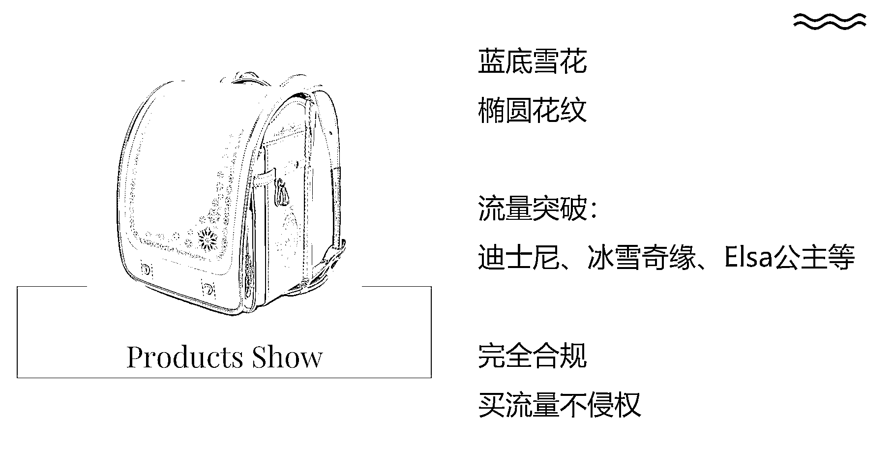

我给了他一个差异化的点子，在上面加花纹，换颜色。那么他按照我这个点子来，大概两个月时间很快就落实出来了，找了设计师并且开模做出来了。这个不存在从头开模实际上就是加个花纹，我一向建议不要多花钱，乱花钱，不要乱开模，尽量去做现成的货。不要去创造货，他这个不是创造，他是微创新。

这种小幅度的勉强也算开模的费用，加上第一批货的生产，总体投入就是万把块钱的级别。投入非常小，这个产品现在的利润可以做到 500 左右。而且它两年了，至今在亚马逊没有人跟卖。两年没有人模仿，这个产品变成了一个小小的印钞机，仅一个 SKU 一年几十个 W。并且之后他也用同样的思路做了好几个新的不侵权的主题花纹和配色，我都会帮他先分析确认，基本也都成功了。

按照这种打法真正坚持下来，并且有执行力的人，他一定拿到非常大的结果。而且这个结果红利期特别长，我现在给他公开，估计都没有人去给他卖一样的，因为这货市场上根本没有，要自己去做。这就是个门槛。

它成功的秘密是，蓝底花纹、椭圆花纹，这个元素自带流量，它蹭的是迪士尼的流量，冰雪奇缘艾莎公主。完全合规，因为没有出现任何的品牌 LOGO，没有出现任何的侵权的元素，颜色不侵权，雪花不侵权吧？

这个东西做出来之后，是不是可以投竞品品牌的流量，在投放上，这是完全合规的，亚马逊只要搜索迪士尼书包，这个产品给我打到第一个位置，是不是出单的概率非常高？运营两年来没有任何问题。

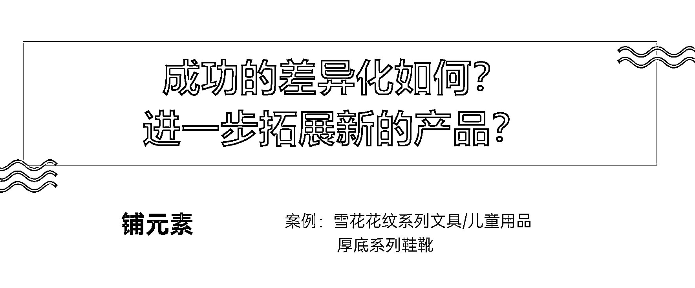

那么成功的差异化找到之后，如何进一步拓展新的产品？你不能光靠一个吃吧？虽然这一个 SKU 他已经一年可以转几十万个。

那么就是继续铺这个元素到别的标品上面去，别的贵的标品上面去。不一定做包了，可以做别的，当你得到了一个非常好的这个 idea 的时候。这个 idea 可以铺到所有贵的、好的、合适的类目上面去。

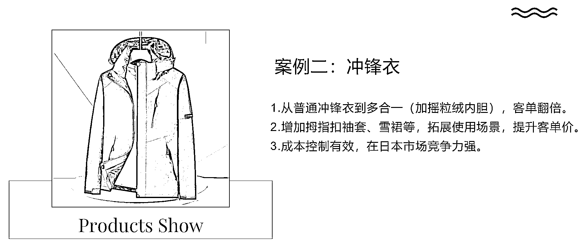

第二个，服装的例子，冲锋衣出海，冲锋衣可以代表咱们这个服装出海里面的一大类。我们经常说服装是最卷的一个类目，那么我们第一步垂直，我们做户外是不是开始垂了，户外里面有好多种运动的，可以继续垂。

冲锋衣这个单品是个标品，实际上它不算贵，但也不便宜。冲锋衣基本上来说现在在亚马逊稍微有点质感的是可以做到 30 -
50 美金这个区间的。在 20 美金去卷的冲锋衣也大量的有，甚至更便宜的，用烂货的去卷的，比如 TEMU 一定有 9.9 美金的。

**如果这个冲锋衣的工厂他想出海，也去跟大家一起卷吗？是不是因为我是工厂，所以我可以成本更低，所以我一定能卷得赢？那么这个思路就错了，这个就是第一步迈错的，那么我们讲第 0 步就是先做内功，你冲锋衣有什么内功可以做？做完了这个内功以后再去出海，你再去做冲锋衣的这个垂类，那很可能一做就做成了。**

**  **

我给冲锋衣工厂提的差异化的点：第一个点，不要单纯的只卖一件冲锋衣。卖多合一，里面加个摇粒绒，加个内胆，让它变成个三合一，这个内胆的成本是多少？20 块，这个冲锋衣的成本是 100 块，因为这是比较好的冲锋衣，它有防水值、有透气值，并且它的款式是抄的鸟的有立体剪裁等等（也算增加一个确定性和差异化点，但同质的还是太多），冲锋衣现在基本上好的都已经达到这个水准，就是大家已经都卷到这个程度了。那我们进一步去卷新的差异化的点是什么呢？多合一。

摇粒绒单穿是可以的，冲锋衣单穿是可以的，两个加在一起穿是可以的。所以这个叫三合一冲锋衣，加了 20 块钱成本，原来卷的是 30 美金的区间的冲锋衣，你加了 20 块钱人民币的成本，你现在就可以去卷 70 美金的区间。翻了一倍，客单翻了一倍。

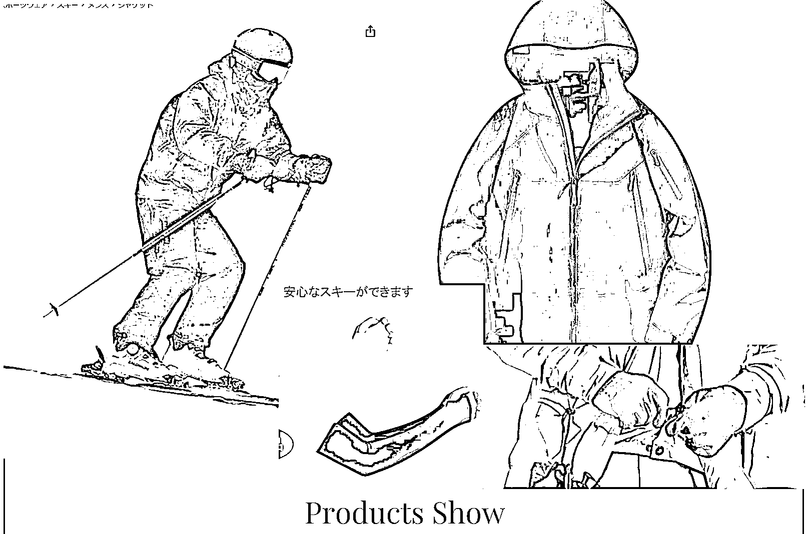

到了这个客单了，实际上在冲锋衣里面，已经开始接近赢了。下一步我们又做了一个更加细分的差异化，我们把这个冲锋衣做了滑雪服改造，做了优化改造，加了多少成本？首先加这个拇指扣，看中间这个地方它是个拇指扣。

如果我要让这个工厂在袖口加拇指扣，肯定要给它模具加一个小小的点，会有成本，对不对？那么我们为了让这个事情变得更快，我们选择采购袖套，我们卖这个产品的时候送拇指扣袖套。解决的是什么呢？让这个多合一的这个冲锋衣，再增加一个新的应用场景：滑雪。

防风、防雪、袖口防灌入、防灌风、灌雪解决这个问题。这个问题完全可以不用重新开模生产，重新设计，我们在 1688 采购这个袖套，两块钱一个。花两块钱让它多了一个使用场景，并且到了这个场景里面它的客单就可以到九十美金。我们花第一个 20 块钱人民币让他的客单翻了一倍，再花两块钱成本人民币让他的客单又提升了 20 美金。而正常的雪服出厂成本约是它的 2.5-3 倍，**我们用三分之一的成本，90 美金的价格去卷 130 美金的细分类目，赢的概率是不是很高？**

**  **

好，那么再往下做什么呢？就是这个下面蓝颜色的部分，让他的多合一冲锋衣增加一个雪裙，防止腰部的风雪灌入，这个成本也是几块钱。这个东西就没办法给他买个现成的，就是他必须工厂生产的时候给他多缝两块布上去加两个扣子。这个会有一些额外成本，你可以不做，也可以做，你做的话你这个产品就客单可以再加 10

*   20 美金。

**那么这个产品靠雪服这个细分类目快速出单，积累的权重，又可以在雪季结束后去卷三合一冲锋衣这个类目。**

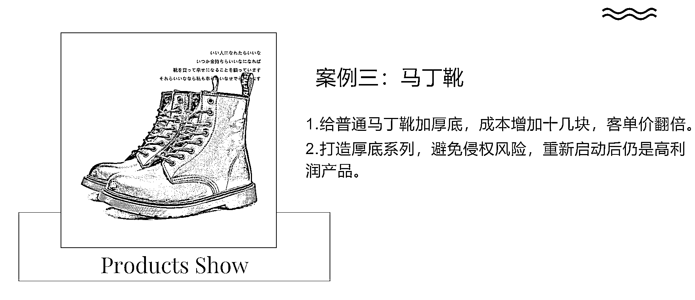

鞋服包现在还剩下来最后一个案例：鞋，马丁靴，这个价格现在亚马逊卷到多少？大概卷到三四千日元，非常卷，你给它加个厚底，大概成本是从 75、85 变成大概 100 左右。你加了十几块钱的成本，它客单价可以翻一倍，变成 8 千日元。

正常基本款马丁靴，我们不做，pass 掉，，一千、两千日元的、3 千、4 千的我都不做，我要做的都是至少 7,000，8,000 起的，最好是 1 万左右，或者 1 万日元/100 美金起，甚至更贵。我建议工厂可以衍生出一个厚底系列，客户一想到买厚底的鞋子就来找你，厚底的雪地靴是不是可以做，厚底的工装靴是不可以做，厚底的大黄靴是不是可以做，还有厚底的好多种鞋子，登山鞋、跑步鞋、SNEAKER。**工厂就变成一个厚底垂直品牌的品牌出海故事。**

**  **

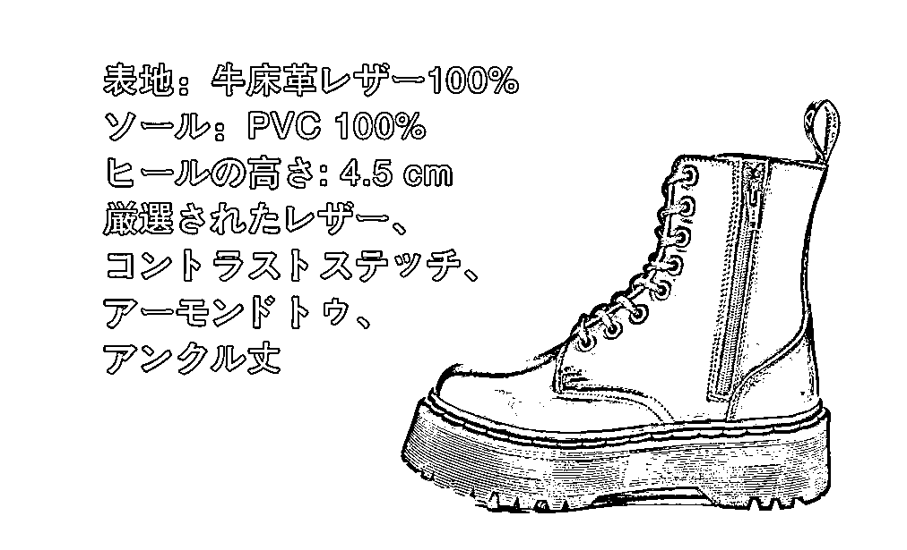

上面这些方法，运用的就是我创立的《选品四层方法论》的思维模型，四层一共 7 个点？7 个点全部理解了之后你会发现你一定是个比较专业的会选品的，会做差异化的人。你的选品的方法和逻辑达到这种水平之后，我认为你再去做跨境电商就无往而不利。

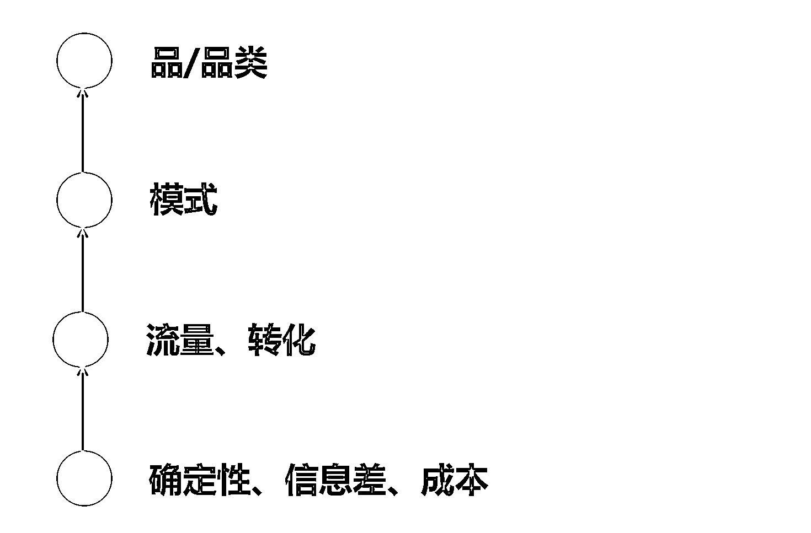

这个就是我经常讲：跨境电商，不管是工厂还是中小微个体户，出海的第 0 步，就是先思考、先调研、先学习，而且要找到真正有价值的，对的、有逻辑的、闭环的、有利润的。是你认识到按这个逻辑做事一定会有赢的确定性，是你自己告诉自己这个逻辑是对的，而不是别人说哪个平台好哪个平台非做不可，你就跟着去做了。

谢谢大家。

* * *

评论区：

Rrrrrrr : 哇这长文真的太有用了，很受教。我还属于想做跨境电商的准备阶段，在看各式各样的跨境心得文，感受到了作者的真诚分享和昂贵经验，太厉害了[强][强][强]

跨境杨少 : 我喜欢唱反调哈哈，给生财也唱过，我说生财的项目大多强于流量，而弱于产品；强于短线生意，而弱于长线生意，流量是一个人的第一桶金，而差异化产品是一个人的人生复利。没有对错好坏之分，只有个人选择。任何有复利的东西，包括学习，运动，都符合二八法则，甚至一九。

哲学工作室 : 优秀

亦仁 : 写的很好，底层认知，多写。