# 减肥赛道抖音线索获客实操案例

> 原文：[`www.yuque.com/for_lazy/zhoubao/aku4lkmi6eyieux3`](https://www.yuque.com/for_lazy/zhoubao/aku4lkmi6eyieux3)

## (36 赞)减肥赛道抖音线索获客实操案例

作者： 波波@抖查查@爱盈利

日期：2025-03-18

**我们先来看推荐流量的做号案例：**

最近发现一个减肥账号（来自生财风向标：@龙客 zero），3.10 号开始发视频，爆了一条视频，一下子就开始爆粉了。单日涨粉超过 3000+，而这种内容，我们可以定义为是升级版的图文配鸡汤旁白内容。这种账号的粉丝价值不低，做起来后，直接带货或者引导私域都是非常适合变现的^_

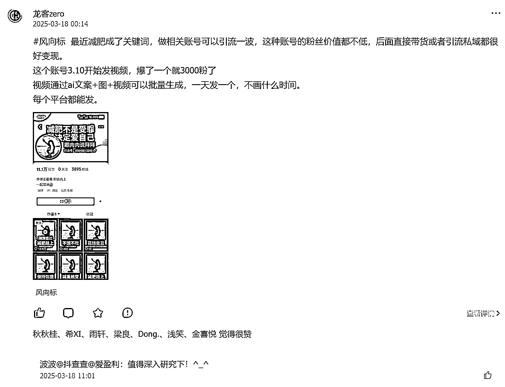

视频通过 ai 文案+插图+动效+旁白朗诵+抒情音乐，可以实现高效生产内容的 SOP。目前该账号一天发一条，内容比较符合抖音推荐流量逻辑。

同时通过爆款内容的评论区可以看到，人群画像是十分精准的。有不少马甲账号在评论区进行私域引流动作。同时该视频出现了评论区置顶词：“120 斤瘦到 100 斤脸部变化”这个非常精准的人群词，同时反映出减肥人群的核心需求—>变美！

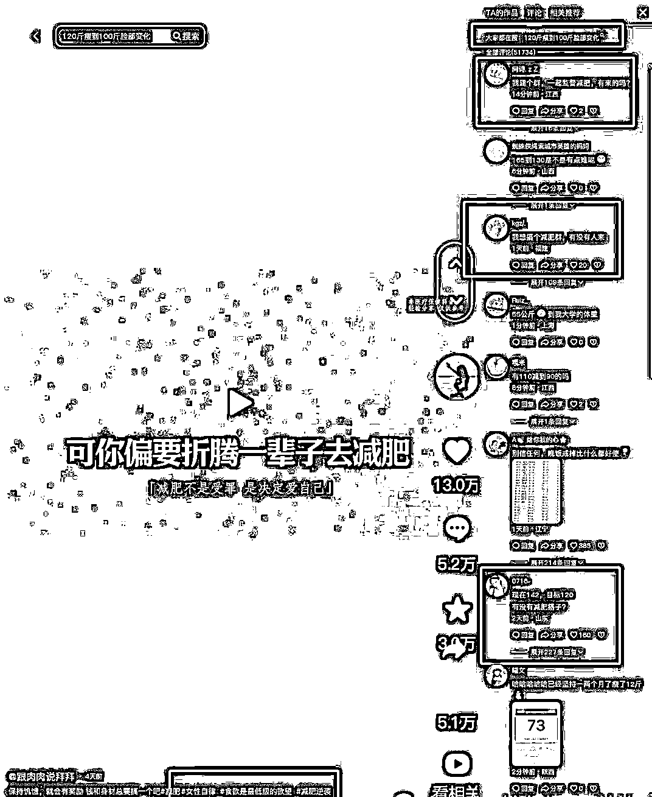

我们通过 DSO114 搜索人次数据可以看到，这个词在该视频的影响下，搜索量从平均不到 1000/日的水平，直接上升到 3000/日的水平。^_

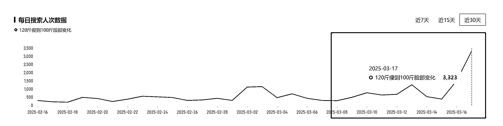

**  **

**我们再来看搜索流量的承接案例：**

**  **

通过 DSO114 我们可以看到，吃到这个**“120 斤瘦到 100 斤脸部变化"**
这个词流量的视频（搜索结果排名第一）是一条 24 年 8 月 23 号发布的视频。该视频账号粉丝 1.4 万，不算很高，但是这条视频点赞也高得吓人有 5.8 万赞，将近 2 万的转发量。内容是一个大学生自拍 vlog 的混剪视频（主打的内容逻辑就是真人感）。核心能够长期排在搜索结果第一，还是因为标题完美匹配搜索词 120->100 这两个核心数字。

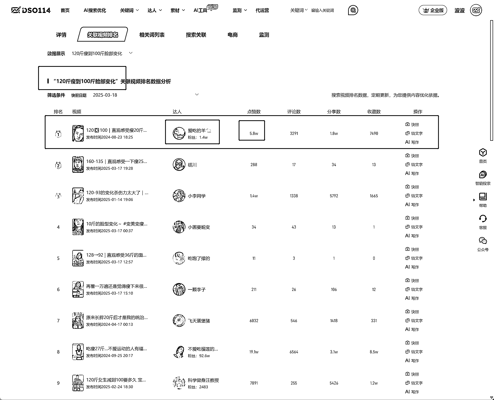

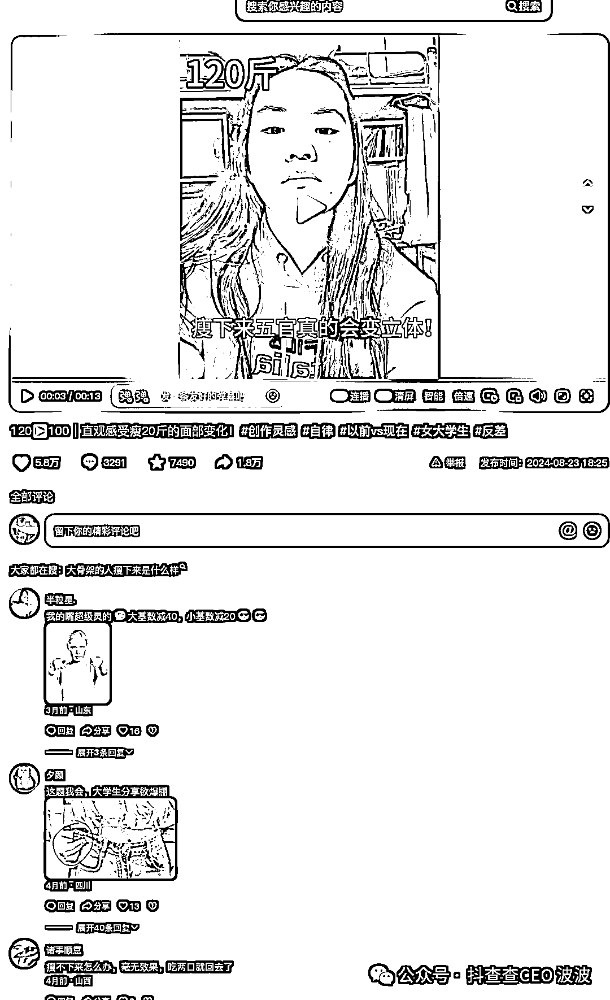

**  **

**给出一个波波自己家的实操做号案例：**

**  **

这个视频已经快一年的时间，卡主一个同样优秀的人群词“夜跑和晨跑哪个效果好”这个词，每个月稳定给该账号带来 100-200 万搜索播放。同时通过评论区的一些高赞评论，我们可以看出，视频的人群足够精准，且因为是搜索流量卡位，导致视频的长期收益稳定。

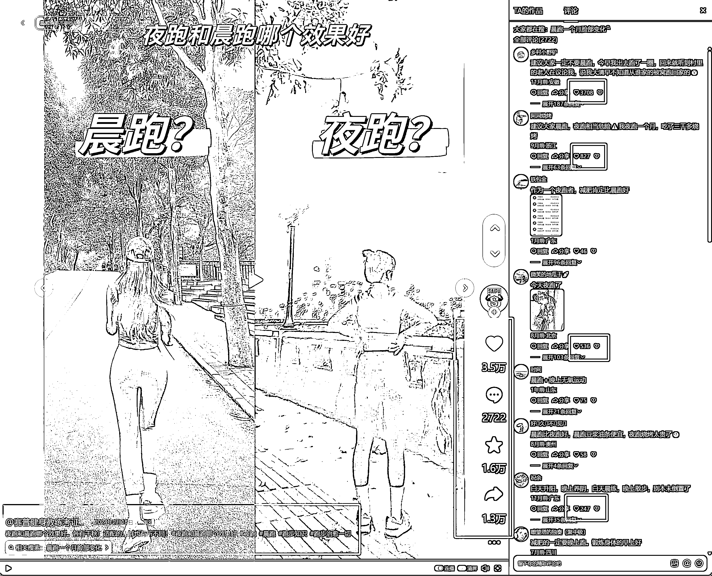

在大量选词与内容稳定输出上面，我们利用了工具提效：任务执行与管理（支持团队多人分工）同时利用工具的 Ai 能力帮我们快速生成内容的文案。

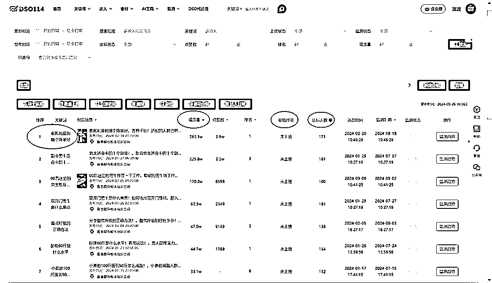

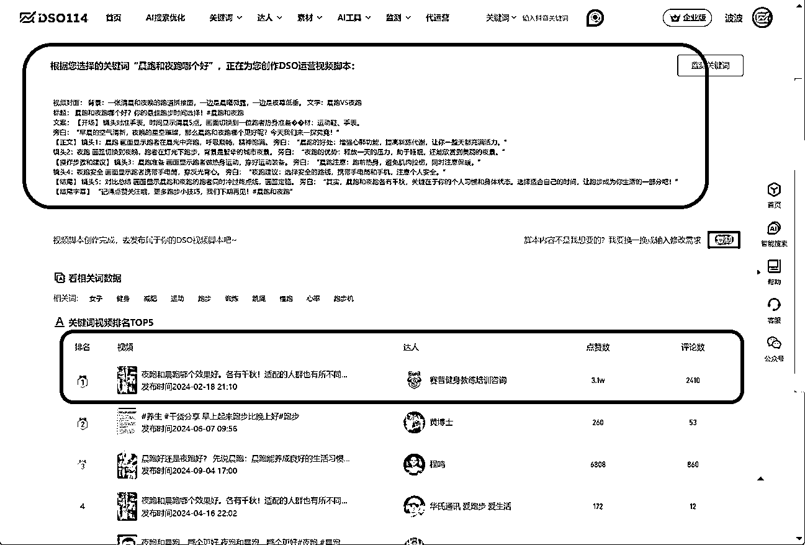

推荐流量和搜索流量各有各自的优势，推荐更像短跑拼的是爆发力，搜索流量更像长跑，拼的是耐力。他们的流量分配算法和内容形式都是完全不同的。

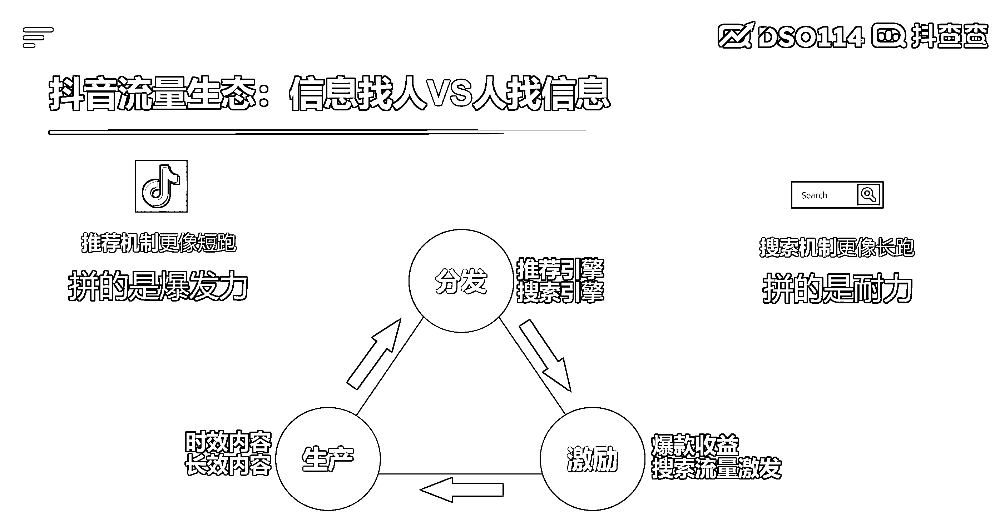

而且两种流量也可以配合运用，通过推荐流量可以激活看后搜，引导更加精准的搜索流量。通过搜索流量可以快速给账号和内容打上精准人群标签，有利于进一步的精准人群推送。

**推荐流量— >看后搜扩大搜索人群—>搜索截留**

**  **

**搜索流量 DSO 抓人群— >推流机制放大人群—>流量池形成**

**  **

推荐流量的内容想必大家都了解的比较多比较清晰了，搜索流量的核心主要是做好以下三个部分：选词、内容、转化。

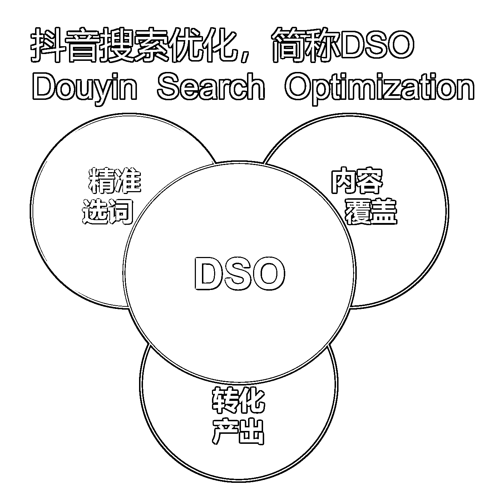

搜索流量效果持久，人群精准，值得所有行业深入研究^_

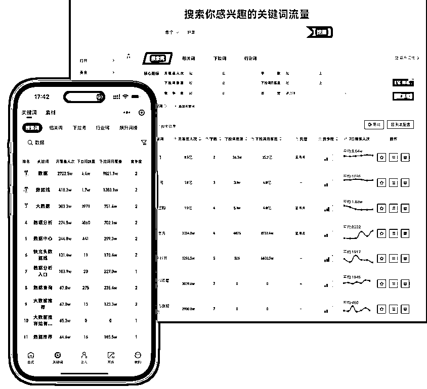

### **数据来源:DSO114.COM**

做好抖音搜索优化同时离不开优化选词工具，**DSO114** 专注于抖音 SEO 领域，利用大数据和智能算法，提供关键词优化、竞品分析、流量趋势追踪等多维度服务，帮助品牌和商品在抖音搜索中获得更高的曝光和排名，实现品效合一的营销目标。

更多抖音搜索流量玩法欢迎交流^_

历史 DSO 文章：

[轻度游戏 App，抖音搜索引流实战案例](https://articles.zsxq.com/id_5355amrotlvr.html)

[财税线索获客：抖音搜索（DSO）案例拆解](https://articles.zsxq.com/id_xupwwrrpd0wz.html)

[律师、法律行业做抖音号：搜索实战案例](https://articles.zsxq.com/id_xhuiu54b43lt.html)

[留学行业在抖音一天免费搞几百条精准线索！](https://articles.zsxq.com/id_hwrs6kaqghs3.html)

* * *

评论区：

暂无评论