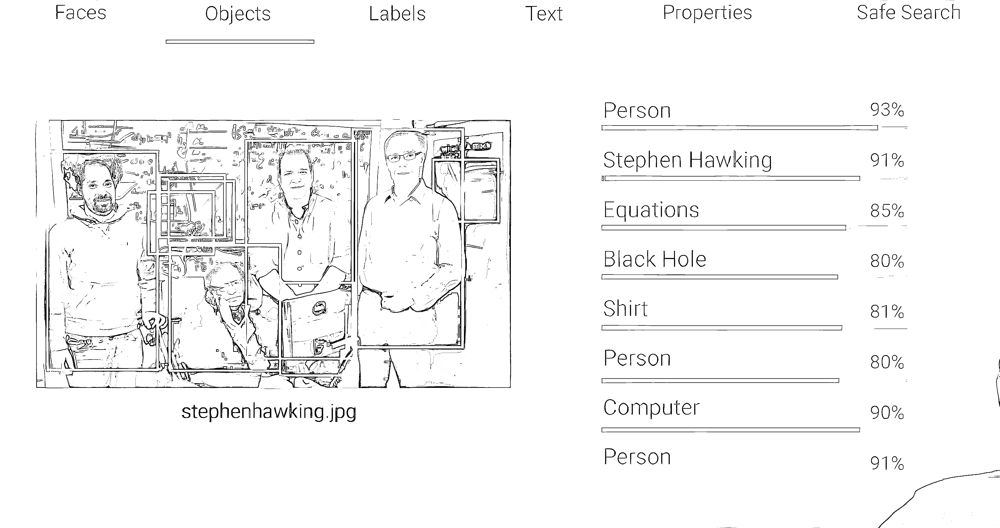
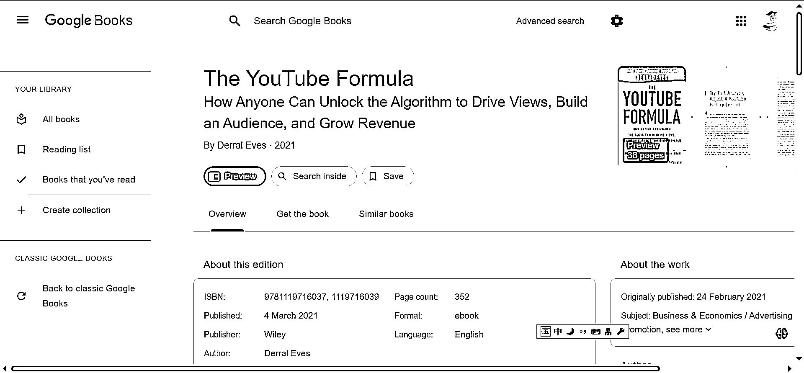
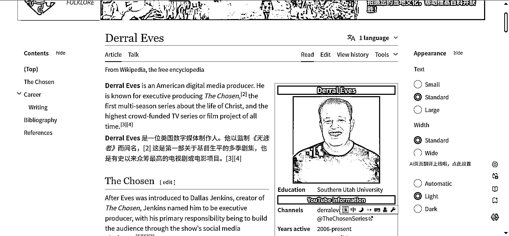
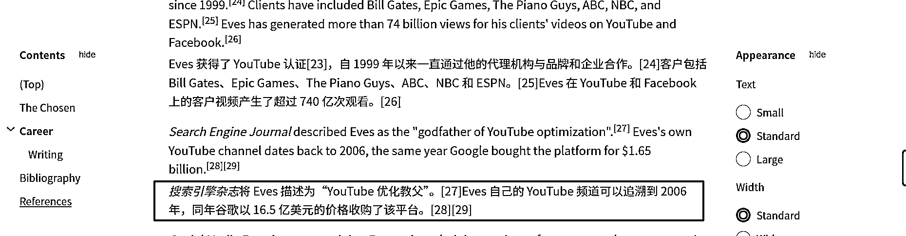
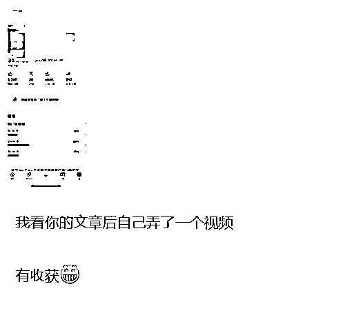
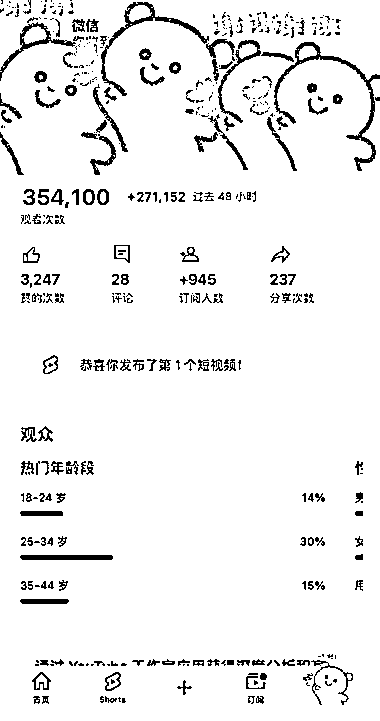
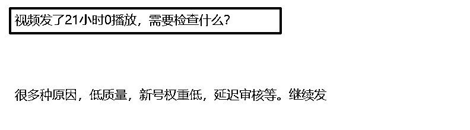
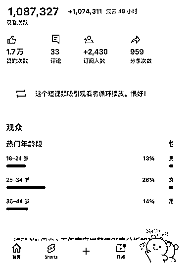
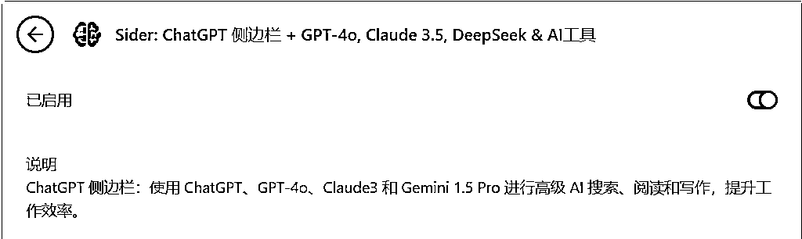

# 油管赚钱：很多人正在学习错误的知识，为什么在 YouTube 上养号不是一个必选项？

> 原文：[`www.yuque.com/for_lazy/zhoubao/sr2m61496oa0cm3m`](https://www.yuque.com/for_lazy/zhoubao/sr2m61496oa0cm3m)

## (10 赞)油管赚钱：很多人正在学习错误的知识，为什么在 YouTube 上养号不是一个必选项？

作者： 书情小跟班

日期：2025-03-21

更好的阅读体验见飞书文档：油管赚钱：很多人正在学习错误的知识，为什么在 YouTube 上养号不是一个必选项？

[`rlwxa0zgke.feishu.cn/docx/LGqId4GuEomWxFxB1EZcIEycnfe`](https://rlwxa0zgke.feishu.cn/docx/LGqId4GuEomWxFxB1EZcIEycnfe)

在很多的关于 YouTube 的教程都会提到养号，在国内平台培训课都会有养号两个字，这似乎是一个不成文的规定，比如说新号注册多少天内，是几乎做不起来的，要“养号”，时间到了才能做，不然发什么作品也起不来。

其实这个也是未经证实的”传说“，忽悠小白没问题，对于我来说，我是不认可这个养号的说法的。

YouTube 没有养号一说，可以说不用养号也可以，注册好账号直接发也 OK。

为什么说不用养号也可以？YouTube 是 2005 年 2 月 14 日创办的，到现在已经有 20 年了，这么多年来的技术沉淀，它的算法是很强大的。

比如下面的一张图，google 的算法不弱的，就靠一张图就识别 Person、Stephen Hawking、Equations、Black
Hole、Shirt、Person、Computer、Person

油管公式的作者

**搜索引擎杂志将 Eves 描述为“YouTube 优化教父** ,他写的书，在我看来对于做 YouTube 的人是必看的，在国内做出一点成绩，然后就把国内的经验照抄在 YouTube，我认为这是一个偷懒的行为，这是犯了类似于刻舟求剑的错误。

我希望在后续我能看到的关于 YouTube 的教程中少看到养号相关的描述,
goolge（YouTube 是 google 旗下的产品）的算法已经足够强大，不是你所谓你养号就有播放的。

[Derral
Eves](https://www.google.com.sg/search?sca_esv=97980d781a0b4fbe&hl=en&sxsrf=AHTn8zp79DtAWmxyeAZyc1JAFcpFmz2RLQ:1742534098251&q=inauthor:) 在书上有过这样的表述——**不是油管有问题而是我的视频/内容还不够好** 我确实需要把字体进行一个加粗。

【腾讯文档】 油管公式

[`docs.qq.com/doc/DRkRJUFVRZ1JSTGtZ`](https://docs.qq.com/doc/DRkRJUFVRZ1JSTGtZ)

一般来说， 最少准备两个频道，一个频道是刷刷日常，想看啥就看啥，也包括找对标账号，另一个频道就做垂直。

在日常的账号来找对标账号，找到对标账号后，在垂直账号关注在日常账号找到的对标账号。

为什么这么做？你的垂直账号只关注对标账号，那么垂直账号的**首页** 就只有对标账号（当然也会有其他内容，但是你对标账号的内容会更多），这样方便你抄作业。

分两个频道才是较为专业的操作，总之记住一点，你想过 YPP 的频道，也就是垂直的频道只关注对标。你日常的账号就是用来看找对标的。

注册好后，如果内容受观众欢迎，自然会有很多人来看，核心关键点在于你的视频的质量。

我们可以试想一下，就算你养了号，你视频做得垃圾，你做一个垃圾就因为你养了号就有人看？答案肯定不是的。

比如说，你养了号还是 0 播。但是别人不养号直接发播放量还是不错，那么这个养号是否有必要，这是值得质疑的。

YouTube 算法是对视频做赛马机制，符合 YouTube 推送算法，自然会有更多的人来观看你的视频，反之，你做了一个垃圾视频，这里所谓的垃圾视频是针对观众反馈而言。

总之，你做优质视频 YouTube 自然会帮你推，反之，你就算是养号，你做的是垃圾视频 YouTube 也不会推你的视频的。

你的视频在 48 小时内会给你大力推，如果你看到类似下面的页面，文字提示——【**这个短视频吸引观看者循环播放。很好!** 】你心里就有底了。播放量是有保障的。

以上也是我一家之言

我的观点是：只要你做的视频内容是优质的，无所谓养号，反之，你就算是养号，你做垃圾视频，YouTube 也不会帮你推。

后面是一些信息的补充，下次有时间，把 YouTube 的算法详细版再发一发

YouTube 的目标

1、预测观众想看什么

2、最大限度地提高观众的长期参与度和满意度

人工智能使用多个系统/算法

1、浏览功能:首页(个性化推荐(新的和旧的))和订阅

2、推荐视频:“接下来播放”，同类或相关

3、趋势视频:区域/社群当下关心的热点

4、通知:打开小铃铛

5、搜索:依赖元数据，观众反馈和新鲜度

这些算法，有时间再详细讲，举例说明会更好

**油管如何收集用户数据？**

油管（YouTube）通过多种方式收集用户数据，以便更好地推荐视频并提升用户体验。以下是一些主要的收集方法：

1.  用户行为监测:

2.  每天，油管会收集大量的用户行为数据，包括观看时长、喜欢或不喜欢的视频、用户是否跳过视频以及观看的具体内容等。报告指出，油管每天从用户行为中收集约 800 亿个数据点。（这是之公布的一个数据，到现在不准，只会更多）

3.  视频数据分析:

4.  油管还会收集与视频相关的数据，如视频的封面、标题、说明文字和字幕等信息。这些数据帮助油管理解视频内容，并在推荐算法中使用。

5.  反馈机制:

6.  用户观看视频后，油管可能会向用户发放问卷调查，询问他们对视频的反馈。这帮助油管进一步了解用户的偏好。

7.  多层次的推荐算法:

8.  油管使用一组复杂的算法来分析收集到的数据，从而推荐用户可能感兴趣的视频。这些算法不仅考虑用户的直接反馈，还考虑视频间的相互关系和用户的历史观看记录。

9.  安全扫描:

10.  油管还利用图像识别技术（例如 Cloud Vision）扫描视频封面和内容，以识别不当内容，确保平台内容的合规性和安全性。

通过这些方式，油管能够不断优化其推荐系统，提升用户的观看体验并增加用户的停留时间。

**视频的原数据有哪些？**

视频的原数据通常包括以下几个方面：

1.  封面图（缩略图）:

2.  视频的代表性图片，吸引观众点击观看。

3.  标题:

4.  视频的标题，关键信息直接影响其搜索和推荐效果。

5.  说明文字（描述）:

6.  描述视频内容的文字，可以提供更多上下文，提高搜索的相关性。（这里如果自己有文字，让 GPT 来提炼下，放到视频说明这里，如果是口播，那么可以用这个工具 ，直接帮你对视频进行提炼

7.  [Sider: ChatGPT 侧边栏 + GPT-4o, Claude 3.5, DeepSeek & AI 工具](https://sider.ai/apps/lp-chatgpt?source=gg&p1=t1&p2=search&gad_source=1&gclid=Cj0KCQjw-e6-BhDmARIsAOxxlxVmYMdAq6ZJ5-fZKeotByrfUcpPcWlb45MM6-IJzE8WpjlPwh8Fr6YaAoDgEALw_wcB)

8.  

9.  字幕:

10.  视频中的文字部分，包括人工添加的字幕和自动生成的字幕，帮助理解视频内容并提高可达性。

11.  其它元数据:

12.  包括上传日期、持续时间、分类标签等。

油管利用这些原数据来分析视频内容的相关性和安全性，并通过算法进行内容推荐。

**如何提高视频在油管的推荐率？**

要提高视频在油管上的推荐率，可以考虑以下策略：

1.  优化视频标题和描述:

2.  使用吸引人且相关的关键词，以便于用户在搜索时能够找到你的视频。

3.  高质量的缩略图:

4.  创建引人注目的缩略图，能够提高点击率。

5.  增加观看时间:

6.  制作有趣的内容，鼓励用户观看完整个视频。YouTube 倾向于推荐观看时长较长的视频。

7.  定期发布内容:

8.  保持一致的发布频率，让观众知道何时可以期待新的视频。这可以帮助建立忠实的观众群体。

9.  互动性:

10.  鼓励观众点赞、评论和分享你的视频，这会提高视频的参与度，从而改善推荐算法的表现。

11.  使用标签:

12.  适当地使用标签，帮助油管理解你的内容并将其推荐给感兴趣的观众。

13.  关注分析数据:

14.  使用 YouTube 分析工具监测你的视频表现，了解哪些内容受欢迎并据此调整策略。

15.  建立社区:

16.  通过社交媒体、直播、问答等方式与观众互动，增强他们的参与感和忠诚度。

* * *

评论区：

暂无评论