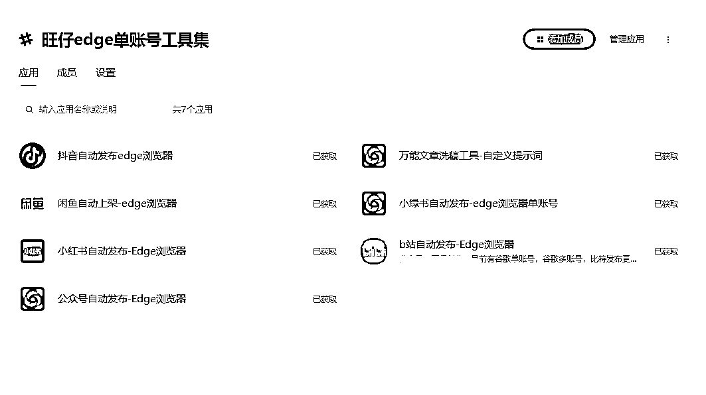
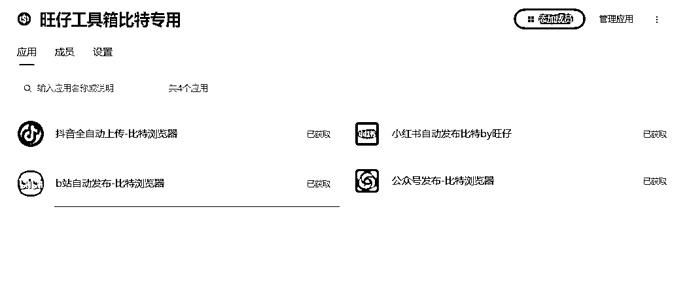
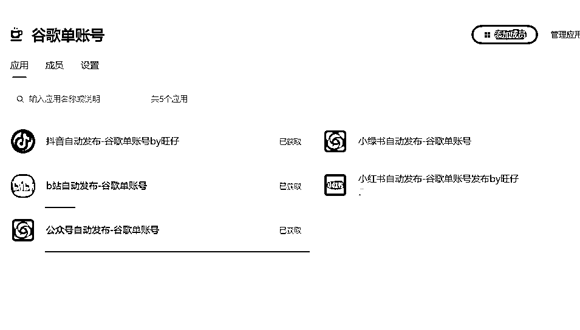

# 我利用影刀制作了一批自动发布工具，在解决了拖延的同时还提高了效率，方法和工具奉上

> 原文：[`www.yuque.com/for_lazy/zhoubao/qdq1dkmswcfvvy28`](https://www.yuque.com/for_lazy/zhoubao/qdq1dkmswcfvvy28)

## (33 赞)我利用影刀制作了一批自动发布工具，在解决了拖延的同时还提高了效率，方法和工具奉上

作者： A 旺仔¹

日期：2025-03-19

我平时有很严重的拖延症，对于自己这个缺点我看了很多文章或者资料，总是找不到一种对症下药的感觉。

有一天我早上起来喝茶的时候把自己手上实操的项目和每天要做的事情写在纸上整理了一下，突然想起大学那会学到的泰勒科学管理法，找到了自己的病因和对应的配方，并且制作了一批影刀的自动化工具，其中发布工具分别配备了 edge 浏览器（适合 1-2 个账号），谷歌浏览器，谷歌多账号模式（适合 3-5 个账号），比特浏览器模式（适合 5 个账号以上），其中自动发布工具有：小红书，抖音，公众号，b 站，小绿书，闲鱼自动上架，还有一个万能文章洗稿工具。我把自己的整个心路历程和工具都给大家分享出来了，大家可以移步到飞书。

[`y9j12wbinr.feishu.cn/docx/Wv4ed7f7XocSlPxWFKccUXFenzb?from=from_copylink`](https://y9j12wbinr.feishu.cn/docx/Wv4ed7f7XocSlPxWFKccUXFenzb?from=from_copylink)

希望这篇文章可以帮助到和我一样的朋友。

* * *

评论区：

晚晚 : 哇，刚发就看到了

A 旺仔¹ : 来的早不如来的巧[呲牙]

用卡屋 : 看完了，明天早上就试试

A 旺仔¹ : [玫瑰]