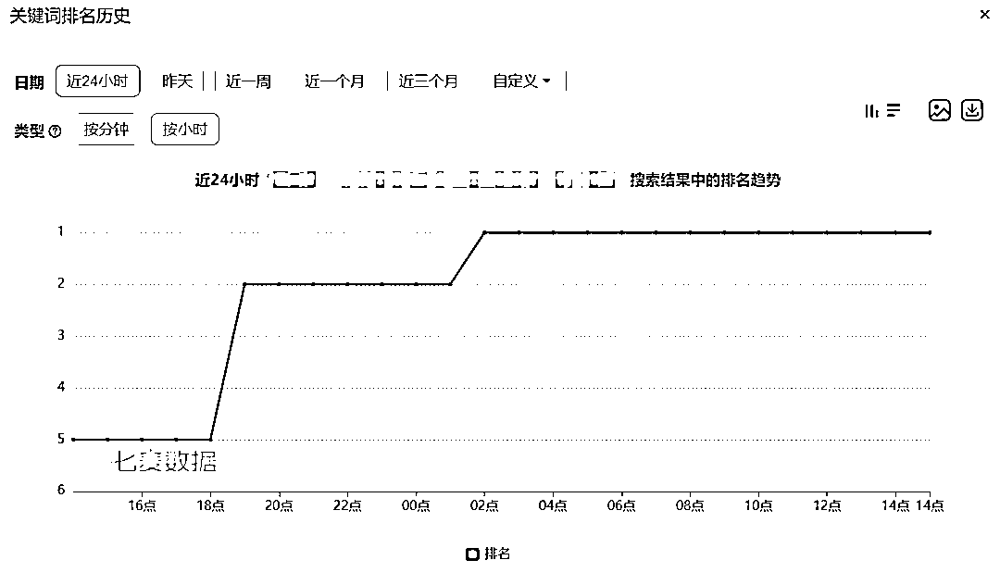
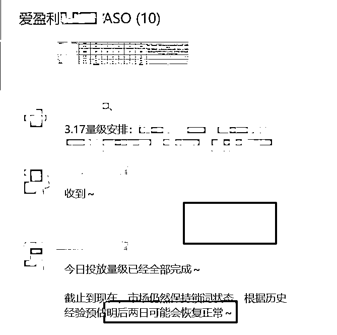
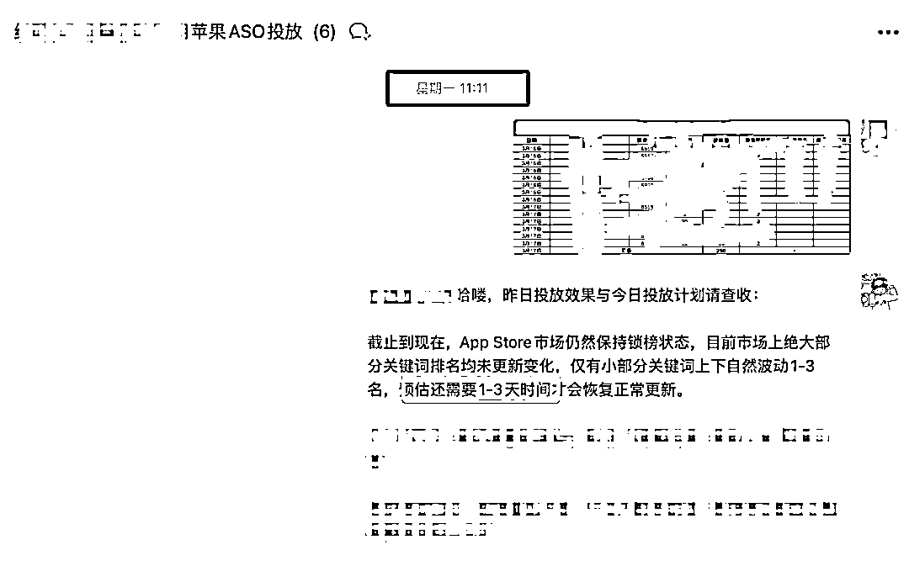
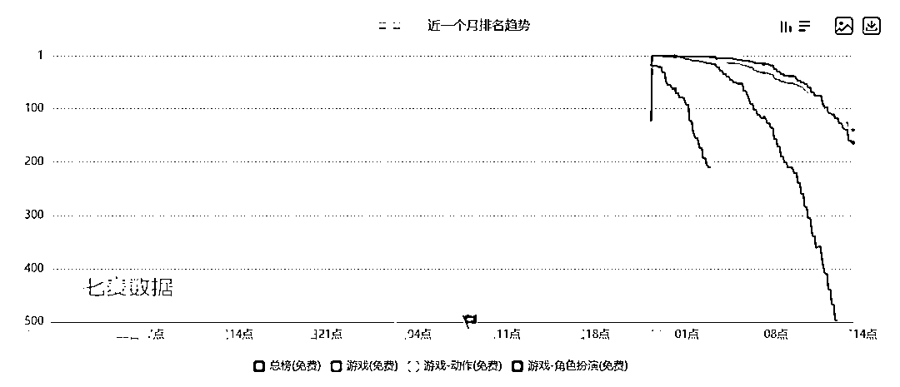

# App Store 漫长锁词，昨天终于解开（ASO）

> 原文：[`www.yuque.com/for_lazy/zhoubao/fcxrnezdlvngf2hr`](https://www.yuque.com/for_lazy/zhoubao/fcxrnezdlvngf2hr)

## (20 赞)App Store 漫长锁词，昨天终于解开（ASO）

作者： 波波@抖查查@爱盈利

日期：2025-03-20

**App Store 锁词** 是指苹果公司不定期（新品发布会、节日放假等时段）使 App Store
中关键词搜索排名结果停止更新的情况。在此期间，App 的关键词搜索排名基本保持不变，即便进行 ASO（应用商店优化）投放，排名也不会立即变动
，不过可能会有小幅度波动（各别产品下架或者更新导致的一些搜索结果排名变动）。

锁词分为**锁定全部关键词** 和**锁定部分关键词** 两种情况。出现锁词的原因，普遍认为是苹果公司在调整 App Store 的排名算法。

**年后两次长时间的锁词，** 直接打乱大部分产品 ASO 的计划，导致很多原本的投入，优化效果不达预期。具体锁词的时段如下：

第一次锁词周期是 **2 月 18 日-2 月 27 日** （10 天）；

第二次锁词周期是 **3 月 14 日-3 月 19 日** （6 天）；

期间还伴随着苹果账号反作弊的情况，导致很多 ASO 量并未出现在苹果后台。给行业带来的连续波动，难免会让人感觉苹果近期会有一系列的大动作。很多操作关键词排名效果根本不明显，可能和账号质量下降有关。

**好在昨天下午陆续解锁****^_****，** 优化的关键词逐渐开始排名上升。

实战案例展示，提前准确分析出锁词解除的日期，合理的安排优化计划，做到了先人一步，把握核心词的竞争。体现了足够的专业性和耐心。^_

同时在如此波动的时段，我们也成功帮助多个产品拿到高位，体现了对苹果规则的熟悉掌握。

**  **

**App Store 长时间的连续锁词，以及账号审查，意味着什么？**

苹果后台加入了 AI 反作弊？

还是某些冲榜产品行为太明显导致的大量账号被关联？

总之，行情的波动一定会带来不小的变化。

因为大量账号被打为无效，会导致原来同样的量级，比如 300 量之中，可能有效账号有 200 个，但是后来只剩 20 个，所以 ASO 效果下滑也比较严重。

积分墙用户依然比较坚挺，但是因为绝大部分产品都选择了性价比，导致需求下降，生态受到一定影响。所以少量积分墙（仅限头部真墙），往往也可以拿到不错的排名效果。

**之后 ASO 优化建议：** 虽然一旦出现锁词，搜索排名不是实时变动，但是一旦解绑，优化效果也是会结算的。所以依然建议在锁榜期间，保持稳定优化，否则，如果后台是加了 AI 分析算法，很容易就可以发现数据异常，锁定优化行为。强烈建议优化师，无论榜单还是关键词，优化行为尽量符合真实情况，不要集中忽高忽低，后面难保不会出现问题。

同时可以尝试对一些热度较高，但平时较少优化的关键词进行打量。不过需要注意，锁词结束后，苹果的算法可能已改变，过去的打量有可能不在数据评估范围内，导致有所浪费。

尽量用积分墙优质用户打底，这样才能在真正批量出问题的时候，依然坚挺，否则只有退潮的时候，才会发现谁在裸泳！T_T 那样就比较悲剧了。

本文完！ASO 相关欢迎讨论^_

* * *

评论区：

杰昆豆🦅 : 波波老师，请问最近七麦的关键词指数准不准？有没有滞后？还能否作为 ASO 的关键指标拿来参考？ 另外：sense tower 的关键词还有个
受欢迎度与难度这两个指标， 它们和七麦的搜索指数哪一个更有参考性？ 感谢大佬，期待回复！🌚🌚