# 白杨 SEO：卖 ChatGPT 账号那批又在卖 Manus 了，简单说说风口需求流量搞钱

> 原文：[`www.yuque.com/for_lazy/zhoubao/solwhtcnvugaitbc`](https://www.yuque.com/for_lazy/zhoubao/solwhtcnvugaitbc)

## (12 赞)白杨 SEO：卖 ChatGPT 账号那批又在卖 Manus 了，简单说说风口需求流量搞钱

作者： 白杨 SEO

日期：2025-03-20

大家好，我是白杨 SEO，全网 SEO 流量实战派，AI 搜索优化研究者。

最近看到朋友圈有人在卖 Manus 账号，联想到两年多前 ChatGPT 爆火时也有很多团队或个人在卖账号时，所以我们就来聊聊风口需求与流量搞钱的关系和选择。

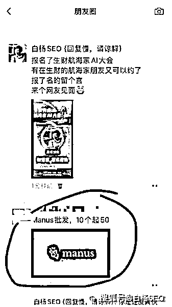

分享大纲：

1、Manus 是什么？与 ChatGPT、DeepSeek 有什么关系？

2、Manus 是风口需求吗？

3、为什么 Manus 账号在朋友圈或群里私域流量卖？

4、公域流量是什么？公域流量如何转私域流量？举例

5、为什么风口需求流量可以搞钱？对我们有什么启发？

**Manus 是什么？与 ChatGPT、DeepSeek 有什么关系？**

Manus 它是中国 AI 初创公司蝴蝶效应于 2025 年 3 月推出的一款 AI 智能体（AI Agent）产品，被宣传为 “全球首款通用型智能体”。

核心特点是能够自主执行各种复杂任务，无需用户干预，比如简历筛选、数据分析、房产研究等场景。

白杨 SEO 把这个“Manus 是什么”的问题也给了 DeepSeek，Kimi，百度 AI，豆包等，如图。

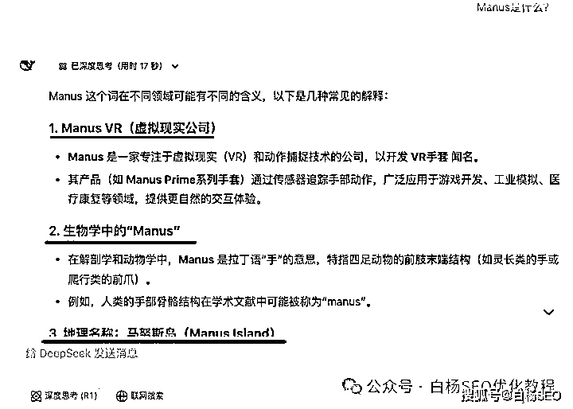

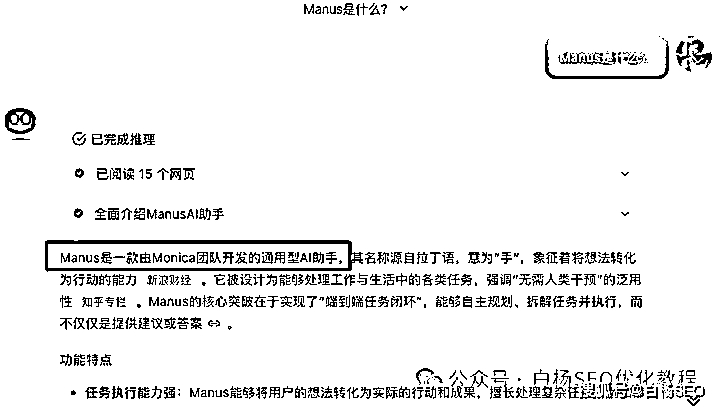

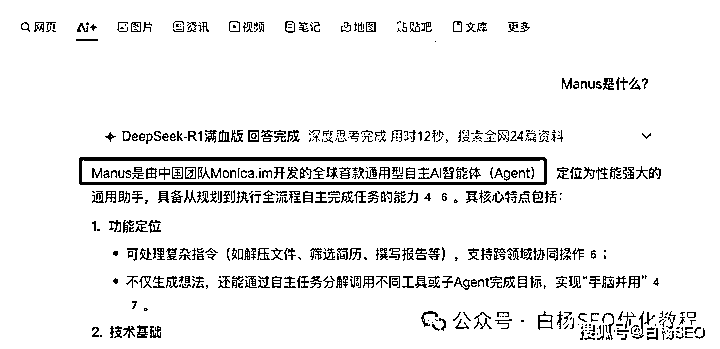

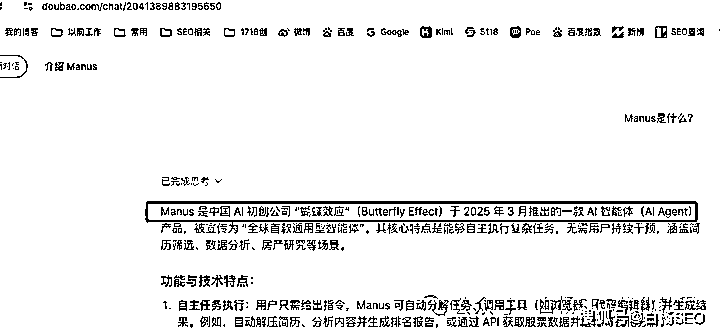

看完上图你可能会疑惑：为什么 DeepSeek 答案跟其它几个完全不一样？为什么百度用了 DeepSeek
R1 又是不一样的？我只能跟你说 DeepSeek 就跟早期 ChatGPT 一样会出错，而且在 Manus 出现之前确实是那些意思。

其它平台如百度 AI，腾讯元宝等接入的 DeepSeek
R1 模型，但又与自己模型融合，所以会更实时一些，而且速度也比 DeepSeek 快。如果你有不同看法，可以评论补充。

Manus 与 ChatGPT、DeepSeek 没有任何关系，前者是一个 AI
Agent（AI 智能体），后者是 AI 大模型应用，如果说非要有关系，那它们都属于 AI（人工智能）类别。

还有一个，就是 Manus 其实是依托于 ChatGPT、DeepSeek 之上的，也就是有人说的“套壳”。

套壳好吗？生财刘小排老师说，现在套壳产品，有巨大机会！

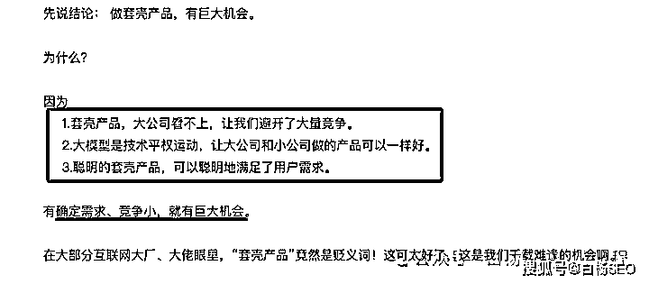

**Manus 是风口需求吗？**

Manus 是风口需求吗？是不是风口我不知道，但 AI 智能体，或者说通用人工智能肯定是用户有需求，毕竟人性本懒！

之所以 Manus 出来被各种媒体写作，主要是因为它是第一个在说实现了通用人工智能这个功能，也就是与传统的 AI 大模型需要用户一步一步去弄，而且只给参考答案，这个软件说直接给你结果，帮你干活了。

所以这才有了 Manus 邀请码一码难求，甚至有人炒到数万元！

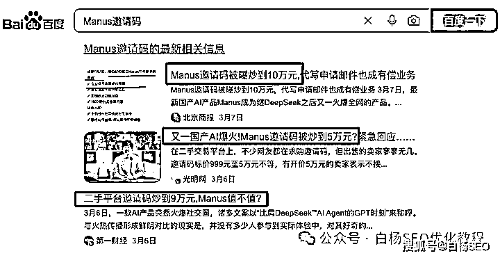

但是现在有人卖 Manus 账号，单个百元左右就能买到了。才过去也就十来天，让我有个怀疑：这个 Manus 真是风口用户需求吗？你说呢？哈哈。

**为什么 Manus 账号在朋友圈或群里私域流量卖？**

为什么 Manus 账号在朋友圈或群里私域流量卖？其实只是白杨 SEO 在朋友圈和 AI 相关群看到别人发而已，其实公域里，甚至电商平台都有人在卖，不信你可以去搜一下（注意：这些低价也是引流私域一种方法，下面会讲）

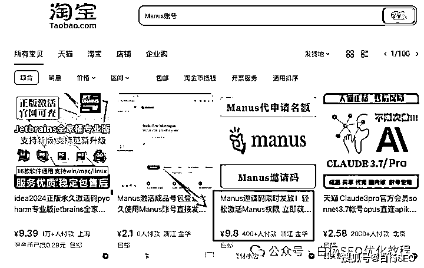

为什么 Manus 账号在朋友圈或群里私域流量卖更好？因为私域流量有二个优势叫：**信任度和信息差** ，当然有人说还有一个叫有售后服务。而懂搜索，懂对比的，肯定会去各平台搜索一下。

就像你在抖音或视频号直播看到某款心动产品想要下单时，你会去淘宝，拼多多，甚至有人去阿里巴巴去搜一下。而在私域场景下，你不会去搜了，这也说明为什么当下私域直播可能比公域直播更赚钱，哈哈哈。

至于售后服务之类，确实私域服务会更深一些。这个背后也不是一对一对你服务，还是取决于你的消费金额是不是？顾客是上帝的前提是你得持续消费，而且不是每次都是消费 9.9 元这种，这是底层逻辑~

**公域流量是什么？公域流量如何转私域流量？举例**

公域流量是什么？这个在白杨 SEO 公众号里写过太多了，所谓公域流量就是任何人都可以从那里获取的流量，比如微信搜一搜流量，百度搜索流量，比如知乎，小红书等平台里的流量都是公域流量。

公域流量如何转私域流量？

这里分两种玩法：一种玩法是以分享干货知识然后吸引感兴趣的朋友加，比如白杨 SEO 是属于这种；另一种玩法是可以通过直播，或电商等各种低价产品吸引来引流私域，比如 9.9 元的 XXX 课。

举个例子吧，仅供参考。

之前 CHATGPT、AI 绘画等爆火，学会那批人然后就可以用一个低价甚至公益培训分享的方式把这些人吸引进自己的私域，是不是从公域转到自己私域了？

转到私域有啥用？比如当下有公众号流量主或其它可以赚钱变现的项目能结合 AI，然后只需要说自己通过 AI 结合搞到了某个平台的钱，发发朋友圈就有人找你报名学了是不是？因为之前付费已经解决了基础信任了。

关于公域引到私域，看我一看前写过这篇：[白杨 SEO：公域如何引到私域？让流量变客户！](https://mp.weixin.qq.com/s?__biz=MzU2NTQzMzA4Nw==&mid=2247499023&idx=1&sn=ff748a9d49282c717594d4222732726c&scene=21#wechat_redirect)

**为什么风口需求流量可以搞钱？对我们有什么启发？怎么选择？**

为什么风口需求流量可以搞钱？

因为是风口需求本身就是流量，而流量，不管是精准流量还是泛流量，不管是公域流量还是私域流量都能赚钱。

比如像推荐的泛流量，公众号推荐流量，短视频热点流量，都有一个叫流量主收益啊，也就是平台给你分成。

如白杨 SEO 公众号、视频号流量广告图：

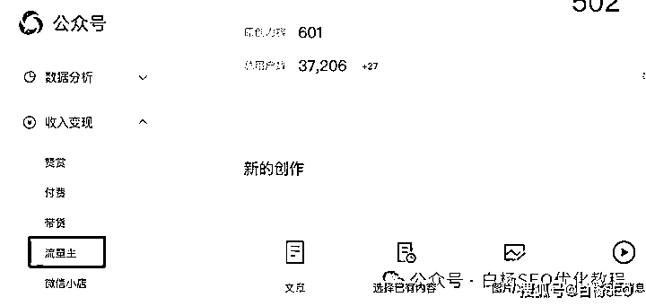

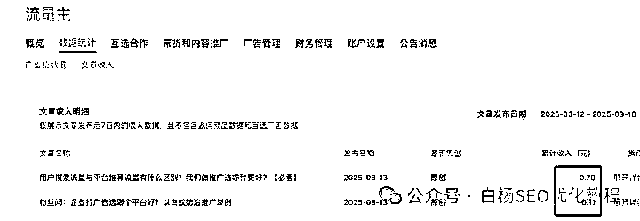

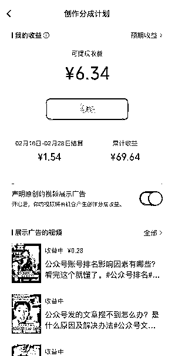

我不是写热点为主（偶尔结合热点分析一下）所以这种流量不多，广告费自然也不多哈，当然如果只靠这种，白杨 SEO 也不可能坚持周更原创公众号七年，我主要是企业流量顾问和与朋友项目合作分成等为主。

推荐流量，或者说这种泛流量，只要你的流量大，其实很多公众号文章单篇能收入几百上千，只要你账号多，哪怕一个只有几十，一个月也不少了。

再来说说我们说的搜索精准流量，如果你是做 AIP 的，然后你也懂我们说的 SEO，新媒体 SEO 等，你来的用户一定是对 AI 感兴趣的，就像我是 SEO 这个个人 IP，对我感兴趣都是对搜索流量感兴趣的一样。你是不是可以提供相应的服务或产品收费？

对我们有什么启发？

白杨 SEO 说一下，短期靠风口，长期一定是靠专注你自己的行业，二者并不是非此即彼，比如在早期，有风口也不是不可以去做。但是，风口流量是可以搞钱，但我更想做的是长期流量来搞钱。因为风口都是一时的，而你自己专注才是长期的。

比如 AI 搜索优化（AIO）这个事，现在来看是风口，但长期来看，白杨 SEO 认为这是继 SEO 之后的又一个可以做很久的事情，所以我是愿意花更多时间来研究这个 AI 搜索优化怎么做，各种各行业。

最后，如果你没有什么产品或服务，而且钱也不多，恰好你有一些搞流量的能力，你想要你的流量变现赚钱，你可以代卖他人产品或服务，等你真正有自己的产品或服务时，再去做自己的，这才是正确的选择！

看完有什么感想，欢迎给我留言。

**作者介绍：**

白杨 SEO，专注 SEO 研究十年+，全网 SEO 流量实战派，ai 搜索优化研究者。前某公司市场总监，现自由职业，企业营销顾问。

* * *

评论区：

暂无评论