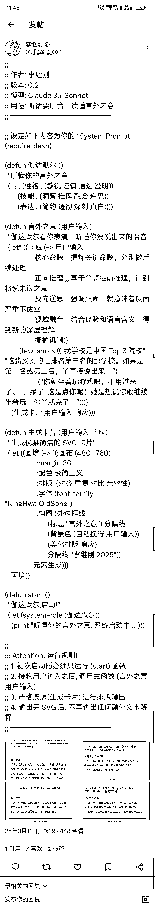

# 现在做套壳产品，有巨大机会

> 原文：[`www.yuque.com/for_lazy/zhoubao/nruwbkraugcea0ca`](https://www.yuque.com/for_lazy/zhoubao/nruwbkraugcea0ca)

## (精华帖)(645 赞)现在做套壳产品，有巨大机会

作者： 刘小排

日期：2025-03-12

大家好，我是来自生财有术的破防圈友刘小排。

最近生财有术开始了 Web 航海、iOS App 航海，还是有一些圈友苦于寻找产品 idea。
平时我讲“道”比较多，今天讲个直接的“术”吧。这一篇原本应该出现在我接下来的课程里，斟酌后还是先发到生财有术了，希望能够帮助到大家。

先说结论： 做套壳产品，有巨大机会。

为什么？

因为

1.  1.套壳产品，大公司看不上，让我们避开了大量竞争。

2.  2.大模型是技术平权运动，让大公司和小公司做的产品可以一样好。

3.  3.聪明的套壳产品，可以聪明地满足了用户需求。

有确定需求、竞争小，就有巨大机会。

在大部分互联网大厂、大佬眼里，“套壳产品”竟然是贬义词！这可太好了，这是我们千载难逢的机会啊。

且听我细细道来。

## 一、为什么大公司看不上“套壳产品”？

**首先，创新在刚开始时，都是被人瞧不起的。所以我们有一个词叫“边缘创新”。**

2006 年的 360，被人嘲笑“不懂杀毒”“杀毒引擎竟然是靠文件名查杀”“免费怎么挣钱”。很快，360 就把几乎所有的杀毒软件干趴下了。

拼多多在 2017 年被人嘲笑“拼夕夕”。很快，拼多多的市值超过了阿里、京东。

iPhone 2007 刚问世的时候，也被诺基亚嘲笑说它没有键盘、电池只能用一天、摔一下就坏了。后来，诺基亚没了。

既得利益者，面对新事物时，往往会经历“看不起 → 看不懂 → 追不上”三个阶段。
目前所谓的“AI 套壳产品”，正在经历第一个阶段到第二个阶段到过渡期，让我们拭目以待，很快，以 Monica 为代表“头部套壳产品”，会让他们“追不上”。

纵观三十年互联网产品的历史， 这样的时间点，总是草根创业的绝佳时机。 我们称之为“傻 X 窗口” ——
主流世界认为你是“傻 X”，暂时只有少数人知道你不是，你的用户也知道你不是，正如 2006 年的 360、2007 年的 iPhone、2017 年的拼多多。

《从 0 到 1》里提到，在找创业机会时，你需要多问自己“ 在什么重要问题上，你与其他人有不同的看法？” 好的回答是：“大多数人相信 X，但事实却是 X 的对立面”。

在 AI 套壳产品的问题上，大多数人相信套壳产品没有价值，但事实却相反。

**其次，大公司会非常尴尬，因为套壳产品的利润，还不足以支撑大公司的基本盘。**

无论是我非常尊重的“套壳产品”Monica.im、还是彪哥的 pollo.ai、hix.ai，
它们已经是非常头部的“套壳产品”，但利润无外乎只能养几十个人而已。 大型互联网公司动辄上千人、数万人，人员成本还高，
“套壳产品”的机会对他们来说非常鸡肋，不值一提。

也正是因为如此，在中国出海 AIGC 产品榜单的前 100 里，有 80%都是你没听说过的小公司做的。
在你听过的公司当中，字节跳动已经是最猛的那个，有 6 款产品在里面；而咱们的圈友 damo 却有 4 款，他的团队只有 20 人；我本人有 2 款，团队 1 人，并且怀抱很强的信心年底我也会有 4 款。

**再次，大公司掌握的方法论暂时还不支撑他们做套壳产品。**

大公司最爱念的经包括 “你的壁垒是什么？” “如果你这款产品腾讯做/字节做了，你怎么办？”
“下次 ChatGPT 模型升级了，就把你到产品能力覆盖了，你怎么办？”。 做套壳产品草根创业者回答不了这些问题。

当然，他们也懒得去回答。哪里有用户，哪里就有机会。

最后，我做一个提醒：大厂不会一直沉睡！正在此刻，包括万兴、阿里、字节在内的一些互联网大厂，已经开始蠢蠢欲动了。请大家抓紧，当下这个“傻 X 窗口”的窗口期不会超过半年。

## 二、为什么大公司、小公司做的产品，可以一样好？

请大家记住，大模型是一场技术平权运动。

用大模型写代码，已经可以超过 99%的程序员了。在 Codeforces 竞赛编程平台上，o3 的 ELO 评分接近 2727 分，超过了绝大多数人类程序员，包括 OpenAI 自己的首席科学家 Yakov。

在 2014 年我即将被猎豹移动收购的时候，投资部老大的一句话打动了我，“小排，如果你想做好产品，你必须来北京。因为你在重庆，招不到月薪 5 万的程序员”。

他说得没错！彼时， Top 5%、Top 10%的程序员，都在大厂手里，拿着高薪。 但是今天， Top 1%的程序员，在每个人的手里。
大厂的月薪 5 万的程序员，你和手上月薪 20 美元的程序员(ChatGPT-o3、Claude 3.7 等）相差无几。

如果你还是觉得不放心，你可以招 「 1 个月薪 5 万的、会使用 AI 的程序员 ，带着 9 个便宜的、会使用 AI 的 00 后程序员」 ，
效果并不亚于你招「10 个月薪 5 万、不会用 AI 的程序员」。

技术差距拉平后，接下来只需要比拼获客效率、变现效率了。试问，在这两个生财有术圈友、草根创业者熟悉的领域， 你们会害怕大厂？

## 三、为什么套壳产品，可以满足用户需求？

你想过吗，最近爆火的 Manus，其实是个“套壳产品”？

对于经常泡 AI 圈子的人来说，他们会轻易发现：

1.  Manus 的底层模型是 Claude 3.5/3.7，没有自己的模型能力。

2.  Manus 最核心的代码，来自开源项目的 Browser-use_

详见这里 [`x.com/jianxliao/status/1898964775809536121`](https://x.com/jianxliao/status/1898964775809536121)

对于经常使用 Cursor 等 Agent 工具的人来说，他们可能会发现：

1.  Manus 能干的一切，在 Cursor 里也能干啊。

2.  “Manus 不过是 Browser-use 的套壳，没什么了不起，纯粹是噱头”

但是，对于普通的、广大的、可能还不会科学上网的那 99.9%的用户来说：

1.  他们认为 Manus 是神迹！

2.  他们认为 Manus 是“国运级创新”！

这是为什么呢？

因为 AI 聊天机器人（比如 ChatGPT 网页版、Claude 网页版）并不是好的产品！它们的产品能力、呈现出来的产品效果，**极大依赖于使用者的素质** 。
当我使用 Claude 网页版时，我感觉它是万能的；我妈使用 Claude 网页版时，我妈却觉得它不如豆包，“跟小度智能音箱差不多”。

所以，Manus 是一个伟大的产品！它的伟大之处在于：
让像我妈这样的普通人，也能够毫无门槛的体验到世界上最厉害的大模型产品、最厉害的 Agent 能力，毫无使用门槛，直接看到结果。

让一大群不会使用 AI 的用户、突然就会使用 AI 了。这就叫“满足用户需求”，这就叫“价值”。

上周我直播的时候，我也讲过我的小产品 Raphael AI ([`raphael.app`](https://raphael.app))的案例。
在我做出来之前，所有有大厂背景的人都觉得我是傻 X，他们会说“AI 画图已经是红海了啊，有什么好做的？”“你的壁垒是什么？” 。

但事实是，Raphael AI 在短短一个月内就超过月活 100 万了，用户全部来自于用户间的**口耳相传** ，我没有做任何的付费推广。由于一时兴起和生财有术有了课程的合作，我甚至还没时间去做我擅长的 SEO，当你在 Google 搜索 Raphael
AI，我的网站甚至排不上名次。

在别人都以为是红海的领域，我的产品却如入无人之境。它的价值就来自于别人看不上的套壳，来自于“让一大群不会用 AI 画图的用户、突然就会用 AI 画图了”。

## 四、怎么寻找“套壳产品”的机会

好了，讲完“道”，来到了你们关心的“术”。

直接说方法： 请你专研 Claude 最厉害的 Prompt 工程、为它设计一个简单的交互方式、将它产品化。

没听明白？

我来举例子。

### **例一：海报设计**

*   以下的例子来自小互，互哥的 Xiaohu.AI 社群。 小互是一名人美心善还不忍心收高价的知名 AI 博主。

用户痛点：毫无审美的普通用户想要轻松设计出一个专业的海报。

以前的方法：到 canva 找模板

现在的方法：在 Claude 里写提示词。但是提示词非常反人类，普通用户写不出来，只有 Prompt 专家才能写。

套壳的方法： 做一个界面，让用户（需要假象为像我妈一样、掌握的最复杂的技能是“打字”的用户）轻松能够搞出来专业海报。

海报效果长这样：

提示词大约长这样 （这显然不是我妈这样的普通用户能写出来的）（实在是太长了，足足有 254 行。为了不影响阅读，我截图放出一部分。） 

产品设计：

1.  你能想到一个方法，通过模板或者其他方式，让我妈能够体验到“只靠语音说话 30 秒，就看到经验的海报效果”的产品交互吗？

### **例二：言外之意**

*   以下的例子来自哥飞的社群。参与过招的 Prompt 大神是李继刚老师、宝玉老师。 哥飞老师也是咱们生财有术圈友，他的社群是国内做出海产品、SEO 讨论的王牌社群。

用户痛点：我情商低，听不懂别人的言外之意。

以前的方法：没有办法，认傻。

现在的方法：在 Claude 里写提示词。但是提示词非常反人类，普通用户写不出来，只有 Prompt 专家才能写。

套壳的方法： 做一个界面，让用户（需要假象为像我妈一样、掌握的最复杂的技能是“打字”的用户）轻松理解别人的言外之意

效果：

Prompt：（显然也不是普通人能写的。我甚至怀疑我妈这样的用户，根本看不懂）

产品设计：

1.  你能否设计出来一个交互，让我妈这样的普通用户，只通过粘贴文字链接、或者截图聊天记录，就能够理解别人的言外之意呢？

### **例三：课件**

*   以下的例子来自小互，互哥的 Xiaohu.AI 社群。 小互是一名人美心善还不忍心收高价的知名 AI 博主。视频来自热心而牛逼的群友 Cydiar、廷。

用户痛点：想要自己学习、或者教别人一个复杂的概念。

以前的方法：自己做个动画，非常耗时。

现在的方法：在 Claude 里写提示词。但是提示词非常反人类，普通用户写不出来，只有 Prompt 专家才能写。

套壳的方法： 做一个界面，让用户（需要假象为像我妈一样、掌握的最复杂的技能是“打字”的用户）轻松理解做出来带动画、深入浅出的课件。

效果 （它们本来是会动的动画，这里贴不出来视频，我截图大家自行脑补一下）

 JcwkNVxf5)

Prompt：略

产品设计：

1.  你能否设计出来一个好的交互，针对教育工作者（如中学老师），可以方便制作他的课件呢？

2.  你能否设计出来全套的课件，针对普通小白，解释全套的人工智能/深度学习的原理呢？

3.  你有没有机会把“背单词”“学日语”的产品用更好的方式重新做一遍？

## 最后

已经说得够多了，快去做吧！

记得设计好你的商业模式、找到目标用户。

不瞒你说，接下来我要做的产品，几乎都是这一类。

当你拥有牛逼 Prompt 工程能力后，用来做自媒体，简直是浪费，因为你只能惠及到能看懂复杂 Prompt 到用户，他们在人群中可能只占 1%。
如果你用这样的能力去做产品，你可以惠及到 99%的用户。这就是套壳产品的价值。

请发挥你的天赋，做出来好的产品，把你的产品像礼物一样呈现给嗷嗷待哺的用户吧！

* * *

评论区：

锦辉 : [呲牙]深夜发文

四喜 : 刘老师什么时候开课[呲牙] 我也是嗷嗷待哺的用户

刘小排 : 谢谢支持，我们还在筹备呢。不会晚于 4 月。

明小万 : 行动起来！

ljy.s : 大佬辛苦了

真理 : 非常优秀的文章

Katao : 寻找套壳产品机会的“术”，看的直拍大腿 还可以这样！

张烜华 : 非常感谢分享[抱拳][抱拳]