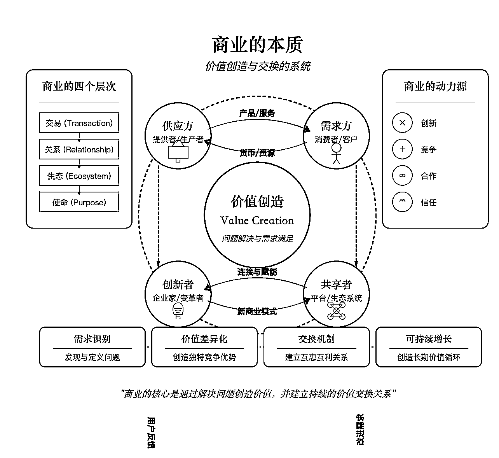

# 用 Claude 5 分钟绘制学术级模型结构图，搞定科研科普书籍、演讲、教学绘图

> 原文：[`www.yuque.com/for_lazy/zhoubao/wci8r33oszug7g4g`](https://www.yuque.com/for_lazy/zhoubao/wci8r33oszug7g4g)

## (58 赞)用 Claude 5 分钟绘制学术级模型结构图，搞定科研科普书籍、演讲、教学绘图

作者： 云中江树

日期：2025-03-12

大家好，我是「云中江树」，AI 结构化提示词提出者，AI 智能体设计师，AI 科普作者，「云中江树」微信公众号主理人。

七天邀请我来到星球以后一直想找个机会分享一些比较实用的内容。今天分享这篇用 Claude
绘制实用级模型结构图的方法，在科普书籍制作、教学材料、演讲分享 PPT 等场景非常实用，并且可以拓展开来，不局限于 AI
领域，各种其他领域的类似绘图，都可以轻松搞定。

去年就有好几家出版社找我希望一起合作一些 AI
科普书，我调研以后发现难点还是在绘图上，要制作清晰美观的图片，下面这种图一张往往都要 2 个小时以上。并且这种图片对准确性，细节性要求极高，即梦这种生图软件是完全无法搞定的。

现在用这个方法，就能在几分钟内实现科普书中的许多概念图，结构图的制作。

比如下面的本质概念解读图片




比如 AI 模型结构图：

 images.zsxq.com/FhK79WWToK7DHuv39hFVQ_bhu676) images.zsxq.com/FpTuXr5RNbC1l4QSViqmmDUTNjNq)

 images.zsxq.com/FnPIiqW2fO4oBLH39sfc7NqgtKFp) images.zsxq.com/Fn3jTaKe_BHQKbosA6vJIlmGyL_K) images.zsxq.com/FiDcfyVtu7VTmq4rUvJBPlCxjnMv)

那么这种图如何绘制？

现在江树将这个神级提示词分享给你：

*   使用 Claude （claude.ai）

*   提示词模板

```
绘制 xxx 结构图（SVG）

\- 元素不重叠，避免内容过于拥挤

\- 添加小型公式来解释关键计算

\- 使用精确的专业术语

\- 数学公式使用公式字体，英文使用 times new roman 字体，中文使用宋体

```

*   在 xxx 中填写你想要绘制的内容，比如

```
绘制 MLP 的关键结构图（SVG）

\- 元素不重叠，避免内容过于拥挤

\- 添加小型公式来解释关键计算

\- 使用精确的专业术语

\- 数学公式使用公式字体，英文使用 times new roman 字体，中文使用宋体

```

*   在同一个对话中，后续可以直接使用"绘制 xxx 的结构图" 这种简单指令

江树检查了两遍，没有发现错误，基本都是可以直接使用的。

最后，新人报道，请多指教~（吐槽一下知识星球的编辑器，贴图片老崩 hh）

* * *

评论区：

AI-Reshape : 江树来啦！

云中江树 : 来啦 hh，你也在！

Cheer 林悦己 : 哇！江树老师！！！！

云中江树 : 来啦来啦 hh

七月 : 感谢分享！

夙愿学长 : hi 江大

D•欢 : 江树老师！！

宇宙尘 AI : 有用，简洁明了