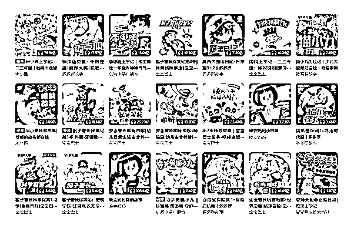
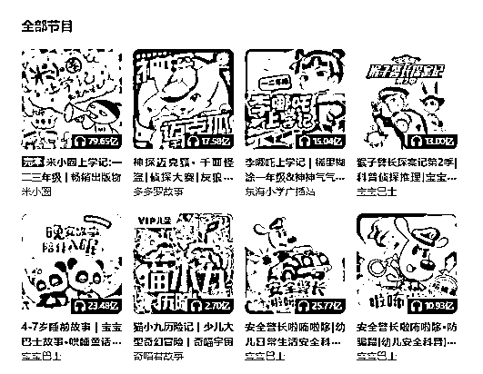

# 只需一套 Ai 创作技能，即可做家躺平（我用一年时间找 AI 方向的过程）

> 原文：[`www.yuque.com/for_lazy/zhoubao/nfsq9b4cqf7u7rgu`](https://www.yuque.com/for_lazy/zhoubao/nfsq9b4cqf7u7rgu)

## (48 赞)只需一套 Ai 创作技能，即可做家躺平（我用一年时间找 AI 方向的过程）

作者： 领飞懂运营

日期：2025-03-13

大家好！

我是领飞，一个爱潜水的航海家和传术师。（我用一年时间找 AI 方向的过程）希望对你有所帮助。

**《哪吒 2》谁是灵魂？**

**  **

饺子导演，让我知道一个草根，一个普通人，一个没背景人物逆袭的故事，甚至可以说用“创意”打败电影圈的老军阀。

** *2025 年，发生的 3 件事情，让我对人生未来充满光目，内心不再灰暗，那么低沉；***

** _  _**

**_****_**

这种灰暗，能影响到我对孩子的教育，“谁还不是一个牛马”，高级不高级而已。

尤其对于职场影响，资源、背景、靠山、富二代、红三代，你家亲戚是谁？

**学习好又如何？**

茫茫众生，大多如此平凡而努力，一个学区房，压垮多少人？

*规则，不是给有钱人制定的，更不是给有权的人制定。*

_  _

*这句话，只有你成家立业 35 岁后，才明白。*

_  _

*顺从，让你平安一生；逆从，大佬谁还没有黑历史。*

_  _

一个富婆在城市里开车，车想停哪停哪，红灯来不及也就闯了，要知道有个黄牛，富婆每年给他 20 万处理违章。

你带着父母去天花板医院看病，一个专家号，有钱人高价买黄牛，有权人只需一句话，你甚至连病房都排不到。

**我说这些，不是让大家多么暗自诽谤，** 社会有多么灰暗，而是普通人就是如此，只有你到达了某个领域的顶层，你才会享受到规则之外的福利。

也不是让大家去做踩缝纫机的事情，而是思考，什么方法能让一个普通人变得不普通。

**第一件事：《哪吒 2》**

**  **

饺子导演，用创意、用工匠精神，一战成名全球电影票房前十；有没有想过，为什么是动画片，而不是真人剧作？

动画片更容易，把创意结合起来，只要你有创意。

在中国影史，他就是天花板了，代表的什么？说的惟利是图点，电影圈吆喝一声，抖三抖。

**第二件事：DeepSeek**

**  **

梁文锋创始人，用技术+创意，一战成名全球 AI 领军人物，他的在中国的历史地位堪比“马斯克”。

也是一个普通人，不说他有什么机遇，而只是单纯的论：技术+创意，百度、阿里、腾讯、为什么没做成？

**第三件事：机器人上春晚**

**  **

王兴兴，用技术+科技，一战成名全球机器人未来领军人物，他从小极其内向、英语很烂、偏科非常严重，上大学时因为学不到机器人技术，辍学创业的想法，他主动申请了延期毕业。

也是一个普通人，钻研技术到极致逆天改命，未来 3 年机器狗进家庭，未来 5 年机器人进家庭，就像家家有汽车一样，成为必备工具。

**这 3 件事情，都不简单，但这 3 个人都又出生如此平凡；**

**  **

只有普惠大众，向下普惠老百姓，愉悦大众，这就是他们的成功；好比，有钱的人多了，有几个能像他们一样，成为国家的英雄。

**好比生财有术，为什么会成功？**

普惠了，所有普通人的创业的信息差，在创业圈，在创业社区，不可忽视的天花板级别的力量。（社会方方面面，捧下亦人老大的臭脚吧！哈哈）

**  **

上一代的商业大佬，中国 100 强首富，什么背景？不用多说吧，有几个是没家底关系支撑起步。

在我们的这个社会，没关系寸步难行。

但是：技术+创意+互联网，就会让你一战成名，这也就是杭州这块土地，人才、名企，井喷的原因。

所以，我上面说，我对孩子教育也不焦虑了，父母有什么样的学识认知，你就培养什么孩子。

**学习好又如何？**

**  **

**没有创意**

**  **

**没有情商**

**  **

**没有技术**

**  **

这 3 个，远远要比学历更重要。

所以也就不跟有钱人卷了，培训班少报点，不成才又何妨？不远离他乡，陪伴你身边也许最好。

（我姑姑家的表妹学习好，当了医生，嫁在 600 公里以外，过年我去看姑姑，家里冷冷清清的两口子 60 多岁了。）

五味杂瓶，我这学习不好，每个星期带着孩子配父母，过年还跟我爸妈喝一瓶。

**说了一大堆感概！**

**  **

混入上流社会，方法千千万万，**唯有【创意+技术】，** 方可一战成名，破圈成为顶层的参与者。

**只需一套 Ai 创作技能，即可做家躺平**

兜兜转转一年多了，**【Ai 赚钱机遇】** 更多的是制造焦虑；

做为一个互联网老炮，老掉牙的炮手，自己也深陷这种焦虑；

到底怎么入手，进入什么赛道，抓住什么方向机遇？

这一系列问题，相比你也再困惑？

尤其是对于 8090 后，这帮大叔！

我付费了几个 Ai 的大牛，无一不是再做**【Ai 培训】** 的事情；

任何风口，第一波吃肉的就是他们！

普及【Ai】这件事，跟 5 年钱普及【抖音】一个道理；

但又好像不同！

**【抖音】侧重宣传突破，是营销的渠道。**

**【Ai】侧重效率提升，是量化的工具。**

**  **

如果说：【Ai】的效率用在【抖音】的内容营销突破，这样大家就可以理解了。

当然【Ai】的效率，不单单解决内容效率，智能化应用那也是方方面面。

**这里就产生了 2 个核心？**

**  **

**效率化**

**  **

**智能化**

**  **

这就清晰了，到底要入局哪个赛道，抓哪个赚钱机遇！

**【效率化】** 入局：办公，营销，创作，客服，流水作业等板块；

**【智能化】** 入局：软件，硬件，电器，科创，生活服务等板块；

这里大家就明白了很多培训，绝大多少都在培训【Ai 效率化】。

【Ai 智能化】提供生成工具应用，【Ai 效率化】普及【Ai 智能化】。

所以头部玩家一定是【Ai 智能化】的公司、团队、企业。

**我之前，** 谈到一个有趣的事情，也是被人忽略的事情：“炒股”

要说去年，持续 2 个月的一波股票大牛市，不是凭空而起；

如果说，你入局【Ai 智能化】的企业，是不是？现在起飞了。

**deepseek** 你搜索下【Ai 智能化】的那些企业，或者配套生成【Ai 智能化】的周边企业，凡是有配套生成的业务，都在股票飙升；

**一个机器狗**

**  **

**一个机器人**

**  **

有多少个厂家在配套，这就是一人得道，鸡犬升天。

**也不是我预测吧！**

**  **

未来 3 年，机器狗一定会普及到每个家庭；

未来 5 年，机器人一定会普及到每个家庭；

就像车一样，成为每个家庭的刚需，不可缺失的工具。

所以；

** *【Ai 智能化】的高端局风口在哪？***

** _  _**

***你怎么入局？***

** _  _**

这里不用多少了吧？

低端的做市场，就像“家电”。

中端的做股票，就买周边。

高端的做企业，就与大厂合作。

终端的做研发，就扩展 Ai 任何产品。

浅谈，粗浅的一些见识。

【Ai 智能化】我不打算入局，当一个吃瓜群众好了，就好比：

我天天看“新能源汽车”打架，打的越凶猛，越对老百姓好。

非要入局，可以现在用“deepseek” 查询，哪些 Ai 企业股票可以买。

**言归正传！**

**  **

**【Ai 效率化】才是我全部 All in 的方向。**

举个例子吧：

Ai 降低了创作的门槛，上面的图片，吓人吗？

如果你学会【Ai 系列儿童故事】编写，会怎么样？

我不知道大家，有没有孩子，我 2 个孩子开会员，就花了不少钱。

** *版权，版权，版权***

** _  _**

这个事情，我强调三遍，写作赚钱是“即时收入”，比如：公众号爆文，头条爆文，代写公文 PPT。

但是版权，是永久吃香喝辣，才是**【Ai 效率化】** 的高端局。

**【Ai 效率化】** 一定要抓住“效率化”这三个字，用自媒体各个平台当作宣传口，爆了那就是版权。

用**【Ai 写作】** 写出系列儿童故事，【Ai 效率化】多多的去写，多多的去创作；

之后，用**【Ai 智能化】** 的工具，Ai 绘画，Ai 动漫，Ai 配音，Ai 视频等，赋能你的【Ai 系列儿童故事】。

这就成了！

**这就是一套完整的，适合普通人的【Ai 赚钱机遇】！**

完全可以全力以赴 All in 的去做，义无反顾 5 年的方向。

**创作赚钱**

**  **

不是没有成功案例，天花板级别的案例：

《哪吒 1》《哪吒 2》

导演：饺子

不就是通过“创作、创意”，逆天改命的嘛！

当然，他的高度也许你没这样的机遇，但是“创作、创意”是普通人能用 Ai 协同完成的。

哪怕！你只单纯的写一套系列故事去配音，只要有了版权，还不怕资本找你吗！

**论【Ai 创意+技术】赚钱，以上面观念，再论**

这个视频，值得大家反复观看，他不像那些商业大 V，说一些云山雾罩的 P 话，除了卖课没一个落实具体的方向。

信息很泛滥，要学会信息筛选，哪些是有用的，对你现阶段有具体方法的作用。

就如上面视频，刘小排老师，把**【AI 编程】** 赚钱的方向告诉你了，你该如何去做！

有了这个方向，你搜索 100 条、1000 条更多相关信息，这就是有用的方向。

实在不行，拿出 1 万块钱，跟高手聊一个小时。

**【AI 编程】又如何？**

**  **

还是创意，会编程的人多了，AI 编程只是解决效率问题，寻求痛点，解决痛点，才能赚钱。

**AI 用在普通人最应该落实什么？**

**  **

就是把：你的**“创意”，** 无限个**“创意”** 实施起来！

只要你敢想，就能为你实现。

上面，我提到**【AI 效率化】** ，其中最容易实现的赛道就是：写作

写作的高端局，一定是版权

一个最初从模仿开始，先把提示词锻炼起来

**比如：**

**  **

帮我模仿 【某一个绘本故事】，重新架构一本新故事

锻炼了：提示词能力，轻轻松松一天完成多个绘本新故事能力。

锻炼了：生成绘画能力，把文字变成绘画。

锻炼了：合成视频能力，把绘画+文字+配音组合成视频。

**这个版权创作，简单吗？**

**  **

相对于作家这个行业，AI 首先冲击的就是他们，同样也大大降低了绘本作家的门槛，也提效了绘本创作力度。

**我大胆有一个设想！**

**  **

我把每个我用【AI】做的绘本故事，都去申请一个版权，挂满屋子；

我的两个女儿，会不会以此为傲；

我满足了教育，虚荣，榜样，引导，情绪的等等价值。

**当我把【AI 绘本】模仿提示词，做出【智能体】**

**  **

是不是又可以，像【公众号爆文】那样拿来培训，或者卖【AI 模仿绘本智能体】呢？

对于做剪辑视频副业的群体，又多了一个赚钱的方法。

**这都是小道！不能在小的道行！**

**  **

尊重原创，尊重自我创作能力，先从模仿开始，在进行细化。

大量的模仿，只是解决生存的问题，但同时在模仿的过程中，积累【创意】才是大道。

最终，自己原创**【系列套】** 绘本故事，漫画故事，音频故事，短片动画故事。

比如：米小圈，迈克狐

**【AI 写作赚钱】之高端局**

**  **

刘小排老师那样，非常懂得产品痛点，这是一项**【即时】** 能力，会编程的人多了，有嗅觉洞察商机的人很少，对吧。

但是，对于创作而已，每个人天马行空，文化再低，也不会缺乏想想。

很多时候，我们都在幻想一夜暴富，一夜成名，一次穿越的重头再来。。。。

只要你敢想，就可以通过 AI 完成，你这一些虚幻的事情，把他变成一本著作。

**这本书，总有喜欢的人看；**

**  **

只要有人喜欢，这就够了，你把幻想变为了真实，也许收获了粉丝，收获了钞票，收获了快感，这都是真的。

只要你真为一次幻想变成了现实，后面还会发生什么，你也就越发光明，AI 这件事也就真实了。

**说以【AI 写作赚钱】，** 真正为自己写作，为未来写作，**【版权】** 才是高端局。

这仅仅是一篇文章，我从困惑，焦虑，灰暗，方向，这 4 个维度，蝉属了我这一年对 AI 的过程。

我天天看 AI 很多信息，也许我说的这些东西，早以让你看到，不过尔尔；

但是，这一年的精力，才是我真实的感受。

希望，对你们有帮助。

**领飞，往期生财加精文章：**

[0、【倒爷（中介）发财术】合作别人才有意思，大家一起分钱](https://articles.zsxq.com/id_wus55cjxodtw.html)

[1、如何通过【创业知识博主】原始积累 800 万](https://articles.zsxq.com/id_sckk8imjgqgi.html)

[2、【长期暴利项目】中介思维极致，年入百万项目方法](https://articles.zsxq.com/id_cd7wutqqqa61.html)

[3、【卖服务+卖产品】个人轻资产运营，价值“百万”商业模式](https://articles.zsxq.com/id_msepc8pc7r5m.html)

[4、五年用闲钱买房赚了 50 万，小城市房产投资经验，纯干货！！！](https://articles.zsxq.com/id_s0n9vvaawd1j.html)

[5、【先拼数量，再保质量】一个素人做 IP 写小作文，108 营销方法论](https://articles.zsxq.com/id_2q75vclbo9rx.html)

[6、如何用你的“热爱”，选择创业项目方向](https://articles.zsxq.com/id_vcqr0bwozsqa.html)

[7、【中介思维赚钱术】卖人，卖项目，链接高手一起卖](https://articles.zsxq.com/id_n2uw328j6swl.html)

[8、【大龄职场破局副业】6 个入局赛道解析，长期的搞钱策略（2 万字）](https://articles.zsxq.com/id_n3ddt25tm66o.html)

* * *

评论区：

暂无评论