# AI 生成养生、电商图片-小白版

> 原文：[`www.yuque.com/for_lazy/zhoubao/qdl4n6axtgu74dqu`](https://www.yuque.com/for_lazy/zhoubao/qdl4n6axtgu74dqu)

## (36 赞)AI 生成养生、电商图片-小白版

作者： 大老朱

日期：2025-03-11

大家好！

我是大老朱，一位家居研发经理，AI 小白。

今天小红书航海群里问下面图片是怎样做的，猜想是想做养生赛道，伪原创，老朱想这种直接用 AI 生成吧。

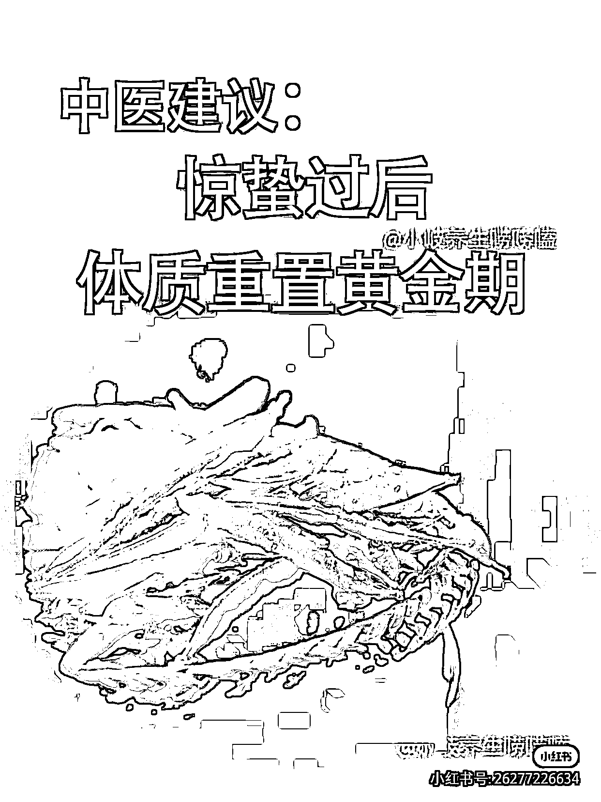

先用豆包反推提示词

[识图生成提示词 📷 - 豆包](https://www.doubao.com/chat/461170320901378)

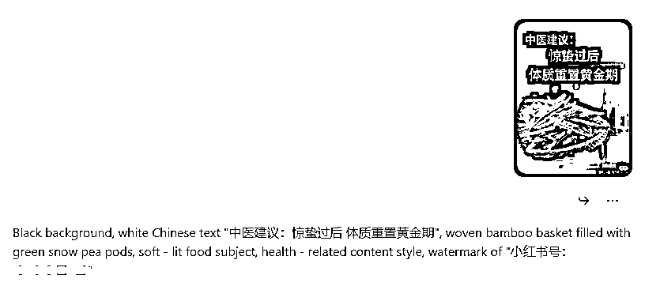

复制到即梦，直接生成

*即梦 AI - 一站式 AI 创作平台 *tool/home/?utm_medium=baiduads&utm_source=pinzhuan&utm_campaign=button)*

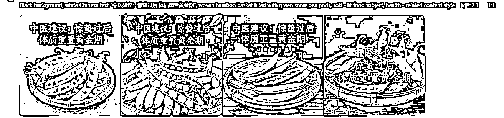

抽卡生成的，有些挺好

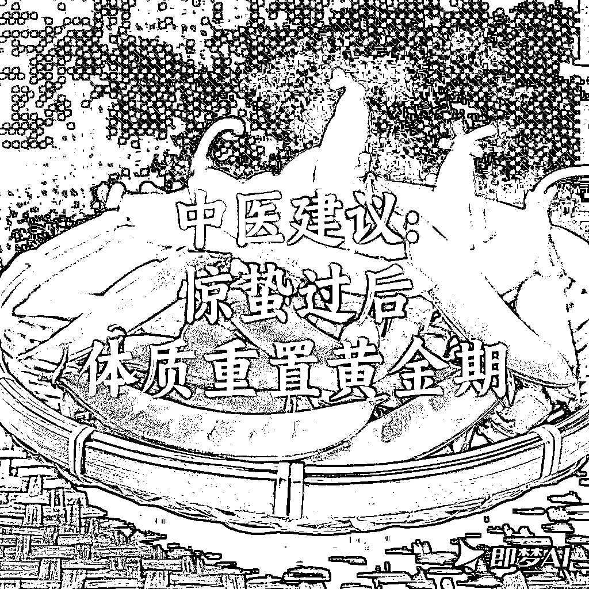

后面测试电商图，其他养生图，还可以

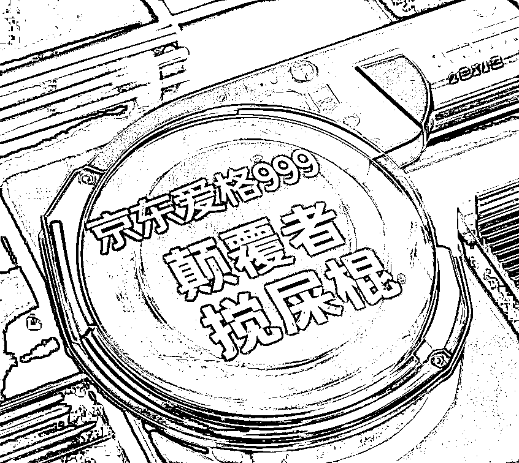

生成

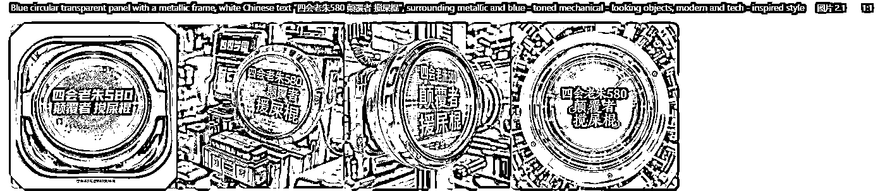

还测试了早餐赛道

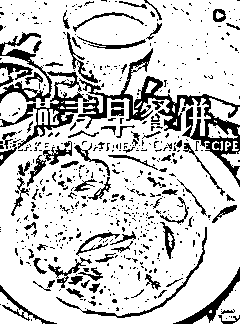

生成图片

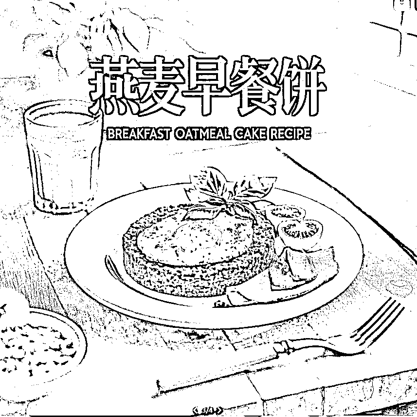

有很多文字的生成不太友好

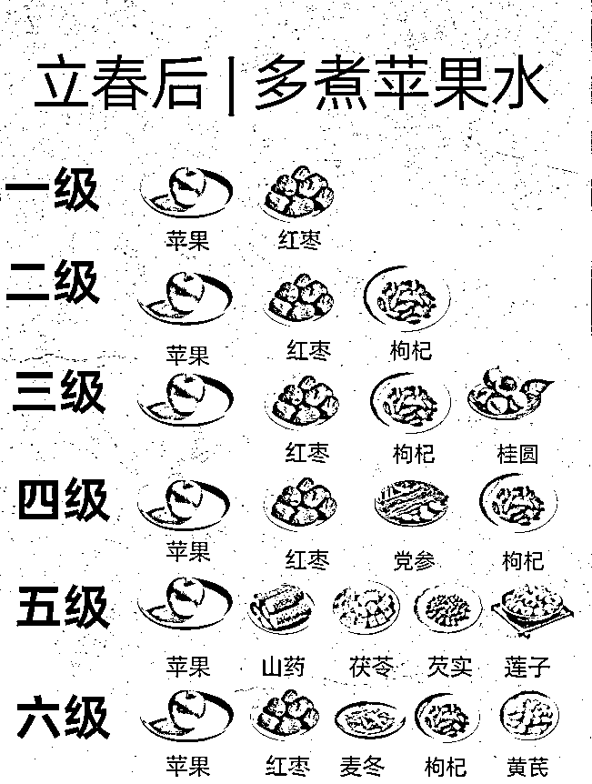

生成图

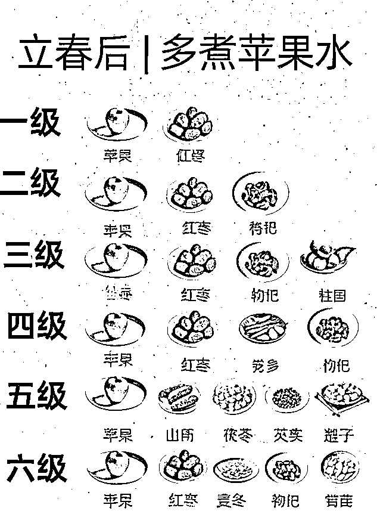

对于插画、比较小的文字生成友好

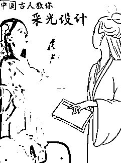

生成

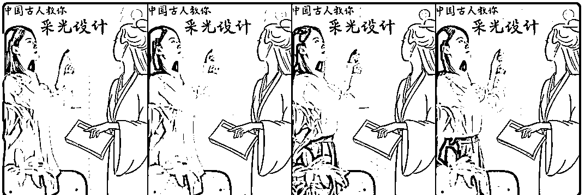

插画式

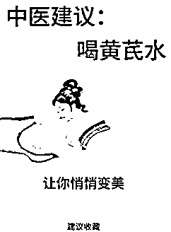

生成不错

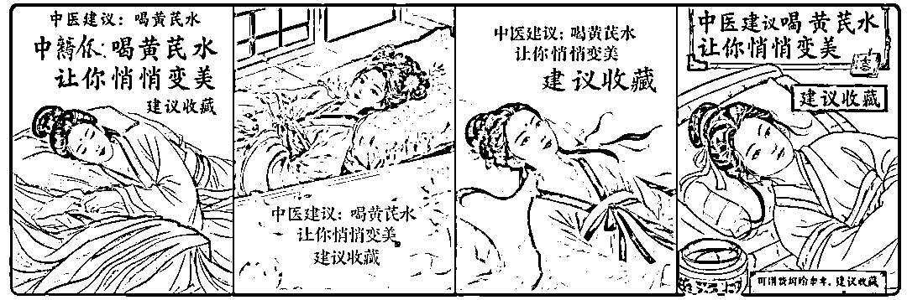

总结，结合豆包反推提示词，用即梦生成，可以伪原创图片，对于养生、早餐类图片、视频有不错的提效。

* * *

评论区：

张张 : 感谢，马上就试

大老朱 : 豆包反推提示词 智能体 [`doubao.com/bot/wovxNcwn`](https://doubao.com/bot/wovxNcwn)

张张 : 这个豆包另外的 app 吗

大老朱 : 同一个豆包， 电脑端好操作些

ᰔᩚ 泡泡糖 : 最近这个用 AI 生成的都很多人在推，还可以继续做吗？

miki : 据说容易违规，养生有很多不能说

ᰔᩚ 泡泡糖 : 是呢

ᰔᩚ 泡泡糖 : 是呢