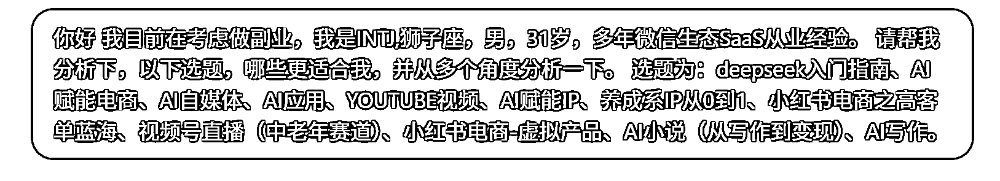

# 这期航海选题怎么选？还不让 deepseek 帮你选

> 原文：[`www.yuque.com/for_lazy/zhoubao/ynip66dcgzztydla`](https://www.yuque.com/for_lazy/zhoubao/ynip66dcgzztydla)

## (32 赞)这期航海选题怎么选？还不让 deepseek 帮你选

作者： 空白

日期：2025-03-11

航海那么多，想尝试了解的太多了。哪个才是真正适合自己的。我试了一下，问下 AI，排序竟然和我想报名的惊人相似，不犹豫了，这就上传。纠结的小伙伴们也可以试试 

以下是 AI 的回答：（前两个刚好是我看了很久的航海）

根据你的 INTJ 性格特质（战略规划型、逻辑性强、偏好独立工作）、狮子座特质（自信、创造力、领导欲）、微信生态 SaaS 从业背景，结合当前 AI 赛道红利和实操可行性，为你筛选出最适合的 3 个选题并深度分析：

---

第一梯队：核心推荐

1. AI 赋能 IP（综合适配度 95%）

核心优势：

- 性格契合：INTJ 擅长构建系统性框架，狮子座的个人魅力能强化 IP 辨识度，微信生态经验可直接复用私域流量运营方法论

- 技术壁垒：通过 AI 工具（如 ChatGPT+Midjourney+D-ID 数字人）实现 IP 内容矩阵的自动化生产，规避传统 IP 运营中 70%的重复劳动

- 变现闭环：知识付费（课程/咨询）+ SaaS 工具分销（如用 AI 批量生成微信裂变素材）+ 品牌联动的三级变现体系

落地路径：

1. 冷启动阶段：用 AI 生成行业洞察类内容（如《2025 微信生态 AI 工具全景图》），通过知乎/公众号建立专业背书

2. 矩阵搭建：克隆数字人分身同步运营视频号（技术解析类）和小红书（案例拆解类），日均内容产出量提升 3 倍

3. 私域转化：在微信生态设计 AI 互动式裂变活动（如"生成你的专属运营诊断报告"H5），精准筛选高净值用户

风险预警：需建立人工审核机制防止 AI 内容翻车，前期 20%核心内容仍需真人出镜强化信任

---

2. 小红书电商-虚拟产品（实操性 90%）

赛道红利：

- 小红书 2024 年虚拟商品 GMV 同比增长 280%，知识类产品客单价突破 2000 元（数据来源：小红书 Q4 财报）

- 微信生态经验可复用：虚拟商品交付链路（引流→转化→社群服务）与你熟悉的 SaaS 用户运营逻辑高度相通

选品策略：

- 技术型产品：AI 提示词库/微信生态运营模板（自动生成朋友圈剧本、社群 SOP）

- 人格化产品：INTJ 专属职业规划咨询（结合 MBTI+AI 测评工具）

- 轻交付产品：AI 绘画素材包（需规避版权风险，建议聚焦细分领域如"蛇年生肖国潮设计素材"）

运营技巧：

- 用 ChatGPT 批量生成 100+篇"高冷专业风"笔记标题（符合 INTJ 人设），例如：

《不讨好算法｜INTJ 的爆款笔记底层框架》

《狮子座的锋芒：如何把知识定价提高 300%》

- 通过微信客服号二次转化，设计阶梯式产品（9.9 元 AI 工具包→1999 元年度顾问服务）

---

3. AI 赋能电商（资源复用度 85%）

破局点选择：

- 微信生态独有场景：开发 AI 导购助手（替代传统商城客服），通过对话式推荐提升转化率，你熟悉的 SaaS 产品架构可快速落地

- 数据壁垒构建：训练垂直行业 GPT 模型（如中老年保健品话术库），需注意 2025 年新实施的《生成式 AI 服务备案管理办法》

差异化路径：

- 针对视频号直播中老年赛道，开发 AI 智能场控系统：

✓ 实时监测弹幕关键词自动推送优惠券

✓ 根据观众停留时长自动触发福袋活动

✓ 生成直播话术提词器（带方言识别功能）

合作资源：

- 优先对接曾合作过的微信服务商，用 SaaS 分成模式降低前期开发成本

- 与保健品/收藏品供应链谈判时，用 AI 生成竞品分析报告强化议价能力

---

第二梯队：备选方案

- AI 应用开发：需评估技术团队组建成本，建议从微信小程序+AI API 轻量级应用切入

- 养成系 IP：更适合 25 岁以下群体，与 31 岁职场精英人设存在冲突风险

- 视频号直播：中老年赛道需高频次互动，与 INTJ 偏好幕后策划的特质相悖

---

执行建议

1. 3 天验证期：用 AI 工具生成各赛道最小可行性产品（如 1 份虚拟商品详情页+3 篇小红书笔记）进行 AB 测试

2. 资源杠杆：将微信生态积累的 B 端客户转化为首批种子用户（例如提供免费 AI 运营诊断）

3. 风险管控：副业初期每周投入控制在 10 小时内，建议选择虚拟产品赛道实现"睡后收入"

需要任一赛道的详细 SOP 或工具清单，可告知具体方向为你定制方案。

* * *

评论区：

大洋 : [憨笑][憨笑]我也用 ai 和智能体辅助决策

花梨💫 : 我感觉，这个决策，你要把航海做什么投喂给他，避免它只猜字面意思，以及你自己的需求偏好、技能倾向各种信息吧

空白 : 哈哈 你说的很对，不过昨天只是一时心起，比较粗糙

阿尔托莉雅 : 我给他说我是 infp 适不适合做短视频，他说适合[呲牙]

空白 : 我已经有如何选择航海的 2.0 思路了。这就手搓一个

阿尔托莉雅 : 我就报名 YouTube 短视频了

花梨💫 : 哈哈哈，我看亦仁发的小灯塔，如何做重要决策，说航海是可逆决策，是可以他人（或者用工具）代劳的

空白 : 666