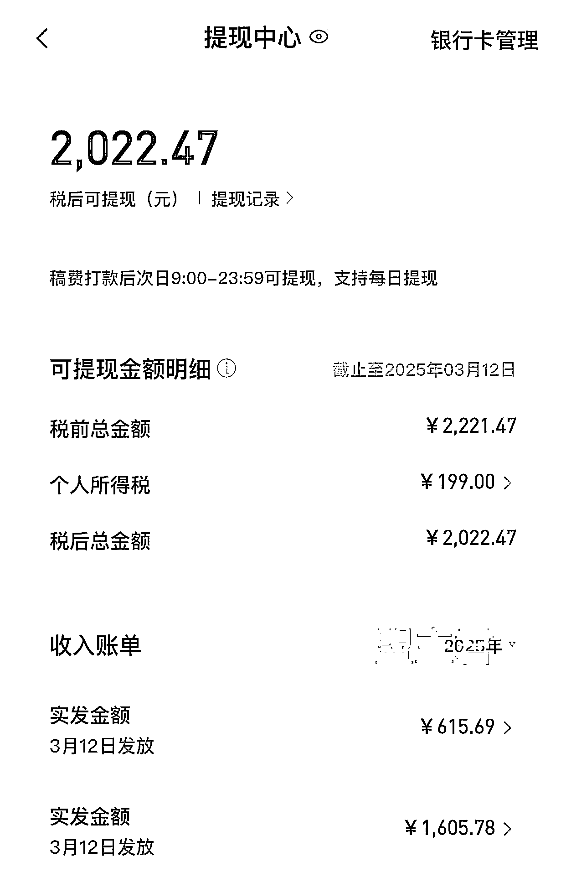
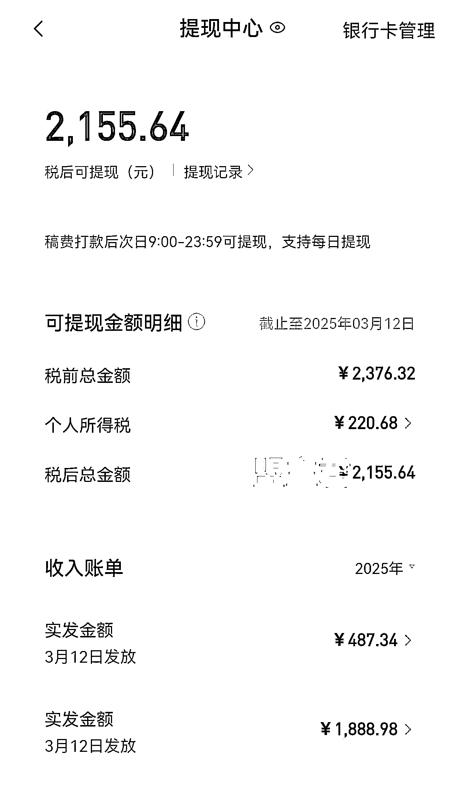
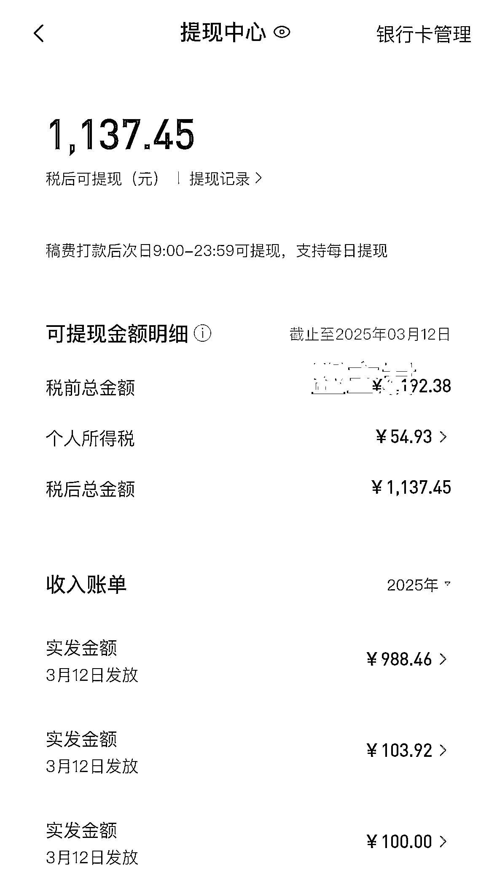
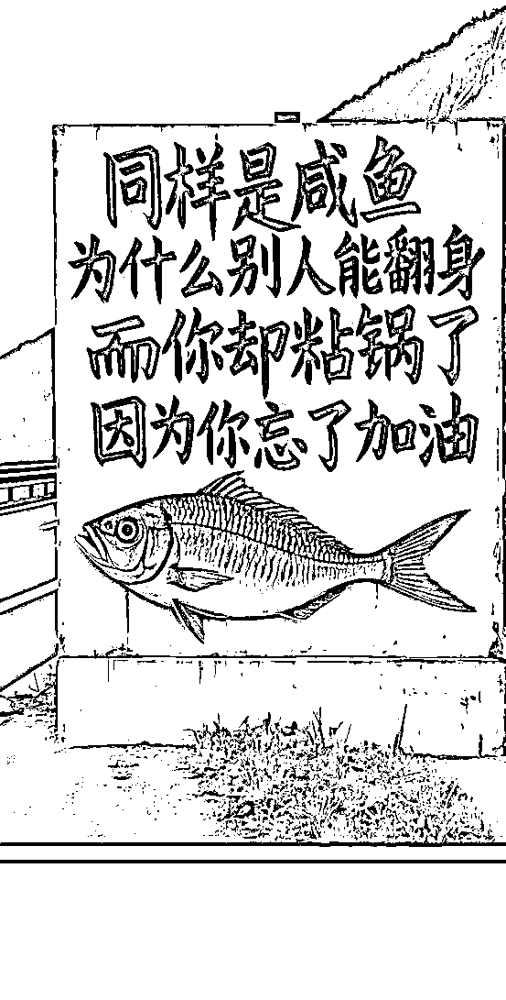

# 一起靠 AI 慢慢变富，掌握 AI 写作你就是最强王者

> 原文：[`www.yuque.com/for_lazy/zhoubao/rt5gkf3mupd0pg1g`](https://www.yuque.com/for_lazy/zhoubao/rt5gkf3mupd0pg1g)

## (32 赞)一起靠 AI 慢慢变富，掌握 AI 写作你就是最强王者

作者： 盟主君

日期：2025-03-13

大家好，我是盟主君，一个靠 AI 变现超 100w+的 90 后创业者。

今天又来给大家报喜了。

目前三个账号的收入比较稳定，由于 2 月份是开年，需要处理的事情比较多，所以账号发布的文章数量只有原先的三分之一，但是长尾流量还是很惊人的，上个月稿费很多的都来自几个月前的小说文章。

很多人都在说我学习了 AI，并且使用了 AI 来写作，来做视频，来做自媒体。但学到最后都没有得到正反馈。

同样是咸鱼，为什么你翻不了身，缺的只是加油吗？

那么请看今天的分享

[`rcn71rsvb3w5.feishu.cn/wiki/Pu37wH4TMiCJ21kJgSFcFXeXnnd?from=from_copylink`](https://rcn71rsvb3w5.feishu.cn/wiki/Pu37wH4TMiCJ21kJgSFcFXeXnnd?from=from_copylink)

* * *

评论区：

testcase : 最后那个链接没打开权限看不了哦

十二 : 大佬，这是什么软件后台