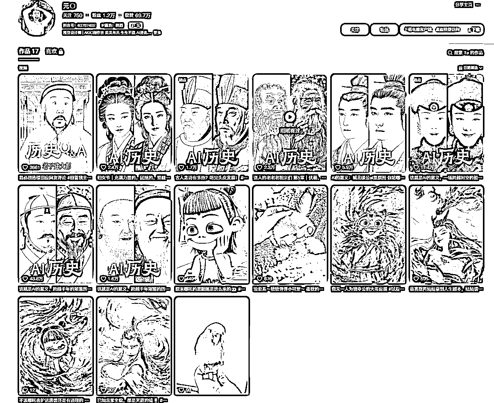
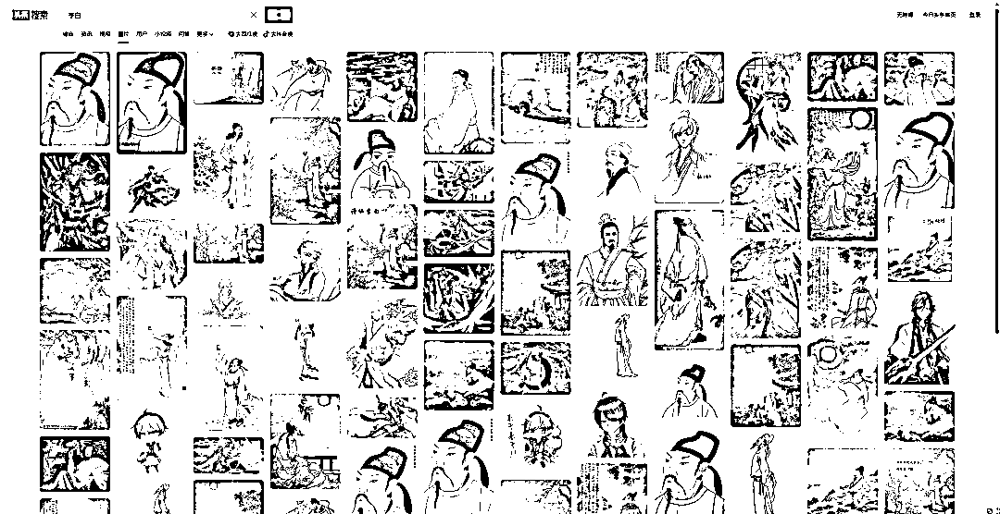
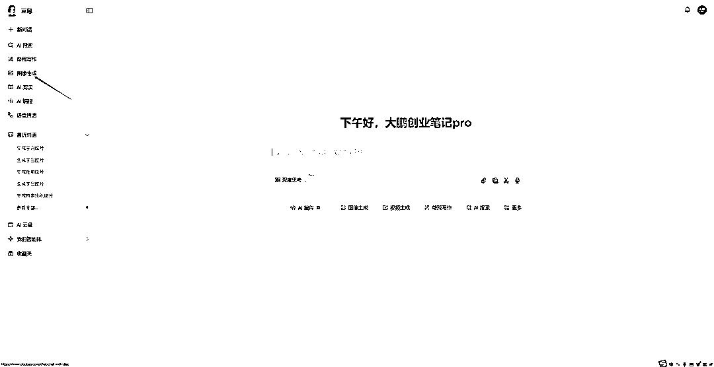
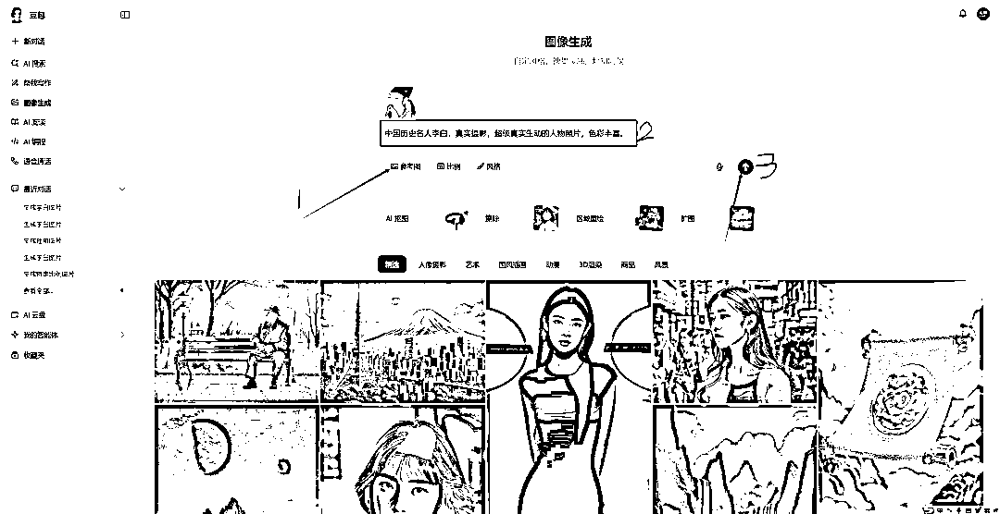
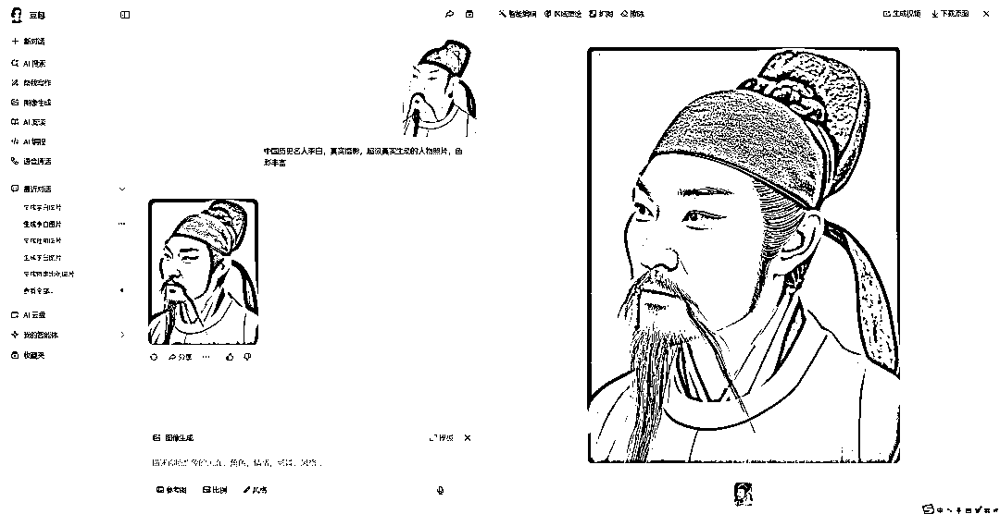
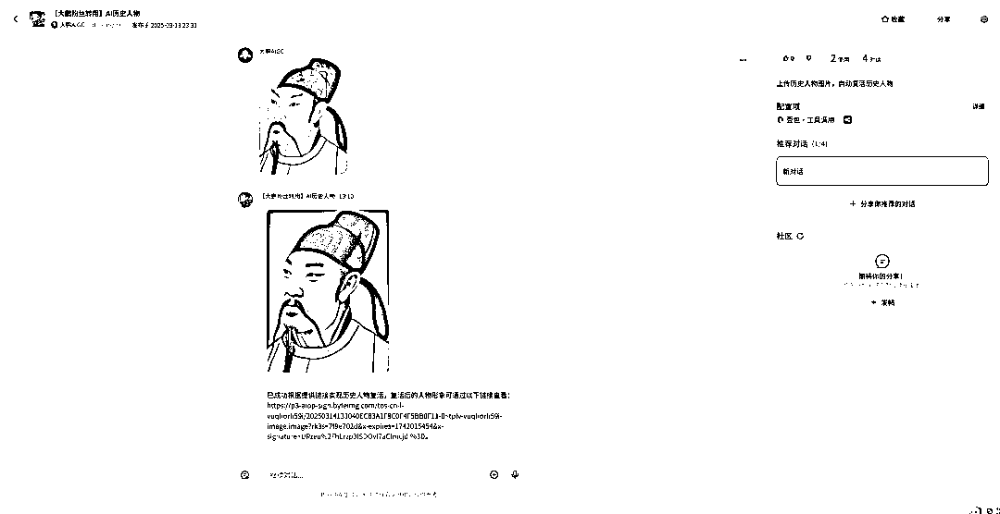
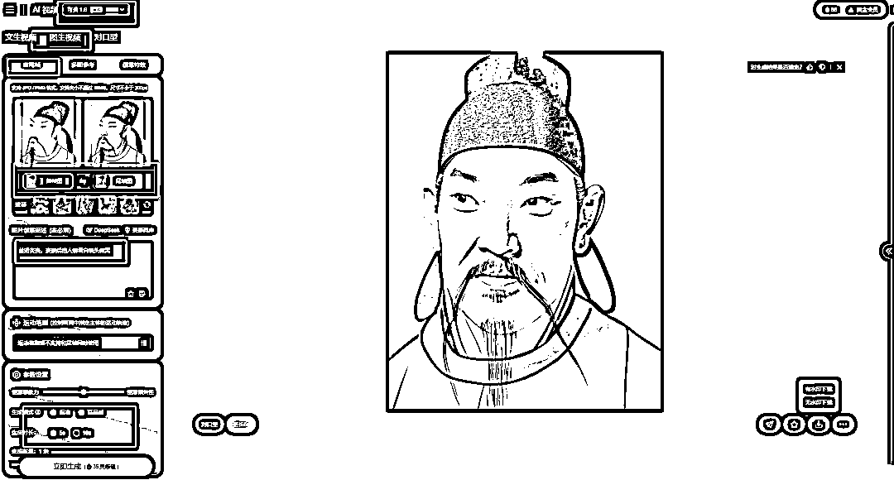

# 8 条作品涨粉破万，单条视频点赞 40W+，AI 历史人物复活视频制作全流程拆解

> 原文：[`www.yuque.com/for_lazy/zhoubao/gfdxvz6xy3qbz73w`](https://www.yuque.com/for_lazy/zhoubao/gfdxvz6xy3qbz73w)

## (25 赞)8 条作品涨粉破万，单条视频点赞 40W+，AI 历史人物复活视频制作全流程拆解

作者： 大鹏

日期：2025-03-14

#### 大家好，我是大鹏

#### 最近刷抖音的时候看到了一个账号流量非常夸张！

#### 最近发的 *8 条视频点赞都上万，最好的一条有 40W+的点赞* ，这播放量估计得上千万了

#### **这难道就是最新的流量密码？**

#### 仔细观察博主的作品就会发现，在最开始他发的作品比较乱，又是小动物又是哪吒的，播放量平平无奇

但突然画风一转发了一条**AI 历史人物复活** 的视频，流量就直接一发不可收拾了...

可以看到这种视频形式还是比较简单的，就是把一张古代名人画像变成真人视频

经常做 AI 视频的老铁一看就知道咋回事儿了

不过肯定还是有很多人不太清楚的

今天大鹏就带大家来学习下这种视频是怎么制作的。

**废话不多说直接上实操：**

**一、图片素材**

首先我们需要先准备一张历史人物照片，可以在网页里面直接

但我还是建议大家在今日头条里面去找，图片比较多

打开今日头条网页版或者 app，直接搜索你想做的历史人物名称，比如我搜的是李白。

找一张相对清晰的图片下载下来，然后把图片裁剪成合适比例。

**二、图片复活**

有了画像之后就是要把图片复活了

制作工具的话，很多博主推荐用即梦，但我试了下来结果并不怎么好

经过我测试推荐使用豆包，效果好还能白嫖~

打开豆包 AI，选择图像生成功能

点击导入参考图，把我们下载好的李白图片上传上去，图片比例不用选，系统默认原图比例是一样的

简单写一下提示词，比如我写的是： *中国历史名人李白，真实摄影，超级真实生动的人物照片，色彩丰富。*

最后点击生成，稍等一会儿图片就是生成好了，效果还不错，我们之间保存下来。

**PS：**

如果你嫌麻烦，也可以用在扣子商单搜索我给大家制作的这个智能体

只需要上传图片，即可自动生成复活后的历史人物照片，点击下方链接即可下载保存， *而且图片高清无水印***，** 高效创作，一步到位。

**三、图片生成视频**

图片生成好之后我们就需要把图片变成动态视频，这一步也非常简单

打开可灵 AI，选择点击图生视频，选择首尾帧功能，把原图上传到首帧位置，复活后的图片上传到尾帧这里

输入图片转视频提示词： *丝*** *滑变*** *换，变换后的人物看向镜头微笑*

生成质量选择高质量，时长选择 5s 就可以了

然后点击生成，稍等几分钟，视频就生成好了

同理，再做几个其他人物的视频

**四、剪辑成片**

视频生成好之后就可以把所有生成好的视频一起导入到剪映里，加上背景音乐、特效啥的就完成了。

这一步太简单了就不给大家演示了~

以上就是这种 AI 历史人物复活视频玩法的详细教程了，你学会了吗?

我是大鹏，专注 AI 视频搞钱，如果你对 AI 视频也感兴趣的话，可以找我来聊一聊~

* * *

评论区：

十一(Eleven) : 好棒，感谢分享[玫瑰]

旭哥 : 真没想到这种也有流量[捂脸]剪辑古诗太费劲了

执笔 : 直接提示词出来放到 AI 图像生成 都不需要去即梦 AI 在生成图片了